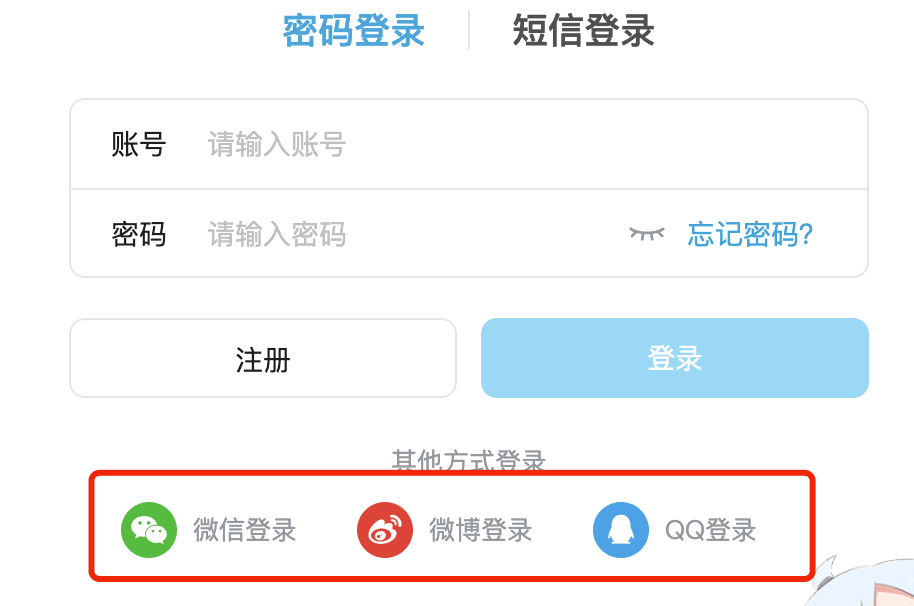
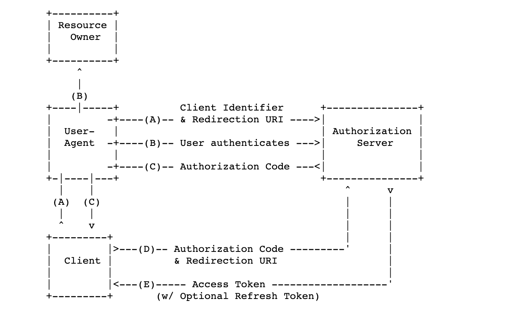
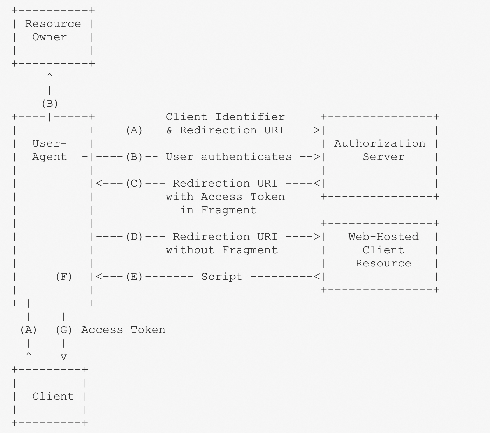
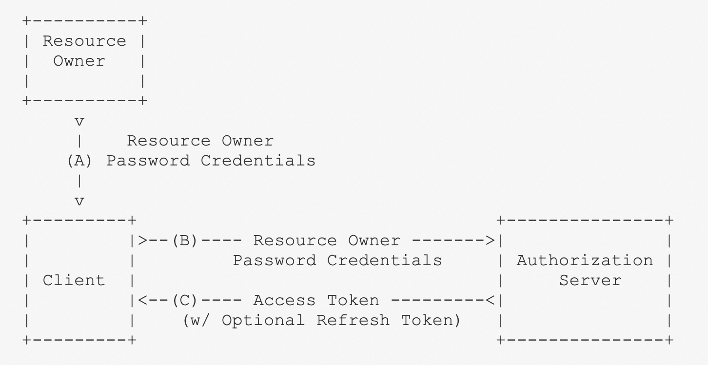

# OAuth 2.0 认证和攻击面

# [](#0x00-%E5%89%8D%E6%8F%90 "0x00 前提")0x00 前提

最近在测试公司的 oauth 认证方面的问题，要再去熟悉一下这块，所以把这块写一下。

# [](#0x01-OAuth2-0-%E6%A6%82%E5%BF%B5 "0x01 OAuth2.0 概念")0x01 OAuth2.0 概念

OAuth 是一个关于授权（authorization）的开放网络标准，目前是最常见最通用的一个授权协议。

什么地方是 OAuth2.0，其实这个东西非常的常见，

我们的快捷登录其实都是这个，拿这个举例子

[](http://zeo.cool/images/new202302231647204.png)

那么为什么要用这个呢这个？

其实道理很简单，我们的网站首先使用这个快捷登录肯定是很方便，那么第三方网站和我们网站肯定是不能互相相信对方的，不可能将用户信息交给对方保存，所以一般情况下 OAuth 允许用户授予此访问权限，而无需将其登录凭据暴露给请求的应用程序。这意味着用户可以选择他们想要共享的数据，而不必将其帐户的账号密码交给第三方。

# [](#0x02-%E6%B5%81%E7%A8%8B%E6%A2%B3%E7%90%86 "0x02 流程梳理")0x02 流程梳理

为了方便理解，直接用例子展示，首先我们要分清楚各个角色，我们简单分出 4 个部分：

**resource owner（资源拥有者）**：就是用户

**resource server（资源服务器）**：我们想要快捷登录的的网站 zeo.cool

**User Agent**：指浏览器。

**authorization server（认证服务器）**：三方授权服务器（例如 Google 授权服务器），服务提供商专门用来处理认证授权的服务器，认证成功后向客户端发出访问令牌资源所有者身份验证，获取授权。

**client\_id** ：这个表示网站后台，我们的 zeo.cool 的网站后端

在实际中有四种实现方式：

-   授权码模式
-   简化模式
-   密码模式
-   客户端模式

# [](#0x03-%E5%89%8D%E6%8F%90 "0x03 前提")0x03 前提

某一个第三方应用 zeo.cool, 应用先去 Google 认证中心进行注册。

提供一个回调地址 `https://zeo.cool/oauth_calback`

然后会得到：

ClientID = 888888：这个是我的网站 zeo.cool 的一个标识符号

ClientsecretID = 6666666：这个类似私钥，要好好保存，绝对不能公开

# [](#0x04-%E4%BB%A4%E7%89%8C%E6%A8%A1%E5%BC%8F "0x04 令牌模式")0x04 令牌模式

在 OAuth2.0 中最常用的当属授权码模式

授权码模式（authorization code）是功能最完整、流程最严密的授权模式。它的特点就是通过客户端的后台服务器，与”服务提供商”的认证服务器进行互动。

[](http://zeo.cool/images/new202302231735214.png)

注意：说明步骤 (A)、(B) 和 (C) 的线条在通过用户代理时被分成了两部分。在它们通过用户代理时被分成两部分。

（A）用户访问客户端，客户端将用户引导向认证服务器

> 客户端申请认证的 URI，包含以下参数：
> 
> -   response\_type：表示授权类型，必选项，此处的值固定为”code”
>     
> -   client\_id：表示客户端的 ID，必选项
>     
> -   redirect\_uri：表示重定向 URI，可选项
>     
> -   scope：表示申请的权限范围，可选项
>     
> -   state：可以指定任意的随机字符串，可选项
>     

```tools
pf
```

|     |     |
| --- | --- |
| ```plain<br>1<br>``` | ```plain<br>https://www.google.com/v1/oauth/authorize?response_type=code&client_id=888888&redirect_uri=CALLBACK_URL&scope=read&state=dslakf54jlk5li54j<br>``` |

（B）用户选择是否给予客户端授权。

（C）如用户给予授权，Google 认证服务器将用户引导向客户端指定的 redirection uri，同时加上授权码 code。（用户点击授权后，Google 引导用户访问 A 步骤中指定的重定向 url，并带着授权码 code 和 state）

> -   code：表示授权码，必选项。该码的有效期应该很短，通常设为 10 分钟，客户端只能使用该码一次，否则会被授权服务器拒绝。该码与客户端 ID 和重定向 URI，是一一对应关系。
>     
> -   state：可以指定任意的随机字符串，可选项
>     

```tools
pf
```

|     |     |
| --- | --- |
| ```plain<br>1<br>``` | ```plain<br>https://zeo.cool/oauth_calback?code=SplxlOBeZQQYbYS6WxSbIA&state=dslakf54jlk5li54j<br>``` |

（D）zeo.cool 后段客户端收到 code 后，通过后台的服务器向认证服务器发送 code 和 redirection uri。（zeo.cool 带着接收到（C）步骤中的请求后，用授权码发送下面的请求去找 Google 认证服务器要 token）

> -   grant\_type：表示使用的授权模式，必选项，此处的值固定为”authorization\_code”。
>     
> -   code：表示上一步获得的授权码，必选项。
>     
> -   redirect\_uri：表示重定向 URI，必选项，且必须与 A 步骤中的该参数值保持一致。
>     
> -   client\_id：表示客户端 ID，必选项。
>     

(服务器后端操作)

```tools
awk
```

|     |     |
| --- | --- |
| ```plain<br>1<br>``` | ```plain<br>https://www.Google.com/v1/oauth/token?client_id=888888&grant_type=authorization_code&code=AUTHORIZATION_CODE&redirect_uri=CALLBACK_URL<br>``` |

（E）Google 认证服务器验证 code 和 redirection uri，确认无误后，响应客户端访问令牌（access token）和刷新令牌（refresh token）。（响应（D）步骤的数据）

> -   access\_token：表示访问令牌
>     
> -   token\_type：表示令牌类型，该值大小写不敏感
>     
> -   expires\_in：表示过期时间
>     
> -   refresh\_token：表示更新令牌
>     
> -   scope：表示权限范围
>     

```tools
json
```

|     |     |
| --- | --- |
| ```plain<br>1<br>2<br>3<br>4<br>5<br>6<br>7<br>``` | ```plain<br>{<br>   "access_token":"sdjlkh13khekj2hjkhd23kjd",<br>   "token_type":"xxx",<br>   "expires_in":3600,<br>   "refresh_token":"zxfdcsa34323dxccc3",<br>   "example_parameter":"xxxxx"<br> }<br>``` |

最后我的网站 zeo.cool 就可以拿着 access\_token 去找 Google 去换取相应的信息了

## [](#%E4%B8%BA%E4%BB%80%E4%B9%88%E8%A6%81%E5%85%88%E5%8F%91%E6%94%BE%E6%8E%88%E6%9D%83%E7%A0%81%EF%BC%8C%E5%86%8D%E7%94%A8%E6%8E%88%E6%9D%83%E7%A0%81%E6%8D%A2%E4%BB%A4%E7%89%8C%EF%BC%9F "为什么要先发放授权码，再用授权码换令牌？")为什么要先发放授权码，再用授权码换令牌？

这是因为浏览器转向（通常就是一次 HTTP 302 重定向）对于用户是可见的，换言之，授权码可能会暴露给用户以及用户机器  
上的其他程序，但由于用户并没有 Clientsecret，而只有授权码是无法换取到令牌的，所以避免了令牌在传输转向过程中被泄  
漏的风险。

##### [](#)

# [](#0x05-%E4%BB%A4%E7%89%8C%E6%A8%A1%E5%BC%8F-%E6%94%BB%E5%87%BB%E9%9D%A2 "0x05 令牌模式-攻击面")0x05 令牌模式 - 攻击面

## [](#1-%E6%8E%88%E6%9D%83%E7%A0%81%E6%A8%A1%E5%BC%8F%E4%B8%8B%E7%9A%84%E5%AE%89%E5%85%A8%E9%97%AE%E9%A2%98%E5%B8%B8%E5%87%BA%E7%8E%B0%E5%9C%A8CSRF%E6%94%BB%E5%87%BB%EF%BC%9A "(1)授权码模式下的安全问题常出现在CSRF攻击：")(1) 授权码模式下的安全问题常出现在 CSRF 攻击：

（A）步骤当中，有一个参数是可选的 state，state 并放在 session 中，这个是服务端生成的一个随机字符串，

然后再在（A）步骤中的请求中带上 state，Google 返回 url 带有授权码和 state 的我们的网站

这个时候需要在在服务器后端会去对比这个 state 是否一致，用来防止 csrf 攻击

如果没有 state，就会存在一种攻击手法。

1、hacker 先获取自己的 code

2、制作一个 CSRF 页面，去做 C 步骤，去让受害者用过自己的 cookie 去做绑定

3、那么最终就会，把受害者的 cookie 绑定到 hacker 的账户上

## [](#2-%E5%9B%9E%E8%B0%83URL%E6%A0%A1%E9%AA%8C%E9%97%AE%E9%A2%98 "(2) 回调URL校验问题")(2) 回调 URL 校验问题

如果回调校验有问题 like

利用一下绕过的正则的技巧，可以把跳转到 hacker.com 这样你的 code 也一起带过去

就可以利用这个 code 来做后续的问题

```tools
pf
```

|     |     |
| --- | --- |
| ```plain<br>1<br>``` | ```plain<br>https://www.google.com/v1/oauth/authorize?response_type=code&client_id=888888&redirect_uri=www.zeo.cool@www.hacker.com?call_back&scope=read&state=dslakf54jlk5li54j<br>``` |

# [](#0x06-%E7%AE%80%E5%8C%96%E6%A8%A1%E5%BC%8F%EF%BC%88%E9%9A%90%E5%BC%8F%E6%8E%88%E6%9D%83%E6%A8%A1%E5%BC%8F%EF%BC%89 "0x06 简化模式（隐式授权模式）")0x06 简化模式（隐式授权模式）

简化模式（implicit grant type）不通过第三方应用程序的服务器，

直接在浏览器中向认证服务器申请令牌，跳过了”授权码”这个步骤，因此得名。

所有步骤在浏览器中完成，令牌对访问者是可见的，且客户端不需要认证。

[](http://zeo.cool/images/new202302251023643.png)

（A）客户端将用户导向认证服务器。

> A 步骤中，客户端发出的 HTTP 请求，包含以下参数：
> 
> -   response\_type：表示授权类型，此处的值固定为”token”，必选项。
>     
> -   client\_id：表示客户端的 ID，必选项。
>     
> -   redirect\_uri：表示重定向的 URI，可选项。
>     
> -   scope：表示权限范围，可选项。
>     
> -   state：表示客户端的当前状态，可以指定任意值，认证服务器会原封不动地返回这个值。
>     

```tools
pf
```

|     |     |
| --- | --- |
| ```plain<br>1<br>``` | ```plain<br>https://www.Google.com/authorize?response_type=token&client_id=CLIENT_ID&redirect_uri=CALLBACK_URL&scope=read&state=xxx<br>``` |

（B）用户决定是否给予客户端授权。

（C）假设用户给予授权，认证服务器将用户导向客户端指定的”重定向 URI”，并在 URI 的 Hash 部分包含了访问令牌。

> C 步骤中，认证服务器回应客户端的 URI，包含以下参数：
> 
> -   access\_token：表示访问令牌，必选项。
>     
> -   token\_type：表示令牌类型，该值大小写不敏感，必选项。
>     
> -   expires\_in：表示过期时间，单位为秒。如果省略该参数，必须其他方式设置过期时间。
>     
> -   scope：表示权限范围，如果与客户端申请的范围一致，此项可省略。
>     
> -   state：如果客户端的请求中包含这个参数，认证服务器的回应也必须一模一样包含这个参数。
>     

```tools
sas
```

|     |     |
| --- | --- |
| ```plain<br>1<br>``` | ```plain<br>https://www.example.com/callback#access_token =ACCESS_TOKEN&state=xyz&token_type=example&expires_in=3600&state=xxx<br>``` |

**使用场景**

-   适用于所有无 Server 端配合的应用
    
-   如手机/桌面客户端程序、浏览器插件。
    
-   基于 JavaScript 等脚本客户端脚本语言实现的应用。
    

# [](#0x07-%E7%AE%80%E5%8C%96%E6%A8%A1%E5%BC%8F%E6%94%BB%E5%87%BB%E9%9D%A2 "0x07 简化模式攻击面")0x07 简化模式攻击面

简化授权模式下的账户劫持

**（1）那么实际场景就是当 state 参数不存在的时候可以进行 csrf 攻击**

**（2）伪造 redirect\_uri，提供商没有做好 redirect\_uri 的校验**

那我们需要做的是找到受信任的网站下的 xss 漏洞，然后重定向获取劫持 access\_token，在获取到 access\_token 后完整攻击

# [](#0x08-%E5%AF%86%E7%A0%81%E6%A8%A1%E5%BC%8F "0x08 密码模式")0x08 密码模式

密码模式（Resource Owner Password Credentials Grant）中，用户向客户端提供自己的用户名和密码。客户端使用这些信息，向”服务商提供商”索要授权。

**这种直接使用账号密码的情况极少，因为有违背最初的设计。**

[](http://zeo.cool/images/new202302232217176.png)

（A）用户向客户端提供用户名和密码。

（B）客户端将用户名和密码发给认证服务器，向后者请求令牌。

> B 步骤中，客户端发出的 HTTP 请求，包含以下参数：
> 
> -   grant\_type：表示授权类型，此处的值固定为”password”，必选项。
>     
> -   username：表示用户名，必选项。
>     
> -   password：表示用户的密码，必选项。
>     
> -   scope：表示权限范围，可选项。
>     

```tools
pgsql
```

|     |     |
| --- | --- |
| ```plain<br>1<br>``` | ```plain<br>https://www.google.com/token?grant_type=password&username=USERNAME&password=PASSWORD&client_id=CLIENT_ID<br>``` |

（C）认证服务器确认无误后，向客户端提供访问令牌。

```tools
json
```

|     |     |
| --- | --- |
| ```plain<br>1<br>2<br>3<br>4<br>5<br>6<br>7<br>``` | ```plain<br>{<br>  "access_token":"df908f890sdf09asd890",<br>  "token_type":"example",<br>  "expires_in":3600,<br>  "refresh_token":"saf43r243fd34f4fg32g",<br>  "example_parameter":"example_value"<br>}<br>``` |

# [](#0x09-%E5%AE%A2%E6%88%B7%E7%AB%AF%E6%A8%A1%E5%BC%8F "0x09 客户端模式")0x09 客户端模式

客户端模式（Client Credentials Grant）指客户端以自己的名义，而不是以用户的名义，向”服务提供商”进行认证。严格地说，客户端模式并不属于 OAuth 框架所要解决的问题。在此不做过多解释，只了解过程。

**这个大多数在微服务的情况下，都是后端在自己做授权任务**

[](http://zeo.cool/images/new202302232322527.png)

该模式过程如下：

（A）客户端向认证服务器进行身份认证，并要求一个访问令牌。

> -   granttype：表示授权类型，此处的值固定为”client\_credentials”，必选项。
>     
> -   scope：表示权限范围，可选项。
>     

```tools
awk
```

|     |     |
| --- | --- |
| ```plain<br>1<br>``` | ```plain<br>https://www.example.com/token?grant_type=client_credentials<br>``` |

（B）认证服务器确认无误后，向客户端提供访问令牌。

```tools
json
```

|     |     |
| --- | --- |
| ```plain<br>1<br>2<br>3<br>4<br>5<br>6<br>``` | ```plain<br>{<br>  "access_token":"2YotnFZFEjr1zCsicMWpAA",<br>  "token_type":"example",<br>  "expires_in":3600,<br>  "example_parameter":"example_value"<br>}<br>``` |

# [](#0x10-%E6%80%BB%E7%BB%93 "0x10 总结")0x10 总结

攻击面主要是，CSRF 绑定劫持漏洞，还有就是**回调 URL 未校验**，绕过校验，或者配合 url 跳转绕过啥的
