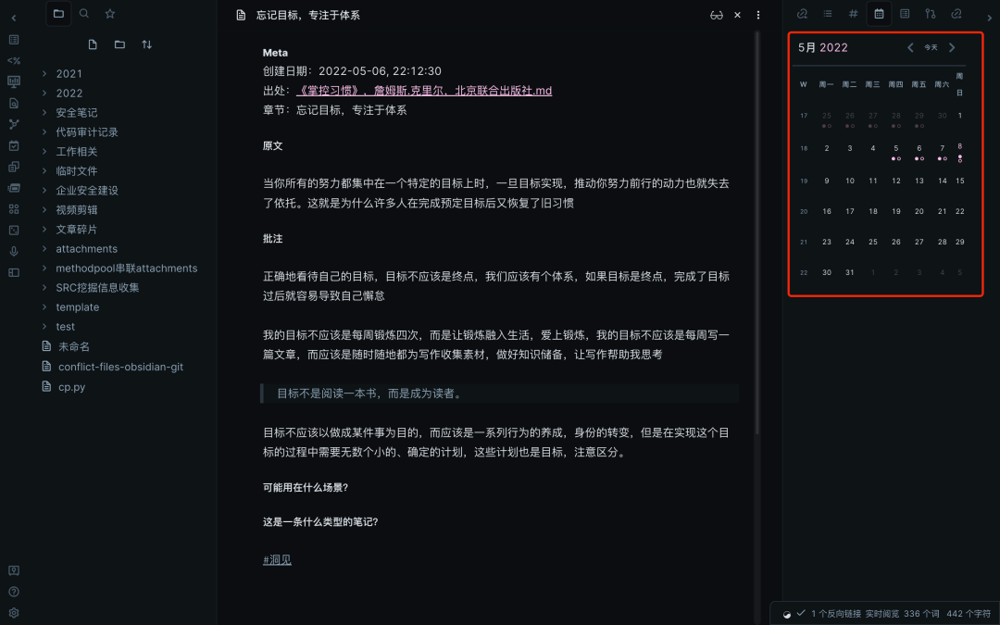
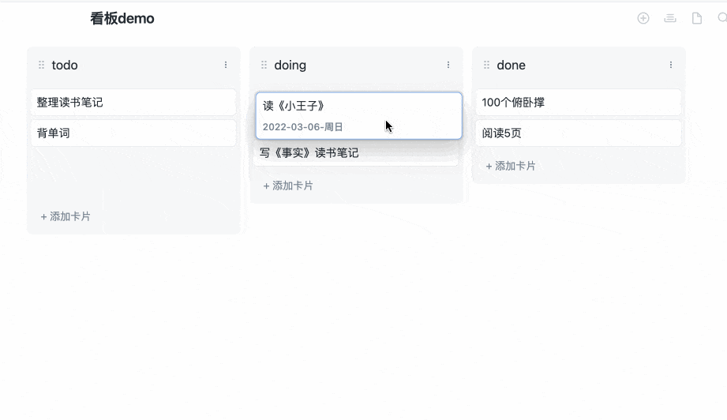
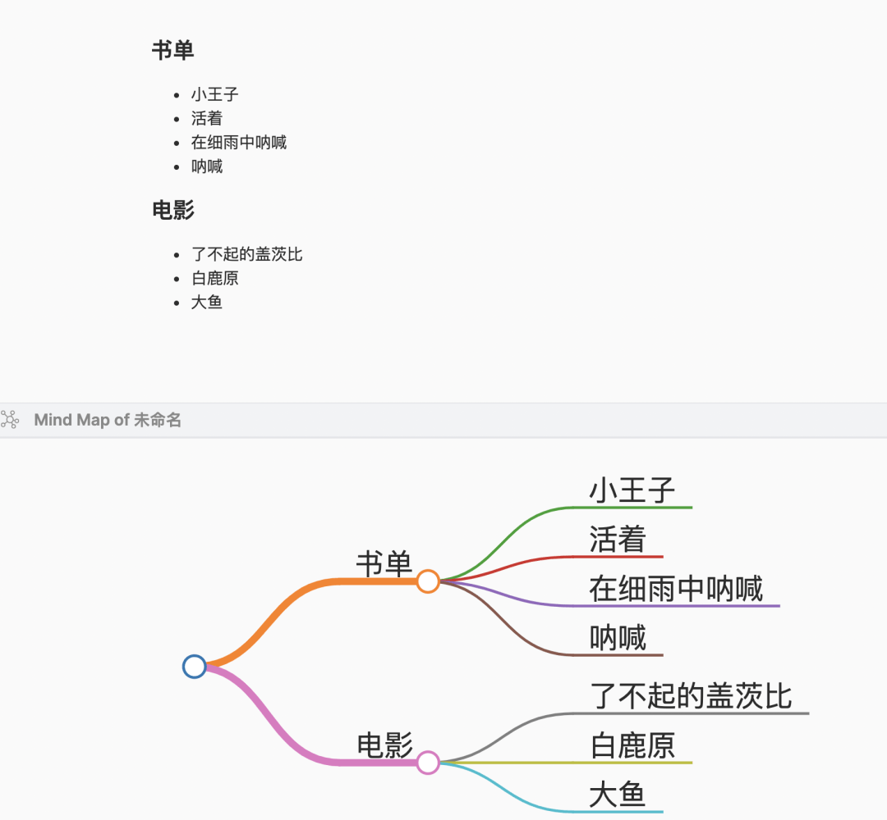
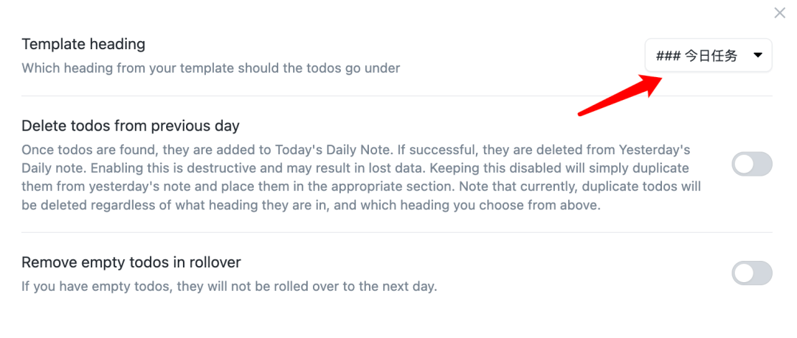
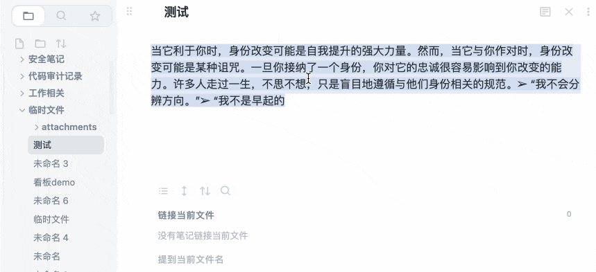
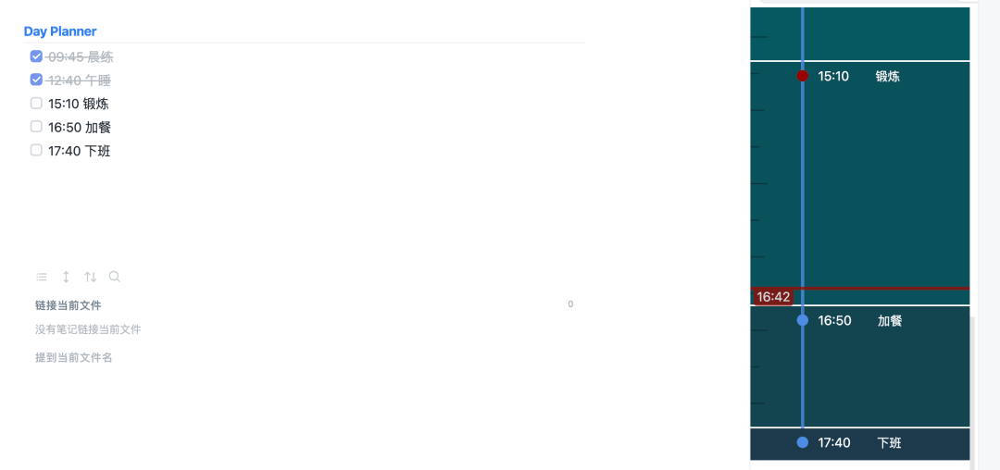
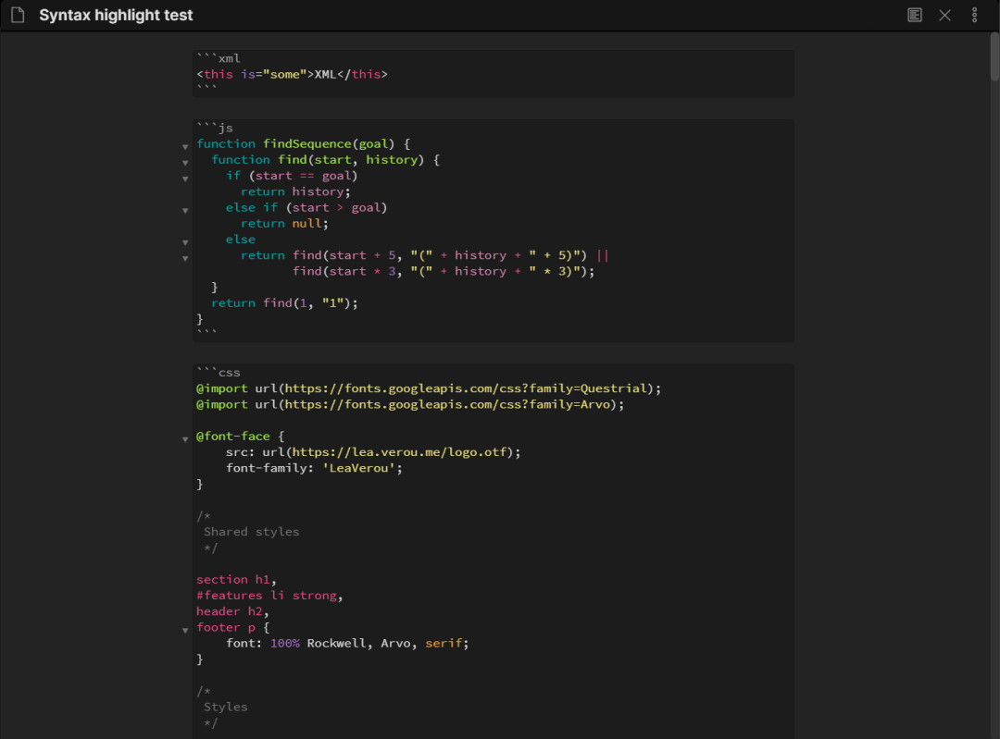
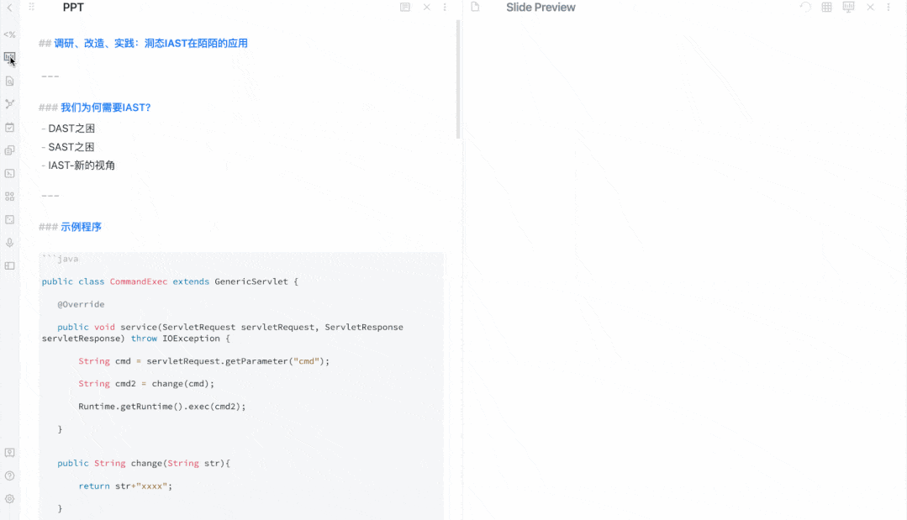

# Obsidian 插件推荐

在之前的文章里，我介绍了我在做任务管理、写读书笔记两个场景下的 workflow，其中穿插了一些插件的使用，这些插件极大地方便了我的工作流程，提高了我的工作效率。

如果说原生的 Obsidian 是一款性能强劲的赛车，那么插件系统则是赛车的氮气加速系统，Ob 搭配顺手的插件则像是往发动机中注入氮气，可以让我们在工作学习中高歌猛进。

顺手的插件可以提高自己的工作效率，可是想要找到自己中意的那一款也不是一件易事，Ob 社区截止到目前为止一共有 564 款插件，不能说是良莠不齐吧，只能说这些插件有不同的使命。而我在这一年多的使用过程中，筛选了几款可能对大家有帮助的插件

### Calendar

我使用频率极高的一款插件，这款插件可以在你的工作区增加一个日历看板

鼠标点击哪天就可以跳转到哪天对应的 daily notes，如果没有 daily notes，则会新建。

这个插件我在[用 Obsidian 打造自己的 Workflow](http://mp.weixin.qq.com/s?__biz=MzU5MDI0ODI5MQ==&mid=2247486169&idx=1&sn=f37872adb0c454704da8e17ccf80cb2a&chksm=fdc06ad5cab7e3c38b5f99af83212d74125aee9ce6339c81bc5c0c593f1ed4c1ce699a1a3a8a&scene=21#wechat_redirect)里提到过，此处不再展开。

ps：这个面板也可以收起来

### Obsidian Git

使用 git 实现多平台笔记同步，是官方笔记同步方案的免费解决方案，前文提到过

### Kanban

在 Ob 内实现看板系统，很多程序员朋友们肯定对这个界面很熟悉，看板用来做 todo list 或项目进度管理是一个不错的选择，但是我并没有选择它，因为我觉得简单的 checkbox 已经足够用了，简单明了，但是萝卜青菜各有所爱，说不定大家喜欢呢？

### mind map

一个思维导图插件，可以将 markdown 文件内容一键生成思维导图，感觉挺有意思，但是对我的帮助不大，如果需要画思维导图，我一定会选择专门的工具，考虑再三，还是将它放上来了，可能有朋友需要

### rollover daily todos

前文提到过，该插件可以让你前一天没有完成的 todo 项，自动流转到今天

怎么用呢？

比如说我的每日任务都是放在 daily notes 的【今日任务】标题下的：

那么我只需要在插件中配置好该模块

那么下一次我创建 daily notes 时，昨天没有勾选的 todo 项就会自动添加到今日的任务模块下

### templater

一个提供了很多模板语法的插件，它是 obsidian 核心插件 template 的扩展，比 ob 自带的 template 插件功能更强大，当然，学习成本自然也就更大

前文有过说明，不展开

### Media Extended

插件地址：https://github.com/aidenlx/media-extended

最开始了解到这个插件是在一个 B 站 up 主的视频里，通过这个插件可以增强 Ob 对多媒体文件的支持，比如在 Ob 中播放在线视频，而安装了这个插件过后，要想在你的笔记中嵌入一段在线视频也很简单，只需要用正常的 markdown 语法就行

由于是视频，Ob 的实时预览就失效了，必须手动点击预览才能看到视频画面，牛逼的是你可以直接引用视频的某个片段

`![[视频.mp4#t=5,15]]` 指的是你的视频的第 5 秒开始，第 15 秒结束，当你这样引用一个视频时，你预览并点击播放，就会从第 5s 播放到 15s。

这个插件主要是方便了喜欢对着视频做笔记的朋友，边听边记，而且可以引用到对应片段，方便下一次快速定位到知识点

如果要播放 bilibili 的视频，还需要安装 bilibili plugin

### Copy Block Link

如果读过我前两篇文章，应该知道 Ob 是支持文本块引用的，就是在一个文件里引用另一个文件中的某个文本块，但是 Ob 默认的引用方式不够丝滑，这个插件则是为了方便块引用而设计的，看图吧：

它为你选中的文本块生成了 id，并把指向该文本块的链接放入了剪贴板，你只需要到目标文件中 ctrl+v 就完成了文本块引用。

### cMenu

Ob 是一个 markdown 友好的编辑器，但是有一部分朋友对 markdown 并不熟悉，或者是更喜欢富文本编辑器那种点点点就能完成样式修改的方式，cMenu 就提供了这样一种可能性

使用它会在你编辑区的底部多上一排按钮，这些按钮就是用来一键添加 markdown 标记的

使用效果如下：

除此之外，上面展示的按钮仅仅是默认的，你还可以自定义添加，比如说把 markdown 的一级标题、二级标题也设置成按钮形式

### Day Planner

如果你喜欢指定按照时间线的方式制定每日计划，那么也许可以试试这个插件，当你安排好计划后，它会在你的工作区右侧生成一条时间轴

而且到了对应的任务时间，他还会弹出消息提醒你。

### Editor Syntax Highlight

编程语言语法高亮插件，这个东西对咱们这些搞技术的人来说，那是必备啊。

### Advanced Slides

虽然 Ob 本身提供了幻灯片演示的功能，但是样式不太好看，而这个则是增强版，可以使用 markdown 制作简易的 ppt，在一些非正式场合，比如内部团队分享还是可以使用的，我自己也用过一次，感觉还不错，效果如下：

### 彩蛋

主题推荐：我目前使用的是 Tings，听说 Yin and Yang、Blue Topaz、California Coast 也不错哦😯
