# PHP 代码审计 - 某 0Day 分析 - 先知社区

PHP 代码审计 - 某 0Day 分析

- - -

下载项目最新发行版

[](https://xzfile.aliyuncs.com/media/upload/picture/20240229234326-470aba9a-d719-1.png)

## 代码审计

### 漏洞定位

漏洞点在后台的模块市场，这里也是一个小技巧一般在这种引入外部模块的时候常常存在风险

[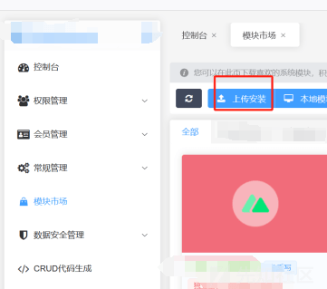](https://xzfile.aliyuncs.com/media/upload/picture/20240229234427-6bcd53c4-d719-1.png)

先抓个包看看源码位置

[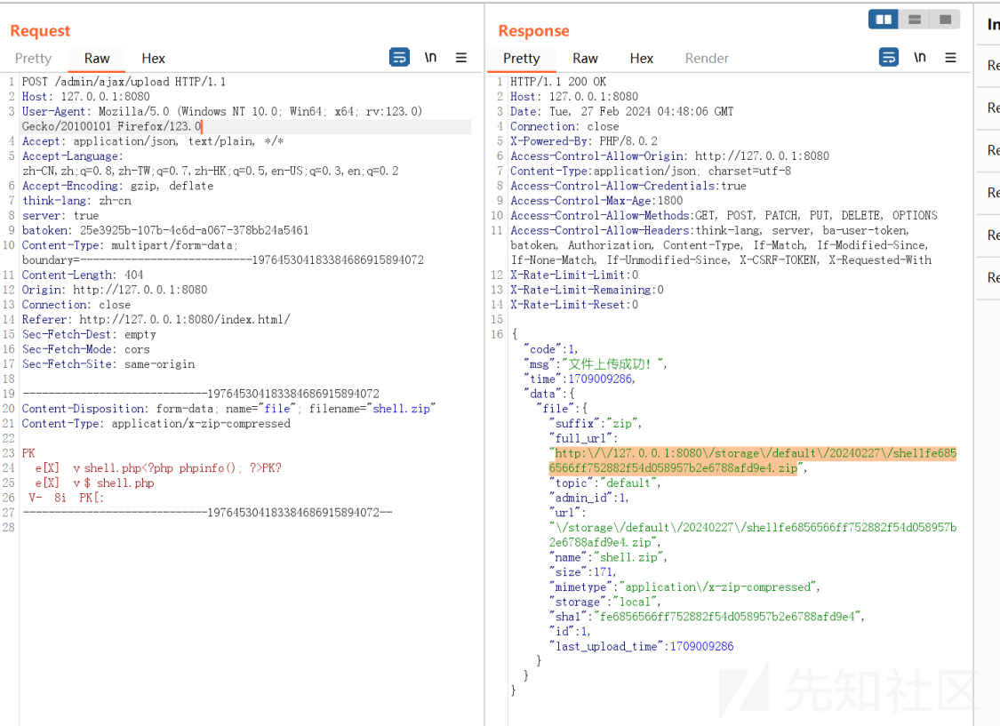](https://xzfile.aliyuncs.com/media/upload/picture/20240229233553-391787c0-d718-1.png)

查看哪里调用了 upload

[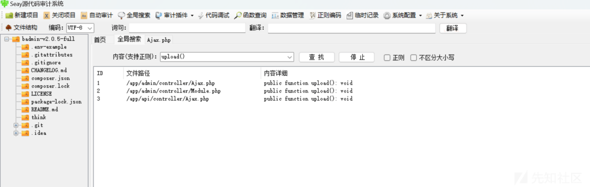](https://xzfile.aliyuncs.com/media/upload/picture/20240229233559-3cca3304-d718-1.png)

在 app/admin/controller/Module.php 中

[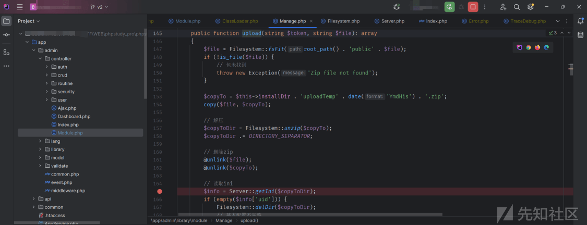](https://xzfile.aliyuncs.com/media/upload/picture/20240229234530-9135535a-d719-1.png)

对于代码进行查看，这里的上传检查了 token 因此只能时后台上传，并且在后续再次调用了一次 upload 方法并且带有 file 和 token 参数因此跟进查看

```plain
public function upload(): void
    {
        AdminLog::setTitle(__('Upload install module'));
        //对于$file 和 token 进行检测
        $file  = $this->request->get("file/s", '');
        $token = $this->request->get("token/s", '');
        if (!$file) $this->error(__('Parameter error'));
        if (!$token) $this->error(__('Please login to the official website account first'));

        $info = [];
        try {
            //存在upload方法
            $info = Manage::instance()->upload($token, $file);
        } catch (Exception $e) {
            $this->error(__($e->getMessage()), $e->getData(), $e->getCode());
        } catch (Throwable $e) {
            $this->error(__($e->getMessage()));
        }
        $this->success('', [
            'info' => $info
        ]);
    }
```

跟进到\\app\\admin\\library\\module 中

[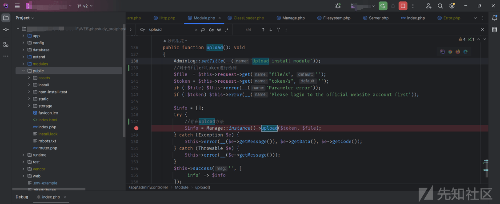](https://xzfile.aliyuncs.com/media/upload/picture/20240229234605-a62d2ecc-d719-1.png)

分析代码

```plain
public function upload(string $token, string $file): array
    {
        $file = Filesystem::fsFit(root_path() . 'public' . $file);
        if (!is_file($file)) {
            // 包未找到
            throw new Exception('Zip file not found');
        }
        //文件移动
        $copyTo = $this->installDir . 'uploadTemp' . date('YmdHis') . '.zip';
        copy($file, $copyTo);

        // 解压
        $copyToDir = Filesystem::unzip($copyTo);
        $copyToDir .= DIRECTORY_SEPARATOR;

        // 删除zip
        @unlink($file);
        @unlink($copyTo);

        // 读取ini
        $info = Server::getIni($copyToDir);
        if (empty($info['uid'])) {
            Filesystem::delDir($copyToDir);
            // 基本配置不完整
            throw new Exception('Basic configuration of the Module is incomplete');
        }

        // 安装预检 - 系统版本号要求、已安装模块的互斥和依赖检测
        try {
            Server::installPreCheck([
                'uid'           => $info['uid'],
                'sysVersion'    => Config::get('buildadmin.version'),
                'nuxtVersion'   => Server::getNuxtVersion(),
                'ba-user-token' => $token,
                'installed'     => Server::getInstalledIds($this->installDir),
                'server'        => 1,
            ]);
        } catch (Throwable $e) {
            Filesystem::delDir($copyToDir);
            throw $e;
        }
        //获取ini中的uid
        $this->uid        = $info['uid'];
        //把原本解压的文件目录改名为modules/ + info.ini中的uid/
        $this->modulesDir = $this->installDir . $info['uid'] . DIRECTORY_SEPARATOR;

        $upgrade = false;
        if (is_dir($this->modulesDir)) {
            $oldInfo = $this->getInfo();
            if ($oldInfo && !empty($oldInfo['uid'])) {
                $versions = explode('.', $oldInfo['version']);
                if (isset($versions[2])) {
                    $versions[2]++;
                }
                $nextVersion = implode('.', $versions);
                $upgrade     = Version::compare($nextVersion, $info['version']);
                if (!$upgrade) {
                    Filesystem::delDir($copyToDir);
                    // 模块已经存在
                    throw new Exception('Module already exists');
                }
            }

            if (!Filesystem::dirIsEmpty($this->modulesDir) && !$upgrade) {
                Filesystem::delDir($copyToDir);
                // 模块目录被占
                throw new Exception('The directory required by the module is occupied');
            }
        }

        $newInfo = ['state' => self::WAIT_INSTALL];
        if ($upgrade) {
            $newInfo['update'] = 1;

            // 清理旧版本代码
            Filesystem::delDir($this->modulesDir);
        }

        // 放置新模块
        rename($copyToDir, $this->modulesDir);

        // 检查新包是否完整
        $this->checkPackage();

        // 设置为待安装状态
        $this->setInfo($newInfo);

        return $info;
    }
```

其中的关键是从 getIni 函数中获取了一个 uid，并且将解压缩文件的文件名改为了对应的 uid，因此变量可能存在可控的风险，尝试断点分析。在 app\\admin\\controller\\Module.php 下断点

[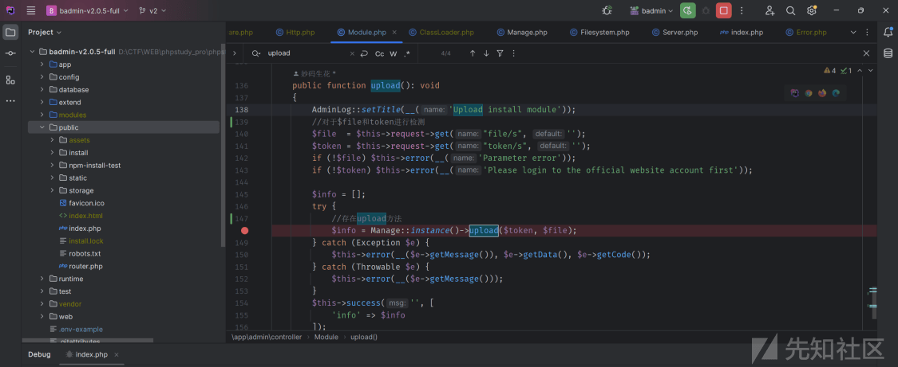](https://xzfile.aliyuncs.com/media/upload/picture/20240229233622-4a9182b2-d718-1.png)

但上传时出现报错，显示无法直接上传，搜索后发现是 token 报错，但利用 bp 抓包可以成功上传。利用 F12 查看网络发现是存在 Batoken 但 debug 时无法读取到因此抛出报错。为完成测试先注册一个官网账户。

[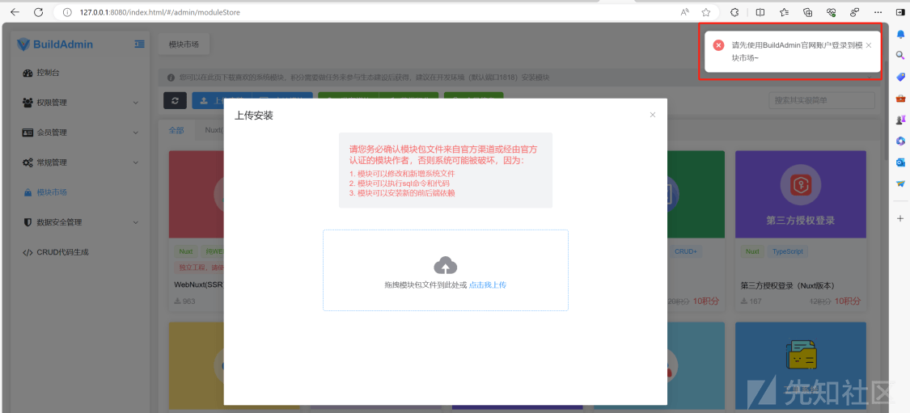](https://xzfile.aliyuncs.com/media/upload/picture/20240229233628-4e01e338-d718-1.png)

[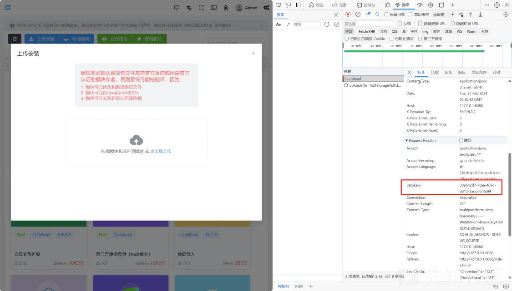](https://xzfile.aliyuncs.com/media/upload/picture/20240229233634-51a4ae58-d718-1.png)

[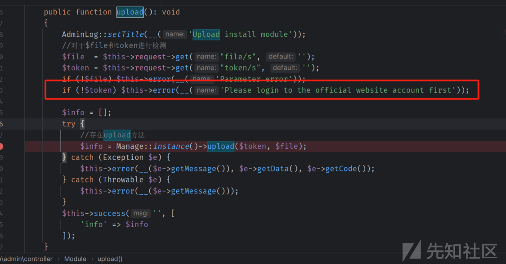](https://xzfile.aliyuncs.com/media/upload/picture/20240229233639-548c2cea-d718-1.png)

注册登录后再次上传即可进入 upload 断点，并且跟进到 getIni，并分析源码

[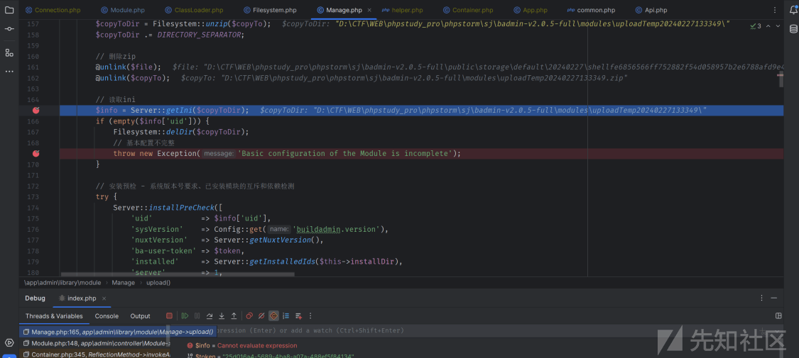](https://xzfile.aliyuncs.com/media/upload/picture/20240229233645-581af4a4-d718-1.png)

[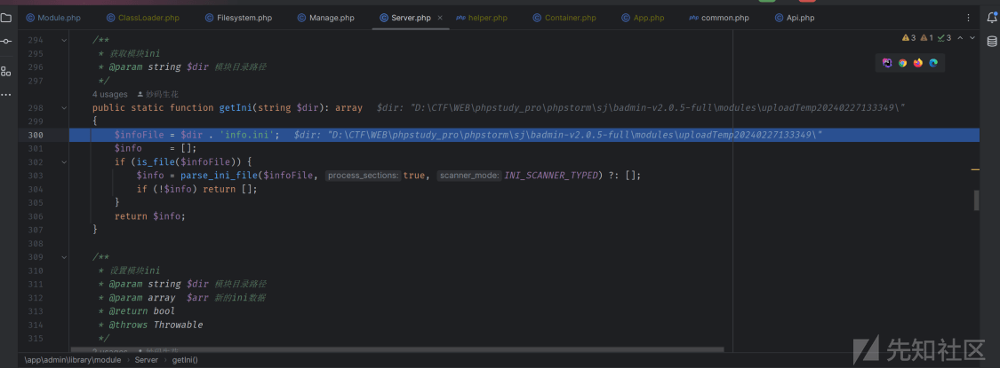](https://xzfile.aliyuncs.com/media/upload/picture/20240229233650-5b5f9c5a-d718-1.png)

```plain
public static function getIni(string $dir): array
    {
        //获取路径下的一个 info.ini 文件
        $infoFile = $dir . 'info.ini';
        $info     = [];
        //判断是否存在这个文件
        if (is_file($infoFile)) {
            $info = parse_ini_file($infoFile, true, INI_SCANNER_TYPED) ?: [];
            if (!$info) return [];
        }
        return $info;
    }
```

我们本次 zip 内只含有一个 phpinfo 的代码，这里无法正常进入，return 一个空的$info 导致抛出基本配置不完整的错误，尝试手动添加一个 info.ini 文件并且对应内容

[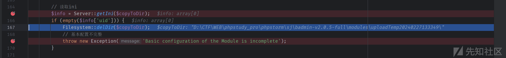](https://xzfile.aliyuncs.com/media/upload/picture/20240229233657-5f773622-d718-1.png)

### info.ini 伪造

根据代码中的内容进行 info.ini 的伪造

```plain
public function checkPackage(): bool
    {
        if (!is_dir($this->modulesDir)) {
            throw new Exception('Module package file does not exist');
        }
        $info     = $this->getInfo();
        $infoKeys = ['uid', 'title', 'intro', 'author', 'version', 'state'];
        foreach ($infoKeys as $value) {
            if (!array_key_exists($value, $info)) {
                Filesystem::delDir($this->modulesDir);
                throw new Exception('Basic configuration of the Module is incomplete');
            }
        }
        return true;
    }
```

[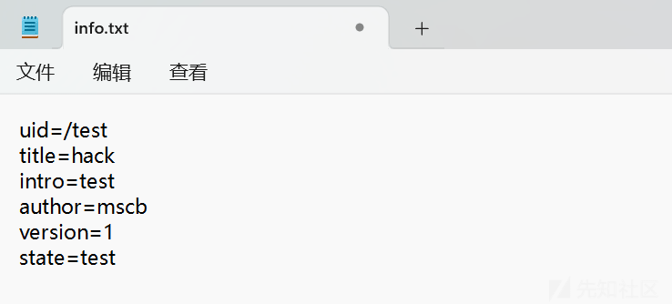](https://xzfile.aliyuncs.com/media/upload/picture/20240229233704-63cdabac-d718-1.png)

将 info.ini 与恶意文件一起压缩，再次上传，成功获取到 ini 中的信息

[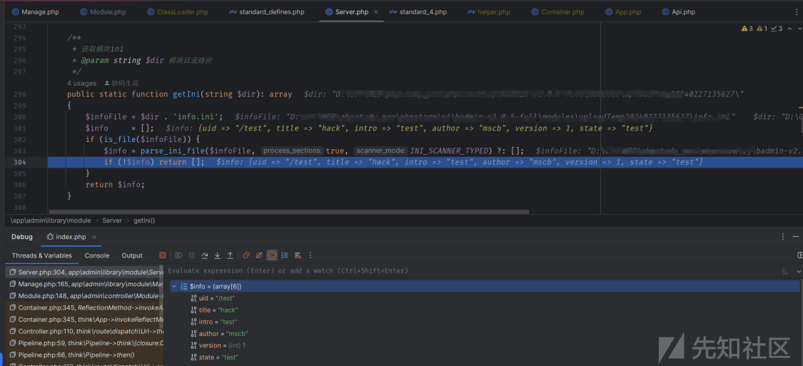](https://xzfile.aliyuncs.com/media/upload/picture/20240229233709-66bd667c-d718-1.png)

并且我们出入的 uid 和$this->installDir 进行了拼接

[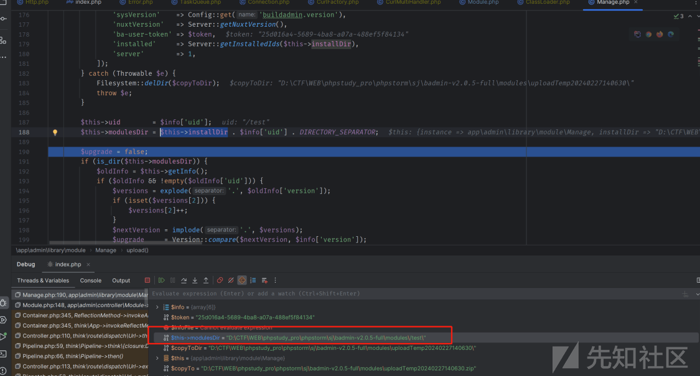](https://xzfile.aliyuncs.com/media/upload/picture/20240229233715-6a072570-d718-1.png)

继续往下跟进拼接后的语句会通过 rename 函数进行重命名这样就可以是的文件路径可知

> PHP 中的**rename()**函数可以用于移动文件夹

[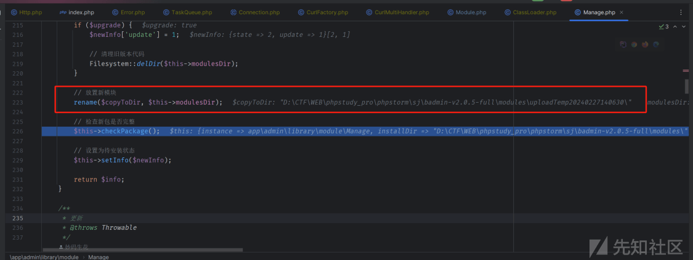](https://xzfile.aliyuncs.com/media/upload/picture/20240229233724-6f930b1c-d718-1.png)

[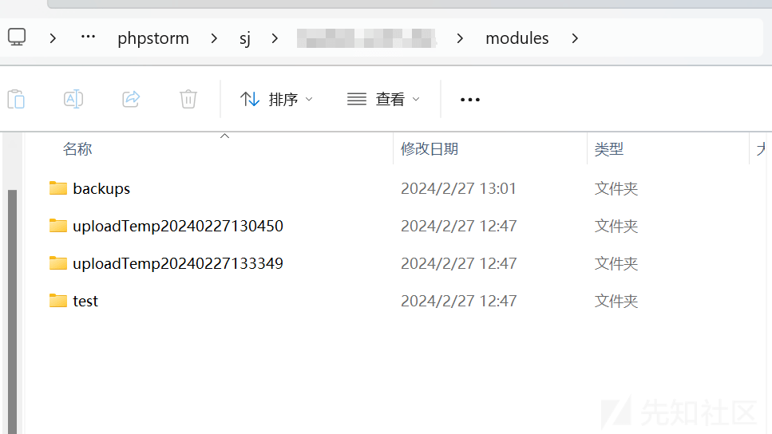](https://xzfile.aliyuncs.com/media/upload/picture/20240229234710-ccad58ba-d719-1.png)

### 文件上传 Getshell

既然我们可以通过 uid 的拼接来控制命名，那能否利用拼接来完成目录穿越导致任意文件上传呢  
构造 uid 如下

```plain
uid=/../public/test
```

成功拼接 uid

[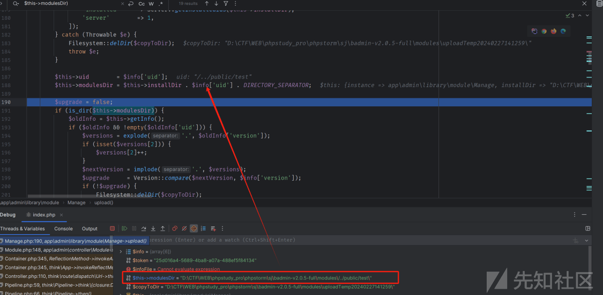](https://xzfile.aliyuncs.com/media/upload/picture/20240229233755-8224d44a-d718-1.png)

成功 getshell

[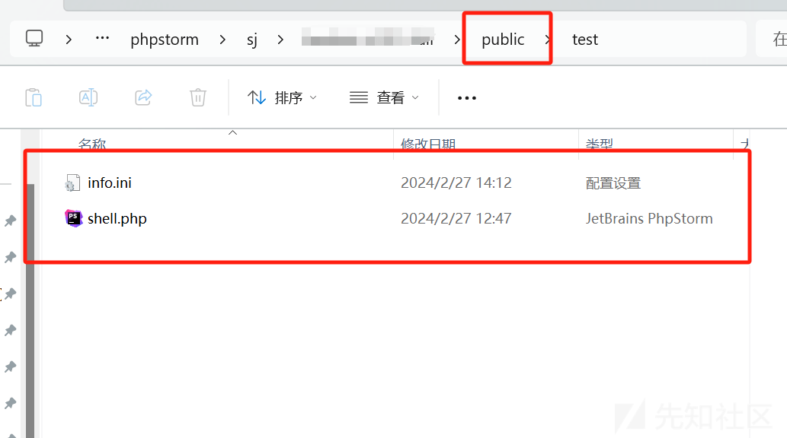](https://xzfile.aliyuncs.com/media/upload/picture/20240229234743-e089420e-d719-1.png)

[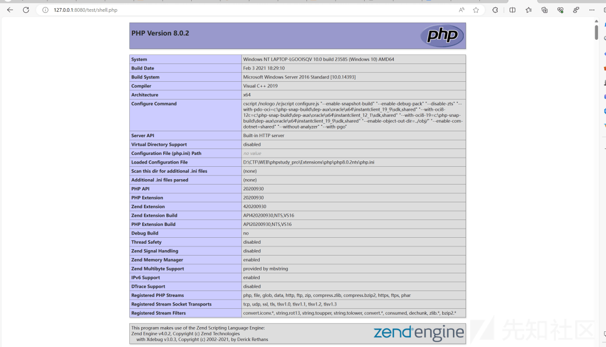](https://xzfile.aliyuncs.com/media/upload/picture/20240229233742-7a6b01c0-d718-1.png)

### 总结

对于一个网站来说在模板导入是一个危险的操作，常常伴随着文件上传的风险，因此测试时可以在此测试是否存在文件上传漏洞。  
但文件上传往往需要知道路径，如在本次代码中的路径是通过 date('YmdHis') 生成，并且上传的路径与是否解析有关，PHP 代码中常常限制了解析代码的路径，正常上传的路径可能存在文件无法解析的问题。在该代码中也存在着相同的问题，但本次代码中存在 uid 的拼接问题，并且有 rename 函数导致文件可以直接移动，因此导致了文件上传漏洞的产生。
