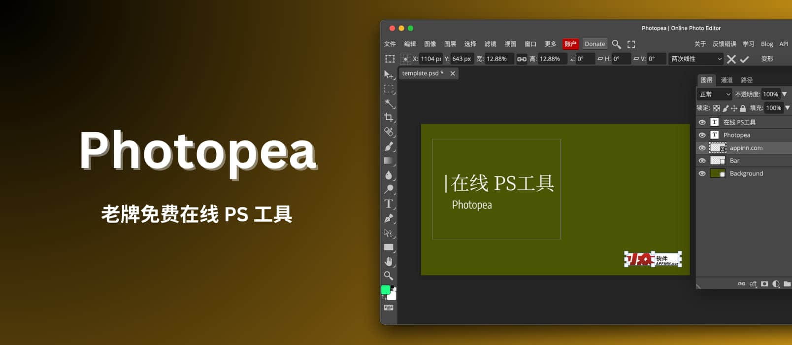
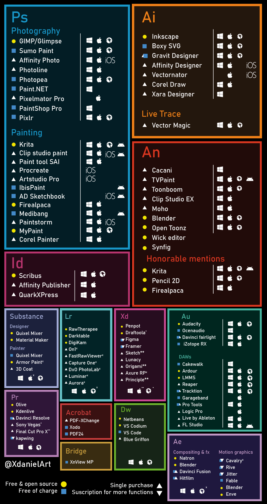

# Photopea - 老牌免费在线 PS 工具，支持 PSD、AI 和 Sketch 等文件 - 小众软件

**Photopea** 是一款老牌、免费的在线 PS 工具，支持众多格式，让你在浏览器里也能进行 PS 操作。适合于偶尔有图片编辑需求，但还不至于去购买 PhotoShop 的用户。@[Appinn](https://www.appinn.com/photopea/)

今天为了给论坛各位老爷颁发新年徽章，需要剪裁一下 svg 文件，但已经很久不用 ps 了，电脑里都没有…于是想找一款在线工具用用。随手搜索了不少 svg 编辑器，都…不符合心意。

只能拿出大招把问题发到了[微博](https://weibo.com/1684197391/O2XdlBxtY)上，@**kingsunyum** 同学评论中，只留了一个网页链接，和一个？：

其实我能理解这个问题：你特么连这个都不知道？这种问题还用问？拿去拿去…

于是，我就想起了它。

## Photopea 在线图片编辑工具

Photopea 大概有 10 来年历史了，你就可以把它理解为在线 PS 工具，对于轻量级用户（比如青小蛙这种偶尔需要），别去折腾 ps 了，又贵又占地方。

直接在浏览器打开它，就能享受到：

-   图层 – 将图像分成几个部分
-   图层蒙版 – 一般有用
-   混合模式 – 指定图层如何相互“组合”
-   画笔——一定有办法改变像素的颜色
-   选择 – 选择要编辑的图层像素
-   程序调整 – 改变亮度、色调、饱和度、卷积（模糊、锐化…）等

然后人家还有插件支持，也支持脚本、自动化，使用无干扰，一定要加到收藏夹啊。

### 支持的格式：

-   Complex: PSD, AI, INDD, XCF, Sketch, XD, FIG, KRI, CLIP, PXD, PXZ, CDR, UFO, Fireworks PNG, AFPHOTO, SVG, EPS, PDF, PDN, WMF, EMF.
-   Raster: PNG (APNG), JPG, GIF, WebP, ICO, ICNS, BMP, AVIF, HEIC, JXL, PPM/PGM/PBM, TIFF, DDS, IFF, ANIM, TGA.
-   Raw: DNG, NEF, CR2, CR3, ARW, RW2, RAF, ORF, GPR, 3FR, FFF.

## 获取

-   [官网](https://www.photopea.com/?utm_source=appinn.com)

免费使用，以及一个高级付费账号，可以使用云空间、AI（没发现怎么用）、无边栏广告、更多的历史步骤等功能。

- - -

原文：https://www.appinn.com/photopea/

顺便，网络上流传着这样一张图：

by XdanielArt via @[chenshaoju](https://twitter.com/chenshaoju/status/1761023835791311357?t=AA7DAT21toQd2MMnTyqNcg)
