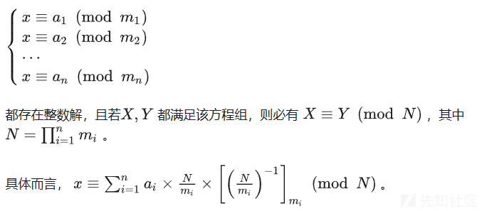

RSA 系列之《算法一》

- - -

# RSA 系列之《算法一》

就像是小学数学，中学数学，大学数学一样，我们把基本的加减乘除学好之后，才能学更多的知识、做更多的题目。下面是我对 RSA 在 CTF 中所经常用到的一些数论的总结和解释，希望能带来帮助。

## 一：Schmidt-Samoa 解密

像 rabin 加密一样，其安全性基于整数因式分解的难度。但 Rabin 解密时会得到四个解，而 Schmidt-Samor 得到的是唯一解。下一个我就会介绍 Rabin 解密。

### 复习原理

欧拉定理  
$$  
a^ϕ(n) ≡ 1(modn)  
$$  
a 的φ(n) 次方被 n 除的余数为 1。或者说，a 的φ(n) 次方减去 1，可以被 n 整除。

### 密钥生成（特征表示）

1.选取两个大的质数 p 和 q 并进行计算 N = p^2 *q  
2.计算 d = invert(N,φ(p* q )) 或者说 n *d = 1mod (phi) phi=(p-1)* (q-1)  
3.加密即是 c = m^n mod (n)  
4.解密即是 m = c^d mod (p \* q)

其余的跟正常的 RSA 加解密没什么区别，密文 C=m^N mod N

### 获取 pq 的问题

那么回到此题目，我们已知了 a^ϕ(n) ≡ 1(modn)，把 n *d = 1mod (phi) 改成 N* d= 1+ k ∗ (q−1)(p−1) 的形式重新带入

a ^ (N∗d) =a^ (1+k∗(q−1)(p−1)) ≡a∗a^(k∗(q−1)(p−1)) =a mod p\*q

所以有：k \* qp = a^Nd -a qp=gcd(a^Nd-a,N)

这里，我们直接令 a 等于 2，并不会对结果代码有所影响

### 例题：

```plain
from Crypto.Util.number import *

def generkey(k):
    p, q = getPrime(k), getPrime(k)
    pubkey = p**2 * q
    n = pubkey
    l = (p-1)*(q-1) / gcd(p-1, q-1)
    privkey = inverse(n, l)
    return pubkey, privkey

def encrypt(m, pubkey):
    return pow(bytes_to_long(m), pubkey, pubkey)


# pubkey =  
# privkey = 
# enc =
```

EXP：

```plain
from gmpy2 import*
from libnum import*

N =  
#N = p^2*q
d = 
c = 

pq = gcd(pow(2,d*N,N)-2,N)

m = pow(c,d,pq)
print(n2s(m))
```

## 二：Rabbit 加密

学之前还请让准备好纸笔，接下来是漫长的计算过程

### 复习原理

中国剩余定理：

[](https://xzfile.aliyuncs.com/media/upload/picture/20240120160008-edbadcfa-b769-1.png)

二次剩余：

若存在整数 x，对于整数 d 满足 x^2 ≡a(modp)，称 a 是模 p 意义下的二次剩余。在这是作为重点，如果有所了解不清楚的请移步我的另一篇文章，这里我仅做一个引用介绍：

**定理 1：**二次剩余满足关于 p 对称，即  
$$  
x^2 = (p-x)^2 mod p  
$$  
**定理 2：**对于奇素数 p，二次剩余 a 的个数为 (p-1)/2，二次非剩余的也为 (p-1)/2

**定理 3**（欧拉准则）**：** 对于奇素数 p

a 是模 p 的二次剩余的充要条件为：  
$$  
a^ (p-1)/2 = 1 mod p  
$$  
a 是模 p 的二次非剩余的充要条件为：  
$$  
a^ (p-1)/2 = -1 mod p  
$$

### 解密原理：

Rabin 加解密，就是 e=2 情况下 RSA 的加解密，其余的没有什么变化，故我们令已知 c，n，q，p 求明文 m，e=2

显然得证有：m^2 = c（mod n） ，那么就有 n = pq

-   m^2 = c （mod p）
-   m^2 = c （mod q）

我们根据等式构造出如下形式：

-   r^2 = m^2 = c（mod p）即有 r = m = √c mod p
-   s^2 = m^2 = c（mod q）即有 s = m = √c mod q

那么联立上面的等式：m = r mod p = s mod q

用中国剩余定理（CRT）就可以获得唯一解 m mod ( q \* p)

根据定理 3：

r^2 = c^ (p-1 / 2) \* c = c^ (p+1 / 2) =(c^ (p+1 / 4))^2 mod p

由于常规的 RSA 中 Rabin 加解密中往往会规定 q，p = 3mod 4，故而 p+1 / 4 是整数

1.简易 exp，可以用这个来理解算法：

```plain
import gmpy2
import libnum

p = 13934102561950901579
q = 14450452739004884887
n = 201354090531918389422241515534761536573

c = 20442989381348880630046435751193745753

e = 2

inv_p = gmpy2.invert(p, q)
inv_q = gmpy2.invert(q, p)
mp = pow(c, (p + 1) // 4, p)
mq = pow(c, (q + 1) // 4, q)
a = (inv_p * p * mq + inv_q * q * mp) % n
b = n - int(a)
c = (inv_p * p * mq - inv_q * q * mp) % n
d = n - int(c)
# 因为 rabin 加密有四种结果，全部列出。
aa = [a, b, c, d]

for i in aa:

    print(i)

    print(libnum.n2s(int(i)))
```

2.常规 exp：

```plain
from Crypto.Util.number import *
from sympy.ntheory.modular import crt
import gmpy2
c = 26174096085413982127350513827814096003393781011967421505411183900736523574240
p = 275127860351348928173285174381581152299
q = 319576316814478949870590164193048041239


#shanks 算法，x^2=n mod p，已知，n,p 求 x

def Legendre(n, p):
    return pow(n, (p - 1) // 2, p)


def Tonelli_Shanks(n, p):
    assert Legendre(n, p) == 1
    if p % 4 == 3:
        return pow(n, (p + 1) // 4, p)
    q = p - 1
    s = 0
    while q % 2 == 0:
        q = q // 2
        s += 1
    for z in range(2, p):
        if Legendre(z, p) == p - 1:
            c = pow(z, q, p)
            break
    r = pow(n, (q + 1) // 2, p)
    t = pow(n, q, p)
    m = s
    if t % p == 1:
        return r
    else:
        i = 0
        while t % p != 1:
            temp = pow(t, 2 ** (i + 1), p)
            i += 1
            if temp % p == 1:
                b = pow(c, 2 ** (m - i - 1), p)
                r = r * b % p
                c = b * b % p
                t = t * c % p
                m = i
                i = 0
        return r

result1 = Tonelli_Shanks(c, p)#解出 m^2=c(modp)，求得一解为 result1，其另外一解为 p-result1
result2 = Tonelli_Shanks(c, q)#同上
#第一种情况
l1=[result1,result2]
l2=[p,q]
m=crt(l2,l1)
print(long_to_bytes(m[0]))
#第二种情况
l1=[p-result1,result2]
l2=[p,q]
m=crt(l2,l1)
print(long_to_bytes(m[0]))
#第三种情况
l1=[p-result1,q-result2]
l2=[p,q]
m=crt(l2,l1)
print(long_to_bytes(m[0]))
#第四种情况
l1=[result1,q-result2]
l2=[p,q]
m=crt(l2,l1)
print(long_to_bytes(m[0]))
```

[二次剩余\_大合数的二次剩余类占比为多少-CSDN 博客](https://blog.csdn.net/litble/article/details/81711647?ops_request_misc=%7B%22request%5Fid%22%3A%22170177619316800182740240%22%2C%22scm%22%3A%2220140713.130102334..%22%7D&request_id=170177619316800182740240&biz_id=0&utm_medium=distribute.pc_search_result.none-task-blog-2~all~sobaiduend~default-3-81711647-null-null.142^v96^control&utm_term=%E6%AC%A7%E6%8B%89%E5%87%86%E5%88%99&spm=1018.2226.3001.4187)

这篇文章对二次剩余进行详细拓展

## 三：Pollard’s p-1 算法

### 复习原理

费马定理（fermat）：

在给定一个素数 p 的情况下，对于任意不是 p 的倍数的整数 a，a^(p-1) 在模 p 下与 1 同余。也就是说，如果 a 和 p 互质，那么在模 p 下，对 a 进行 (p-1) 次幂运算，结果与 1 同余。  
$$  
a^(p-1)≡1(mod p )  
$$  
光滑数的概念：

光滑数（smooth number），或译脆数，是一个可以因数分解为小质数乘积的正整数，如果一个整数的所有素因子都不大于 B，我们称这个整数是 B-Smooth 数，如果一个整数的所有素因子的对应指数次幂不大于 B，我们称这个整数是 B-powersmooth 数  
举例：720(2^4∗3^2∗5^1) 是一个 5-smooth 数，6-smooth 数，7-smooth 数  
但 5<9<16=16，所以它也是一个 16-powersmooth 数

### 正式解：

1.  我们假设 p 为 n 的一个素因子，并且这个 p 满足：能构造出一个含有素因子 p 的数 x，我们就可以通过 gcd(s,n) 来求得 n 的因子。  
    请注意，我这描述是素因子和因子，并且这里 p 不知道，应当作为中间变量。
    
2.  我们引入费马小定理，p 是素因子，一定会有：  
    $$  
    2^(p-1) = 1(mod p)  
    $$  
    跟上文中直接令 a 等于 2 一样，并不会有所影响。
    
3.  此时似乎陷入了怪圈，我设出了一个未知数去求另一个未知数？但我们可以构造 (p−1)(q−1) 的倍数，进而达到相同的效果，其实 (p-1) 的 B-powersmooth 数 (设为 B) 的阶乘就是 (p-1) 的倍数
    
    证明如下： 
    因为 p−1=q1∗q2∗q3∗...∗qm 且 q1、q2、q3、...、qm≤B 并且这些质数幂互不相等，那么 B 的阶乘一定会整除 (p-1)
    
4.  所以，我们只需要找到一个合适大小的 B，就可以在多项式时间计算出结果，再回到费马小定理，那么就有 p-1 变成 B!，而不影响整个式子  
    $$  
    x≡2^B!≡1(modp)  
    $$
    

到这一步，基本就解决了，再配合 CTF 赛题中的 RSA 我们不难发现，所谓的素因子 p，未尝不可以是 n 本身，B! 替换成 n-1 对应，阶乘倍数又未尝不可是 1 的倍数，豁然开朗。

### 对抗 Pollard's p-1 的方法：

B 必须满足"大于 p-1 的所有因子"，如果 p−1 的因子很大，选择小的 B 会造成算法求解失败，选择足够大的 B 会增加算法成功的概率，但那样的话算法的复杂度不比试除法好  
为了抵抗 Pollard 的 p-1 因子攻击，我们通常选取两个大素数 p1，q1，令 p=2 *p1+1、q=2* q1+1，这样得到的模数 n=pq 能够抵抗攻击

### 例题：

```plain
from random import choice
from Crypto.Util.number import isPrime, sieve_base as primes
from flag import flag


def myPrime(bits):
    while True:
        n = 2
        while n.bit_length() < bits:
            n *= choice(primes)
        if isPrime(n + 1):
            return n + 1

e = 0x10001
m = int.from_bytes(flag.encode(), 'big')
p = myPrime(2048)
q = getPrime(2048)
n = p * q
c = pow(m, e, n)
```

### EXP

```plain
from Crypto.Util.number import long_to_bytes
import gmpy2
a = 2
n = 2
while True:
    a = pow(a, n, N)
    res = gmpy2.gcd(a-1, N)
    if res != 1 and res != N:
        q = N // res
        print("n=",n)
        print("p=",res)
        print("q=",q)
        break
    n += 1
d=gmpy2.invert(e,(res-1)*(q-1))
m=pow(c,d,N)
print(long_to_bytes(m))
```

## 四：**William’s p+1**分解算法

Pollard's p-1 算法比较容易懂，但是 Williams’s p+1 算法就不一样了

### 复习原理

二次剩余：

若存在整数 x，对于整数 d 满足 x^2 ≡a(modp)，称 a 是模 p 意义下的二次剩余。

卢卡斯数列：

英文名:Lucas numbers，卢卡斯数列与斐波那契数列相似，除前两项外，每个卢卡斯数都为前两项之和。而前两项卢卡斯数是 L0=2 和 L1=1，不同于前两个斐波那契数 F0 和 F1。

### 原理分析

在数学中，卢卡斯数列对于 Un(P,Q) 和 Vn(P,Q)，满足递归关系的某些常数递归整数序列  
$$  
xn=P*x(n-1)-Q*x(n-2)  
$$  
递归关系：

U0(P,Q)=0  
U1(P,Q)=1  
Un(P,Q)=P *Un-1(P,Q) - Q* Un-2(P,Q) for n>1

和

V0(P,Q)=2  
V1(P,Q)=P  
Vn(P,Q)=P *Un-1(P,Q) - Q* Un-2(P,Q) for n>1

在此 P,Q 是固定整数，任何满足这种递归关系的序列都可以表示为卢卡斯序列的线性组合 Un(P,Q) 和 Vn(P,Q) ，想深入了解这两者之间的种种，可以看下文

[http://maths.nju.edu.cn/~zwsun/IntroLucasSeq.pdf](http://maths.nju.edu.cn/~zwsun/IntroLucasSeq.pdf)

在这我们只面向 RSA 中的原理，我们先选择大于 2 的整数 A，用其生成一个卢卡斯序列 V0 = 2,V1 = A,Vj = a \* Vj-1 - Vj-2

再令 D=a^2 - 4，对 奇素 数 P，若 P - (D／p)lM，则 P | gcd (VM - 2，)，其 中 (D／p) 为勒 让德 符 号。由此，可 由 gcd(VM 一 2，n) 求得 n 的因子。若 (D／p)=+1，则该算法退化为 p-1 算法的慢速版本，而我们希望 (D／p)=一 1，但因为 预先不知道 P 的值，所以可能要尝试多个 a 的值，从而得到 n 的因子。

下面求计算 V 的第 M 个值的算法

```plain
x=B           
y=(B^2-2) mod N     
for each bit of M to the right of the most significant bit
  if the bit is 1
    x=(x*y-B) mod N 
    y=(y^2-2) mod N 
  else
    y=(x*y-B) mod N 
    x=(x^2-2) mod N 
V=x
```

Williams's p+1 算法分解 n 的 python 脚本

```plain
def mlucas(v, a, n):
    """ Helper function for williams_pp1().  Multiplies along a Lucas sequence modulo n. """
    v1, v2 = v, (v**2 - 2) % n
    for bit in bin(a)[3:]: v1, v2 = ((v1**2 - 2) % n, (v1*v2 - v) % n) if bit == "0" else ((v1*v2 - v) % n, (v2**2 - 2) % n)
    return v1

for v in count(1):
    for p in primegen():
        e = ilog(isqrt(n), p)
        if e == 0: break
        for _ in xrange(e): v = mlucas(v, p, n)
        g = gcd(v-2, n)
        if 1 < g < n: return g # g|n
        if g == n: break
```

### 例题：

```plain
from random import choice
from Crypto.Util.number import isPrime, sieve_base as primes
from flag import flag


def myPrime(bits):
    while True:
        n = 2
        while n.bit_length() < bits:
            n *= choice(primes)
        if isPrime(n + 1):
            return n + 1

e = 0x10001
m = int.from_bytes(flag.encode(), 'big')
p = myPrime(2048)
q = getPrime(2048)
n = p * q
c = pow(m, e, n)
```

EXP：

```plain
from Crypto.Util.number import *
import gmpy2
a = 2
n = 2
while True:
    a = pow(a, n, N)
    res = gmpy2.gcd(a-1, N)
    if res != 1 and res != N:
        q = N // res
        print("n=",n)
        print("p=",res)
        print("q=",q)
        break
    n += 1

d=gmpy2.invert(e,(res-1)*(q-1))
m=pow(c,d,N)
print(long_to_bytes(m))
```
