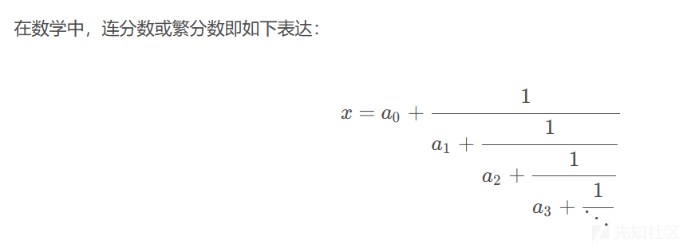

RSA 系列之《算法二》

- - -

# RSA 系列之《算法二》

就像是小学数学，中学数学，大学数学一样，我们把基本的加减乘除学好之后，才能学更多的知识、做更多的题目。下面是我对 RSA 在 CTF 中所经常用到的一些数论的总结和解释，希望能带来帮助。

## 五：费马攻击

一：最简单的就是拿 yafu 直接分解。

二：平方根取中法：

我们同时知道就是现在 p，q 是两个素数，而且他俩在素数序列里面就是一前一后的关系。所以我们要把他俩的乘积开根号得到的结果一定是在 p，q 之间的一个数字，（而且一定不是素数，因为 p，q 就是紧邻的两个素数）。那我们找这个开方出来的数字的下一个素数，一定是 q，因此我们再让 n/q 就可以得到两个素数。

```plain
'''生成两个挨得近的素数 p，q'''
p = getPrime(512)
q = gmpy2.next_prime(p)
#这是其特征代码

'''开始破解'''
temp=gmpy2.iroot(n,2)[0]  
#iroot 函数，这个函数专门用来进行大数开根号，gmpy2.iroot(n,t)。n 就是大整数，t 是你要开几次幂。
p=gmpy2.next_prime(temp)
q=n//p
print(p)
print(q)
```

三：平方差遍历法：

核心总结就是：令 a 是 n 的"中间值"（）,然后让 a 以步长为 1 自增遍历，直到 pow(a,2)-n 的结果可以正好开方为止。那个结果开方就是 b。

```plain
'''生成两个挨得近的素数 p，q'''
p = getPrime(512)
q = gmpy2.next_prime(p)
n=p*q


print('开始破解')
'''开始破解'''
a=gmpy2.iroot(n,2)[0]
while 1:   #破解出来一组就行了，一般也就一组，挨得很近的话很快就出来了，如果长时间还没出来就可以换方法了，不要指望着他遍历所有的，到死也弄不完。
    B2=pow(a,2)-n
    a+=1
    if gmpy2.is_square(B2):
        b=gmpy2.iroot(B2,2)[0]
        p=a+b
        q=a-b
        print(p)
        print(q)
        break
```

仔细观察可以看到，返回的 p 和 q 在分解函数中实际上分别是两个临时参数 a-b 和 a+b，这个又是咋来的呢？

a 首先好说，a 是 n 的整数平方根，这很好理解，但是 b 的产生是什么鬼？其中还有个令人费解的式子：`b2=a*a-n`，而 b 又是 b2 的平方根，这又是怎么回事？

首先列出一个式子：`n=p*q`，这个式子的正确性毫无疑问，代换到上面提到的`p=a-b`,`q=a+b`，那么就是`n=(a-b)*(a+b)`，可以发现其实就是`n=a*a-b*b`，而 b2 不就是 b 的平方吗，所以有`n=a*a-b2`，这个式子如果成立的话，那么 b2 的产生式：`b2=a*a-n`也就没啥问题了。

所以我们发现，这个代码绕这么一大圈，其实就是**在遍历 a 的前提下，求出所有可行的 b**，让其可以满足`n=(a-b)*(a+b)`这个式子，从而得到 p 和 q。

而 a 的值在整个爆破过程中是从小到大的，相应的，b 的值也是从小到大的，因为`b*b=a*a-n`，随着 a 的增大，b 也会变大，而与之相应的，两个解：`a-b`和`a+b`，之间的差距也会变大，而在最开始爆破的时候我们可以认为`b=0`，此时的`a*a`相当于在 0~n 之间求解的最‘中间’，这样我们就可以明白了，**这个脚本正是从 n 的平方根这个‘中间值’开始，逐渐向两边扫描，直到得到解或者`a-b==0`，所以原理上它可以爆破出所有解**。

好的，原理我们明白了，我们也就知道，这个脚本其实是一个爆破脚本，它会尝试每一种可能性，直到得到解，所以**这个脚本也只能在初始值和解相近的时候使用**，如果从 0 开始爆破，那得爆破到猴年马月去。

所以为什么要这么做？

可以发现，这个脚本是爆破脚本，实际上并没有第一个脚本那样思路简单明了，那么它有什么用呢？

好处就在于，这个脚本是一个爆破脚本，所以它能爆破出所有可能的解，我们这道示例自然看不出什么，因为它只有一个解，当只有一个解时使用上面这两种脚本都能得到正确解。

同时，它也不会受到`next_prime`的限制，如果解不是质数它也会求出解。

这在一些稍微改变的题中是非常有用的。

在 2021 年绿城杯 RSA2-PLUS 里，有这么一段：

```plain
p  = getPrime(512)
p1 = gmpy2.next_prime(p)
q  = getPrime(512)
q1 = gmpy2.next_prime(q)
n1 = p*q*p1*q1
```

也就是说，p 和 p1 相近，q 和 q1 相近，我们并不知道 yafu 此时求出的是谁和谁的乘积，也许是`p*q`或者`p1*q1`，也许是`p*q1`或者`q*p1`，不管怎么样，我们发现一个十分有趣的特点，那就是在 n1 的平方根这个‘中间值’两侧有这两组非常相近的解：`(p*q)*(p1*q1)，(p*q1)*(q*p1)`，那么我们如果使用上面的第二个脚本那种方法，我们就可以在短时间内爆破出这两组非质数的解，因为我们知道它其实是从‘中间’开始往两边爆破的，一旦我们两组解都有了，求它们的公因数就能得到 q 或 p 的值，从而得到所有 4 个因子的值。

这里需要注意的是 n 的分解并不是只有这 2 组解，而是有共 8 组解，包括`(p)*(p1*q*q1)，(p*p1)*(q*q1)`这样的解，只不过我们知道那两组解十分接近我们爆破的起始地点，这就造成了我们的利用。

## 六：Pell 攻击

### 复习原理

连分数：

[](https://xzfile.aliyuncs.com/media/upload/picture/20240121142522-db311f56-b825-1.png)

### 佩尔方程

若一个不定方程具有形式： 
$$  
x^2 - D\*y^2=1  
$$  
则称此二元二次不定方程为佩尔方程。

若 n 是完全平方数，则这个方程式只有平凡解。对于其余情况，拉格朗日证明了佩尔方程总有非平凡解。而这些解可由 根号 n 的连分数求出

设 p/q 是根号 n 的连分数表示：\[a0;a1,a2,a3...\] 的渐进分数列，由连分数理论知存在 i，使得 (pi,qi) 为佩尔方程的解，取其中最小的 i，将对应的 (pi,qi) 称为佩尔方程的基本解 (最小解)，记作 (x1,y1)，则所有的解 (xi,yi) 可表示成如下形式  
$$  
x^i+√D*Y^i =(x1+y1*√D)^i  
$$  
或者由以下的递推式得到：

$$  
x(i+1)=x1*xi+n*y1\*yn  
$$

$$  
y(i+1)=x1*yi+y1*xi  
$$

### 推导：

我们令 (x1,y1),(x2,y2) 为方程的两个特解  
$$  
x1^2−D\*y1^2=1  
$$

$$  
x2^2−D\*y2^2=1  
$$

两式相乘，展开得到  
$$  
x1^2*x2^2+d^2*y1^2*y2^2+2*d*x1*x2*y1*y2-  
$$

$$  
d*(d*x1^2*y2^2+y1^2*x2^2+2*x1*x2*y1*y2)=1  
$$

转化，即可转换为典型的佩尔方程，从而得证  
$$  
(x1*x2-d*y1*y2)^2-d*(x1*y2+x2*y1)^2=1  
$$

1.  x3=x1x2-dy1y2
2.  y3=x1y2+x2y1

从而得到递推公式。

### 例题：

```plain
from secret import flag, x, y
from Crypto.Util.number import *

D = 0x1337
assert x**2 - D*y**2 == 1

p, q = [getPrime(1024) for _ in range(2)]
n = p * q
e = 0x10001
m = bytes_to_long(flag)
c = pow(m, e, n)
hint = x*p+y*q

print(f"c = {c}")
print(f"n = {n}")
print(f"hint = {hint}")

# c = 
# n = 
# hint =
```

首先观察题目：令 xp=a，yq=b  
$$  
hint= x*p+y*q=a+b  
$$  
那么进行转换：  
$$  
a^2-a×hint=x^2*p^2-x^2*p^2-x*p*q=-xpq  
$$  
同理得到：  
$$  
b^2-b×hint=x^2*p^2-x^2*p^2-x*p*q=-xpq  
$$  
那么可见一个一元二次方程，韦达定理出 a,b  
$$  
z^2-z×hint+x*y*n=0  
$$  
又有  
$$  
x^2 - D\*y^2 == 1  
$$  
典型的佩尔方程，解出 xy，得到 pq，而后常规 RSA 解密

exp：

```plain
#sage
from Crypto.Util.number import *
from gmpy2 import iroot

def solve_pell(N, numTry = 100):
    cf = continued_fraction(sqrt(N))    
    for i in range(numTry):
        denom = cf.denominator(i)
        numer = cf.numerator(i)        
        if numer^2 - N * denom^2 == 1:            
            return numer, denom    
    return None, None

def gen_pell(D):
    x, y = solve_pell(D)
    xs = [x]
    ys = [y]    
    while True:        
        yield xs[-1], ys[-1]
        x_i = xs[0] * xs[-1] + D * ys[0] * ys[-1]
        y_i = xs[0] * ys[-1] + ys[0] * xs[-1]
        xs.append(x_i)
        ys.append(y_i)


c = 
n = 
hint = 
e = 0x10001
N = 0x1337

for (x, y) in gen_pell(N):
    z = var('z')
    delta = hint**2 - 4*x*y*n    
    if iroot(delta, 2)[1] == True:
        sol = solve(z**2-hint*z+x*y*n==0, z, solution_dict=True)
        a, b = int(z.subs(sol[0])), int(z.subs(sol[1]))
        a, b = [a, b] if a > b else [b, a]
        p, q = a // x, b // y        
        break
assert p * q == n

phi = (p-1) * (q-1)
d = pow(e, -1, phi)
m = int(pow(c, d, n))
print(long_to_bytes(m))
```

## 七：Franklin-Reiter 相关消息攻击

### 复习原理：

Related Message Attack

攻击条件：当 Alice 使用同一公钥对两个具有某种线性关系的消息 M1 与 M2 进行加密，并将加密后的消息 C1，C2 发送给了 Bob 时，我们就可能可以获得对应的消息 M1 与 M2。这里我们假设模数为 N，两者之间的线性关系如下：

Mi = f(M2) mod N 其中 f 为一个线性函数，比如说 f=a +b。

在具有较小错误概率下的情况下，其复杂度为 O(elog2N)，这一攻击由 Franklin，Reiter 提出。

### 攻击解析：

首先，我们知道 C1=M1^e mod N，并且 M 1=f(M2) mod N，那么我们可以知道 M 是 f(a)=Ci mod N 的一个解，即它是方程 f(z)- C 在模 N 意义下的一个根同样的 M 是 c- C 在模 N 意义下的一个根。所以说 a - M 同时整除以上两个多项式。因此，我们可以求得两个多项式的最大公因子，如果最大公因子恰好是线性的话，那么我们就求得了 M2 需要注意的是，在 e=3 的情况下，最大公因子一定是线性的。

-   总结：Franklin-Reiter 相关消息攻击 (Franklin-Reiter related-message attack)：如果两个信息之间存在已知的固定差异，并且在相同的模数 n 下进行 RSA 加密，那么就有可能恢复出这两个消息 - 简单点说就是 m 和 m+a 两个明文在相同的 e 和 n 下进行加密，那么 m 就可以破解

```plain
如果两条消息之间仅存在已知的固定差异
并且在相同的 RSA 模 N 下加密
那么就有可能同时恢复它们

m1 = bytes_to_long(flag)
m2 = a * m1 + b
c1 = pow(m1,e,n)
c2 = pow(a * m1 + b,e,n)
其中 c1,c2,e,n 都已知，那么 m1,m2 可被破解
```

-   既然最后解的形式是（x - M）这样的，那么最后只要提结果后面的 M 即可，这里使用 sage 中的 Q.coefficients()\[0\]

> Q.coefficients() ------ 提取多项式 Q 中的系数，并且是升序排列 举个栗子：f = x^3 + 2x^2 -3x + 4 f.coefficients() 返回列表\[4,-3,2,1\] f = x^3 + 2x^2 + 4 f.coefficients() 返回列表\[4,2,1\] # 0 省略 最后添个负号即可得到 M

### 例题

```plain
from Crypto.Util.number import getPrime,bytes_to_long,long_to_bytes
from functools import reduce
from secret import flag, x, y

m = bytes_to_long(flag)
p = getPrime(1024)
q = getPrime(1024)
n = p*q
print(n)

assert(reduce(lambda x,y:x&amp;y,[(i-5)*i+6==0 for i in x]))
assert(reduce(lambda x,y:x&amp;y,[(j-15)*j+44==0 for j in y]))

print(pow(reduce(lambda x,y:x*m+y,x),17,n))
print(pow(reduce(lambda x,y:x*m+y,y),17,n))

# n = 
# c1 = 
# c2 =
```

题目分析：

首先来看一下下面这一串

```plain
assert(reduce(lambda x,y:x&amp    ;   y,[(i-5)*i+6==0 for i in x]))
```

```plain
1. [(i-5)*i+6==0 for i in x] 使用列表推导式判断等式是否成立，
   若成立，返回 True，否则 False，故列表中最终得到的是[True,True]
2. 为什么是 True 呢，因为用了 assert 断言函数，
   如果为真则正常执行，如果为假则报错，过程中断
   给的题目是会正常运行下去的，故该结果应为 True，
3. 由此可以反推出 x =[2,3] (解方程得到)，显然也可以知道下一串中 y = [4,11]
4. reduce 函数是应用 lambda 表达式对列表 ([True,True]) 中的每一个元素依次进行异或操作

5. PS：“lambda x,y:x&y”中的‘x’
   与
   “[(i-5)*i+6==0 for i in x]”中的‘x’
   并不是同一个！！！（如果这里清楚了，那这句话就是真的弄明白了！）
```

所以推出 (解方程相信大家都会)

> x = \[2,3\] y = \[4,11\]

接下来看最后一串：

```plain
reduce(lambda x,y:x*m+y,x)
```

这里就不过多说理论方面的了，我直接举个例子吧

```plain
x = [1,2,3,4]
reduce(lambda x,y:x+y,x)，使用 reduce 对 x 进行累积
x = 1，y = 2，==&gt;
x+y = 3 ①
x = ①，y = 3，==&gt;
x+y = 6 ②
x = ②，y = 4，==&gt;
x+y = 10 ③
即 1+2+3+4
```

最终得到的结果为 10 再举个更难一点的例子

```plain
x = [1,2,3,4]
reduce(lambda x,y:x*m+y,x),使用 reduce 对 x 进行累积
x = 1，y = 2，==&gt;
x*m+y = 1*m+2 ①
x = ①，y = 3，==&gt;
x*m+y = (1*m+2)*m+3 ②
x = ②，y = 4，==&gt;
x*m+y = ((1*m+2)*m+3)*m+4 ③
```

最终得到的即为式③

-   由此可以得知题目中

```plain
reduce(lambda x,y:x*m+y,x) = 2*m+3
reduce(lambda x,y:x*m+y,y) = 4*m+11
```

-   最终得到：

```plain
c1 = pow(2*m+3,17,n)
c2 = pow(4*m+11,17,n)
```

-   又是典型的 Franklin-Reiter 相关消息攻击，直接上代码解题

```plain
import libnum
n = 
c1 = 
c2 = 
e = 17
import binascii
def franklinReiter(n,e,c1,c2):
    PR.&lt;x&gt; = PolynomialRing(Zmod(n))
    g1 = (2*x+3)^e - c1
    g2 = (4*x+11)^e - c2

    def gcd(g1, g2):
        while g2:
            g1, g2 = g2, g1 % g2
        return g1.monic()
    return -gcd(g1, g2)[0]

m=franklinReiter(n,e,c1,c2)
print(libnum.n2s(int(m)))
```
