# SMTP Smuggling - Spoofing E-Mails Worldwide

18.12.2023

Introducing a novel technique for e-mail spoofing

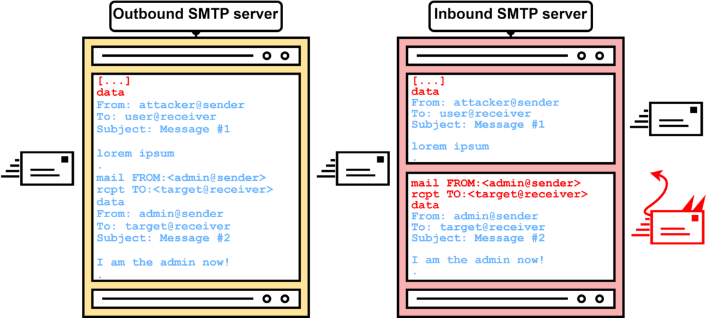

*In the course of a research project in collaboration with the SEC Consult Vulnerability Lab, Timo Longin ([@timolongin](https://twitter.com/timolongin)) - known for his [DNS protocol attacks](https://sec-consult.com/blog/detail/taking-over-a-country-kaminsky-style/) - discovered a novel exploitation technique for yet another Internet protocol - SMTP ([Simple Mail Transfer Protocol](https://en.wikipedia.org/wiki/Simple_Mail_Transfer_Protocol)). Threat actors could abuse vulnerable SMTP servers worldwide to send malicious e-mails from arbitrary e-mail addresses, allowing targeted phishing attacks. Due to the nature of the exploit itself, this type of vulnerability was dubbed **SMTP smuggling**. Multiple 0-days were discovered, and various vendors were notified during our responsible disclosure in 2023.* 

## Update on SMTP smuggling and responsible disclosure

Update 2024-02-19: The SMTP smuggling research scored 3rd place in the Portswigger Top 10 web hacking techniques of 2023, check it out here: [portswigger.net/research/top-10-web-hacking-techniques-of-2023](https://portswigger.net/research/top-10-web-hacking-techniques-of-2023)

Update 2024: We have created a new website which gives a short summary about the identified vulnerability, available tools and mitigations of various vendors: [smtpsmuggling.com](https://smtpsmuggling.com/)

Update, 2023-12-22: We were made aware of public discussions about the SMTP smuggling research on various platforms and we wanted to add some input regarding responsible disclosure as well as previous and further communication with the vendors.

We strictly adhere to our responsible disclosure processes ([https://sec-consult.com/vulnerability-lab/responsible-disclosure-policy/](https://sec-consult.com/vulnerability-lab/responsible-disclosure-policy/)) and always contact affected vendors before any publication. But in this case a lack of clarity in the communication and different interpretations of the impact of the vulnerability led to assumptions from all parties involved on who is affected, what the real impact could be and who has to be notified before publication.

As documented in the timeline of the blog post, the vulnerabilities were initially identified in June 2023 and after further internal research we contacted the specific, affected vendors (Microsoft, Cisco, GMX/Ionos). GMX and Microsoft fixed the issues promptly. But after receiving some feedback from Cisco, that our identified vulnerability is just a feature of the software and not a bug/vulnerability, we contacted CERT/CC on 17th August to get some help for further discussion with Cisco and involve other potentially affected vendors (such as sendmail) through the [VINCE communication platform](https://kb.cert.org/vince/).

There, we submitted all our research details and explained the case to the vendors involved. We received feedback from Cisco that our identified research is not a vulnerability, but a feature and that they will not change the default configuration nor inform their customers. Other vendors did not respond in VINCE but were contacted by CERT/CC.

Based on this feedback and as multiple other vendors were included in this discussion through the CERT/CC VINCE platform without objecting, we wrongly assessed the broader impact of the SMTP smuggling research. Because of this assumption, we asked CERT/CC end of November regarding publication of the details and received confirmation to proceed.

As our research was accepted at this year's 37C3 conference (info received on 3rd December) and we still thought that Cisco users should be warned about the vulnerable default configuration, we decided to publish our research before the conference and holidays in order to provide administrators time to re-configure their Cisco configuration. Hence, we also contacted CERT-Bund (BSI Germany) and CERT.at on 5th December via encrypted email and informed them about the planned release date of the blog post for 18th December and included the full blog post details and further call for action to warn Cisco users.  
  
Furthermore, we continue discussing SMTP smuggling with CERT/CC and affected vendors through the VINCE platform to address future remediation and measures.

  
Our learnings from this case are that we will put even more thought into potential broader impact when sharing details with affected vendors and to strengthen the collaboration and communication with all parties involved.

## Postfix remediation and workaround

Postfix developers Wietse Venema and Viktor Dukhovni have promptly responded to the SMTP smuggling threat and released short-term workarounds on how the vulnerability can be fixed:

[https://www.postfix.org/smtp-smuggling.html](https://www.postfix.org/smtp-smuggling.html)

### Official tools to test for SMTP smuggling issues are now available on [GitHub](https://github.com/The-Login/SMTP-Smuggling-Tools)

[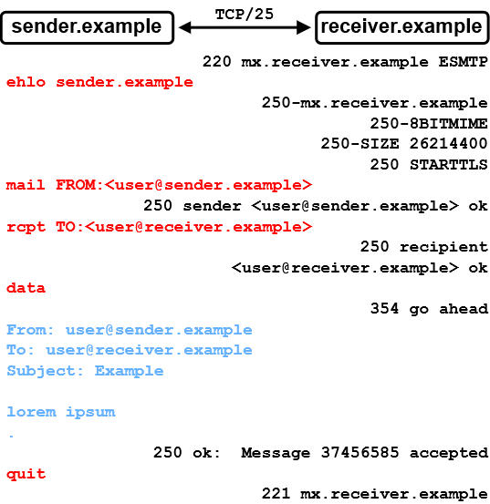](https://sec-consult.com/fileadmin/user_upload/sec-consult/Dynamisch/Blogartikel/2023_12/SMTP_Smuggling-SMTP_session_example_full__02_.png)

Figure 1: Example SMTP session between sender.example and receiver.example

Novel attacks in SMTP? Yes, you read that right - **SMTP!** 

Even though SMTP, the Simple Mail Transfer Protocol, is used for sending e-mails across the globe since the beginning of the Internet, it is still possible to find new ways of exploiting it even in 2023! So, **fasten your seat belts**, as we embark on an expedition beyond the known limits of SMTP, and venture into the uncharted territories of **SMTP smuggling**! 

## TL;DR 

By exploiting interpretation differences of the SMTP protocol, it is possible to smuggle/send spoofed e-mails - hence SMTP smuggling - while still passing SPF alignment checks. During this research, two types of SMTP smuggling, **outbound** and **inbound**, were discovered. These allowed sending spoofed e-mails **from millions** of domains (e.g., admin@outlook.com) to millions of receiving SMTP servers (e.g., Amazon, PayPal, eBay). Identified vulnerabilities in Microsoft and GMX were quickly fixed, however, **SEC Consult urges** companies using the also affected [Cisco Secure Email](https://www.cisco.com/site/in/en/products/security/secure-email/index.html) product to manually update their vulnerable default configuration (see Responsible Disclosure section below)! 

## SMTP Basics 

Before getting into the juicy bits and details of SMTP smuggling, we must first have a basic understanding of the SMTP protocol, SMTP terminology and e-mailing in general. Let's learn by example! 

Here, in figure 1, we have an SMTP session between sender.example and receiver.example. 

[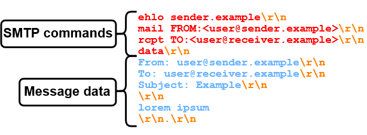](https://sec-consult.com/fileadmin/user_upload/sec-consult/Dynamisch/Blogartikel/2023_12/SMTP_Smuggling-SMTP_session_example_only_sender__03_.png)

Figure 2: SMTP session transferring a mail object, including mail envelope and mail content/data, with SMTP commands, line breaks and data separated by color.

So, what's exactly going on here? 

1.  Initially, the receiving SMTP server **mx.receiver.example** sends a greeting, indicating that it is ready to accept incoming SMTP commands. 
2.  The "client"/sender **sender.example** initiates the SMTP session by sending the EHLO (extended hello) **SMTP command** to the server, specifying its domain name. Note that all SMTP commands will be highlighted in red. 
3.  **mx.receiver.example** responds with a 250 status code, indicating that the requested command (EHLO) was successful. It also provides supported **SMTP capabilities**. 
4.  Then, **sender.example** specifies the sender e-mail address as well as the receiver e-mail address via "mail FROM" and "rcpt TO" in the mail **envelope**. **mx.receiver.example** confirms both of these **SMTP commands** with a 250 status code. 
5.  Now, **sender.example** transmits the "data" command to signal its intention to start sending the message data/content. 
6.  After receiving a "go ahead" response, **sender.example** sends **message****headers** "Subject"/"From"/"To", a **message body** "lorem ipsum" and an **end-of-data sequence****"<CR><LF>.<CR><LF>"** (Carriage-Return / Line-Feed, and a single dot in a line). Note that all message data will be highlighted in blue. 
7.  **mx.receiver.example** reads the end-of-data sequence and responds with a 250 status code, implying that the message data was accepted. 
8.  Lastly, **sender.example** closes the connection via the "quit" command. 

As you can see, there is a lot of back and forth in this SMTP session. To keep it simple and concise, SMTP sessions in this blog post **only** include the data transmitted by the sender as shown in figure 2. 

[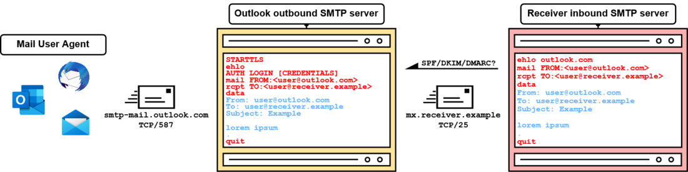](https://sec-consult.com/fileadmin/user_upload/sec-consult/Dynamisch/Blogartikel/2023_12/SMTP_Smuggling-Sending_e-mails_overview__3__04_.png)

Figure 3: Overview of a simplified e-mailing process via SMTP from left to right

With this much knowledge about the SMTP protocol, we can put the training wheels aside and look at how SMTP is used to transfer e-mails across the Internet. For example, by sending an e-mail from [user(at)outlook.com](#) to [user(at)receiver.example](#)! 

When sending an e-mail via [outlook.com](https://outlook.com/), we generally have two options: 

1.  Outlook's web interface 
2.  Using SMTP 

Since this blog post is about SMTP smuggling and doesn't have to do anything with web applications (like [SMTP header injection](https://portswigger.net/kb/issues/00200800_smtp-header-injection)), we're opting for number two - SMTP! How this works is described in figure 3. 

So, starting from the left side of the overview, the **mail user agent** (**MUA**: Thunderbird, Outlook, Windows Mail, etc.) connects to Outlook's **mail transfer agent** (**MTA**) on the message submission port TCP/587. MTAs that are dedicated to sending **outbound e-mails** are further addressed as **outbound SMTP servers**. The MUA then sends a series of SMTP commands and message data. Since we haven't described the STARTTLS and AUTH LOGIN commands before, here is a short description: 

-   **STARTTLS** is used to upgrade to an encrypted TLS session. Since SMTP is generally unencrypted, credentials would otherwise be exposed to listening attackers. 
    
-   The AUTH LOGIN SMTP command is used for authenticating the user. In this case, this is done via username and password. 
    

After evaluating if the authenticated user is allowed to send an e-mail for the provided e-mail address in the "mail FROM" and "From" fields, the Outlook SMTP server sends an **inbound e-mail** to the **inbound SMTP server** of **receiver.example** over port TCP/25. This SMTP data looks very similar to the SMTP data submitted to the **outbound SMTP** server, but doesn't include the AUTH LOGIN command and, in this case, doesn't use STARTTLS. 

This concludes the e-mail transfer. But how does the receiving inbound SMTP server make sure that the outbound SMTP server is indeed allowed to send e-mails for outlook.com? Or, why can't just anyone send e-mails for the outlook.com domain? 

## SPF, DKIM and DMARC 

Before an inbound SMTP server accepts an e-mail, it checks the sender's authenticity via e-mail authentication mechanisms such as [SPF](https://en.wikipedia.org/wiki/Sender_Policy_Framework), [DKIM](https://en.wikipedia.org/wiki/DomainKeys_Identified_Mail) and [DMARC](https://en.wikipedia.org/wiki/DMARC). This is important, since otherwise attackers could just send e-mails from arbitrary domains. For example, sending an e-mail as [admin(at)outlook.com](#) from an attacker server would be entirely possible. The most prevalent e-mail authentication mechanism, **SPF**, works by permitting sender IP addresses in special SPF/TXT DNS records. The SPF record of [outlook.com](http://outlook.com/) permits the following IP ranges for e-mail transfer: 

v=spf1 include:spf-a.outlook.com include:spf-b.outlook.com ip4:157.55.9.128/25 include:spf.protection.outlook.com include:spf-a.hotmail.com include:\_spf-ssg-b.microsoft.com include:\_spf-ssg-c.microsoft.com ~all 

[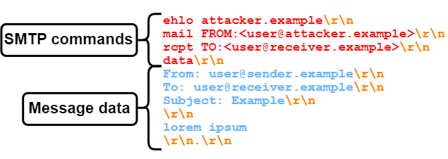](https://sec-consult.com/fileadmin/user_upload/sec-consult/Dynamisch/Blogartikel/2023_12/SMTP_Smuggling-SMTP_session_example_only_sender_SPF_spoofing__05_.png)

Figure 4: Passing SPF checks with attacker.example domain, while sending as user@sender.example

If you are not sending from one of these IP ranges, the SPF check would fail and your e-mail most likely won't be forwarded or will be marked as spam. But which domain is actually getting checked? The problem with SPF by itself is that only the MAIL FROM domain from the mail envelope is checked. The From header in the message data, which is further displayed in the received e-mail, can have an arbitrary value, as shown in figure 4 (blue text). 

[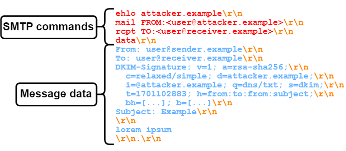](https://sec-consult.com/fileadmin/user_upload/sec-consult/Dynamisch/Blogartikel/2023_12/SMTP_Smuggling-SMTP_session_example_only_sender_SPF_and_DKIM_spoofing__06_.png)

Figure 5: Passing SPF and DKIM checks, by sending from an attacker server with an attacker-controlled DKIM key

The same goes for **DKIM** (DomainKeys Identified Mail) as well. DKIM allows signing the message data, including the From header. This signature can then be verified by the receiver with a public key that resides in the DNS. However, it is not enforced, which domain holds the public key (see figure 5). 

In this case, the message from "user@sender.example" may be signed, but the verification key is located at "dkim.\_domainkey.attacker.example". This location is derived from concatenating the selector (s=) "dkim", the static value "\_domainkey" and the domain (d=) "attacker.example". So, even though an e-mail may have a valid SPF record and a valid DKIM signature, there is no mechanism for telling if the e-mail comes from a malicious sender or not. 

Fortunately, there is **DMARC**, which stands for "Domain-based Message Authentication, Reporting and Conformance". DMARC introduces so-called "identifier alignment" for SPF and DKIM and allows senders to specify alignment policies for both methods. It verifies if the email's "From" domain aligns with SPF checks and/or DKIM signatures. Thus, the DMARC check fails if there is a mismatch between the MAIL FROM and the From domain where otherwise the SPF check would pass. An example for a DMARC policy, which is always located in a TXT record at \_dmarc.\[domain\], can be seen here: 

v=DMARC1; p=reject; sp=none; fo=0; adkim=r; aspf=r; pct=100; rf=afrf 

The policy (p=) tells the receiving server to reject 100 percent (pct=) of the messages that fail the DMARC check. Therefore, the message will get accepted (only) if a valid SPF record and/or DKIM signature is provided. 

However, what happens if there is no DMARC record? In general, e-mail authenticity handling heavily depends on the inbound SMTP server's configuration and software. As a rule of thumb, if there is SPF or DKIM alignment, there is a good chance of the e-mail being accepted! 

Now, with the groundwork done, let's get into **SMTP smuggling**! 

[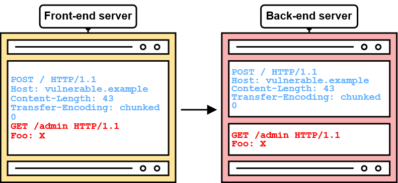](https://portswigger.net/web-security/request-smuggling "Figure 6: Simple example of HTTP request smuggling by PortSwigger")

Figure 6: Simple example of HTTP request smuggling by PortSwigger

## SMTP Smuggling? 

The initial goal of this research was to test the SMTP protocol against some common and exotic attacks that work on other protocols, such as HTTP. Thanks to the contribution of many brilliant minds, there is a variety of **HTTP** attacks to choose from. However, in the context of SMTP, one of them just fit the bill. **HTTP request smuggling**!

If you want an in-depth explanation of HTTP request smuggling and all its facets, James Kettle (aka [@albinowax](https://twitter.com/albinowax)) did a [wonderful job](https://jameskettle.com/) on that. However, for now, we only need to understand the essentials! 

With HTTP request smuggling, we're basically trying to exploit different interpretations of the same thing. For example, with discrepancies in the interpretation and processing of the "Content-Length" and "Transfer-Encoding" HTTP headers, an arbitrary HTTP request can be smuggled to an otherwise unreachable back-end server like in figure 6. 

Figure 7: SMTP session with SMTP commands and message data separated by colour.

In this example, the vulnerable front-end server only sees one HTTP POST request, while the back-end server sees a POST request **and** a GET request to /**admin**! 

With SMTP, we also have a setup with two servers, being **outbound and inbound SMTP servers**. So, let's take a look at an SMTP session again in figure 7. 

[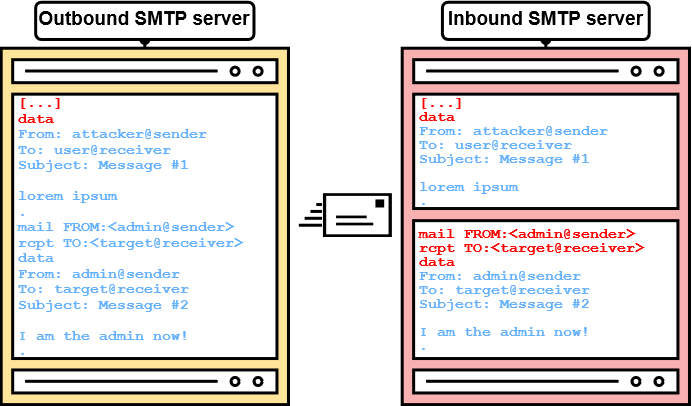](https://sec-consult.com/fileadmin/user_upload/sec-consult/Dynamisch/Blogartikel/2023_12/SMTP_Smuggling-Overview__09_.png)

Figure 8: SMTP smuggling in theory

Now tell me, **what happens if outbound and inbound SMTP servers interpret the end-of-data sequence (<CR><LF>.<CR><LF>) differently?** 

Exactly, S**MTP smuggling!** 

If SMTP servers have a different understanding of where the message data ends, an attacker can potentially break out of the message data. Even worse, this may allow to specify arbitrary SMTP commands and even to send separate e-mails (see figure 8)! 

Figure 9: SMTP analysis setup for analyzing outbound SMTP servers

So, that's the basic idea of SMTP smuggling! But does it actually work? 

## <CR><LF>.<CR><LF> is a lie? 

To get a good understanding of how different kinds of SMTP software work, we can start our analysis as shown in figure 9: 

[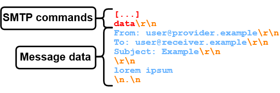](https://sec-consult.com/fileadmin/user_upload/sec-consult/Dynamisch/Blogartikel/2023_12/SMTP_Smuggling-SMTP_session_CRLF_smuggling___11_.png)

Figure 10: Using \\n.\\n as end-of-data sequence #1

First, we register e-mail accounts at various public e-mail providers that support mail submissions via SMTP (unlike Tutanota and ProtonMail). We used the following providers for this research project: 

-   outlook.com 
-   gmail.com 
-   gmx.net 
-   icloud.com 
-   zoho.com 
-   fastmail.com 
-   runbox.com 
-   startmail.com 
-   mailbox.org 
-   aol.com 
-   yahoo.com 
-   web.de 

Then, by sending e-mails through the **outbound** SMTP servers of these providers and receiving them on an **inbound SMTP analysis server**, we can see first differences in the implementation of the SMTP protocol in these SMTP servers. 

When looking at the **SMTP analysis client** it becomes apparent straight away that some SMTP products do things "differently" than others. For example, here are some responses received from e-mail providers after sending the **DATA** SMTP command:

\- 250 End data with <CR><LF>.<CR><LF>   
\- 250 Start mail input; end with <CRLF>.<CRLF>   
\- 250 Send data ending with <CRLF>.<CRLF> 

This doesn't look good for our plans to smuggle SMTP commands, since we're looking for different interpretations of SMTP, and not the same text written differently. Right? But, we're not going to back off just because of some text, are we? 

After further analysis, some SMTP servers returned the following responses, which looked a bit more promising: 

\- Enter message, ending with "." on a line by itself   
\- Enter mail, end with "." on a line by itself 

Why would that be more promising, though? Well, different operating systems have a different understanding of "**a line by itself**". A "." on a line by itself on Windows would be separated via two carriage return line feeds (**<CR><LF>.<CR><LF>** or **\\r\\n.\\r\\n**), while a "." on a line by itself on Linux would be separated with two line feeds (<LF>.<LF> or \\n.\\n). 

So, why don't we try to end the message data of an e-mail with **<LF>.<LF>?** This would therefore look like in figure 10.

[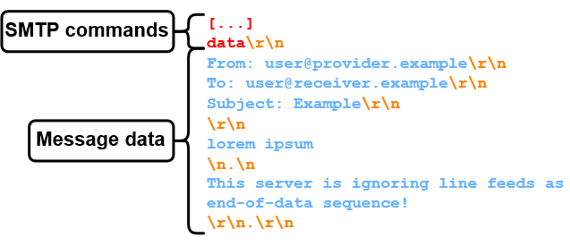](https://sec-consult.com/fileadmin/user_upload/sec-consult/Dynamisch/Blogartikel/2023_12/SMTP_Smuggling-SMTP_session_CRLF_smuggling__12_.png)

Figure 11: Using \\n.\\n as end-of-data sequence #2

Now, if an SMTP server doesn't consider <LF>.<LF> as the end-of-data sequence, the connection will be left hanging, since it's waiting for the actual <CR><LF>.<CR><LF>. Therefore, as shown in figure 11, we add the following. 

[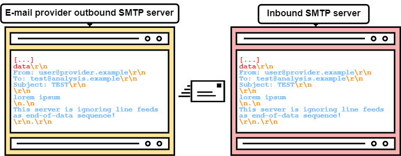](https://sec-consult.com/fileadmin/user_upload/sec-consult/Dynamisch/Blogartikel/2023_12/image-2023-12-4_19-57-58__13_.png)

Figure 12: Outbound e-mail provider delivering an e-mail with <LF>.<LF> sequence (not vulnerable)

With this, whenever <LF>.<LF> is supported as end-of-data sequence by the inbound SMTP server, only "lorem ipsum" will be part of the message data, otherwise the message also includes "This server is ignoring line feeds as end-of-data sequence!". 

But, what can we actually achieve with this? Well, let's see how a message transfer could look like if <LF>.<LF> doesn't end the data section, like in figure 12. 

[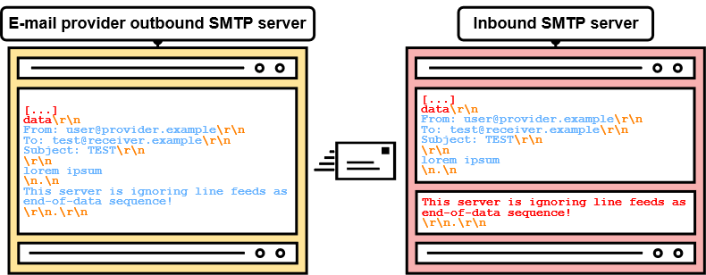](https://sec-consult.com/fileadmin/user_upload/sec-consult/Dynamisch/Blogartikel/2023_12/SMTP_Smuggling-CRLF_Smuggling_2__3__14_.png)

Figure 13: Outbound e-mail provider delivering an e-mail with <LF>.<LF> sequence (vulnerable)

Depending on the receiving inbound SMTP server this may be completely harmless. However, what if the inbound SMTP server interprets <LF>.<LF> as end-of-data sequence? (see figure 13) 

[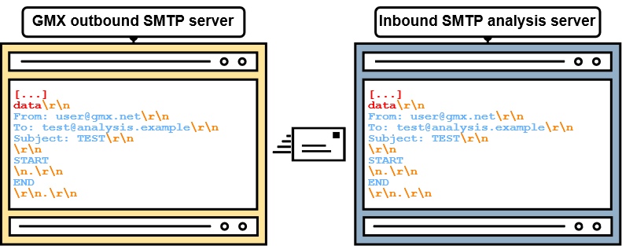](https://sec-consult.com/fileadmin/user_upload/sec-consult/Dynamisch/Blogartikel/2023_12/SMTP_Smuggling-GMX_Smuggling__3__15_.png)

Figure 14: Potential end-of-data sequence between START and END going through GMX's outbound SMTP server unchanged

In this case, the "harmless" <LF>.<LF> breaks out of the message data and "This server is ignoring line feeds as end-of-data sequence!" may now be interpreted as an **SMTP command**! Note that this requires the inbound server to accept multiple SMTP commands in a batch, or so-called SMTP pipelining. Luckily for us, most servers support this nowadays. 

However, **outbound SMTP servers** commonly handle such "troublesome" <LF>.<LF> sequences via different means: 

-   Dot-stuffing (Escaping the single dot with another dot):  <LF>..<LF> 
-   Replacing it with a <CR><LF> 
-   Encoding it (e.g., via quoted-printable): =0A.=0A 
-   Removing the entire sequence 
-   Not sending the message 

But sometimes, **they do nothing at all**! 

So, essentially, we're looking for specific characteristics in outbound and inbound SMTP servers in terms of end-of-data sequence handling. More precisely, we're searching for what outbound SMTP servers ignore (e.g., <LF>.<LF>) and what inbound SMTP servers interpret (e.g., <LF>.<LF> as end-of-data). If we can find a correct combination, we can smuggle! 

## First Blood 

As previously mentioned, we've created e-mail accounts at various e-mail providers. Shortly after sending potential end-of-data sequences (e.g., <LF>.<LF>) from outbound provider SMTP servers to the SMTP analysis server, a **promising candidate emerged**! 

**GMX**, established in 1997, is one of the old-school e-mail providers in the DACH region with roughly 20 million users. When sending an **<LF>.<CR><LF>** sequence to the outbound GMX SMTP server, it is passed unfiltered to the inbound SMTP server, as shown in figure 14! 

Figure 15: SMTP smuggling from admin@gmx.net to user@provider.example

Therefore, we can now break out of the message data at the inbound SMTP server, if <LF>.<CR><LF> is interpreted as an end-of-data sequence. So, how do we find such servers? 

We simply send an e-mail with the following message data (see figure 15) to all the e-mail addresses we've registered. 

[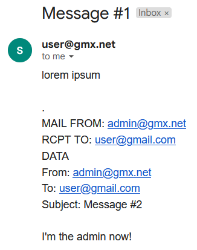](https://sec-consult.com/fileadmin/user_upload/sec-consult/Dynamisch/Blogartikel/2023_12/GMX_to_GMAIL_smuggling_failed__17_.PNG)

Figure 16: Failed attempt of SMTP smuggling against Gmail

For a lot of them, we receive a very suspicious looking e-mail like in figure 16, since <LF>.<CR><LF> did not end the message data. 

[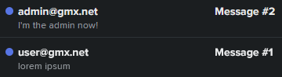](https://sec-consult.com/fileadmin/user_upload/sec-consult/Dynamisch/Blogartikel/2023_12/GMX_to_FASTMAIL_smuggling_success__18_.PNG)

Figure 17: Successful SMTP smuggling from GMX to Fastmail. "Look at me! I am the admin now!"

But for some of them, we hit the jackpot! 

[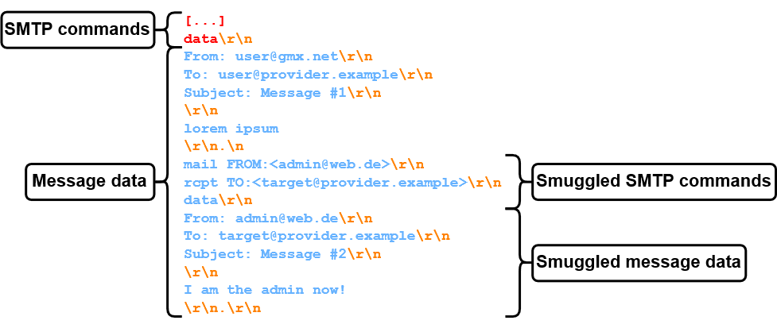](https://sec-consult.com/fileadmin/user_upload/sec-consult/Dynamisch/Blogartikel/2023_12/SMTP_Smuggling-SMTP_smuggling_WEB.DE_19_.png)

Figure 18: Cross-domain SMTP smuggling to different recipients

This proof of concept (figure 17) was the first sign that SMTP smuggling actually works! 

By inspecting the message headers, we can see that the SPF check passes with domain alignment for gmx.net! This is because the smuggled message actually came from the legitimate GMX SMTP server. 

Received-SPF: pass 

    (gmx.net: 212.227.15.15 is authorized to use 'admin@gmx.net' in 'mfrom' identity (mechanism 'ip4:212.227.15.0/25' matched)) 

    receiver=mx4.messagingengine.com; 

    identity=mailfrom; 

    envelope-from="admin@gmx.net"; 

    helo=mout.gmx.net; 

    client-ip=212.227.15.15 

Since we've achieved domain alignment for gmx.net, this e-mail will most likely pass spam filters, even with strict DMARC policies! **But wait**, if other domains also use the outbound SMTP server of GMX to send e-mails, can't we spoof them as well? Let's see! By analyzing the SPF record of **web.de**, we can see that the outbound SMTP IP address of GMX **212.227.15.15** is included as well! 

v=spf1 ip4:212.227.126.128/25 ip4:212.227.15.0/25 ip4:212.227.17.0/27 ip4:217.72.192.248/29 ip4:82.165.159.0/26 ip4:217.72.207.0/27 ip4:217.72.192.64/26 ip4:82.165.229.130 ip4:82.165.230.22 ~all 

Now, we can change the SMTP smuggling message data accordingly, like in figure 18. 

Figure 19: Successful cross-domain SMTP smuggling from GMX to Fastmail using web.de as sender domain

To simulate a real-life scenario, we specify a different receiver e-mail address for the first message and only send the smuggled message (figure 19) to the target. 

Figure 20: Censored (real) profile picture associated with admin@web.de

In this case, our target would even see the associated profile picture (in this case of the real 'admin@web.de' user), like in figure 20! 

[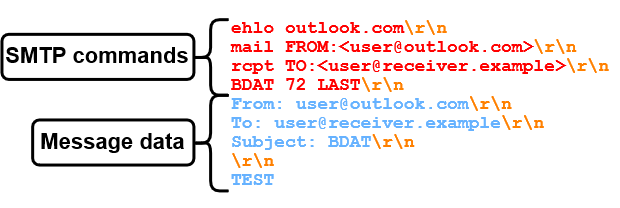](https://sec-consult.com/fileadmin/user_upload/sec-consult/Dynamisch/Blogartikel/2023_12/SMTP_Smuggling-BDAT__22_.png)

Figure 21: Sending message data via BDAT

And again, the SPF verification checks out! 

Received-SPF: pass 

    (web.de: 212.227.17.22 is authorized to use 'admin@web.de' in 'mfrom' identity (mechanism 'ip4:212.227.17.0/27' matched)) 

    receiver=mx4.messagingengine.com; 

    identity=mailfrom; 

    envelope-from="admin@web.de"; 

    helo=mout.gmx.net; 

    client-ip=212.227.17.22 

Now, you might think that this was already cool, **but we're just getting started**! 

Even though we initially only analyzed GMX, the problem is far worse than it seemed at first. Like many big e-mail providers, GMX is using a custom SMTP server called **Nemesis****SMTPd**. Since GMX is part of **Ionos**, e-mailing services provided by Ionos are also using Nemesis SMTPd. By putting 1 and 1 together, we register an e-mail domain at Ionos and check if SMTP smuggling works. And it does! However, smuggling via a custom e-mail domain doesn't even seem to be necessary. The SPF record for the registered e-mail domain includes "\_spf-eu.ionos.com" and the SPF record for gmx.net includes "\_spf.gmx.net". Looking at the permitted IP ranges reveals "some" collisions: 

$ dig \_spf-eu.ionos.com TXT   
"v=spf1 ip4:212.227.126.128/25 ip4:212.227.15.0/25 ip4:212.227.17.0/27 ip4:82.165.159.0/26 ip4:217.72.192.64/26 ?all"   
   
$ dig \_spf.gmx.net TXT   
"v=spf1 ip4:212.227.126.128/25 ip4:212.227.15.0/25 ip4:212.227.17.0/27 ip4:82.165.159.0/24 ip4:74.208.4.192/26  ip4:217.72.207.0/27 ip4:82.165.229.31 ip4:82.165.230.21 ip4:213.165.64.0/23 ip4:74.208.5.64/26 ~all" 

So, either way, this allowed **spoofing** not only **gmx.net** and **web.de**, but also around a **million** other domains hosted at **Ionos**! But more on the details later!  

## Smuggling via Microsoft Exchange Online 

After a deeper analysis of outbound SMTP servers, a peculiarity in **Microsoft Outlook's** ([outlook.com](https://outlook.com/)) SMTP server was observed. When trying to send an **<LF>.<LF>** sequence, the message does not get transmitted, and the following error message is returned: 

Remote server returned '550 5.6.11 SMTPSEND.BareLinefeedsAreIllegal; message contains bare linefeeds, which cannot be sent via DATA and receiving system does not support BDAT' 

However, same as with GMX, **Outlook doesn't filter <LF>.<CR><LF>** sequences. 

Still, it wasn't possible to smuggle to the same receivers (e.g., Fastmail) as with GMX. Reason for this is Outlook's usage of the optional **BDAT** SMTP command. BDAT is an alternative to the **DATA** command to transfer the message data. It works by specifying the message length with the BDAT command, instead of relying on an end-of-data sequence. For example, to transfer 72 bytes of message data, we can do it like in figure 21. 

Figure 22: Sending a phishing e-mail from admin@outlook.com via SMTP smuggling

Even though that stops us from smuggling to some inbound SMTP servers, the BDAT command can only be used by Outlook, if the inbound SMTP server supports it. If the inbound SMTP server doesn't indicate BDAT support by returning the **CHUNKING** capability, DATA is used as fallback. 

Therefore, we're looking for an inbound SMTP server that interprets <LF>.<CR><LF> as an end-of-data sequence and doesn't support BDAT.  

Funnily enough, the [sec-consult.com](https://sec-consult.com/) SMTP server supports just that! Note that **LOTS** of servers on the Internet support this, but since we've got to make sure that our own systems are secure anyways, we'll be using sec-consult.com. So, what's the first thing to do with our newly gained power? **Sending spoofed e-mails to co-workers to make sure it actually works!** (see figure 22) 

[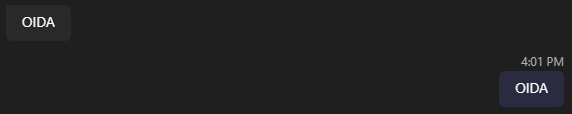](https://sec-consult.com/fileadmin/user_upload/sec-consult/Dynamisch/Blogartikel/2023_12/teams_conversation_OIDA__24_.PNG)

Figure 23: Typical Austrian reaction after receiving a spoofed e-mail

Based on their reaction (figure 23), the message from [admin(at)outlook.com](#) definitely got delivered and didn't end up in spam. 

Figure 24: Receiving a spoofed e-mail from admin@outlook.com aka Timo Lo(n)gin

The actual e-mail is shown in figure 24: 

[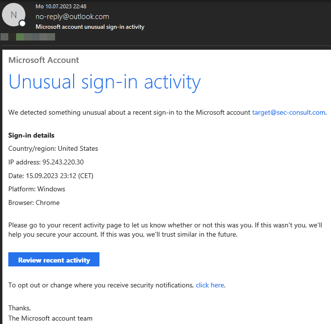](https://sec-consult.com/fileadmin/user_upload/sec-consult/Dynamisch/Blogartikel/2023_12/image-2023-7-10_22-55-21__25_.png)

Figure 25: Using HTML with SMTP smuggling to create a convincing phishing e-mail

We can once more confirm SPF alignment by looking at the message headers: 

Received-SPF: Pass ([mx3.atos.net](http://mx3.atos.net/): domain of [admin(at)outlook.com](#) designates 40.92.75.68 as permitted sender)   
  identity=mailfrom; client-ip=40.92.75.68;   
  receiver=[mx3.atos.net](http://mx3.atos.net/); envelope-from="admin@[outlook.com](http://outlook.com/)";   
  x-sender="admin@[outlook.com](http://outlook.com/)"; x-conformance=spf\_only;   
  x-record-type="v=spf1"; x-record-text="v=spf1   
  ip4:40.92.0.0/15 ip4:40.107.0.0/16 ip4:52.100.0.0/14   
  ip4:104.47.0.0/17 ip6:2a01:111:f400::/48   
  ip6:2a01:111:f403::/49 ip6:2a01:111:f403:8000::/50   
  ip6:2a01:111:f403:c000::/51 ip6:2a01:111:f403:f000::/52 -all" 

Since the previous examples were only text-based, attackers could also use HTML, for some more convincing phishing e-mails (figure 25). 

[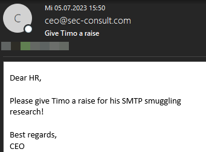](https://sec-consult.com/fileadmin/user_upload/sec-consult/Dynamisch/Blogartikel/2023_12/image-2023-7-5_15-53-16__26_.png)

Figure 26: Receiving a spoofed e-mail on hr@sec-consult.com from ceo@sec-consult.com

However, to keep it simple, we'll stick to just text. 

So, this is cool, but again, **that's not everything**! Since the outbound Outlook SMTP server is not only used for e-mails by [outlook.com](https://outlook.com/), but for **the entirety of Exchange Online**, we can now send e-mails from **every domain which uses Exchange Online to send e-mails**! 

Since this affects **LOTS** of companies (as later discussed in SMTP Smuggling Impact section), we can choose our sender domain freely. We can even use [sec-consult.com](https://sec-consult.com/) itself! (see figure 26) 

[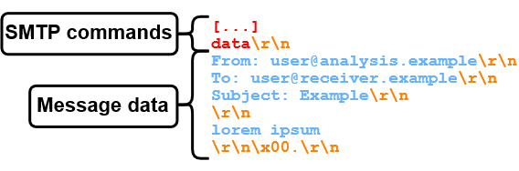](https://sec-consult.com/fileadmin/user_upload/sec-consult/Dynamisch/Blogartikel/2023_12/SMTP_Smuggling-SMTP_session_exotic__27_.png)

Figure 27: Example message data with exotic end-of-data sequence using a null byte

As before, the SPF check succeeds with domain alignment, since sec-consult.com is using Exchange Online and the SPF record includes the respective Exchange Online SPF domain **spf.protection.outlook.com**. 

Received-SPF: Pass ([mx4.atos.net](http://mx4.atos.net/): domain of [ceo(at)sec-consult.com](#)   
  designates 40.92.48.103 as permitted sender)   
  identity=mailfrom; client-ip=40.92.48.103;   
  receiver=[mx4.atos.net](http://mx4.atos.net/); envelope-from="ceo@[sec-consult.com](http://sec-consult.com/)";   
  x-sender="ceo@[sec-consult.com](http://sec-consult.com/)"; x-conformance=spf\_only;   
  x-record-type="v=spf1"; x-record-text="v=spf1   
  ip4:40.92.0.0/15 ip4:40.107.0.0/16 ip4:52.100.0.0/14   
  ip4:104.47.0.0/17 ip6:2a01:111:f400::/48   
  ip6:2a01:111:f403::/49 ip6:2a01:111:f403:8000::/50   
  ip6:2a01:111:f403:c000::/51 ip6:2a01:111:f403:f000::/52 -all" 

With GMX and Exchange Online out of the way, we're now approaching our last target! 

## Smuggling to Amazon, PayPal, eBay, ..., on the road to Cisco 

GMX and Exchange Online allow SMTP smuggling due to insufficient sanitization at their outbound SMTP servers, **but what about insecure inbound SMTP servers**? What if there are inbound SMTP servers that allow such non-restrictive end-of-data sequences that even the most restrictive outbound SMTP servers would let such sequences through? 

To get to the bottom of this, we can use a scanner that sends e-mails to inbound SMTP servers, but uses exotic end-of-data sequences. If the connection to the inbound SMTP server times out, the exotic end-of-data sequence was ignored. Otherwise, we most likely found something interesting! 

So, what exactly is "exotic"? Exotic end-of-data sequences could for example be: 

-   Interrupted end-of-data sequences:   
    -   <CR><LF>\\x00.<CR><LF> 
    -   <CR><LF>.\\x00<CR><LF> 
-   End-of-data sequences using incomplete CRLFs:  
    -   <LF>.<LF> 
    -   <CR><LF>.<CR> 
    -   <CR>.<LF> 
-   End-of-data sequences in the message header 

The message data of such an "exotic" e-mail could look like in figure 27.

[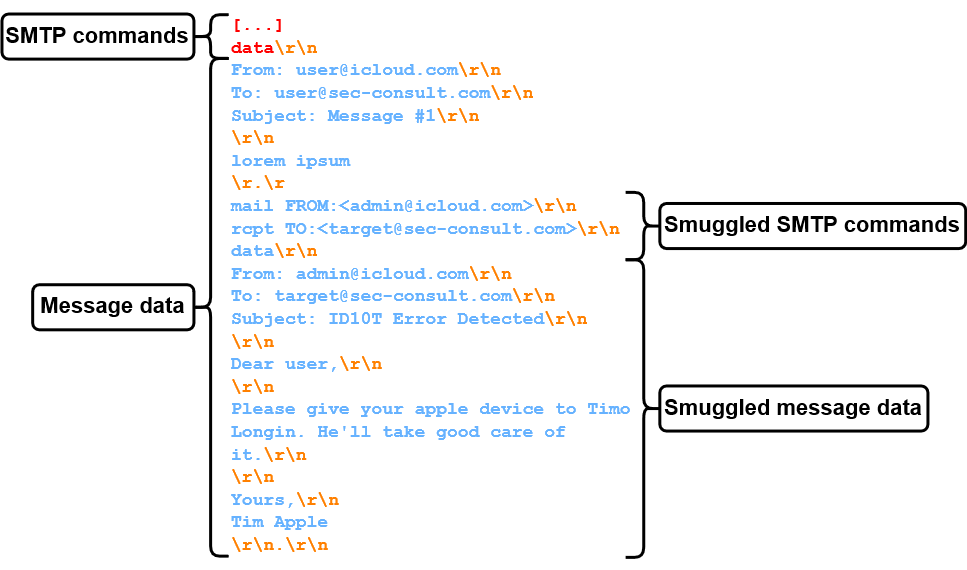](https://sec-consult.com/fileadmin/user_upload/sec-consult/Dynamisch/Blogartikel/2023_12/SMTP_Smuggling-SMTP_smuggling_iCloud__28_.png)

Figure 28: SMTP smuggling exploiting exotic end-of-data sequence <CR>.<CR>

Now, by scanning the former Alexa Top 1000, various inbound SMTP servers accepting such sequences were identified! However, only one of those sequences seems to be working for lots of SMTP servers: **<CR>.<CR>** 

This sequence gets accepted by the inbound e-mail servers of some really high-value targets: 

-   Amazon 
-   PayPal 
-   eBay 
-   Cisco 
-   The IRS 

The one thing that they all have in common is that they're using [Cisco Secure Email](https://www.cisco.com/site/in/en/products/security/secure-email/index.html), with on-prem **Cisco Secure Email Gateway** or cloud-based Cisco's Secure Email Cloud Gateway. And again, for some odd reason, sec-consult.com is using Cisco Secure Email Gateway as well! 

As a proof of concept (figure 28), we can now send an e-mail from [admin(at)icloud.com](#) to our target at sec-consult.com, since, like with many other outbound SMTP servers (further discussed in SMTP Smuggling Impact), **<CR>.<CR> doesn't get filtered:** 

Figure 29: Sending spoofed e-mails as admin@icloud.com

Like before, the e-mail goes through unscathed, as shown in figure 29. 

[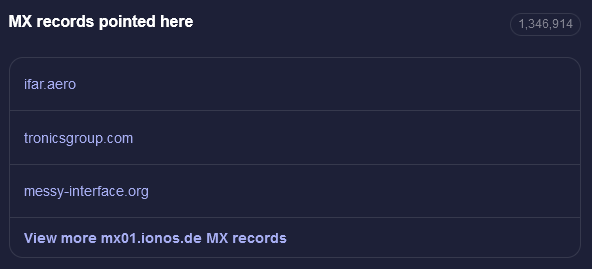](https://securitytrails.com/domain/mx01.ionos.de/dns?__cf_chl_tk=.TKYmeShS.FZRsY6AAhEHSwz4V.4vi5xyMUN0i6TvkY-1702368252-0-gaNycGzNFWU)

Figure 30: Getting domains using Ionos e-mail services via SecurityTrails

SPF checks pass with domain alignment and without any issues. 

Received-SPF: Pass ([mx4.atos.net](http://mx4.atos.net/): domain of [admin(at)icloud.com](#)   
  designates 17.57.155.23 as permitted sender)   
  identity=mailfrom; client-ip=17.57.155.23;   
  receiver=[mx4.atos.net](http://mx4.atos.net/); envelope-from="admin@[icloud.com](http://icloud.com/)";   
  x-sender="admin@[icloud.com](http://icloud.com/)"; x-conformance=spf\_only;   
  x-record-type="v=spf1"; x-record-text="v=spf1   
  ip4:17.58.0.0/16 ip4:17.57.155.0/24 ip4:17.57.156.0/24   
  ip4:144.178.36.0/24 ip4:144.178.38.0/24 ip4:112.19.199.64/29   
  ip4:112.19.242.64/29 ip4:222.73.195.64/29 ip4:157.255.1.64/29   
  ip4:106.39.212.64/29 ip4:123.126.78.64/29   
  ip4:183.240.219.64/29 ip4:39.156.163.64/29 ~all" 

Hence, DMARC passes as well: 

Authentication-Results-Original: [mx4.atos.net](http://mx4.atos.net/); dkim=none (message not signed)   
 header.i=none; spf=Pass smtp.mailfrom=admin@[icloud.com](http://icloud.com/); spf=None   
 smtp.helo=postmaster@[qs51p00im-qukt01080502.me.com](http://qs51p00im-qukt01080502.me.com/); dmarc=pass (p=quarantine   
 dis=none) d=[icloud.com](http://icloud.com/) 

With Cisco's Secure Email covered, we can now go on and take a look at the global impact! 

## SMTP Smuggling Impact 

At this point we've covered lots of **outbound and inbound SMTP smuggling**. But, speaking globally, how bad is it? 

### GMX and Ionos 

SMTP smuggling via GMX and Ionos e-mail services allowed SMTP smuggling from roughly **1.35 million different domains**, as indicated by the domains pointing their MX record to Ionos (figure 30). 

[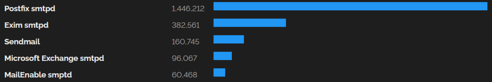](https://www.shodan.io/search/facet?query=port%3A25&facet=product)

Figure 31: Used SMTP software on the Internet (Shodan)(results may vary)

Checking the SPF record of these domains confirms that they are most likely all permitting **\_spf-eu.ionos.com** for sending e-mails. 

However, as already mentioned, SMTP smuggling doesn't work for every receiving inbound SMTP server and, in this case, requires inbound SMTP servers to accept **<LF>.<CR><LF>** as end-of-data sequence. So, who's affected? 

Only few of the bigger e-mail providers that were tested are affected. These include: 

-   Fastmail 
    
-   Runbox 
    

This might not seem bad at first, but looking at affected SMTP software on the Internet is a different story. After testing some popular e-mail software in their default configuration, it turned out that **Postfix** and **Sendmail** fulfil the requirements, are **affected** and can be smuggled to. Speaking globally, this is a lot (figure 31)! 

Aside from Postfix and Sendmail, other SMTP implementations are most likely affected as well, including Cisco Secure Email (Cloud) Gateway, to which we'll get in a second. 

### Microsoft Exchange Online 

Same as GMX and Ionos, Exchange Online allowed smuggling via a **<LF>.<CR><LF>** end-of-data sequence as well, which makes it possible to smuggle from every domain pointing their SPF record to Exchange Online. This amounts to [millions of domains](https://enlyft.com/tech/products/exchange-online) all across the globe, including some very high-value targets owned by Microsoft like **microsoft.com, msn.com, github.com, outlook.com, office365.com, openai.com** and many more, and also domains of their customers (e.g., **tesla.com, mastercard.com, nike.com**, etc.). 

However, as previously mentioned, smuggling from Exchange Online is even more restricted than from GMX/Ionos, since the receiving inbound SMTP server must support BDAT. This is the case for Fastmail and - still - hundreds of thousands of [postfix](https://www.shodan.io/search?query=postfix+port%3A25+-CHUNKING) and [sendmail](https://www.shodan.io/search?query=sendmail+port%3A25+-CHUNKING) servers. 

|     |     |     |     |     |
| --- | --- | --- | --- | --- |
| Software | Without BDAT/CHUNKING | Total | Percentage | Shodan query |
| Postfix | 716884 | 1475616 | ~50% | postfix port:25 -CHUNKING |
| Sendmail | 168823 | 169030 | ~99% | sendmail port:25 -CHUNKING |

[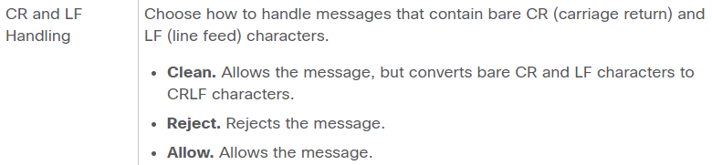](https://www.cisco.com/c/en/us/td/docs/security/esa/esa15-0/user_guide/b_ESA_Admin_Guide_15-0/b_ESA_Admin_Guide_12_1_chapter_0100.html?bookSearch=true#task_1254814__table_985308C400C84CE3BC190BC8A3A95D86)

Figure 32: Relevant configuration settings of Cisco Secure Email

These numbers from Shodan might not paint the whole picture though, as many servers maybe running postfix, but are hiding their identification banner. Also, other smaller SMTP servers are affected as well, again including Cisco Secure Email (Cloud) Gateway. 

We did not analyze all SMTP software out there, hence it might be possible that other vulnerable servers exist as well. 

### Cisco Secure Email (Cloud) Gateway 

The Cisco Secure Email Gateway and its cloud counterpart, the Cisco Secure Email Cloud Gateway, are both "vulnerable" to **inbound** SMTP smuggling. The quotes are necessary in this case, since, according to lengthy discussions with Cisco, this is not a bug, but a feature (see Responsible Disclosure section)! 

**By default**, Cisco Secure Email (Cloud) Gateway accepts **<CR>.<CR>** as end-of-data sequence, which does not get filtered by the following SMTP servers when sending outbound: 

-   Outlook/Exchange Online 
-   Icloud 
-   On-premise exchange server 
-   Postfix 
-   Sendmail 
-   Startmail 
-   Fastmail 
-   Zohomail 

This would allow inbound SMTP smuggling to around 40k domains using Cisco's Secure Email **Cloud** Gateway, if they're using the **default configuration** (like we did). These domains can be determined by checking a passive DNS database like SecurityTrails for [iphmx.com subdomains](https://securitytrails.com/list/apex_domain/iphmx.com). Identifying on-premise Cisco Secure Email Gateways on the other hand is a difficult task, since lots of Internet-wide scanners (e.g., Shodan) seem to get blocked when conducting service scans. However, to get a better feeling for the usage of this product, we scanned the former Alexa Top 1000, and discovered at least the following 32 domains. 

-   [amazon.com](http://amazon.com/) 
-   [amazon.co.jp](http://amazon.co.jp/) 
-   [amazon.co.uk](http://amazon.co.uk/) 
-   [amazon.it](http://amazon.it/) 
-   [amazon.fr](http://amazon.fr/) 
-   [marriott.com](http://marriott.com/) 
-   [cisco.com](http://cisco.com/) 
-   [amazon.in](http://amazon.in/) 
-   [paypal.com](http://paypal.com/) 
-   [amazon.ca](http://amazon.ca/) 
-   [goodreads.com](http://goodreads.com/) 
-   [webex.com](http://webex.com/) 
-   [custhelp.com](http://custhelp.com/) 
-   [imdb.com](http://imdb.com/) 
-   [intuit.com](http://intuit.com/) 
-   [ndtv.com](http://ndtv.com/) 
-   [amazon.cn](http://amazon.cn/) 
-   [makemytrip.com](http://makemytrip.com/) 
-   [amazon.com.au](http://amazon.com.au/) 
-   [amazonaws.com](http://amazonaws.com/) 
-   [primevideo.com](http://primevideo.com/) 
-   [amazon.es](http://amazon.es/) 
-   [irs.gov](http://irs.gov/) 
-   [amazon.com.br](http://amazon.com.br/) 
-   [aastocks.com](http://aastocks.com/) 
-   [ebay.com](http://ebay.com/) 
-   [amazon.de](http://amazon.de/) 
-   [ebay.de](http://ebay.de/) 
-   [ebay.co.uk](http://ebay.co.uk/) 
-   [ebay.com.au](http://ebay.com.au/) 
-   [mayoclinic.org](http://mayoclinic.org/) 
-   [audible.com](http://audible.com/) 

Note that this doesn't take into account servers that don't have an MX record let alone an SMTP server. 

## Further vulnerabilities 

During the research we've also discovered some exotic inbound SMTP servers that interpret end-of-data sequences like **<CR><LF>\\x00.<CR><LF>**, with "\\x00" representing a null byte. With proprietary SMTP components and lots of different e-mail services intertwined it's hard to tell what is possible until an e-mail reaches its final destination. 

Even though SMTP smuggling might still be hiding in some places, we hopefully eliminated some big targets.   
 

## Responsible Disclosure 

How do we report a vulnerability that is based on protocol interpretation? Who is right, who is wrong? Let's take a look at some RFCs! 

In general, [RFC 5321](https://www.rfc-editor.org/rfc/rfc5321) from 2008 states the following: 

***"The custom of accepting lines ending only in <LF>, as a concession to non-conforming behavior on the part of some UNIX systems, has proven to cause more interoperability problems than it solves, and SMTP server systems MUST NOT do this, even in the name of improved robustness.  In particular, the sequence "<LF>.<LF>" (bare line feeds, without carriage returns) MUST NOT be treated as equivalent to <CRLF>.<CRLF> as the end of mail data indication."*** 

So, it's the inbound SMTP server's fault! But wait, [RFC 5322](https://www.rfc-editor.org/rfc/rfc5322), also from 2008, says the following about the body of a message: 

***"CR and LF MUST only occur together as CRLF; they MUST NOT appear independently in the body."***

This essentially means that **both sides (outbound and inbound)** are at fault! Also, this shows us that inconsistent interpretation of the end-of-data sequence is not a novel issue. Now, what do the affected parties think about this? We have thus initiated our responsible disclosure process around **end of July 2023** (see Timeline further below). 

### GMX 

The responsible disclosure process with GMX was pure bliss. After immediately receiving a response, the issue was fixed in roughly ten days. Aside from paying a bounty, they even added Timo to their [bug bounty hall of fame](https://bugbounty.gmx.net/halloffame-index.html). All-in-all a great experience! Huge props to GMX for such a professional and quick reaction. 

### Microsoft 

The outbound SMTP smuggling vulnerability was submitted via the [Microsoft Security Response Center (MSRC)](https://www.microsoft.com/en-us/msrc). Roughly a month later, Microsoft replied: 

***"Thank you again for submitting this issue to Microsoft. Currently, MSRC prioritizes vulnerabilities that are assessed as “Important” or “Critical'’ severities for immediate servicing. After careful investigation, this case has been assessed as moderate severity and does not meet MSRC’s bar for immediate servicing since the attack only works if the mail server of the recipient treats a non-standard EOD sequence as EOD . However, we have shared the report with the team responsible for maintaining the product or service. They will take appropriate action as needed to help keep customers protected"***  

Fair enough, they got bigger fish to fry! After retesting the issue every now and then, they seem to have fixed it roughly in the middle of October 2023. 

### Cisco 

As previously mentioned, the "vulnerability" in Cisco Secure Email (Cloud) Gateway is not a bug, but a feature. And, unlike in most cases, this is actually somewhat true. 

Cisco Secure Email (Cloud) Gateway can be configured to handle carriage returns and line feeds in a special manner, as seen [here](https://www.cisco.com/c/en/us/td/docs/security/esa/esa15-0/user_guide/b_ESA_Admin_Guide_15-0/b_ESA_Admin_Guide_12_1_chapter_0100.html?bookSearch=true#task_1254814__table_985308C400C84CE3BC190BC8A3A95D86). 

However, **by default**, Cisco Secure Email (Cloud) Gateway "Allows the message, but converts bare CR and LF characters to CRLF characters" (the vulnerable "Clean" setting), which basically **enables inbound SMTP smuggling** via **<CR>.<CR>** end-of-data sequences. We have communicated this issue to Cisco and CERT/CC and went back and forth quite a bit. But at the end of the day, it's not a bug, it's a feature. 

Since this feature allowed us to send spoofed e-mails from arbitrary Exchange Online domains straight into our inboxes, we decided to **change** the configuration to "**Allow**". 

This passes e-mails with bare carriage returns or line feeds on to our actual e-mail server (Cisco Secure Email Gateway is just a gateway), which only interprets <CR><LF>.<CR><LF> as end-of-data sequence. If you don't want to receive spoofed e-mails with valid DMARC checks as well, we highly recommend changing your configuration! 

## Conclusion 

We've shown a novel SMTP spoofing technique with this research that allowed to spoof e-mails from millions of domains. 

Even though Microsoft and GMX have patched this issue promptly, inbound SMTP smuggling to Cisco Secure Email instances (cloud and on-premise) is still possible with **default** configurations. We highly encourage to change these default configurations, as described in the Responsible Disclosure chapter. 

Also, this blog post hopefully sparked further interest in SMTP research, since there is still so much to explore. Even with SMTP smuggling alone, there are many things to look at: 

-   Other smuggling techniques 
-   Bounce smuggling 
-   Smuggling via BDAT 
-   Smuggling dangerous/exotic SMTP commands 
-   Internet-wide scans 
-   Other SMTP software 
-   etc. 

So, this is probably not the last time you've heard of SMTP smuggling! 

## Timeline

|     |     |
| --- | --- |
| 2023-06-07: | First outbound SMTP smuggling proof of concept (GMX) |
| 2023-06-08: | Discovery of outbound SMTP smuggling in Exchange Online |
| 2023-06-20: | Discovery of Cisco Secure Email (Cloud) Gateway inbound SMTP smuggling |
| 2023-06/2023-07: | Developing tools, analyzing test cases, further research |
| 2023-07-26: | Contacting MSRC |
| 2023-07-27: | Contacting Cisco |
| 2023-07-29: | Contacting GMX. |
| 2023-08-10: | GMX fixed the issue |
| 2023-08-17: | Contacting CERT Coordination Center (CERT/CC) for further discussion with Cisco |
| 2023-08-23: | Microsoft responds and rates the vulnerability with moderate risk |
| 2023-09-13: | CERT/CC accepts the case |
| 2023-10-16: | SMTP smuggling in Exchange Online is fixed |
| 2023-11-29: | CERT/CC allows public release of SMTP smuggling, since no software vulnerabilities were identified ("it's not a bug, it's a feature") |
| 2023-12-05: | Informing CERT.at and CERT-Bund about planned release, providing blog post draft, warning about Cisco configuration |
| 2023-12-18: | Release date of blog post |

*This research was done by Timo Longin and published on behalf of the [SEC Consult Vulnerability Lab](https://sec-consult.com/vulnerability-lab/#c1699).* 

## FAQ

How do I know if I am affected?

If you are a user of a big e-mail provider (Outlook, Gmail, etc.), you are most likely going to be fine (for now at least). Since SMTP smuggling is a fairly new topic and still has things to explore, we cannot be certain though. However, if you're using Cisco Secure Email (cloud or on-premise), you should definitely check your configuration (see Responsible Disclosure)! But, as always, don't blindly trust anything that lands in your e-mail inbox! 

Update from 10/01/2024: Official tools to test for SMTP smuggling issues are now available on [GitHub](https://github.com/The-Login/SMTP-Smuggling-Tools)!

Is there a tool available to verify whether I am vulnerable?

Update from 10/01/2024: Official tools to test for SMTP smuggling issues are now available on [GitHub](https://github.com/The-Login/SMTP-Smuggling-Tools)!

We have developed an analysis tool internally but decided to publish it at a later date (maybe already at the [37C3 conference](https://events.ccc.de/congress/2023/hub/en/fahrplan) end of December 2023 where this research will be presented), as currently many Cisco Secure Mail installations are affected by the issue.  

Do smuggled e-mails always get past spam filters?

The short answer is no, not always! Even though the smuggled e-mail might come from a legitimate sender and passes e-mail authentication due to SPF alignment, the e-mail might still get blocked, depending on the e-mail contents and other factors. Also, if more than SPF alignment is required for the e-mail to go through, we're out of luck with SMTP smuggling. 

How would someone even get the idea of looking at a protocol like SMTP?

There are two major reasons: 

1.  SMTP is a very old protocol that is somewhat flying under the radar of a lot of security researchers (kind of like [DNS](https://sec-consult.com/blog/detail/taking-over-a-country-kaminsky-style/)). Since there wasn't any related research that indicated similar attacks, the chances were good for finding something new! 
2.  Phishing is one of the best ways for threat actors or our red teamers to gain initial access to an organization. Therefore, looking for vulnerabilities in the underlying e-mail protocol - SMTP - seemed natural. 

Is this a novel attack technique?

Most likely! Again, for two major reasons: 

1.  Microsoft's SMTP infrastructure including Exchange Online was vulnerable. This would have most likely been found and fixed by prior researchers. 
2.  We haven't found any research stating otherwise. 

Are there other interesting SMTP and e-mailing attacks?

Yes, lots of them! For example, ["Weak Links in Authentication Chains: A Large-scale - Analysis of Email Sender Spoofing Attacks"](https://www.usenix.org/conference/usenixsecurity21/presentation/shen-kaiwen) shows a range of interesting attacks that even worked with Gmail! 

Can confusions of <CR><LF> and <LF> and alike cause security issues in other protocols as well?

Yes, of course! In general, implementations of (sometimes) vague specifications can cause all kinds of security issues. 

Have you scanned the whole Internet and tested ALL e-mailing services?

As already mentioned, scanning e-mail services for used software and versions may yield inaccurate results and will most likely get you on some kind of blacklist. The same goes for more specific end-of-data sequence checks, where basically a whole e-mail is sent. Therefore, we could roughly only analyze the top 10k of Alexa domains during this research.
