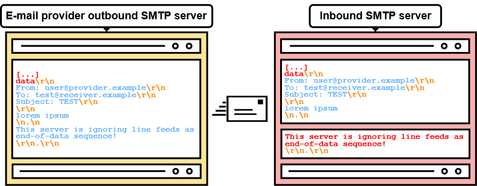

# SMTP 走私 - 全球电子邮件欺骗 - SEC 咨询 --- SMTP Smuggling - Spoofing E-Mails Worldwide - SEC Consult

# SMTP Smuggling - Spoofing E-Mails Worldwide  
SMTP 走私 - 欺骗电子邮件全球

18.12.2023

Introducing a novel technique for e-mail spoofing  
介绍一种电子邮件欺骗的新技术

*In the course of a research project in collaboration with the SEC Consult Vulnerability Lab, Timo Longin ([@timolongin](https://twitter.com/timolongin)) - known for his [DNS protocol attacks](https://sec-consult.com/blog/detail/taking-over-a-country-kaminsky-style/) - discovered a novel exploitation technique for yet another Internet protocol - SMTP ([Simple Mail Transfer Protocol](https://en.wikipedia.org/wiki/Simple_Mail_Transfer_Protocol)). Threat actors could abuse vulnerable SMTP servers worldwide to send malicious e-mails from arbitrary e-mail addresses, allowing targeted phishing attacks. Due to the nature of the exploit itself, this type of vulnerability was dubbed **SMTP smuggling**. Multiple 0-days were discovered, and various vendors were notified during our responsible disclosure in 2023.   
在与 SEC Consult Vulnerability Lab 合作的一个研究项目中，Timo Longin（@timolongin）- 以 DNS 协议攻击而闻名 - 发现了另一种互联网协议 SMTP（简单邮件传输协议）的新利用技术。威胁行为者可以滥用全球易受攻击的 SMTP 服务器，从任意电子邮件地址发送恶意电子邮件，从而允许有针对性的网络钓鱼攻击。由于漏洞本身的性质，这种类型的漏洞被称为 SMTP 走私。我们于 2023 年的负责任披露中发现多个 0 天，并通知了多个供应商。*

## Update on SMTP smuggling and responsible disclosure  
SMTP 走私和负责任披露的最新情况

Update 2024-02-19: The SMTP smuggling research scored 3rd place in the Portswigger Top 10 web hacking techniques of 2023, check it out here: [portswigger.net/research/top-10-web-hacking-techniques-of-2023](https://portswigger.net/research/top-10-web-hacking-techniques-of-2023)  
更新 2024-02-19：SMTP 走私研究在 Portswigger 2023 年十大网络黑客技术中排名第三，请在此处查看：portswigger.net/research/top-10-web-hacking-techniques-of-2023

Update 2024: We have created a new website which gives a short summary about the identified vulnerability, available tools and mitigations of various vendors: [smtpsmuggling.com](https://smtpsmuggling.com/)  
2024 年更新：我们已经创建了一个新网站，提供有关已识别漏洞、可用工具和各种供应商缓解措施的简短摘要：smtpsmuggling.com

Update, 2023-12-22: We were made aware of public discussions about the SMTP smuggling research on various platforms and we wanted to add some input regarding responsible disclosure as well as previous and further communication with the vendors.  
更新，2023-12-22：我们了解到各种平台上关于 SMTP 走私研究的公开讨论，我们希望添加一些关于负责任披露以及与供应商之前和进一步沟通的信息。

We strictly adhere to our responsible disclosure processes ([https://sec-consult.com/vulnerability-lab/responsible-disclosure-policy/](https://sec-consult.com/vulnerability-lab/responsible-disclosure-policy/)) and always contact affected vendors before any publication. But in this case a lack of clarity in the communication and different interpretations of the impact of the vulnerability led to assumptions from all parties involved on who is affected, what the real impact could be and who has to be notified before publication.  
我们严格遵守我们负责任的披露流程（https：//sec-consult.com/consultability-lab/responsible-consultsure-policy/），并在发布任何信息之前始终联系受影响的供应商。但在这种情况下，由于沟通不够明确，对脆弱性的影响有不同的解释，导致所有有关各方都对谁受到影响、真实的影响可能是什么以及在公布之前必须通知谁做出假设。

As documented in the timeline of the blog post, the vulnerabilities were initially identified in June 2023 and after further internal research we contacted the specific, affected vendors (Microsoft, Cisco, GMX/Ionos). GMX and Microsoft fixed the issues promptly. But after receiving some feedback from Cisco, that our identified vulnerability is just a feature of the software and not a bug/vulnerability, we contacted CERT/CC on 17th August to get some help for further discussion with Cisco and involve other potentially affected vendors (such as sendmail) through the [VINCE communication platform](https://kb.cert.org/vince/).  
正如博客文章的时间轴中所记录的那样，这些漏洞最初是在 2023 年 6 月发现的，经过进一步的内部研究，我们联系了受影响的特定供应商（Microsoft，Cisco，GMX/Ionos）。GMX 和 Microsoft 迅速修复了这些问题。但在收到思科的一些反馈后，我们发现的漏洞只是软件的一个功能，而不是一个错误/漏洞，我们于 8 月 17 日联系了 CERT/CC，以获得一些帮助，以便与思科进行进一步讨论，并通过 VINCE 通信平台让其他可能受影响的供应商（如 sendmail）参与进来。

There, we submitted all our research details and explained the case to the vendors involved. We received feedback from Cisco that our identified research is not a vulnerability, but a feature and that they will not change the default configuration nor inform their customers. Other vendors did not respond in VINCE but were contacted by CERT/CC.  
在那里，我们提交了所有研究细节，并向相关供应商解释了案例。我们收到思科的反馈，我们发现的研究不是一个漏洞，而是一个功能，他们不会更改默认配置，也不会通知他们的客户。其他供应商没有在 VINCE 中作出回应，但 CERT/CC 联系了他们。

Based on this feedback and as multiple other vendors were included in this discussion through the CERT/CC VINCE platform without objecting, we wrongly assessed the broader impact of the SMTP smuggling research. Because of this assumption, we asked CERT/CC end of November regarding publication of the details and received confirmation to proceed.  
根据这一反馈，由于其他多家供应商通过 CERT/CC VINCE 平台参与了本次讨论，但没有提出异议，因此我们错误地评估了 SMTP 走私研究的更广泛影响。由于这种假设，我们在 11 月底向 CERT/CC 询问了有关公布细节的问题，并收到了继续进行的确认。

As our research was accepted at this year's 37C3 conference (info received on 3rd December) and we still thought that Cisco users should be warned about the vulnerable default configuration, we decided to publish our research before the conference and holidays in order to provide administrators time to re-configure their Cisco configuration. Hence, we also contacted CERT-Bund (BSI Germany) and CERT.at on 5th December via encrypted email and informed them about the planned release date of the blog post for 18th December and included the full blog post details and further call for action to warn Cisco users.  
由于我们的研究在今年的 37 C3 会议上被接受（12 月 3 日收到的信息），我们仍然认为思科用户应该被警告易受攻击的默认配置，我们决定在会议和假期之前发布我们的研究，以便为管理员提供时间来重新配置他们的思科配置。因此，我们还于 12 月 5 日通过加密电子邮件联系了 CERT-Bund（BSI 德国）和 CERT.at，告知他们 12 月 18 日的博客文章计划发布日期，并包括完整的博客文章详细信息和进一步的行动呼吁，以警告思科用户。  
  
Furthermore, we continue discussing SMTP smuggling with CERT/CC and affected vendors through the VINCE platform to address future remediation and measures.  
此外，我们将继续通过 VINCE 平台与 CERT/CC 和受影响的供应商讨论 SMTP 走私问题，以解决未来的补救和措施。

  
Our learnings from this case are that we will put even more thought into potential broader impact when sharing details with affected vendors and to strengthen the collaboration and communication with all parties involved.  
我们从这个案例中学到的是，在与受影响的供应商分享细节时，我们将更多地考虑潜在的更广泛的影响，并加强与所有相关方的合作和沟通。

## Postfix remediation and workaround  
后缀修复和解决方法

Postfix developers Wietse Venema and Viktor Dukhovni have promptly responded to the SMTP smuggling threat and released short-term workarounds on how the vulnerability can be fixed:  
Postfix 开发人员 Wietse Venema 和 Viktor Dukhovni 已经及时响应了 SMTP 走私威胁，并发布了如何修复该漏洞的短期解决方案：

[https://www.postfix.org/smtp-smuggling.html](https://www.postfix.org/smtp-smuggling.html)

### Official tools to test for SMTP smuggling issues are now available on [GitHub](https://github.com/The-Login/SMTP-Smuggling-Tools)  
用于测试 SMTP 走私问题的官方工具现已在 GitHub 上提供

Figure 1: Example SMTP session between sender.example and receiver.example  
图 1：sender.example 和 receiver.example 之间的 SMTP 会话示例

Novel attacks in SMTP? Yes, you read that right - **SMTP!**   
SMTP 中的新攻击？是的，你读对了 - SMTP！

Even though SMTP, the Simple Mail Transfer Protocol, is used for sending e-mails across the globe since the beginning of the Internet, it is still possible to find new ways of exploiting it even in 2023! So, **fasten your seat belts**, as we embark on an expedition beyond the known limits of SMTP, and venture into the uncharted territories of **SMTP smuggling**!   
尽管 SMTP（简单邮件传输协议）自互联网诞生以来一直用于在地球仪之间发送电子邮件，但即使在 2023 年，仍有可能找到利用它的新方法！所以，系好安全带，因为我们开始了一次超越 SMTP 已知限制的探险，并冒险进入 SMTP 走私的未知领域！

## TL;DR   左心室，右心室

By exploiting interpretation differences of the SMTP protocol, it is possible to smuggle/send spoofed e-mails - hence SMTP smuggling - while still passing SPF alignment checks. During this research, two types of SMTP smuggling, **outbound** and **inbound**, were discovered. These allowed sending spoofed e-mails **from millions** of domains (e.g., admin@outlook.com) to millions of receiving SMTP servers (e.g., Amazon, PayPal, eBay). Identified vulnerabilities in Microsoft and GMX were quickly fixed, however, **SEC Consult urges** companies using the also affected [Cisco Secure Email](https://www.cisco.com/site/in/en/products/security/secure-email/index.html) product to manually update their vulnerable default configuration (see Responsible Disclosure section below)!   
通过利用 SMTP 协议的解释差异，可以走私/发送欺骗电子邮件 - 因此 SMTP 走私 - 同时仍然通过 SPF 对齐检查。在这项研究中，发现了两种类型的 SMTP 走私，出站和入站。这些允许从数百万个域发送欺骗性电子邮件（例如，admin@outlook.com）到数百万个接收 SMTP 服务器（例如，Amazon、PayPal、eBay）。Microsoft 和 GMX 中发现的漏洞很快得到了修复，但是，SEC Consult 敦促使用同样受影响的 Cisco Secure Email 产品的公司手动更新其易受攻击的默认配置（请参阅下面的“负责任披露”部分）！

## SMTP Basics  SMTP 基础知识

Before getting into the juicy bits and details of SMTP smuggling, we must first have a basic understanding of the SMTP protocol, SMTP terminology and e-mailing in general. Let's learn by example!   
在进入 SMTP 走私的多汁位和细节之前，我们必须首先对 SMTP 协议、SMTP 术语和电子邮件有一个基本的了解。让我们通过例子来学习！

Here, in figure 1, we have an SMTP session between sender.example and receiver.example.   
在图 1 中，我们在 sender.example 和 receiver.example 之间有一个 SMTP 会话。

Figure 2: SMTP session transferring a mail object, including mail envelope and mail content/data, with SMTP commands, line breaks and data separated by color.  
图二：SMTP 会话传输邮件对象，包括邮件信封和邮件内容/数据，使用 SMTP 命令、换行符和数据（按颜色分隔）。

So, what's exactly going on here?   
所以，到底是怎么回事？

1.  Initially, the receiving SMTP server **mx.receiver.example** sends a greeting, indicating that it is ready to accept incoming SMTP commands.   
    最初，接收 SMTP 服务器 mx.receiver.example 发送一个问候，表示它已准备好接受传入的 SMTP 命令。
2.  The "client"/sender **sender.example** initiates the SMTP session by sending the EHLO (extended hello) **SMTP command** to the server, specifying its domain name. Note that all SMTP commands will be highlighted in red.   
    “client”/sender sender.example 通过向服务器发送 EHLO（extended hello）SMTP 命令并指定其域名来启动 SMTP 会话。请注意，所有 SMTP 命令都将以红色突出显示。
3.  **mx.receiver.example** responds with a 250 status code, indicating that the requested command (EHLO) was successful. It also provides supported **SMTP capabilities**.   
    example 返回一个 250 状态码，表示请求的命令（EHLO）成功。它还提供支持的 SMTP 功能。
4.  Then, **sender.example** specifies the sender e-mail address as well as the receiver e-mail address via "mail FROM" and "rcpt TO" in the mail **envelope**. **mx.receiver.example** confirms both of these **SMTP commands** with a 250 status code.   
    然后，sender.example 通过邮件信封中的“mail FROM”和“rcptTO”指定发件人电子邮件地址和收件人电子邮件地址。example 使用 250 状态代码确认这两个 SMTP 命令。
5.  Now, **sender.example** transmits the "data" command to signal its intention to start sending the message data/content.   
    现在，sender.example 发送“data”命令，以表明其开始发送消息数据/内容的意图。
6.  After receiving a "go ahead" response, **sender.example** sends **message****headers** "Subject"/"From"/"To", a **message body** "lorem ipsum" and an **end-of-data sequence****"<CR><LF>.<CR><LF>"** (Carriage-Return / Line-Feed, and a single dot in a line). Note that all message data will be highlighted in blue.   
    在收到“继续”响应后，sender.example 发送消息头“Subject”/“From”/“To”，消息体“lorem ipsum”和数据结束序列”。“（回车/换行，以及一行中的一个点）。请注意，所有消息数据将以蓝色突出显示。
7.  **mx.receiver.example** reads the end-of-data sequence and responds with a 250 status code, implying that the message data was accepted.   
    mx.receiver.example 读取数据结束序列，并以 250 状态码响应，这意味着消息数据已被接受。
8.  Lastly, **sender.example** closes the connection via the "quit" command.   
    最后，sender.example 通过“quit”命令关闭连接。

As you can see, there is a lot of back and forth in this SMTP session. To keep it simple and concise, SMTP sessions in this blog post **only** include the data transmitted by the sender as shown in figure 2.   
正如您所看到的，在这个 SMTP 会话中有很多来回的操作。为了保持简单和简洁，本文中的 SMTP 会话仅包括发件人传输的数据，如图 2 所示。

Figure 3: Overview of a simplified e-mailing process via SMTP from left to right  
图 3：通过 SMTP 发送电子邮件的简化流程概述（从左到右）

With this much knowledge about the SMTP protocol, we can put the training wheels aside and look at how SMTP is used to transfer e-mails across the Internet. For example, by sending an e-mail from [user(at)outlook.com](#) to [user(at)receiver.example](#)!   
有了关于 SMTP 协议的这么多知识，我们可以把训练轮放在一边，看看 SMTP 是如何用于在 Internet 上传输电子邮件的。例如，通过从 user（at）outlook.com 向 user（at）receiver 发送电子邮件。

When sending an e-mail via [outlook.com](https://outlook.com/), we generally have two options:   
通过 outlook.com 发送电子邮件时，我们通常有两种选择：

1.  Outlook's web interface  Outlook 的 Web 界面
2.  Using SMTP   使用 SMTP

Since this blog post is about SMTP smuggling and doesn't have to do anything with web applications (like [SMTP header injection](https://portswigger.net/kb/issues/00200800_smtp-header-injection)), we're opting for number two - SMTP! How this works is described in figure 3.   
由于这篇博客文章是关于 SMTP 走私，并没有做任何与 Web 应用程序（如 SMTP 头注入），我们选择了第二个 - SMTP！图 3 描述了这是如何工作的。

So, starting from the left side of the overview, the **mail user agent** (**MUA**: Thunderbird, Outlook, Windows Mail, etc.) connects to Outlook's **mail transfer agent** (**MTA**) on the message submission port TCP/587. MTAs that are dedicated to sending **outbound e-mails** are further addressed as **outbound SMTP servers**. The MUA then sends a series of SMTP commands and message data. Since we haven't described the STARTTLS and AUTH LOGIN commands before, here is a short description:   
因此，从概述的左侧开始，邮件用户代理（MUA：Thunderbird，Outlook，Windows Mail 等）在邮件提交端口 TCP/587 上连接到 Outlook 的邮件传输代理（MTA）。专门用于发送出站电子邮件的 MTA 进一步被寻址为出站 SMTP 服务器。MUA 然后发送一系列 SMTP 命令和消息数据。由于我们之前没有描述 STARTTLS 和 AUTH LOGIN 命令，这里有一个简短的描述：

-   **STARTTLS** is used to upgrade to an encrypted TLS session. Since SMTP is generally unencrypted, credentials would otherwise be exposed to listening attackers.   
    STARTTLS 用于升级到加密的 TLS 会话。由于 SMTP 通常是未加密的，因此凭据将暴露给侦听攻击者。
    
-   The AUTH LOGIN SMTP command is used for authenticating the user. In this case, this is done via username and password.  AUTH LOGIN SMTP 命令用于验证用户。在这种情况下，这是通过用户名和密码完成的。
    

After evaluating if the authenticated user is allowed to send an e-mail for the provided e-mail address in the "mail FROM" and "From" fields, the Outlook SMTP server sends an **inbound e-mail** to the **inbound SMTP server** of **receiver.example** over port TCP/25. This SMTP data looks very similar to the SMTP data submitted to the **outbound SMTP** server, but doesn't include the AUTH LOGIN command and, in this case, doesn't use STARTTLS.   
在评估是否允许通过身份验证的用户发送电子邮件到“mail FROM”和“From”字段中提供的电子邮件地址后，Outlook SMTP 服务器通过端口 TCP/25 向接收者的入站 SMTP 服务器发送入站电子邮件。此 SMTP 数据看起来与提交到出站 SMTP 服务器的 SMTP 数据非常相似，但不包括 AUTH LOGIN 命令，在本例中也不使用 STARTTLS。

This concludes the e-mail transfer. But how does the receiving inbound SMTP server make sure that the outbound SMTP server is indeed allowed to send e-mails for outlook.com? Or, why can't just anyone send e-mails for the outlook.com domain?   
电子邮件传输到此结束。但是，接收入站 SMTP 服务器如何确保出站 SMTP 服务器确实被允许为 outlook.com？发送电子邮件或者，为什么任何人都不能为 outlook.com 域名发送电子邮件？

## SPF, DKIM and DMARC   
SPF、DKIM 和 DMARC

Before an inbound SMTP server accepts an e-mail, it checks the sender's authenticity via e-mail authentication mechanisms such as [SPF](https://en.wikipedia.org/wiki/Sender_Policy_Framework), [DKIM](https://en.wikipedia.org/wiki/DomainKeys_Identified_Mail) and [DMARC](https://en.wikipedia.org/wiki/DMARC). This is important, since otherwise attackers could just send e-mails from arbitrary domains. For example, sending an e-mail as [admin(at)outlook.com](#) from an attacker server would be entirely possible. The most prevalent e-mail authentication mechanism, **SPF**, works by permitting sender IP addresses in special SPF/TXT DNS records. The SPF record of [outlook.com](http://outlook.com/) permits the following IP ranges for e-mail transfer:   
在入站 SMTP 服务器接受电子邮件之前，它会通过电子邮件身份验证机制（如 SPF、DKIM 和 DMARC）检查发件人的真实性。这很重要，因为否则攻击者可以从任意域发送电子邮件。例如，从攻击者服务器以 admin（at）outlook.com 的身份发送电子邮件是完全可能的。最流行的电子邮件身份验证机制 SPF 通过允许特殊 SPF/TXT DNS 记录中的发件人 IP 地址来工作。outlook.com 的 SPF 记录允许以下 IP 范围用于电子邮件传输：

v=spf1 include:spf-a.outlook.com include:spf-b.outlook.com ip4:157.55.9.128/25 include:spf.protection.outlook.com include:spf-a.hotmail.com include:\_spf-ssg-b.microsoft.com include:\_spf-ssg-c.microsoft.com ~all   
v=spf1 include: spf-a.outlook.com include: spf-b.outlook.com ip4:157.55.9.128/25 include: spf.protection.outlook.com include:\_spf-a.hotmail.com include:\_ spf-ssg-c.microsoft.com ~all spf-ssg-b.microsoft.com

Figure 4: Passing SPF checks with attacker.example domain, while sending as user@sender.example  
图 4：在以 user@sender.example 的身份发送时，通过 attacker.example 域进行 SPF 检查

If you are not sending from one of these IP ranges, the SPF check would fail and your e-mail most likely won't be forwarded or will be marked as spam. But which domain is actually getting checked? The problem with SPF by itself is that only the MAIL FROM domain from the mail envelope is checked. The From header in the message data, which is further displayed in the received e-mail, can have an arbitrary value, as shown in figure 4 (blue text).   
如果您不是从这些 IP 范围之一发送，SPF 检查将失败，您的电子邮件很可能不会被转发或将被标记为垃圾邮件。但是，哪个域实际上被检查？SPF 本身的问题是只检查邮件信封中的 MAILFROM 域。消息数据中的 From 标头可以是任意值，如图 4 所示（蓝色文本），该标头将进一步显示在收到的电子邮件中。

Figure 5: Passing SPF and DKIM checks, by sending from an attacker server with an attacker-controlled DKIM key  
图 5：通过 SPF 和 DKIM 检查，从攻击者服务器发送攻击者控制的 DKIM 密钥

The same goes for **DKIM** (DomainKeys Identified Mail) as well. DKIM allows signing the message data, including the From header. This signature can then be verified by the receiver with a public key that resides in the DNS. However, it is not enforced, which domain holds the public key (see figure 5).   
DKIM（DomainKeys Identified Mail）也是如此。DKIM 允许对消息数据进行签名，包括 From 头。然后，接收方可以使用驻留在 DNS 中的公钥来验证此签名。但是，并不强制哪个域持有公钥（参见图 5）。

In this case, the message from "user@sender.example" may be signed, but the verification key is located at "dkim.\_domainkey.attacker.example". This location is derived from concatenating the selector (s=) "dkim", the static value "\_domainkey" and the domain (d=) "attacker.example". So, even though an e-mail may have a valid SPF record and a valid DKIM signature, there is no mechanism for telling if the e-mail comes from a malicious sender or not.   
在这种情况下，可以对来自“user@sender.example”的消息进行签名，但是验证密钥位于“dkim.\_ domainkey.attacker.example”。这个位置是通过连接选择器（s=）“dkim”、静态值“\_domainkey”和域（d=）“attacker.example”而得到的。因此，即使电子邮件可能具有有效的 SPF 记录和有效的 DKIM 签名，也没有任何机制来判断电子邮件是否来自恶意发件人。

Fortunately, there is **DMARC**, which stands for "Domain-based Message Authentication, Reporting and Conformance". DMARC introduces so-called "identifier alignment" for SPF and DKIM and allows senders to specify alignment policies for both methods. It verifies if the email's "From" domain aligns with SPF checks and/or DKIM signatures. Thus, the DMARC check fails if there is a mismatch between the MAIL FROM and the From domain where otherwise the SPF check would pass. An example for a DMARC policy, which is always located in a TXT record at \_dmarc.\[domain\], can be seen here:   
幸运的是，有 DMARC，它代表“基于域的消息身份验证，报告和连接”。DMARC 为 SPF 和 DKIM 引入了所谓的“标识符对齐”，并允许 PARP 为这两种方法指定对齐策略。它验证电子邮件的“发件人”域是否与 SPF 检查和/或 DKIM 签名一致。因此，如果 MAIL FROM 和 From 域之间不匹配，DMARC 检查就会失败，否则 SPF 检查就会通过。DMARC 策略的示例，该策略始终位于\_dmarc 处的 TXT 记录中。\[域名\]，可以在这里看到：

v=DMARC1; p=reject; sp=none; fo=0; adkim=r; aspf=r; pct=100; rf=afrf   
v= DMARC 1; p=拒绝; sp=无; fo=0; adkim=r; aspf=r; pct=100; rf=afrf

The policy (p=) tells the receiving server to reject 100 percent (pct=) of the messages that fail the DMARC check. Therefore, the message will get accepted (only) if a valid SPF record and/or DKIM signature is provided.   
策略（p=）告诉接收服务器拒绝 100%（pct=）未通过 DMARC 检查的邮件。因此，只有提供了有效的 SPF 记录和/或 DKIM 签名，消息才会被接受。

However, what happens if there is no DMARC record? In general, e-mail authenticity handling heavily depends on the inbound SMTP server's configuration and software. As a rule of thumb, if there is SPF or DKIM alignment, there is a good chance of the e-mail being accepted!   
但是，如果没有 DMARC 记录会发生什么？通常，电子邮件的真实性处理在很大程度上取决于入站 SMTP 服务器的配置和软件。根据经验，如果有 SPF 或 DKIM 对齐，则电子邮件很有可能被接受！

Now, with the groundwork done, let's get into **SMTP smuggling**!   
现在，基础工作完成后，让我们进入 SMTP 走私！

Figure 6: Simple example of HTTP request smuggling by PortSwigger  
图 6：PortSwigger 的 HTTP 请求走私的简单示例

## SMTP Smuggling?  SMTP 走私？

The initial goal of this research was to test the SMTP protocol against some common and exotic attacks that work on other protocols, such as HTTP. Thanks to the contribution of many brilliant minds, there is a variety of **HTTP** attacks to choose from. However, in the context of SMTP, one of them just fit the bill. **HTTP request smuggling**!  
这项研究的最初目标是测试 SMTP 协议是否能抵御一些常见的和外来的攻击，这些攻击适用于其他协议，如 HTTP。由于许多杰出的思想家的贡献，有各种各样的 HTTP 攻击可供选择。然而，在 SMTP 的上下文中，其中一个正好符合要求。HTTP 请求走私！

If you want an in-depth explanation of HTTP request smuggling and all its facets, James Kettle (aka [@albinowax](https://twitter.com/albinowax)) did a [wonderful job](https://jameskettle.com/) on that. However, for now, we only need to understand the essentials!   
如果你想深入解释 HTTP 请求走私及其所有方面，James Kettle（又名@albinowax）在这方面做得很好。不过，现在我们只需要了解要点！

With HTTP request smuggling, we're basically trying to exploit different interpretations of the same thing. For example, with discrepancies in the interpretation and processing of the "Content-Length" and "Transfer-Encoding" HTTP headers, an arbitrary HTTP request can be smuggled to an otherwise unreachable back-end server like in figure 6.   
对于 HTTP 请求走私，我们基本上是试图利用对同一事物的不同解释。例如，由于“Content-Length”和“Transfer-Encoding”HTTP 报头的解释和处理存在差异，任意 HTTP 请求都可能被走私到无法访问的后端服务器，如图 6 所示。

Figure 7: SMTP session with SMTP commands and message data separated by colour.  
图 7：SMTP 会话，SMTP 命令和邮件数据由颜色分隔。

In this example, the vulnerable front-end server only sees one HTTP POST request, while the back-end server sees a POST request **and** a GET request to /**admin**!   
在此示例中，易受攻击的前端服务器只看到一个 HTTP POST 请求，而后端服务器看到一个 POST 请求和一个 GET 请求。

With SMTP, we also have a setup with two servers, being **outbound and inbound SMTP servers**. So, let's take a look at an SMTP session again in figure 7.   
对于 SMTP，我们也有两个服务器的设置，即出站和入站 SMTP 服务器。因此，让我们在图 7 中再次查看 SMTP 会话。

Figure 8: SMTP smuggling in theory  
图 8：SMTP 走私理论

Now tell me, **what happens if outbound and inbound SMTP servers interpret the end-of-data sequence (<CR><LF>.<CR><LF>) differently?**   
现在告诉我，如果出站和入站 SMTP 服务器解释数据结束序列（。）不同？

Exactly, S**MTP smuggling!**   
SMTP 走私！

If SMTP servers have a different understanding of where the message data ends, an attacker can potentially break out of the message data. Even worse, this may allow to specify arbitrary SMTP commands and even to send separate e-mails (see figure 8)!   
如果 SMTP 服务器对邮件数据的结束位置有不同的理解，则攻击者可能会破坏邮件数据。更糟糕的是，这可能允许指定任意 SMTP 命令，甚至发送单独的电子邮件（参见图 8）！

Figure 9: SMTP analysis setup for analyzing outbound SMTP servers  
图 9：用于分析出站 SMTP 服务器的 SMTP 分析设置

So, that's the basic idea of SMTP smuggling! But does it actually work?   
这就是 SMTP 走私的基本思想！但它真的有效吗？

## <CR><LF>.<CR><LF> is a lie?   
. 是谎言吗

To get a good understanding of how different kinds of SMTP software work, we can start our analysis as shown in figure 9:   
为了更好地理解不同类型的 SMTP 软件是如何工作的，我们可以如图 9 所示开始分析：

Figure 10: Using \\n.\\n as end-of-data sequence #1  
图 10：使用\\n.\\ n 作为数据结束序列#1

First, we register e-mail accounts at various public e-mail providers that support mail submissions via SMTP (unlike Tutanota and ProtonMail). We used the following providers for this research project:   
首先，我们在各种支持通过 SMTP 提交邮件的公共电子邮件提供商处注册电子邮件帐户（与 Tutanota 和 ProtonMail 不同）。我们使用以下供应商进行本研究项目：

-   outlook.com 
-   gmail.com 
-   gmx.net 
-   icloud.com 
-   zoho.com 
-   fastmail.com 
-   runbox.com 
-   startmail.com 
-   mailbox.org 
-   aol.com 
-   yahoo.com 
-   web.de 

Then, by sending e-mails through the **outbound** SMTP servers of these providers and receiving them on an **inbound SMTP analysis server**, we can see first differences in the implementation of the SMTP protocol in these SMTP servers.   
然后，通过这些提供商的出站 SMTP 服务器发送电子邮件，并在入站 SMTP 分析服务器上接收它们，我们可以看到这些 SMTP 服务器中 SMTP 协议实现的第一个差异。

When looking at the **SMTP analysis client** it becomes apparent straight away that some SMTP products do things "differently" than others. For example, here are some responses received from e-mail providers after sending the **DATA** SMTP command:  
当查看 SMTP 分析客户端时，很明显，某些 SMTP 产品的工作方式与其他产品“不同”。例如，以下是发送 DATA SMTP 命令后从电子邮件提供程序收到的一些响应：

\- 250 End data with <CR><LF>.<CR><LF>   
\- 250 结束数据。  
\- 250 Start mail input; end with <CRLF>.<CRLF>   
\- 250 开始邮件输入;以结束。  
\- 250 Send data ending with <CRLF>.<CRLF>   
\- 250 发送以结尾的数据。

This doesn't look good for our plans to smuggle SMTP commands, since we're looking for different interpretations of SMTP, and not the same text written differently. Right? But, we're not going to back off just because of some text, are we?   
这对于我们走私 SMTP 命令的计划来说并不好，因为我们正在寻找 SMTP 的不同解释，而不是以不同方式编写的相同文本。对不对？但是，我们不会因为一条短信就退缩，对吧？

After further analysis, some SMTP servers returned the following responses, which looked a bit more promising:   
经过进一步分析，一些 SMTP 服务器返回了以下响应，这些响应看起来更有希望：

\- Enter message, ending with "." on a line by itself   
\- 输入消息，以“结尾。“在一条线上  
\- Enter mail, end with "." on a line by itself   
\- 输入 mail，以“结尾。“在一条线上

Why would that be more promising, though? Well, different operating systems have a different understanding of "**a line by itself**". A "." on a line by itself on Windows would be separated via two carriage return line feeds (**<CR><LF>.<CR><LF>** or **\\r\\n.\\r\\n**), while a "." on a line by itself on Linux would be separated with two line feeds (<LF>.<LF> or \\n.\\n).   
为什么这会更有希望呢？当然，不同的操作系统对“一行独大”有不同的理解。A“。“在 Windows 上单独在一行上，将通过两个回车换行（。或\\r\\n。\\ r\\n），而 a“.“在 Linux 上单独在一行上，将用两个换行符（. 或\\n.\\ n）。

So, why don't we try to end the message data of an e-mail with **<LF>.<LF>?** This would therefore look like in figure 10.  
那么，为什么我们不尝试用。？因此，这将如图 10 所示。

Figure 11: Using \\n.\\n as end-of-data sequence #2  
图 11：使用\\n.\\ n 作为数据结束序列#2

Now, if an SMTP server doesn't consider <LF>.<LF> as the end-of-data sequence, the connection will be left hanging, since it's waiting for the actual <CR><LF>.<CR><LF>. Therefore, as shown in figure 11, we add the following.   
现在，如果 SMTP 服务器不考虑。作为数据结束序列，连接将被挂起，因为它正在等待实际的。.因此，如图 11 所示，我们添加以下内容。

Figure 12: Outbound e-mail provider delivering an e-mail with <LF>.<LF> sequence (not vulnerable)  
图 12：电子邮件提供者发送电子邮件。序列（不脆弱）

With this, whenever <LF>.<LF> is supported as end-of-data sequence by the inbound SMTP server, only "lorem ipsum" will be part of the message data, otherwise the message also includes "This server is ignoring line feeds as end-of-data sequence!".   
带着这个，无论何时。作为数据结束序列，只有“lorem ipsum”将是消息数据的一部分，否则消息还包括“This server is ignoring line feeds as end-of-data sequence！“.

But, what can we actually achieve with this? Well, let's see how a message transfer could look like if <LF>.<LF> doesn't end the data section, like in figure 12.   
但是，我们实际上可以用它来实现什么？好吧，让我们看看如果。并没有结束数据部分，如图 12 所示。

Figure 13: Outbound e-mail provider delivering an e-mail with <LF>.<LF> sequence (vulnerable)  
图 13：电子邮件提供者发送电子邮件。序列（脆弱）

Depending on the receiving inbound SMTP server this may be completely harmless. However, what if the inbound SMTP server interprets <LF>.<LF> as end-of-data sequence? (see figure 13)   
取决于接收入站 SMTP 服务器，这可能是完全无害的。但是，如果入站 SMTP 服务器解释。作为数据结束序列？(see（见图 13）

Figure 14: Potential end-of-data sequence between START and END going through GMX's outbound SMTP server unchanged  
图 14：通过 GMX 的出站 SMTP 服务器的 START 和 END 之间的潜在数据结束序列未改变

In this case, the "harmless" <LF>.<LF> breaks out of the message data and "This server is ignoring line feeds as end-of-data sequence!" may now be interpreted as an **SMTP command**! Note that this requires the inbound server to accept multiple SMTP commands in a batch, or so-called SMTP pipelining. Luckily for us, most servers support this nowadays.   
在这种情况下，“无害”。中断消息数据，并显示“此服务器正在忽略作为数据结束序列的换行符！“现在可以解释为 SMTP 命令！请注意，这需要入站服务器接受批处理中的多个 SMTP 命令，即所谓的 SMTP 管道。幸运的是，现在大多数服务器都支持这一点。

However, **outbound SMTP servers** commonly handle such "troublesome" <LF>.<LF> sequences via different means:   
然而，出站 SMTP 服务器通常处理这样的“麻烦”。通过不同的方式进行排序：

-   Dot-stuffing (Escaping the single dot with another dot):  <LF>..<LF>   
    Dot-stuffing（用另一个点逃离单个点）： ..
-   Replacing it with a <CR><LF>   
    代之以一个
-   Encoding it (e.g., via quoted-printable): =0A.=0A   
    编码它（例如，via quoted-printable）：=0A.= 0A
-   Removing the entire sequence   
    删除整个序列
-   Not sending the message   
    不发送信息

But sometimes, **they do nothing at all**!   
但有时候，他们什么也不做！

So, essentially, we're looking for specific characteristics in outbound and inbound SMTP servers in terms of end-of-data sequence handling. More precisely, we're searching for what outbound SMTP servers ignore (e.g., <LF>.<LF>) and what inbound SMTP servers interpret (e.g., <LF>.<LF> as end-of-data). If we can find a correct combination, we can smuggle!   
因此，本质上，我们要在出站和入站 SMTP 服务器中寻找数据结束序列处理方面的特定特征。更准确地说，我们正在搜索出站 SMTP 服务器忽略的内容（例如，. ）和入站 SMTP 服务器解释的内容（例如，. 作为数据结束）。如果我们能找到正确的密码，我们就能走私了！

## First Blood  第一滴血

As previously mentioned, we've created e-mail accounts at various e-mail providers. Shortly after sending potential end-of-data sequences (e.g., <LF>.<LF>) from outbound provider SMTP servers to the SMTP analysis server, a **promising candidate emerged**!   
如前所述，我们已经在各种电子邮件提供商处创建了电子邮件帐户。在发送潜在的数据结束序列（例如，. ）从出站提供商 SMTP 服务器到 SMTP 分析服务器，一个有前途的候选人出现了！

**GMX**, established in 1997, is one of the old-school e-mail providers in the DACH region with roughly 20 million users. When sending an **<LF>.<CR><LF>** sequence to the outbound GMX SMTP server, it is passed unfiltered to the inbound SMTP server, as shown in figure 14!   
GMX 成立于 1997 年，是 DACH 地区的老牌电子邮件提供商之一，拥有大约 2000 万用户。当发送一个序列发送到出站 GMX SMTP 服务器，它将未经过滤地传递到入站 SMTP 服务器，如图 14 所示！

Figure 15: SMTP smuggling from admin@gmx.net to user@provider.example 图 15：从 admin@gmx.net 到 user@provider 的 SMTP 走私。 

Therefore, we can now break out of the message data at the inbound SMTP server, if <LF>.<CR><LF> is interpreted as an end-of-data sequence. So, how do we find such servers?   
因此，我们现在可以在入站 SMTP 服务器上中断邮件数据，如果。被解释为数据结束序列。那么，如何找到这样的服务器呢？

We simply send an e-mail with the following message data (see figure 15) to all the e-mail addresses we've registered.   
我们只需将包含以下消息数据的电子邮件（参见图 15）发送到我们注册的所有电子邮件地址。

Figure 16: Failed attempt of SMTP smuggling against Gmail  
图 16：针对 Gmail 的 SMTP 走私尝试失败

For a lot of them, we receive a very suspicious looking e-mail like in figure 16, since <LF>.<CR><LF> did not end the message data.   
对于其中的很多，我们会收到一封看起来非常可疑的电子邮件，如图 16 所示，因为。没有结束消息数据。

Figure 17: Successful SMTP smuggling from GMX to Fastmail. "Look at me! I am the admin now!"  
图 17：从 GMX 到 Fastmail 的成功 SMTP 走私。“看我！我现在是管理员了！“

But for some of them, we hit the jackpot!   
但对其中一些人来说，我们中了头奖！

Figure 18: Cross-domain SMTP smuggling to different recipients  
图 18：跨域 SMTP 走私到不同的收件人

This proof of concept (figure 17) was the first sign that SMTP smuggling actually works!   
这个概念证明（图 17）是 SMTP 走私实际工作的第一个迹象！

By inspecting the message headers, we can see that the SPF check passes with domain alignment for gmx.net! This is because the smuggled message actually came from the legitimate GMX SMTP server.   
通过检查邮件头，我们可以看到 SPF 检查通过了 gmx.net 的域对齐！这是因为走私邮件实际上来自合法的 GMX SMTP 服务器。

Received-SPF: pass  接收 SPF：通过

    (gmx.net: 212.227.15.15 is authorized to use 'admin@gmx.net' in 'mfrom' identity (mechanism 'ip4:212.227.15.0/25' matched))   
（gmx.net：212.227.15.15 被授权以“mfrom”身份使用“admin@gmx.net”（机制“ip4:212.227.15.0/25”匹配））

    receiver=mx4.messagingengine.com;   
receiver= mx4.messagingengine.com;

    identity=mailfrom; 

    envelope-from="admin@gmx.net";   
System. out. println =”“; admin@gmx.net

    helo=mout.gmx.net;   mout.gmx.net;

    client-ip=212.227.15.15   
客户端 IP =212.227.15.15

Since we've achieved domain alignment for gmx.net, this e-mail will most likely pass spam filters, even with strict DMARC policies! **But wait**, if other domains also use the outbound SMTP server of GMX to send e-mails, can't we spoof them as well? Let's see! By analyzing the SPF record of **web.de**, we can see that the outbound SMTP IP address of GMX **212.227.15.15** is included as well!   
由于我们已经实现了 gmx.net 的域对齐，因此即使使用严格的 DMARC 策略，此电子邮件也很可能通过垃圾邮件过滤器！但是，等等，如果其他域也使用 GMX 的出站 SMTP 服务器发送电子邮件，我们不能欺骗他们以及？让我看看！通过分析 web.de 的 SPF 记录，我们可以看到 GMX 212.227.15.15 的出站 SMTP IP 地址也包括在内！

v=spf1 ip4:212.227.126.128/25 ip4:212.227.15.0/25 ip4:212.227.17.0/27 ip4:217.72.192.248/29 ip4:82.165.159.0/26 ip4:217.72.207.0/27 ip4:217.72.192.64/26 ip4:82.165.229.130 ip4:82.165.230.22 ~all   
v=spf1 ip4:212.227.126.128/25 ip4:212.227.15.0/25 ip4:212.227.17.0/27 ip4:217.72.192.248/29 ip4:82.165.159.0/26 ip4:217.72.207.0/27 ip4:217.72.192.64/26 ip4:82.165.230.22 ~all 82.165.229.130

Now, we can change the SMTP smuggling message data accordingly, like in figure 18.   
现在，我们可以相应地更改 SMTP 走私消息数据，如图 18 所示。

Figure 19: Successful cross-domain SMTP smuggling from GMX to Fastmail using web.de as sender domain  
图 19：使用 web.de 作为发件人域，从 GMX 到 Fastmail 的成功跨域 SMTP 走私

To simulate a real-life scenario, we specify a different receiver e-mail address for the first message and only send the smuggled message (figure 19) to the target.   
为了模拟真实场景，我们为第一条消息指定了不同的接收者电子邮件地址，并且只将走私消息（图 19）发送给目标。

Figure 20: Censored (real) profile picture associated with admin@web.de  
图 20：与 admin@web.de 相关的删失（真实的）配置文件图片

In this case, our target would even see the associated profile picture (in this case of the real 'admin@web.de' user), like in figure 20!   
在本例中，我们的目标甚至会看到相关的个人资料图片（在本例中是真实的“admin@web.de”用户），如图 20 所示！

Figure 21: Sending message data via BDAT  
图 21：通过 BDAT 发送消息数据

And again, the SPF verification checks out!   
再次，SPF 验证检查出来！

Received-SPF: pass  接收 SPF：通过

    (web.de: 212.227.17.22 is authorized to use 'admin@web.de' in 'mfrom' identity (mechanism 'ip4:212.227.17.0/27' matched))   
（web.de：212.227.17.22 被授权使用'mfrom'身份中的'admin@web.de'（机制'ip 4:212.227.17.0/27'匹配））

    receiver=mx4.messagingengine.com;   
receiver= mx4.messagingengine.com;

    identity=mailfrom; 

    envelope-from="admin@web.de";   
System. out. println =”“; admin@web.de

    helo=mout.gmx.net;   mout.gmx.net;

    client-ip=212.227.17.22   
客户端 IP =212.227.17.22

Now, you might think that this was already cool, **but we're just getting started**!   
现在，你可能认为这已经很酷了，但我们才刚刚开始！

Even though we initially only analyzed GMX, the problem is far worse than it seemed at first. Like many big e-mail providers, GMX is using a custom SMTP server called **Nemesis****SMTPd**. Since GMX is part of **Ionos**, e-mailing services provided by Ionos are also using Nemesis SMTPd. By putting 1 and 1 together, we register an e-mail domain at Ionos and check if SMTP smuggling works. And it does! However, smuggling via a custom e-mail domain doesn't even seem to be necessary. The SPF record for the registered e-mail domain includes "\_spf-eu.ionos.com" and the SPF record for gmx.net includes "\_spf.gmx.net". Looking at the permitted IP ranges reveals "some" collisions:   
尽管我们最初只分析了 GMX，但问题比最初看起来要严重得多。像许多大型电子邮件提供商一样，GMX 使用一个名为 NemesisSMTPd 的自定义 SMTP 服务器。由于 GMX 是 Ionos 的一部分，Ionos 提供的电子邮件服务也使用 Nemesis SMTPd。通过将 1 和 1 放在一起，我们在 Ionos 注册了一个电子邮件域，并检查 SMTP 走私是否有效。确实如此然而，通过自定义电子邮件域走私似乎甚至没有必要。已注册电子邮件域的 SPF 记录包括“\_spf-eu.ionos.com“，而 gmx.net 的 SPF 记录包括“\_spf.gmx.net“。查看允许的 IP 范围可以发现“一些”冲突：

$ dig \_spf-eu.ionos.com TXT   
"v=spf1 ip4:212.227.126.128/25 ip4:212.227.15.0/25 ip4:212.227.17.0/27 ip4:82.165.159.0/26 ip4:217.72.192.64/26 ?all"   
“v=spf1 ip4:212.227.126.128/25 ip4:212.227.15.0/25 ip4:212.227.17.0/27 ip4:82.165.159.0/26 ip4:217.72.192.64/26？所有”  
   
$ dig \_spf.gmx.net TXT   
"v=spf1 ip4:212.227.126.128/25 ip4:212.227.15.0/25 ip4:212.227.17.0/27 ip4:82.165.159.0/24 ip4:74.208.4.192/26  ip4:217.72.207.0/27 ip4:82.165.229.31 ip4:82.165.230.21 ip4:213.165.64.0/23 ip4:74.208.5.64/26 ~all"   
“v=spf1 ip4:212.227.126.128/25 ip4:212.227.15.0/25 ip4:212.227.17.0/27 ip4:82.165.159.0/24 ip4:82.165.229.31 ip4:213.165.64.0/23 ip4:74.208.5.64/26 ~all”82.165.230.21 217.72.207.0/27 74.208.4.192/26

So, either way, this allowed **spoofing** not only **gmx.net** and **web.de**, but also around a **million** other domains hosted at **Ionos**! But more on the details later!    
因此，无论哪种方式，这不仅允许欺骗 gmx.net 和 web.de，而且还允许在 Ionos 托管的大约一百万个其他域名！但更多的细节稍后！

## Smuggling via Microsoft Exchange Online   
通过 Microsoft Exchange Online 走私

After a deeper analysis of outbound SMTP servers, a peculiarity in **Microsoft Outlook's** ([outlook.com](https://outlook.com/)) SMTP server was observed. When trying to send an **<LF>.<LF>** sequence, the message does not get transmitted, and the following error message is returned:   
在对出站 SMTP 服务器进行更深入的分析后，观察到 Microsoft Outlook（outlook.com）SMTP 服务器中的一个特性。尝试发送时。序列，消息不会被传输，并返回以下错误消息：

Remote server returned '550 5.6.11 SMTPSEND.BareLinefeedsAreIllegal; message contains bare linefeeds, which cannot be sent via DATA and receiving system does not support BDAT'   
远程服务器返回“550 5.6.11 SMTPSEND.BareLinefeedsAreIllegal;消息包含空换行符，无法通过 DATA 发送，接收系统不支持 BDAT”

However, same as with GMX, **Outlook doesn't filter <LF>.<CR><LF>** sequences.   
但是，与 GMX 相同，Outlook 不过滤。序列的

Still, it wasn't possible to smuggle to the same receivers (e.g., Fastmail) as with GMX. Reason for this is Outlook's usage of the optional **BDAT** SMTP command. BDAT is an alternative to the **DATA** command to transfer the message data. It works by specifying the message length with the BDAT command, instead of relying on an end-of-data sequence. For example, to transfer 72 bytes of message data, we can do it like in figure 21.   
尽管如此，它是不可能走私到相同的接收器（例如，Fastmail）与 GMX 一样。原因是 Outlook 使用了可选的 BDAT SMTP 命令。BDAT 是 DATA 命令的替代方法，用于传输消息数据。它的工作原理是使用 BDAT 命令指定消息长度，而不是依赖于数据结束序列。例如，要传输 72 字节的消息数据，我们可以像图 21 中那样执行。

Figure 22: Sending a phishing e-mail from admin@outlook.com via SMTP smuggling  
图 22：通过 SMTP 走私从 admin@outlook.com 发送网络钓鱼电子邮件

Even though that stops us from smuggling to some inbound SMTP servers, the BDAT command can only be used by Outlook, if the inbound SMTP server supports it. If the inbound SMTP server doesn't indicate BDAT support by returning the **CHUNKING** capability, DATA is used as fallback.   
尽管这阻止了我们向某些入站 SMTP 服务器走私，但 BDAT 命令只能由 Outlook 使用，如果入站 SMTP 服务器支持它。如果入站 SMTP 服务器没有通过返回 CHUNKING 功能来指示 BDAT 支持，DATA 将用作后备。

Therefore, we're looking for an inbound SMTP server that interprets <LF>.<CR><LF> as an end-of-data sequence and doesn't support BDAT.    
因此，我们正在寻找一个入站 SMTP 服务器，解释。作为数据结束序列，不支持 BDAT。

Funnily enough, the [sec-consult.com](https://sec-consult.com/) SMTP server supports just that! Note that **LOTS** of servers on the Internet support this, but since we've got to make sure that our own systems are secure anyways, we'll be using sec-consult.com. So, what's the first thing to do with our newly gained power? **Sending spoofed e-mails to co-workers to make sure it actually works!** (see figure 22)   
有趣的是，sec-consult.com 的 SMTP 服务器支持这一点！请注意，互联网上的许多服务器都支持这一点，但由于我们必须确保我们自己的系统是安全的，我们将使用 sec-consult.com。所以，我们新获得的力量首先要做什么？发送欺骗性的电子邮件给同事，以确保它实际上的工作！(see（见图 22）

Figure 23: Typical Austrian reaction after receiving a spoofed e-mail  
图 23：奥地利人收到欺骗性电子邮件后的典型反应

Based on their reaction (figure 23), the message from [admin(at)outlook.com](#) definitely got delivered and didn't end up in spam.   
根据他们的反应（图 23），来自 admin（at）outlook.com 的消息肯定得到了传递，并且没有以垃圾邮件的形式结束。

Figure 24: Receiving a spoofed e-mail from admin@outlook.com aka Timo Lo(n)gin  
图 24：从 admin@outlook.com（又名 Timo Lo（n）gin）接收欺骗电子邮件

The actual e-mail is shown in figure 24:   
实际的电子邮件如图 24 所示：

Figure 25: Using HTML with SMTP smuggling to create a convincing phishing e-mail  
图 25：使用 HTML 和 SMTP 走私创建令人信服的钓鱼电子邮件

We can once more confirm SPF alignment by looking at the message headers:   
我们可以再次通过查看消息头来确认 SPF 对齐：

Received-SPF: Pass ([mx3.atos.net](http://mx3.atos.net/): domain of [admin(at)outlook.com](#) designates 40.92.75.68 as permitted sender)   
已接收-SPF：通过（mx3.atos.net：管理员域（在）outlook.com 指定 40.92.75.68 为允许的发送者）  
  identity=mailfrom; client-ip=40.92.75.68;   
  receiver=[mx3.atos.net](http://mx3.atos.net/); envelope-from="admin@[outlook.com](http://outlook.com/)";   
receiver= mx3.atos.net; receiver-from =“outlook.com“;  
  x-sender="admin@[outlook.com](http://outlook.com/)"; x-conformance=spf\_only;   
x-sender=“outlook.com“; x-conformance=spf\_only;  
  x-record-type="v=spf1"; x-record-text="v=spf1   
x-记录 - 类型=“v= spf 1”; x-记录 - 文本=“v= spf 1  
  ip4:40.92.0.0/15 ip4:40.107.0.0/16 ip4:52.100.0.0/14   
网址：http：52.100.0.0/14 40.107.0.0/16 40.92.0.0/15  
  ip4:104.47.0.0/17 ip6:2a01:111:f400::/48   
ip4:104.47.0.0/17 ip6:2a01:111：f400：：/48  
  ip6:2a01:111:f403::/49 ip6:2a01:111:f403:8000::/50   
电话：+86-21 - 6888888 传真：+86-21 - 68888888  
  ip6:2a01:111:f403:c000::/51 ip6:2a01:111:f403:f000::/52 -all"   
ip 6:2a 01:111：f403：c 000：：/51 ip 6:2a 01:111：f403：f000：：/52 -全部”

Since the previous examples were only text-based, attackers could also use HTML, for some more convincing phishing e-mails (figure 25).   
由于前面的示例仅基于文本，因此攻击者还可以使用 HTML 来制作一些更有说服力的钓鱼电子邮件（图 25）。

Figure 26: Receiving a spoofed e-mail on hr@sec-consult.com from ceo@sec-consult.com  
图 26：在 hr@sec-consult.com 上收到来自 ceo@sec-consult.com 的欺骗电子邮件

However, to keep it simple, we'll stick to just text.   
然而，为了保持简单，我们将坚持只使用文本。

So, this is cool, but again, **that's not everything**! Since the outbound Outlook SMTP server is not only used for e-mails by [outlook.com](https://outlook.com/), but for **the entirety of Exchange Online**, we can now send e-mails from **every domain which uses Exchange Online to send e-mails**!   
这很酷，但这还不是全部！由于出站 Outlook SMTP 服务器不仅用于 outlook.com 的电子邮件，而且用于整个 Exchange Online，因此我们现在可以从使用 Exchange Online 发送电子邮件的每个域发送电子邮件！

Since this affects **LOTS** of companies (as later discussed in SMTP Smuggling Impact section), we can choose our sender domain freely. We can even use [sec-consult.com](https://sec-consult.com/) itself! (see figure 26)   
由于这会影响很多公司（如稍后在 SMTP 走私影响部分所讨论的），我们可以自由选择发件人域。我们甚至可以使用 sec-consult.com 本身！(see（见图 26）

Figure 27: Example message data with exotic end-of-data sequence using a null byte  
图 27：使用空字节的具有外来数据结束序列的示例消息数据

As before, the SPF check succeeds with domain alignment, since sec-consult.com is using Exchange Online and the SPF record includes the respective Exchange Online SPF domain **spf.protection.outlook.com**.   
与前面一样，SPF 检查成功进行域对齐，因为 sec-consult.com 正在使用 Exchange Online，并且 SPF 记录包括相应的 Exchange Online SPF 域 spf.protection.outlook.com。

Received-SPF: Pass ([mx4.atos.net](http://mx4.atos.net/): domain of [ceo(at)sec-consult.com](#)接收 SPF：通过（mx4.atos.net：ceo（at）sec-consult.com 的域名    
  designates 40.92.48.103 as permitted sender)   
指定 40.92.48.103 为允许的发件人）  
  identity=mailfrom; client-ip=40.92.48.103;   
  receiver=[mx4.atos.net](http://mx4.atos.net/); envelope-from="ceo@[sec-consult.com](http://sec-consult.com/)";   
receiver= mx4.atos.net; receiver-from =“sec-consult.com“;  
  x-sender="ceo@[sec-consult.com](http://sec-consult.com/)"; x-conformance=spf\_only;   
x-sender=“sec-consult.com“; x-conformance=spf\_only;  
  x-record-type="v=spf1"; x-record-text="v=spf1   
x-记录 - 类型=“v= spf 1”; x-记录 - 文本=“v= spf 1  
  ip4:40.92.0.0/15 ip4:40.107.0.0/16 ip4:52.100.0.0/14   
网址：http：52.100.0.0/14 40.107.0.0/16 40.92.0.0/15  
  ip4:104.47.0.0/17 ip6:2a01:111:f400::/48   
ip4:104.47.0.0/17 ip6:2a01:111：f400：：/48  
  ip6:2a01:111:f403::/49 ip6:2a01:111:f403:8000::/50   
电话：+86-21 - 6888888 传真：+86-21 - 68888888  
  ip6:2a01:111:f403:c000::/51 ip6:2a01:111:f403:f000::/52 -all"   
ip 6:2a 01:111：f403：c 000：：/51 ip 6:2a 01:111：f403：f000：：/52 -全部”

With GMX and Exchange Online out of the way, we're now approaching our last target!   
随着 GMX 和 Exchange 在线的方式，我们现在接近我们的最后一个目标！

## Smuggling to Amazon, PayPal, eBay, ..., on the road to Cisco   
走私到亚马逊，贝宝，易趣，...，在通往思科的道路上

GMX and Exchange Online allow SMTP smuggling due to insufficient sanitization at their outbound SMTP servers, **but what about insecure inbound SMTP servers**? What if there are inbound SMTP servers that allow such non-restrictive end-of-data sequences that even the most restrictive outbound SMTP servers would let such sequences through?   
GMX 和 Exchange Online 允许 SMTP 走私，因为它们的出站 SMTP 服务器没有进行充分的清理，但是不安全的入站 SMTP 服务器呢？如果存在允许这种非限制性数据结束序列的入站 SMTP 服务器，即使是最严格的出站 SMTP 服务器也会允许这种序列通过，那该怎么办？

To get to the bottom of this, we can use a scanner that sends e-mails to inbound SMTP servers, but uses exotic end-of-data sequences. If the connection to the inbound SMTP server times out, the exotic end-of-data sequence was ignored. Otherwise, we most likely found something interesting!   
为了深入了解这一点，我们可以使用一个扫描器，它将电子邮件发送到入站 SMTP 服务器，但使用了特殊的数据结束序列。如果到入站 SMTP 服务器的连接超时，则会忽略外来的数据结束序列。否则，我们很可能会发现一些有趣的东西！

So, what exactly is "exotic"? Exotic end-of-data sequences could for example be:   
那么，到底什么是“异国情调”？外来数据结束序列例如可以是：

-   Interrupted end-of-data sequences:     
    中断的数据结束序列：
    -   <CR><LF>\\x00.<CR><LF>  好的。
    -   <CR><LF>.\\x00<CR><LF>   .\\ X00
-   End-of-data sequences using incomplete CRLFs:    
    使用不完整 CRF 的数据结束序列：
    -   <LF>.<LF>  .
    -   <CR><LF>.<CR>   .
    -   <CR>.<LF>   .
-   End-of-data sequences in the message header   
    消息头中的数据结束序列

The message data of such an "exotic" e-mail could look like in figure 27.  
这样一封“外来”电子邮件的消息数据如图 27 所示。

Figure 28: SMTP smuggling exploiting exotic end-of-data sequence <CR>.<CR>  
图 28：SMTP 走私利用外来的数据结束序列。

Now, by scanning the former Alexa Top 1000, various inbound SMTP servers accepting such sequences were identified! However, only one of those sequences seems to be working for lots of SMTP servers: **<CR>.<CR>**现在，通过扫描前 Alexa Top 1000，识别出接受此类序列的各种入站 SMTP 服务器！然而，这些序列中只有一个似乎适用于许多 SMTP 服务器：  

This sequence gets accepted by the inbound e-mail servers of some really high-value targets:   
这个序列被一些真正高价值目标的入站电子邮件服务器接受：

-   Amazon  亚马逊
-   PayPal 
-   eBay 
-   Cisco   思科
-   The IRS   国税局

The one thing that they all have in common is that they're using [Cisco Secure Email](https://www.cisco.com/site/in/en/products/security/secure-email/index.html), with on-prem **Cisco Secure Email Gateway** or cloud-based Cisco's Secure Email Cloud Gateway. And again, for some odd reason, sec-consult.com is using Cisco Secure Email Gateway as well!   
他们都有一个共同点，那就是他们使用思科安全电子邮件，内部部署思科安全电子邮件网关或基于云的思科安全电子邮件云网关。同样，由于一些奇怪的原因，sec-consult.com 也在使用思科安全电子邮件网关！

As a proof of concept (figure 28), we can now send an e-mail from [admin(at)icloud.com](#) to our target at sec-consult.com, since, like with many other outbound SMTP servers (further discussed in SMTP Smuggling Impact), **<CR>.<CR> doesn't get filtered:**作为概念验证（图 28），我们现在可以从 admin（at）iconline.com 向位于 www.example.com 的目标发送电子邮件 sec-consult.com，因为与许多其他出站 SMTP 服务器（在 SMTP Smuggling Impact 中进一步讨论）一样，不会被过滤：  

Figure 29: Sending spoofed e-mails as admin@icloud.com  
图 29：以 admin@icloud.com 的名义发送欺骗邮件

Like before, the e-mail goes through unscathed, as shown in figure 29.   
和前面一样，电子邮件会毫发无损地通过，如图 29 所示。

Figure 30: Getting domains using Ionos e-mail services via SecurityTrails  
图 30：通过 SecurityTrails 使用 Ionos 电子邮件服务获取域

SPF checks pass with domain alignment and without any issues.   
SPF 检查通过域对齐，没有任何问题。

Received-SPF: Pass ([mx4.atos.net](http://mx4.atos.net/): domain of [admin(at)icloud.com](#)已接收-SPF：通过（mx4.atos.net：domain of admin（at）iconline.com    
  designates 17.57.155.23 as permitted sender)   
指定 17.57.155.23 为允许的发件人）  
  identity=mailfrom; client-ip=17.57.155.23;   
  receiver=[mx4.atos.net](http://mx4.atos.net/); envelope-from="admin@[icloud.com](http://icloud.com/)";   
receiver= mx4.atos.net; receiver-from =“icloud.com“;  
  x-sender="admin@[icloud.com](http://icloud.com/)"; x-conformance=spf\_only;   
x-sender=“icloud.com“; x-conformance=spf\_only;  
  x-record-type="v=spf1"; x-record-text="v=spf1   
x-记录 - 类型=“v= spf 1”; x-记录 - 文本=“v= spf 1  
  ip4:17.58.0.0/16 ip4:17.57.155.0/24 ip4:17.57.156.0/24   
网址：http：17.57.156.0/24 17.57.155.0/24 17.58.0.0/16  
  ip4:144.178.36.0/24 ip4:144.178.38.0/24 ip4:112.19.199.64/29   
网址：http：112.19.199.64/29 144.178.38.0/24 144.178.36.0/24  
  ip4:112.19.242.64/29 ip4:222.73.195.64/29 ip4:157.255.1.64/29   
网址：http：157.255.1.64/29 222.73.195.64/29 112.19.242.64/29  
  ip4:106.39.212.64/29 ip4:123.126.78.64/29   
网址：123.126.78.64/29 106.39.212.64/29  
  ip4:183.240.219.64/29 ip4:39.156.163.64/29 ~all"   
ip4:183.240.219.64/29 ip4:39.156.163.64/29 ~all”

Hence, DMARC passes as well:   
因此，DMARC 也通过了：

Authentication-Results-Original: [mx4.atos.net](http://mx4.atos.net/); dkim=none (message not signed)   
Authentication-Results-Original：mx4.atos.net; dkim=none（消息未签名）  
 header.i=none; spf=Pass smtp.mailfrom=admin@[icloud.com](http://icloud.com/); spf=None   
header.i=无; spf=传递 smtp.mailfrom= icloud.com; spf=无  
 smtp.helo=postmaster@[qs51p00im-qukt01080502.me.com](http://qs51p00im-qukt01080502.me.com/); dmarc=pass (p=quarantine   
smtp.helo= qs51p00im-qukt01080502.me.com; dmarc=通过（p=隔离  
 dis=none) d=[icloud.com](http://icloud.com/)dis=无）d= icloud.com  

With Cisco's Secure Email covered, we can now go on and take a look at the global impact!   
思科的安全电子邮件涵盖，我们现在可以继续，看看全球影响！

## SMTP Smuggling Impact  SMTP 走私影响

At this point we've covered lots of **outbound and inbound SMTP smuggling**. But, speaking globally, how bad is it?   
在这一点上，我们已经涵盖了大量的出站和入站 SMTP 走私。但是，从全球来看，情况有多糟糕？

### GMX and Ionos   
GMX 和 Ionos

SMTP smuggling via GMX and Ionos e-mail services allowed SMTP smuggling from roughly **1.35 million different domains**, as indicated by the domains pointing their MX record to Ionos (figure 30).   
通过 GMX 和 Ionos 电子邮件服务的 SMTP 走私允许从大约 135 万个不同的域进行 SMTP 走私，如将其 MX 记录指向 Ionos 的域所示（图 30）。

Figure 31: Used SMTP software on the Internet (Shodan)(results may vary)  
图 31：在互联网上使用的 SMTP 软件（Shodan）（结果可能会有所不同）

Checking the SPF record of these domains confirms that they are most likely all permitting **\_spf-eu.ionos.com** for sending e-mails.   
检查这些域的 SPF 记录可以确认它们很可能都允许\_spf-eu.ionos.com 发送电子邮件。

However, as already mentioned, SMTP smuggling doesn't work for every receiving inbound SMTP server and, in this case, requires inbound SMTP servers to accept **<LF>.<CR><LF>** as end-of-data sequence. So, who's affected?   
但是，正如已经提到的，SMTP 走私并不适用于每个接收入站 SMTP 服务器，在这种情况下，需要入站 SMTP 服务器接受。作为数据结束序列。所以，谁会受到影响？

Only few of the bigger e-mail providers that were tested are affected. These include:   
只有少数接受测试的大型电子邮件提供商受到影响。其中包括：

-   Fastmail 
    
-   Runbox 
    

This might not seem bad at first, but looking at affected SMTP software on the Internet is a different story. After testing some popular e-mail software in their default configuration, it turned out that **Postfix** and **Sendmail** fulfil the requirements, are **affected** and can be smuggled to. Speaking globally, this is a lot (figure 31)!   
这可能看起来并不坏，但在互联网上受影响的 SMTP 软件是一个不同的故事。在默认配置下测试了一些流行的电子邮件软件后，结果发现 Postfix 和 Sendmail 符合要求，受到影响，可以走私。从全球来看，这是一个很大的数字（图 31）！

Aside from Postfix and Sendmail, other SMTP implementations are most likely affected as well, including Cisco Secure Email (Cloud) Gateway, to which we'll get in a second.   
除了 Postfix 和 Sendmail，其他 SMTP 实现也很可能受到影响，包括思科安全电子邮件（云）网关，我们将在第二个。

### Microsoft Exchange Online 

Same as GMX and Ionos, Exchange Online allowed smuggling via a **<LF>.<CR><LF>** end-of-data sequence as well, which makes it possible to smuggle from every domain pointing their SPF record to Exchange Online. This amounts to [millions of domains](https://enlyft.com/tech/products/exchange-online) all across the globe, including some very high-value targets owned by Microsoft like **microsoft.com, msn.com, github.com, outlook.com, office365.com, openai.com** and many more, and also domains of their customers (e.g., **tesla.com, mastercard.com, nike.com**, etc.).   
与 GMX 和 Ionos 一样，Exchange Online 允许通过 a. 数据结束序列以及，这使得它有可能走私从每个域指向其 SPF 记录到 Exchange Online。这相当于地球仪上的数百万个域名，包括微软拥有的一些非常高价值的目标，如 microsoft.com、msn.com、github.com、outlook.com、office365.com、openai.com 等，以及他们客户的域名（例如，com、tesla.com、nike.com 等）。mastercard.com

However, as previously mentioned, smuggling from Exchange Online is even more restricted than from GMX/Ionos, since the receiving inbound SMTP server must support BDAT. This is the case for Fastmail and - still - hundreds of thousands of [postfix](https://www.shodan.io/search?query=postfix+port%3A25+-CHUNKING) and [sendmail](https://www.shodan.io/search?query=sendmail+port%3A25+-CHUNKING) servers.   
但是，如前所述，从 Exchange Online 进行走私比从 GMX/Ionos 进行走私更受限制，因为接收入站 SMTP 服务器必须支持 BDAT。这是 Fastmail 的情况，仍然是成千上万的 postfix 和 sendmail 服务器。

|     |     |     |     |     |
| --- | --- | --- | --- | --- |
| Software  软件 | Without BDAT/CHUNKING   无 BDAT/ChUNKING | Total   总 | Percentage   百分比 | Shodan query   Shodan 查询 |
| Postfix | 716884 | 1475616 | ~50% | postfix port:25 -CHUNKING   后缀端口：25 -CHUNKING |
| Sendmail | 168823 | 169030 | ~99% | sendmail port:25 -CHUNKING   sendmail 端口：25 -CHUNKING |

Figure 32: Relevant configuration settings of Cisco Secure Email  
图 32：Cisco Secure Email 的相关配置设置

These numbers from Shodan might not paint the whole picture though, as many servers maybe running postfix, but are hiding their identification banner. Also, other smaller SMTP servers are affected as well, again including Cisco Secure Email (Cloud) Gateway.   
这些来自 Shodan 的数字可能并不能描绘出全貌，因为许多服务器可能运行后缀，但隐藏了他们的标识横幅。此外，其他较小的 SMTP 服务器也受到影响，再次包括思科安全电子邮件（云）网关。

We did not analyze all SMTP software out there, hence it might be possible that other vulnerable servers exist as well.   
我们没有分析所有的 SMTP 软件，因此可能还存在其他易受攻击的服务器。

### Cisco Secure Email (Cloud) Gateway   
思科安全电子邮件（云）网关

The Cisco Secure Email Gateway and its cloud counterpart, the Cisco Secure Email Cloud Gateway, are both "vulnerable" to **inbound** SMTP smuggling. The quotes are necessary in this case, since, according to lengthy discussions with Cisco, this is not a bug, but a feature (see Responsible Disclosure section)!   
思科安全电子邮件网关及其云对应物思科安全电子邮件云网关都“易受”入站 SMTP 走私的攻击。在这种情况下，引用是必要的，因为，根据与思科的长时间讨论，这不是一个错误，而是一个功能（请参阅责任披露部分）！

**By default**, Cisco Secure Email (Cloud) Gateway accepts **<CR>.<CR>** as end-of-data sequence, which does not get filtered by the following SMTP servers when sending outbound:   
默认情况下，思科安全电子邮件（云）网关接受。作为数据结束序列，在发送出站时不被以下 SMTP 服务器过滤：

-   Outlook/Exchange Online 
-   Icloud 
-   On-premise exchange server   
    本地 Exchange 服务器
-   Postfix 
-   Sendmail 
-   Startmail 
-   Fastmail 
-   Zohomail 

This would allow inbound SMTP smuggling to around 40k domains using Cisco's Secure Email **Cloud** Gateway, if they're using the **default configuration** (like we did). These domains can be determined by checking a passive DNS database like SecurityTrails for [iphmx.com subdomains](https://securitytrails.com/list/apex_domain/iphmx.com). Identifying on-premise Cisco Secure Email Gateways on the other hand is a difficult task, since lots of Internet-wide scanners (e.g., Shodan) seem to get blocked when conducting service scans. However, to get a better feeling for the usage of this product, we scanned the former Alexa Top 1000, and discovered at least the following 32 domains.   
这将允许入站 SMTP 走私到大约 40k 域使用思科的安全电子邮件云网关，如果他们使用默认配置（像我们一样）。这些域可以通过检查被动 DNS 数据库（如 SecurityTrails）来确定 iphmx.com 子域。另一方面，识别内部部署的思科安全电子邮件网关是一项艰巨的任务，因为许多互联网范围的扫描器（例如，Shodan）似乎在进行服务扫描时被阻止。然而，为了更好地了解该产品的使用情况，我们扫描了前 Alexa Top 1000，并发现了至少以下 32 个域名。

-   [amazon.com](http://amazon.com/) 
-   [amazon.co.jp](http://amazon.co.jp/) 
-   [amazon.co.uk](http://amazon.co.uk/) 
-   [amazon.it](http://amazon.it/) 
-   [amazon.fr](http://amazon.fr/) 
-   [marriott.com](http://marriott.com/) 
-   [cisco.com](http://cisco.com/) 
-   [amazon.in](http://amazon.in/) 
-   [paypal.com](http://paypal.com/) 
-   [amazon.ca](http://amazon.ca/) 
-   [goodreads.com](http://goodreads.com/) 
-   [webex.com](http://webex.com/) 
-   [custhelp.com](http://custhelp.com/) 
-   [imdb.com](http://imdb.com/) 
-   [intuit.com](http://intuit.com/) 
-   [ndtv.com](http://ndtv.com/) 
-   [amazon.cn](http://amazon.cn/) 
-   [makemytrip.com](http://makemytrip.com/) 
-   [amazon.com.au](http://amazon.com.au/) 
-   [amazonaws.com](http://amazonaws.com/) 
-   [primevideo.com](http://primevideo.com/) 
-   [amazon.es](http://amazon.es/) 
-   [irs.gov](http://irs.gov/) 
-   [amazon.com.br](http://amazon.com.br/) 
-   [aastocks.com](http://aastocks.com/) 
-   [ebay.com](http://ebay.com/) 
-   [amazon.de](http://amazon.de/) 
-   [ebay.de](http://ebay.de/) 
-   [ebay.co.uk](http://ebay.co.uk/) 
-   [ebay.com.au](http://ebay.com.au/) 
-   [mayoclinic.org](http://mayoclinic.org/) 
-   [audible.com](http://audible.com/) 

Note that this doesn't take into account servers that don't have an MX record let alone an SMTP server.   
请注意，这并不考虑没有 MX 记录的服务器，更不用说 SMTP 服务器了。

## Further vulnerabilities  其他脆弱性

During the research we've also discovered some exotic inbound SMTP servers that interpret end-of-data sequences like **<CR><LF>\\x00.<CR><LF>**, with "\\x00" representing a null byte. With proprietary SMTP components and lots of different e-mail services intertwined it's hard to tell what is possible until an e-mail reaches its final destination.   
在研究过程中，我们还发现了一些特殊的入站 SMTP 服务器，它们可以解释像\\x00 这样的数据结束序列。，其中“\\x00”表示空字节。由于专有的 SMTP 组件和许多不同的电子邮件服务交织在一起，在电子邮件到达其最终目的地之前，很难判断什么是可能的。

Even though SMTP smuggling might still be hiding in some places, we hopefully eliminated some big targets.   
尽管 SMTP 走私可能仍然隐藏在某些地方，但我们希望消除一些大目标。  
 

## Responsible Disclosure   负责任的披露

How do we report a vulnerability that is based on protocol interpretation? Who is right, who is wrong? Let's take a look at some RFCs!   
我们如何报告基于协议解释的漏洞？谁是对的，谁是错的？让我们来看看一些 RFC！

In general, [RFC 5321](https://www.rfc-editor.org/rfc/rfc5321) from 2008 states the following:   
2008 年的 RFC 5321 规定：

***"The custom of accepting lines ending only in <LF>, as a concession to non-conforming behavior on the part of some UNIX systems, has proven to cause more interoperability problems than it solves, and SMTP server systems MUST NOT do this, even in the name of improved robustness.  In particular, the sequence "<LF>.<LF>" (bare line feeds, without carriage returns) MUST NOT be treated as equivalent to <CRLF>.<CRLF> as the end of mail data indication."   
接受仅以结尾的行的习惯，作为对某些 UNIX 系统的不一致行为的让步，已被证明会导致比它解决的更多的互操作性问题，SMTP 服务器系统不得这样做，即使以提高鲁棒性的名义。特别是序列“。“（空换行符，无回车符）不得视为等同于。作为邮件数据结束指示。“***

So, it's the inbound SMTP server's fault! But wait, [RFC 5322](https://www.rfc-editor.org/rfc/rfc5322), also from 2008, says the following about the body of a message:   
所以，这是入站 SMTP 服务器的错！但是，等待，RFC 5322，也是从 2008 年开始，对消息的主体有以下规定：

***"CR and LF MUST only occur together as CRLF; they MUST NOT appear independently in the body."  
CR 和 LF 必须作为 CRLF 一起出现;它们不能单独出现在主体中。“***

This essentially means that **both sides (outbound and inbound)** are at fault! Also, this shows us that inconsistent interpretation of the end-of-data sequence is not a novel issue. Now, what do the affected parties think about this? We have thus initiated our responsible disclosure process around **end of July 2023** (see Timeline further below).   
这基本上意味着双方（出站和入站）都有错！此外，这表明数据结束序列的不一致解释并不是一个新问题。那么，受影响的各方对此有何看法呢？因此，我们已于 2023 年 7 月底左右启动负责任披露程序（详见下文时间轴）。

### GMX 

The responsible disclosure process with GMX was pure bliss. After immediately receiving a response, the issue was fixed in roughly ten days. Aside from paying a bounty, they even added Timo to their [bug bounty hall of fame](https://bugbounty.gmx.net/halloffame-index.html). All-in-all a great experience! Huge props to GMX for such a professional and quick reaction.   
与 GMX 的负责任的披露过程是纯粹的布利斯。在立即收到回复后，这个问题在大约十天内得到了解决。除了支付赏金，他们甚至将提莫加入了他们的虫子赏金名人堂。总而言之，这是一次很棒的经历！巨大的道具 GMX 这样一个专业和快速的反应。

### Microsoft   微软

The outbound SMTP smuggling vulnerability was submitted via the [Microsoft Security Response Center (MSRC)](https://www.microsoft.com/en-us/msrc). Roughly a month later, Microsoft replied:   
出站 SMTP 走私漏洞是通过 Microsoft 安全响应中心（MSRC）提交的。大约一个月后，微软回复说：

***"Thank you again for submitting this issue to Microsoft. Currently, MSRC prioritizes vulnerabilities that are assessed as “Important” or “Critical'’ severities for immediate servicing. After careful investigation, this case has been assessed as moderate severity and does not meet MSRC’s bar for immediate servicing since the attack only works if the mail server of the recipient treats a non-standard EOD sequence as EOD . However, we have shared the report with the team responsible for maintaining the product or service. They will take appropriate action as needed to help keep customers protected"    
“再次感谢您将此问题提交给 Microsoft。目前，MSRC 优先考虑被评估为“重要”或“关键”严重性的漏洞，以便立即提供服务。经过仔细调查，这起案件被评估为中等严重程度，不符合 MSRC 的立即服务标准，因为只有在收件人的邮件服务器将非标准爆炸物处理序列视为爆炸物处理时，攻击才有效。但是，我们已将报告与负责维护产品或服务的团队共享。他们将根据需要采取适当行动，帮助保护客户。***

Fair enough, they got bigger fish to fry! After retesting the issue every now and then, they seem to have fixed it roughly in the middle of October 2023.   
很公平，他们有更重要的事要做！在不时地重新测试这个问题之后，他们似乎在 2023 年 10 月中旬左右修复了这个问题。

### Cisco   思科

As previously mentioned, the "vulnerability" in Cisco Secure Email (Cloud) Gateway is not a bug, but a feature. And, unlike in most cases, this is actually somewhat true.   
如前所述，思科安全电子邮件（云）网关中的“漏洞”不是一个错误，而是一个功能。而且，与大多数情况不同，这实际上是正确的。

Cisco Secure Email (Cloud) Gateway can be configured to handle carriage returns and line feeds in a special manner, as seen [here](https://www.cisco.com/c/en/us/td/docs/security/esa/esa15-0/user_guide/b_ESA_Admin_Guide_15-0/b_ESA_Admin_Guide_12_1_chapter_0100.html?bookSearch=true#task_1254814__table_985308C400C84CE3BC190BC8A3A95D86).   
思科安全电子邮件（云）网关可以配置为以特殊方式处理回车和换行，如此处所示。

However, **by default**, Cisco Secure Email (Cloud) Gateway "Allows the message, but converts bare CR and LF characters to CRLF characters" (the vulnerable "Clean" setting), which basically **enables inbound SMTP smuggling** via **<CR>.<CR>** end-of-data sequences. We have communicated this issue to Cisco and CERT/CC and went back and forth quite a bit. But at the end of the day, it's not a bug, it's a feature.   
但是，默认情况下，思科安全电子邮件（云）网关“允许邮件，但将裸 CR 和 LF 字符转换为 CRLF 字符”（易受攻击的“清理”设置），这基本上通过启用入站 SMTP 走私。数据结束序列。我们已将此问题与思科和 CERT/CC 进行了沟通，并进行了多次反复。但在一天结束的时候，这不是一个错误，这是一个功能。

Since this feature allowed us to send spoofed e-mails from arbitrary Exchange Online domains straight into our inboxes, we decided to **change** the configuration to "**Allow**".   
由于此功能允许我们将来自任意 Exchange Online 域的欺骗电子邮件直接发送到我们的收件箱中，因此我们决定将配置更改为“允许”。

This passes e-mails with bare carriage returns or line feeds on to our actual e-mail server (Cisco Secure Email Gateway is just a gateway), which only interprets <CR><LF>.<CR><LF> as end-of-data sequence. If you don't want to receive spoofed e-mails with valid DMARC checks as well, we highly recommend changing your configuration!   
它将带有纯回车或换行的电子邮件传递到我们实际的电子邮件服务器（Cisco Secure Email Gateway 只是一个网关），后者只进行解释。作为数据结束序列。如果您不想收到带有有效 DMARC 检查的欺骗电子邮件，我们强烈建议您更改配置！

## Conclusion   结论

We've shown a novel SMTP spoofing technique with this research that allowed to spoof e-mails from millions of domains.   
我们在这项研究中展示了一种新颖的 SMTP 欺骗技术，可以欺骗来自数百万个域的电子邮件。

Even though Microsoft and GMX have patched this issue promptly, inbound SMTP smuggling to Cisco Secure Email instances (cloud and on-premise) is still possible with **default** configurations. We highly encourage to change these default configurations, as described in the Responsible Disclosure chapter.   
尽管 Microsoft 和 GMX 已及时修补此问题，但使用默认配置仍可能将入站 SMTP 走私到思科安全电子邮件实例（云和内部部署）。我们强烈建议您更改这些默认配置，如“责任披露”一章所述。

Also, this blog post hopefully sparked further interest in SMTP research, since there is still so much to explore. Even with SMTP smuggling alone, there are many things to look at:   
此外，这篇博客文章希望引发对 SMTP 研究的进一步兴趣，因为还有很多东西需要探索。即使只使用 SMTP 走私，也有许多事情需要注意：

-   Other smuggling techniques   
    其他走私手段
-   Bounce smuggling   跳票走私
-   Smuggling via BDAT   
    通过 BDAT 走私
-   Smuggling dangerous/exotic SMTP commands   
    走私危险/外来 SMTP 命令
-   Internet-wide scans   全互联网扫描
-   Other SMTP software   
    其他 SMTP 软件
-   etc.   等

So, this is probably not the last time you've heard of SMTP smuggling!   
所以，这可能不是你最后一次听说 SMTP 走私！

## Timeline 时间轴

|     |     |
| --- | --- |
| 2023-06-07: | First outbound SMTP smuggling proof of concept (GMX)   首个出站 SMTP 走私概念验证（GMX） |
| 2023-06-08: | Discovery of outbound SMTP smuggling in Exchange Online   在 Exchange Online 中发现出站 SMTP 走私 |
| 2023-06-20: | Discovery of Cisco Secure Email (Cloud) Gateway inbound SMTP smuggling   发现思科安全电子邮件（云）网关入站 SMTP 走私 |
| 2023-06/2023-07: | Developing tools, analyzing test cases, further research   开发工具，分析测试用例，进一步研究 |
| 2023-07-26: | Contacting MSRC   联系 MSRC |
| 2023-07-27: | Contacting Cisco   联系思科 |
| 2023-07-29: | Contacting GMX.   联系 GMX |
| 2023-08-10: | GMX fixed the issue   GMX 解决了这个问题 |
| 2023-08-17: | Contacting CERT Coordination Center (CERT/CC) for further discussion with Cisco   联系 CERT 协调中心（CERT/CC），与思科进行进一步讨论 |
| 2023-08-23: | Microsoft responds and rates the vulnerability with moderate risk   微软回应并将该漏洞评为中等风险 |
| 2023-09-13: | CERT/CC accepts the case   CERT/CC 受理案件 |
| 2023-10-16: | SMTP smuggling in Exchange Online is fixed   SMTP 走私在 Exchange Online 是固定的 |
| 2023-11-29: | CERT/CC allows public release of SMTP smuggling, since no software vulnerabilities were identified ("it's not a bug, it's a feature")   CERT/CC 允许公开发布 SMTP 走私，因为没有发现软件漏洞（“这不是一个错误，这是一个功能”） |
| 2023-12-05: | Informing CERT.at and CERT-Bund about planned release, providing blog post draft, warning about Cisco configuration   通知 CERT.at 和 CERT-Bund 计划发布，提供博客文章草稿，警告思科配置 |
| 2023-12-18: | Release date of blog post   博客文章的发布日期 |

*This research was done by Timo Longin and published on behalf of the [SEC Consult Vulnerability Lab](https://sec-consult.com/vulnerability-lab/#c1699).   
这项研究由 Timo Longin 完成，并代表 SEC Consult Vulnerability Lab 发表。*

## FAQ

How do I know if I am affected?

Is there a tool available to verify whether I am vulnerable?

Do smuggled e-mails always get past spam filters?

How would someone even get the idea of looking at a protocol like SMTP?

Is this a novel attack technique?

Are there other interesting SMTP and e-mailing attacks?

Can confusions of <CR><LF> and <LF> and alike cause security issues in other protocols as well?

Have you scanned the whole Internet and tested ALL e-mailing services?

### Are you interested in working at SEC Consult?  
你有兴趣在 SEC 咨询公司工作吗？

SEC Consult is always searching for talented security professionals to work in our team.  
SEC Consult 一直在寻找有才华的安全专业人员加入我们的团队。

[↓↓↓](https://sec-consult.com/career/#c2854)  
  
More Information   更多信息  
  
[↑↑↑](https://sec-consult.com/career/#c2854)

#### About the author  关于作者

Timo Longin 蒂莫·隆金  
SEC Consult  SEC 咨询  
Senior Security Consultant  
高级安全顾问  

Timo Longin (also known as Login) is a senior security consultant at SEC Consult at day and a security researcher at night. Aside from everyday security assessments, he publishes blog posts and security tools, holds talks at conferences and universities, and has a passion for CTFs. As a well-rounded offensive security researcher, he tries to find forgotten and new exploitation techniques that make the unthinkable possible!  
Timo Longin（也被称为 Login）白天是 SEC Consult 的高级安全顾问，晚上是安全研究员。除了日常的安全评估，他还发表博客文章和安全工具，在会议和大学举行讲座，并对 CTF 充满热情。作为一个全面的攻击性安全研究人员，他试图找到被遗忘的和新的利用技术，使不可想象的可能！

[↓↓↓](https://sec-consult.com/blog/)  
  
Back   回来  
  
[↑↑↑](https://sec-consult.com/blog/)
