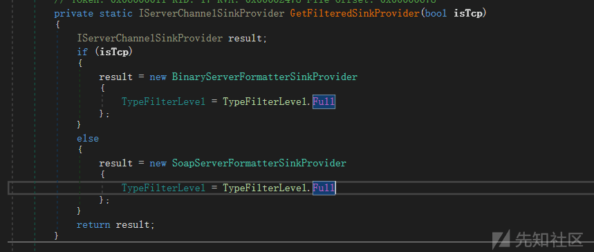
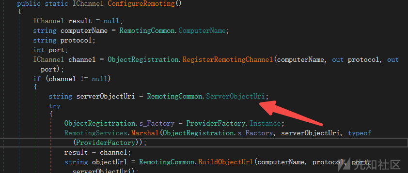
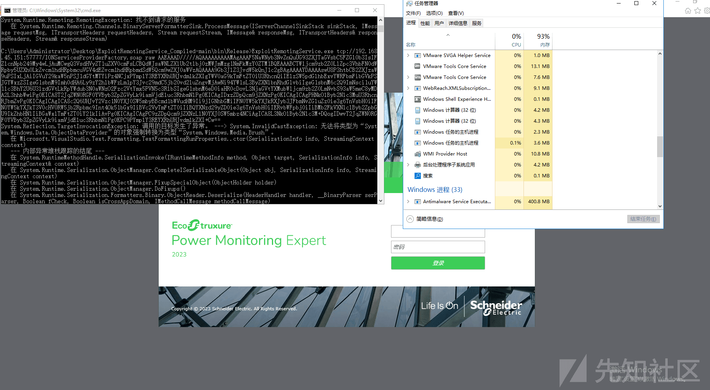

Schneider Electric EcoStruxure PME RCE 漏洞分析

- - -

# Schneider Electric EcoStruxure PME RCE 漏洞分析

## 漏洞信息

去年年底爆的洞。  
漏洞链接：[https://www.zerodayinitiative.com/advisories/ZDI-23-1795/](https://www.zerodayinitiative.com/advisories/ZDI-23-1795/)  
漏洞描述：The specific flaw exists within the GetFilteredSinkProvider method. The issue results from the lack of proper validation of user-supplied data, which can result in deserialization of untrusted data. An attacker can leverage this vulnerability to execute code in the context of LOCAL SERVICE.  
环境：注册之后能直接下载，[https://ecoxpert.se.com](https://ecoxpert.se.com/)

## 前置知识

移步[https://xz.aliyun.com/t/9605](https://xz.aliyun.com/t/9605)

## 漏洞分析

根据漏洞描述漏洞出现在 GetFilteredSinkProvider，一看这个函数应该是.net remoting 出的问题。

[](https://xzfile.aliyuncs.com/media/upload/picture/20240124171713-5c127744-ba99-1.png)  
可以看到这个函数是为了配置 SinkProvider，使用的是原生的两种 BinaryServerFormatterSinkProvider 和 SoapServerFormatterSinkProvider，并且 TypeFilterLevel 配置为 Full。

查看其调用PowerMeasurement.IONServices.RemotingCommon#CreateChannel函数

```plain
public static IChannel CreateChannel(string protocol, int port, IDictionary additionalProperties)
        {
            bool flag = string.Compare(protocol, "tcp", true, CultureInfo.InvariantCulture) == 0;
            IServerChannelSinkProvider filteredSinkProvider = RemotingCommon.GetFilteredSinkProvider(flag);
            IDictionary dictionary = new Hashtable();
            dictionary["port"] = port;
            dictionary["timeout"] = 30000;
            if (additionalProperties != null)
            {
                foreach (object obj in additionalProperties)
                {
                    DictionaryEntry dictionaryEntry = (DictionaryEntry)obj;
                    dictionary[dictionaryEntry.Key] = dictionaryEntry.Value;
                }
            }
            IChannel result;
            if (!flag)
            {
                IChannel channel = new HttpChannel(dictionary, null, filteredSinkProvider);
                result = channel;
            }
            else
            {
                IChannel channel = new TcpChannel(dictionary, null, filteredSinkProvider);
                result = channel;
            }
            return result;
        }
```

很明显这里就是创建一个 channel，传入的协议是 TCP，最后在 ObjectRegistration 类中注册的，主要代码如下

```plain
private static IChannel RegisterRemotingChannel(string node, out string protocol, out int port)
        {
            IChannel result = null;
            IChannel remotingChannel = ObjectRegistration.GetRemotingChannel(node, out protocol, out port);
            if (remotingChannel != null)
            {
                try
                {
                    ChannelServices.RegisterChannel(remotingChannel, false);
                    result = remotingChannel;
                }
                catch (Exception ex)
                {
                    HostUtilities.ReportChannelRegistrationFailure(remotingChannel, ex);
                }
            }
            return result;
        }
```

到这里看起来没有任何过滤（看到这之前原本猜测是绑定的服务有可以实现RCE的功能，没想到现在居然还有这种直接可利用的洞），继续找绑定的objecturi，全局搜RemotingConfiguration#RegisterWellKnownServiceType或RemotingServices#Marshal的调用点，最后在ObjectRegistration#ConfigureRemoting()方法中配置的

[](https://xzfile.aliyuncs.com/media/upload/picture/20240124181109-e534df10-baa0-1.png)

ObjectUri 配置为 IONServicesProviderFactory.soap，提供的服务是 PowerMeasurement.IONServices.ProviderFactory（没什么危险功能）。

继续找创建 channel 绑定的端口

```plain
public static void GetRemotingChannelInfo(bool isPrimary, string node, out string protocol, out int port)
        {
            protocol = null;
            port = -1;
            RemotingCommon.GetProtocolAndPortFromNetworkConfigDB(isPrimary, node, ref protocol, ref port);
            if (string.IsNullOrEmpty(protocol))
            {
                protocol = "Tcp";
            }
            if (port <= 0)
            {
                port = 57777;
            }
        }
```

默认是 57777，  
直接用 ExploitRemotingService 发送 yso 生成的反序列化数据就行。

## 漏洞复现

[](https://xzfile.aliyuncs.com/media/upload/picture/20240124172728-cac4ae72-ba9a-1.png)
