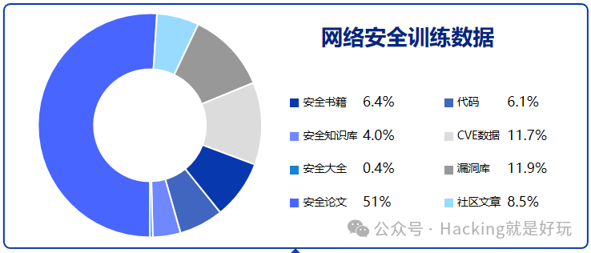

# SecGPT-Mini 的一些补充

现在每个人都可以在电脑内置一个 10 年经验的安全专家了。

SecGPT-Mini：是一个可以在普通 CPU 上运行的网络安全大模型。

对昨天 [https://mp.weixin.qq.com/s?\_\_biz=MzU2NzcwNTY3Mg==&mid=2247484914&idx=1&sn=e828f22691bd3f72c5fab014ce81709c&chksm=fc986cd5cbefe5c3a3180faeb743639e078feea6d3a703bb7ae5e9653a0b61bbfb765d0de32c&token=1274830974&lang=zh\_CN#rd](https://mp.weixin.qq.com/s?__biz=MzU2NzcwNTY3Mg==&mid=2247484914&idx=1&sn=e828f22691bd3f72c5fab014ce81709c&chksm=fc986cd5cbefe5c3a3180faeb743639e078feea6d3a703bb7ae5e9653a0b61bbfb765d0de32c&token=1274830974&lang=zh_CN&scene=21#wechat_redirect) 的一点补充。

### 关于源码

源码一些勘误：需要 python3.9 以上，并且 transformers 依赖库是最新版本

速度比想象中快，有很多群友已经搭建成功开始玩耍了，有好心群友制作了 docker 镜像，可以一键玩耍

```plain
docker pull tanheyii/secgpt-mini:latest
docker run -d -p 7860:7860 tanheyii/secgpt-mini:latest
```

然后访问 IP:7860 即可。

Dockerfile

```plain
FROM python:slim

WORKDIR /secgpt-mini

COPY . /secgpt-mini

RUN pip install -i https://mirrors.ustc.edu.cn/pypi/web/simple -r requirements.txt

EXPOSE 7860

CMD ["python", "webdemo.py", "--base_model", "/secgpt-mini/models"]
```

docker 镜像感谢 @七安

dockerfile 感谢 @沉默

### 关于数据

好的安全数据对训练网络安全模型帮助很大，手头的数据还是远远不够，几次试验感觉还是没有激发很多大模型对安全的理解，怀疑是数据量还不够。

目前训练数据包含 10G 安全数据，来源从 GitHub，社区论坛，知识星球，安全大会 pdf，epub 书籍，wooyun 等等。清洗完后的训练数据只有 1～2G 左右。



数据已经开源了一部分：https://huggingface.co/datasets/w8ay/security-paper-datasets  

如果读者手中有安全数据可以邮件我，可以来一起训练网络安全领域的大模型，后续也会将数据进行开源（获得许可的情况下）。

需要的数据类型：

-   安全书籍 epub 格式 (让模型学习安全知识)
    
-   大量 poc，exp（让模型学习写 poc，exp）
    
-   ctf writeup（让模型学习做 CTF）
    
-   安全代码，如免杀，hook，patch 类的（让模型学习写安全代码）
    
-   其他认为有帮助的数据
    
-   也可以提供 rlhf 数据：secgpt-mini web 界面交互的结果，如何觉得答案好，可以选择“选这个”，如果答案都不好可以自己写一段，然后选择“都不好，反馈”，会在程序根目录下自动生成用于 rlhf 的数据，也可以将这个数据提供我，作为后面进行提升模型精准度训练的数据。  
    

后续还有打算 1 是编写爬虫爬取安全类博客文章，2 是通过对通用爬虫数据清洗出安全数据，有相关经验的读者也可以交流。

邮件地址：master@hacking8.com（最好是邮件，公众号后台不常看，有些不错的私信由于时间间隔过长也无法回复）

后面也会写一些文章教大家如何训练，如何最小资源训练，不同的数据比例训练的模型回答风格也不相同，这块主要看经验，也挺有意思的，欢迎关注我。

### 其他

-   做安全大模型是兴趣，欢迎一起交流，邮件：master@hacking8.com
    
-   secgpt-mini 的模型和源码下载：公众号回复“secgpt-mini”
