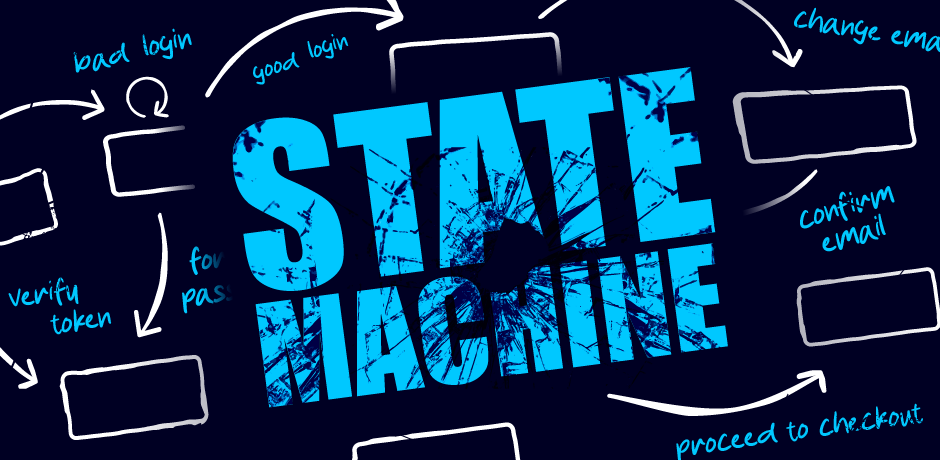
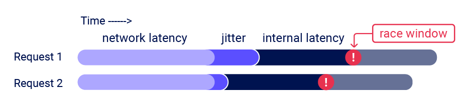
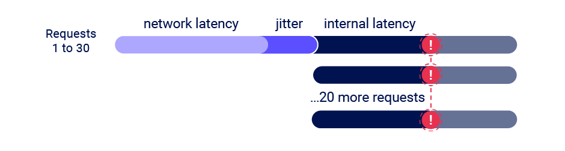
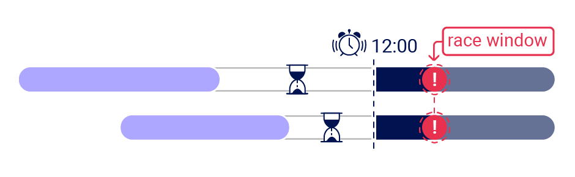

# Smashing the state machine: the true potential of web race conditions

-   [↓↓↓](https://twitter.com/share?url=https%3A%2F%2Fportswigger.net%2Fresearch%2Fsmashing-the-state-machine&text=Smashing+the+state+machine%3A+the+true+potential+of+web+race+conditions%20-%20%40PortSwiggerRes%0A)  
      
      
      
    [↑↑↑](https://twitter.com/share?url=https%3A%2F%2Fportswigger.net%2Fresearch%2Fsmashing-the-state-machine&text=Smashing+the+state+machine%3A+the+true+potential+of+web+race+conditions%20-%20%40PortSwiggerRes%0A)
    
-   [↓↓↓](https://api.whatsapp.com/send?text=https%3A%2F%2Fportswigger.net%2Fresearch%2Fsmashing-the-state-machine)  
      
      
      
    [↑↑↑](https://api.whatsapp.com/send?text=https%3A%2F%2Fportswigger.net%2Fresearch%2Fsmashing-the-state-machine)
    
-   [↓↓↓](https://reddit.com/submit?url=https%3A%2F%2Fportswigger.net%2Fresearch%2Fsmashing-the-state-machine)  
      
      
      
    [↑↑↑](https://reddit.com/submit?url=https%3A%2F%2Fportswigger.net%2Fresearch%2Fsmashing-the-state-machine)
    
-   [↓↓↓](https://www.linkedin.com/sharing/share-offsite?url=https%3A%2F%2Fportswigger.net%2Fresearch%2Fsmashing-the-state-machine)  
      
      
      
    [↑↑↑](https://www.linkedin.com/sharing/share-offsite?url=https%3A%2F%2Fportswigger.net%2Fresearch%2Fsmashing-the-state-machine)
    
-   [↓↓↓](mailto:?subject=Smashing+the+state+machine%3A+the+true+potential+of+web+race+conditions&body=Smashing+the+state+machine%3A+the+true+potential+of+web+race+conditions%0A%0AFor+too+long%2C+web+race+condition+attacks+have+focused+on+a+tiny+handful+of+scenarios.+Their+true+potential+has+been+masked+thanks+to+tricky+workflows%2C+missing+tooling%2C+and+simple+network+jitter+hiding%0A%0Ahttps://portswigger.net/research/smashing-the-state-machine)  
      
      
      
    [↑↑↑](mailto:?subject=Smashing+the+state+machine%3A+the+true+potential+of+web+race+conditions&body=Smashing+the+state+machine%3A+the+true+potential+of+web+race+conditions%0A%0AFor+too+long%2C+web+race+condition+attacks+have+focused+on+a+tiny+handful+of+scenarios.+Their+true+potential+has+been+masked+thanks+to+tricky+workflows%2C+missing+tooling%2C+and+simple+network+jitter+hiding%0A%0Ahttps://portswigger.net/research/smashing-the-state-machine)
    
-   [↓↓↓](https://portswigger.net/research/rss)  
      
      
      
    [↑↑↑](https://portswigger.net/research/rss)
    

### [James Kettle](https://portswigger.net/research/james-kettle)

Director of Research

[@albinowax](https://twitter.com/albinowax)

-   **Published:** 09 August 2023 at 18:00 UTC
    
-   **Updated:** 18 September 2023 at 14:17 UTC
    

  

For too long, web race condition attacks have focused on a tiny handful of scenarios. Their true potential has been masked thanks to tricky workflows, missing tooling, and simple network jitter hiding all but the most trivial, obvious examples.

In this paper, I'll introduce new classes of race condition that go far beyond the limit-overrun exploits you're probably already familiar with. With these I'll exploit both multiple high-profile websites and Devise, a popular authentication framework for Rails.

I'll also introduce the single-packet attack; a jitter-dodging strategy that can squeeze 30 requests sent from Melbourne to Dublin into a sub-1ms execution window. This paper is accompanied by a full complement of free online labs, so you'll be able to try out your new skill set immediately.

This research paper accompanies a presentation at [Black Hat USA](https://www.blackhat.com/us-23/briefings/schedule/index.html#smashing-the-state-machine-the-true-potential-of-web-race-conditions-31712), [DEF CON](https://defcon.org/html/defcon-31/dc-31-schedule.html#:~:text=Smashing%20the%20state%20machine%3A%20the%20true%20potential%20of%20web%20race%20conditions) & [Nullcon](https://nullcon.net/goa-2023/speaker-smashing-the-state-machine-the-true-potential-of-web-race-conditions):

按钮

DEFCONConference

28.5 万位订阅者

[DEF CON 31 - Smashing the State Machine the True Potential of Web Race Conditions - James Kettle](https://www.youtube.com/watch?v=tKJzsaB1ZvI)

稍后观看

分享

[↓↓↓](https://www.youtube.com/watch?v=tKJzsaB1ZvI&embeds_referring_euri=https%3A%2F%2Fportswigger.net%2F&embeds_referring_origin=https%3A%2F%2Fportswigger.net&feature=emb_imp_woyt)  
  

前往平台观看：

  
  
[↑↑↑](https://www.youtube.com/watch?v=tKJzsaB1ZvI&embeds_referring_euri=https%3A%2F%2Fportswigger.net%2F&embeds_referring_origin=https%3A%2F%2Fportswigger.net&feature=emb_imp_woyt)

It is also available in a [print/download-friendly PDF](https://portswigger.net/kb/papers/rifmwla/racewhitepaper.pdf) format.

### Outline

-   [The true potential](#introduction)

-   [Beyond limit-overrun](#beyond-limit-overrun)
-   [Single-packet attack](#single-packet-attack)
-   [Methodology](#methodology)

-   [Case studies](#case-studies)

-   [Object masking](#object-masking)
-   [Multi-endpoint](#multi-endpoint)
-   [Single-endpoint](#single-endpoint)
-   [Deferred](#deferred)

-   [Further research](#further-research)
-   [Defence](#defence)
-   [Takeaways](#takeaways)

### Background

#### Race condition fundamentals

To begin, let's recap race condition fundamentals. I'll keep this brief - if you'd prefer an in-depth introduction, check out our new [Web Security Academy topic](https://portswigger.net/web-security/race-conditions).

Most websites handle concurrent requests using multiple threads, all reading and writing from a single, shared database. Application code is rarely crafted with concurrency risks in mind and as a result, [race conditions](https://portswigger.net/web-security/race-conditions) plague the web. Exploits are typically limit-overrun attacks - they use synchronized requests to overcome some kind of limit, for example:

-   Redeeming a gift card multiple times
-   [Repeatedly applying a single discount code](https://portswigger.net/web-security/race-conditions/lab-race-conditions-limit-overrun)
-   Rating a product multiple times
-   Withdrawing or transferring cash in excess of your account balance
-   [Reusing a single CAPTCHA solution](https://portswigger.net/research/cracking-recaptcha-turbo-intruder-style)
-   [Bypassing an anti-bruteforce rate-limit](https://portswigger.net/web-security/race-conditions/lab-race-conditions-bypassing-rate-limits)

The underlying cause of these is also similar - they all exploit the time-gap between the security check and the protected action. For example, two threads may simultaneously query a database and confirm that the TOP10 discount code hasn't been applied to the cart, then both attempt to apply the discount, resulting in it being applied twice. You'll often find these referred to as 'time of check, time of use' (TOCTOU) flaws for this reason.

Please note that race-conditions are not limited to a specific web-app architecture. It's easiest to reason about a multi-threaded single-database application, but more complex setups typically end up with state stored in even more places, and ORMs just hide the dangers under layers of abstraction. Single-threaded systems like NodeJS are slightly less exposed, but can still end up vulnerable.

#### Beyond limit-overrun exploits

I used to think race conditions were a well-understood problem. I had discovered and exploited plenty, implemented the 'last-byte sync' technique in Turbo Intruder, and used that to exploit various targets [including Google reCAPTCHA](https://portswigger.net/research/cracking-recaptcha-turbo-intruder-style). Over time, Turbo Intruder has become the de-facto tool for hunting web race conditions.

However, there was one thing I didn't understand. A [blog post from 2016](https://www.josipfranjkovic.com/blog/race-conditions-on-web) by Josip Franjković detailed four vulnerabilities, and while three of them made perfect sense to me, one didn't. In the post, Josip explained how he "somehow succeeded to confirm a random email address" by accident, and neither he nor Facebook's security team were able to identify the cause until two months later. The bug? Changing your Facebook email address to two different addresses simultaneously could trigger an email containing two distinct confirmation codes, one for each address:

`/confirmemail.php?e=user@gmail.com&c=13475&code=84751`

I had never seen a finding like this before, and it confounded every attempt to visualize what might be happening server-side. One thing was for sure - this wasn't a limit-overrun.

Seven years later, I decided to try and figure out what happened.

#### The true potential of web race conditions

The true potential of race conditions can be summed up in a single sentence. Every pentester knows that multi-step sequences are a hotbed for vulnerabilities, but with race conditions, everything is multi-step.

To illustrate this, let's plot the state machine for a serious vulnerability that I discovered by accident a while back. When a user logged in, they were presented with a 'role selection' page containing a range of buttons that would assign a role, and redirect to a specific application. The request flow looked something like:

|     |     |
| --- | --- |
| POST /login | 302 Found |
| GET /role | 200 Found |
| POST /role | 302 Found |
| GET /application | 200 OK |

In my head, the state machine for the user's role looked like this:

  

I attempted to elevate privileges by forcibly browsing directly from the role selection page to an application without selecting a role, but this didn't work and so I concluded that it was secure.

However, this state machine had a mistake. I had incorrectly assumed that the GET /role request didn't change the application state. In actual fact, the application was initialising every session with administrator privileges, then overwriting them as soon as the browser fetched the role selection page. Here's an accurate state machine:

  

I only discovered this through extreme luck, and it took me hours of retrospective log digging to figure out the cause. This vulnerability pattern is frankly a weird one, but we can learn something valuable from the near-miss.

My primary mistake was the assumption that the GET request wouldn't change the application state. However, there's a second assumption that's even more common - that "requests are atomic". If we ditch this assumption too, we realize this pattern could occur in the span of a single login request:

  

This scenario captures the essence of 'with race conditions, everything is multi-step'. Every HTTP request may transition an application through multiple fleeting, hidden states, which I'll refer to as 'sub-states'. If you time it right, you can abuse these sub-states for unintended transitions, break business logic, and achieve high-impact exploits. Let's get started.

### Single-packet attack

A sub-state is a short-lived state that an application transitions through while processing a single request, and exits before the request completes. Sub-states are only occupied for a brief time window - often around 1ms (0.001s). I'll refer to this time window as the 'race window'.

To discover a sub-state, you need an initial HTTP request to trigger a transition through the sub-state, and a second request that interacts with the same resource during the race window. For example, to discover the vulnerability mentioned earlier you would send a request to log in, and a second request that attempted to access the admin panel. Vulnerabilities with small race windows have historically been extremely difficult to discover thanks to network jitter. Jitter erratically delays the arrival of TCP packets, making it tricky to get multiple requests to arrive close together, even when using techniques like last-byte sync:

  

In search of a solution, I've developed the 'single-packet attack'. Using this technique, you can make 20-30 requests arrive at the server simultaneously - regardless of network jitter:

  

I implemented the single-packet attack in the open-source Burp Suite extension [Turbo Intruder](https://github.com/PortSwigger/turbo-intruder). To benchmark it, I repeatedly sent a batch of 20 requests 17,000km from Melbourne to Dublin, and measured the gap between the start-of-execution timestamp of the first and last request in each batch. I've published the benchmark scripts in [the examples folder](https://github.com/PortSwigger/turbo-intruder/blob/master/resources/examples/) so you can try them for yourself if you like.

|     |     |     |
| --- | --- | --- |
| Technique | Median spread | Standard deviation |
| --- | --- | --- |
| Last-byte sync | 4ms | 3ms |
| Single-packet attack | 1ms | 0.3ms |

By these measures, the single-packet attack is 4 to 10 times more effective. When replicating one real-world vulnerability, the single-packet attack was successful after around 30 seconds, and last-byte sync took over two hours.

One great side effect of this is that we've been able to launch a Web Security Academy topic containing labs with realistic race windows, without alienating users who live far away from our servers or have high-jitter connections. You can try the single-packet attack out for yourself by tackling our [limit-overrun lab](https://portswigger.net/web-security/race-conditions/lab-race-conditions-limit-overrun) with the [single-packet-attack.py](https://github.com/PortSwigger/turbo-intruder/blob/master/resources/examples/race-single-packet-attack.py) Turbo Intruder template. The race-window on this lab ended up so small that exploitation is near-impossible using multiple packets. It's also available in Repeater via the new 'Send group in parallel' option in Burp Suite.

Let's take a look under the hood.

#### Developing the single-packet attack

The single-packet attack was inspired by the 2020 USENIX presentation [Timeless Timing Attacks](https://www.usenix.org/conference/usenixsecurity20/presentation/van-goethem). In that presentation, they place two entire HTTP/2 requests into a single TCP packet, then look at the response order to compare the server-side processing time of the two requests:

This is a novel possibility with HTTP/2 because it allows HTTP requests to be sent over a single connection concurrently, whereas in HTTP/1.1 they have to be sequential.

The use of a single TCP packet completely eliminates the effect of network jitter, so this clearly has potential for race condition attacks too. However, two requests isn't enough for a reliable race attack thanks to server-side jitter - variations in the application's request-processing time caused by uncontrollable variables like CPU contention.

I spotted an opportunity to adapt a trick from the HTTP/1.1 'last-byte sync' technique. Since servers only process a request once they regard it as complete, maybe by withholding a tiny fragment from each request we could pre-send the bulk of the data, then 'complete' 20-30 requests with a single TCP packet:

  

After a few weeks of experimenting, I'd built an implementation that worked on all tested HTTP/2 servers.

#### Rolling your own implementation

This concept is honestly pretty obvious, and after implementing it I discovered someone else had the same idea [back in 2020](https://aaltodoc.aalto.fi/bitstream/handle/123456789/47110/master_Papli_Kaspar_2020.pdf), but nobody noticed at the time and their algorithm & implementation didn't receive the polish, testing and integration essential to prove its true value. The reason I'm so excited about the single-packet attack is that it's powerful, universal, and trivial. Even after spending months refining it to work on all major webservers the algorithm is still so simple it fits on a single page, and so easy to implement that I expect it to end up in all major web testing tools.

The primary reason it's so easy to implement is that thanks to some creative abuse of [Nagle's algorithm](https://en.wikipedia.org/wiki/Nagle%27s_algorithm), it doesn't require a custom TCP or TLS stack. You can just pick an HTTP/2 library to hook into (trust me, coding your own is not much fun), and apply the following steps:

First, pre-send the bulk of each request:

-   If the request has no body, send all the headers, but don't set the END\_STREAM flag. Withhold an empty data frame with END\_STREAM set.
-   If the request has a body, send the headers and all the body data except the final byte. Withhold a data frame containing the final byte.

You might be tempted to send the full body and rely on not sending END\_STREAM, but this will break on certain HTTP/2 server implementations that use the content-length header to decide when a message is complete, as opposed to waiting for END\_STREAM.

Next, prepare to send the final frames:

-   Wait for 100ms to ensure the initial frames have been sent.
-   Ensure TCP\_NODELAY is disabled - it's crucial that Nagle's algorithm batches the final frames.
-   Send a ping packet to warm the local connection. If you don't do this, the OS network stack will place the first final-frame in a separate packet.

Finally, send the withheld frames. You should be able to verify that they landed in a single packet using Wireshark.

This approach worked on all dynamic endpoints on all tested servers. It doesn't work for static files on certain servers but as static files aren't relevant to race condition attacks, I haven't attempted to find a workaround for this. In Turbo Intruder, the static-file quirk results in a negative timestamp as the response is received before the request is completed. This behavior can be used as a way of testing if a file is static or not.

If you're not sure which HTTP/2 stack to build on, I think Golang's might be a good choice - I've seen that successfully extended for advanced HTTP/2 attacks in the past. If you'd like to see a reference implementation in Kotlin, feel free to use Turbo Intruder. The relevant code can be found in [SpikeEngine](https://github.com/PortSwigger/turbo-intruder/blob/master/src/SpikeEngine.kt) and [SpikeConnection](https://github.com/PortSwigger/turbo-intruder/blob/master/src/SpikeConnection.kt).

#### Adapting to the target architecture

It's worth noting that many applications sit behind a front-end server, and these may decide to forward some requests over existing connections to the back-end, and to create fresh connections for others.

As a result, it's important not to attribute inconsistent request timing to application behavior such as locking mechanisms that only allow a single thread to access a resource at once. Also, front-end request routing is often done on a per-connection basis, so you may be able to smooth request timing by performing server-side connection warming - sending a few inconsequential requests down your connection before performing the attack. You can try this technique out for yourself on our [multi-endpoint lab](https://portswigger.net/web-security/race-conditions/lab-race-conditions-multi-endpoint).

### Methodology

Now that we've established 'everything is multi-step', and developed a technique to allow accurate request synchronization and make race conditions reliable, it's time to start hunting vulnerabilities. Classic limit-overrun vulnerabilities can be discovered using a trivial methodology: identify a limit, and try to overrun it. Discovering exploitable sub-states for more advanced attacks is not quite so simple.

Over months of testing, I've developed the following black-box methodology to help. I recommend using this approach even if you have source-code access; in my experience it's extremely challenging to identify race conditions through pure code analysis.

  

#### Predict potential collisions

Prediction is about efficiency. Since everything is multi-step, ideally we'd test every possible combination of endpoints on the entire website. This is impractical - instead, we need to predict where vulnerabilities are likely to occur. One tempting approach is to simply try and find replicas of the vulnerabilities described in this paper later on - this is nice and easy, but you'll miss out on exciting, undiscovered variants.

To start, identify objects with security controls that you'd like to bypass. This will typically include users and sessions, plus some business-specific concepts like orders.

For each object, we then need to identify all the endpoints that either write to it, or read data from it and then use that data for something important. For example, users might be stored in a database table that is modified by registration, profile-edits, password reset initiation, and password reset completion. Also, a website's login functionality might read critical data from the users table when creating sessions.

A race condition vulnerability requires a 'collision' - two concurrent operations on a shared resource. We can use three key questions to rule out endpoints that are unlikely to cause collisions. For each object and the associated endpoints, ask:

##### 1) How is the state stored?

Data that's stored in a persistent server-side data structure is ideal for exploitation. Some endpoints store their state entirely client-side, such as password resets that work by emailing a JWT - these can be safely skipped.

Applications will often store some state in the user session. These are often somewhat protected against sub-states - more on that later.

##### 2) Are we editing or appending?

Operations that edit existing data (such as changing an account's primary email address) have ample collision potential, whereas actions that simply append to existing data (such as adding an additional email address) are unlikely to be vulnerable to anything other than limit-overrun attacks.

##### 3) What's the operation keyed on?

Most endpoints operate on a specific record, which is looked up using a 'key', such as a username, password reset token, or filename. For a successful attack, we need two operations that use the same key. For example, picture two plausible password reset implementations:

  

In the first implementation, the user's password reset token is stored in the users table in the database, and the supplied userid acts as the key. If an attacker uses two requests to trigger a reset for two different userids at the same time, two different database records will be altered so there's no potential for a collision. By identifying the key, you've identified that this attack is probably not worth attempting.

In the second implementation, the state is stored in the user's session, and the token-storage operation is keyed on the user's sessionid. If an attacker uses two requests to trigger a reset for two different emails at the same time, both threads will attempt to alter the same session's token and userid attributes, and the session may end up containing one user's userid, and a token that was sent to the other user.

#### Probe for clues

Now that we've selected some high-value endpoints, it's time to probe for clues - hints that hidden sub-states exist. We don't need to cause a meaningful exploit yet - our objective at this point is simply to evoke a clue. As such, you'll want to send a large number of requests to maximize the chance of visible side-effects, and mitigate server-side jitter. Think of this as a chaos-based strategy - if we see something interesting, we'll figure out what actually happened later.

Prepare your blend of requests, targeting endpoints and parameters to trigger all relevant code paths. Where possible, use multiple requests to trigger each code path multiple times, with different input values.

Next, benchmark how the endpoints behave under normal conditions by sending your request-blend with a few seconds between each request.

Finally, use the single-packet attack (or last-byte sync if HTTP/2 isn't supported) to issue all the requests at once. You can do this in Turbo Intruder using the single-packet-attack template, or in Repeater using the 'Send group in parallel' option.

Analyze the results and look for clues in the form of any deviation from the benchmarked behavior. This could be a change in one or more responses, or a second-order effect like different email contents or a visible change in your session. Clues can be subtle and counterintuitive so if you skip the benchmark step, you'll miss vulnerabilities.

Pretty much anything can be a clue, but pay close attention to the request processing time. If it's shorter than you'd expect, this can indicate that data is being passed to a separate thread, greatly increasing the chances of a vulnerability. If it's longer than you expect, that could indicate resource limits - or that the application is using locking to avoid concurrency issues. Note that PHP locks on the sessionid by default, so you need to use a separate session for every request in your batch or they'll get processed sequentially.

#### Prove the concept

If you spot a clue, the final step is to prove the concept and turn it into a viable attack. The exact steps here will depend on the attack you're attempting, but there are a few general pointers that may be useful:

When you send a batch of requests, you may find that an early request pair triggers a vulnerable end-state, but later requests overwrite/invalidate it and the final state is unexploitable. In this scenario, you'll want to eliminate all unnecessary requests - two should be sufficient for exploiting most vulnerabilities.

Dropping to two requests will make the attack more timing-sensitive, so you may need to retry the attack multiple times or automate it. On a couple of targets I ended up writing a Turbo Intruder script to repeatedly trigger emails, retrieve them from Burp Collaborator, and extract and visit the links within. You can find an example in the [email-extraction template](https://github.com/PortSwigger/turbo-intruder/blob/master/resources/examples/email-link-extraction.py).

Finally, don't forget to escalate! Think of each race condition as a structural weakness, rather than an isolated vulnerability. Advanced race conditions can cause unusual and unique primitives, so the path to maximum impact isn't always obvious. For example, in one case I ended up with different endpoints on a single website disagreeing about what my email address was. During this research I personally missed out on ~$5k due to overlooking one exploit avenue until after the vulnerability was patched.

### Case studies

Let's take a look at the methodology and tooling in action, with some real-life case studies. These vulnerabilities are focused on email-related functionality, as my primary objective was to understand the mysterious Facebook exploit.

First, a disclaimer. During research, I usually accrue a large number of case studies affecting high-profile companies by using automation to test tens of thousands of sites. Race conditions aren't suitable for this scale of automation, so every example that follows is brought to you by hours of mostly manual testing. On the bright side, this means I've tested only a tiny proportion of websites with bug bounty programs, and left a lot of money on the table for everyone else.

#### Object masking via limit-overrun

We'll start with an object masking vulnerability in Gitlab. Gitlab lets you invite users to administer projects via their email address. I decided to try a probe with six identical requests:

`POST /api/…/invitations HTTP/2 ... {"email":"x@psres.net"}`

To build a baseline, I sent these requests sequentially with a small delay between each. This resulted in the response {"status":"success"} six times, and one invitation email.

Next, I sent the requests simultaneously, using the single-packet attack. This resulted in one response containing {"status":"success"}, five responses saying {"message":"The member's email address has already been taken"}, and two emails.

Receiving two emails from six requests is a clear clue that I've hit a sub-state, and further testing is warranted. The difference in the responses is also a clue. Note that if I hadn't benchmarked Gitlab's baseline behavior, I wouldn't have regarded the five "The member's email address has already been taken" responses as suspicious. Finally, there was also a second-order clue: after an attack, any attempt to edit the resulting invitation triggered an error.

After some more digging, I was able to arrive at a low-severity exploit. The page that lists active invitations only displays one invitation for a given email address. Using the race condition, I was able to create a dummy low-privilege invitation which gets replaced by an admin-level invitation if it's revoked.

The impact here wasn't great, but it hinted at deeper problems to come.

#### Multi-endpoint collisions

Classic multi-step exploits can provide inspiration for race condition attacks. While testing an online shop a while ago, I discovered that I could start a purchase flow, pay for my order, and then add an extra item to my basket before I loaded the order confirmation page - effectively getting the extra item for free. We later made a [replica of this vulnerability](https://portswigger.net/web-security/logic-flaws/examples/lab-logic-flaws-insufficient-workflow-validation) for training purposes.

There's a [documented](https://soroush.secproject.com/downloadable/common-security-issues-in-financially-orientated-web-applications.pdf) race condition variation of this attack that can occur when the payment and order confirmation are performed by a single request.

On Gitlab, emails are important. The ability to 'verify' an email address you don't own would let you gain administrator access to other projects by hijacking pending invitations. Furthermore, since Gitlab acts as an [OpenID](https://portswigger.net/web-security/oauth/openid) IDP, it could also be abused to hijack accounts on third-party websites that naively trust Gitlab's email verification.

The basket attack might not sound relevant to exploiting Gitlab, but I realized that when visualized, Gitlab's email verification flow looks awfully similar:

  

Perhaps by verifying an email address and changing it at the same time, I could trick Gitlab into incorrectly marking the wrong address as verified?  

When I attempted this attack, I noticed that the confirmation operation was executing before the email-change every time. This suggested that the email-change endpoint was doing more processing than the email-confirmation endpoint before it hit the vulnerable sub-state, so sending the two requests in sync was missing the race window:

Delaying the confirmation request by 90ms fixed the issue, and achieved a 50/50 spread between the email-change landing first, and the email-confirmation landing first.

Note that adding a client-side delay means you can't use the single-packet attack, so on high-jitter targets it won't work reliably regardless of what delay you set:

If you encounter this problem, you may be able to solve it by abusing a common security feature. Webservers often have 'leaky bucket' rate-limits which delay processing of requests if they're sent too quickly. You can abuse this by sending a large number of dummy requests to trigger the rate-limit and cause a server-side delay, making the single-packet attack viable even when delayed execution is required:

Back on Gitlab, lining the race window up revealed two clues - the email confirmation request intermittently triggered a 500 Internal Server Error, and sometimes the confirmation token was sent to the wrong address! Unfortunately, the misdirected code was only valid for confirming the already-confirmed address, making it useless.

Still, thanks to the misdirected code we know there's at least one sub-state hidden inside Gitlab's email-change endpoint. Maybe we just need a different angle to exploit this?

#### Single-endpoint collisions

Race conditions thrive on complexity - they get progressively more likely the more data gets saved, written, read, altered, and handed off between classes, threads, and processes. When an endpoint is sufficiently complex, you don't even need any other endpoints to cause an exploitable collision.

On Gitlab, I noticed that when I tried to change my email address, the response time was 220ms - faster than I'd expect for an operation that sends an email. This hinted that the email might be sent by a different thread - exactly the kind of complexity we need.

I decided to probe Gitlab by changing my account's email address to two different addresses at the same time:

`POST /-/profile HTTP/2   Host: gitlab.com      user[email]=test1@psres.net` `POST /-/profile HTTP/2   Host: gitlab.com      user[email]=test2@psres.net`

This revealed a massive clue:

`To: test2@psres.net Subject: Confirmation instructions test1@psres.net Click the link below to confirm your email address. Confirm your email address`

The address the message was sent to didn't always match the address in the body. Crucially, the confirmation token in the misrouted email was often valid. By submitting two requests, containing my own email address and albinowaxed@gitlab.com, I was able to obtain the latter as a validated address. You can still [view it on my profile](https://gitlab.com/albinowax1).

More importantly, this unlocked the invitation-hijacking and OpenID attacks mentioned earlier.

I've recorded a video demonstrating the full discovery process on a remote Gitlab installation:

按钮

PortSwigger

2.53 万位订阅者

[Discovering a race condition vulnerability in Gitlab with the single-packet attack](https://www.youtube.com/watch?v=Y0NVIVucQNE)

稍后观看

分享

[↓↓↓](https://www.youtube.com/watch?v=Y0NVIVucQNE&embeds_referring_euri=https%3A%2F%2Fportswigger.net%2F&embeds_referring_origin=https%3A%2F%2Fportswigger.net&feature=emb_imp_woyt)  
  

前往平台观看：

  
  
[↑↑↑](https://www.youtube.com/watch?v=Y0NVIVucQNE&embeds_referring_euri=https%3A%2F%2Fportswigger.net%2F&embeds_referring_origin=https%3A%2F%2Fportswigger.net&feature=emb_imp_woyt)

  

##### Code analysis

Although my exploit worked, I still had no idea what had actually happened.

The vulnerability seemed to originate from the way Gitlab had integrated [Devise](https://github.com/heartcombo/devise), a popular authentication framework for Ruby on Rails. I explored the Devise codebase via [Confirmable.rb](https://github.com/heartcombo/devise/blob/ec0674523e7909579a5a008f16fb9fe0c3a71712/lib/devise/models/confirmable.rb), and Gitlab via [their patch for my finding](https://gitlab.com/gitlab-org/gitlab/-/commit/e4d8d4f818275d42469d154b72fc6367b2b86bbb). Analyzing the race condition from a white-box perspective proved quite challenging, especially around the boundary between Devise and Gitlab, but here's my best shot at explaining the inner workings of this vulnerability.

If you request an email change, Devise updates user.unconfirmed\_email, saves a security token in user.confirmation\_token, and emails a link containing the token to user.unconfirmed\_email:

`self.unconfirmed_email = self.email // from 'email' parameter... self.confirmation_token = @raw_confirmation_token = Devise.friendly_token ... // this eventually gets handed off a different thread to render & send the emailsend_devise_notification(:confirmation_instructions, @raw_confirmation_token, { to: unconfirmed_email } )` `// an email is queued to the unconfirmed_email argument // but the body is generated via a template engine reads the variables back from the database- confirmation_link = confirmation_url(@resource, confirmation_token: @token) - if @resource.unconfirmed_email.present? || !@resource.created_recently? #content = email_default_heading(@resource.unconfirmed_email || @resource.email) %p= _('Click the link below to confirm your email address.') #cta = link_to _('Confirm your email address'), confirmation_link`

The vulnerability arises in an inconsistency between how Devise knows where to send the email, and how it knows what to put inside the email. The email is sent to a variable passed directly in an argument to send\_devise\_notification. However, the variables used to populate the email body, including the confirmation\_link, are retrieved from the database using a server-side template engine. This creates a race window between send\_devise\_notification being invoked, and the email body being generated, where another thread can update user.unconfirmed\_email in the database.

While attempting to replicate this vulnerability on a local Gitlab installation, I noticed an important detail that I overlooked during the original discovery. Although it's easy to trigger an email that gets sent to the wrong address, the confirmation token within is only valid if the application is in the right starting state. For a successful exploit, you need to trigger Devise's 'resend existing token' code path. You can do this by hitting the resend\_confirmation\_token endpoint if it's exposed, or simply by requesting a change to the same email address twice.

We've built a [replica of this vulnerability](https://portswigger.net/web-security/race-conditions/lab-race-conditions-single-endpoint) so you can practise your single-endpoint exploitation skills.

##### Testing other Devise sites

I reported this vulnerability to Gitlab, and they assigned it CVE-2022-4037 and patched it in release 15.7.2 on the 4th Jan 2023. Note that they classified it as medium severity, but I'd personally classify it as high due to the invitation hijacking exploit which I discovered later.

While reading about Devise, I noticed that [NCC described it as](https://research.nccgroup.com/wp-content/uploads/2020/07/going-auth-the-rails-whitepaper.pdf) "far and away the most popular authentication system for Rails". Over the following 200 days I made multiple attempts to report this issue via three different security-contact addresses without success, so I thought I'd share my experience hunting down other targets built on Devise. Devise can be easily detected using the unauthenticated endpoint /users/confirmation. Scanning for this quickly revealed a number of interesting sites including -temporarily redacted-. Unfortunately for me, -redacted- was wisely not putting much trust in email verification, so the only impact I could identify was the ability to bypass domain-based [access controls](https://portswigger.net/web-security/access-control), which only functioned as a defense-in-depth measure.

On another target, the email confirmation text didn't tell you who the code was for, so you had to click every confirmation link and reload your profile to see if the confirmed email address matched your expectations. Since there was no visible clue and the exploit only worked intermittently, this would have been an easy vulnerability to overlook. I ended up writing a Turbo Intruder script to automate the detection of no-clue token misrouting findings like this, which you can find in the [email-extraction template](https://github.com/PortSwigger/turbo-intruder/blob/master/resources/examples/email-link-extraction.py).

#### Deferred collisions

So far, we've exploited endpoints where the collision occurs more or less straight away. It's a mistake to think that an immediate collision is guaranteed - websites may do critical data processing in batches periodically behind the scenes. In this scenario, you don't need careful request timing to trigger a race condition - the application will do that part for you. I'll refer to these as deferred collisions.

I discovered one of these while probing for code-misrouting races on a major website that really doesn't want me to name them. Confirmation emails took quite a while to arrive, and didn't state which address they were intended to confirm, but I noticed that trying to change my email to two different addresses simultaneously sometimes resulted in two emails to the same address.

It looked similar to the Devise vulnerability until I realized that the two conflicting email-change requests could be sent with a 20-minute delay between them. Deferred race conditions like this one are inherently difficult to identify, as they'll never trigger immediate clues like different responses. Instead, detection is reliant on second-order clues such as changed application behavior or inconsistent emails at a later date. Since the collisions aren't dependent on synchronized requests, clues may appear without any deliberate testing. Over time I've begun to regard spotting anomalies as the single most important skill for finding race conditions.

  

I reported this finding, and the initial fix attempt made the misrouted token invalid most of the time, but not always. A different company's initial fix for their vulnerability was also incomplete, suggesting race condition patches definitely deserve scrutiny.

### Future research

In this paper, I've focused on a collection of closely related exploit scenarios and vulnerability patterns. Race conditions permeate every area of the web, so I suspect there are a range of other undocumented scenarios leading to high impact exploits. These will no doubt prove fruitful for whoever discovers them, and contribute a lot of value if they're shared with the wider security community.

#### Partial construction attacks

One pattern that's just about visible is partial construction vulnerabilities. These occur when an object is created in multiple steps, creating an insecure middle state. For example, during account registration, the application may create the user in the database and set the user's password in two separate SQL statements, leaving a tiny window open where the password is null. This type of attack is most likely to work on applications where you can provide an input value that will match against the uninitialized database value - such as null in JSON, or an empty array in PHP. In the case of a password input, you'll want something that makes the password hash function return null. We've made [a lab](https://portswigger.net/web-security/race-conditions/lab-race-conditions-partial-construction) for this attack class but be warned it's quite tricky.

If you're interested in this attack class I'd highly recommend reading [Natalie Silvanovich's WebRTC research](https://googleprojectzero.blogspot.com/2021/01/the-state-of-state-machines.html)

#### Unsafe data structures

Another angle for further research is exploring the root cause of race conditions - unsafe combinations of data structures and locking strategies. I've encountered three main strategies:

##### Locking

Some data structures aggressively tackle concurrency issues by using locking to only allow a single worker to access them at a time. One example of this is PHP's native session handler - if you send PHP two requests in the same session at the same time, they get processed sequentially! This approach is secure against session-based race conditions but it's terrible for performance, and quite rare as a result.

It's extremely important to spot this strategy when you're testing because it can mask exploitable vulnerabilities. For example, if you try to use two requests in the same session to probe for a database-layer race you'll miss it every time, but the vulnerability will be trivially exploitable using two separate sessions.

##### Batching

Most session handlers and ORMs batch updates to a given session. When they start to process a request they read in an entire record (for example, all the variables in a particular session), and subsequent read/write operations are applied to a local in-memory copy of this record, then when the request processing completes the entire record is serialized back to the database.

This use of a separate in-memory copy per request makes them internally consistent during the request lifecycle and avoids the creation of sub-states. However, if two requests operate on the same record simultaneously, one will end up overwriting the database changes from the other. This means they can't be used to defend against attacks affecting other storage layers.

##### No defense

Finally, some data structures update shared resources in real time with no batching, locking, or synchronization. You'll see this most often with custom, application-specific data structures, and anything stored in databases without consistent use of transactions.

You might also encounter it with custom session handlers, especially those built on low-latency storage like redis or a local database. I have personally encountered a vulnerable session handler, but it doesn't make for a good case study because I obliviously coded it myself!

If you spot a custom session handler, heavy testing is advised as a vulnerable implementation can undermine critical functionality such as login. Here are three snippets of code that are highly exploitable when combined with the session-handler that has no defenses:

`# Bypass code-based password reset session['reset_username'] = username session['reset_code'] = randomCode() Exploit: Simultaneous reset for $your-username and $victim-username` `# Bypass 2FA session['user'] = username if 2fa_enabled: session['require2fa'] = true Exploit: Simultaneous login and sensitive page fetch` `# Session-swap session['user'] = username set_auth_cookies_for(session['user']) Detect: Simultaneous login to two separate accounts from same session Exploit: Force anon session cookie on victim, then log in simultaneously`

Hopefully we'll quickly arrive at a consensus that for a core data-structure like a session handler or ORM, failure to be atomic is a vulnerability.

#### Single-packet attack enhancements

There are three key areas where the single-packet attack could be developed further.

My implementation lets you complete up to 20-30 HTTP requests with a single packet. It's probably possible to improve this number further using TCP/TLS-layer techniques such as forcing the maximum segment size up, or deliberately issuing TCP packets out of order.

As we saw earlier, multi-endpoint attacks often require requests to start processing at different times. Abusing server rate-limits can solve this, but only on some systems. A more generic, reliable way to delay the processing of specific requests in a single packet would be valuable.

Finally, my implementation opts to batch requests at the TCP layer, rather than TLS. This is probably the easiest approach, but if you could instead squeeze the requests into a single TLS record, this would make the single-packet attack work through any proxy that doesn't break TLS - including SOCKS.

### Defence

When a single request can push an application through invisible sub-states, understanding and predicting its behavior is extremely difficult, and makes defense impractical. To secure an application, I recommend eliminating sub-states from all sensitive endpoints by applying the following strategies:

-   Avoid mixing data from different sources. The Devise library read a token from the database, then emailed it to an address held in an instance variable. If it had read both the token and the email address from the database, or passed them both in instance variables, it would not have been vulnerable.
-   Ensure sensitive endpoints make state-changes atomic by using the datastore's concurrency features. For example, use a single database transaction to check the payment matches the cart value and confirm the order.
-   As a defence in depth measure, take advantage of datastore integrity/consistency features like uniqueness constraints.
-   Don't attempt to use one data storage layer to secure another. For example, sessions aren't suitable for preventing limit-overrun attacks on databases.
-   Ensure your session handling framework keeps sessions internally consistent. Updating session variables individually instead of in a batch might be a tempting optimization, but it's extremely dangerous. This goes for ORMs too - by hiding away concepts like transactions, they're taking on full responsibility for them.
-   In some architectures, it may be appropriate to avoid server-side state entirely, instead using encryption to push the state client-side such as JWT.

### Takeaways

HTTP request processing isn't atomic - any endpoint might be sending an application through invisible sub-states. This means that with race conditions, everything is multi-step.

The single-packet attack solves network jitter, making it as though every attack is on a local system. This exposes vulnerabilities that were previously near-impossible to detect or exploit.

Spotting anomalies is the single most important skill for finding race conditions.

Good luck!

\- [albinowax](https://jameskettle.com/)

[Back to all articles](https://portswigger.net/research/articles)
