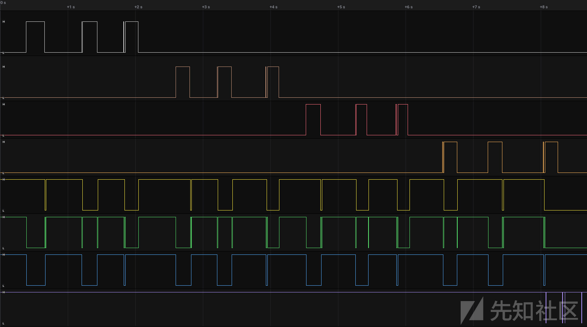

USB Flash 闪存驱动器安全分析（第一部分）

- - -

翻译原文链接：[https://blog.syss.com/posts/hacking-usb-flash-drives-part-1/](https://blog.syss.com/posts/hacking-usb-flash-drives-part-1/)

文章翻译总结：文章对一些具有 AES 硬件加密的 USB 闪存驱动器的网络安全分析研究。研究由 SySS 的 IT 安全专家 Matthias Deeg 进行，他在 2022 年初发现了几个安全漏洞。这些 USB 闪存驱动器被宣传为具有 256 位 AES 硬件加密，有时还带有生物识别技术，但实际上在更仔细的观察核分析下并不安全。还详细介绍了针对所研究的 USB 闪存驱动器的安全问题，包括使用具有风险的加密原语、缺少硬件中的不可变可信根、以及预期行为违规等。文章最后提供了对所发现安全漏洞的总结，并讨论了这些结果表明，新的便携式存储设备仍然存在旧的安全问题。

文章相关标签：#USB Security、#固件分析、#加密、#可信根、#生物安全

# USB Flash 闪存驱动器安全分析（第一部分）

在 2022 年初进行的一项研究中，SySS 的 IT 安全专家 Matthias Deeg 在测试的多款带有 AES 硬件加密的 USB 闪存驱动器中发现了多个安全漏洞。

## 一、文章引入

一直以来，为了安全起见，在静态状态下对敏感数据进行加密是一个明智的选择，尤其是当这些数据被存储在便携式设备上，例如外接硬盘或 USB 闪存驱动器。这是因为一旦这些存储设备遗失或被盗，您需要确保自己的机密数据不会被未经授权的人所访问。然而，令人遗憾的是，即便到了 2022 年，市场上仍有一些标榜“安全”的便携式存储设备，它们配备了 256 位 AES 硬件加密，有时甚至还包括生物识别技术，但实际上，这些设备的安全性并不像它们所声称的那样。

在这系列博客文章中（这是第一篇），我想阐述的是如何引发进一步的研究，最终揭露了几个在加密上存在缺陷的所谓“安全”便携式存储设备。这项研究延续了对带有硬件 AES 加密功能的不安全便携式存储设备的长久关注，这一关注可以追溯到多年以前。

第一部分将介绍我对如图所示的安全 USB 闪存驱动器 Verbatim Keypad Secure 的研究成果。

安全 USB 闪存驱动器 Verbatim Keypad Secure 的正面视图：

[](https://xzfile.aliyuncs.com/media/upload/picture/20240229175922-3647c732-d6e9-1.png)

Verbatim Keypad Secure 是一款配备了 AES 256 位硬件加密功能的 USB 驱动器，并内置有密码输入键盘。

制造商对 Verbatim Keypad Secure 的相关描述如下：

> 这款产品采用 AES 256 位硬件加密技术，能够实时无缝地加密存储在驱动器上的所有数据，并配备了内置的密码输入键盘。与软件加密相比，这款 USB 驱动器不会在电脑或系统的临时内存中留下密码痕迹，因此安全性更高。此外，一旦该设备不慎落入他人之手，它将在 20 次密码尝试失败后自动锁定，并需要重新格式化才能再次使用。\[1\]  
> [https://www.verbatim-europe.co.uk/en/prod/verbatim-keypad-secure-usb-32-gen-1-drive-64gb-49428/](https://www.verbatim-europe.co.uk/en/prod/verbatim-keypad-secure-usb-32-gen-1-drive-64gb-49428/)

## 二、测试方法

针对这个研究不同安全 USB 闪存驱动器的项目，我们采用了以下经过验证的 IT 产品测试方法论：

-   **硬件分析**：拆解硬件，识别芯片，查阅手册，定位测试点，并利用逻辑分析仪和/或 JTAG 调试器进行分析
-   **固件分析**：努力获取设备固件（包括内存转储、下载等方式），并对固件进行安全性分析，以寻找潜在的安全问题
-   **软件分析**：对设备的客户端软件进行静态代码审查和运行时监控分析

根据具体产品的不同，可能无法应用所有类型的分析。例如，如果某个产品没有软件组成部分，那么就无法进行软件分析，Verbatim Keypad Secure 正是这样的情况。

> [https://www.verbatim-europe.co.uk/en/prod/verbatim-keypad-secure-usb-32-gen-1-drive-64gb-49428/](https://www.verbatim-europe.co.uk/en/prod/verbatim-keypad-secure-usb-32-gen-1-drive-64gb-49428/)

## 三、攻击面和攻击场景

在这项研究项目中，针对所测试的“安全”便携式 USB 存储设备的攻击需要物理接触到硬件。通常，这些攻击可以在存储设备生命周期的不同阶段实施：

1.  在合法用户使用设备**之前**进行攻击（供应链攻击）
2.  在合法用户使用设备**之后**进行攻击
    1.  针对丢失或被盗的设备进行攻击
    2.  在合法用户不知情的情况下临时获取设备的物理访问权并进行攻击

## 四、安全 USB 闪存驱动器所需的安全特性

在进行安全测试时，应当拥有一份规格说明书或至少一组测试预期，这样才能判断所获得的测试结果是否真正代表了安全风险

针对安全 USB 闪存驱动器这类产品，以下是我所期望的安全特性列表：

-   所有用户数据都应得到安全加密（即使观察密文，也无法推断出有关明文的任何信息）
-   只有授权用户才能获取存储的数据
-   用户认证流程应无法被规避
    -   在连续 X 次认证尝试失败后，设备应自动重置
-   设备完整性应通过安全的加密措施得到保障
-   进行穷举的离线暴力破解攻击应当成本极高
    -   应具备非常庞大的密钥搜索空间（例如，存在 2^256 种可能的加密密钥）
    -   攻击者不应能轻易获取必要的数据（没有高级、昂贵的设备和相应的专业知识，数据无法被提取）

## 五、硬件分析

在分析一款安全 USB 闪存驱动器这类硬件设备时，首先需要做的是仔细检查其硬件设计。通过拆卸 Verbatim Keypad Secure 的外壳，我们可以看到其内部的印刷电路板（PCB），如下图所展示。

[](https://xzfile.aliyuncs.com/media/upload/picture/20240229180014-55c3ed48-d6e9-1.png)

在这里，我们能够识别出该设备的三个主要组件：

1.  NAND 闪存芯片（型号 TS1256G181）
2.  内存控制器（型号 MARVELL-88NV1120）
3.  USB 至 SATA 桥接控制器（型号 INIC-3637EN）

当我们拆下主 PCB 并检查其背面时，我们发现了另外两个关键组件：

1.  一个 SPI 闪存芯片（型号 XT25F01D）
2.  一个键盘控制器（未知型号，标记为 SW611 2121）

[](https://xzfile.aliyuncs.com/media/upload/picture/20240229180026-5c5c500a-d6e9-1.png)

此外，我们还有若干按键组成了键盘。

Marvell 内存控制器和 NAND 闪存芯片组成了一个 M.2 规格的固态硬盘（SSD），如下图所展示。

M.2 规格的固态硬盘（正面和背面视图）

[](https://xzfile.aliyuncs.com/media/upload/picture/20240229180052-6c0e15c4-d6e9-1.png)

这个 SSD 可以通过另一个支持该规格的 SSD 外壳进行读取和写入，这在后续章节中描述的各种安全测试中显得极为有用。

## 六、锁定设备和重置操作

在深入探究这款安全 USB 闪存驱动器的各个主要组件之前，我们首先进行了一些针对其宣传中提到的安全特性的基础测试，例如用户手册中展示的设备锁定和重置功能，如下图所展示。

Verbatim Keypad Secure 用户手册中关于设备锁定的警告提示

[](https://xzfile.aliyuncs.com/media/upload/picture/20240229180251-b2e7daf2-d6e9-1.png)

这项安全特性的设计初衷是为了在暴力破解攻击中限制密码尝试次数，最多不超过 20 次。一旦在 20 次解锁尝试失败后达到这个阈值，USB 驱动器应该被重新初始化，且之前存储的所有数据应无法再被访问。但在研究项目中，通过手动方式进行密码暴力破解攻击时，我们无法在达到 20 次连续解锁失败后锁定测试设备。因此，Verbatim 所宣称的这种锁定 USB 驱动器并要求重新格式化的安全特性实际上并不符合其规定。这意味着，如果一个攻击者能够物理接触到 Verbatim Keypad Secure USB 闪存驱动器，他们可以尝试超过 20 次的密码猜测，以解锁设备。在我们的手动暴力破解攻击测试中，完全无法实现锁定设备以迫使其重新格式化的功能。

我们发现的安全问题已通过我们的负责任披露计划，通过安全通告 SYSS-2022-004 进行了报告，并获得了 CVE 编号 CVE-2022-28386。

> [https://www.verbatim-europe.co.uk/en/prod/verbatim-keypad-secure-usb-32-gen-1-drive-64gb-49428/](https://www.verbatim-europe.co.uk/en/prod/verbatim-keypad-secure-usb-32-gen-1-drive-64gb-49428/)  
> [https://www.syss.de/fileadmin/dokumente/Publikationen/Advisories/SYSS-2022-004.txt](https://www.syss.de/fileadmin/dokumente/Publikationen/Advisories/SYSS-2022-004.txt)  
> [https://nvd.nist.gov/vuln/detail/CVE-2022-28386](https://nvd.nist.gov/vuln/detail/CVE-2022-28386)

## 七、加密

由于 Verbatim Keypad Secure 内置了一个 M.2 规格的 SATA SSD，该 SSD 可以被安装在另一个兼容的 SSD 外壳中，因此分析这款安全 USB 闪存驱动器存储的数据变得相对简单。

> [https://www.verbatim-europe.co.uk/en/prod/verbatim-keypad-secure-usb-32-gen-1-drive-64gb-49428/](https://www.verbatim-europe.co.uk/en/prod/verbatim-keypad-secure-usb-32-gen-1-drive-64gb-49428/)

通过对加密数据进行分析，我们可以观察到一些明显的模式，如下面的十六进制转储所示：

```plain
# hexdump -C /dev/sda
00000000  c4 1d 46 58 05 68 1d 9a  32 2d 29 04 f4 20 e8 4d  |..FX.h..2-).. .M|
*
000001b0  9f 73 b0 a1 81 34 ef bd  a4 b3 15 2c 86 17 cb 69  |.s...4.....,...i|
000001c0  eb d0 9d 9a 4e d8 04 a6  92 ba 3f f4 0c 88 a5 1d  |....N.....?.....|
000001d0  c4 1d 46 58 05 68 1d 9a  32 2d 29 04 f4 20 e8 4d  |..FX.h..2-).. .M|
*
000001f0  e0 01 66 72 af f2 be 65  5f 69 12 88 b8 a1 0b 9d  |..fr...e_i......|
00000200  00 00 00 00 00 00 00 00  00 00 00 00 00 00 00 00  |................|
*
00100000  73 b2 f8 fb af cf ed 57  47 db b8 c7 ad 9c 91 07  |s......WG.......|
00100010  7a 93 c9 d9 60 7e 2c e4  97 6c 7b f8 ee 4f 87 2c  |z...`~,..l{..O.,|
00100020  19 72 83 d1 6d 0b ca bb  68 f8 ec e3 fc c0 12 b7  |.r..m...h.......|
[...]
```

在这个十六进制转储输出中，星号（`*`）表明上一行（即 16 字节的数据）被重复了一次或多次。地址列显示的是相同数据的连续行数。例如，前 16 字节`c4 1d 46 58 05 68 1d 9a 32 2d 29 04 f4 20 e8 4d`从地址`0x00000000`开始重复了 432（0x1b0）次，而从地址`0x000001d0`开始的同样 16 字节模式则重复了 32 次。

在加密数据中发现这种重复的字节序列通常不是一个好的现象。

通过向一个已解锁的设备写入已知的字节模式，我们可以验证相同的**16 字节\*\***明文**\*\*总是会被加密成相同的 16 字节密文**。这表明加密过程可能使用了 16 字节长度的块加密，并且采用了电子密码本（ECB）模式，例如 AES-256-ECB。

对于相同的数据，由于这种操作模式缺少密码学中所谓的扩散性，因此即使在加密数据中也可能泄露敏感信息。一个著名的例子是 Linux 企鹅 Tux 的位图图像及其 ECB 加密数据，如下图所示。

Tux（左图）和其 ECB 加密图像数据（右图）的图像，展示了在 Wikipedia 上的 ECB 工作模式的影响。

> [https://en.wikipedia.org/wiki/Block\_cipher\_mode\_of\_operation#Electronic\_codebook\_(ECB](https://en.wikipedia.org/wiki/Block_cipher_mode_of_operation#Electronic_codebook_(ECB))

我们发现的安全问题已通过我们的负责任披露计划，通过安全通告 SYSS-2022-002 进行了报告，并获得了 CVE 编号 CVE-2022-28382。

[](https://xzfile.aliyuncs.com/media/upload/picture/20240229180443-f58edcca-d6e9-1.png)

\>  
[https://www.syss.de/fileadmin/dokumente/Publikationen/Advisories/SYSS-2022-002.txt](https://www.syss.de/fileadmin/dokumente/Publikationen/Advisories/SYSS-2022-002.txt)  
[https://nvd.nist.gov/vuln/detail/CVE-2022-28382](https://nvd.nist.gov/vuln/detail/CVE-2022-28382)

## 八、固件分析

在硬件分析并进行了密码认证相关的简单测试之后，接下来的步骤是分析设备固件。

由于选用了带有 Initio INIC-3637EN USB-to-SATA 桥接控制器和独立的 SPI 闪存芯片（XT25F01D）的硬件设计，后者存储着控制器的固件，因此获取固件的过程变得相对简单。可以使用像 XGecu T56 这样的通用编程器来轻松转储 SPI 闪存芯片中的内容。

遗憾的是，对于所使用的 INIC-3637EN，没有公开可获得的数据表。但是，有一些研究出版物提供了关于 Initio 的其他类似芯片的信息，例如 INIC-3607，特别是 Julien Lenoir 和 Raphaël Rigo 的出版物《Lost your“secure”HDD PIN? We can Help!》提供了极大的帮助。而且，由于 INIC-3637EN 采用了 ARCompact 指令集，Nicolas Iooss 的出版物《Analyzing ARCompact Firmware with Ghidra》以及他实现的 Ghidra 支持，对于分析 Verbatim Keypad Secure 的固件非常有用。

> [https://xgecu.myshopify.com/collections/xgecu-t56-programmer](https://xgecu.myshopify.com/collections/xgecu-t56-programmer)  
> [https://airbus-seclab.github.io/hdd/2016-Lenoir\_Rigo-HDD\_PIN.pdf](https://airbus-seclab.github.io/hdd/2016-Lenoir_Rigo-HDD_PIN.pdf)  
> [http://me.bios.io/images/d/dd/ARCompactISA\_ProgrammersReference.pdf](http://me.bios.io/images/d/dd/ARCompactISA_ProgrammersReference.pdf)  
> [https://www.sstic.org/media/SSTIC2021/SSTIC-actes/analyzing\_arcompact\_firmware\_with\_ghidra/SSTIC2021-Article-analyzing\_arcompact\_firmware\_with\_ghidra-iooss.pdf](https://www.sstic.org/media/SSTIC2021/SSTIC-actes/analyzing_arcompact_firmware_with_ghidra/SSTIC2021-Article-analyzing_arcompact_firmware_with_ghidra-iooss.pdf)  
> [https://github.com/NationalSecurityAgency/ghidra/pull/3006](https://github.com/NationalSecurityAgency/ghidra/pull/3006)  
> [https://www.verbatim-europe.co.uk/en/prod/verbatim-keypad-secure-usb-32-gen-1-drive-64gb-49428/](https://www.verbatim-europe.co.uk/en/prod/verbatim-keypad-secure-usb-32-gen-1-drive-64gb-49428/)  
> [https://ghidra-sre.org/](https://ghidra-sre.org/)

下面的图例展示了在 Ghidra 中反汇编和反编译的 Verbatim Keypad Secure 固件的一个示例函数。  
Ghidra 用于分析 Verbatim Keypad Secure 固件的示例：

[](https://xzfile.aliyuncs.com/media/upload/picture/20240229180532-12c137d4-d6ea-1.png)

在分析固件的过程中，我们发现固件验证仅包括一个简单的 CRC-16 检查，采用的是 XMODEM CRC-16 算法。因此，攻击者能够将恶意固件代码存储在使用的 SPI 闪存芯片上，并且这个恶意代码的校验和是正确的。下面的图展示了固件转储末尾的 CRC-16 值。

> [https://en.wikipedia.org/wiki/XMODEM#XMODEM-CRC](https://en.wikipedia.org/wiki/XMODEM#XMODEM-CRC)

010 Editor 中显示的 SPI 闪存芯片内容，在末尾有一个 CRC-16 值  
[](https://xzfile.aliyuncs.com/media/upload/picture/20240229180554-204c1a22-d6ea-1.png)

> [https://www.sweetscape.com/010editor/](https://www.sweetscape.com/010editor/)

为了更新修改后的固件镜像，编写了一个简单的 Python 脚本，该脚本修复了所需的 CRC-16 值，下面的输出示例性地展示了这一过程。

```plain
$ python update-firmaware.py firmware_hacked.bin
Verbatim Secure Keypad Firmware Updater v0.1 - Matthias Deeg, SySS GmbH (c) 2022
[*] Computed CRC-16 (0x03F5) does not match stored CRC-16 (0x8B17).
[*] Successfully updated firmware file
```

能够修改设备的固件对于深入分析 INIC-3637EN 及其硬件 AES 引擎的配置和操作模式来说非常有价值。通过编写一些 ARCompact 汇编代码并利用固件的 SPI 功能，我们可以在 Verbatim Keypad Secure 运行期间读取或修改 INIC-3637EN 的一些关键数据内存。

我们发现的安全问题，关于固件验证不足，这使得攻击者能够在 USB 驱动器上存储用于 USB-to-SATA 桥接控制器的恶意固件代码，已经通过我们的负责任披露计划，通过安全通告 SYSS-2022-003 进行了报告，并获得了 CVE 编号 CVE-2022-28383。

下面的 ARCompact 汇编代码展示了如何通过 SPI 通信提取识别出的 AES 密钥缓冲区（比如内存地址 0x40046904）中的内容。

```plain
.global __start

.text

__start:
    mov_s   r13, 0x4000010c       ; read AES mode
    ldb_s   r0, [r13]
    bl      send_spi_byte

    mov_s   r12, 0                ; index
    ; mov_s   r13, 0x400001d0       ; AES key buffer address
    mov_s   r13, 0x40056904       ; AES key buffer address
    mov     r14, 32               ; loop count

send_data:
    ldb.ab  r0, [r13, 1]          ; load next byte
    add     r12, r12, 1
    bl      send_spi_byte

    sub     r14, r14, 1
    cmp_s   r14, 0
    bne     send_data
    b       continue

.align 4
send_spi_byte:
    mov_s   r3, 0x1
    mov_s   r2, 0x400503e0

    stb.di  r3, [r2, 0xf1]
    mov_s   r1, 0xee
    stb.di  r1, [r2, 0xe3]
    stb.di  r3, [r2, 0xe2]
    stb.di  r0, [r2, 0xe1]
send_spi_wait:
    ldb.di  r0,[r2, 0xf1]
    bbit0   r0, 0x0, send_spi_wait
    stb.di  r3,[r2, 0xf1]
    j_s     [blink]

continue:
```

如何通过 INIC-3637EN 的 SPI 功能发送字节，简单地从分析的固件的另一部分复制并稍加修改地重用了这部分代码。

为了调试目的开发的 ARCompact 汇编代码可以使用相应的 GCC 工具链进行汇编。生成的机器代码可以从结果的 ELF 可执行文件中复制并粘贴到固件映像的合适位置。

下面的输出展示了该研究项目中使用的一个 Makefile 示例。

```plain
PROJECT = debug
ASM = ./arc-snps-elf-as
ASMFLAGS = -mcpu=arc600
LD = ./arc-snps-elf-ld
LDFLAGS = --oformat=binary

$(PROJECT): $(PROJECT).o
    $(LD) $(LDFLAGS) $(PROJECT).elf -o $(PROJECT).o

$(PROJECT).o: $(PROJECT).asm
    $(ASM) $(ASMFLAGS) debug.asm -o $(PROJECT).elf

clean:
    rm $(PROJECT).elf $(PROJECT).o
```

在固件分析过程中，我们还发现了固件代码中包含的其他设备固件也有的有趣元素，例如

1.  派（π）字节序列（其他类似存储设备的奇特 AES 密钥，例如在出版物《Lost your“secure”HDD PIN? We can Help!》中提到的 ZALMAN ZM-VE500）
2.  “魔法签名” ***INI***（0x494e4920）

下面的一张图显示了在分析的固件中不同实例的派（π）字节序列的存在。在其他设备中，这个字节序列被用来初始化 AES 密钥缓冲区。然而，在 Verbatim Keypad Secure 的情况下，它们并未被使用。

在其他设备的固件中，派（π）字节序列被用作 AES 密钥。

[](https://xzfile.aliyuncs.com/media/upload/picture/20240229180636-39441214-d6ea-1.png)

下面的图展示了已识别的解锁函数的反编译版本，其中提到了“魔法签名”***INI***（0x494e4920）。

[](https://xzfile.aliyuncs.com/media/upload/picture/20240229180643-3d55363a-d6ea-1.png)

解锁函数内的“魔法签名”0x494e4920

由于仅依赖逆向工程对固件进行分析可能需要大量时间来彻底理解设备的内部工作机制，因此，将这种“死”方法与某种“活”方法结合起来进行研究通常是个好主意。在这项研究项目中，我们幸运地能够将分析设备固件的能力与下一节将要描述的协议分析相结合。

## 九、协议分析

Verbatim Keypad Secure 的硬件设计允许捕捉到 SPI 通信，这种通信发生在键盘控制器与 USB-to-SATA 桥接控制器（INIC-3637EN）之间。在这里，我们可以观察到更多的有趣模式，如下面的图所示，它展示了解锁命令的捕获 SPI 通信。

逻辑分析器中展示的解锁 PIN 模式的捕获 SPI 通信：

[](https://xzfile.aliyuncs.com/media/upload/picture/20240229180657-45b1d086-d6ea-1.png)

通过分析 SPI 通信和设备固件，我们发现使用的专有 SPI 通信协议支持以下六个不同的命令：

1.  `0xE1`: **设备初始化**
2.  `0xE2`: **设备解锁**
3.  `0xE3`: **设备锁定**
4.  `0xE4`: 未知
5.  `0xE5`: **密码修改**
6.  `0xE6`: 未知

下面是那些命令的识别消息格式：

[](https://xzfile.aliyuncs.com/media/upload/picture/20240229180725-56acfb68-d6ea-1.png)

SPI 消息使用的校验和是采用 XMODEM 配置的 CRC-16。当在命令中使用密码时，例如在解锁命令的情况下，无论实际密码长度如何，所有输入的密码总是生成一个 32 字节长的有效负载。此外，这样的有效负载的最后 16 字节总是由`0xFF`字节组成，而在前 16 字节中可以识别出明显的模式。

例如，当使用一个由十二个“1”组成的密码（即`111111111111`）时，发送的有效负载如下面的图所示。

[](https://xzfile.aliyuncs.com/media/upload/picture/20240229180740-5f22f766-d6ea-1.png)

数字序列`1111`总是导致字节序列`0A C9 1F 2F`，通过测试其他数字序列，可以观察到其他结果的字节序列。因此，对于用户输入的数字密码，使用了一些类型的哈希或映射。可惜的是，在这个研究项目中，包含这个算法的键盘控制器芯片是一个黑盒。

因此，对于黑盒分析，我们有两个策略：

1.  通过收集更多 4 位输入的哈希样本并分析它们，来确定使用的哈希算法。
2.  实施硬件暴力破解攻击，生成所有 4 位输入的可能哈希值，以便创建一个哈希查找表。

下面的表格展示了几个 4 位输入的示例及其生成的 32 位哈希值。

| 4-digit 输入 | 32-bit hash |
| --- | --- |
| 0   | 4636B9C9 |
| 1111 | 0AC91F2F |
| 2222 | 5EC8BD1E |
| 3333 | 624E6000 |
| 4444 | B991063F |
| 5555 | 0A05D514 |
| 6666 | 7E657A68 |
| 7777 | B1C9C3BA |
| 8888 | 7323CC76 |
| 9999 | 523DA5F5 |
| 1234 | E097BCF8 |
| 5678 | F540AEF4 |
| no input | 956669AD |

第一种方法，即手动收集更多哈希样本并尝试不同的哈希算法，在投入了一些时间后并未取得成功。因此，我们采用了第二种方法，即通过硬件暴力破解攻击来收集所有可能的哈希值。然而，还有一些问题需要解决。这些问题涉及到键盘的工作原理，以及最初设想的自动生成按键并不像预期的那样简单。

下面的图展示了逻辑分析器中观察到的所有可能键盘按键的编码方式。

[](https://xzfile.aliyuncs.com/media/upload/picture/20240229180800-6b3c04f2-d6ea-1.png)

根据我的分析，键盘控制器的相应引脚排列如下面的图所示。

[](https://xzfile.aliyuncs.com/media/upload/picture/20240229180807-6f672976-d6ea-1.png)

为了自动收集所有 4 位输入的可能哈希值，我们将键盘控制器从 PCB 上拆卸下来，并将其安装在一个专门的扩展板上。然后，我们将这个扩展板放在面包板上，并与 Teensy USB 开发板一起使用。接着，我们为 Teensy 开发了一个键盘暴力破解工具，用于模拟按键操作。这个工具对于所有按键都是有效的，但无法模拟解锁键。因此，无法通过模拟解锁键的按压来触发键盘控制器与 USB-to-SATA 桥接控制器之间的所需 SPI 通信。

键盘控制器的第 7 脚在按下解锁键时似乎也会被激活，随后 USB-to-SATA 桥接控制器会迅速与键盘控制器进行 SPI 通信。在多次尝试复制这种行为失败后，我出于挫败感，再次尝试了黑盒分析的第一个方法。

> [https://www.pjrc.com/teensy/](https://www.pjrc.com/teensy/)  
> [https://airbus-seclab.github.io/hdd/2016-Lenoir\_Rigo-HDD\_PIN.pdf](https://airbus-seclab.github.io/hdd/2016-Lenoir_Rigo-HDD_PIN.pdf)

## 十、Hash 函数分析

因此，我再次尝试在互联网上寻找有关这个未知哈希或映射算法的更多信息。幸运的是，这次我找到了一些信息，使用了哈希值 4636B9C9，对应于 4 位输入 0000，如下图所示。

[](https://xzfile.aliyuncs.com/media/upload/picture/20240229180817-7565b7d4-d6ea-1.png)

Reddit 上的一个帖子，标题为**\*\[中级/困难\]整数*\*\****哈希函数**\*\***解释器\*\*\*，提供了我所需的解决方案，如下图所示。

[](https://xzfile.aliyuncs.com/media/upload/picture/20240229180825-79f5f75a-d6ea-1.png)

> [https://www.reddit.com/r/dailyprogrammer\_ideas/comments/92mwny/intermediatehard\_integer\_hash\_function\_interpreter/](https://www.reddit.com/r/dailyprogrammer_ideas/comments/92mwny/intermediatehard_integer_hash_function_interpreter/)

包含整数哈希算法 hash32shift2002 的 Reddit 帖子

在本文中，未知的哈希算法是一个名为**hash32shift2002**的整数哈希函数，这个整数哈希函数显然是由*Thomas Wang*创建的，其 C 语言实现如下所示：

> [https://web.archive.org/web/20071223173210/http:/www.concentric.net/~Ttwang/tech/inthash.htm](https://web.archive.org/web/20071223173210/http:/www.concentric.net/~Ttwang/tech/inthash.htm)
> 
> [https://web.archive.org/web/20071223173210/http:/www.concentric.net/~Ttwang/tech/inthash.htm](https://web.archive.org/web/20071223173210/http:/www.concentric.net/~Ttwang/tech/inthash.htm)

```plain
uint32_t hash32shift2002(uint32_t hash) {
    hash += ~(hash << 15);
    hash ^=  (hash >> 10);
    hash +=  (hash <<  3);
    hash ^=  (hash >>  6);
    hash += ~(hash << 11);
    hash ^=  (hash >> 16);
    return hash;
}
```

现在，最后一个未解决的问题是用户认证数据是如何以及在何处被存储和使用的。

## 十一、用户认证

Verbatim Keypad Secure USB 闪存驱动器使用基于密码的用户认证来解锁包含用户数据的存储设备。因此，一些尚未解答的问题包括密码比较是如何进行的，以及它是否容易受到某种攻击。

根据对类似设备的研究，一个合理的推测是，用于认证过程的信息存储在 SSD 上。这可以通过设置不同的密码并观察 SSD 内容的变化来验证。研究发现，一个特殊块（在 64GB 测试设备中为 125042696 号块）用于存储认证信息，其内容会随着设置的密码而变化。此外，固件分析表明，在解锁设备时，会使用这个特殊块的前 112 个字节（0x70）。当 USB-to-SATA 桥接控制器 INIC-3637EN 的 AES 引擎在操作模式和加密密钥方面配置正确时，解密后的特殊块的前四个字节必须与前面部分提到的“魔法签名”INI”（0x494e4920）相匹配。

下面的输出示例性地展示了 SSD 上这个特殊块的加密内容。

> [https://www.verbatim-europe.co.uk/en/prod/verbatim-keypad-secure-usb-32-gen-1-drive-64gb-49428/](https://www.verbatim-europe.co.uk/en/prod/verbatim-keypad-secure-usb-32-gen-1-drive-64gb-49428/)

```plain
# dd if=/dev/sda bs=512 skip=125042696 count=1 of=ciphertext_block.bin
1+0 records in
1+0 records out
512 bytes copied, 0.408977 s, 1.3 kB/s

# hexdump -C ciphertext_block.bin
00000000  c3 f7 d5 4d df 70 28 c1  e3 7e 92 08 a8 57 3e d8  |...M.p(..~...W>.|
00000010  f1 5c 3d 3c 71 22 44 c3  97 19 14 fd e6 3d 76 0b  |.\=<q"D......=v.|
00000020  63 f6 2a e3 72 8c dd 30  ae 67 fd cf 32 0b bf 3f  |c.*.r..0.g..2..?|
00000030  da 95 bc bb cc 9f f9 49  5e f7 4c 77 df 21 5c f4  |.......I^.Lw.!\.|
00000040  c3 35 ee c0 ed 9e bc 88  56 bd a5 53 4c 34 6e 2e  |.5......V..SL4n.|
00000050  61 06 49 08 9a 16 20 b7  cb c6 f8 f5 dd 6d 97 e6  |a.I... ......m..|
00000060  3c e7 1d 8e f8 e9 c6 07  5d fa 1a 8e 67 59 61 d1  |<.......]...gYa.|
00000070  6b a1 05 23 d3 0e 7b 61  d4 90 aa 33 26 6a 6c f9  |k..#..{a...3&jl.|
*
00000100  fe 82 1c 5e 9a 4b 16 81  f7 86 48 be d9 a5 a1 7b  |...^.K....H....{|
*
00000200
```

通过深入调试设备固件，我们确定了用于解密特殊块的 AES 密钥是键盘控制器发送到 USB-to-SATA 桥接控制器 INIC-3637EN 的 32 字节有效负载，这在之前的协议分析中有所描述。但是，INIC-3637EN 的 AES 引擎使用了一种特殊的字节顺序，其中前 16 个字节和后 16 个字节是颠倒的。

下面的 Python 代码演示了如何从键盘控制器通过 SPI 命令发送到 INIC-3637EN 的 32 字节有效负载中提取出实际的 AES 密钥：

```plain
AES_key = reversed(passcode_key[0:16]) + reversed(passcode_key[16:32])
```

由于用户认证信息存储在 SSD 上的一个特殊块中，并且已知通过整数哈希函数 hash32shift2002 从用户输入（密码）派生 AES 密钥的方法，因此可以对 Verbatim Keypad Secure 的基于密码的用户认证进行离线暴力破解攻击。由于只支持 5 到 12 位数字长的密码，有效密码的可能搜索空间相对较小。

因此，开发了名为`Verbatim Keypad Secure Cracker`的软件工具，它可以找到正确的密码，从而非法访问 Verbatim Keypad Secure USB 闪存驱动器的加密用户数据。

下面的输出示例性地展示了一次成功的暴力破解攻击。

> [https://web.archive.org/web/20071223173210/http:/www.concentric.net/~Ttwang/tech/inthash.htm](https://web.archive.org/web/20071223173210/http:/www.concentric.net/~Ttwang/tech/inthash.htm)
> 
> [https://www.verbatim-europe.co.uk/en/prod/verbatim-keypad-secure-usb-32-gen-1-drive-64gb-49428/](https://www.verbatim-europe.co.uk/en/prod/verbatim-keypad-secure-usb-32-gen-1-drive-64gb-49428/)
> 
> [https://www.verbatim-europe.co.uk/en/prod/verbatim-keypad-secure-usb-32-gen-1-drive-64gb-49428/](https://www.verbatim-europe.co.uk/en/prod/verbatim-keypad-secure-usb-32-gen-1-drive-64gb-49428/)

```plain
# ./vks-cracker /dev/sda
 █████   █████ █████   ████  █████████       █████████                               █████
░░███   ░░███ ░░███   ███░  ███░░░░░███     ███░░░░░███                             ░░███
 ░███    ░███  ░███  ███   ░███    ░░░     ███     ░░░  ████████   ██████    ██████  ░███ █████  ██████  ████████
 ░███    ░███  ░███████    ░░█████████    ░███         ░░███░░███ ░░░░░███  ███░░███ ░███░░███  ███░░███░░███░░███
 ░░███   ███   ░███░░███    ░░░░░░░░███   ░███          ░███ ░░░   ███████ ░███ ░░░  ░██████░  ░███████  ░███ ░░░
  ░░░█████░    ░███ ░░███   ███    ░███   ░░███     ███ ░███      ███░░███ ░███  ███ ░███░░███ ░███░░░   ░███
    ░░███      █████ ░░████░░█████████     ░░█████████  █████    ░░████████░░██████  ████ █████░░██████  █████
     ░░░      ░░░░░   ░░░░  ░░░░░░░░░       ░░░░░░░░░  ░░░░░      ░░░░░░░░  ░░░░░░  ░░░░ ░░░░░  ░░░░░░  ░░░░░
 ... finds out your passcode.

Verbatim Keypad Secure Cracker v0.5 by Matthias Deeg <matthias.deeg@syss.de> (c) 2022
---
[*] Found 4 CPU cores
[*] Reading magic sector from device /dev/sda
[*] Found a plausible magic sector for Verbatim Keypad Secure (#49428)
[*] Initialize passcode hash table
[*] Start cracking ...
[+] Success!
    The passcode is: 99999999
```

我们发现的安全漏洞已通过我们的负责任披露计划，通过安全通告 SYSS-2022-001 进行了报告，并获得了 CVE 编号 CVE-2022-28384。

你也可以在我们的 SySS PoC 视频中找到这次攻击的演示，视频标题为《黑入一个安全的 USB 闪存驱动器》。

> [https://www.syss.de/fileadmin/dokumente/Publikationen/Advisories/SYSS-2022-001.txt](https://www.syss.de/fileadmin/dokumente/Publikationen/Advisories/SYSS-2022-001.txt)
> 
> [https://nvd.nist.gov/vuln/detail/CVE-2022-28384](https://nvd.nist.gov/vuln/detail/CVE-2022-28384)
> 
> [https://www.youtube.com/watch?v=aZ1rCaXIKTs](https://www.youtube.com/watch?v=aZ1rCaXIKTs)

## 十二、总结

本文介绍了导致 Verbatim Keypad Secure USB 闪存驱动器以下表中列出的四个不同安全漏洞的研究成果。

| 编号  | 安全漏洞 | 报告的安全公告 | CVE 编号 |
| --- | --- | --- | --- |
| 1   | 固件验证不足 | SYSS-2022-003 | CVE-2022-28383 |
| 2   | 可预测的密钥 | SYSS-2022-002 | CVE-2022-28382 |
| 3   | 易受攻击的哈希函数 | SYSS-2022-001 | CVE-2022-28384 |
| 4   | 基于密码的用户认证易受离线暴力破解攻击 | SYSS-2022-004 | CVE-2022-28386 |

这些结果表明，仍然有带有一些旧安全问题的新的便携式存储设备被生产和销售。
