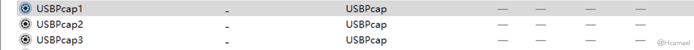
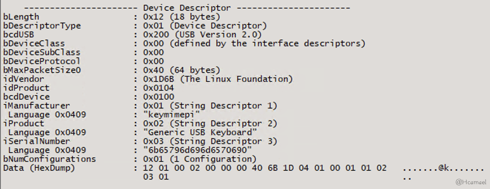

# USB 设备开发：从入门到实践指南（一）

[↓↓↓](javascript:)  
  
  
  
[↑↑↑](javascript:)

2024 年 02 月 27 日  
[安全工具&安全开发](https://paper.seebug.org/category/tools/) · [经验心得](https://paper.seebug.org/category/experience/) · [404 专栏](https://paper.seebug.org/category/404team/)

## 目录

-   [1 USB 设备开发相关工具](#1-usb)
    -   [1.1 USB Tree View](#11-usb-tree-view)
    -   [1.2 Wireshark](#12-wireshark)
    -   [1.3 Bus Hound](#13-bus-hound)
-   [2 使用树莓派 4b 作为 PC 的 USB 键盘](#2-4bpcusb)
    -   [2.1 通过流量再学习理解 USB 协议](#21-usb)
        -   [2.1.1 设备描述符](#211)
        -   [2.1.2 配置描述符](#212)
        -   [2.1.3 接口描述符](#213)
        -   [2.1.4 端点描述符](#214)
        -   [2.1.5 字符串描述符](#215)
        -   [2.1.6 HID 报告描述符](#216-hid)
            -   [2.1.6.1 解析 HID 配置描述符](#2161-hid)
-   [3 下一步研究方向](#3)
-   [4 参考链接](#4)

**作者：Hcamael@知道创宇 404 实验室**  
**时间：2024 年 2 月 27 日**

在使用 Google 搜索相关学习资料的过程中，搜到一本书——《圈圈教你玩 USB》，在阅读中发现需要购买相关硬件设备。

硬件开发部分考虑在后期的内容中再进行学习研究，前期考虑拿手头上已有设备来进行学习研究。首先考虑的是使用手机作为 USB 设备连接电脑，但是研究后发现，安卓对 USB 设备开发的支持不是很友好，再加上在安卓层对 USB 开发进行封装，会导致我们不太好理解 USB 底层的细节。

随后，考虑到手头具备树莓派 4b 设备，决定尝试利用该设备进行 USB 设备开发。在进行 Google 搜索后，发现了一个名为 key-mime-pi 的项目，可作为我入门的起点。

# 1 USB 设备开发相关工具

经过一番研究，因为 Windows 上 USB 相关的工具可视化做的更好，所以最后选择 Windows 设备作为 USB 主机。

## 1.1 USB Tree View

第一个工具是`USB Tree View`，该工具能很好的展示主机上 USB 设备树的主从情况，USB 描述符信息等数据。如图 1 所示：


图 1：USB Tree View 界面

可以从上图的 USB 设备树中看出，一台主机中最底层的是 USB 主机控制器，该控制器直连 CPU。接着上一层接入的是 USB 根集线器（HUB），可以类比为 USB 扩展坞，作用就是扩展出多个 USB 接口，但是总带宽还是由 USB 主机控制器决定的。

比如，在上图 USB 主机控制器版本是 USB3.1，那么上一层的 USB 根集线器可以扩展出 USB3.1 及以下的 USB 口，比如 USB2.0 口。不过不管扩展出多少 USB 口，其总带宽都已经固定在 10Gbps 上（因为 USB3.1 的带宽为 10Gbps）。并且，在集线器上，还可以再接多个集线器，比如上图中有一个通用 USB 集线器，其实就是示例主机上机箱扩展出的 USB 接口。

另外点击已经连接上的 USB 设备，还可以查看该 USB 设备更多详细信息，如图 2 所示：


图 2：在 USB Tree View 上查看 USB 设备详细信息

如果理解上图中各部分信息，后文再进行说明。不过该工具也存在一些 BUG，该工具无法正常解析 HID 信息，如图 3 所示：


图 3：HID 描述符

## 1.2 Wireshark

Windows 上的 wireshark 在装上 USBPcap 后，能够抓取主机控制器上的 USB 流量，比如主机上有三个主机控制器，所以在 Wireshark 中就显示有三个 USBPcap，如图 4 所示：



图 4：Wireshark 界面

如果不知道 USB 设置插入的 USB 口是属于哪一个主机控制器，可以使用 USBTree View 查看。不过由于 Wireshark 是抓取主机控制器上的流量，而一个 USB 主机控制器可以连接多个 USB 设备，所以当我要研究某一个 USB 设备时，需要通过 Wireshark 的过滤表达式对该主机控制器上的其他 USB 设备的流量进行过滤。

## 1.3 Bus Hound

`Bus Hound`可以抓取指定 USB 设备的流量，不过该工具的缺点是需要花钱，否则抓包 size 和数量都有限制，目前尚未找到该软件的破解版本。

图 5 是该软件的界面：


图 5：Bus Hound 界面

# 2 使用树莓派 4b 作为 PC 的 USB 键盘

接下来，通过阅读`key-mime-pi`项目的源代码，发现使用树莓派 4b 设备模拟一个 USB 设备是一件非常容易的事情。根据该项目的代码，可以分解出以下两个步骤：

1.需要开启 dwc2 驱动：在树莓派的 config.txt 中添加`dtoverlay=dwc2`，设备启动后，确认一下启动是否开启：

```bash
$ lsmod|grep dwc2
dwc2                  196608  0
```

2.运行如下所示的`bash`脚本：

```shell
#!/usr/bin/env bash

# Adapted from https://github.com/girst/hardpass-sendHID/blob/master/README.md

# Exit on first error.
set -e

# Treat undefined environment variables as errors.
set -u

modprobe libcomposite

cd /sys/kernel/config/usb_gadget/
mkdir -p g1
cd g1

echo 0x1d6b > idVendor  # Linux Foundation
echo 0x0104 > idProduct # Multifunction Composite Gadget
echo 0x0100 > bcdDevice # v1.0.0
echo 0x0200 > bcdUSB    # USB2

STRINGS_DIR="strings/0x409"
mkdir -p "$STRINGS_DIR"
echo "6b65796d696d6570690" > "${STRINGS_DIR}/serialnumber"
echo "keymimepi" > "${STRINGS_DIR}/manufacturer"
echo "Generic USB Keyboard" > "${STRINGS_DIR}/product"

FUNCTIONS_DIR="functions/hid.usb0"
mkdir -p "$FUNCTIONS_DIR"
echo 1 > "${FUNCTIONS_DIR}/protocol" # Keyboard
echo 0 > "${FUNCTIONS_DIR}/subclass" # No subclass
echo 8 > "${FUNCTIONS_DIR}/report_length"
# Write the report descriptor
# Source: https://www.kernel.org/doc/html/latest/usb/gadget_hid.html
echo -ne \\x05\\x01\\x09\\x06\\xa1\\x01\\x05\\x07\\x19\\xe0\\x29\\xe7\\x15\\x00\\x25\\x01\\x75\\x01\\x95\\x08\\x81\\x02\\x95\\x01\\x75\\x08\\x81\\x03\\x95\\x05\\x75\\x01\\x05\\x08\\x19\\x01\\x29\\x05\\x91\\x02\\x95\\x01\\x75\\x03\\x91\\x03\\x95\\x06\\x75\\x08\\x15\\x00\\x25\\x65\\x05\\x07\\x19\\x00\\x29\\x65\\x81\\x00\\xc0 > "${FUNCTIONS_DIR}/report_desc"

CONFIG_INDEX=1
CONFIGS_DIR="configs/c.${CONFIG_INDEX}"
mkdir -p "$CONFIGS_DIR"
echo 250 > "${CONFIGS_DIR}/MaxPower"

CONFIGS_STRINGS_DIR="${CONFIGS_DIR}/strings/0x409"
mkdir -p "$CONFIGS_STRINGS_DIR"
echo "Config ${CONFIG_INDEX}: ECM network" > "${CONFIGS_STRINGS_DIR}/configuration"

ln -s "$FUNCTIONS_DIR" "${CONFIGS_DIR}/"
ls /sys/class/udc > UDC

chmod 777 /dev/hidg0
```

通过研究上面的`bash`脚本，发现该项目利用的是 Linux 系统的 USB gadget 驱动，有需要的可以自行查看该部分的源码，位于 Linux 内核的：`linux/drivers/usb/dwc2`和`linux/drivers/usb/gadget`目录下。

该驱动细节在本文暂不进行研究。在运行上面的`bash`脚本后，如无意外，可以在`USB Tree View`中查看到树莓派设备模拟出的 USB 键盘。

## 2.1 通过流量再学习理解 USB 协议

这里提一个前置的知识点：USB 是主从结构，一定会有一个为 USB 主机，一个为 USB 设备，并且通信永远都是由主机先发起的。

在本篇文章的环境下，首先打开 Wireshark，开始捕获 USBPcap1 的流量，然后把树莓派的 type-c 口（电源供电口，树莓派 4b 设备的 4 个 USB 母口只能作为 USB 主机，只有 type-c 供电口可以作为 USB 设备）连接到主机的 USB 口上，这个时候主机并不会识别树莓派为 USB 设备，仅供电，所以这个时候树莓派开始启动。

然后开始把 wireshark 能捕获的流量地址都给过滤掉，这些都不属于树莓派的 USB 流量，如图 6 所示，是本文环境中的过滤语法：


图 6：Wireshark 过滤语法

然后在树莓派上以 root 权限运行上面提供的`bash`脚本，再查看 Wireshark 上捕获到的流量，如图 7 所示：


图 7：Wireshark 根据过滤语法捕获到的流量

使用 USBPcap 捕获到的 usb 流量地址一般为：x.y.z，x 为 USB 总线（Bus）号，一般为主机控制器的编号，示例中捕获到的 USBPcap1 流量，x 的值都为 1。

y 为设备号，指向该 Bus 上的某个设备，但是`USBPcap`和`USBTreeView`对设备编号的方法是不同的。`USBPcap`是按照顺序来定义设备号，而`USBTreeView`则在开始时已经为所有 USB 接口进行了编号，无论是否连接了 USB 设备。

按照我的理解，`USBPcap`可能更符合底层实际情况，因为它不是自己编的号，而是解析了抓到的 USB 流量。

z 的值表示的是端点号（Endpoint），我觉得有点像一个程序的文件描述符 (fd)，USB 主机和设备间就是通过端点号来进行通信的，当 USB 设备还未在主机上注册时，默认使用`0`端点号来进行通信。

### 2.1.1 设备描述符

接下来对 USB 协议进行研究，经过研究发现，USB 设备通过向主机发送各种描述符来告知 USB 主机自身的信息，这些描述符在 Linux 源码中通过结构体来定义，每个结构体字段的含义可以参考相关文章[](#jump2)。下面对 USB 的几个重要的描述符进行分析。

第一个是设备描述符，该描述符的结构体定义位于：`linux/include/uapi/linux/usb/ch9.h`，结构体如下：

```c
/* USB_DT_DEVICE: Device descriptor */
struct usb_device_descriptor {
    __u8  bLength;
    __u8  bDescriptorType;

    __le16 bcdUSB;
    __u8  bDeviceClass;
    __u8  bDeviceSubClass;
    __u8  bDeviceProtocol;
    __u8  bMaxPacketSize0;
    __le16 idVendor;
    __le16 idProduct;
    __le16 bcdDevice;
    __u8  iManufacturer;
    __u8  iProduct;
    __u8  iSerialNumber;
    __u8  bNumConfigurations;
} __attribute__ ((packed));
```

首先查看 USBPcap 上捕获到的设备描述符，如图 8 所示：


图 8：Wireshark 上查看设备描述符

再对比一下`USBTree View`上显示的设备描述符信息，如图 9 所示：



图 9：USB Tree View 上查看设备描述符

通过对比发现，控制设备描述符的位于`bash`脚本的以下几行代码：

```shell
echo 0x1d6b > idVendor  # Linux Foundation
echo 0x0104 > idProduct # Multifunction Composite Gadget
echo 0x0100 > bcdDevice # v1.0.0
echo 0x0200 > bcdUSB    # USB2

STRINGS_DIR="strings/0x409"
mkdir -p "$STRINGS_DIR"
echo "6b65796d696d6570690" > "${STRINGS_DIR}/serialnumber"
echo "keymimepi" > "${STRINGS_DIR}/manufacturer"
echo "Generic USB Keyboard" > "${STRINGS_DIR}/product"
```

首先定义了设备的协议为 USB2.0，然后设置了供应商 ID(0x1d6b) 和产品的 ID(0x0104)，接着定义了`bNumConfigurations`配置描述符数量为`0x01`，剩下的都是一些字符串标识信息。

供应商信息大部分情况下作为标识信息作用，但是后续的文章中会发现有些驱动靠识别指定的供应商和产品 ID 来触发。目前只是模拟鼠标/键盘设备，它们不依靠这些 ID 触发，所以可以随意修改。

接下来主机将会向设备请求设备描述符中指定数量的配置描述符。

### 2.1.2 配置描述符

配置描述符的结构体定义为于：`linux/include/uapi/linux/usb/ch9.h`，结构体如下：

```c
struct usb_config_descriptor {
    __u8  bLength;
    __u8  bDescriptorType;

    __le16 wTotalLength;
    __u8  bNumInterfaces;
    __u8  bConfigurationValue;
    __u8  iConfiguration;
    __u8  bmAttributes;
    __u8  bMaxPower;
} __attribute__ ((packed));
```

首先查看 USBPcap 上捕获到的配置描述符，如图 10 所示：


图 10：主机发起的获取配置描述符请求

主机首先会请求固定长度为 9 的配置描述符，如图 11 所示：


图 11：Wireshark 上查看配置描述符

然后主机通过配置描述符的`wTotalLength`字段，得知配置描述符的实际长度，接着主机会向 USB 设备请求完整的配置描述符，如图 12，图 13 所示：


图 12：主机发起的获取配置描述符请求


图 13：USB 设备响应完整的配置描述符数据包

从 USBPcap 捕获到的流量中可以发现，在配置描述符的响应包里，除了配置描述符的信息，还包含了接口描述符，端点描述符，并且因为 USB 键盘注册的是一个 USB HID 设备，所以在配置描述符中还包含着 HID 描述符，如图 14 所示：


图 14：Wireshark 中查看配置描述符

使用 USB Tree View 查看配置描述符，如图 15 所示：


图 15：USB Tree View 中查看配置描述符

接下来讲解一下在配置描述符中的几个字段：

1.  `bmAttributes`：该字段是控制电源的相关属性，是告诉主机设备是自供电还是需要 USB 主机供电，设备是否可以通过 USB 远程唤醒。
2.  `MaxPower`，该字段的目的是告诉主机，USB 设备能接受的最高电流。
3.  `bNumInterfaces`：该字段再次让主机知道，USB 设备有几个配置描述符。
4.  `bConfigurationValue`，该值为配置描述符的序号，用在`Set Configuration Request`里，用于通知 USB 设置，哪一个 USB 配置描述符在主机的内核中注册成功了。

分析完配置描述符后，可以得知控制配置描述符在`bash`脚本中的代码如下所示：

```shell
CONFIG_INDEX=1
CONFIGS_DIR="configs/c.${CONFIG_INDEX}"
mkdir -p "$CONFIGS_DIR"
echo 250 > "${CONFIGS_DIR}/MaxPower"
CONFIGS_STRINGS_DIR="${CONFIGS_DIR}/strings/0x409"
mkdir -p "$CONFIGS_STRINGS_DIR"
echo "Config ${CONFIG_INDEX}: ECM network" > "${CONFIGS_STRINGS_DIR}/configuration"
```

### 2.1.3 接口描述符

接口描述符的结构体定义为于：`linux/include/uapi/linux/usb/ch9.h`，结构体如下：

```c
/* USB_DT_INTERFACE: Interface descriptor */
struct usb_interface_descriptor {
    __u8  bLength;
    __u8  bDescriptorType;

    __u8  bInterfaceNumber;
    __u8  bAlternateSetting;
    __u8  bNumEndpoints;
    __u8  bInterfaceClass;
    __u8  bInterfaceSubClass;
    __u8  bInterfaceProtocol;
    __u8  iInterface;
} __attribute__ ((packed));
```

首先查看 USBPcap 上捕获到的接口描述符，如图 16 所示：


图 16：Wireshark 中查看接口描述符

再查看`USBTree View`上的接口描述符信息，如图 17 所示：


图 17：USB Tree View 中查看接口描述符

在接口描述符中，字段的含义如下所示：

1.  `bNumEndpoints`定义了设备端点的数量，在 USB 协议中，端点的通信是单向的，在这里定义了两个端点描述符，一个表示的是输入，一个表示的是输出。
2.  `bInterfaceClass`定义了接口的类型，在上图中定义的是一个 HID 设备，所以主机会再去读取 HID 描述符。
3.  `bInterfaceProtocol`定义了接口协议为键盘，这样就会让键盘的 HID 驱动来处理后续通信。

`bInterfaceClass`值对应的含义可以参考 Linux 内核源码 (同样是在 ch9.h 中定义)：

```c
/*
 * Device and/or Interface Class codes
 * as found in bDeviceClass or bInterfaceClass
 * and defined by www.usb.org documents
 */
#define USB_CLASS_PER_INTERFACE     0   /* for DeviceClass */
#define USB_CLASS_AUDIO         1
#define USB_CLASS_COMM          2
#define USB_CLASS_HID           3
#define USB_CLASS_PHYSICAL      5
#define USB_CLASS_STILL_IMAGE       6
#define USB_CLASS_PRINTER       7
#define USB_CLASS_MASS_STORAGE      8
#define USB_CLASS_HUB           9
#define USB_CLASS_CDC_DATA      0x0a
#define USB_CLASS_CSCID         0x0b    /* chip+ smart card */
#define USB_CLASS_CONTENT_SEC       0x0d    /* content security */
#define USB_CLASS_VIDEO         0x0e
#define USB_CLASS_WIRELESS_CONTROLLER   0xe0
#define USB_CLASS_PERSONAL_HEALTHCARE   0x0f
#define USB_CLASS_AUDIO_VIDEO       0x10
#define USB_CLASS_BILLBOARD     0x11
#define USB_CLASS_USB_TYPE_C_BRIDGE 0x12
#define USB_CLASS_MISC          0xef
#define USB_CLASS_APP_SPEC      0xfe
#define USB_CLASS_VENDOR_SPEC       0xff

#define USB_SUBCLASS_VENDOR_SPEC    0xff
```

`bInterfaceProtocol`在 Linux 源码中只定义了鼠标和键盘，如下图所示，其他设备的值设为 0，或者由厂商开发的驱动定义，如图 18 所示：


图 18：Linux 源码中关于 bInterfaceProtocol 值的宏定义

### 2.1.4 端点描述符

端点描述符的结构体定义为于：`linux/include/uapi/linux/usb/ch9.h`，结构体如下：

```c
/* USB_DT_ENDPOINT: Endpoint descriptor */
struct usb_endpoint_descriptor {
    __u8  bLength;
    __u8  bDescriptorType;

    __u8  bEndpointAddress;
    __u8  bmAttributes;
    __le16 wMaxPacketSize;
    __u8  bInterval;

    /* NOTE:  these two are _only_ in audio endpoints. */
    /* use USB_DT_ENDPOINT*_SIZE in bLength, not sizeof. */
    __u8  bRefresh;
    __u8  bSynchAddress;
} __attribute__ ((packed));
```

在`USBPcap`上查看捕获到的端点描述符的信息，如图 19 所示：


图 19：Wireshark 中查看端点描述符

在端点描述符中定义了端口号，和该端口的方向，还有使用该端口进行通信的方式（上图中定义的通信方式为中断传输），通信数据包的最大尺寸（8）字节。

接着我列出了 Linux Gadget 目录的文件结构，如下所示：

```bash
$ tree
.
├── bcdDevice
├── bcdUSB
├── bDeviceClass
├── bDeviceProtocol
├── bDeviceSubClass
├── bMaxPacketSize0
├── configs
│?? └── c.1
│??     ├── bmAttributes
│??     ├── hid.usb0 -> ../../../../usb_gadget/g1/functions/hid.usb0
│??     ├── MaxPower
│??     └── strings
│??         └── 0x409
│??             └── configuration
├── functions
│?? └── hid.usb0
│??     ├── dev
│??     ├── no_out_endpoint
│??     ├── protocol
│??     ├── report_desc
│??     ├── report_length
│??     └── subclass
├── idProduct
├── idVendor
├── max_speed
├── os_desc
│?? ├── b_vendor_code
│?? ├── qw_sign
│?? └── use
├── strings
│?? └── 0x409
│??     ├── manufacturer
│??     ├── product
│??     └── serialnumber
└── UDC
```

经过研究发现，可以通过`no_out_endpoint`文件，控制端点数，默认情况下有 IN/OUT 两个端点，如果`no_out_endpoint`文件的值为 1，端点描述符就只有一个 IN 端点。另一个`report_length`文件，用来控制传输数据包的最大长度，也就是`bMaxPacketSize`字段。

### 2.1.5 字符串描述符

最后一个是字符串描述符，结构体的定义也是位于`ch9.h`：

```c
struct usb_string_descriptor {
    __u8  bLength;
    __u8  bDescriptorType;

    __le16 wData[1];        /* UTF-16LE encoded */
} __attribute__ ((packed));
```

字符串描述符的作用主要是标识信息，比如在`USB Tree View`上显示的 USB 设备信息，都是通过字符串描述符获取的。

可以在`USBTree View`中查看所有字符串描述符，如图 20 所示：


图 20：USB Tree View 中查看字符串描述符

在接口描述符中，`iInterface`字段的值就是字符串描述符的偏移。

### 2.1.6 HID 报告描述符

当 USB 主机通过接口描述符得知 USB 设备是 USB HID 设备时，将会再获取 HID 报告描述符，在 USBPcap 中捕获到的 HID 报告描述符如图 21 所示：


图 21：Wireshark 查看 HID 报告描述符

定义 HID 报告描述符的代码在`bash`脚本中如下所示：

```shell
# Write the report descriptor
# Source: https://www.kernel.org/doc/html/latest/usb/gadget_hid.html
echo -ne \\x05\\x01\\x09\\x06\\xa1\\x01\\x05\\x07\\x19\\xe0\\x29\\xe7\\x15\\x00\\x25\\x01\\x75\\x01\\x95\\x08\\x81\\x02\\x95\\x01\\x75\\x08\\x81\\x03\\x95\\x05\\x75\\x01\\x05\\x08\\x19\\x01\\x29\\x05\\x91\\x02\\x95\\x01\\x75\\x03\\x91\\x03\\x95\\x06\\x75\\x08\\x15\\x00\\x25\\x65\\x05\\x07\\x19\\x00\\x29\\x65\\x81\\x00\\xc0 > "${FUNCTIONS_DIR}/report_desc"
```

示例中的 HID 报告描述符来源于 Linux 内核示例[](#jump3)，如图 22 所示：


图 22：Linux USB HID gadget 驱动文档

所以下一步我们需要能顺利阅读 HID 报告描述符，可以参考官方文档[](#jump4)，官方文档的优点是内容齐全，缺点内容是多，对于新手来说，不太适合入门，官方文档更适合入门后作为参考手册。

#### 2.1.6.1 解析 HID 配置描述符

我们先查看`key-mime-pi`项目的通信代码，树莓派如何告诉主机，哪些按键被控制了，相关代码如下所示：

```python
def send(hid_path, control_keys, hid_keycode):
    with open(hid_path, 'wb+') as hid_handle:   # hid_path = "/dev/hidg0"
        buf = [0] * 8
        buf[0] = control_keys
        buf[2] = hid_keycode
        hid_handle.write(bytearray(buf))
        hid_handle.write(bytearray([0] * 8))
```

每次操作按键需要向 USB 主机发送两个 8 字节的 buf（在端点描述符里限制了最大的包大小为 8 字节）。第二个 buf 的 8 字节全都置为 0，第一个 buf 的第一个字节为控制字符，经过研究得知，设置了 8 个控制字符，如下所示：

```c
#define KEY_LEFTCTRL 0xe0 // Keyboard Left Control
#define KEY_LEFTSHIFT 0xe1 // Keyboard Left Shift
#define KEY_LEFTALT 0xe2 // Keyboard Left Alt
#define KEY_LEFTMETA 0xe3 // Keyboard Left GUI
#define KEY_RIGHTCTRL 0xe4 // Keyboard Right Control
#define KEY_RIGHTSHIFT 0xe5 // Keyboard Right Shift
#define KEY_RIGHTALT 0xe6 // Keyboard Right Alt
#define KEY_RIGHTMETA 0xe7 // Keyboard Right GUI
```

`GUI`是 windows 的 win 键，mac 的 command。

第一个 buf 的第二个字节不设置，默认为 0，第三字节到第 8 字节，长度为 6 字节，为输入的按键。

在大致了解了如何向 USB 主机发送数据后，再来看看 HID 的报告描述符：

```c
static struct hidg_func_descriptor my_hid_data = {
      .subclass               = 0, /* No subclass */
      .protocol               = 1, /* Keyboard */
      .report_length          = 8,
      .report_desc_length     = 63,
      .report_desc            = {
              0x05, 0x01,     /* USAGE_PAGE (Generic Desktop)           */
              0x09, 0x06,     /* USAGE (Keyboard)                       */
              0xa1, 0x01,     /* COLLECTION (Application)               */
              0x05, 0x07,     /*   USAGE_PAGE (Keyboard)                */
              0x19, 0xe0,     /*   USAGE_MINIMUM (Keyboard LeftControl) */
              0x29, 0xe7,     /*   USAGE_MAXIMUM (Keyboard Right GUI)   */
              0x15, 0x00,     /*   LOGICAL_MINIMUM (0)                  */
              0x25, 0x01,     /*   LOGICAL_MAXIMUM (1)                  */
              0x75, 0x01,     /*   REPORT_SIZE (1)                      */
              0x95, 0x08,     /*   REPORT_COUNT (8)                     */
              0x81, 0x02,     /*   INPUT (Data,Var,Abs)                 */
              0x95, 0x01,     /*   REPORT_COUNT (1)                     */
              0x75, 0x08,     /*   REPORT_SIZE (8)                      */
              0x81, 0x03,     /*   INPUT (Cnst,Var,Abs)                 */
              0x95, 0x05,     /*   REPORT_COUNT (5)                     */
              0x75, 0x01,     /*   REPORT_SIZE (1)                      */
              0x05, 0x08,     /*   USAGE_PAGE (LEDs)                    */
              0x19, 0x01,     /*   USAGE_MINIMUM (Num Lock)             */
              0x29, 0x05,     /*   USAGE_MAXIMUM (Kana)                 */
              0x91, 0x02,     /*   OUTPUT (Data,Var,Abs)                */
              0x95, 0x01,     /*   REPORT_COUNT (1)                     */
              0x75, 0x03,     /*   REPORT_SIZE (3)                      */
              0x91, 0x03,     /*   OUTPUT (Cnst,Var,Abs)                */
              0x95, 0x06,     /*   REPORT_COUNT (6)                     */
              0x75, 0x08,     /*   REPORT_SIZE (8)                      */
              0x15, 0x00,     /*   LOGICAL_MINIMUM (0)                  */
              0x25, 0x65,     /*   LOGICAL_MAXIMUM (101)                */
              0x05, 0x07,     /*   USAGE_PAGE (Keyboard)                */
              0x19, 0x00,     /*   USAGE_MINIMUM (Reserved)             */
              0x29, 0x65,     /*   USAGE_MAXIMUM (Keyboard Application) */
              0x81, 0x00,     /*   INPUT (Data,Ary,Abs)                 */
              0xc0            /* END_COLLECTION                         */
      }
};
```

首先是`USAGE_PAGE`和`USAGE`，这两个字段可以看参考文档，都是目前我们只能选取定义好的那些应用，会影响到一些驱动的功能识别。

主要看集合部分的内容，集合以`COLLECTION`开始`END_COLLECTION`结束。

集合的内容可以分为四部分，第一部分如下所示：

```plain
0x05, 0x07,     /*   USAGE_PAGE (Keyboard)                */
0x19, 0xe0,     /*   USAGE_MINIMUM (Keyboard LeftControl) */
0x29, 0xe7,     /*   USAGE_MAXIMUM (Keyboard Right GUI)   */
0x15, 0x00,     /*   LOGICAL_MINIMUM (0)                  */
0x25, 0x01,     /*   LOGICAL_MAXIMUM (1)                  */
0x75, 0x01,     /*   REPORT_SIZE (1)                      */
0x95, 0x08,     /*   REPORT_COUNT (8)                     */
0x81, 0x02,     /*   INPUT (Data,Var,Abs)                 */
```

第一部分指定键盘的功能按键，最小值为`Keyboard LeftControl`(0xe0)，最大值为`Keyboard Right GUI`(0xe7)。逻辑最小值为 0，最大值为 1，1 表示按下，0 表示释放。一个按键占 1bit，有 8 个按键，一共占 1 字节。比如：0b00000001 表示`LeftControl`键被按下了。从这看，我们可以一次性把 8 个控制键都按下。

第二部分如下所示：

```plain
0x95, 0x01,     /*   REPORT_COUNT (1)                     */
0x75, 0x08,     /*   REPORT_SIZE (8)                      */
0x81, 0x03,     /*   INPUT (Cnst,Var,Abs)                 */
```

有 8 个 1bit 的值，总共 1 字节，并且是常量（Cnst 全程是 constant），上下文没看到有设置值，所以认为是默认值 0，发送数据的时候就算不发送 0 也不影响，因为驱动不会主动识别该字节的数据。

第三部分如下所示：

```plain
0x95, 0x05,     /*   REPORT_COUNT (5)                     */
0x75, 0x01,     /*   REPORT_SIZE (1)                      */
0x05, 0x08,     /*   USAGE_PAGE (LEDs)                    */
0x19, 0x01,     /*   USAGE_MINIMUM (Num Lock)             */
0x29, 0x05,     /*   USAGE_MAXIMUM (Kana)                 */
0x91, 0x02,     /*   OUTPUT (Data,Var,Abs)                */
0x95, 0x01,     /*   REPORT_COUNT (1)                     */
0x75, 0x03,     /*   REPORT_SIZE (3)                      */
0x91, 0x03,     /*   OUTPUT (Cnst,Var,Abs)                */
```

上述的 HID 描述符定义了一个 LED 功能，总共占 1 字节，高 3bit 为常量 0，低 5bit 表示的键盘上的指示灯，常见的有：小键盘数字锁定灯，大写锁定灯，滚动锁定灯等。并且是由主机发送给设备的，键盘灯光的亮灭由 USB 主机来控制。

第四部分如下所示：

```plain
0x95, 0x06,     /*   REPORT_COUNT (6)                     */
0x75, 0x08,     /*   REPORT_SIZE (8)                      */
0x15, 0x00,     /*   LOGICAL_MINIMUM (0)                  */
0x25, 0x65,     /*   LOGICAL_MAXIMUM (101)                */
0x05, 0x07,     /*   USAGE_PAGE (Keyboard)                */
0x19, 0x00,     /*   USAGE_MINIMUM (Reserved)             */
0x29, 0x65,     /*   USAGE_MAXIMUM (Keyboard Application) */
0x81, 0x00,     /*   INPUT (Data,Ary,Abs)                 */
```

定义了键盘功能，按键的值从 0-0x65，一共有 102 个键，逻辑值也是从 0-0x65，一个按键占 1 字节，最多可以有 6 个按键，总共占 6 字节。

到这里键盘的 HID 报告描述符的定义就分析完了，我们发现该描述符定义的内容和我们的输入数据的格式是吻合的。

发送的 buf 第一字节就是表示 8 个控制按键，第二字节固定为 0，后面 6 个字节为输入按键。

这个时候产生了两个问题：

1.测试模拟的键盘是 104 键的键盘，为什么有 102+8=110 个值？经过研究发现如下所示：

```plain
#define KEY_NONE 0x00 // No key pressed
#define KEY_ERR_OVF 0x01 //  Keyboard Error Roll Over - used for all slots if too many keys are pressed ("Phantom key")
// 0x02 //  Keyboard POST Fail
// 0x03 //  Keyboard Error Undefined

#define KEY_102ND 0x64 // Keyboard Non-US \ and |
#define KEY_BACKSLASH 0x31 // Keyboard \ and |
// 上面这两个冲突了，多了一个
#define KEY_HASHTILDE 0x32 // Keyboard Non-US # and ~
// 估计我键盘没有 Non-US 相关的键
```

根据上面的计算的得知，刚好是 104 键的键盘。

2.为什么需要发送一个全为 0 的数据包，经过研究发现：USB 设备发给 USB 主机的数据包是键盘在告知 USB 主机键盘当前的状态，一个完整的按键操作是按下按键，然后释放按键。发送的一个数据包是告知主机哪些按键被按下了，第二个全为 0 的数据包是告知主机所有按键已经被释放。

# 3 下一步研究方向

本篇文章的研究到此告一段落，接下来的文章内容考虑对以下几个方向进行研究：

1.  微调 HID 报告描述符，看看对实际使用有什么影响。
2.  通过修改接口描述符字段和 HID 报告描述符字段，来模拟一个鼠标。
3.  研究一下手柄，讲道理手柄也是使用 HID 协议，但是 Linux 的代码里没看到相关定义。
4.  研究非 HID 协议，比如 U 盘，网卡，打印机这些。
5.  研究驱动系统细节，在 Linux 内核的 drivers 目录下，可以搜索`module_usb_driver`字符串，这是一个宏定义函数，usb 主机端的驱动都是通过该函数注册到内核当中的。

# 4 参考链接

1.  [https://github.com/mtlynch/key-mime-pi](https://github.com/mtlynch/key-mime-pi "https://github.com/mtlynch/key-mime-pi")
2.  [https://zhuanlan.zhihu.com/p/558716468](https://zhuanlan.zhihu.com/p/558716468 "https://zhuanlan.zhihu.com/p/558716468")
3.  [https://www.kernel.org/doc/html/latest/usb/gadget\_hid.html](https://www.kernel.org/doc/html/latest/usb/gadget_hid.html " https://www.kernel.org/doc/html/latest/usb/gadget_hid.html")
4.  [https://usb.org/sites/default/files/hut1\_4.pdf](https://usb.org/sites/default/files/hut1_4.pdf "https://usb.org/sites/default/files/hut1_4.pdf")

- - -
