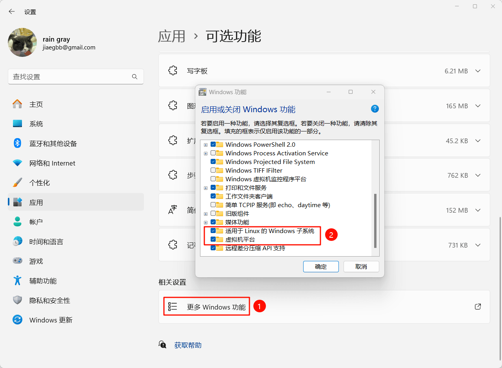
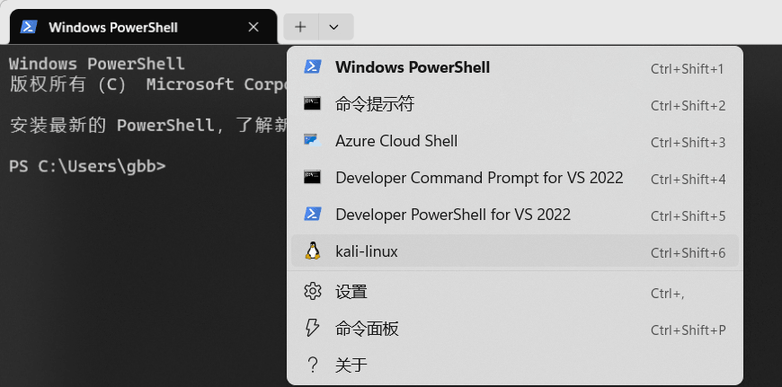

# [WSL 基本使用](https://www.raingray.com/archives/4899.html)

-   [1 WSL 安装](#1+WSL+%E5%AE%89%E8%A3%85)
-   [2 WSL 系统安装](#2+WSL+%E7%B3%BB%E7%BB%9F%E5%AE%89%E8%A3%85)
-   [3 WSL 实例管理](#3+WSL+%E5%AE%9E%E4%BE%8B%E7%AE%A1%E7%90%86)
    -   [3.1 查询运行状态](#3.1+%E6%9F%A5%E8%AF%A2%E8%BF%90%E8%A1%8C%E7%8A%B6%E6%80%81)
    -   [3.2 停止](#3.2+%E5%81%9C%E6%AD%A2)
    -   [3.3 启动](#3.3+%E5%90%AF%E5%8A%A8)
    -   [3.4 迁移 WSL 系统位置](#3.4+%E8%BF%81%E7%A7%BB+WSL+%E7%B3%BB%E7%BB%9F%E4%BD%8D%E7%BD%AE)
-   [4 WSL 网络配置](#4+WSL+%E7%BD%91%E7%BB%9C%E9%85%8D%E7%BD%AE)
-   [参考连接](#%E5%8F%82%E8%80%83%E8%BF%9E%E6%8E%A5)

## 1 WSL 安装

在安装前先说明，因为 WSL 使用 Hyper-V，夜神模拟器会无法启用，网上大多都说网易的 mumu 可以兼容，不过我没测试过，不清楚信息真假。

目前 WSL 有两个版本 1 和 2，推荐使用 2。

更新 wsl。

```plaintext
PS C:\Users\gbb> wsl --update --web-download
正在下载: 适用于 Linux 的 Windows 子系统
正在安装: 适用于 Linux 的 Windows 子系统
已安装 适用于 Linux 的 Windows 子系统。
```

## 2 WSL 系统安装

查看有哪些系统可以安装。

```plaintext
PS C:\Users\gbb> wsl --list --online
以下是可安装的有效分发的列表。
请使用“wsl --install -d <分发>”安装。

NAME                                   FRIENDLY NAME
Ubuntu                                 Ubuntu
Debian                                 Debian GNU/Linux
kali-linux                             Kali Linux Rolling
Ubuntu-18.04                           Ubuntu 18.04 LTS
Ubuntu-20.04                           Ubuntu 20.04 LTS
Ubuntu-22.04                           Ubuntu 22.04 LTS
OracleLinux_8_5                        Oracle Linux 8.5
OracleLinux_7_9                        Oracle Linux 7.9
SUSE-Linux-Enterprise-Server-15-SP4    SUSE Linux Enterprise Server 15 SP4
openSUSE-Leap-15.4                     openSUSE Leap 15.4
openSUSE-Tumbleweed                    openSUSE Tumbleweed
```

从商店里安装指定系统。

```plaintext
PS C:\Users\gbb> wsl --install --distribution kali-linux
```

安装失败提示 Wsl/InstallDistro/WSL\_E\_INSTALL\_PROCESS\_FAILED

```plaintext
PS C:\Users\gbb> wsl --install --distribution kali-linux
正在安装: Kali Linux Rolling
已安装 Kali Linux Rolling。
正在启动 Kali Linux Rolling...
Installing, this may take a few minutes...
WslRegisterDistribution failed with error: 0x80370114
Error: 0x80370114 ??????????????????

Press any key to continue...
分发'kali-linux'安装过程失败，退出代码： 1。
Error code: Wsl/InstallDistro/WSL_E_INSTALL_PROCESS_FAILED
```

说要启动 WSL 和虚拟服务平台。最简单的是命令行启动。

```plaintext
PS C:\Users\gbb> dism.exe /online /enable-feature /featurename:Microsoft-Windows-Subsystem-Linux /all /norestart

部署映像服务和管理工具
版本: 10.0.22621.1

映像版本: 10.0.22621.1413

启用一个或多个功能
[==========================100.0%==========================]
操作成功完成。
PS C:\Users\gbb> dism.exe /online /enable-feature /featurename:VirtualMachinePlatform /all /norestart

部署映像服务和管理工具
版本: 10.0.22621.1

映像版本: 10.0.22621.1413

启用一个或多个功能
[==========================100.0%==========================]
操作成功完成。
```

手动操作去设置中添加可选功能。



按照官方启用，重启机器。

```plaintext
PS C:\Users\gbb> Enable-WindowsOptionalFeature -Online -FeatureName Microsoft-Windows-Subsystem-Linux
是否立即重启计算机以完成此操作?
[Y] Yes  [N] No  [?] 帮助 (默认值为“Y”):
```

查询已经安装的发行版，发现 kali-linux 成功安装并且已经启动。

```plaintext
PS C:\Users\gbb> wsl -l -v
  NAME          STATE           VERSION
* kali-linux    Running         2
```

可以通过 Windows Terminal 输入 kali 进入系统

```plaintext
kali
```

或者选项卡里也可以进入。



默认安装是最小化，没有工具，可以安装 [kali-linux-default](https://www.kali.org/docs/general-use/metapackages) 工具包来获得基本的工具。

```plaintext
apt install -y kali-linux-default
```

如果使用图形化桌面可以安装 [Win-KeX](https://www.kali.org/docs/wsl/win-kex/)。个人经过尝试后，图形化界面发现没有 Vmware 好用，本质上就是 VNC 连接，不推荐使用。

有了 WSL 后可以在 Windows 使用 Linux 命令。

[跨文件系统工作 |微软学习 (microsoft.com)](https://learn.microsoft.com/en-us/windows/wsl/filesystems#mixing-linux-and-windows-commands)

```plaintext
PS C:\Users\gbb> ipconfig | wsl grep IPv4 | wsl cut -d: -f2
 169.254.201.136
 169.254.3.182
 169.254.137.28
 192.168.0.100
 172.18.80.1
```

## 3 WSL 实例管理

### 3.1 查询运行状态

```plaintext
PS C:\Users\gbb> wsl --list --verbose
  NAME          STATE           VERSION
* kali-linux    Stopped         2
PS C:\Users\gbb> kali
┌──(root㉿raingray)-[~]
└─# exit
logout
PS C:\Users\gbb> wsl --list --verbose
  NAME          STATE           VERSION
* kali-linux    Running         2
PS C:\Users\gbb>
```

### 3.2 停止

```plaintext
wsl -t <Distro Name>
```

操作演示。

```plaintext
PS C:\Users\gbb> wsl --list --verbose
  NAME          STATE           VERSION
* kali-linux    Running         2
PS C:\Users\gbb> wsl -t kali-linux
操作成功完成。
PS C:\Users\gbb> wsl --list --verbose
  NAME          STATE           VERSION
* kali-linux    Stopped         2
PS C:\Users\gbb>
```

### 3.3 启动

可以使用选项在多个发行版中启动虚拟机。

```plaintext
wsl -d <Distro Name>
```

或者直接输入 Distro Name 就能启动对应实例。

### 3.4 迁移 WSL 系统位置

默认安装的系统都在 C 盘，大多数人 C 盘被设置为系统盘，所以我们迁移到其他数据盘符存储，避免占用 C 盘过多空间。

使用 PowerShell 查询默认安装位置。

```plaintext
PS C:\Users\gbb> (Get-ChildItem -Path HKCU:\Software\Microsoft\Windows\CurrentVersion\Lxss | Where-Object { $_.GetValue("DistributionName") -eq 'kali-linux' }).GetValue("BasePath") + "\ext4.vhdx"
C:\Users\gbb\AppData\Local\Packages\KaliLinux.54290C8133FEE_ey8k8hqnwqnmg\LocalState\ext4.vhdx
PS C:\Users\gbb>
```

导出。记得导出前做好虚拟机内的服务关闭、数据备份操作，因为直接导出会停止运行系统。

```plaintext
PS C:\Users\gbb> wsl -l -v
  NAME          STATE           VERSION
* kali-linux    Running         2
PS C:\Users\gbb> wsl --export kali-linux E:\desktop\kali-linux
正在导出，这可能需要几分钟时间。
操作成功完成。
```

卸载系统。原有 ext4.vhdx 自动删除。

```plaintext
PS C:\Users\gbb> wsl --unregister kali-linux
正在注销。
操作成功完成。
```

将刚刚的虚拟机导入。

```plaintext
wsl --import <Distribution Name> <InstallLocation> <FileName>
```

这里我选择导入到 E:\\Documents\\Virtual Machines\\wsl2-Kali，名称为 kali-linux，导入的文件路径是 E:\\Desktop\\kali-linux

```plaintext
PS C:\Users\gbb> wsl --import kali-linux 'E:\Documents\Virtual Machines\wsl2-Kali' E:\Desktop\kali-linux
正在导入，这可能需要几分钟时间。
操作成功完成。
```

启动机器。

```plaintext
PS C:\Users\gbb> wsl -l -v
  NAME          STATE           VERSION
* kali-linux    Stopped         2
PS C:\Users\gbb> wsl -l -v
  NAME          STATE           VERSION
* kali-linux    Stopped         2
PS C:\Users\gbb> wsl -d kali-linux
┏━(Message from Kali developers)
┃
┃ This is a minimal installation of Kali Linux, you likely
┃ want to install supplementary tools. Learn how:
┃ ⇒ https://www.kali.org/docs/troubleshooting/common-minimum-setup/
┃
┗━(Run: “touch ~/.hushlogin” to hide this message)
┌──(root㉿raingray)-[/mnt/c/Users/gbb]
└─#
```

如果遇到挂载问题，尝试重启机器已解决。

```plaintext
PS C:\Users\gbb> wsl -d kali-linux
无法将磁盘'E:\Documents\Virtual Machines\wsl2-Kali\ext4.vhdx'附加到 WSL2： 另一个程序正在使用此文件，进程无法访问。
Error code: Wsl/Service/CreateInstance/MountVhd/0x80070020
```

## 4 WSL 网络配置

目前我在 Vmware 搭建了个 Lab，这个 Lab 里面都用的是仅主机模式（VMnet18 虚拟网卡），想使用 WSL 中的 Kali 去对 Lab 机器做测试。

目前 [WSL 默认网络模式](https://learn.microsoft.com/en-us/windows/wsl/networking)是 NAT，除非只能访问到 Lab 中设置 NAT 的主机，怎么给 WSL 配置上 Vmware 虚拟网卡，网上搜罗一圈没找到，最多设置个桥接。

最终的解决办法就是安装个 Kali 虚拟机设置两个网卡，一张用于打 Lab，另一张上网。

## 参考连接

-   [Win-KeX | Kali Linux Documentation](https://www.kali.org/docs/wsl/win-kex/)，图形化
    
-   [Basic commands for WSL | Microsoft Learn](https://learn.microsoft.com/en-us/windows/wsl/basic-commands#install)，关于 WSL 命令怎么使用的官方文档
    
-   [如何管理 WSL 磁盘空间 |微软学习 (microsoft.com)](https://learn.microsoft.com/en-us/windows/wsl/disk-space?source=recommendations#how-to-locate-the-vhdx-file-and-disk-path-for-your-linux-distribution)，虚拟机迁移
    
    [WSL2 安装位置迁移 - 知乎 (zhihu.com)](https://zhuanlan.zhihu.com/p/593297123)
    
    [FAQ's about Windows Subsystem for Linux | Microsoft Learn](https://learn.microsoft.com/en-us/windows/wsl/faq#how-can-i-transfer-my-wsl-files-from-one-machine-to-another-)
    
    [导入要与 WSL 一起使用的任何 Linux 发行版 | Microsoft Learn](https://learn.microsoft.com/zh-cn/windows/wsl/use-custom-distro)
    
-   [解决了“WSL 注册分发失败，错误：0x80370114” |CyberITHub](https://www.cyberithub.com/solved-wslregisterdistribution-failed-with-error-0x80370114/)
    
    [Windows - WSL 2 安装 Linux 失败，错误代码：0x80370114 - 超级用户 (superuser.com)](https://superuser.com/questions/1736443/wsl-2-installing-linux-failed-error-code-0x80370114)
    

最近更新：2023 年 12 月 07 日 15:06:18

发布时间：2023 年 11 月 29 日 17:34:00
