WordPress Bricks Builder RCE(CVE-2024-25600) 分析

- - -

# WordPress Bricks Builder RCE(CVE-2024-25600) 分析

# 前言

在玩手机的时候看到了一公众号的推文，标题是**WordPress 爆炸 0day 直接 RCE!** ，标题有点夸张，我以为是`Wordpress`本身的漏洞，点了进去看到是一个名为**Bricks Builder**插件的**未授权 RCE 漏洞**，但是只给出了`payload`，看到了`payload`于是在网上找分析文章，并没有找到，于是找了源码自己来简单分析下，由于并没有用过这个插件，也没有仔细看大部分源码，因此以下分析不一定十分准确。

# 关于 Bricks Builder

Bricks Builder 是一个 WordPress 页面构建插件，它的主要功能是让用户可以通过直观的界面和拖放操作来创建自定义的网页布局。使用 Bricks Builder，用户可以轻松地设计和定制其网站的页面，而无需编写任何代码。

以下是 Bricks Builder 插件的一些主要功能和特点：

1.  **拖放构建**：Bricks Builder 提供直观的拖放构建界面，让用户可以通过拖放各种元素来建立网页布局，如文本、图像、按钮、分割线等。
2.  **预设模块**：插件提供了各种预设的模块和布局，用户可以直接使用这些模块来快速构建页面，节省时间。
3.  **响应式设计**：Bricks Builder 支持响应式设计，用户可以针对不同设备（如电脑、平板、手机）定制页面布局和样式，确保页面在各种设备上都能正常显示。
4.  **动画效果**：插件提供了一些动画效果和过渡效果，用户可以为页面元素添加动感并提升用户体验。
5.  **定制样式**：用户可以自定义页面的样式，如颜色、字体、间距等，以实现更个性化的设计。
6.  **快速预览**：Bricks Builder 允许用户实时预览页面的变化，以便及时调整和优化页面布局。

# 漏洞分析

漏洞的最终触发代码是在`includes/query.php`的`prepare_query_vars_from_settings`函数中，这个函数的功能从`settings`变量中获取`http`请求的参数，换一句话就是`settings`变量存储了一些`http`请求的参数，漏洞的触发点是在`$user_result = eval( $php_query_raw );`语句中，而这个变量是用户可控的。当`settings`数组中`useQueryEditor`、`ObjectType`属于`post,term,user`其中之一，并且`queryEditor`不为空的时候，会通过`bricks_render_dynamic_data`执行数据渲染操作，其中

`$query_vars['queryEditor']` 是一个存储动态数据配置的数组，该数组包含了查询参数和条件。

`$post_id` 是当前页面或发布的 ID，用于指定要渲染动态数据的特定页面或发布。

[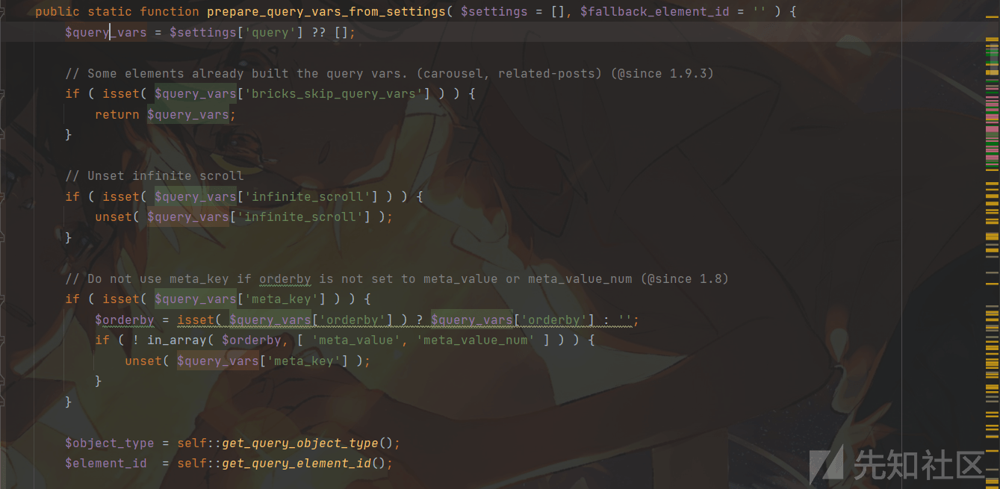](https://xzfile.aliyuncs.com/media/upload/picture/20240224214705-3230c878-d31b-1.png)

[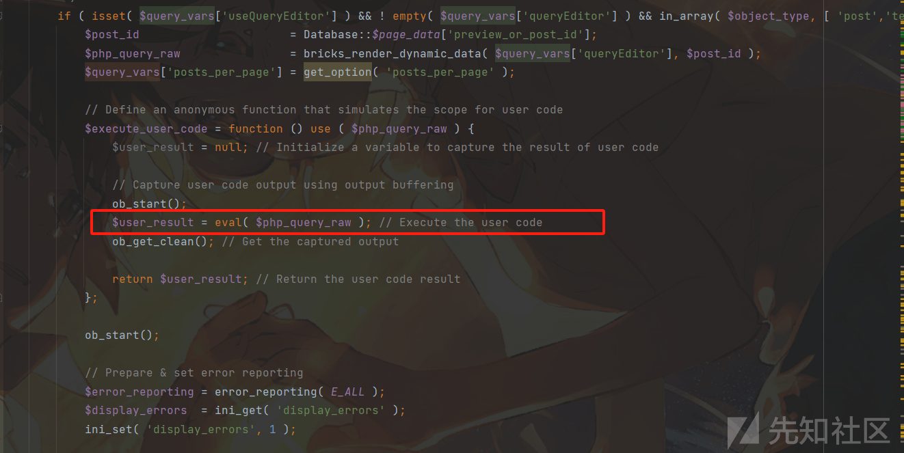](https://xzfile.aliyuncs.com/media/upload/picture/20240224214710-34fbd7aa-d31b-1.png)

`bricks_render_dynamic_data`函数实际上似乎只是根据`queryEditor`是否出现某些内容，做了一些过滤操作，也就是说`$php_query_raw`完全可被控制传入到`eval`中。

[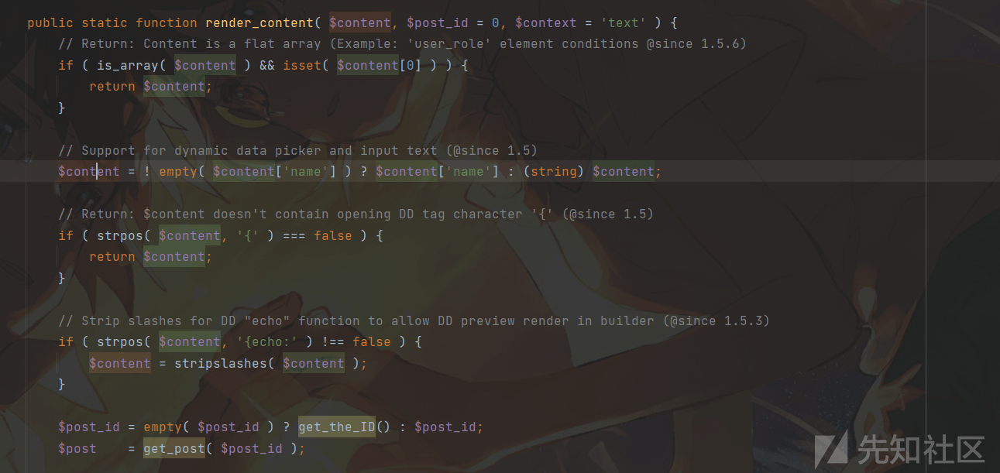](https://xzfile.aliyuncs.com/media/upload/picture/20240224214742-483b5868-d31b-1.png)

往上寻找，在`query.php`的`Query`类构造函数能够直接触发`prepare_query_vars_from_settings`，需要的条件是进入`else`循环中，也就是`element`数组中的`id`的值为空即可。

[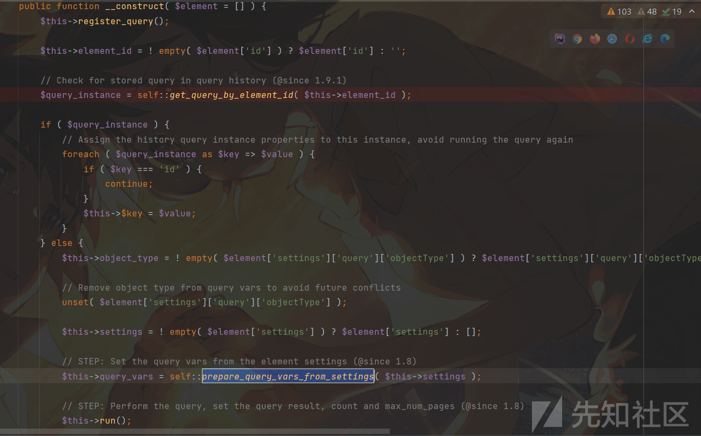](https://xzfile.aliyuncs.com/media/upload/picture/20240224214809-58493a04-d31b-1.png)

继续向上找，找在哪里会实例化`Query`类，在`ajax.php#render_element`中存在`Query`的实例化，需要的条件就是`$loop_element`为`false`，这里本身赋值为`false`，只需要`POST`请求中保持没有`loopElement`即可保持为`false`。

[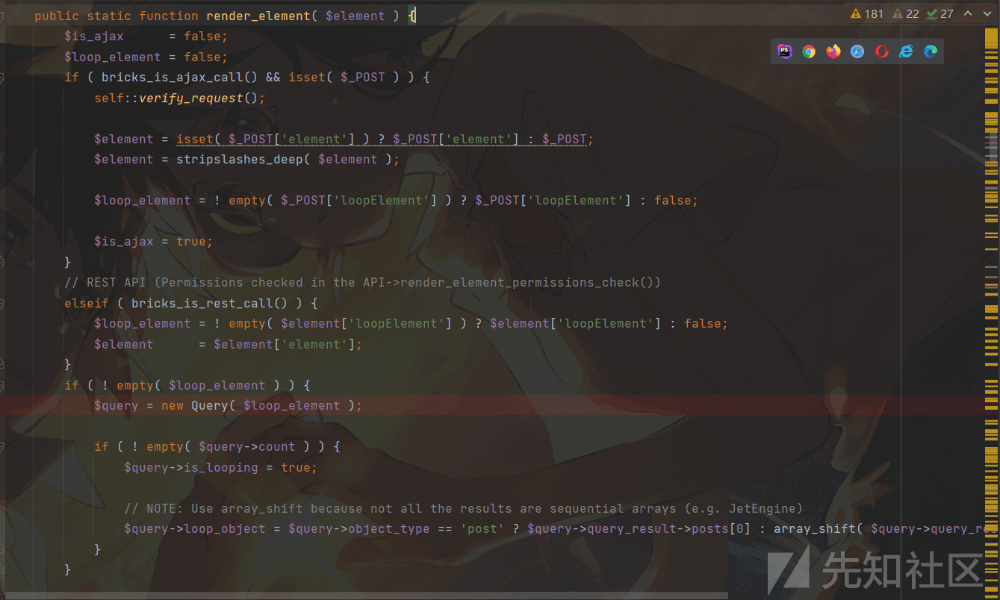](https://xzfile.aliyuncs.com/media/upload/picture/20240224220447-ab11ad6e-d31d-1.png)

当然这里实现会经过`verify_request`的验证，除了验证`nonce`的值是否正确歪，通过传入`postId`来判断当前用户是否有权限使用页面构建器（builder），如果用户没有权限。

[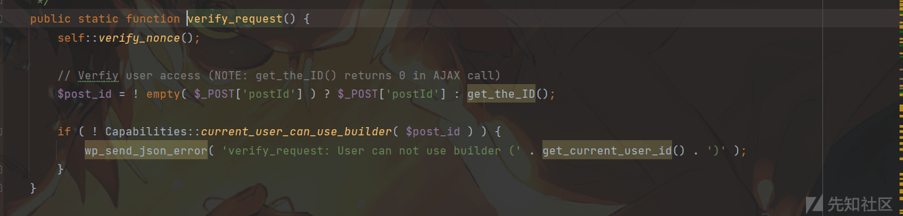](https://xzfile.aliyuncs.com/media/upload/picture/20240224220453-aec8c686-d31d-1.png)

而`verify_nonce`方法是用于验证`nonce`是否正确，其实也是后面`render_element_permissions_check`的检查，因为这里的`nonce` 是被返回到了前端可见的，因此这个漏洞也称为了**未授权 RCE**

[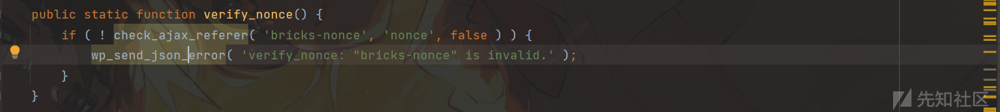](https://xzfile.aliyuncs.com/media/upload/picture/20240224220501-b3772c36-d31d-1.png)

再看这个函数的下面，它会从`elements`中获取`name`，并且通过`name` 获取一个类，判断这个类是否存在，如果不存在会抛出`doesn't exist`内容，从而导致 RCE 失败。

[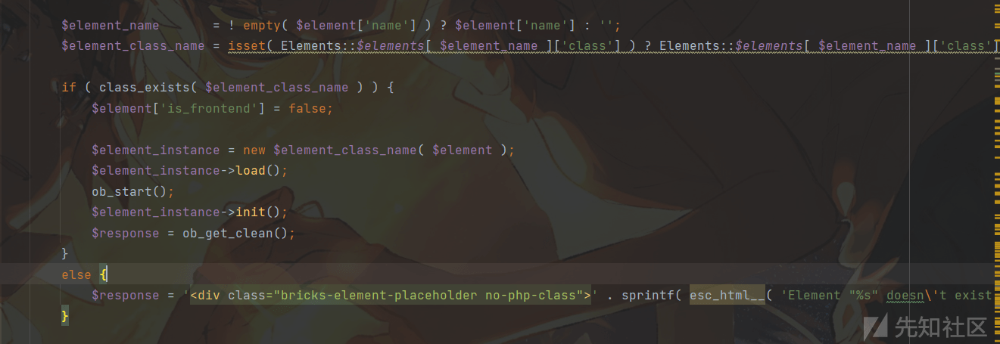](https://xzfile.aliyuncs.com/media/upload/picture/20240224220507-b757551a-d31d-1.png)

在`elements.php`中，初始化就定义了很多`name`的名称，既然放在了初始化，那么必定就是存在可用的，这也是为什么`payload`中要赋值`name:container`，其实这里赋值其它比如`section`也是可以的。

[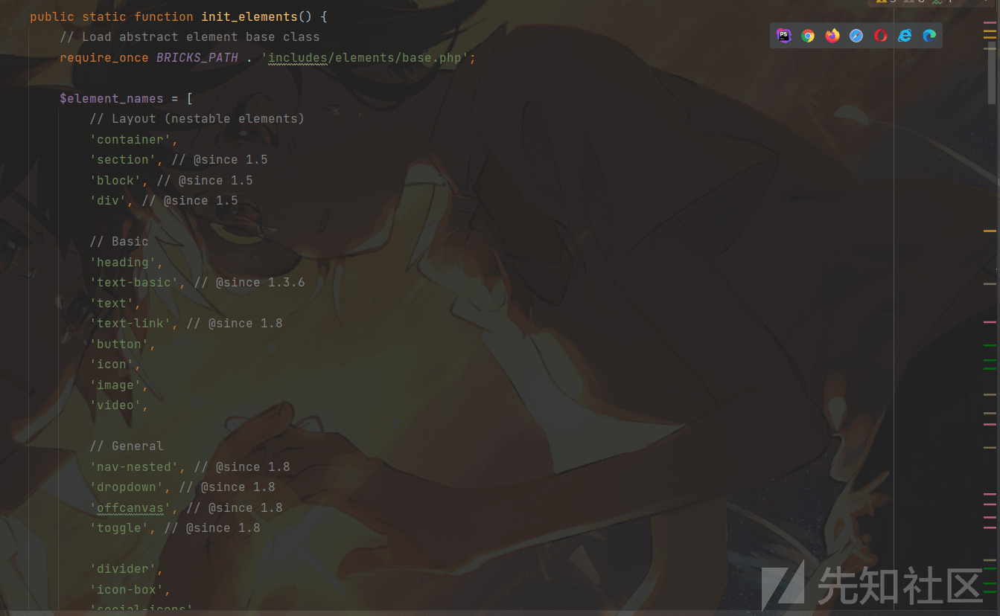](https://xzfile.aliyuncs.com/media/upload/picture/20240224220513-ba7be152-d31d-1.png)

继续查找`render_element`的调用方法，在`api.php`中存在命名相同的方法调用了`Ajax#render_element`，这里的`api.php`实际上是一个处理注册的 REST API 端点之一的文件，

[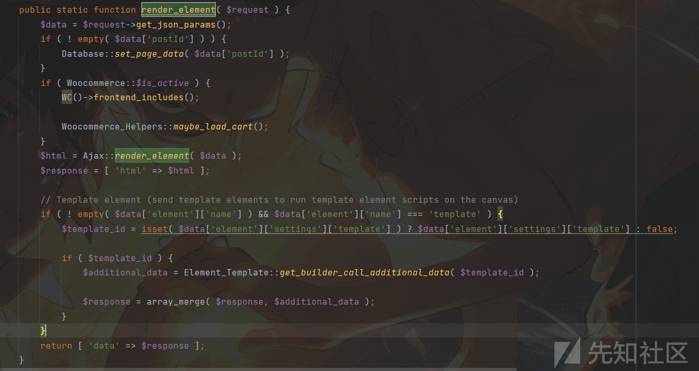](https://xzfile.aliyuncs.com/media/upload/picture/20240224220518-bd7bc8ae-d31d-1.png)

在它的自定义初始化端点函数中可以看到它定义了很多能够注册的`REST`路由，`API_NAMESPACE`的值就是`/bricks/v1/`，通过后面拼接某个字符串的方式触发对应的`callback`回调函数以及权限检查，这里的`render_element_permissions_check`就是前文所说的`nonce`随机数，是能够被看到的，仅仅只检查了随机数的值，而没有检查用户的权限。

[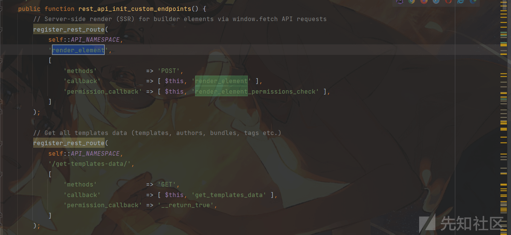](https://xzfile.aliyuncs.com/media/upload/picture/20240224220538-c974307e-d31d-1.png)

因此，整个 payload 为：

```plain
{
"postId":"1",
"nonce":"3d6020fb9a",
"element":{
    "name":"container",
    "settings":{
        "hasLoop":"true",
        "query":{
            "useQueryEditor":true,
            "queryEditor":"system('whoami');throw new Exception();", //throw new Exception() 是为了抛错回显
            "objectType":"post"
        }
    }
}
}
```

还有一个疑问是`hasLoop`的作用是什么，在去掉它的时候发现是不可以的，在`builder.php`中找到了`hasLoop`的说明，是用于表示当前的模块是否启动循环功能的，也可以理解为是否通过循环展示动态数据，可以看作是动态数据渲染的一个开关，因此要设置它为`True`。

[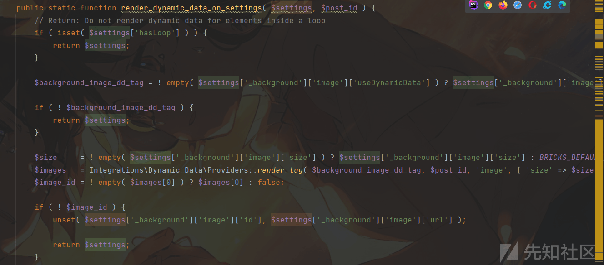](https://xzfile.aliyuncs.com/media/upload/picture/20240224220547-cef21020-d31d-1.png)

# 漏洞验证

fofa 语法：`body="/wp-content/themes/bricks/"`

获取`nonce`的值：

[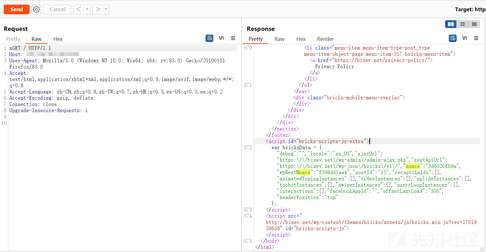](https://xzfile.aliyuncs.com/media/upload/picture/20240224220625-e596dfa4-d31d-1.png)

直接进行 RCE

[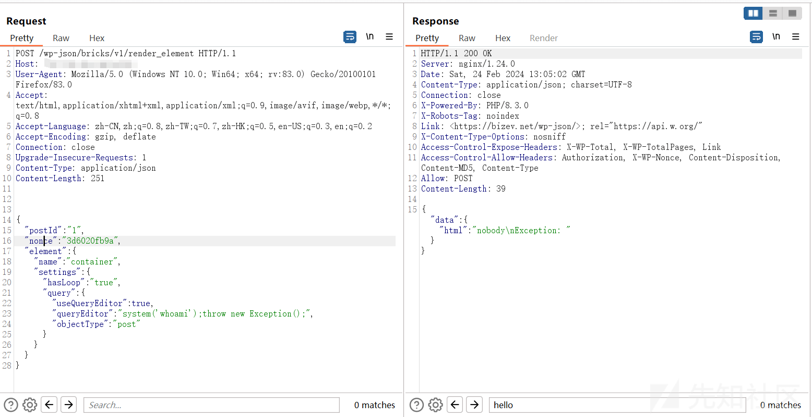](https://xzfile.aliyuncs.com/media/upload/picture/20240224220630-e8c5abba-d31d-1.png)

# 修复

官方在`render_element_permissions_check`中增加了对用户权限的检查，而不只检查`nonce`。

[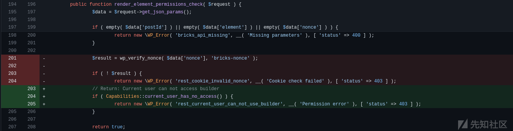](https://xzfile.aliyuncs.com/media/upload/picture/20240224220637-eca70486-d31d-1.png)

修复后的效果：

[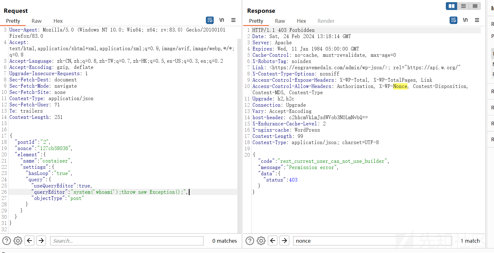](https://xzfile.aliyuncs.com/media/upload/picture/20240224220642-efad7d36-d31d-1.png)

# 总结

整个漏洞的产生原因是因为在定义`API`端点接口的时候，只对可见的随机数`nonce`进行了验证而并没有进行权限检查，导致能够传入数据从而控制动态渲染时`$php_query_raw`，最终传入到`eval`中，导致了代码的执行。
