# hook初识之inline hook - 先知社区

hook初识之inline hook

- - -

## 什么是 hook

hook 翻译过来就是钩子，它用于拦截并改变某个事件或操作的行为，比如我们大家在写 shellcode loader 时，直接使用申请内存，copy 内存等高危操作可能会报毒，然后尝试更换冷门的 api 或者直接使用内核函数时，成功绕过杀软，这个时候可能就是因为杀软 hook 了高危 api 但是没有 hook 一些冷门 api 导致的。

## inline hook

inline hook 只是众多 hook 方式中的一种，它用到的是 jmp 指令，我们接下来用一个小 demo 来学习一下 inline hook。

### demo

```plain
#include <iostream>
#include <Windows.h>

extern"C" __declspec(dllexport) void fun() {
    while (1) {
        Sleep(1000);
        printf("hello world\n");
    }
}

int main()
{
    fun();
}
```

我们先随便设个断点，然后在调试，查看反汇编：

[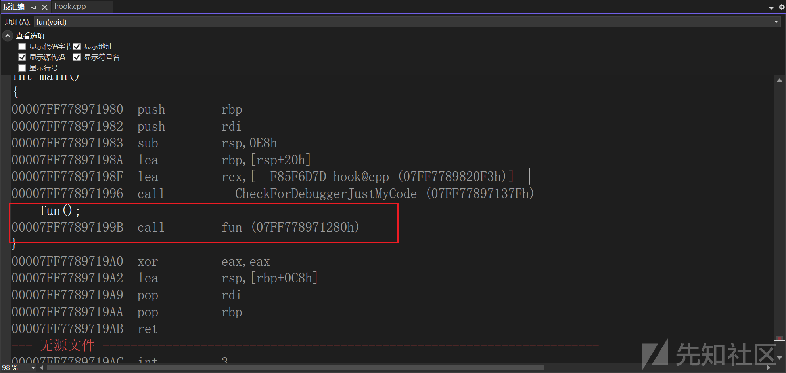](https://xzfile.aliyuncs.com/media/upload/picture/20240303100752-d7cdeef4-d902-1.png)

可以看到调用 fun 函数的时候`call 07FF778971280h`，我们跟到这个地址再去看看

[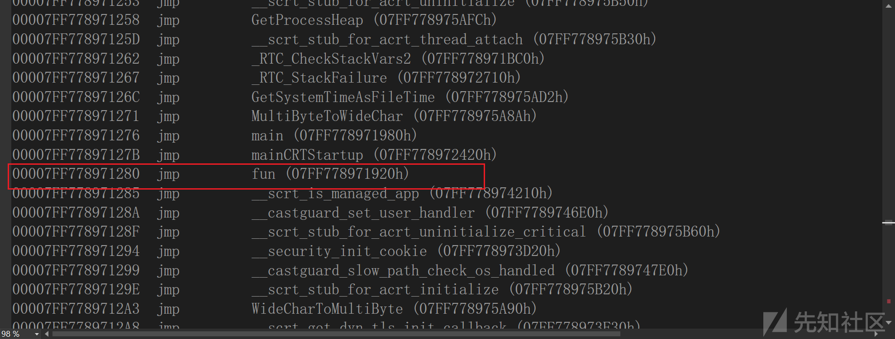](https://xzfile.aliyuncs.com/media/upload/picture/20240303101000-2393513a-d903-1.png)

发现这个地址相邻都有很多 jmp 指令，jmp 的目的地就是各个函数，我们去`07FF778971920h` 看一下：

[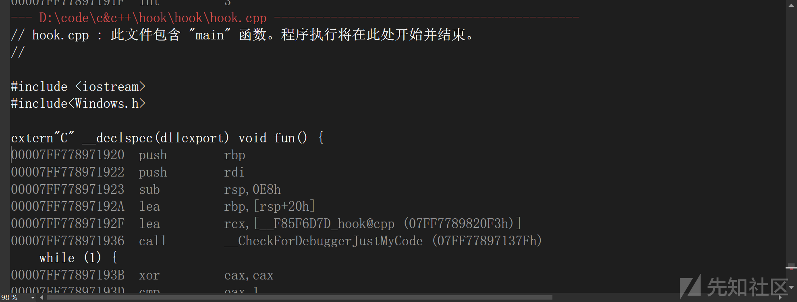](https://xzfile.aliyuncs.com/media/upload/picture/20240303101259-8e76b776-d903-1.png)

可以发现 `07FF778971920h`就是真正的 fun 的地址。  
那么我们到这里就对一个调用流程有了一个基本的认知了，调用时首先 call 一下，在 call 的地方会有一个 jmp 指令等着你去跳转到真正的 fun 函数处。  
那么我们办法修改 jmp 指令的地址，使其跳转到我们想要跳转的函数，不就实现了一个 hook 吗，我们可以在 x64dbg 中简单的验证一下想法：

[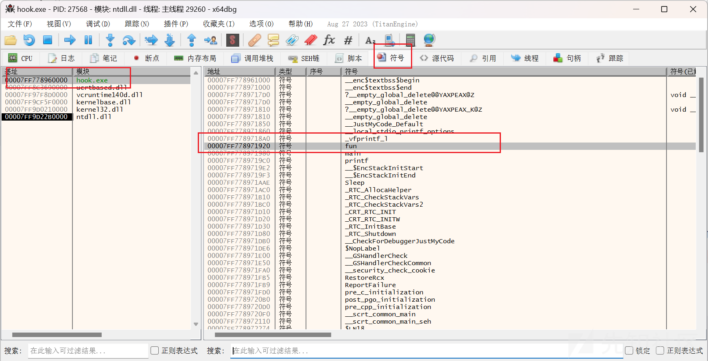](https://xzfile.aliyuncs.com/media/upload/picture/20240303101324-9d78679c-d903-1.png)

符号处找到 main 函数

[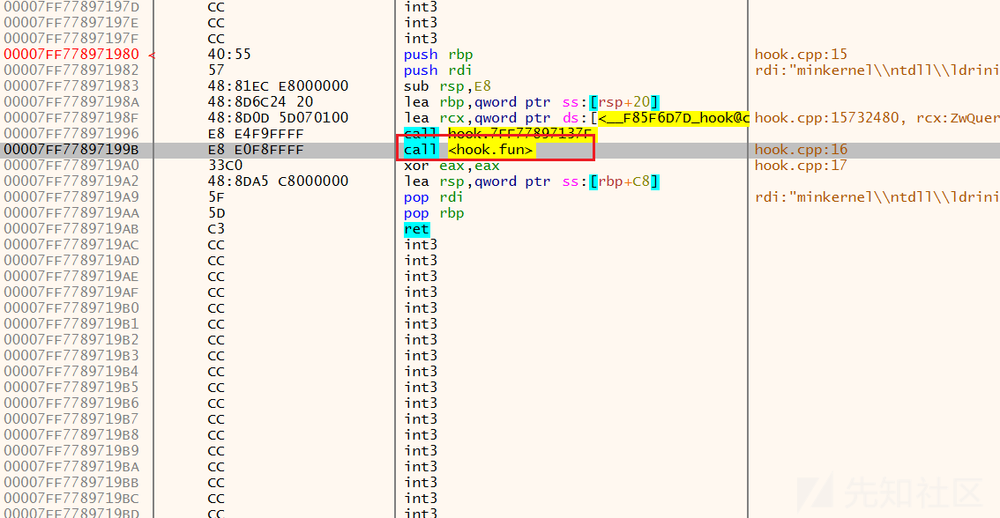](https://xzfile.aliyuncs.com/media/upload/picture/20240303101352-ae3a7462-d903-1.png)

直接双击上图红框处

[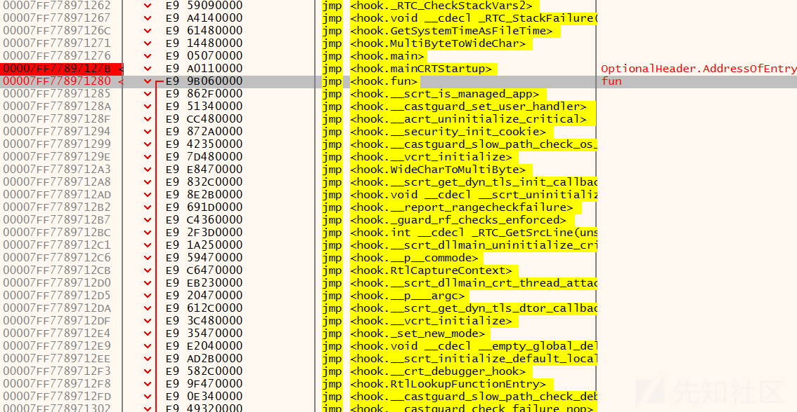](https://xzfile.aliyuncs.com/media/upload/picture/20240303101403-b471fdbe-d903-1.png)

可以看到那一堆 jmp 指令处了，我们直接修改一下看看会发生什么

[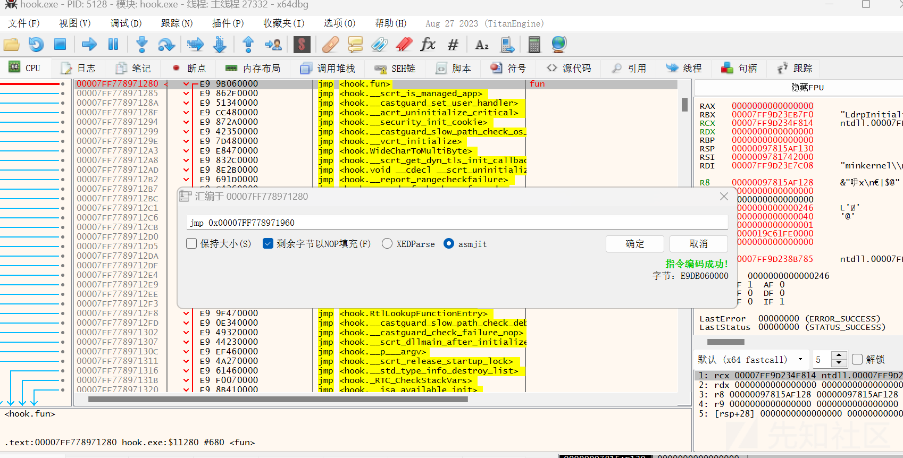](https://xzfile.aliyuncs.com/media/upload/picture/20240303101414-bb5b504e-d903-1.png)

直接会发生异常，因为这块内存好像还是 fun 函数内部的东西，所以异常是正常的

[](https://xzfile.aliyuncs.com/media/upload/picture/20240303101424-c0f9f906-d903-1.png)

[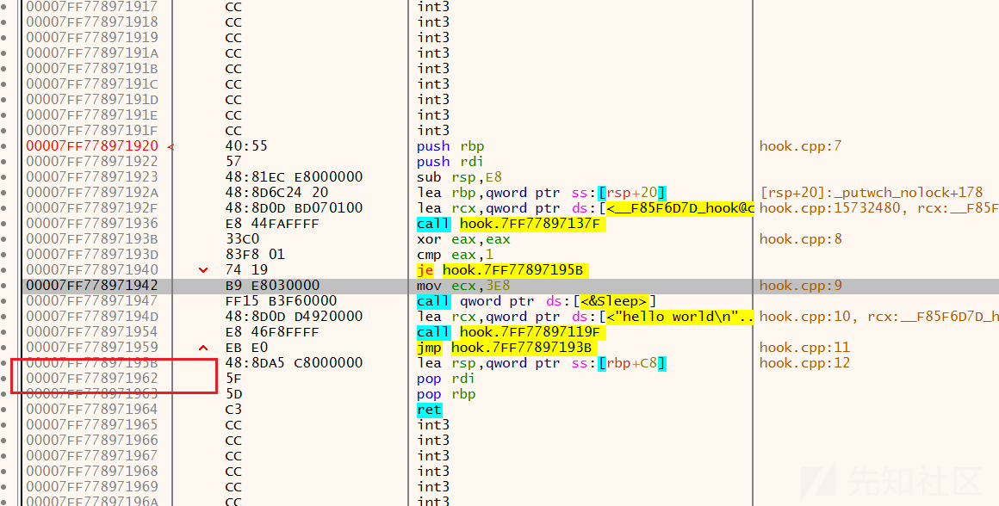](https://xzfile.aliyuncs.com/media/upload/picture/20240303101441-cb45767e-d903-1.png)

我们修改一下源代码，增加一个 fun1 函数，方便我们修改 jmp 地址:

```plain
#include <iostream>
#include <Windows.h>

extern"C" __declspec(dllexport) void fun() {
    while (1) {
        Sleep(1000);
        printf("hello world\n");
    }
}
extern"C" __declspec(dllexport) void fun1() {
    MessageBox(0, 0, 0, 0);
}

int main()
{
    fun();
}
```

我们直接进行修改：

[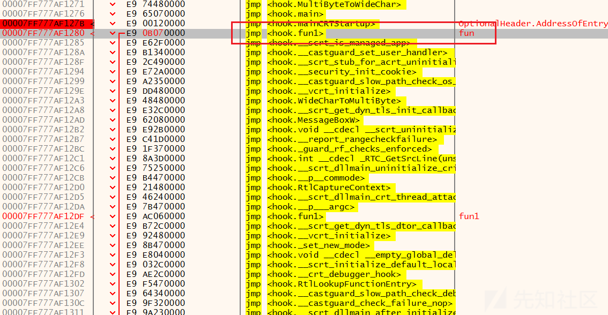](https://xzfile.aliyuncs.com/media/upload/picture/20240303101452-d210337c-d903-1.png)

注意到上图代码和注释不一样，我们来运行一下

[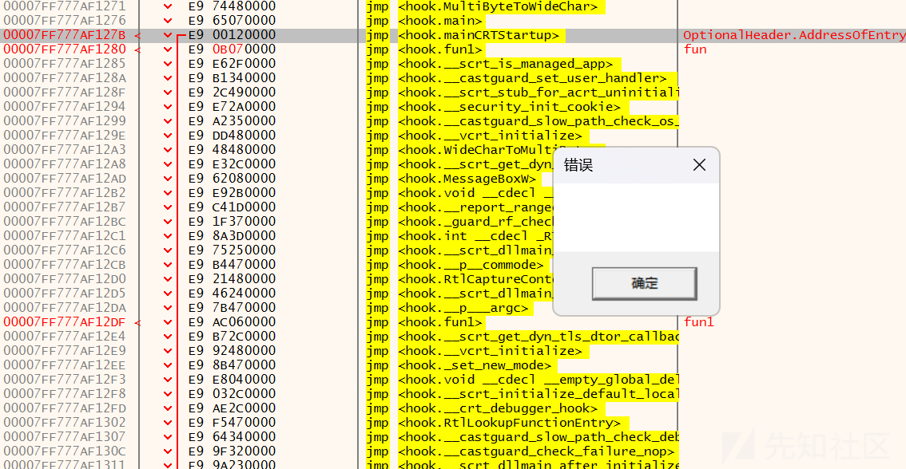](https://xzfile.aliyuncs.com/media/upload/picture/20240303101502-d7dfa666-d903-1.png)

弹出来 messagebox，所以可以证明 hook 成功，接下来我们要做的事情就是将上述流程用代码来实现。

### 代码实现上述 demo

代码实现的难点是确定修改的字节，我们可以先分析一下 jmp 处的详情：

> 00007FF6996412E9 | E9 12060000 | jmp <hook.fun> |  
> 00007FF6996412EE | E9 8D3D0000 | jmp <hook.**scrt\_is\_managed\_app> |  
> 00007FF6996412F3 | E9 58420000 | jmp <hook.**castguard\_set\_user\_handler> |

E9 是 jmp，然后就是一个地址了，并且我们可以发现 `<hook.fun>`的地址并不是 `AB060000`，其他两个例子同理，这两个数是怎么算出来的呢？  
第一个数是硬编码，第二个数是 `<hook.fun>`的地址，他们之间有以下规则：

> 硬编码 = 要跳转的地址 - 指令完成的下一条地址

我们用上述 fun 的例子验证一下，先看一下参数：

[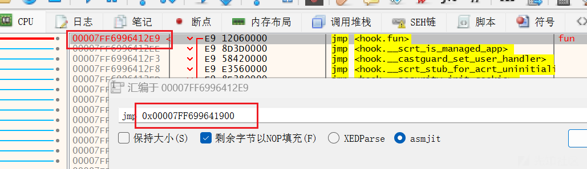](https://xzfile.aliyuncs.com/media/upload/picture/20240303101514-def31226-d903-1.png)

硬编码 = 00007FF699641900-00007FF6996412EE = 612  
由于计算机是小端格式存储，所以说是 E9 12060000。  
由于指令的长度是 5，所以公式也可以表示为：

> 硬编码 = 要跳转的地址 - （当前指令地址 + 5）

接下来就是代码实现了：  
我们先来明确一下我们的目标，通过一个 hook 函数，让我们在调用 fun 函数时，调用 fun1 函数。  
所以我们先需要获取 fun 和 fun1 函数的地址：

[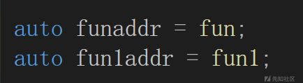](https://xzfile.aliyuncs.com/media/upload/picture/20240303101525-e5c9d47c-d903-1.png)

这里的地址其实就是上面那堆 jmp 处的地址，所以我们只需要在这个地址的基础上修改内存硬编码即可。  
我们先将地址强转为 char\*类型，这样单位是一个字节，所以`chfunaddr + 1`就把 E9 跳过去了，直接来到了硬编码的地方，方便我们修改

[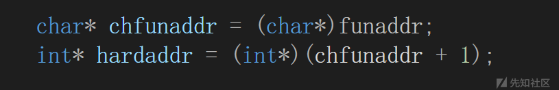](https://xzfile.aliyuncs.com/media/upload/picture/20240303101539-ede18718-d903-1.png)

接下来套用上面的公式计算出硬编码

[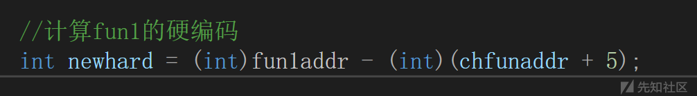](https://xzfile.aliyuncs.com/media/upload/picture/20240303101552-f567d8fc-d903-1.png)

但是注意我们此时还不能直接修改内存，因为我们的程序都在.text 端，内存属性是只读的，所以我们需要修改内存属性，然后再修改内存即可

[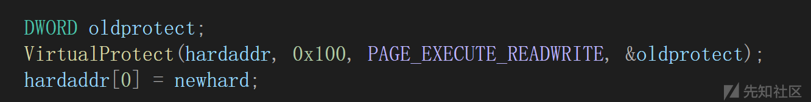](https://xzfile.aliyuncs.com/media/upload/picture/20240303101607-fec60d10-d903-1.png)

这样我们就完成了一次 hook ，看效果：

[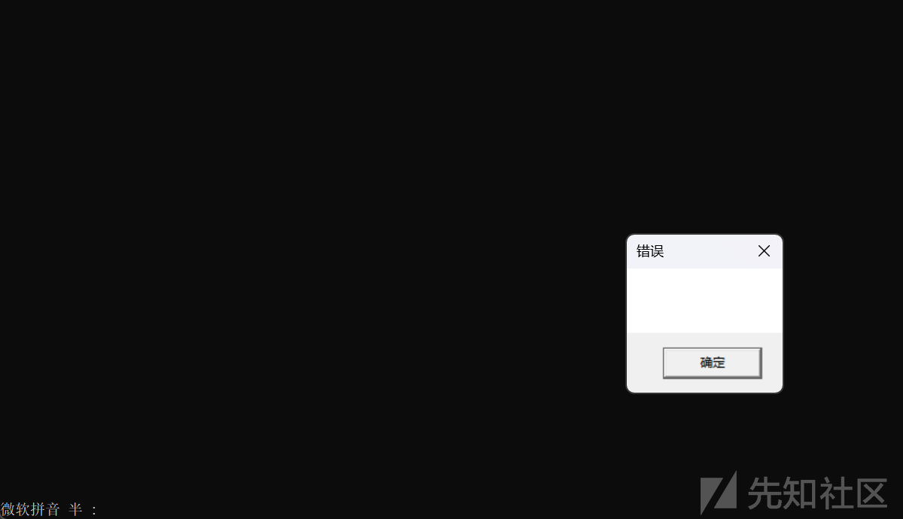](https://xzfile.aliyuncs.com/media/upload/picture/20240303101620-06636fae-d904-1.png)

并没有调用 fun，而是调用了 fun1，我们目前的代码如下 :

```plain
// hook.cpp : 此文件包含 "main" 函数。程序执行将在此处开始并结束。
//

#include <iostream>
#include<Windows.h>

extern"C" __declspec(dllexport) void fun()
{
    while (true)
    {
        Sleep(1000);
        printf("Hello World!\n");
    }
}

void fun1() {
    MessageBox(0, 0, 0, 0);
}

auto funaddr = fun;
auto fun1addr = fun1;

void hook() {

    char* chfunaddr = (char*)funaddr;
    int* hardaddr = (int*)(chfunaddr + 1);

    //计算fun1的硬编码
    int newhard = (int)fun1addr - (int)(chfunaddr + 5);

    DWORD oldprotect;
    VirtualProtect(hardaddr, 0x100, PAGE_EXECUTE_READWRITE, &oldprotect);
    hardaddr[0] = newhard;

}

int main()
{
    hook();
    fun();
}
```

但是到这里还没有完善 hook，因为 hook 还有一个事情要做那就是还原，不仅先调用了 fun1，还要再调用 fun，不能让用户察觉到异常，所以我们接下来继续完善代码：  
我们需要申请一段内存空间，用来存储修改之前的指令，然后在 hook 操作结束之后直接执行即可  
我们在修改内存的时候提前保存一下原来的硬编码

[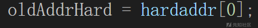](https://xzfile.aliyuncs.com/media/upload/picture/20240303101639-117d125a-d904-1.png)

在执行 fun1 的时候先 unhook 一下，恢复 funadd r原来的值，再直接调用即可

[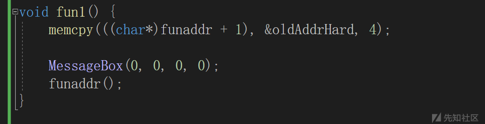](https://xzfile.aliyuncs.com/media/upload/picture/20240303101653-1a51cd3a-d904-1.png)

完整的代码如下：

```plain
#include <iostream>
#include <Windows.h>

extern"C" __declspec(dllexport) void fun()
{
    while (true)
    {
        Sleep(1000);
        printf("Hello World!\n");
    }
}
void fun1();

auto funaddr = fun;
int oldAddrHard = 0;
auto fun1addr = fun1;

void fun1() {
    memcpy(((char*)funaddr + 1), &oldAddrHard, 4);

    MessageBox(0, 0, 0, 0);
    funaddr();
}

void hook() {

    char* chfunaddr = (char*)funaddr;
    int* hardaddr = (int*)(chfunaddr + 1);

    //计算fun1的硬编码
    int newhard = (int)fun1addr - (int)(chfunaddr + 5);

    oldAddrHard = hardaddr[0];

    DWORD oldprotect;
    VirtualProtect(hardaddr, 0x100, PAGE_EXECUTE_READWRITE, &oldprotect);
    hardaddr[0] = newhard;

}

int main()
{
    hook();
    fun();
}
```

这样我们就实现了调用完 fun1 再调用 fun 的 hook。  
虽然 hook 有很多框架之类的，但还是建议大家初学时动手实现一下，一是很有趣，二来也能加深自己的理解。
