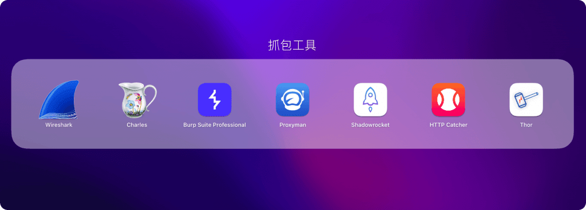
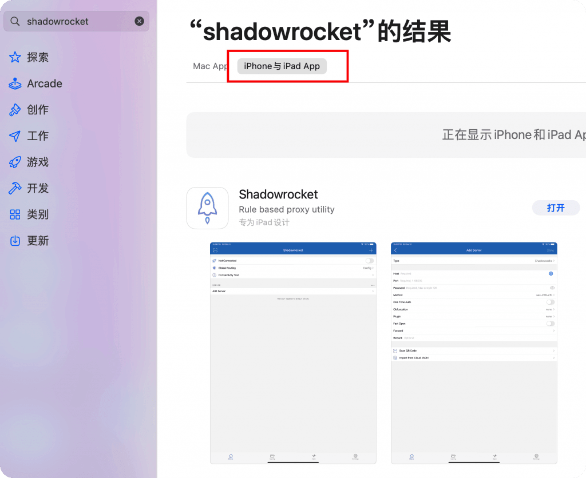
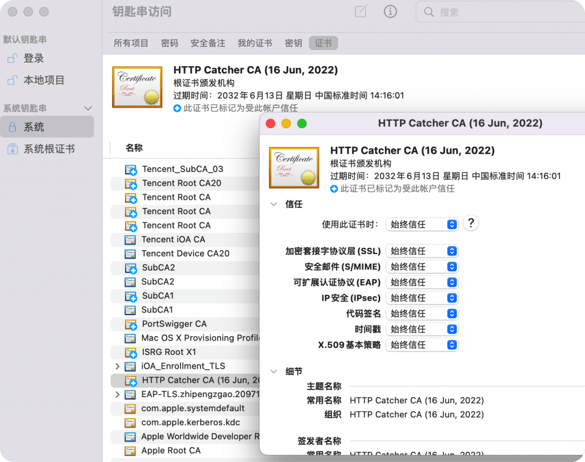
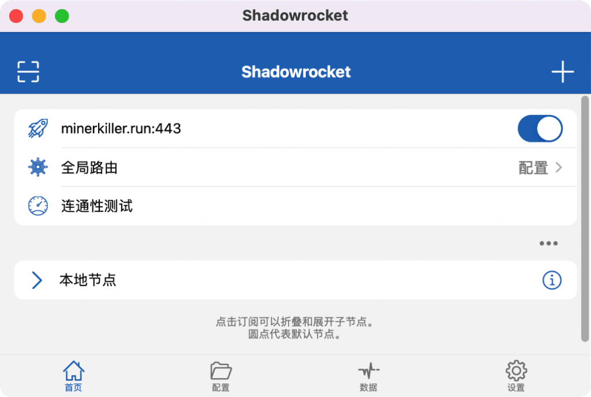
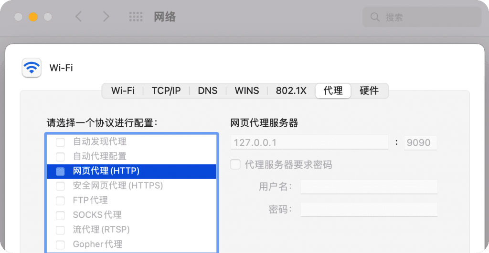
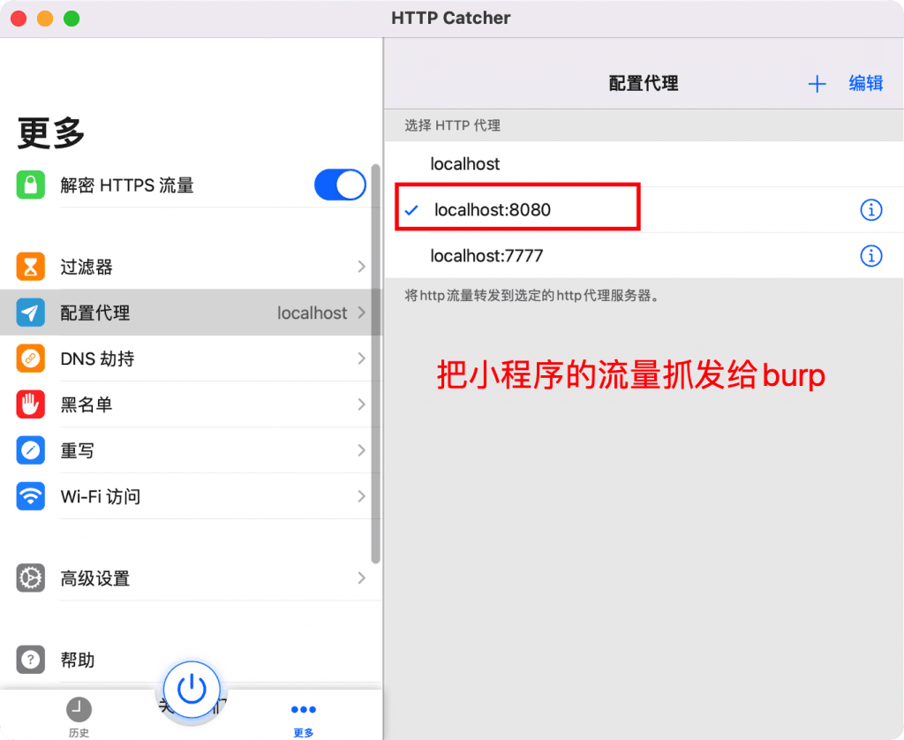
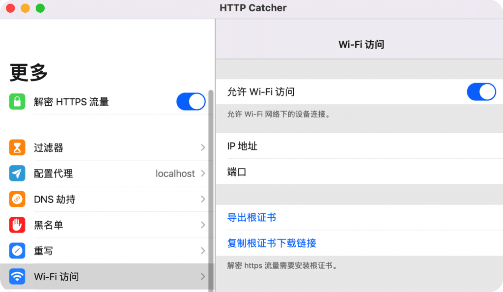
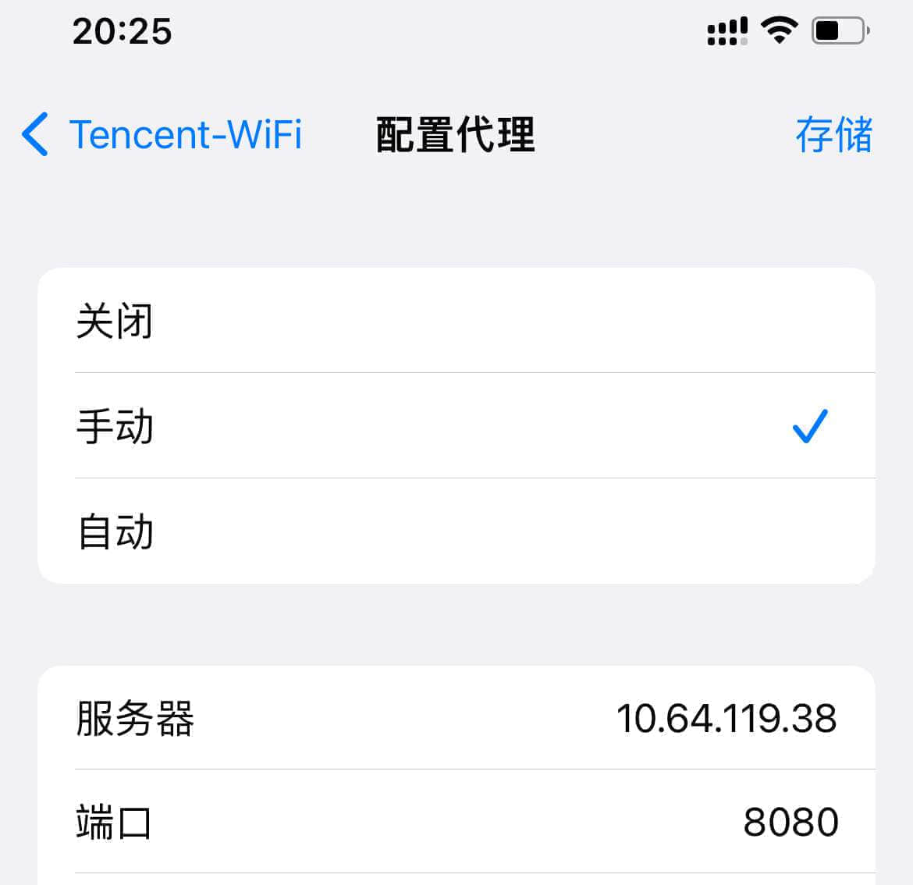
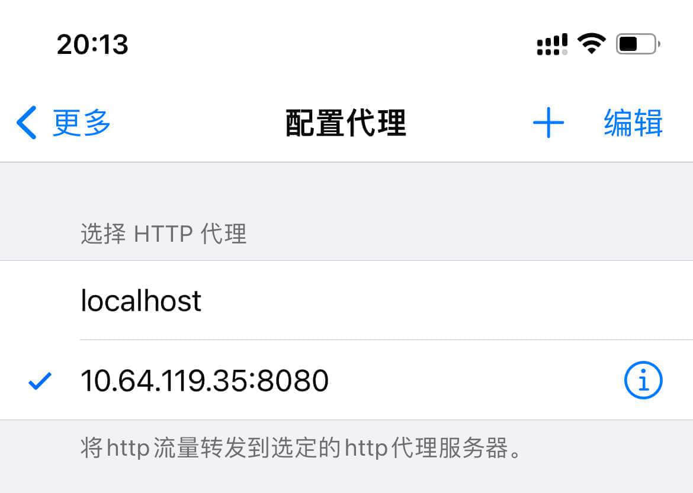
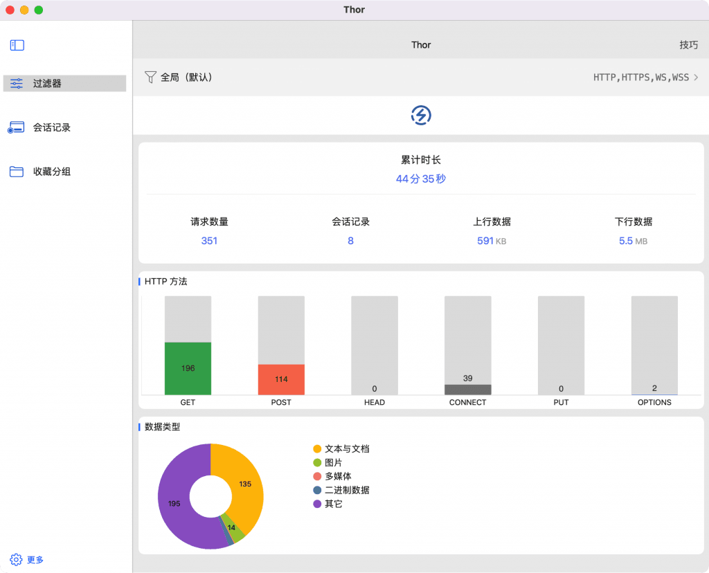

# m1 mac 用 ios App 抓包 – Zgao's blog

### m1 mac 用 ios App 抓包

作者 [Zgao](https://zgao.top/author/zgao/)

由于 m1 mac 是 arm 架构，所以是可以在 mac 上直接运行 ios 的应用。所以 m1 的抓包方式也就不再局限于传统的 wireshark、Charles 和 burp 这类抓包工具，连手机上的 shadrocket（小火箭） 、httpCatcher（网球）、Thor 都能直接在 mac 进行抓包或者用于上网代理。

## 如何在 m1 mac 上安装 ios 应用？

ps：ios 的抓包 app 需要用美区 id 购买下载。

打开 mac 电脑上的 app store，选择`iphone与ipad App`，搜索`shadowrocket`下载安装即可。

## 信任证书

在钥匙串中选择始终信任该证书。

打开小火箭安装证书后，导入科学上网节点就可以 fq 了。

在 macos 上运行的小火箭，mac 科学上网和手机一样方便

同理其他的几个 ios 抓包工具和小火箭也是一样使用方式。

## 高级操作

### 抓包工具中开启系统全局流量转发

通常在做一些渗透测试工作的时候，比如需要抓包一些微信小程序的数据包。在 mac 上抓包是需要在系统设置中修改的，不然小程序是不会走代理的。

每次修改是比较麻烦的。可以抓包工具中配置好，使用的时候一键开启就好。

以 mac 的 http Catcher 为例。

### 将 ios 的流量一键转发给 mac 的 burp

ios 通过系统设置给 wifi 配置远程代理比较麻烦，有以下两点：

-   修改的结果不能留存，下次设置的时候还得重新输入。
-   换了 wifi 网络，还得重新配置代理。

可以先在 mac 开启 wifi 访问。再通过 ios 的 http Cathcer 配置代理为 mac 的 ip 和端口。每次要抓手机数据包的时候一键开启，节省大量时间。

系统代理配置，无法保存配置

http Cathcer 配置

### 安装对应抓包工具的证书

http Catcher『ios』-> http Catcher『mac』-> burp『mac』

举个例子，我们使用 http Catcher 转发 iOS 的流量最终给到 burp，那就要在 ios 上安装 burp 的证书。
