# pwn 堆的结构及堆溢出理解 - 先知社区

pwn 堆的结构及堆溢出理解

- - -

# 堆

**堆其实就是程序虚拟地址空间的一块连续的线性区域，它由低地址向高地址方向增长（栈由高地址向低地址增长）。我们一般称管理堆的那部分程序为堆管理器**。 **堆是分配给程序的内存空间 与栈不同，堆内存可以动态分配。这意味着程序可以在需要的时候从堆段中`请求`和`释放`内存。此外，此内存是全局的，即可以从程序中的任何地方访问和修改它，并且不会局限于分配它的函数。这是通过使用`指针`来引用动态分配的内存来完成的，与使用局部变量 (在栈上) 相比，这反过来会导致性能的小幅下降。**

请求与释放内存主要是通 malooc 与 free 函数实现

堆在程序中的位如图所示

[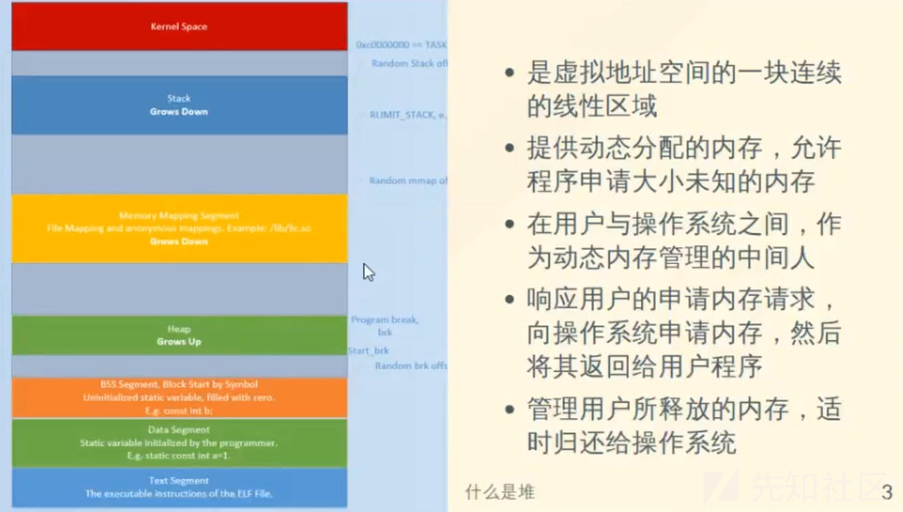](https://xzfile.aliyuncs.com/media/upload/picture/20240305153342-b11f7af4-dac2-1.png)

### 堆和栈的对比如下表所示

|     | 堆   | 栈   |
| --- | --- | --- |
| 申请  | 程序在运行过程中动态分配，由程序控制申请 | 程序运行前分配 |
| 释放  | 不能自动释放，由程序控制释放 | 自动释放 |
| 特点  | 地址由低 => 高 | 地址由高=>低 |
| 内存分配 | 非线性，无序 | 线性，有序----------- |

如果频繁的呼叫 syscall 则程序会频繁的在 kernal 与 user 之间切换，会造成效率的降低

因此 library 会提前申请一大块区域并进行各种操作  
[](https://xzfile.aliyuncs.com/media/upload/picture/20240305153407-bfcad88c-dac2-1.png)  
本篇文章主要是写关于 glibc ptmalloc

pwndbg 里面的 parseheap 会出现 heap 构造

[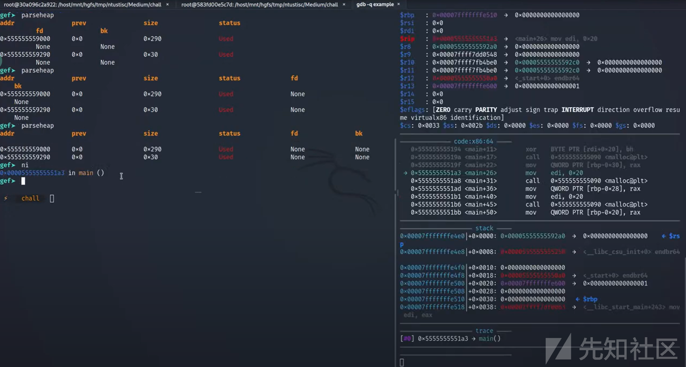](https://xzfile.aliyuncs.com/media/upload/picture/20240305153433-cf5de35c-dac2-1.png)  
经过 free  
[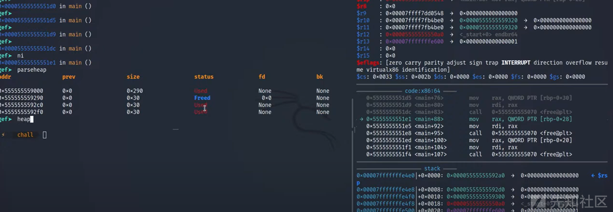](https://xzfile.aliyuncs.com/media/upload/picture/20240305153510-e5956532-dac2-1.png)

ptmalloc 请求 0x20 但是因为存在 pre size 与 size 会占用 0x10 的空间

所以是 0x30

同时如果 free 掉这段 chunk 则 bin（堆管理器）会连接 free chunk  
[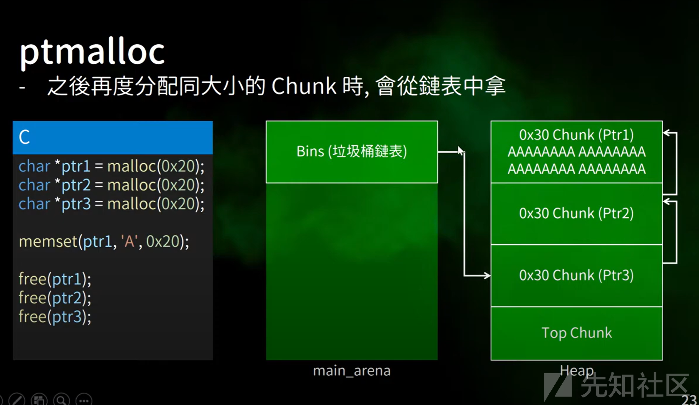](https://xzfile.aliyuncs.com/media/upload/picture/20240305153533-f303abfc-dac2-1.png)

在 ptmalloc 管理下

[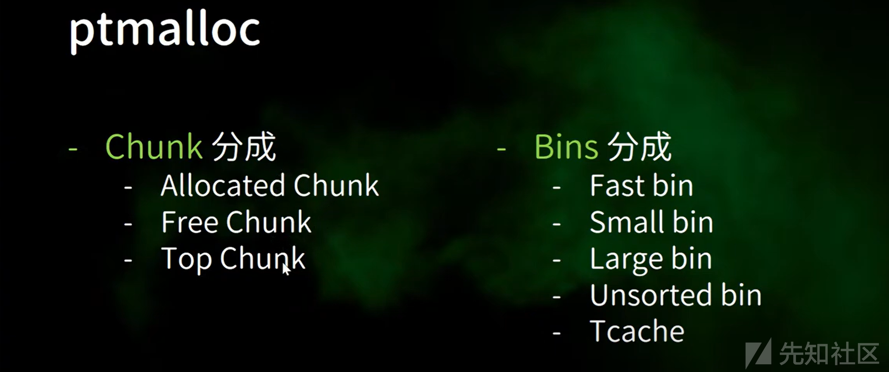](https://xzfile.aliyuncs.com/media/upload/picture/20240305153617-0d772022-dac3-1.png)

chunk 分为

allocated chunk 已经分配的 chunk freechunk 已经释放的 chunk topchunk 剩余的 chunk

chunk 的结构如图所示

[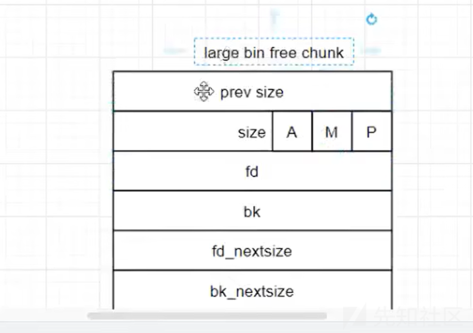](https://xzfile.aliyuncs.com/media/upload/picture/20240305153809-505bd70c-dac3-1.png)

**pre size** 用来储存前一个 chunk 的大小信息，同时不会存在两个相邻的空闲 chunk

**size** 记录了当前 chunk 的大小，chunk 的大小都是 8 字节对齐，所以 size 的低 3 位都是 0，不用来表示地址。为了充分利用内存空间，这三位被当作了标志位 A M P

A 记录当前 chunk 是否属于主线程 1 不属于 0 属于

M 记录是否当前 chunk 由 mmap 分配 1 是 0 否

P 记录前一个 chunk 是否被分配 1 是 0 否

### chunk 合并

当 size 后三位 P 显示前一个 chunk 是 0 未被分配，鉴于节省空间考虑将会合并两个 chunk

这也就是为什么没有两个相邻的空闲 chunk

## bin 堆管理器

### fast bin

[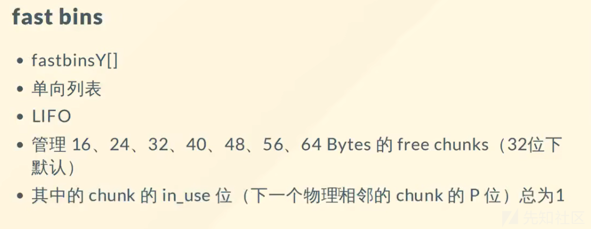](https://xzfile.aliyuncs.com/media/upload/picture/20240305153823-58d85e5a-dac3-1.png)

[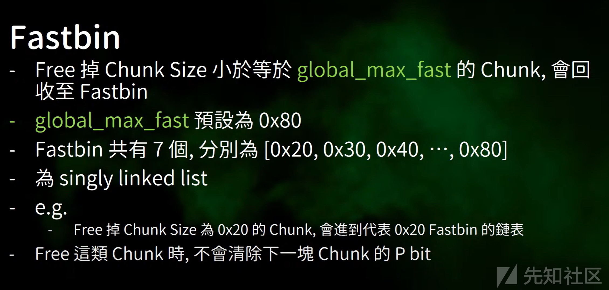](https://xzfile.aliyuncs.com/media/upload/picture/20240305153911-75452fe6-dac3-1.png)

小于 0x80 的 free bin 都会存在于 fast bin

fast bin 共有七个 0x20-0x80

###### free 这类 chunk 时不会清除下一块 chunk 的 P 的值 即下一块 chunk 依旧会 P=1

同时在 fast bin 中会使用到 fd 即指向下一个 free chunk 而 bk 是不会被用到的

[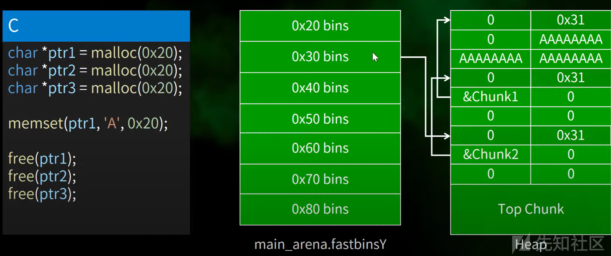](https://xzfile.aliyuncs.com/media/upload/picture/20240305153937-84e56c68-dac3-1.png)

如上图 连接起来所有的 free chunk fd 指向 chunk header

[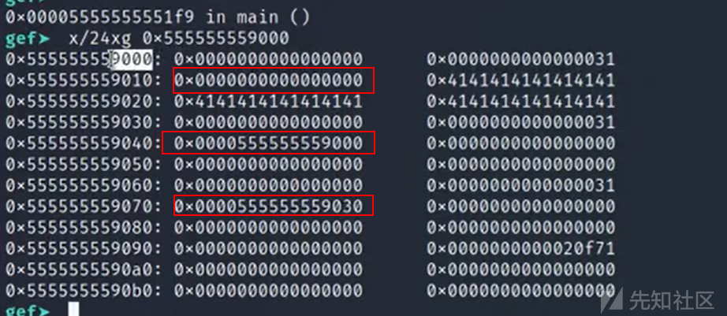](https://xzfile.aliyuncs.com/media/upload/picture/20240305153958-914640e0-dac3-1.png)

[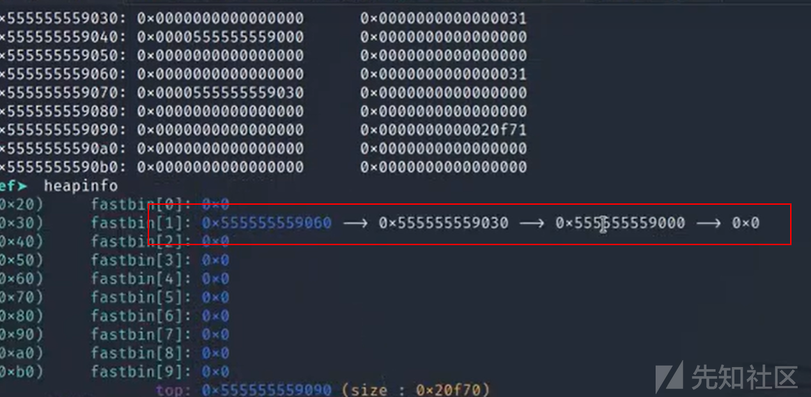](https://xzfile.aliyuncs.com/media/upload/picture/20240305154011-98d25970-dac3-1.png)

### small bin

[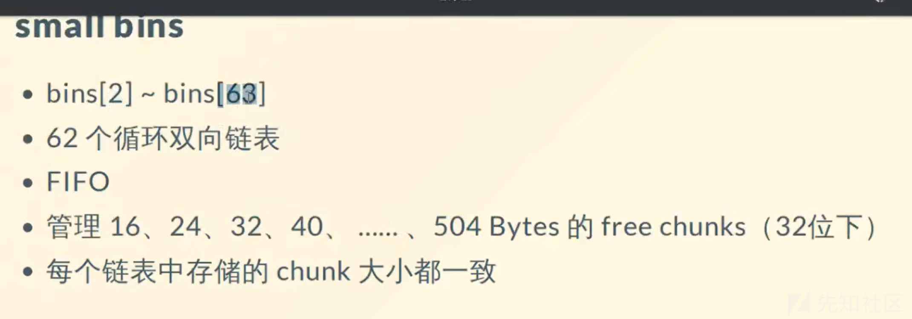](https://xzfile.aliyuncs.com/media/upload/picture/20240305154022-9f3b67ca-dac3-1.png)

-   Small Bins 用于存储较小尺寸的空闲 chunk，这些 chunk 按照特定的大小分类存放在多个链表中。每个链表中的 chunk 大小相近，这样可以快速地找到与请求分配内存大小匹配或稍大的 chunk。

small bin 与 fast bin 相比较 fast bin 中的 chunk 通常更小以便更快速的完成任务

malloc 首先检查 Fast Bins 来满足小内存分配请求，若 Fast Bins 中无合适 chunk，则转而去 Small Bins 或其他 bins 中查找或分配新的内存空间。

### large bin

[](https://xzfile.aliyuncs.com/media/upload/picture/20240305154032-a5585226-dac3-1.png)

large bin 是相对于 small bin 来说的

Large Bins 用于存储那些超出 Small Bins 管理范围的较大尺寸的空闲 chunk。

储存较大的 chunk 即大于 504byte 的 free chunk

当程序分配内存时会首先向 large bin 检查

如果 Large Bins 也无法满足请求，malloc 可能会尝试从 Top Chunk（堆顶 chunk）分割内存，或者直接向操作系统申请更多的内存空间。

### unsorted bin

[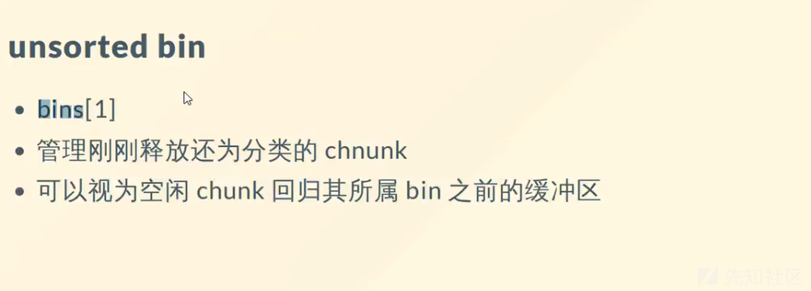](https://xzfile.aliyuncs.com/media/upload/picture/20240305154043-ac4c38ae-dac3-1.png)

又被成为垃圾桶回收还未来的及进入分类的 chunk

-   Unsorted Bin 不按照 chunk 大小进行排序，因此被称为“未排序”。
-   刚释放的 chunk 会直接插入到 unsorted bin 的链表头部。
-   在新的内存分配请求发生时，malloc 首先检查 unsorted bin 是否有合适的 chunk 可用，因为这里可能存放了最近刚刚释放的大块内存。
-   一段时间后（例如，在下一次 malloc 或 realloc 操作），unsorted bin 中的 chunk 会被正确地转移到相应的 small bin、large bin 或其他适当的区域，以确保内存管理的有序性和效率。

使用 unsorted bin 可以快速响应和利用最近释放的大块内存，同时避免了立即进行复杂的数据结构调整。

### tcache

为了更高效率产生的  
[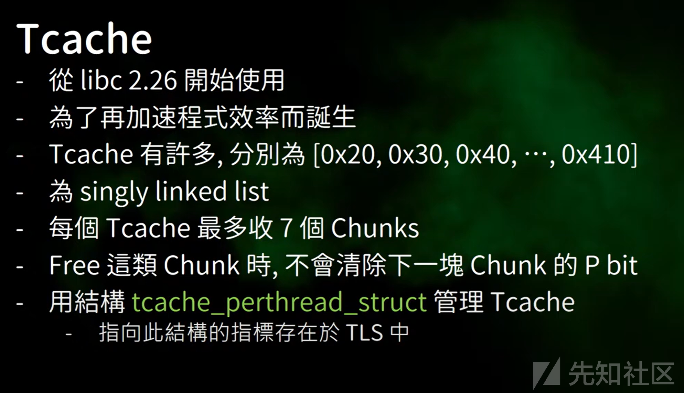](https://xzfile.aliyuncs.com/media/upload/picture/20240305154140-ce1f6e06-dac3-1.png)

tcache 在 libc 2.6 出现

在 libc2.23 时 free chunk 存入 fast bin  
[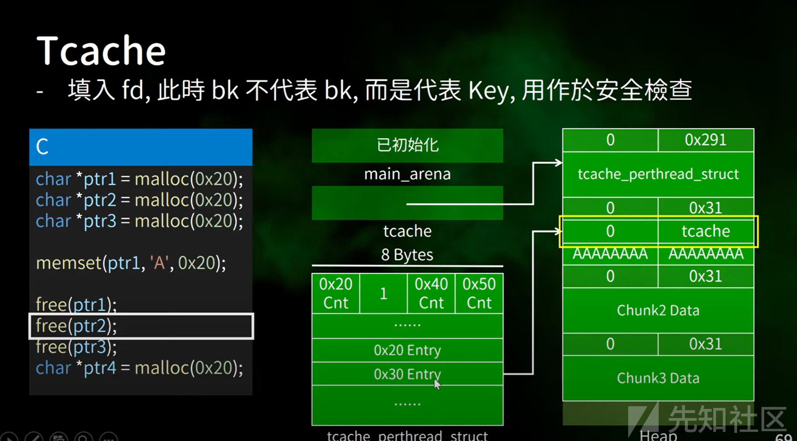](https://xzfile.aliyuncs.com/media/upload/picture/20240305154338-141c08b0-dac4-1.png)

fd 指向上一个 chunk 的 fd bk 存入 key 用作安全检查

而在 fast bin 中 fd 指向上一个 chunk 的 chunk 头 bk 内容是不变的

[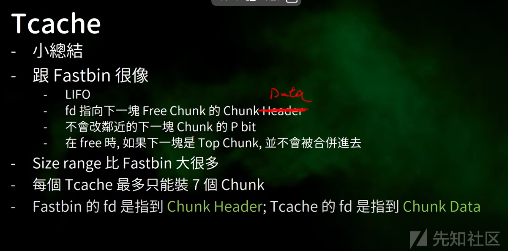](https://xzfile.aliyuncs.com/media/upload/picture/20240305154359-20c1408a-dac4-1.png)

cnt 表示存在几个 entry

[](https://xzfile.aliyuncs.com/media/upload/picture/20240305154441-3a329f82-dac4-1.png)  
[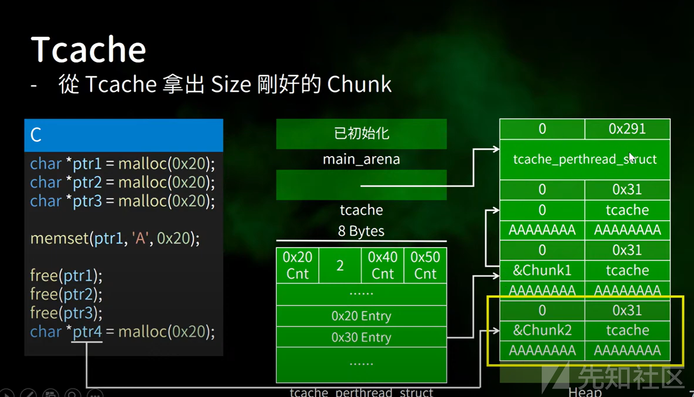](https://xzfile.aliyuncs.com/media/upload/picture/20240305154546-60ec366a-dac4-1.png)

heap info

[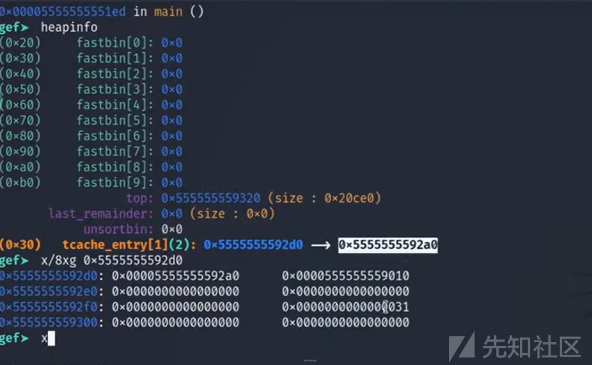](https://xzfile.aliyuncs.com/media/upload/picture/20240305154609-6e3560b2-dac4-1.png)

[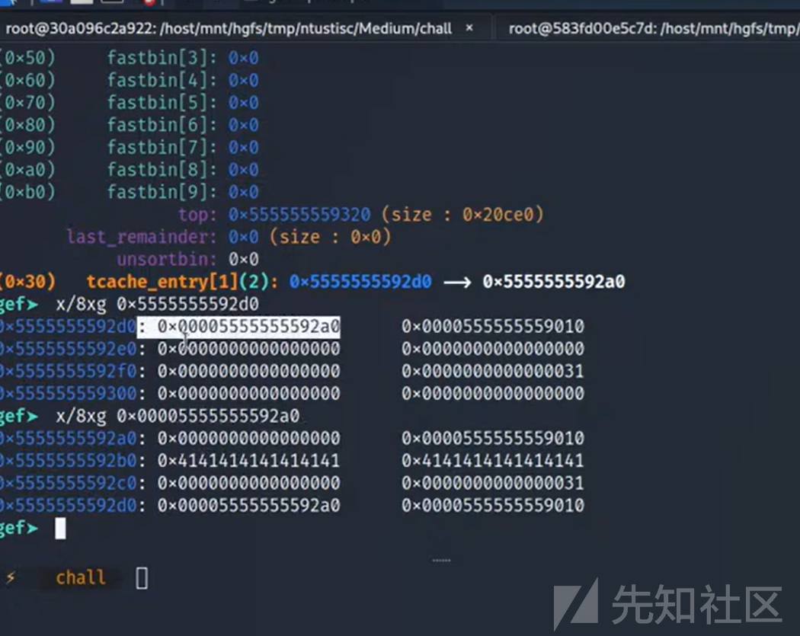](https://xzfile.aliyuncs.com/media/upload/picture/20240305154618-73e22540-dac4-1.png)

每种 chunk 的结构大同小异 chunk 结构分为 header 与 data 主要的差异存在于 header

结构如下

[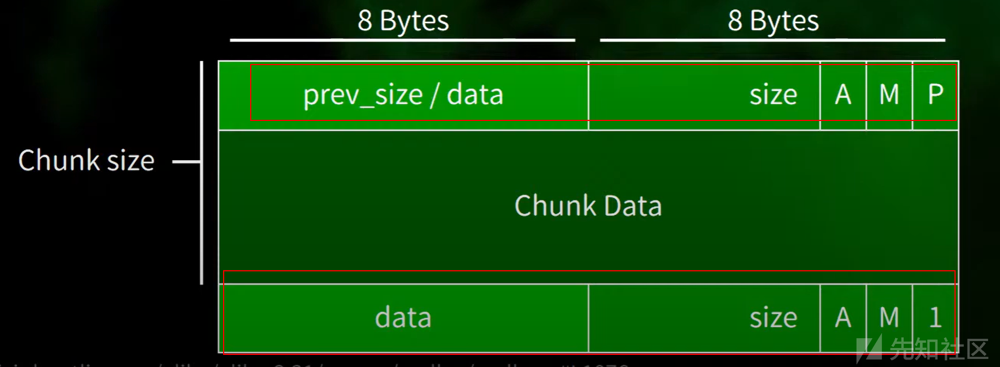](https://xzfile.aliyuncs.com/media/upload/picture/20240305154629-7a11f198-dac4-1.png)

**pre size** 用来储存前一个 chunk 的大小信息，同时不会存在两个相邻的空闲 chunk

**size** 记录了当前 chunk 的大小，chunk 的大小都是 8 字节对齐，所以 size 的低 3 位都是 0，不用来表示地址。为了充分利用内存空间，这三位被当作了标志位 A M P

A 记录当前 chunk 是否属于主线程 1 不属于 0 属于

M 记录是否当前 chunk 由 mmap 分配 1 是 0 否

P 记录前一个 chunk 是否被分配 1 是 0 否

1 表示上图 chunk 正在被分配

p 表示上一个 chunk

[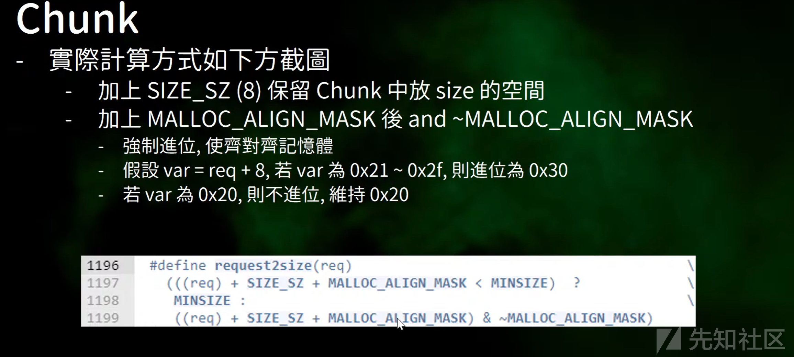](https://xzfile.aliyuncs.com/media/upload/picture/20240305154650-86ae6882-dac4-1.png)

[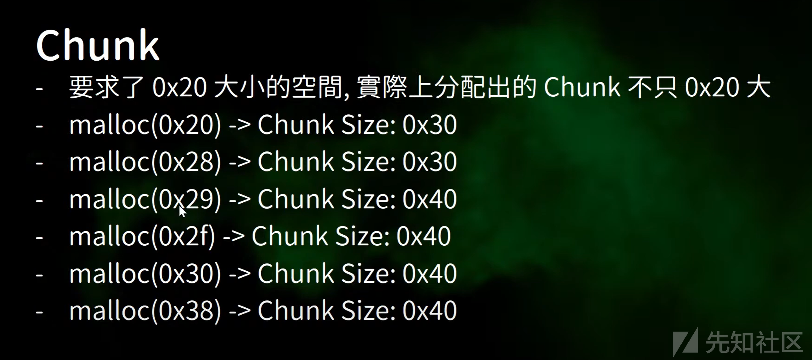](https://xzfile.aliyuncs.com/media/upload/picture/20240305154736-a2397452-dac4-1.png)

fd 指向下一块 free chunk

bk 指向上一块 free chunk

[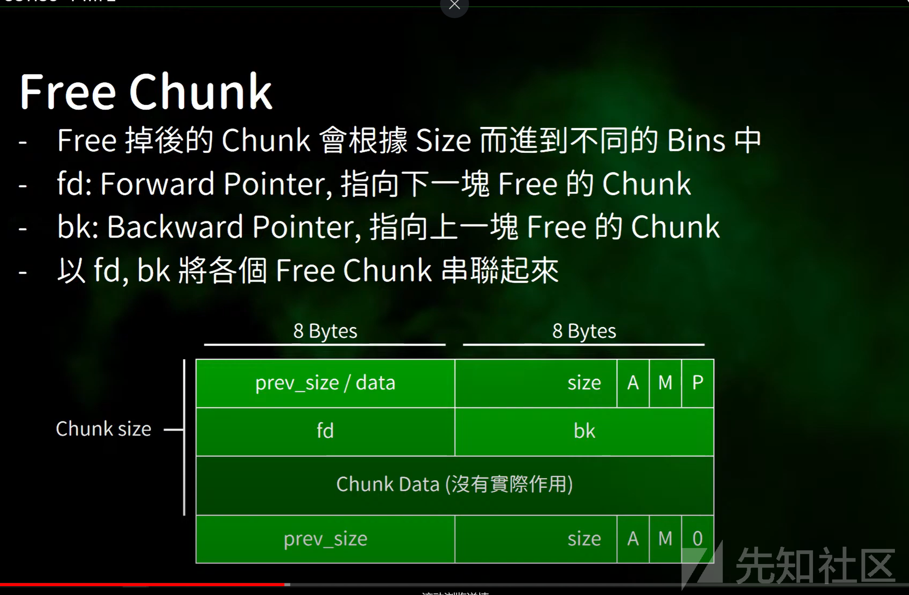](https://xzfile.aliyuncs.com/media/upload/picture/20240305154820-bc2840b4-dac4-1.png)

TOP CHUNK

存在于 heap 的头部 代表剩余空间

在他的下方并没有任何东西

[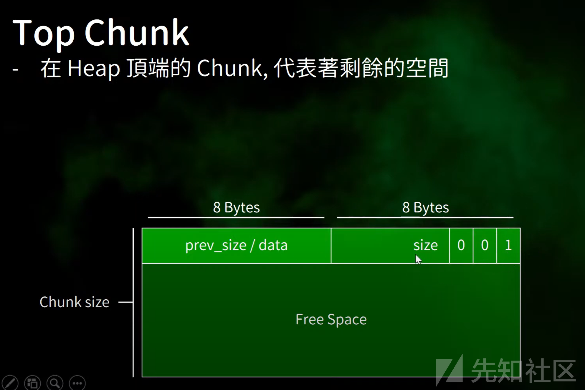](https://xzfile.aliyuncs.com/media/upload/picture/20240305154843-ca26dae0-dac4-1.png)

## 堆溢出攻击

堆溢出与栈溢出类似（堆溢出是一种特殊的缓冲区溢出。同时栈溢出与 bss 溢出也属于）

在向堆块 chunk 写入数据时超过了堆块自身的限度，并覆盖到**物理相邻的高地址**的下一个堆块。

因此发生堆溢出的主要前提是

-   向程序内写入数据
-   写入的数据大小未 能得到控制导致溢出

但是在进行堆溢出是并没有像栈溢出那样的返回地址可以控制，因此我们怎么来进行堆溢出攻击获取 flag 呢

通过堆溢出我们可以覆盖 chunk 的内容

chunk

-   pre size
-   size
-   data

因此利用某些堆机制我们可以实现任意地址的写入以及修改堆快内容控制程序执行流

如下程序

```plain
#include <stdio.h>

int main(void) 
{
  char *chunk;
  chunk=malloc(24);
  puts("Get input:");
  gets(chunk);
  return 0;
}
```

可以看到申请了 24 大小的 chunk

```plain
0x602000: 0x0000000000000000  0x0000000000000021 <===chunk
0x602010: 0x0000000000000000  0x0000000000000000
0x602020: 0x0000000000000000  0x0000000000020fe1 <===top chunk
0x602030: 0x0000000000000000  0x0000000000000000 
0x602040: 0x0000000000000000  0x0000000000000000
```

那我们究竟可以溢出多少字节才能达到目的呢

首先

pre size 与 size 这个长度一般是字长的 2 倍，比如 32 位系统是 8 个字节，64 位系统是 16 个字节。

因此

chunk\_head.size = 用户区域大小 + 2 \* 字长

对于写入是从 data 块开始的

下面是向 chunk 中写入 0x100 字节的 A 所呈现的 heap 结构

```plain
0x602000:   0x0000000000000000  0x0000000000000021 <===chunk
0x602010:   0x4141414141414141  0x4141414141414141
0x602020:   0x4141414141414141  0x4141414141414141 <===top chunk(已被溢出)
0x602030:   0x4141414141414141  0x4141414141414141
0x602040:   0x4141414141414141  0x4141414141414141
```

因此我们可以通过上述方式进行攻击

但有以下几点需要注意

一般情况下我们是通过 malloc 分配堆内存的，但在某些情况下是通过 relloc 实现的

```plain
#include <stdio.h>

int main(void) 
{
  char *chunk,*chunk1;
  chunk=malloc(16);
  chunk1=realloc(chunk,32);
  return 0;
}
```

realloc

当新分配的 chunk 小于 pre chunk 时

如果新 size 与原来的 size 之间不足以插入另一个最小 chunk 则保持不变

如果差距过大则分割这个 chunk 并对另一部分 chunk 进行 free

当新分配的 chunk 大于 pre chunk 时

如果 chunk 与 top chunk 相邻，直接扩展这个 chunk 到新 size 大小

如果 chunk 与 top chunk 不相邻，相当于 free 这一个小 chunk 并且 malloc 一个大的 chunk

危险函数

-   输入
    -   gets，直接读取一行，忽略 `'\x00'`
    -   scanf
    -   vscanf
-   输出
    -   sprintf
-   字符串
    -   strcpy，字符串复制，遇到 `'\x00'` 停止
    -   strcat，字符串拼接，遇到 `'\x00'` 停止
    -   bcopy
