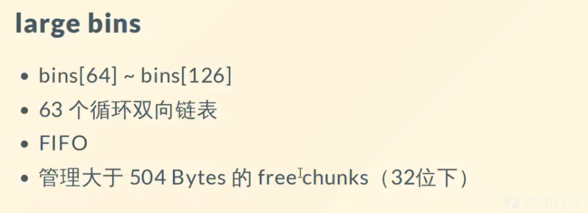
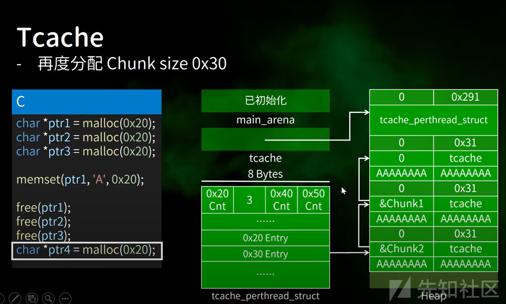

# pwn堆的结构及堆溢出理解 - 先知社区

pwn堆的结构及堆溢出理解

- - -

# 堆

**堆其实就是程序虚拟地址空间的一块连续的线性区域，它由低地址向高地址方向增长（栈由高地址向低地址增长）。我们一般称管理堆的那部分程序为堆管理器**。 **堆是分配给程序的内存空间 与栈不同，堆内存可以动态分配。这意味着程序可以在需要的时候从堆段中`请求`和`释放`内存。此外，此内存是全局的，即可以从程序中的任何地方访问和修改它，并且不会局限于分配它的函数。这是通过使用`指针`来引用动态分配的内存来完成的，与使用局部变量(在栈上)相比，这反过来会导致性能的小幅下降。**

请求与释放内存主要是通malooc与free函数实现

堆在程序中的位如图所示

[](https://xzfile.aliyuncs.com/media/upload/picture/20240305153342-b11f7af4-dac2-1.png)

### 堆和栈的对比如下表所示

|     | 堆   | 栈   |
| --- | --- | --- |
| 申请  | 程序在运行过程中动态分配，由程序控制申请 | 程序运行前分配 |
| 释放  | 不能自动释放，由程序控制释放 | 自动释放 |
| 特点  | 地址由低 => 高 | 地址由高=>低 |
| 内存分配 | 非线性，无序 | 线性，有序----------- |

如果频繁的呼叫syscall则程序会频繁的在kernal与user之间切换，会造成效率的降低

因此library会提前申请一大块区域并进行各种操作  
[](https://xzfile.aliyuncs.com/media/upload/picture/20240305153407-bfcad88c-dac2-1.png)  
本篇文章主要是写关于glibc ptmalloc

pwndbg里面的parseheap会出现heap构造

[](https://xzfile.aliyuncs.com/media/upload/picture/20240305153433-cf5de35c-dac2-1.png)  
经过free  
[](https://xzfile.aliyuncs.com/media/upload/picture/20240305153510-e5956532-dac2-1.png)

ptmalloc 请求0x20但是因为存在pre size与size会占用0x10的空间

所以是0x30

同时如果free掉这段chunk则bin（堆管理器）会连接free chunk  
[](https://xzfile.aliyuncs.com/media/upload/picture/20240305153533-f303abfc-dac2-1.png)

在ptmalloc管理下

[](https://xzfile.aliyuncs.com/media/upload/picture/20240305153617-0d772022-dac3-1.png)

chunk分为

allocated chunk已经分配的chunk freechunk 已经释放的chunk topchunk剩余的chunk

chunk的结构如图所示

[](https://xzfile.aliyuncs.com/media/upload/picture/20240305153809-505bd70c-dac3-1.png)

**pre size** 用来储存前一个chunk的大小信息，同时不会存在两个相邻的空闲chunk

**size** 记录了当前chunk的大小，chunk的大小都是8字节对齐，所以size的低3位都是0，不用来表示地址。为了充分利用内存空间，这三位被当作了标志位A M P

A 记录当前chunk是否属于主线程 1不属于 0属于

M 记录是否当前chunk由mmap分配 1是 0否

P 记录前一个chunk是否被分配 1是 0否

### chunk合并

当size后三位P显示前一个chunk是 0未被分配，鉴于节省空间考虑将会合并两个chunk

这也就是为什么没有两个相邻的空闲chunk

## bin 堆管理器

### fast bin

[](https://xzfile.aliyuncs.com/media/upload/picture/20240305153823-58d85e5a-dac3-1.png)

[](https://xzfile.aliyuncs.com/media/upload/picture/20240305153911-75452fe6-dac3-1.png)

小于0x80的free bin 都会存在于fast bin

fast bin共有七个0x20-0x80

###### free这类chunk时不会清除下一块chunk的P的值 即下一块chunk依旧会P=1

同时在fast bin中会使用到fd即指向下一个free chunk而bk是不会被用到的

[](https://xzfile.aliyuncs.com/media/upload/picture/20240305153937-84e56c68-dac3-1.png)

如上图 连接起来所有的free chunk fd指向chunk header

[](https://xzfile.aliyuncs.com/media/upload/picture/20240305153958-914640e0-dac3-1.png)

[](https://xzfile.aliyuncs.com/media/upload/picture/20240305154011-98d25970-dac3-1.png)

### small bin

[](https://xzfile.aliyuncs.com/media/upload/picture/20240305154022-9f3b67ca-dac3-1.png)

-   Small Bins用于存储较小尺寸的空闲chunk，这些chunk按照特定的大小分类存放在多个链表中。每个链表中的chunk大小相近，这样可以快速地找到与请求分配内存大小匹配或稍大的chunk。

small bin与fast bin相比较fast bin中的chunk通常更小以便更快速的完成任务

malloc首先检查Fast Bins来满足小内存分配请求，若Fast Bins中无合适chunk，则转而去Small Bins或其他bins中查找或分配新的内存空间。

### large bin

[](https://xzfile.aliyuncs.com/media/upload/picture/20240305154032-a5585226-dac3-1.png)

large bin是相对于small bin来说的

Large Bins用于存储那些超出Small Bins管理范围的较大尺寸的空闲chunk。

储存较大的chunk即大于504byte的free chunk

当程序分配内存时会首先向large bin检查

如果Large Bins也无法满足请求，malloc可能会尝试从Top Chunk（堆顶chunk）分割内存，或者直接向操作系统申请更多的内存空间。

### unsorted bin

[](https://xzfile.aliyuncs.com/media/upload/picture/20240305154043-ac4c38ae-dac3-1.png)

又被成为垃圾桶回收还未来的及进入分类的chunk

-   Unsorted Bin不按照chunk大小进行排序，因此被称为“未排序”。
-   刚释放的chunk会直接插入到unsorted bin的链表头部。
-   在新的内存分配请求发生时，malloc首先检查unsorted bin是否有合适的chunk可用，因为这里可能存放了最近刚刚释放的大块内存。
-   一段时间后（例如，在下一次malloc或realloc操作），unsorted bin中的chunk会被正确地转移到相应的small bin、large bin或其他适当的区域，以确保内存管理的有序性和效率。

使用unsorted bin可以快速响应和利用最近释放的大块内存，同时避免了立即进行复杂的数据结构调整。

### tcache

为了更高效率产生的  
[](https://xzfile.aliyuncs.com/media/upload/picture/20240305154140-ce1f6e06-dac3-1.png)

tcache在libc 2.6出现

在libc2.23时free chunk存入fast bin  
[](https://xzfile.aliyuncs.com/media/upload/picture/20240305154338-141c08b0-dac4-1.png)

fd指向上一个chunk的fd bk存入key用作安全检查

而在fast bin中fd指向上一个chunk的chunk头 bk内容是不变的

[](https://xzfile.aliyuncs.com/media/upload/picture/20240305154359-20c1408a-dac4-1.png)

cnt表示存在几个entry

[](https://xzfile.aliyuncs.com/media/upload/picture/20240305154441-3a329f82-dac4-1.png)  
[](https://xzfile.aliyuncs.com/media/upload/picture/20240305154546-60ec366a-dac4-1.png)

heap info

[](https://xzfile.aliyuncs.com/media/upload/picture/20240305154609-6e3560b2-dac4-1.png)

[](https://xzfile.aliyuncs.com/media/upload/picture/20240305154618-73e22540-dac4-1.png)

每种chunk的结构大同小异chunk结构分为header与data主要的差异存在于header

结构如下

[](https://xzfile.aliyuncs.com/media/upload/picture/20240305154629-7a11f198-dac4-1.png)

**pre size** 用来储存前一个chunk的大小信息，同时不会存在两个相邻的空闲chunk

**size** 记录了当前chunk的大小，chunk的大小都是8字节对齐，所以size的低3位都是0，不用来表示地址。为了充分利用内存空间，这三位被当作了标志位A M P

A 记录当前chunk是否属于主线程 1不属于 0属于

M 记录是否当前chunk由mmap分配 1是 0否

P 记录前一个chunk是否被分配 1是 0否

1表示上图chunk正在被分配

p表示上一个chunk

[](https://xzfile.aliyuncs.com/media/upload/picture/20240305154650-86ae6882-dac4-1.png)

[](https://xzfile.aliyuncs.com/media/upload/picture/20240305154736-a2397452-dac4-1.png)

fd指向下一块 free chunk

bk指向上一块free chunk

[](https://xzfile.aliyuncs.com/media/upload/picture/20240305154820-bc2840b4-dac4-1.png)

TOP CHUNK

存在于heap的头部 代表剩余空间

在他的下方并没有任何东西

[](https://xzfile.aliyuncs.com/media/upload/picture/20240305154843-ca26dae0-dac4-1.png)

## 堆溢出攻击

堆溢出与栈溢出类似（堆溢出是一种特殊的缓冲区溢出。同时栈溢出与bss溢出也属于）

在向堆块chunk写入数据时超过了堆块自身的限度，并覆盖到**物理相邻的高地址**的下一个堆块。

因此发生堆溢出的主要前提是

-   向程序内写入数据
-   写入的数据大小未 能得到控制导致溢出

但是在进行堆溢出是并没有像栈溢出那样的返回地址可以控制，因此我们怎么来进行堆溢出攻击获取flag呢

通过堆溢出我们可以覆盖chunk的内容

chunk

-   pre size
-   size
-   data

因此利用某些堆机制我们可以实现任意地址的写入以及修改堆快内容控制程序执行流

如下程序

```plain
#include <stdio.h>

int main(void) 
{
  char *chunk;
  chunk=malloc(24);
  puts("Get input:");
  gets(chunk);
  return 0;
}
```

可以看到申请了24大小的chunk

```plain
0x602000: 0x0000000000000000  0x0000000000000021 <===chunk
0x602010: 0x0000000000000000  0x0000000000000000
0x602020: 0x0000000000000000  0x0000000000020fe1 <===top chunk
0x602030: 0x0000000000000000  0x0000000000000000 
0x602040: 0x0000000000000000  0x0000000000000000
```

那我们究竟可以溢出多少字节才能达到目的呢

首先

pre size与size 这个长度一般是字长的 2 倍，比如 32 位系统是 8 个字节，64 位系统是 16 个字节。

因此

chunk\_head.size = 用户区域大小 + 2 \* 字长

对于写入是从data块开始的

下面是向chunk中写入0x100字节的A所呈现的heap结构

```plain
0x602000:   0x0000000000000000  0x0000000000000021 <===chunk
0x602010:   0x4141414141414141  0x4141414141414141
0x602020:   0x4141414141414141  0x4141414141414141 <===top chunk(已被溢出)
0x602030:   0x4141414141414141  0x4141414141414141
0x602040:   0x4141414141414141  0x4141414141414141
```

因此我们可以通过上述方式进行攻击

但有以下几点需要注意

一般情况下我们是通过malloc分配堆内存的，但在某些情况下是通过relloc实现的

```plain
#include <stdio.h>

int main(void) 
{
  char *chunk,*chunk1;
  chunk=malloc(16);
  chunk1=realloc(chunk,32);
  return 0;
}
```

realloc

当新分配的chunk小于pre chunk时

如果新size与原来的size之间不足以插入另一个最小chunk则保持不变

如果差距过大则分割这个chunk 并对另一部分chunk进行free

当新分配的chunk大于pre chunk时

如果 chunk 与 top chunk 相邻，直接扩展这个 chunk 到新 size 大小

如果 chunk 与 top chunk 不相邻，相当于free这一个小chunk并且malloc一个大的chunk

危险函数

-   输入
    -   gets，直接读取一行，忽略 `'\x00'`
    -   scanf
    -   vscanf
-   输出
    -   sprintf
-   字符串
    -   strcpy，字符串复制，遇到 `'\x00'` 停止
    -   strcat，字符串拼接，遇到 `'\x00'` 停止
    -   bcopy
