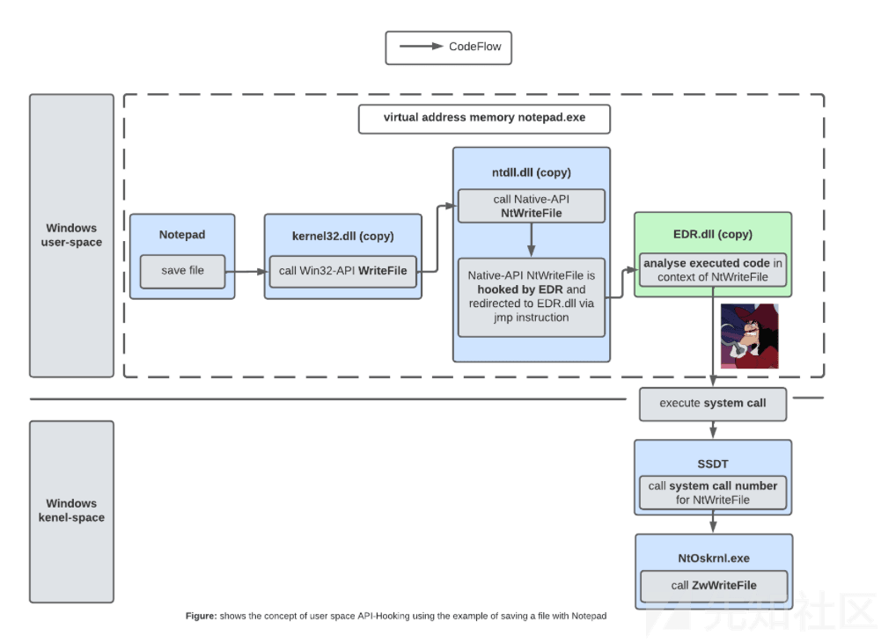
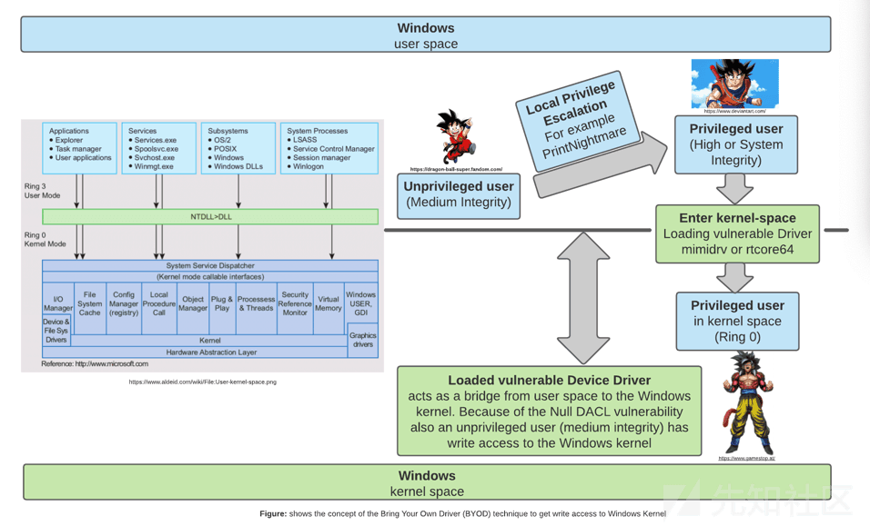
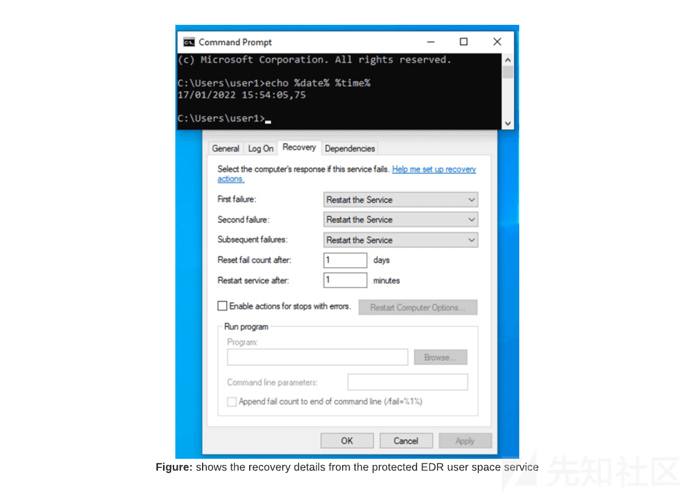
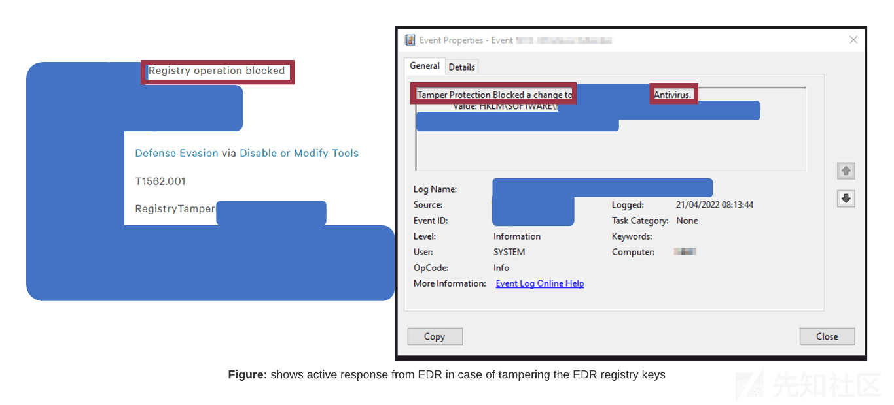
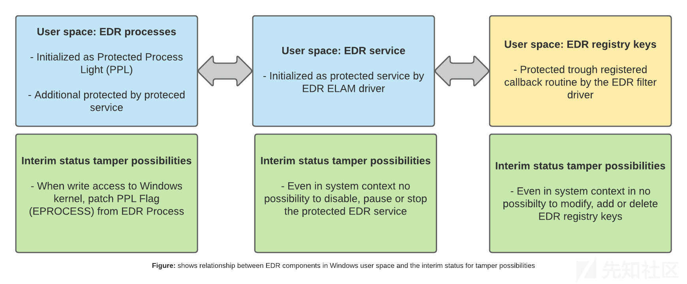
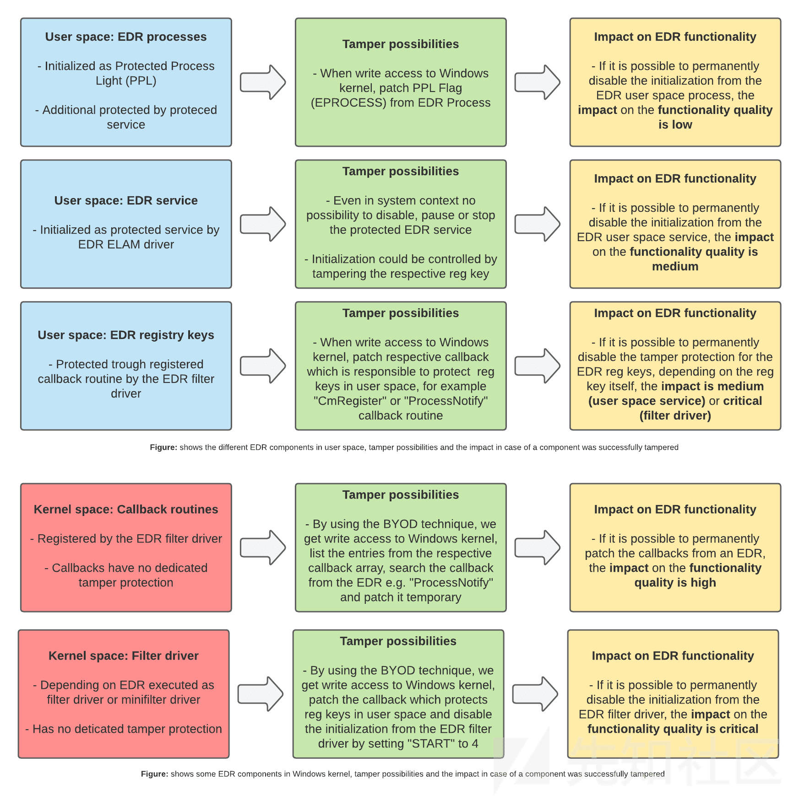

一个关于篡改 EDR 的故事（翻译，redops.at）

- - -

# 一个关于篡改 EDR 的故事（翻译，redops.at）

原文链接：

```plain
https://redops.at/en/blog/a-story-about-tampering-edrs
```

​ 仅凭抗病毒已不足以使组织预防、理解和应对更复杂的攻击。因此，越来越多的组织正在转向防病毒（AV）/端点保护（EPP）和端点检测与响应（EDR）系统的组合。因此，近年来，包括红队成员在内的攻击者更难在未被发现的情况下或尽可能安静地在受损的端点上进行操作。攻击者不断寻找绕过 EDR 的新方法，例如直接或间接的系统调用，EDR 供应商也在不断改进。简而言之，这是一场持续不断的猫捉老鼠的游戏。

​ 然而，在本文中，我们将不关注 EDR 绕过，而是关注 EDR 操作。作为红队队员，我们的目标是寻找通过控制特定 EDR 组件来暂时甚至永久覆盖 EDR 的主要预防（AV/EPP）、检测和响应（EDR）功能的方法。

​ 自从 Windows XP x64 SP3 引入内核补丁保护（KPP）（也称为补丁保护）以来，EDR 被正式禁止进入 Windows 内核，并在用户区进行所有挂钩操作。然而，微软已经赋予 EDR 在 Windows 内核中以回调例程的形式注册各种回调对象的能力。这允许他们在用户区执行各种任务，如 API 挂钩、遥测收集等。

​ 大多数 EDR 都有一个用户空间和几个内核空间组件，如过滤器驱动程序。通过注册表项操作或一般操作禁用筛选器驱动程序可能会对预防、检测和响应的质量产生严重后果。测试表明，即使 EDR 的用户空间组件是活动的，但滤波器驱动程序的初始化被永久禁用，EDR 的重要功能也将失败。例如，EDR 将不再能够以回调例程的形式注册回调对象，实现用户空间 API 挂钩，在端点捕获遥测，以及实现 web 控制台功能，如主机隔离、实时响应外壳或传感器恢复。

- - -

## 一。介绍

​ 近年来，攻击的复杂性不断增加，恶意黑客正在寻找新的方法来规避端点安全产品（如防病毒（AV）或端点保护（EPP））提供的保护。我认为我们在信息安全界都同意，端点的预防在预防恶意活动方面非常重要，但同时，它在预防所有恶意活动方面永远不可能 100% 有效。然而，这一认识不应被负面解读，因为它有助于我们理解，仅仅试图阻止恶意活动已经不够了。为了使组织和防御者能够理解复杂的攻击，验证可能的攻击假设，通常在端点获得更多的可见性，并总体上更好地了解自己的公司网络或 IT 基础设施，除了端点保护之外，还需要实施端点检测和响应（EDR）系统。

​ 纯粹的 EDR 系统不是为了主动防止端点上的恶意活动而设计的，而是为了使用机器学习、深度学习、基于行为的检测等来检测端点上更复杂的恶意活动或非合法行为（检测），并将可疑检测（响应）通知系统管理员或者那些安全人员。在我看来，近年来，EDR 使红队队员更难在端点上不被发现或尽可能不显眼地操作。其原因在于 EDR 所使用的机制使其在端点具有很高的可见性。由于 EDR 使用的机制通常与 Rootkit 使用的机制非常相似，wicked tongues 声称 EDR 这个名字并不代表端点检测和响应，而是代表端点防御 Rootkit。撇开玩笑不谈，大多数 EDR 通常使用用户空间和内核空间组件的组合，或者内核组件通常构成实现用户空间的基础。

​ 只有在指定的回调数组中注册“进程通知”例程，EDR 才能实现基于 DLL 注入的用户空间 API 挂钩。简而言之，这意味着在特定 Windows API（WIN32 API）（例如 VirtualAlloc）的上下文中，或在用户空间中相应的本地 API NtAllocateVirtualMemory 的上下文中（无论用户的完整性级别如何），在端点上执行的代码，在转换到内核空间之前，通过 API 挂钩（迂回/JMP 指令）重定向到 EDR 的单独挂钩 DLL，并扫描恶意代码。只有当 EDR 的挂钩 DLL 的分析没有检测到任何恶意代码或行为时，才能通过系统调用转换到 Windows 内核（见下图）。

[](https://xzfile.aliyuncs.com/media/upload/picture/20240125140541-c49c568c-bb47-1.png)

​ 近年来，这已经成为一场猫捉老鼠的游戏，攻击者找到了绕过用户空间 API 挂钩的新方法，EDR 供应商实现了新的检测机制。直接系统调用就是一个很好的例子。攻击者或红队成员发现，EDR 通常将其 API 挂钩放在用户空间中的 kernel32.dll 或 NTDL.dll 中。这意味着，作为用户空间代码执行的一部分，我们可以使用汇编指令将系统调用直接集成到我们的 POC 中，而不是调用 WIN32 API（kernel32.dll），然后调用本地 API（ntdll.dll），再调用系统调用。通过这种方式，我们绕过了 EDR 在 kernel32.dll 和 ntdll.dll 中的 API 挂钩，因此 EDR 无法深入了解正在执行的代码。当然，EDR 供应商并没有长期忽视这一点，并且实现了堆栈跟踪等新机制，以允许 EDR 确定系统调用是直接进行的（直接系统调用）还是通过合法的 Windows API 和 Native API 进行的。

​ 我喜欢学习 Windows EDR，了解它们是如何工作的，并找到绕过它们的新方法。然而，在本文中，我们将重点讨论 EDR 篡改，而不是 EDR 绕过。也就是说，我们不想试图绕过 EDR 的检测机制，而是想首先详细了解 Windows 上常用的 EDR 的哪些机制或组件，然后通过操纵来寻找禁用 EDR 关键组件的方法。最终，我们希望能够暂时甚至永久禁用 EDR 的关键机制，例如用户空间 API 挂钩。然而，由于大多数组织都依赖于预防（AV/EPP）、检测和反应（EDR）的组合，我们将目标扩大了一点。在本文的最后，我们希望能够通过受控操作覆盖 EPP/EDR 组合的关键组件。换言之：我们希望在预防、检测和响应方面暂时甚至永久地覆盖 EPP/EDR 组合的关键组成部分。作为红队队员，我们希望防止我们的活动被阻止（AV/EPP），我们的活动受到主动检测和报告（主动响应），以及 EDR 以遥测的形式记录我们的活动。同样，我们希望确保企业维权者（蓝队）不能对我们使用 EDR 的网络控制台功能，无论是暂时的还是永久的（直到受控重置）。例如，我们希望防止他们使用主机隔离来隔离我们的受损主机，使用实时响应外壳来访问我们的受损的主机，或者使用网络控制台中的传感器恢复功能来重新启动被篡改的 EDR 传感器。

​ 对本文的其余部分很重要。当我谈到 EDR 时，我指的是企业中经常出现的 EPP/EDR 组合。此外，本文不是关于零日漏洞利用，而是关于更好地了解 Windows 上的 EDR，以及我们如何通过操作暂时或永久禁用它们的重要部分。同样，这纯粹是我个人的研究和经验，我不要求准确性或完整性。

## 二。可能遇到的场景

​ 即使攻击者或红队设法升级到在受损端点上拥有特权的用户，大多数 EDR 仍然非常令人讨厌（从红队的角度来看）。一方面，供应商正在不断提高预防、检测和应对的质量。另一方面，如果防守队员已经做好了功课，并将 EDR 的推出标记化（当然，假设 EDR 支持这一功能），那么在特权用户的情况下卸载 EDR 并不容易。换句话说，卸载 EDR 需要知道卸载令牌。然而，由于我们不想依赖卸载令牌，我们正在寻找通过受控操作暂时甚至永久禁用 EDR 的重要功能或组件的替代方案。

## 三。重要（EDR）组成部分和机制

​ 在我们研究 EDR 系统如何被篡改之前，我们将研究 Windows 上 EDR 的机制和组件。我们将研究用户空间和 Windows 内核中的关键组件。将更详细地检查 Windows 用户空间中的以下组件和机制：

-   系统会话中的 EDR 进程（受保护的进程）
-   EDR 用户空间服务（受保护服务）
-   EDR 注册表项/子项/值

​ 在 Windows 内核中，将更详细地检查以下组件和机制：

-   EDR 回调对象/回调例程
-   EDR 筛选器驱动程序/微筛选器驱动程序

​ 我设计了本文的其余部分，以逐步了解 Windows 用户空间和 Windows 内核中的上述组件。我们将从用户空间开始，研究组件或 EDR 机制是如何工作的，并考虑通过操作禁用组件或机制的可能性。然后，我们将研究到组件被禁用对 EDR 功能的影响，以及组件被停用对 EDR 的预防、检测和响应质量的影响。禁用有问题的 EDR 组件或机制是否会给我们带来真正的优势，或者 EDR 的其他组件和机制是否会继续确保保持预防（AV/EPP）、检测和响应（EDR）的关键功能，这些都是我们需要了解的问题点。

## 四。用户空间：EDR 进程

​ 作为第一步，让我们更深入地了解 EDR 如何在用户空间的系统会话中处理其进程，它们可以被篡改的方式，以及篡改对 EDR 功能的影响。我所知道的顶级 EDR 通过将其启动为受保护的守护进程（PPL-PS\_PROTECTEED\_ANTIMALWARE\_Light（0x31））来保护自己不受篡改。因此，我们无法在特权用户上下文（高完整性）或系统上下文（系统完整性）中访问或终止 PPL 保护的 EDR 进程的地址空间。只有当 PPL 级别与 EDR 进程相同或更高的 PPL 级别也被标记为 PPL 的进程可用或已经被成功破坏时，才有可能有针对性地终止 PPL 进程。其他选项是使用受信任的安装程序，或者使用易受攻击的内核驱动程序（Bring Your Own driver，简称 BYOD），即使是作为无特权用户（中等完整性），也可以为我们提供对 Windows 内核的写访问权限，例如使用 NULL DACL 访问权限。

​ 如果你想了解更多关于 PPL 机制本身的信息，我建议你仔细阅读 Windows Internals 第 7 版第 1 部分，并阅读以下博客文章**Do you Really know about LSA Protection（RunAsPPL）？**

​ 在我们的案例中，我们正在仔细研究“自带驱动程序”技术，以及如何在用户空间中操作 EDR 流程的情况下使用它。在过去几年中，我们看到恶意攻击者或冒充高级持久威胁（APT）的攻击者组利用易受攻击的内核驱动程序禁用 EDR 的组件。这项技术已被以下勒索软件集团使用，其中包括：Trickbot、Ryuk、DoublePaymer、Dharma 和 Conti。但是，这项技术是如何详细工作的？为什么它在操作 EDR 过程的背景下会有所帮助？

​ 如前所述，即使作为特权用户（高完整性）或在系统上下文（系统完整性）中，也不可能访问 PPL 保护进程的地址空间。PPL 进程只能从 Windows 内核中终止。由于 Windows 上的内核驱动程序在逻辑上位于内核中，因此易受攻击的驱动程序可用于通过 BYOD 攻击获得对 Windows 内核的写访问权限。例如，MSI（rtcore64.sys/Afterburner）的签名驱动程序具有 NULL DACL 访问漏洞，可以用于执行此操作。对内核的写访问有助于我们，因为与用户空间中的代码不同，Windows 内核中的进程或执行的代码没有进程隔离。换句话说，BYOD 攻击理论上允许访问整个 Windows 内核（见图）。

​ 在我们的案例中，我们可以利用这一点，通过 BYOD 攻击获得对 Windows 内核的写访问权限，定位 EDR PPL 进程阵列（EPROCESS STRUCTURE）并临时修补 PPL 标志。因此，系统会话中受影响的 EDR 进程不再受 PPL 保护，并且可能在特权用户或系统上下文中被杀死。

​ 有几种工具可用于通过易受攻击的设备驱动程序访问内核并终止受 PPL 保护的进程。一方面，有一些工具，如 Cheeky Blinder、PPL Killer 或 Mimikatz，使用第三方设备驱动程序或他们自己的驱动程序，但这些驱动程序尚未由微软签署。另一方面，还有 Backtab，它使用来自 Sysinternals Process Explorer 工具的 Microsoft 签名驱动程序。就我个人而言，我更喜欢微软签名驱动程序的方法，因为它看起来更合法、更不引人注目。最后，使用哪种工具并不重要。在使用不同 EDR 的几次测试中，我发现有时可以在系统会话中终止 EDR 的用户空间进程，但这通常只需要几秒钟，在最坏的情况下最多需要 1-2 分钟，并且之前终止的进程将被重新初始化为 PPL 进程。即使 EDR 进程被终止了几次，每次都会重新初始化被终止的进程。同样有趣的是观察到即使在从 EDR 过程结束到重新初始化所测量的时间期间，检测和响应能力仍然完全发挥作用。一方面，这些观察结果提出了一个问题，即为什么终止的 PPL 过程总是被重新初始化，或者 EDR 的哪个组件对此负责。另一方面，为什么对 EDR 功能的总体影响如此之小，即使在 EDR 过程终止期间也是如此？

[](https://xzfile.aliyuncs.com/media/upload/picture/20240125140654-f0a24f20-bb47-1.png)

### 结论

​ 如果你真的想彻底消除 EDR，那么仅仅在系统会话中杀死 EDR 进程（PPL）是远远不够的。我认为对 EDR 功能的影响很低。

## 五。用户空间：受保护的服务

​ 在本节中，我们将更深入地了解 EDR 的用户空间服务。下图显示了用户空间服务负责重新初始化 EDR 的先前调度的 PPL 进程。从这个观察中我们可以看到，用户空间服务和 PPL 过程一起形成了 EDR 的用户空间组件。

[](https://xzfile.aliyuncs.com/media/upload/picture/20240125140720-0005aa2a-bb48-1.png)

​ 尝试在特权用户（高完整性）或系统上下文（系统完整性）中终止 EDR 用户空间服务似乎是合乎逻辑的。这将导致 EDR 的用户空间组件不再被初始化。换言之，如果我们可以终止 EDR 的用户空间服务，那么我们就永久地去除了 EDR 的该用户空间组件。然而，这并不简单，因为 EDR 通常将其用户空间服务初始化为受保护的服务。作为受保护服务的初始化是由内核中的 EDR 组件完成的，该组件称为 Early Launch Antimalware 驱动程序，简称 ELAM 驱动程序。因此，受 EDR 保护的服务也称为 ELAM 服务。与 EDR PPL 进程一样，受保护的服务使用的内核组件不允许我们暂停、停止或禁用受 EDR 保护的服务，即使是作为特权用户（高完整性）或在 Windows 用户空间中的系统上下文（系统完整性）。与 PPL 保护的进程不同，我目前不知道有任何方法可以永久或暂时停止 EDR 的受保护服务。

### 结论

​ 但是，即使我们现在不能直接影响受保护的服务，我们也获得了重要的见解。因为如果我们能找到一种方法来禁用 EDR 的受保护用户空间服务的初始化，我们就可以永久禁用 EDR 用户空间组件（由受保护服务和 PPL 进程组成）。如果我们能够禁用 EDR 的受保护服务，我会将其影响评为中等。

## 六。用户空间：注册表项

​ 在前两节中，我们了解了一些 PPL 流程和受保护服务。在上一节学习的基础上，我们正在寻找一种永久禁用受保护服务初始化的方法。在本节中，我们将详细了解 EDR 的用户空间组件的注册表项。我们感兴趣的注册表项或子项和值通常可以在注册表编辑器的“Computer\\HKEY\_LOCAL\_MACHINE\\SYSTEM\\CurrentControlSet\\Services”下找到。一旦找到注册表项或子项，就会有几个有趣的条目，具体取决于 EDR。

​ 在这种情况下，条目“REG\_DWORD:LaunchProtected”一方面很有趣，另一方面条目“REG\_DWORD:Start”也很有趣。经过一点研究，我发现 LaunchProtected 条目负责将 EDR 的链接用户空间进程初始化为 PPL 进程。然而，它对受保护服务本身的初始化没有影响，因为这仍然是由 Windows 内核中的 ELAM 驱动程序完成的。如果您想影响用户空间 EDR 进程的初始化，请尝试更改 Launch Protected 条目的值，以便将来在不使用 PPL 标志的情况下初始化 EDR 进程。这样做的优点是，我们不再需要 BYOD 技术来终止 PPL 保护的 EDR 进程。然而，我们仍然会遇到这样的问题，即 EDR 进程（即使没有 PPL 标志）在成功终止后仍将继续由受保护的服务重新初始化。

​ 更改 EDR 用户空间注册表项的“启动”条目更有意义，这样当受损客户端重新启动时，受保护的服务就不会进一步初始化，因此整个用户空间组件也不会初始化。然而，在两个用户空间注册表项的情况下，问题是 EDR 使用篡改保护来保护其自己的注册表项不受篡改尝试的影响。这意味着，即使我们设法升级到用户空间中的系统权限，我们也无法修改或操作受 EDR 保护的注册表项或条目的值。

### 结论

​ 注意：对于某些 EDR，操作注册表项的尝试不会被忽视，即，试图更改条目的值可能会在产品的网络控制台中触发主动响应。这将提醒企业防御者注意受损主机上可能存在的恶意活动，并且受损主机和用户很有可能通过 EDR 功能被隔离和锁定。如果我们能够操作用户空间组件的启动条目，使用户空间服务不再初始化，我会将其影响评为**中等**。

[](https://xzfile.aliyuncs.com/media/upload/picture/20240125140739-0b60f460-bb48-1.png)

## 七。更深的分析

​ 乍一看，迄今为止的结果听起来有些发人深省，因为我们还没有找到一种方法来暂时或永久禁用 EDR，从而摆脱预防、检测和应对领域的重要保护机制。然而，在第二步中，我们从最后三节中获得了一些有趣的见解。首先，我们现在知道 EDR 用户空间组件由 PPL 进程和受保护服务组成。然而，我们目前没有直接的方法来停止、暂停或禁用受保护的服务。然而，我们现在知道，我们可以通过用户空间组件注册表项中的“启动”条目直接影响 EDR 受保护服务的初始化。

​ 这意味着，如果我们将“启动”条目的值从“自动加载”（2）更改为“禁用”（4），受保护服务将不再初始化，因此 EDR 的受保护进程也将不再初始化。换句话说，EDR 用户空间组件将被永久禁用。然而，当前的问题是 EDR 使用篡改保护来保护其自己的注册表项不受篡改企图的影响。

​ 然而，如果我们能找到绕过或禁用注册表项篡改保护的方法，我们就可以永久禁用 EDR 用户空间组件，离我们的目标又近了一大步。

[](https://xzfile.aliyuncs.com/media/upload/picture/20240125140757-162d1554-bb48-1.png)

## 八。内核空间：回调例程

​ 在最后几节中，我们了解了一些 EDR 的用户空间组件。但是，根据 EDR 的不同，它们在 Windows 内核中也有一个组件。最初，在 Windows XP x64 SP3 发布之前，EDR 或当时的防病毒系统可以在 Windows 内核中执行挂钩机制，例如，以 SYSENTER 挂钩或系统服务调度表的形式，或简称 SSDT 挂钩。当 Microsoft 由于这些内核活动而遇到重复的稳定性问题（BSOD）时，Patch Guard 被引入到 Windows 内核中。这是一种机制，它以未知或不规则的间隔检查 Windows 内核中某些代码区域的操作，如挂钩，并在必要时通过死亡蓝屏（BSOD）关闭来防止 Windows 的进一步执行。有传言称，有 EDR 产品继续使用 Patch Guard Bypass 在 Windows 内核中实现挂钩，但我无法从我迄今为止的观察和经验中证实这一点。至少自从引入 Patch Guard 以来，官方不再允许或可能在 Windows 内核中实现钩子。因此，EDR 在很大程度上被禁止进入内核，而 API 挂钩则在 Windows 用户空间中实现。

​ 然而，微软认识到 EDR 仍然需要一种方法来使用 Windows 内核来实现预防、检测和响应。出于这个原因，微软引入了内核回调对象。该机制允许 EDR 产品通过筛选器驱动程序或微筛选器驱动程序以回调例程的形式注册回调对象。这允许 EDR 在 Windows 内核的回调数组中注册不同的回调例程，以在用户空间中执行不同的任务。

​ 例如，EDR 可以在回调数组中注册“进程通知”例程，这允许将各种预防、检测和响应任务映射到用户空间。一方面，注册实现了用户空间 DLL 注入或 API 挂钩机制。如引言中所述，API 挂钩通过迂回/JMP 指令将在特定或挂钩的 Windows API 或本机 API 的上下文中执行的代码重定向到 EDR 的单独“挂钩 DLL”，EDR 可以在其中检查执行的代码是否有恶意内容或活动。此外，EDR 可以使用注册的“进程通知”例程来捕获与进程相关的遥测。

​ 例如，当进程在用户空间中被终止或重新初始化时，会触发“进程通知”回调，并捕获生成的遥测数据。举个简单的例子，我们在受损主机上启动 cmd.exe，cmd.exe 的初始化由 EDR 或“进程通知”例程以遥测的形式捕获，然后可以用于主动威胁搜寻。从红队的角度来看，我们希望两者都避免；我们不希望使用 API 挂钩的流程，也不希望使用遥测技术以足迹的形式捕获流程上下文中的活动。

​ 此外，EDR 可以在 Windows 内核中注册其他回调，这些回调也用于在用户空间中执行其他任务时捕获遥测。例如“加载图像通知”和“创建线程通知”例程。我认为，现在我们已经理解了使用“进程通知”例程的回调例程的概念，任务的功能或范围是不言自明的。但是，为了完整起见，应该提到的是，“加载映像通知”例程用于防止和检测用户空间进程中未经授权的 DLL 映射，而“创建线程通知”例程则用于防止和探测未经授权或非法的代码或进程注入。

​ 然而，在我们的例子中，有一个更重要的回调例程，“CmRegister”例程。这可以由 EDR 使用筛选器驱动程序或微筛选器驱动程序在回调数组中注册，为 EDR 注册表项提供用户空间篡改保护。这意味着，如果我们能够找到临时或永久修补或删除“CmRegister”回调的方法，我们可以临时或永久禁用 EDR 注册表项的 Windows 用户空间篡改保护。如果成功，我们可以将 EDR 用户空间组件注册表项中的“Start”条目的值设置为“disabled”（禁用）（4）。这将导致受保护的服务和 PPL 进程在受损主机重新启动时无法初始化。换句话说，EDR 用户空间组件的初始化被完全禁用。

​ 我们将对此进行详细调查，并寻找临时或永久修补相关回调例程的方法。然而，为了使用微筛选器操作 EDR 注册的回调例程，我们需要重新获得对 Windows 内核的写访问权限。这意味着我们必须回到 BYOD 技术，并通过易受攻击的内核驱动程序获得对 Windows 内核的写访问权限。在我的例子中，我使用了一个名为 Cheeky Blinder 的工具，它可以在 GitHub 上找到。首先，我使用 Cheeky Blinder 通过 POC 从 MSI（MSI Afterburner）加载易受攻击的内核驱动程序 rtcore64.sys 来获得对 Windows 内核的写访问权限。其次，我使用 Cheeky Blinder 来分析回调数组，并可以列出各种注册的回调。例如，如果您列出已注册的“Process Notify”例程，您通常可以看到哪些筛选器驱动程序或小型筛选器驱动程序已注册“Process Notice”例程。根据 EDR，您还可以找到 EDR 注册的“进程通知”例程。

​ 在我的情况下，我将继续使用“处理通知”例程，并更详细地研究它。我已经提到，可以注册“CmRegister”例程来保护 EDR 的注册表项。但是，并不是所有 EDR 都使用此回调来保护自己的注册表项。在 EDR 中，“进程通知”例程也用于实现篡改保护。因此，为了摆脱我们案例中的篡改保护，我们将重点关注“处理通知”例程。

​ 如**第一个演示**中所示，我们使用 Cheeky Blinder 工具列出阵列中注册的所有“Process Notify”例程。使用过滤器驱动程序的名称，我们可以在回调数组中找到 EDR 注册的回调，然后使用 Cheeky-Blinder 进行修补。这具有至少暂时禁用 EDR 注册表项上的篡改保护的效果。这反过来意味着我们现在可以最终将 EDR 用户空间组件的“启动”条目设置为“禁用”（4）。正如您在演示中看到的，当主机重新启动时，受保护的服务将不再启动，EDR 用户空间组件也不再启动。然而，演示还表明，禁用用户空间组件对预防、检测和响应能力的功能质量影响很小。一方面，问题仍然存在，恶意代码（在本例中为 mimikatz.exe）的执行仍然被检测和阻止，另一方面，在端点生成的遥测仍然由 EDR 收集。此外，尽管禁用了 EDR 用户空间组件，但仍然可以在网络控制台中使用 EDR 功能，例如，隔离主机或通过远程外壳访问主机。

### 结论

​ 总之，我们现在有了一种方法，允许我们在特权用户或已加载易受攻击的设备驱动程序的情况下获得对 Windows 内核的写访问权限，修补 EDR 的“进程通知”回调，从而以可控的方式禁用 EDR 注册表项的篡改保护。然而，问题仍然存在，EDR 的主要功能在预防、检测和应对方面是活跃的。在我们的情况下，这是因为 EDR 的主要预防、检测和响应功能是由过滤器驱动程序实现的，即使在用户空间组件被禁用后，过滤器驱动程序仍保持活动状态。我认为临时修补“进程通知”例程的影响很高。我会对禁用 EDR 的用户空间组件作为媒介的影响进行评级。

## 九。内核空间：筛选器驱动程序

​ 在上一节中，我们更接近于通过操纵禁用 EDR 的目标，但我们仍然没有完全满意。在最后一节中，我们将详细了解 EDR 的筛选器驱动程序或微筛选器驱动程序。供您参考：微筛选器驱动程序是一个依赖于筛选器驱动程序本身的驱动程序，例如 WdFilter.sys。如上所述，EDR 可以使用自己的筛选器驱动程序在 Windows 内核中以回调例程的形式注册各种回调对象，从而在用户空间中执行各种任务。总之，根据 EDR，或者在 EDR 将其功能建立在滤波器驱动器的功能上的程度上，滤波器驱动器是用于预防（AV/EPP）、检测和响应（EDR）的中心元件。无论 EDR 的用户空间组件是启用还是禁用，如果 EDR 的过滤器驱动程序是活动的，则进行回调例程的注册。换言之如果滤波器驱动器没有被禁用，EDR 将继续在进程、图像、线程等的上下文中收集用户空间遥测，并且将继续基于注册的 EDR 回调来实现诸如 API 挂钩之类的用户空间功能。

​ 在我们的案例中，这意味着，如果我们作为一名红队队员，能够通过操纵以可控的方式禁用 EDR 过滤器驱动程序，我们就可以在预防、检测和响应方面实现重要功能的永久禁用。因此，让我们再看看 EDR 注册表项，在我们的案例中，我们可以看到内核组件，即过滤器驱动程序，有一个单独的注册表项，其结构与用户空间组件非常相似。这意味着筛选器驱动程序注册表项也有一个“start”条目，该条目决定筛选器驱动程序的初始化行为。换句话说，我们使用与禁用用户空间组件相同的概念，并永久禁用过滤器驱动程序的初始化。

### 结论

​ 如**第二个演示**所示，永久禁用 EDR 滤波器驱动器对 EDR 的功能有更大的影响。尽管 EDR 的用户空间组件是活动的，但 EDR 的主要预防、检测和响应功能不再可用。换句话说，通过禁用过滤器驱动程序，回调例程将不再被捕获。因此，遥测不再被 EDR 传感器捕获，我们作为红队对端点的 EDR 是不可见的。此外，用户空间 API 挂钩等重要功能不再可用，这意味着 EDR 在端点上失去了大部分可见性。此外，根据 EDR web 控制台的不同，主机隔离、响应外壳或传感器恢复等功能将失去功能。总之，EDR 的大部分功能都依赖于滤波器驱动程序，永久禁用滤波器驱动程序可能会产生深远的影响。我认为对禁用的内核组件筛选器驱动程序或微筛选器驱动程序的影响是严重的。

## 十。概括一下

​ 正如我们现在所知，EDR 由 Windows 用户空间和 Windows 内核中的几个密切相关的组件组成。例如，EDR 在 Windows 内核中使用过滤器驱动程序来注册“CmRegister”，以实现对用户空间中注册表项的篡改保护，或者注册“Process Notify”例程，该例程也可以用于保护注册表项，但也可以用于在用户空间中实现 API 挂钩。根据 EDR 的哪个组件可以在用户空间或 Windows 内核中进行操作，这对 EDR 的功能质量有很大或小的影响。例如，下图显示，终止 EDR 用户空间进程的影响相当小，而禁用 EDR 过滤器驱动程序的影响非常大。

​ 然而，无法概括禁用特定组件对 EDR 功能质量的影响。这在很大程度上取决于 EDR 本身及其在 Windows 下使用的机制。例如，有或曾经有严重依赖用户空间 API 挂钩组件的 EDR，然后有通过过滤器驱动程序发挥作用的 EDR。还应该注意的是，本文并没有涵盖 Windows 下 EDR 可以使用的所有组件。例如，Etw 或 EtwTi 没有在本文中介绍，但可能在我的下一篇文章中介绍。

[](https://xzfile.aliyuncs.com/media/upload/picture/20240125140821-245ea1ec-bb48-1.png)

## 十一。参考

-   Windows internals. Part 1 Seventh edition; Yosifovich, Pavel; Ionescu, Alex; Solomon, David A.; Russinovich, Mark E.
-   Pavel Yosifovich (2019): Windows 10 System Programming, Part 1: CreateSpace Independent Publishing Platform
-   Yosifovich Pavel-Windows Kernel Programming (2019)
-   Microsoft (2017): Filtering Registry Calls: [https://docs.microsoft.com/en-us/windows-hardware/drivers/kernel/filtering-registry-calls](https://docs.microsoft.com/en-us/windows-hardware/drivers/kernel/filtering-registry-calls)
-   Microsoft (2018): CmRegisterCallbackEx function: [https://docs.microsoft.com/en-us/windows-hardware/drivers/ddi/wdm/nc-wdm-ex\_callback\_function](https://docs.microsoft.com/en-us/windows-hardware/drivers/ddi/wdm/nc-wdm-ex_callback_function)
-   Microsoft (2018): CmUnRegisterCallback function: [https://docs.microsoft.com/en-us/windows-hardware/drivers/ddi/wdm/nf-wdm-cmunregistercallback](https://docs.microsoft.com/en-us/windows-hardware/drivers/ddi/wdm/nf-wdm-cmunregistercallback)
-   @Truneski (2020): [https://truneski.github.io/blog/2020/04/03/windows-kernel-programming-book-review/](https://truneski.github.io/blog/2020/04/03/windows-kernel-programming-book-review/)
-   Matteo Malvica (2020): [Silencing the EDR: https://www.matteomalvica.com/blog/2020/07/15/silencing-the-edr/](https://preprod.redops.at/admin/entries/blog/Silencing%20the%20EDR%3A%20https%3A/www.matteomalvica.com/blog/2020/07/15/silencing-the-edr/)
-   Matteo Malvica (2020): Kernel exploitation: [https://www.matteomalvica.com/blog/2020/09/24/weaponizing-cve-2020-17382/](https://www.matteomalvica.com/blog/2020/09/24/weaponizing-cve-2020-17382/)
-   Christopher Vella (2020): EDR Observations: [https://christopher-vella.com/2020/08/21/EDR-Observations.html](https://christopher-vella.com/2020/08/21/EDR-Observations.html)
-   BR-SN (2020): Removing Kernel Callbacks: [https://br-sn.github.io/Removing-Kernel-Callbacks-Using-Signed-Drivers/](https://br-sn.github.io/Removing-Kernel-Callbacks-Using-Signed-Drivers/)
-   [https://github.com/SadProcessor/SomeStuff/blob/master/Invoke-EDRCheck.ps1](https://github.com/SadProcessor/SomeStuff/blob/master/Invoke-EDRCheck.ps1)
-   [https://synzack.github.io/Blinding-EDR-On-Windows/](https://synzack.github.io/Blinding-EDR-On-Windows/)
-   [https://github.com/SadProcessor/SomeStuff/blob/master/Invoke-EDRCheck.ps1](https://github.com/SadProcessor/SomeStuff/blob/master/Invoke-EDRCheck.ps1)
-   [https://docs.microsoft.com/en-us/windows/win32/api/winsvc/ns-winsvc-service\_launch\_protected\_info](https://docs.microsoft.com/en-us/windows/win32/api/winsvc/ns-winsvc-service_launch_protected_info)
-   [https://sourcedaddy.com/windows-7/values-for-the-start-registry-entry.html](https://sourcedaddy.com/windows-7/values-for-the-start-registry-entry.html)
-   [https://docs.microsoft.com/en-us/windows-hardware/drivers/kernel/types-of-windows-drivers](https://docs.microsoft.com/en-us/windows-hardware/drivers/kernel/types-of-windows-drivers)

EDR\_DEMO.zip (9.314 MB) [下载附件](https://xzfile.aliyuncs.com/upload/affix/20240125140929-4d0f9bbe-bb48-1.zip)
