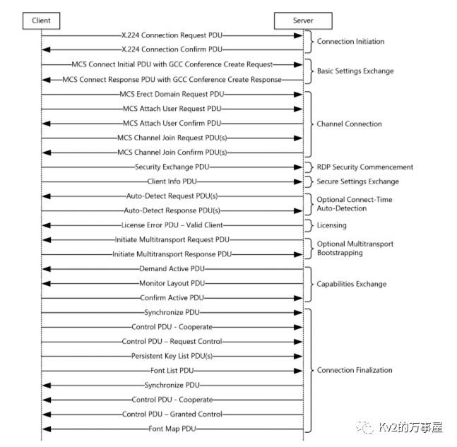
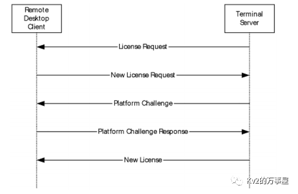
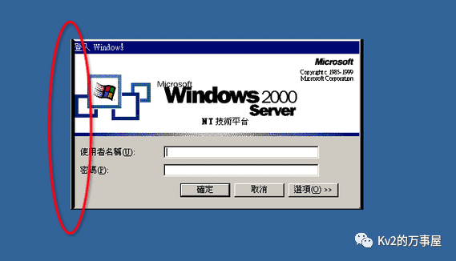
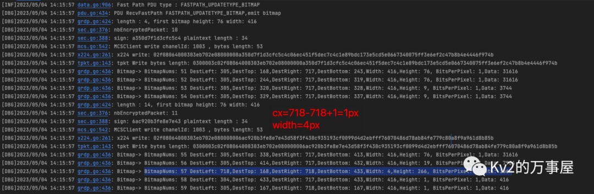
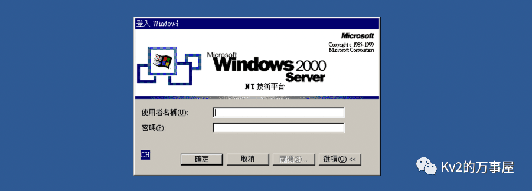
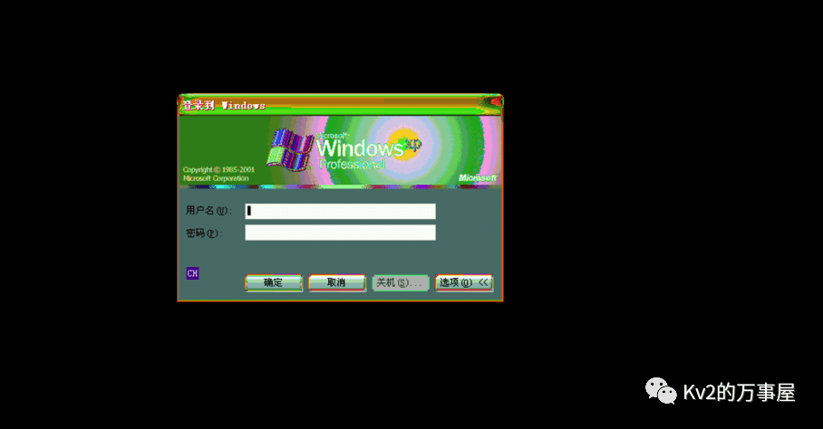
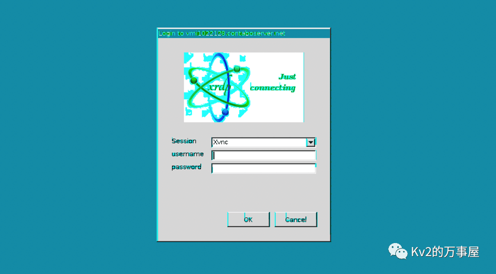
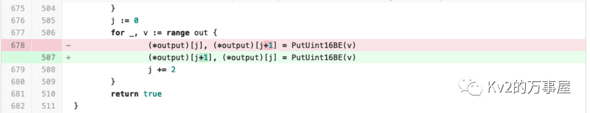
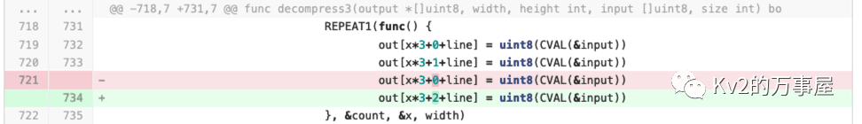

# 一次痛苦的协议攻坚：RDP

原创 lcvv

[↓↓↓](javascript:)  
  
Kv2 的万事屋  
  
[↑↑↑](javascript:)

*2023-10-27 19:10* *发表于湖南*

## 前言

这篇主要记录一下在纯 Golang 语言下兼容各版本 RDP 协议的过程中碰到的一些坑点，其实在公司内部已经分享过一遍了，但是前前后后有不少人联系我，希望了解更多技术细节，所以最终还是把这篇文章发出来，希望能带来一些思考。  

另外如果没有看过前一篇文章的，可以先去看一下，本文只做技术细节探讨，具体实现效果和结论可以点击[这里](https://mp.weixin.qq.com/s?__biz=MzI4MzcwNTAzOQ==&mid=2247528393&idx=1&sn=74961047a04f95115cb9eab084b1baef&scene=21#wechat_redirect)跳转。

言归正传，刚刚拿到任务的时候，我并不觉得这是一件难度很大的事情，因为我知道的，就 RDP 来说，https://github.com/tomatome/grdp，已经完成了相当多的事情，熟悉我的应该知道 kscan 就是使用的这个库，而我要做的，只不过是简简单单的做一个兼容性的调优罢了，当然，后来证明这个想法是完全错误的。

## 我遇到了一些什么问题？

在任务之初，我的主要目标是实现 RDP 的截图功能，从建立连接到协议走通再到传递图像数据，花费了大量的时间。而最终的暴力破解功能实际上只花费了很小的时间。在开始之前首先是对 tomatome/grdp 做了一个简单的兼容性测试，结果是意料之内的，在 Windows2003、WindowsXP 等较低版本的操作系统，以及 XRDP 等是完全走不通，而 Windows2008 等较高版本的则会进入 NLA 阶段，无法截图。Windows7 是我唯一测试成功的版本。

所以理所应当的，我从 Windows2000 这个版本最低的操作系统开始了 RDP 研究之路。

### 走通协议真的太费劲了

  

先放一张官方的协议交互全流程图，单看这个流程图，并不复杂，但实际走通整个协议遇到了相当多的问题，这一段如果没有研究过 RDP 的话会比较难懂，但是如果你也做类似的事情的话，可以详细阅读，我基本把能踩到的坑都踩完了：  

  



#### Connection Initiation

Connection Initiation 是 RDP 连接建立的第一次交互，其作用在于协商本次 RDP 连接的一些基础配置，如：安全协议（Security Protocol）版本，协议标志（Protocol Flags）,这决定着后续交互的数据结构。

-   x.224 Connection Confirm PDU
    
    Server 端回应的 Confirm 包，数据结构不符合预期，手工校准后解决，原因在于较低版本的 RDP 协议没有 Negotiation 字段，直接默认为：PROTOCOL\_RDP
    

#### Secure Settings Exchange

-   Client info PDU
    
    在此阶段花费了相当长的时间（大概两天），问题的现象是，Client 端发送【Client info PDU】之后，Server 端直接断开连接，也没有任何报错信息，这直接导致丢失了排错方向，开始了漫长的试错：
    
    1、先是读了一整天 RDP 的官方文档，这文档是真的难看，一个字节一个字节的对，发现数据结构没有任何问题
    
    2、然后再抓 mstsc.exe 的包，发现全特么是加密的，压根没法分析
    
    3、找到 rdesktop，修改一下协议头部，这样发出来的包就变成明文的了，然后再一个字节一个字节的对，眼睛都看花了，终于找到原因，我们发送的【Client info PDU】数据包多了一个【ExtraInfo】字段，这个字段是高版本的 RDP 协议才会兼容的，去掉这个字段之后进入下一阶段
    

#### Licensing

Licensing 阶段是整个研究过程中最艰难的，花了差不多四天时间，几近放弃，在 tomatome/grdp 项目中，关于 Licensing 的交互是**完全错误**的（PS：我起初完全没有往这个方面想，因为其他版本的 RDP 协议能够顺利走通，后来发现那些走通的是因为压根没进入到 Licensing 交互这个阶段，直接进入下个阶段了）,而且在官方文档【MS-RDPBCGR】中关于 Licensing 交互的介绍相当至少，后来才知道，关于 Licensing 交互有一个专门的文档：【MS-RDPELE】，根据这个文档才能最终走通 Licensing 交互的全部流程



-   New License Request
    
    Clinet 端接收到来自 Server 端的【License Requset】之后，需进行正确回应，其实有两种方式，一种是**New License Flow**回应【New License Request】，mstsc 就是采用的这种方式，另一种是**Upgrade License Flow**回应【License Info】，rdesktop 采用的是这种方式，其中**New License Flow**的方式更为简单，所以我采用的也是这种方式。这里主要有两个坑点：
    

-   根据【MS-RDPELE】文档，补充 Licensing 阶段交互的数据结构，这是一个细致功夫，由于缺乏明文的可比对的对象（rdesktop 由于采用的是**Upgrade License Flow**方式，所以不具备参考性），我只能根据文档逐字节比对。而且更为蛋疼的是，一言不合 Server 段就重置连接，真的很让人崩溃。
    
-   【New License Request】中大致包含几个数据：clientRandom、encryptedPreMasterSecret、ClientUserName、ClientMachineName，其中 clientRandom 是一段由客户端随机生成的 32 位字符，ClientUserName、ClientMachineName 则是客户端的一些信息，而 encryptedPreMasterSecret 则是由【License Requset】中的 ServerCertificate（证书）、serverRandom 等经过复杂算法（SHA1、MD5、RSA）生成的一段哈希值。没有从【License Requset】中提取 ServerCertificate 数据，这两个问题导致生成的 encryptedPreMasterSecret 不对，修正之后进入下一阶段。
    

-   Platform Challenge Response
    
    这个阶段是 Server 段接收到 New License Request，使用 clientRandom 生成【Platform Challenge】，给 Client 段进行校验，确认双方的 License 协商无误。
    

-   对【Platform Challenge】中 EncryptedPlatformChallenge 进行解密，正确的值应该为：`"T\x00E\x00S\x00T\x00\x00\x00"`，但是实际并不是，这里又进入了漫长的排查，最终发现是在【New License Request】阶段回应的 encryptedPreMasterSecret 值不对，生成 encryptedPreMasterSecret 的 RSA 算法有问题，导致【Platform Challenge】中 EncryptedPlatformChallenge 无法正确加密，Client 端自然也无法正常解密了，修正 RSA 算法算法后进入下一阶段。
    

#### Capabilities Exchange

 Capabilities Exchange 是用来给 Server 端与 Client 端协商功能配置的，比如：Bitmap 的缓存大小、色彩位数、输入标识、字体格式等

-   Confirm Active PDU
    
    在此阶段同样困扰了我非常多的时间，因为【Capabilities Exchange】交互的数据量非常之大，我不得不把 rdesktop 阶段的交互流程通读了一遍，然后把 rdesktop 的协商数据照搬到我的代码里面来，然后逐一比对发送出去的数据，最终发现，即便我发送一模一样的数据，Server 端依然还是高冷的重置连接。这让我非常费解，其实在这个地方我已经开始怀疑是加密环节的问题了。
    
    最终解决问题是因为我找到了另一个项目：citronneur/rdpy，这是一个使用 python 编写的 RDP 协议库，tomatome/grdp 的绝大部分代码都是从 rdp 改过来的。通过阅读 rdpy 的代码我发现，在【New License Request】阶段，grdp 会将生成的 macSalt 覆盖到 macKey，而在 rdpy 中生成的 macSalt 则是使用一个单独的参数来保存。macKey 的作用是用来给加密数据做数据签名的，这导致后续所有发送的加密数据 Server 段都无法正常解密，自然会出现问题，新增一个独立的参数用来保存 macSalt 解决此问题。
    

到这里终于走通了低版本 RDP 协议的协商全流程，看到 Bitmap 数据传过来的时候眼泪都要流出来了😭，翻越了这几座高山之后，让我误以为后面会是一片坦途，但事实证明我又错了

### 想截一张好图没这么简单

#### 黑边问题

走通协议之后，遇到的第一个问题就是最终的图片会有黑边，这看上去无伤大雅，但却很影响观感，就像是一碗很美味的汤里面吃着吃着发现一只苍蝇：



起初我以为是 Bitmap 解压缩的问题，但是经过测试，直接使用 rdesktop 的 bitmap 解压缩代码，依然会存在这个问题，然后又是漫长的逐包分析，我以为是在 RDP 协议走通后，某些 PDU 事件我没有响应导致的，于是花了很长时间读 rdesktop 的代码，把每个每个事件的用途弄明白，比如：Point、Order 等，最终发现在 2000 这个目标上，所有的事件都不影响图像显示，至此陷入僵局。

为了解决这个问题，想了一个不算办法的办法，经过分析这些存在黑边的图像宽度都是 4px，那我能不能把宽度为 4px 都改成透明呢？事实当然是可以的


到这一步只要不放大来看，基本上是发现不了端倪了，但是我用脚指头想也知道这不是完美解，果然，在大批量测试的时候发现某些场景下，还有很多宽度为 4px 的数据被误杀了，所以只能老老实实的继续看 rdesktop 的代码，这一次终于让我找到了原因：

```plain
//根据 bitmap 数据定位到这个函数，其作用是把图像数据，从坐标 left，top 开始，绘制偏移 cx、cy 结束
//图像的宽度和高度是 width，height
ui_paint_bitmap(left, top, cx, cy, width, height, bmpdata);
//实际上光 left, top, cx, cy 四个参数就已经可以定位图片了，为什么还要再有 width, height 呢？


//找到了 cx、cy 的定义
cx = right - left + 1;
cy = bottom - top + 1;
```

这里就是问题所在，我们在解析 bitmap 数据时，生成好图片之后，会直接按照 width 和 height 把图像贴到背景图像上，但是，图像真正的宽度和高度是 cx 和 cy，在绝大部分情况下 witdth、height 是等于 cx 和 cy 的，但是就是在存在黑边的那几帧数据里面，差了 3px，而 3px 正好是黑边的宽度！！！



去除黑边之后，效果就非常完美了



#### 色彩失真问题

在能够完成基本的截图之后，我便开始了大批量的测试，从 FOFA 中提取海量的 RDP 服务器，不停的截图，果然不出所料，截了很多奇形怪状的图片：





这个就真的是 Bitmap 解压缩的问题了，因为我替换成 rdestop 的 C 代码来进行 Bitmap 解压缩之后，这些问题都解决了，然后只能逐行查找 rdesktop 和 grdp 在 Bitmap 解压缩这块代码的差异，这是一个非常痛苦的过程，首先 rdesktop 是使用 C 写的，不论是数据结构还是代码逻辑跟 Go 有着很大的差异，眼睛都看花了，才找到这两个 Bug：

-   解压缩后的 Bitmap 数据流每两个字节被颠倒了，所以导致色彩失真
    



-   前作者在做数据处理时，写错了一位数据
    



#### 截图的时机

进行大批量测试之后，除了色彩存在问题以外，还有一部分是由于截图时机把握不对，导致图像信息丢失的，比如这种：


或者这种：


起初以为是截图的条件设置有问题，现有的截图条件是”连续 5s 中没有接收到 Bitmap 数据“，但是我不能直白的把这个等待时间调的太长，因为这样势必会导致所有的截图时间拉长，而且经过测试，在某些场景直接拉长这个时间并不能改善这个问题，Bitmap 的数据包间隔时间越来越长，然后被 Server 端主动断开连接。后来发现这是因为 Server 端长时间没有收到 Client 端的数据，判断 Client 端失活，所以断开连接。

为此我做了两个调整，算是把这个问题优化到可承受范围内：

-   把 5s 这个时间从静态值改成动态值，固定加上两个 Bitmap 数据数据包的间隔时间，这样在网络条件差的情况下，就会自动把等待时间调长，而不会影响其他的截图任务的运行时长
    
-   在每接收到一个 Bitmap 数据包的时候，给 Server 端发送一次鼠标随机移动事件，这样就可以避免 Server 端认为 Client 端失活的问题
    

### 做爆破总不会这么难了吧？

#### NLA Security

爆破确实没这么难了，能够很方便进行爆破的安全协议主要有两种：PROTOCOL\_HYBRID、PROTOCOL\_HYBRID\_EX，这两种安全协议都是能够进行 NLA 的，但是由于 tomatome/grdp 这个项目，对于 PROTOCOL\_HYBRID\_EX 后续的 PDU 交互并不支持，所以如果 Server 段最终选择 PROTOCOL\_HYBRID\_EX 协议的时候，是直接跳过的：

```plain
  if x.selectedProtocol == PROTOCOL_HYBRID_EX {
    glog.Error("NODE_RDP_PROTOCOL_HYBRID_EX_NOT_SUPPORTED")
    return
  }
```

但是对于爆破角度来说，我们只需要走完 NLA 阶段即可，所以只要略微调整，便可以新增对于 PROTOCOL\_HYBRID\_EX 协议的支持

```plain
  if x.selectedProtocol == PROTOCOL_HYBRID_EX {
    glog.Info("*** NLA Security selected ***")
    err := x.transport.(*tpkt.TPKT).StartNLA()
    if err != nil {
      x.transport.Emit("NLAAuth", err)
      glog.Error("start NLA failed:", err)
      return
    }
    x.Emit("connect", uint32(x.selectedProtocol))
    return
  }
```

#### INFO\_AUTOLOGON

如果不能进行 NLA 的话，这里主要指：PROTOCOL\_RDP、PROTOCOL\_SSL，想要对这两种安全协议做暴力破解就比较麻烦了，非常依赖 Server 端对 INFO\_AUTOLOGON 标识的支持，客户端可以在【Client info PDU】阶段发送这个标识，表明希望进行自动登录的意愿，但是不同版本的 RDP 服务端对于 INFO\_AUTOLOGON 标识的处理逻辑是不同的，比如：

-   Windows2000 只能自动输入用户名，无法自动输入密码
    
-   XRDP、WindowsXP、Windows2003，可以自动输入用户名和密码，并直接进入桌面
    

但是能够自动输入用户名和密码只是第一步，在进入桌面之后，我们需要一个标识符来判断是否登录成功了，最终只在 WindowsXP、Windows2003 等版本的 RDP 服务端找到`SAVE_SESSION_INFO`事件来作为登录成功的标识，而 Windows2000 和 XRDP 只能放弃了。其实 Windows2000 通过模拟键盘输入的方式能够成功进入桌面，但是 Windows2000 和 XRDP 都不会发送`SAVE_SESSION_INFO`事件，也没有其他登录成功的标识，所以依然没有办法实现。

## 总结一下

RDP 这个事情，前前后后花了快有一个月时间，最终能够做到这个效果其实也有点出乎我自己的意料，总结了几点，希望以后各位同学在做类似的攻坚任务时能够得到一点启发：

-   坚持不放弃非常重要，路虽远行则将至，事虽难做则必成，在没有完成的时候总觉得离完成还有很远，但是当完成之后回头再看，其实就是一层窗户纸，捅破了也就完成了；
    
-     
    
-   如果有其他工具、代码做了类似的事情，弄懂它，这是最快的捷径；
    
-   一定要保持质疑，如果有人在你前面做了一些事情，或者有人直接给了你一个答案，甚至是官方文档，他们都不一定是对的，只有经过验证的才是可信的；
    
-   充分的测试非常有必要，整个项目的雏形实际上在一周左右的时候已经完成了，剩余的时间是在修补批量测试之后 Bug，只有经得住大数量级考验的项目才是能打的项目，做事只做一半没有任何意义。
    

## 参考

文中相关技术细节若存在错误或疏漏，欢迎补充指正。

-   技术分享｜死磕 RDP 协议，从截图和爆破说起  
    
-   MS-RDPBCGR
    
-   MS-RDPELE
    
-   像 fofa 一样解析 RDP 信息，RDP 提取操作系统，RDP 登录截屏
    
-   网络空间测绘技术之：协议识别（RDP 篇）
    
-   tomatome/grdp
    
-   citronneur/rdpy
    
-   rdesktop/rdesktop
