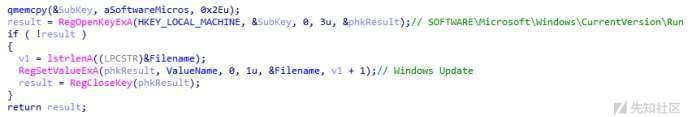

# 一款使用邮件发送受害者信息的蠕虫病毒分析 - 先知社区

一款使用邮件发送受害者信息的蠕虫病毒分析

- - -

## 概述

近期，笔者在对电脑文件进行整理的时候，无意间发现了一款蠕虫病毒样本，此样本与普通蠕虫病毒样本略有不同，除具有恶意传播行为外，此样本还会收集系统信息并通过邮件发送。因此，本着学习的态度，笔者尝试对其进行了详细分析。

## 样本家族

基于样本行为及邮箱信息进行网络调研，发现此样本为HIDDEN COBRA家族的Brambul样本，曾被美国国土安全部和联邦调查局（FBI）联合发布过技术分析报告，相关截图如下：

[](https://xzfile.aliyuncs.com/media/upload/picture/20240301103845-d324e270-d774-1.jpg)

[](https://xzfile.aliyuncs.com/media/upload/picture/20240301103856-d98cf5e4-d774-1.jpg)

## 样本分析

### 基本信息

样本基本信息如下：

```plain
文件名称：d1847c2d0d25efc17fac81bb79bb46a895615a3d9aaa9c97d80e91dc5d4758d3
文件大小：57344 字节
MD5     ：86B4E50393E52F0F649DE6756B6F5F36
SHA1    ：19E0FAD9CE41A118C0238D866E3DE5C227A724EC
CRC32   ：45839045
```

### 动态获取API

样本运行后，将调用GetProcAddress函数动态获取关键API函数，相关代码截图如下：

[](https://xzfile.aliyuncs.com/media/upload/picture/20240301103907-e0882c92-d774-1.png)

### DNS查询

样本运行后，将首先对“gmail.com”进行DNS查询，用于获取“gmail.com”域名解析记录，便于后续代码使用；

相关代码截图如下：

[](https://xzfile.aliyuncs.com/media/upload/picture/20240301103919-e75c1fba-d774-1.jpg)

### 判断用户名

样本将对系统用户名进行判断，若用户名为“SYSTEM”，则开展创建自启动、收集系统信息等操作，反之开启SMB爆破；

相关代码截图如下：

[](https://xzfile.aliyuncs.com/media/upload/picture/20240301104458-b1cbbdb4-d775-1.png)

### 自启动

样本将通过创建注册表的方式实现自启动；

相关代码截图如下：

[](https://xzfile.aliyuncs.com/media/upload/picture/20240301104003-0198e854-d775-1.jpg)

[](https://xzfile.aliyuncs.com/media/upload/picture/20240301104017-0a136fe0-d775-1.png)

### 收集系统信息

样本将对系统版本、IP地址等信息进行收集，并将其作为邮件内容进行发送；

相关代码截图如下：

[](https://xzfile.aliyuncs.com/media/upload/picture/20240301104519-be29ee14-d775-1.png)

### 随机产生IP地址

样本将通过随机函数随机产生IP地址，用于后续的SMB爆破；

相关代码截图如下：

[](https://xzfile.aliyuncs.com/media/upload/picture/20240301104039-1765d73c-d775-1.jpg)

### SMB爆破

样本将使用内置的密码字典对随机产生的IP地址尝试SMB协议（445）未授权访问；

密码字典如下：

[](https://xzfile.aliyuncs.com/media/upload/picture/20240301104053-1f9cfe58-d775-1.jpg)

### 发送邮件

样本将通过HELO方式发送邮件（HELO是普通的SMTP，不带身份验证也可以成功发送邮件，一般用于制造垃圾邮件）；

发件人邮箱为：`johnS203@yahoo.com`

收件人邮箱为：`whiat1001@gmail.com`

相关代码截图如下：

[](https://xzfile.aliyuncs.com/media/upload/picture/20240301104107-28056580-d775-1.jpg)
