# 七天入门 LLM 大模型 | 第一天：魔搭社区和 LLM 大模型基础知识

七天入门 LLM 大模型学习课程

  

**七天入门****LLM 大模型学习** 是 ModelScope 魔搭社区推出的大模型课程，旨在帮助初学者理解和学习 LLM 的基础概念和实践。课程大纲安排如下：  

  

#01

 魔搭 LLM 大模型开源生态图 

  

  

近一年来，大语言模型（LLM）成为为全球科技与社会关注的焦点，公众对这类模型所蕴含的先进技术及其广泛应用有了更为深入的认知。关于 LLMs 是否应采取开源策略的话题引发了广泛的热议和深度探讨。魔搭 ModelScope 社区在过去的一年中，积极推动开源模型的发展，魔搭社区通过开源推动模型贡献者的研究成果的透明度提升和可复制性的强化，同时激发中国研究者和开发者社群的集体创新潜能。  

  

LLM 专题页：

https://modelscope.cn/topic/dfefe5be778b49fba8c44646023b57ba/pub/summary

  

## 基础模型研究

2023 年，随着 LLM 技术的发展，中国模型研究机构的开源模型迎来了爆发式的增长：

2023 年 3 月，智谱 AI 首先在魔搭社区发布了 ChatGLM-6B 系列，ChatGLM-6B 是一个开源的、支持中英双语问答的对话语言模型，基于 General Language Model (GLM) 架构，具有 62 亿参数。结合模型量化技术，用户可以在消费级的显卡上进行本地部署（INT4 量化级别下最低只需 6GB 显存）。现在，智谱 AI 的 ChatGLM-6B 已经更新到第三代，同时在多模态推出了 CogVLM 系列，以及支持视觉 agent 的 CogVLM，在代码领域推出了 CodeGeex 系列模型，同时在 agent 和 math 均有探索和开源的模型和技术。

2023 年 6 月，百川首先在魔搭社区发布了百川 -7B 模型，baichuan-7B 是由百川智能开发的一个开源的大规模预训练模型。基于 Transformer 结构，在大约 1.2 万亿 tokens 上训练的 70 亿参数模型，支持中英双语，上下文窗口长度为 4096。百川也是较早推出预训练模型的公司，并戏称给开发者提供更好的“毛坯房”，让开发者更好的“装修”，推动了国内基于预训练 base 模型的发展。后续百川发布了 13B 模型，以及百川 2 系列模型，同步开源 base 和 chat 两个版本。

2023 年 7 月，上海人工智能实验室在 WAIC 2023 开幕式和科学前沿全体会议上，联合多家机构发布全新升级的“书生通用大模型体系”，包括书生·多模态、书生·浦语和书生·天际等三大基础模型，以及首个面向大模型研发与应用的全链条开源体系。上海人工智能实验室不仅做了模型 weights 的开源，还在模型、数据、工具和评测等层面进行全方位开源，推动技术创新与产业进步。后续上海人工智能实验室陆续发布了书生·浦语 20B 模型，以及书生·灵笔多模态模型。

2023 年 8 月，阿里巴巴开源了通义千问 7B 模型，后续相继开源了 1.8B，14B，72B 的 base 和 chat 模型，并提供了对应的 int4 和 int8 的量化版本，在多模态场景，千问也开源了 qwen-vl 和 qwen-audio 两种视觉和语音的多模态模型，做到了“全尺寸、全模态”开源，Qwen-72B 提升了开源大模型的尺寸和性能，自发布以来一直维持在各大榜单榜首，填补了国内空白。基于 Qwen-72B，大中型企业可开发商业应用，高校、科研院所可开展 AI for Science 等科研工作。

2023 年 10 月，昆仑万维发布百亿级大语言模型「天工」Skywork-13B 系列，并罕见地配套开源了 600GB、150B Tokens 的超大高质量开源中文数据集 Skypile/Chinese-Web-Text-150B 数据集。由昆仑经过精心过滤的数据处理流程从中文网页中筛选出的高质量数据。大小约为 600GB，总 token 数量约为（1500 亿），是目前最大得开源中文数据集之一。

2023 年 11 月，01-AI 公司发布了 Yi 系列模型，其参数规模介于 60 亿至 340 亿之间，训练数据量达到了 300 亿 token。这些模型在公开排行榜（如 Open LLM leaderboard）以及一些极具挑战性的基准测试（例如 Skill-Mix）中的表现，均超过了之前的模型。  

  

## 模型定制新范式

性能卓越的模型和行业定制模型通常需要在预训练模型上，通过数据进过多次微调得来的。过去的一年中，来自社区的贡献者通过模型微调的方式，持续在各个方向做探索，并回馈社区，贡献了更加繁荣的行业模型生态。

  

IDEA Lab 发布的姜子牙通用大模型是基于 LLaMa 的 130 亿参数的大规模预训练模型，具备翻译，编程，文本分类，信息抽取，摘要，文案生成，常识问答和数学计算等能力。

  

OpenBuddy 致力于面向全球用户提供强大的多语言聊天模型，强调对话式 AI 对英语、中文和其他语言的无缝多语言支持。

  

Codefuse 和 wisdomshell 专注于代码领域，希望提升开发者效率，让代码使用更加简单，在各类评测中，效果远超基准。

  

FinGLM 和通义金融模型，专注在金融领域，基于 GLM 模型和千问模型，提供了金融年报解读，金融名词解释等金融行业垂直能力。

  

浙江大学，东北大学，大连理工，华东理工大学，南方科技大学，北京大学袁粒项目组，香港中文大学 openmmlab 等高校实验室通过微调预训练模型，推动开源模型在司法行业，教育行业，医疗行业，视频领域，全模态等方向发展。

  

  

#02

  LLM 类型介绍  

  

  

Base 模型和 Chat 模型  

我们通常会看到某模型研发机构开源了 base 模型和 chat 模型，那 base 模型和 chat 模型有什么区别呢？

首先，所有的大语言模型（LLM）的工作方式都是接收一些文本，然后预测最有可能出现在其后面的文本。

  

base 模型，也就是基础模型，是在海量不同文本上训练出来的预测后续文本的模型。后续文本未必是对指令和对话的响应。

  

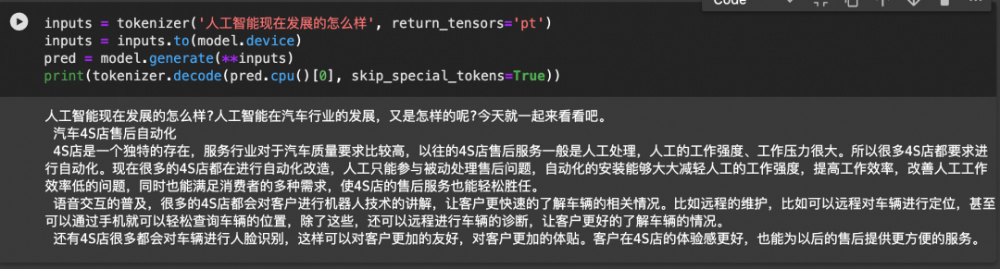

*qwen-1.8B*

  

  

chat 模型，也就是对话模型，是在 base 基础上通过对话记录（指令 - 响应）继续做微调和强化学习，让它接受指令和用户对话时，续写出来的是遵循指令的，人类预期的 assistant 的响应内容。

  

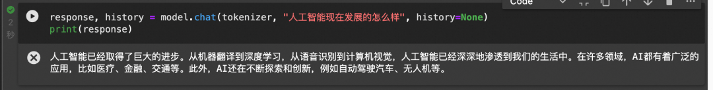

*qwen-1.8B-Chat*

  

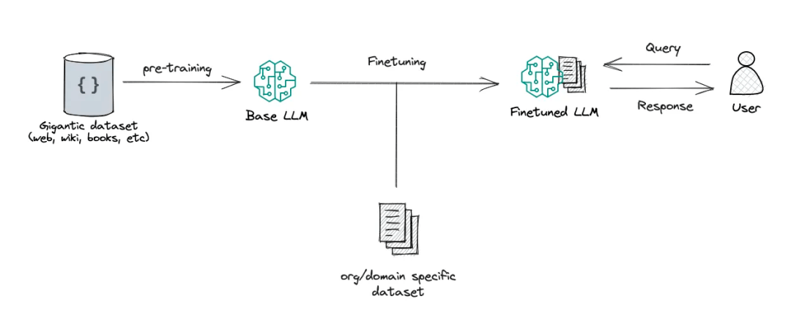

图片来源：RAG vs Finetuning — Which Is the Best Tool to Boost Your LLM Application?

  

## 多模态模型

多模态 LLM 将文本和其他模态的信息结合起来，比如图像、视频、音频和其他感官数据，多模态 LLM 接受了多种类型的数据训练，有助于 transformer 找到不同模态之间的关系，完成一些新的 LLM 不能完成的任务，比如图片描述，音乐解读，视频理解等。

  

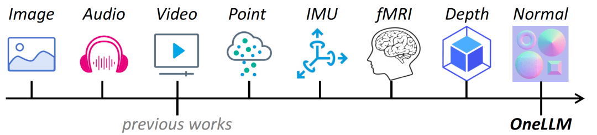

图片来源：ONELLM

  

## Agent 模型

LLM 具备 agent 大脑的能力，与若干关键组件协作，包括，

规划（planning）：子目标拆解，纠错，反思和完善。

记忆（Memory）：短期记忆（上下文，长窗口），长期记忆（通过搜索或者向量引擎实现）

工具使用（tool use）：模型学习调用外部 API 获取额外的能力。

  

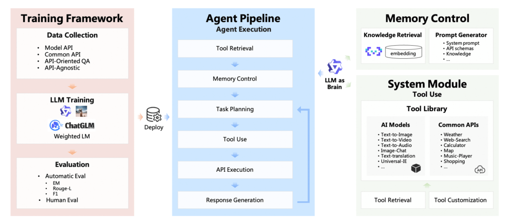

##   

## Code 模型

Code 模型在模型的预训练和 SFT 中加入了更多的代码数据占比，在代码的一系列任务，比如代码补齐，代码纠错，以及零样本完成编程任务指令。同时，根据不同的代码语言，也会有 python，java 等更多的专业语言代码模型。

  

  

#03

 使用 LLM 及优化 LLM 输出效果 

  

  

大语言模型是根据跨学科的海量的文本数据训练而成的，这也让大语言模型被大家认为最接近“AGI”的人工智能。然而，针对大语言模型，我们希望更好的使用 LLM，让 LLM 更好的遵循我们的指令，按照我们可控的方式和特定行业的知识输出答案。  

如下的两种方式可以用来参考：

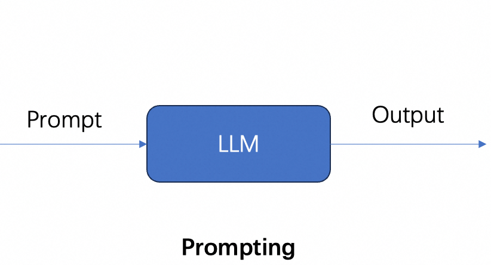

  

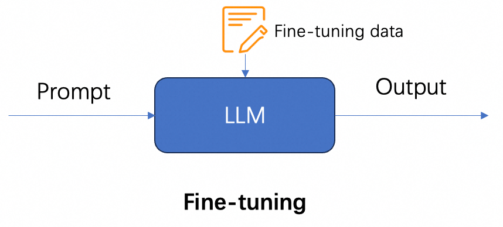

  

## **模型推理**

模型推理指利用训练好的模型进行运算，利用输入的新数据来一次性获得正确结论的过程。

  

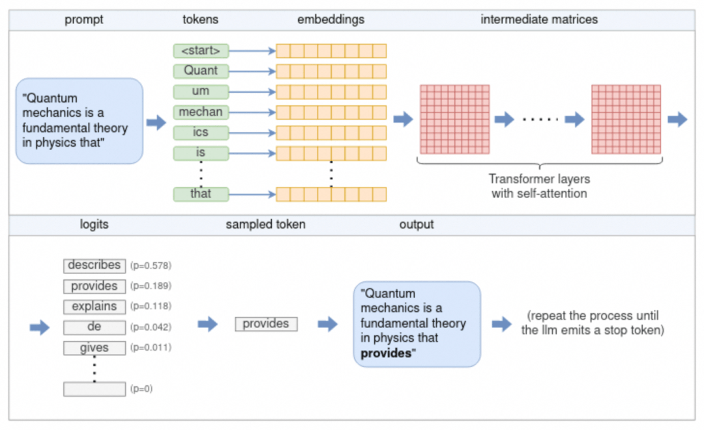

*来源："understanding-how-llm-inference-works-with-llama-cpp"*

  

参照图，流程如下：

1\. 分词器将提示拆分为标记列表。根据模型的词汇表，某些单词可能会被拆分为多个标记。每个令牌都由一个唯一的数字表示。

2\. 每个数字标记都会转换为 embedding 向量。embedding 向量是固定大小的向量，以 LLM 更有效处理的方式表示标记。所有 embedding 一起形成 embedding 矩阵。

3\. 嵌入矩阵用作 Transformer 的输入。Transformer 是一个神经网络，是 LLM 的核心。Transformer 由多层 layer 组成。每层都采用输入矩阵并使用模型参数对其执行各种数学运算，最值得注意的是 self-attention 机制。该层的输出用作下一层的输入。

4\. 最终的神经网络将 Transformer 的输出转换为 logits。每个可能的下一个标记都有一个相应的 logit，它表示该标记是句子“正确”延续的概率。

5\. 使用多种采样技术之一从 logits 列表中选择下一个标记。

6\. 所选 token 作为输出返回。要继续生成 token，请将所选令牌附加到步骤 (1) 中的令牌列表，然后重复该过程。这可以继续下去，直到生成所需数量的 token，或者 LLM 发出特殊的流结束 (EOS) 令牌。

  

## Prompt（提示词）

prompt（提示词）是我们和 LLM 互动最常用的方式，我们提供给 LLM 的 Prompt 作为模型的输入，比如“使用李白的口吻，写一首描述杭州的冬天的诗”，开源大模型引入了 system 消息和人工 prompt 的概念，可以根据提示提供更多的控制。

  

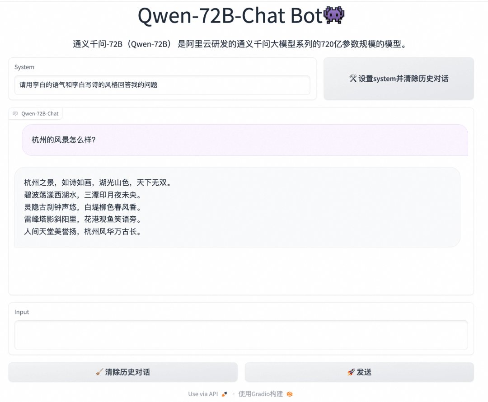

## **few-shot prompt** 

通过在 prompt 中增加一些输入和首选的优质输出的示例，可以增强 LLM 的回答效果，更好的遵循我们的指令。但是更多的示例，会收到 LLM 的上下文窗口的限制，更多的 token 也会增加算力的消耗，也会影响 LLM 的响应速度。

  

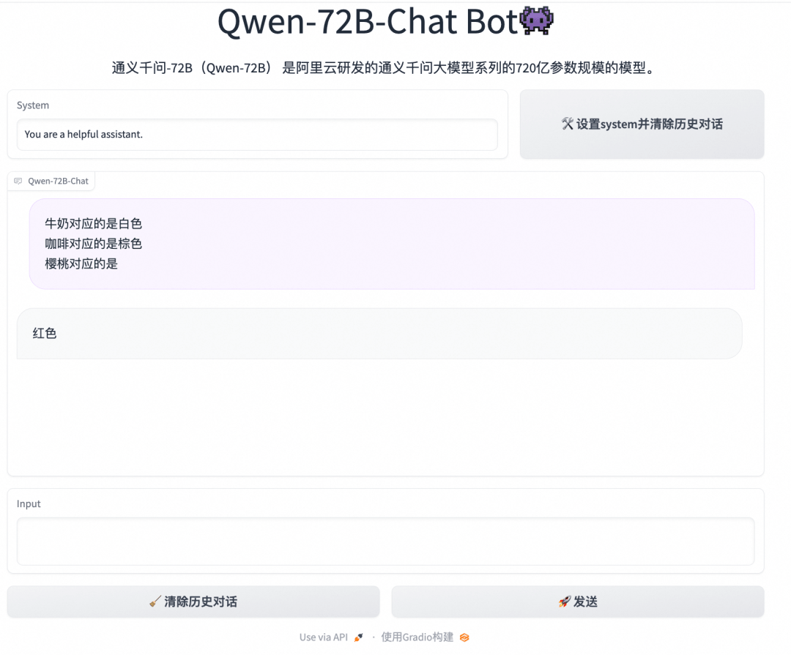

## LLM+RAG

大型语言模型 (LLM) 演示显着的能力，但面临诸如此类的挑战：幻觉、过时的知识以及不透明、无法追踪的推理过程。检索增强生成 (RAG) 通过整合来自外部数据库的知识成为一个有前途的解决方案，这增强了模型的准确性和可信度，特别是对于知识密集型任务，并且允许知识的不断更新和整合特定领域的信息。RAG 协同作用将 LLM 的内在知识与广泛的、外部数据库的动态存储库。 

  

  

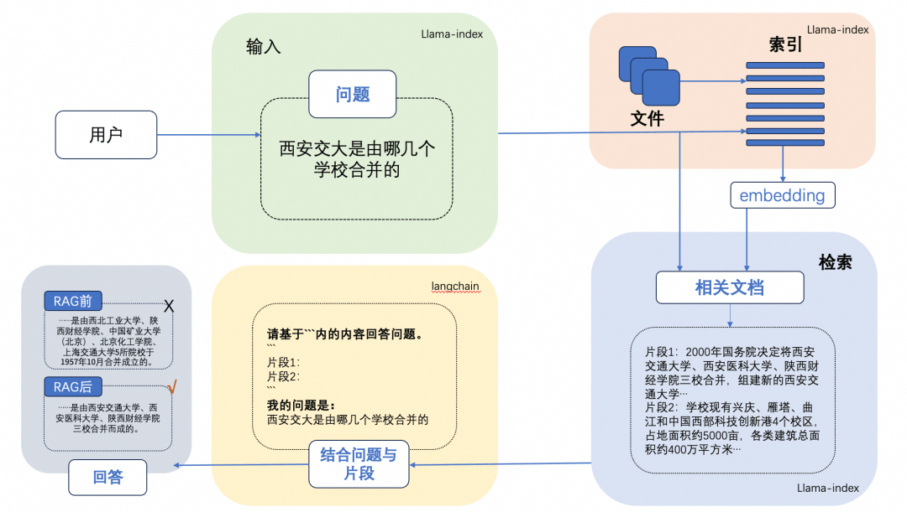

  

## 模型微调

微调是我们向开源的 LLM 的 CKPT 提供更多的数据，使他具备额外的知识，或者改变他的一些原来的生成结果。  

  

微调会改变模型的权重，并可以更好的控制模型的生成结果。对比 few-shot prompting 的方式，也可以解决通过 few-shot prompting 方式带来的 token 消费高，模型响应速度慢，以及上下文窗口不够的问题。

  

微调也会产生一些意向不到的结果，并有可能导致模型的通用能力下降，所以需要客观的评估模型微调的结果。

  

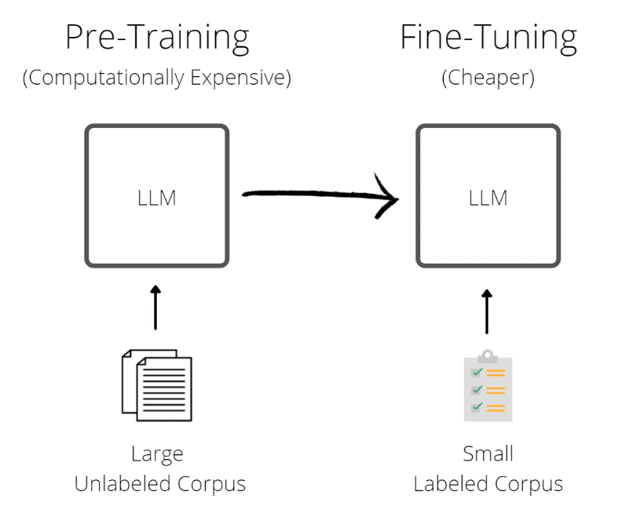

  

魔搭社区提供了一站式微调框架：SWIFT（Scalable lightWeight Infrastructure for Fine-Tuning）。它集成了各种高效的微调方法，如 LoRA、QLoRA、阿里云自研的 ResTuning-Bypass 等，以及开箱即用的训练推理脚本，使开发者可以在单张商业级显卡上微调推理 LLM 模型。

  

## 模型量化

模型量化是使用低精度数据类型（例如 8 位整数 (int8)）而不是传统的 32 位浮点 (float32) 表示来表示模型中的权重、偏差和激活的过程。通过这样做，它可以明显减少推理过程中的内存占用和计算需求，从而能够在资源受限的设备上进行部署。模型量化在计算效率和模型精度之间取得微妙的平衡。目前主要使用的 LLM 开源量化工具主要有：bnb，GPTQ，AWQ

  

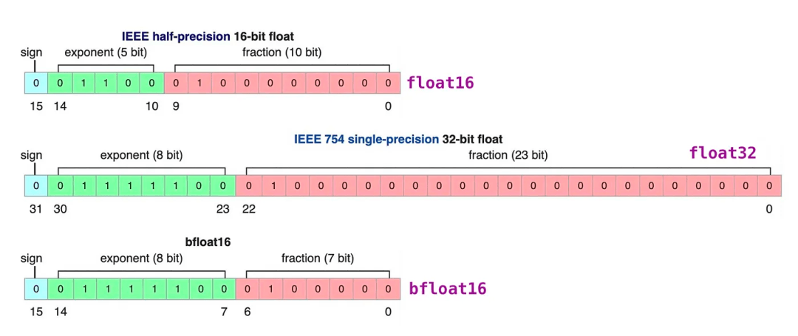

*float32 到 float16 的过程 - 来源：LLM Series - Quantization Overview*

  

## 模型评估

## LLM 评估技术是研究和改进 LLM 的关键环节。LLM 的评估是一项复杂的任务，需要考虑多个方面的评估维度和任务类型，如文本对话、文本生成、多模态场景、安全问题、专业技能（coding/math）、知识推理等。

  

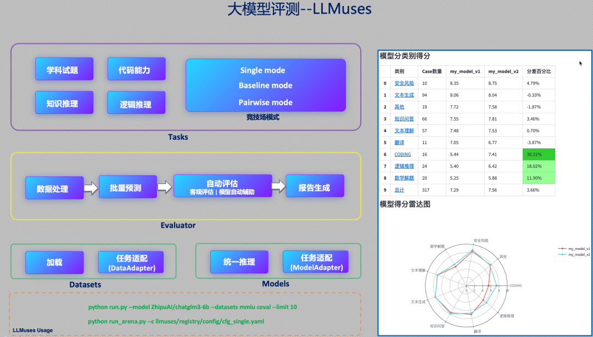

  

LLM 评估通常可以人工评估和自动评估两大类。其中，自动评估（Automatic evaluation）技术又可以分为 rule-based 和 model-based 的方式。其中，rule-based 主要面向客观题评价，评测题目通常包含标准答案；model-based 方法主要用于评价主观题，如复杂知识推理、多轮会话、文本生成等，通过专家模型（Expert model）来评价目标 LLM 的生成效果。

  

魔搭社区提供了一套 LLM 评估框架--LLMuses，专注于使用自动评估方法来评估 LLM 在各个任务上的表现。其包含以下特性：

-   轻量化，易于定制
    
-   预置丰富的评估指标
    
-   Model-based 模式，提供多种评价模式（Single mode、Pairwise-baseline、Pairwise-all）
    
-   可视化报告
    

  

## 模型推理加速和部署

魔搭社区的大语言模型 LLM 支持将模型托管在服务器或者云上，并创建 API 接口或者 Web 应用提供给用户与模型交互。

  

魔搭社区提供了针对不同开发者的模型部署方案：

**1\. Swingdeploy：**可以通过简单的选择 0 代码的方式，即可部署魔搭社区的模型到云上并生成供应用程序使用的 API 接口，支持弹性扩缩容和按需调用。

**2\. 阿里云 PAI SDK：**魔搭社区和阿里云 PAI 产品合作，支持通过 PAI 的 python SDK 在云上部署模型。  

**3\. vLLM 推理加速：**魔搭社区和 vLLM 合作，支持更快更高效的 LLM 推理服务，基于 vLLM，开发者可以通过一行代码实现针对魔搭社区的大语言模型部署。  

**4\. 多端异构部署：**魔搭社区和 Xinference 合作，支持对 LLM 的 GGUF 和 GGML 各种部署，支持将模型部署到 CPU 甚至个人笔记本电脑上。  

**5\. 分布式多模型部署：**魔搭社区和 fastchat 合作，支持一行代码部署魔搭社区的大语言模型，支持 Web UI 和 OpenAI 兼容的 RESTful API。  

  

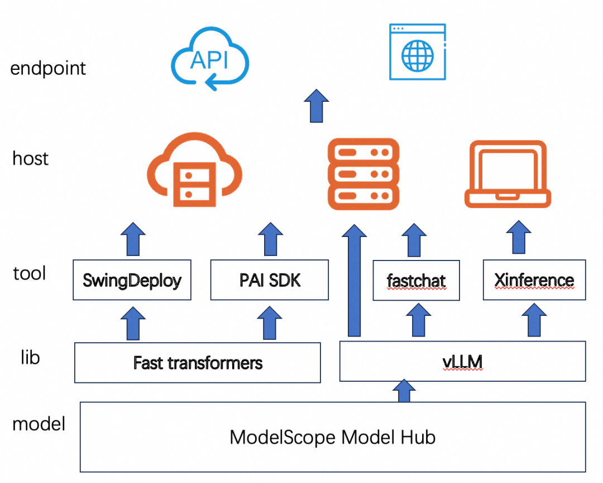

  

## 模型应用-Agent

Modelscope AgentFabric 是一个交互式智能体框架，用于方便地创建针对各种现实应用量身定制智能体。AgentFabric 围绕可插拔和可定制的 LLM 构建，并增强了指令执行、额外知识检索和利用外部工具的能力。AgentFabric 提供的交互界面包括：

⚡ 智能体构建器：一个自动指令和工具提供者，通过与用户聊天来定制用户的智能体

⚡ 用户智能体：一个为用户的实际应用定制的智能体，提供构建智能体或用户输入的指令、额外知识和工具

⚡ 配置设置工具：支持用户定制用户智能体的配置，并实时预览用户智能体的性能

  

  

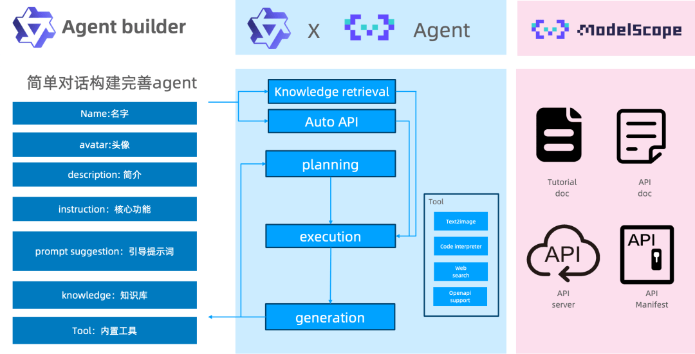
