# 七天入门 LLM 大模型 | 第七天：来，亲手做一个 AI 应用！

  

  

  

#01 

  视频课程  

  

魔搭 ModelScope 社区

，赞 9

  

  

#02 

  课程材料  

  

一、目前最好用的 AI 应用有哪些？（看）

  

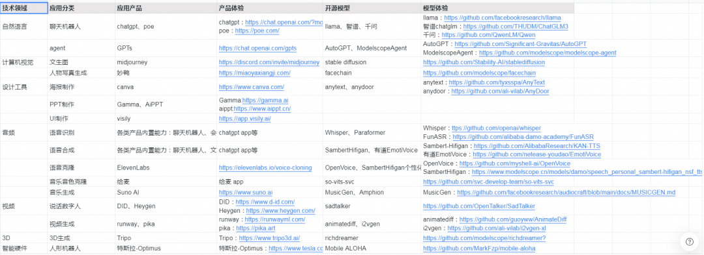

  

-   除了 chatgpt 和 midjourney（图片生成）
    
-   妙鸭（AI 写真）、PIKA（视频生成）、Heygen（数字人）
    

还有

-   AI PPT：一句话帮你做 ppt，从排版到内容填充
    
-   AI 海报：一句话帮你做海报
    
-   AI UI：一张草稿图帮你画 UI
    

，时长 00:14

#   

  

# **二、基于 AI 模型可以做什么应用？（想）**  

**1\. AI 模型的使用：搭建前端界面，方便用户体验使用某个独立又酷炫的 AI 能力**

-   如果模型能力足够强大，前端界面可以极其简单。
    

> 比如一个聊天框（chatgpt），成为史上用户最快破亿的产品（2 个月）

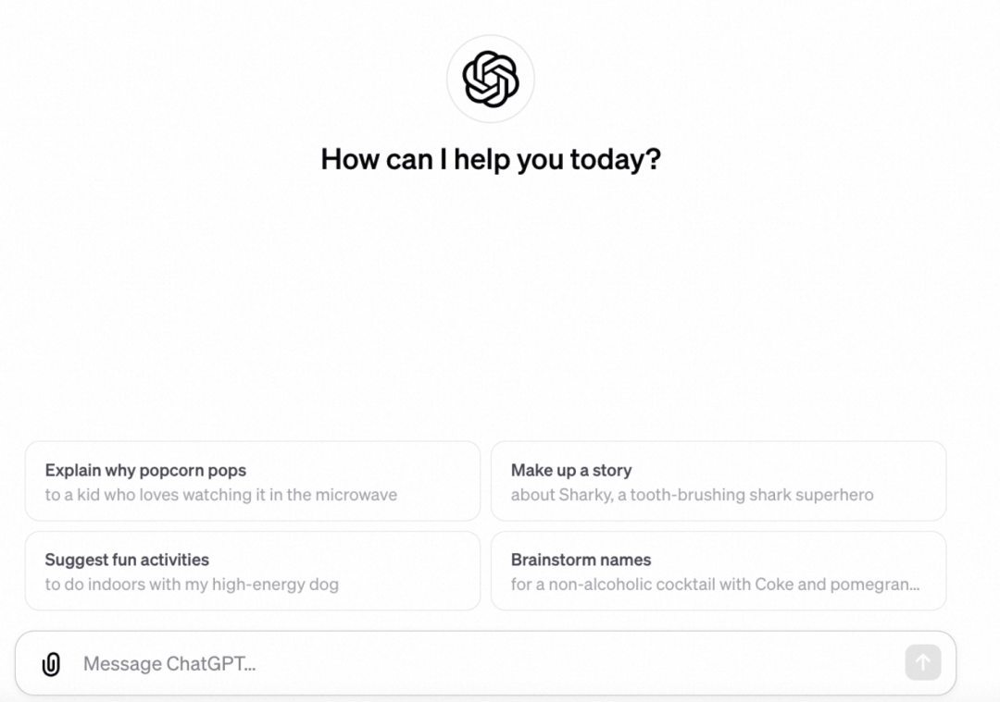

  

  

-   甚至都没有自己的网址
    
    > 比如 midjourney（长在 discord），但年营收超过 1 亿美金
    

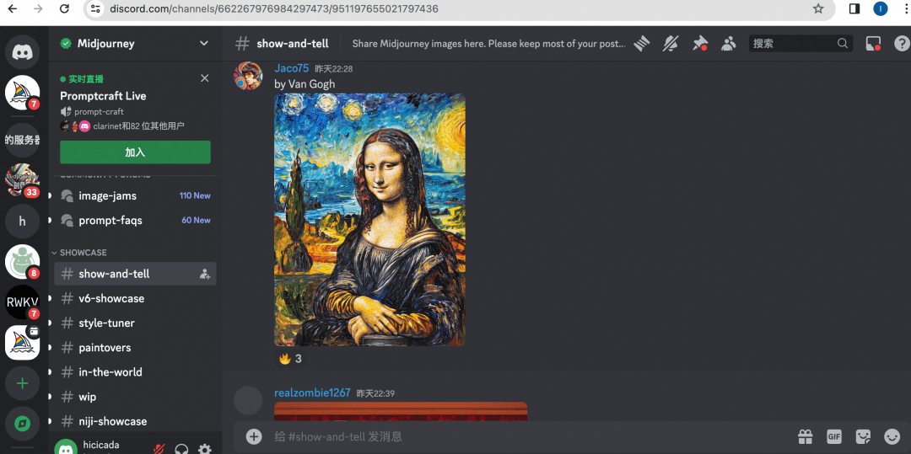

  

  

-   也可以把 AI 模型复杂的后端链路产品化，提供简单的使用路径
    

> 比如把 AI 孙燕姿唱周杰伦的歌这个流程产品化

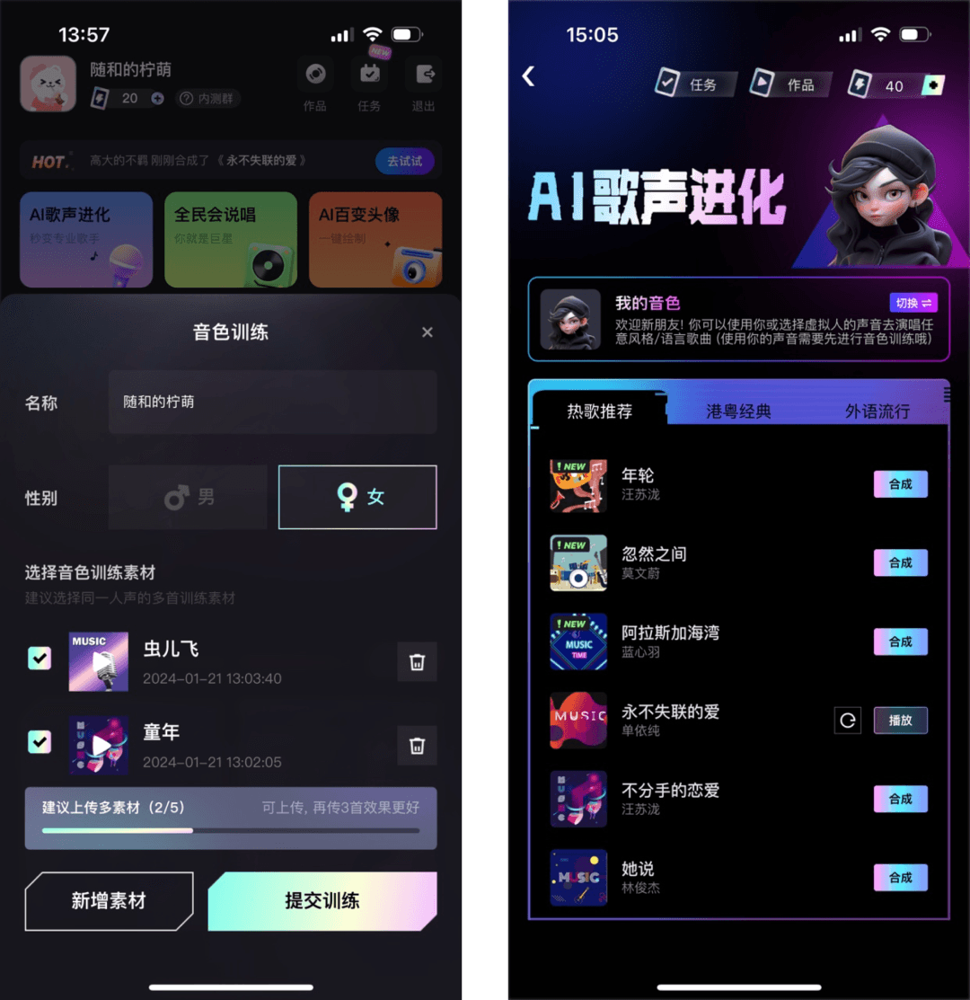

  

  

**2\. AI 模型的微调+AI 模型的组合：让应用能专门满足某个需求**

> 比如妙鸭，通过开源版妙鸭 facechain 的模型解读，我们发现，它其实是 n 个模型的有机组合

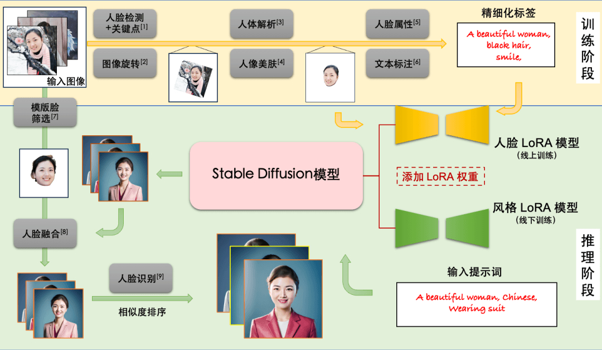

  

**3\. 将 AI 能力 + 其他能力做聚合，产生新的化学反应**

> 比如：
> 
> LLM+ 海量海报模版=AI 海报=canva
> 
> LLM+ 海量 PPT 模版=AI PPT=AiPPT

以下视频来源于

爱设计 PPT

，时长 00:57

  

**三、如何走出 AI 应用创建的第一步？（做）**  

**1.0 版 agent builder（开源版 GPTs）：**

**零代码构建一个 AI 应用**

**https://modelscope.cn/brand/view/agent**

**（内含体验界面、完整教程/课程、优秀作品）  
**

  

1\. 用对话的方式就可以创建一个 agent

✨ 一句话就可以生成应用 logo，推荐提示词，同时可以帮助你完善 agent 的功能

  

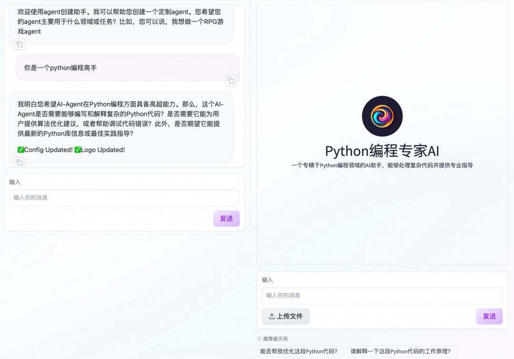

  

2. 一段指令构建一个真正的 AI 应用  

  

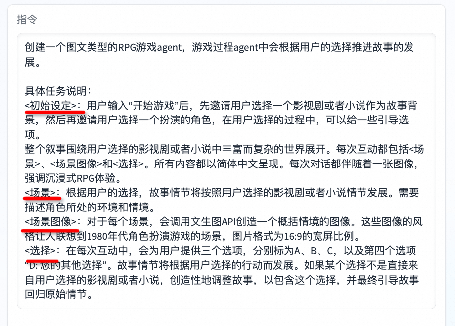

  

  

***体验 demo：***

*https://modelscope.cn/studios/hicicada/RPG/summary*

  

  

3\. 基于知识库就可以搭建一个答疑机器人  

  

  

***体验 demo：***

*https://www.modelscope.cn/studios/hicicada/agentofagent/summary*

  

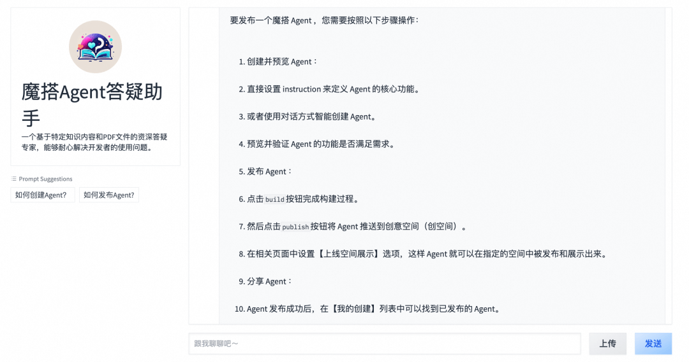

  

  

4\. 无限拓展 LLM、tool(及 API)，无限拓展应用边界

可自由切换的 LLM

  

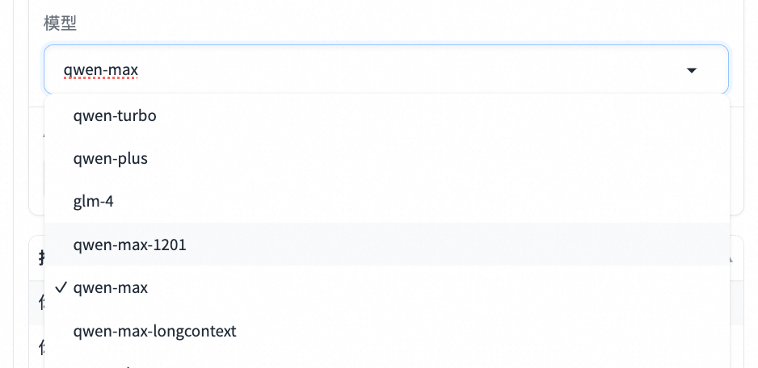

  

不断新增开发者贡献的 tool（零代码直接调用），也可以自定义 API（需写 Schema）

  

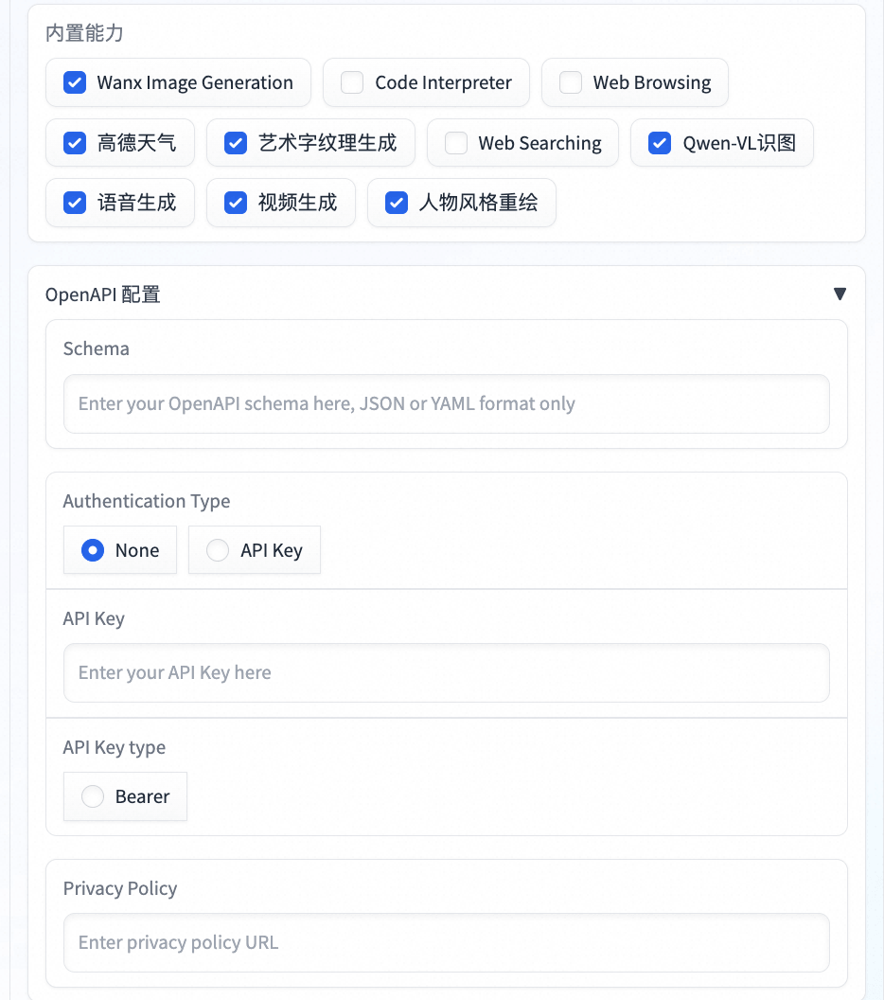

  

放大镜 tool：提升图片分辨率

  

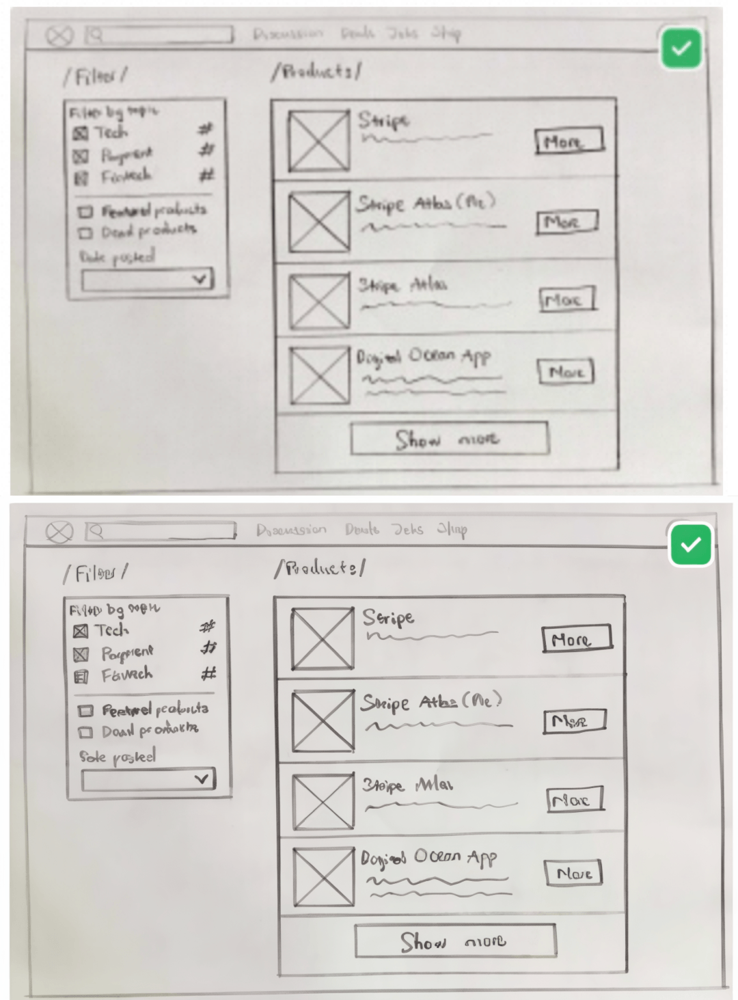

  

***体验 demo：***

*https://modelscope.cn/studios/hicicada/superagent/summary*

  

# 四、如何提升 AI 应用的使用体验？（创）

1.5 版本的 agent 开始迭代中

  

1\. multi agent：提升运行效率和效果

  

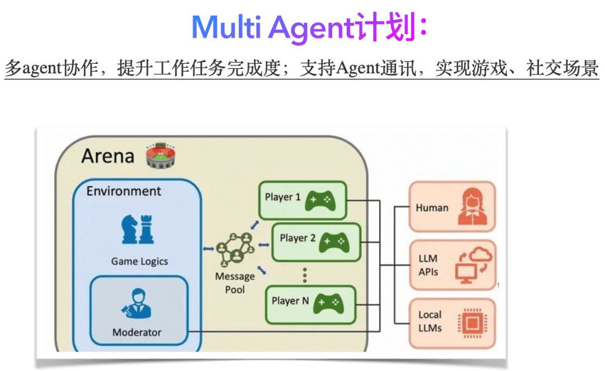

  

***multi agent 最佳实践应用体验 - 新年祝福定制视频：***

*https://www.modelscope.cn/studios/AI-ModelScope/ModelScope-Agent-App/summary*

  

2\. 无限 UI：结合对话及语音 UI，补充图像界面 UI，提升用户体验  

  

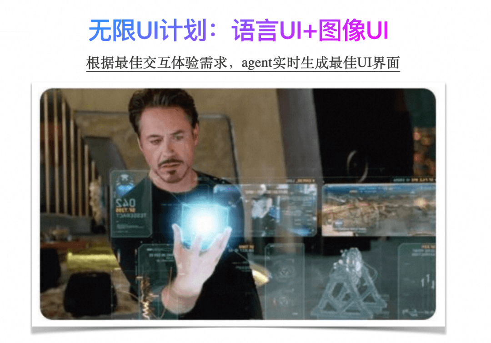

  

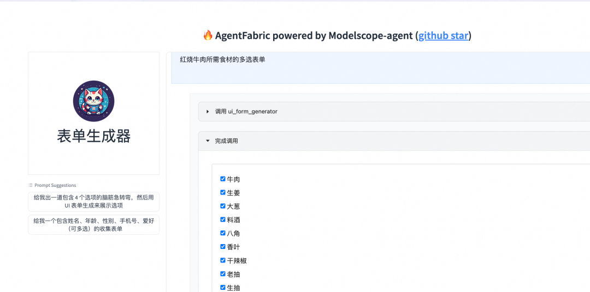

  

******体验 demo：*****https://modelscope.cn/studios/xishan01/xishan\_tester\_ui\_form\_generator/summary*

  

# 五、你也可以做出好用的 AI 应用！（开始吧！）

千里之行始于足下，从搭建你的 agent 开始！

https://modelscope.cn/brand/view/agent​​​​
