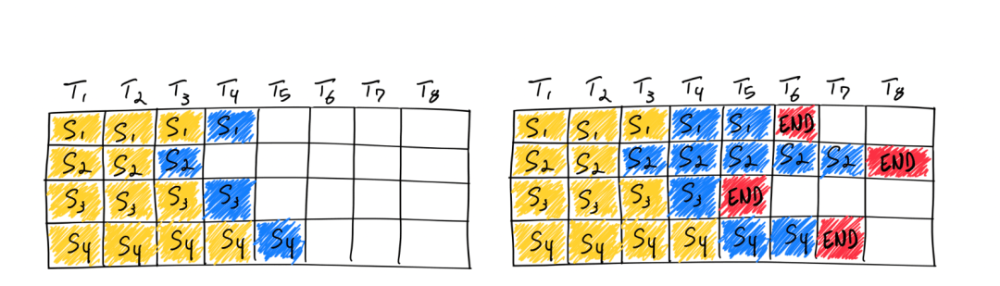

# 七天入门 LLM 大模型 | 第六天：大模型量化及低成本部署最佳实践

  

  

#01 

  模型的量化  

  

量化是什么  

  

前文中我们提到，模型的推理过程是一个复杂函数的计算过程，这个计算一般以矩阵乘法为主，也就是涉及到了并行计算。一般来说，单核 CPU 可以进行的计算种类更多，速度更快，但一般都是单条计算；而显卡能进行的都是基础的并行计算，做矩阵乘法再好不过。如果把所有的矩阵都加载到显卡上，就会导致显卡显存的占用大量增加，尤其是 LLM 模型大小从 7b、14b、34b 到几百 b 不等，占用显存的大小就是惊人的数字，如何在减少运算量和显存占用的条件下，做到推理效果不下降太多呢？在这里需要引入浮点数和定点数的概念。  

  


  

**双精度浮点数：**在 PyTorch 中用 torch.float64 表示，或者在其他语言中也称为 double 类型，在 LLM 训练中一般比较少用

  

**全精度浮点数：**在 PyTorch 中用 torch.float32 表示

  

**低精度浮点数：**在 PyTorch 中用 torch.bfloat16 和 torch.float16 表示。这两个浮点数的差别在上图中可以表示：

1.  bfloat16 的小数部分较短，整数部分较长，这会有利于在训练中减少梯度爆炸的情况（即梯度累加值超过了最大值），但是这种数据类型是在 N 系列显卡 Ampere 系列才支持的，即 30 系列显卡。
    
2.  float16 的小数部分较长，这意味着在精度控制上 float16 更好，但整数部分较短，比较容易梯度爆炸。
    

那么是否有更加减少显存占用和计算量的数值表达方式呢？那么可以考虑是否把浮点数转换为定点数（整数），整数计算更快更省显存，如果计算精度下降不大就很完美了。这种用整数计算代替浮点数计算的方法就是量化。

  

量化的基本原理是根据每个 tensor 的浮点型最大值和最小值，将其映射为一个固定范围的整形数值集合，比如\[-127~127\]。假设一个简单的公式：qweight=round(weight/scale)，其中 qweight 代表量化后权重，weight 代表量化前权重，scale 代表缩放因子，可以看到在进行缩放后为了将浮点型转换为整数过程中增加了 round 操作丢失了小数部分。在后续计算或反量化为浮点型时存在无法完全还原的情况，这就是精度损失。

  

按照量化发生的步骤区分，可以划分为 PTQ（训练后量化，或离线量化）和 QAT（训练感知型量化，或在线量化）。PTQ 量化可以分为 data-free 和 calibration 两种，前者不使用数据集进行校准直接计算量化因子，后者会根据少量真实数据进行统计分析并对量化因子进行额外校准，但耗费的时间更长。QAT 量化会先在待量化的算子上增加一个伪量化结构，并在训练时模拟量化过程并实时更新计算量化因子（类似反向传播过程）及原始权重。QAT 由于较为复杂一般作为辅助措施存在，用于改进 PTQ 量化的技术手段。

  

按照量化方法可以划分为线性量化、非线性量化（如对数量化）等多种方式，目前较为常用的是线性量化。其中线性量化又可以按照对称性划分为对称量化和非对称量化，非对称量化为了解决 weight 分布不均匀问题，其在公式中增加了 zeropoint 项：qweight=round(weight/scale + zeropoint)，使稠密数据部分可以得到更宽泛的数值范围。


按照量化粒度划分可以分为逐层量化（每层使用一套量化因子）、逐组量化（在每层中按照 group 使用一套量化因子）、逐通道量化（按 channel 划分量化因子）等几种方式。

  

按照量化最大值的阈值区分，可以分为饱和量化和不饱和量化两种。不饱和量化按照浮点数最大值和量化后最大值的比例计算量化因子，由于原始 weight 的非均匀性会导致某些整形数值范围存在权重空缺。饱和量化会计算一个中间值以计算出量化因子，因此会舍弃一部分不重要数据，将重要数据尽量均匀的分布到量化数值范围内。

按照量化后的比特数划分，可以分为 2 比特量化，4 比特量化，8 比特量化等类型。

一般来说，PyTorch 中量化模块的 forward 过程会先对量化权重进行反量化后使用浮点数进行计算。

  

下面介绍几种常用的量化库。

  

## **AutoGPTQ**

该库需要引入额外的校准数据集进行量化校准。相比 bitsandbytes 量化精度较高，推理速度较快，但训练后不支持合并 adapter。

```plain
# 例子来自于 https://github.com/PanQiWei/AutoGPTQ
from modelscope import AutoTokenizer, snapshot_download
from auto_gptq import AutoGPTQForCausalLM, BaseQuantizeConfig
import logging
import shutil
import os

logging.basicConfig(
    format="%(asctime)s %(levelname)s [%(name)s] %(message)s", level=logging.INFO, datefmt="%Y-%m-%d %H:%M:%S"
)

pretrained_model_dir = snapshot_download("qwen/Qwen-1_8B-Chat")
quantized_model_dir = "qwen-1_8B-4bit"

shutil.rmtree(quantized_model_dir, ignore_errors=True)
shutil.copytree(pretrained_model_dir, quantized_model_dir)
for _file in os.listdir(quantized_model_dir):
    if ".safetensors" in _file or ".bin" in _file:
        os.remove(os.path.join(quantized_model_dir, _file))

tokenizer = AutoTokenizer.from_pretrained(pretrained_model_dir, use_fast=True, trust_remote_code=True)
examples = [
    tokenizer(
        "auto-gptq is an easy-to-use model quantization library with user-friendly apis, based on GPTQ algorithm."
    )
]

quantize_config = BaseQuantizeConfig(
    bits=4,  # quantize model to 4-bit
    group_size=128,  # it is recommended to set the value to 128
    desc_act=False,  # set to False can significantly speed up inference but the perplexity may slightly bad
)

# load un-quantized model, by default, the model will always be loaded into CPU memory
model = AutoGPTQForCausalLM.from_pretrained(pretrained_model_dir, quantize_config, trust_remote_code=True).to(0)

# quantize model, the examples should be list of dict whose keys can only be "input_ids" and "attention_mask"
model.quantize(examples)

# save quantized model
model.save_quantized(quantized_model_dir)

# save quantized model using safetensors
model.save_quantized(quantized_model_dir, use_safetensors=True)

# load quantized model to the first GPU
model = AutoGPTQForCausalLM.from_quantized(quantized_model_dir, device="cuda:0", trust_remote_code=True)
# inference with model.generate
print(tokenizer.decode(model.generate(**tokenizer("auto_gptq is", return_tensors="pt").to(model.device))[0]))
```

  

在 SWIFT 中，可以使用已经量化好的 AutoGPTQ 模型直接进行训练：

```plain
swift sft --model_id_or_path qwen/Qwen-7B-Chat-Int4 --model_revision master --sft_type lora --tuner_backend swift --template_type qwen --dtype fp16 --output_dir output --dataset leetcode-python-en --train_dataset_sample -1 --num_train_epochs 1 --max_length 512 --check_dataset_strategy warning --lora_rank 8 --lora_alpha 32 --lora_dropout_p 0.05 --lora_target_modules ALL --gradient_checkpointing true --batch_size 1 --weight_decay 0.01 --learning_rate 1e-4
```

  

上面的命令行中，qwen/Qwen-7B-Chat-Int4 是已经量化好的 Qwen-7B-Chat 模型。

  

## **Bitsandbytes**

bitsandbytes 是一种 data-free 的量化库。该量化方法速度较快（因为其不需要数据校准），因此可以在模型加载时动态量化，且该方法训练速度较快，因此训练兼容性较好，一般用于 QLoRA 训练中，且训练后可以合并 adapter。当由于其没有数据校准过程，因此精度较 AutoGPTQ 较低。

```plain
from modelscope import AutoModelForCausalLM, AutoTokenizer
import torch

model = AutoModelForCausalLM.from_pretrained(
  'qwen/Qwen-1_8B-Chat',
  load_in_8bit=True,
  trust_remote_code=True)

tokenizer = AutoTokenizer.from_pretrained('qwen/Qwen-1_8B-Chat', trust_remote_code=True)

print(model(**tokenizer('how are you?', return_tensors='pt')))
```

##   

## **GGML**

GGML 和 GGUF 是 GGML C++ 推理库的两种量化格式，其中 GGUF 格式较新，可以保留模型版本等其他自定义信息。这两种格式也是 PTQ 形式的量化算法，但 GGML 和 GGUF 格式的量化算法更适配于 CPU 推理，因此在 CPU 上运行更快，而 GPTQ 量化对 GPU 更加友好，两者的推理精度相仿。因此，\*.cpp 类型使用了 GGML 推理库的推理框架都更适配于 CPU 推理。

##   

## **AWQ**

AWQ 量化方式假设不是所有权重都影响模型性能，因此在量化过程中会跳过一部分重要权重以减轻量化过程中的精度损失。因此在和 GPTQ 量化保持类似推理速度的同时可以具备更好的精度。

  

目前 VLLM 对 AWQ 的支持较好，可以考虑在推理加速时使用 AWQ 量化方式。

  

  

#02 

  推理部署  

  

**推理及部署**  

训练后的模型会用于推理或者部署。推理即使用模型用输入获得输出的过程，部署是将模型发布到恒定运行的环境中推理的过程。一般来说，LLM 的推理可以直接使用 PyTorch 代码、使用 VLLM/XInference/FastChat 等框架，也可以使用 llama.cpp/chatglm.cpp/qwen.cpp 等 c++ 推理框架。

  

## 一些推理方法

-   Greedy Search 贪婪搜索方式。按照前面的讲解，模型会按照词表尺寸生成概率。贪婪方式会不断选择生成概率最大的 token。该方法由于无脑选择了最大概率，因此模型会倾向于生成重复的文字，一般实际应用中很少使用
    
-   Beam Search 和贪婪方式的区别在于，beam search 会选择概率最大的 k 个。在生成下一个 token 时，每个前序 token 都会生成 k 个，这样整体序列就有 k^2 个，从这些序列中选择组合概率最大的 k 个，并递归地执行下去。k 在 beam search 算法中被称为 beam\_size
    
-   Sample 随机采样方式。按照词表每个 token 的概率采样一个 token 出来。这个方式多样性更强，是目前主流的生成方式。
    

## 重要推理超参数

-   dosample：布尔类型。是否使用随机采样方式运行推理，如果设置为 False，则使用 beamsearch 方式
    
-   temperature：大于等于零的浮点数。公式为：
    

，从公式可以看出，如果 T 取值为 0，则效果类似 argmax，此时推理几乎没有随机性；取值为正无穷时接近于取平均。一般 temperature 取值介于\[0, 1\]之间。取值越高输出效果越随机。如果该问答只存在确定性答案，则 T 值设置为 0。反之设置为大于 0。

-   top\_k：大于 0 的正整数。从 k 个概率最大的结果中进行采样。k 越大多样性越强，越小确定性越强。一般设置为 20~100 之间。
    

-   实际实验中可以先从 100 开始尝试，逐步降低 top\_k 直到效果达到最佳。
    

-   top\_p：大于 0 的浮点数。使所有被考虑的结果的概率和大于 p 值，p 值越大多样性越强，越小确定性越强。一般设置 0.7~0.95 之间。
    

-   实际实验中可以先从 0.95 开始降低，直到效果达到最佳。
    
-   topp 比 topk 更有效，应优先调节这个参数。
    

-   repetition\_penalty： 大于等于 1.0 的浮点数。如何惩罚重复 token，默认 1.0 代表没有惩罚。
    

## KVCache

上面我们讲过，自回归模型的推理是将新的 token 不断填入序列生成下一个 token 的过程。那么，前面 token 已经生成的中间计算结果是可以直接利用的。具体以 Attention 结构来说：


  

推理时的 Q 是单 token tensor，但 K 和 V 都是包含了所有历史 token tensor 的长序列，因此 KV 是可以使用前序计算的中间结果的，这部分的缓存就是 KVCache，其显存占用非常巨大。

  

## VLLM

VLLM 支持绝大多数 LLM 模型的推理加速。它使用如下的方案大幅提升推理速度：

  

1.  **Continuous batching**
    

-   在实际推理过程中，一个批次多个句子的输入的 token 长度可能相差很大，最后生成的模型输出 token 长度相差也很大。在 python 朴素推理中，最短的序列会等待最长序列生成完成后一并返回，这意味着本来可以处理更多 token 的 GPU 算力在对齐过程中产生了浪费。continous batching 的方式就是在每个句子序列输出结束后马上填充下一个句子的 token，做到高效利用算力。
    



  

  

**2\. PagedAttention**

-   推理时的显存占用中，KVCache 的碎片化和重复记录浪费了 50% 以上的显存。VLLM 将现有输入 token 进行物理分块，使每块显存内部包含了固定长度的 tokens。在进行 Attention 操作时，VLLM 会从物理块中取出 KVCache 并计算。因此模型看到的逻辑块是连续的，但是物理块的地址可能并不连续。这和虚拟内存的思想非常相似。另外对于同一个句子生成多个回答的情况，VLLM 会将不同的逻辑块映射为一个物理块，起到节省显存提高吞吐的作用。
    


值得注意的是，VLLM 会默认将显卡的全部显存预先申请以提高缓存大小和推理速度，用户可以通过参数 gpu\_memory\_utilization 控制缓存大小。

  

首先安装 VLLM：

```plain
pip install vllm
```

```plain
import os
os.environ['VLLM_USE_MODELSCOPE'] = 'True'
from vllm import LLM, SamplingParams
prompts = [
    "Hello, my name is",
    "The president of the United States is",
    "The capital of France is",
    "The future of AI is",
]
sampling_params = SamplingParams(temperature=0.8, top_p=0.95)
llm = LLM(model="qwen/Qwen-1_8B", trust_remote_code=True)
outputs = llm.generate(prompts, sampling_params)

# Print the outputs.
for output in outputs:
    prompt = output.prompt
    generated_text = output.outputs[0].text
    print(f"Prompt: {prompt!r}, Generated text: {generated_text!r}")
```

  

注意，截止到本文档编写完成，VLLM 对 Chat 模型的推理支持（模板和结束符）存在问题，在实际进行部署时请考虑使用 SWIFT 或者 FastChat。

> LLM 的 generate 方法支持直接输入拼接好的 tokens(prompttokenids 参数，此时不要传入 prompts 参数)，所以外部可以按照自己的模板进行拼接后传入 VLLM，

在前文量化章节中我们讲解了 AWQ 量化，VLLM 直接支持传入量化后的模型进行推理：  

```plain
from vllm import LLM, SamplingParams
import os
import torch
os.environ['VLLM_USE_MODELSCOPE'] = 'True'

# Sample prompts.
prompts = [
    "Hello, my name is",
    "The president of the United States is",
    "The capital of France is",
    "The future of AI is",
]
# Create a sampling params object.
sampling_params = SamplingParams(temperature=0.8, top_p=0.95)

# Create an LLM.
llm = LLM(model="ticoAg/Qwen-1_8B-Chat-Int4-awq", quantization="AWQ", dtype=torch.float16, trust_remote_code=True)
# Generate texts from the prompts. The output is a list of RequestOutput objects
# that contain the prompt, generated text, and other information.
outputs = llm.generate(prompts, sampling_params)
# Print the outputs.
for output in outputs:
    prompt = output.prompt
    generated_text = output.outputs[0].text
    print(f"Prompt: {prompt!r}, Generated text: {generated_text!r}")
```

  

VLLM 官方文档：https://docs.vllm.ai/en/latest/getting\_started/quickstart.html

  

## **SWIFT**

在 SWIFT 中，我们支持了 VLLM 的推理加速手段。

```plain
pip install ms-swift[llm] openai
```

  

只需要运行下面的命令就可以使用 VLLM 加速推理：

```plain
swift infer --model_id_or_path qwen/Qwen-1_8B-Chat --max_new_tokens 128 --temperature 0.3 --top_p 0.7 --repetition_penalty 1.05 --do_sample true
```

  

也支持在部署中使用 VLLM：

```plain
swift deploy --model_id_or_path qwen/Qwen-1_8B-Chat --max_new_tokens 128 --temperature 0.3 --top_p 0.7 --repetition_penalty 1.05 --do_sample true
```

  

调用：

```plain
from openai import OpenAI
client = OpenAI(
    api_key='EMPTY',
    base_url='http://localhost:8000/v1',
)
model_type = client.models.list().data[0].id
print(f'model_type: {model_type}')

query = '浙江的省会在哪里？'
messages = [{
    'role': 'user',
    'content': query
}]
resp = client.chat.completions.create(
    model=model_type,
    messages=messages,
    seed=42)
response = resp.choices[0].message.content
print(f'query: {query}')
print(f'response: {response}')

# 流式
messages.append({'role': 'assistant', 'content': response})
query = '这有什么好吃的？'
messages.append({'role': 'user', 'content': query})
stream_resp = client.chat.completions.create(
    model=model_type,
    messages=messages,
    stream=True,
    seed=42)

print(f'query: {query}')
print('response: ', end='')
for chunk in stream_resp:
    print(chunk.choices[0].delta.content, end='', flush=True)
print()

"""Out[0]
model_type: qwen-7b-chat
query: 浙江的省会在哪里？
response: 浙江省的省会是杭州市。
query: 这有什么好吃的？
response: 杭州有许多美食，例如西湖醋鱼、东坡肉、龙井虾仁、叫化童子鸡等。此外，杭州还有许多特色小吃，如西湖藕粉、杭州小笼包、杭州油条等。
"""
```

##   

## llama.cpp

llama.cpp 是使用 c++ 语言编写的对 llama 系列模型进行高效推理或量化推理的开源库。该库使用了 ggml 底层计算库进行推理。在使用之前需要额外将 python 的 weights 转为 ggml 格式或 gguf 格式方可使用。和 llama.cpp 类似，还有兼容 ChatGLM 模型的 chatglm.cpp 和兼容 qwen 模型的 qwen.cpp 和 mistral 的 mistral.cpp。

  

安装依赖：

```plain
pip install modelscope
git clone --recursive https://github.com/QwenLM/qwen.cpp && cd qwen.cpp
cmake -B build
cmake --build build -j --config Release
```

  

下载模型：

```plain
from modelscope import snapshot_download
print(snapshot_download('qwen/Qwen-1_8B-Chat'))
# /mnt/workspace/.cache/modelscope/qwen/Qwen-1_8B-Chat
```

  

将原始模型转换为 ggml 支持的格式：

```plain
python3 qwen_cpp/convert.py -i /mnt/workspace/.cache/modelscope/qwen/Qwen-1_8B-Chat -t q4_0 -o qwen1_8b-ggml.bin
./build/bin/main -m qwen1_8b-ggml.bin --tiktoken /mnt/workspace/.cache/modelscope/qwen/Qwen-1_8B-Chat/qwen.tiktoken -p 你好
# 你好！有什么我可以帮助你的吗？
```

  

量化章节中我们介绍，GGML 库适合于 CPU 运行，因此推荐用户在 CPU 环境中或边缘计算中考虑 cpp 库进行推理。

  

## FastChat

FastChat 是一个开源推理库，侧重于模型的分布式部署实现，并提供了 OpenAI 样式的 RESTFul API。

```plain
pip3 install "fschat[model_worker,webui]"
python3 -m fastchat.serve.controller
```

在新的 terminal 中启动：

```plain
FASTCHAT_USE_MODELSCOPE=true python3 -m fastchat.serve.model_worker --model-path qwen/Qwen-1_8B-Chat --revision v1.0.0
```

  

之后在新的 terminal 中可以运行界面进行推理：

```plain
python3 -m fastchat.serve.gradio_web_server
```

  


