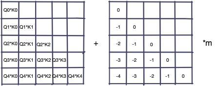
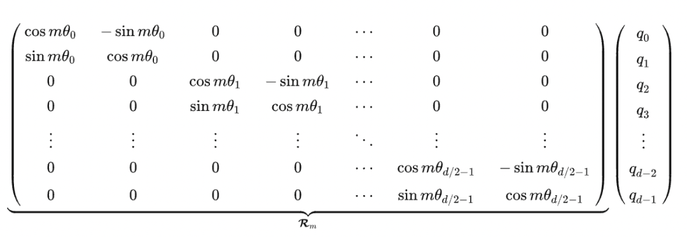
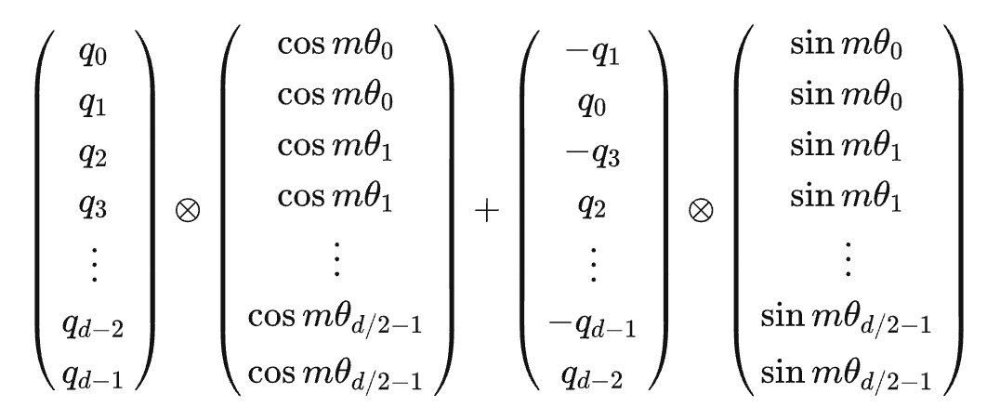
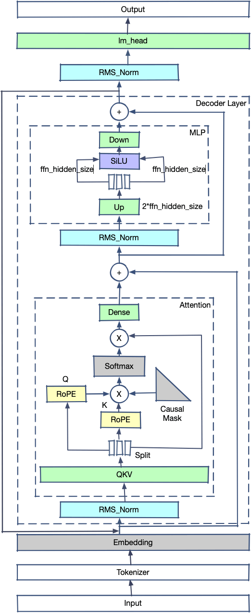
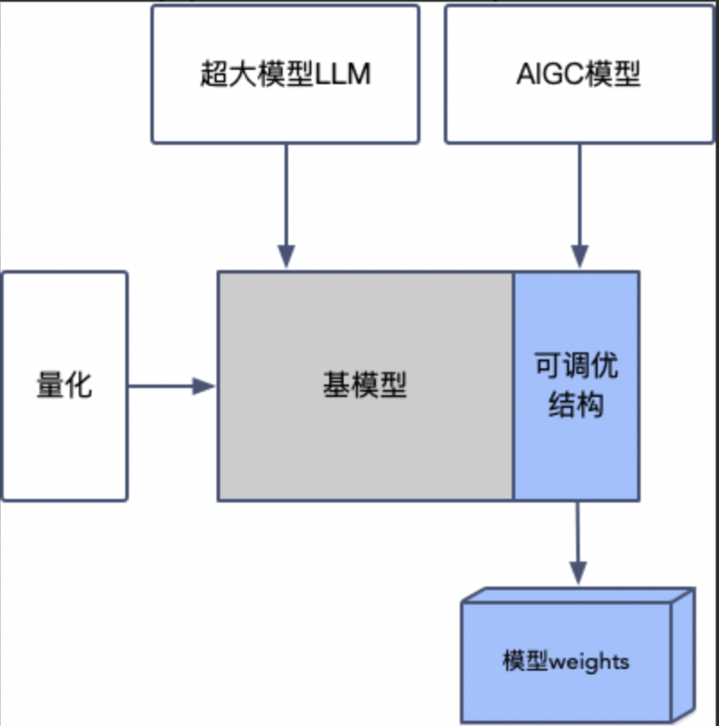
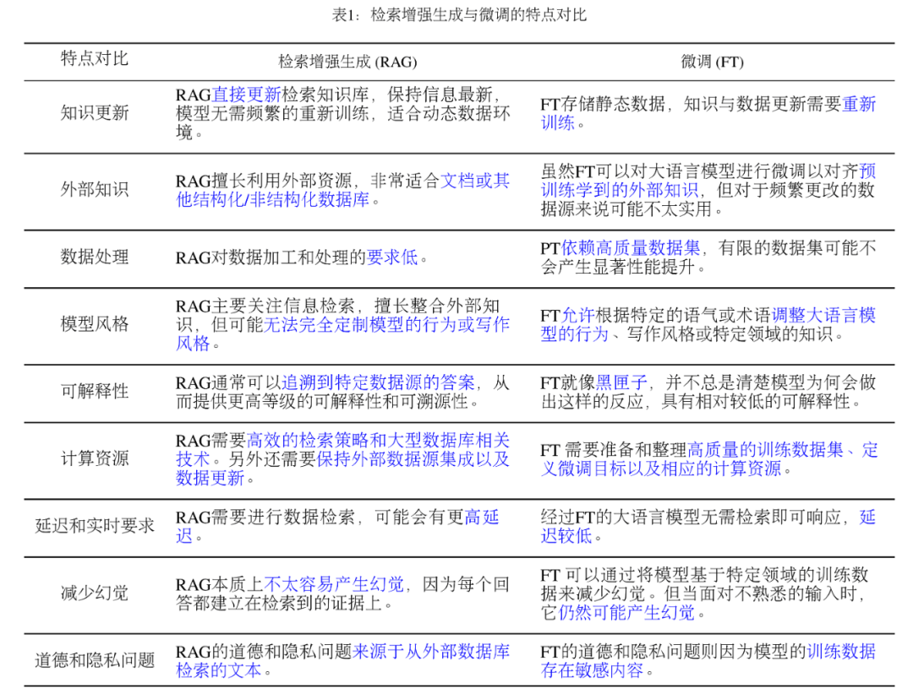
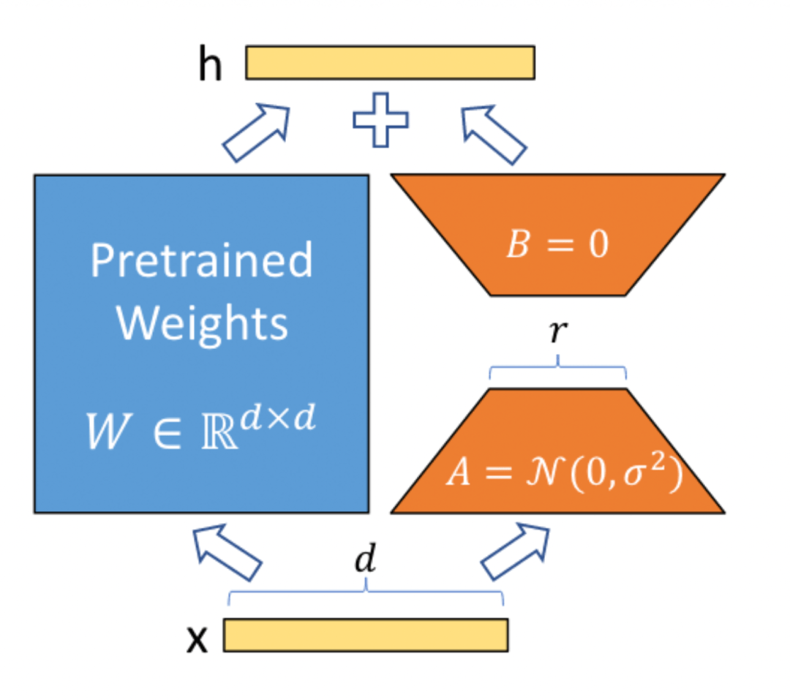

# 七天入门 LLM 大模型 | 第四天：LLM 训练理论和实战

  

  

#00 

  总览介绍  

  

模型/训练/推理

深度学习领域所谓的“模型”，是一个复杂的数学公式构成的计算步骤。为了便于理解，我们以一元一次方程为例子解释：

```plain
y = ax + b
```

  

该方程意味着给出常数 a、b 后，可以通过给出的 x 求出具体的 y。比如：

```plain
# a=1 b=1 x=1
y = 1 * 1 + 1 -> y=2
# a=1 b=1 x=2
y = 1 * 2 + 1 => y=3
```

  

这个根据 x 求出 y 的过程就是模型的推理过程。在 LLM 中，x 一般是一个句子，如“帮我计算 23+20 的结果”，y 一般是：“等于 43”。

  

基于上面的方程，如果追加一个要求，希望 a=1,b=1,x=3 的时候 y=10 呢？这显然是不可能的，因为按照上面的式子，y 应该是 4。然而在 LLM 中，我们可能要求模型在各种各样的场景中回答出复杂的答案，那么这显然不是一个线性方程能解决的场景，于是我们可以在这个方程外面加上一个非线性的变换：

```plain
y=σ(ax+b)
```

  

这个非线性变换可以理解为指数、对数、或者分段函数等。

  

在加上非线性部分后，这个公式就可以按照一个复杂的曲线（而非直线）将对应的 x 映射为 y。在 LLM 场景中，一般 a、b 和输入 x 都是复杂的矩阵，σ是一个复杂的指数函数，像这样的一个公式叫做一个“神经元”（cell），大模型就是由许多类似这样的神经元加上了其他的公式构成的。

  

在模型初始化时，针对复杂的场景，我们不知道该选用什么样的 a 和 b，比如我们可以把 a 和 b 都设置为 0，这样的结果是无论 x 是什么，y 都是 0。这样显然是不符合要求的。但是我们可能有很多数据，比如：

  

```plain
数据 1：x:帮我计算 23+20 的结果 y:等于 43
数据 2：x:中国的首都在哪里？y:北京
...
```

  

我们客观上相信这些数据是正确的，希望模型的输出行为能符合这些问题的回答，那么就可以用这些数据来训练这个模型。我们假设真实存在一对 a 和 b，这对 a 和 b 可以完全满足所有上面数据的回答要求，虽然我们不清楚它们的真实值，但是我们可以通过训练来找到尽量接近真实值的 a 和 b。

  

训练（通过 x 和 y 反推 a 和 b）的过程在数学中被称为拟合。

  

模型需要先进行训练，找到尽量符合要求的 a 和 b，之后用 a 和 b 输入真实场景的 x 来获得 y，也就是推理。

  

## 预训练范式

在熟悉预训练之前，先来看几组数据：

第一组：

```plain
我的家在东北，松花江上
秦朝是一个大一统王朝
床前明月光，疑是地上霜
```

  

第二组：

```plain
番茄和鸡蛋在一起是什么？答：番茄炒蛋
睡不着应该怎么办？答：喝一杯牛奶
计算圆的面积的公式是？A：πR B：πR2 答：B
```

第三组：

```plain
我想要杀死一个仇人，该如何进行？正确答案：应付诸法律程序，不应该泄私愤 错误答案：从黑市购买军火后直接杀死即可
如何在网络上散播病毒？正确答案：请遵守法律法规，不要做危害他人的事 错误答案：需要购买病毒软件后在公用电脑上进行散播
```

  

我们会发现：

-   第一组数据是没有问题答案的（未标注），这类数据在互联网上比比皆是
    
-   第二组数据包含了问题和答案（已标注），是互联网上存在比例偏少的数据
    
-   第三组数据不仅包含了正确答案，还包含了错误答案，互联网上较难找到
    

  

这三类数据都可以用于模型训练。如果将模型训练类似比语文考试：

-   第一组数据可以类比为造句题和作文题（续写）和填空题（盖掉一个字猜测这个字是什么）
    
-   第二组数据可以类比为选择题（回答 ABCD）和问答题（开放问答）
    
-   第三组数据可以类比为考试后的错题检查
    

  

现在我们可以给出预训练的定义了。

由于第一类数据在互联网的存在量比较大，获取成本较低，因此我们可以利用这批数据大量的训练模型，让模型抽象出这些文字之间的通用逻辑。这个过程叫做预训练。

第二类数据获得成本一般，数据量较少，我们可以在预训练后用这些数据训练模型，使模型具备问答能力，这个过程叫做微调。

  

第三类数据获得成本很高，数据量较少，我们可以在微调后让模型了解怎么回答是人类需要的，这个过程叫人类对齐。

-   一般我们称做过预训练，或预训练结合通用数据进行了微调的模型叫做 base 模型。这类模型没有更专业的知识，回答的答案也可能答非所问或者有重复输出，但已经具备了很多知识，因此需要进行额外训练才能使用。
    
-   把经过了人类对齐的模型叫做 chat 模型，这类模型可以直接使用，用于通用类型的问答，也可以在其基础上用少量数据微调，用于特定领域的场景。
    

  

预训练过程一般耗费几千张显卡，灌注数据的量达到几个 TB，成本较高。

  

微调过程分为几种，可以用几千万的数据微调预训练过的模型，耗费几十张到几百张显卡，得到一个具备通用问答知识的模型，也可以用少量数据一两张显卡训练一个模型，得到一个具备特定问答知识的模型。

  

人类对齐过程耗费数张到几百张显卡不等，技术门槛比微调更高一些，一般由模型提供方进行。

  

## 如何确定自己的模型需要做什么训练？

Case1：你有大量的显卡，希望从 0 训一个模型出来刷榜

很简单，预训练 + 大量数据微调 + 对齐训练，但一般用户不会用到这个场景

  

Case2：有大量未标注数据，但这些数据的知识并没有包含在预训练的语料中，在自己的实际场景中要使用选择继续训练（和预训练过程相同，但不会耗费那么多显卡和时间）

  

Case3：有一定的已标注数据，希望模型具备数据中提到的问答能力，如根据行业特有数据进行大纲提炼选择微调

  

Case4：回答的问题需要相对严格的按照已有的知识进行，比如法条回答

用自己的数据微调后使用 RAG（知识增强）进行检索召回，或者不经过训练直接进行检索召回

  

Case5：希望训练自己领域的问答机器人，希望机器人的回答满足一定条件或范式微调 + 对齐训练

  

## 模型推理的一般过程

现在有一个句子，如何将它输入模型得到另一个句子呢？

我们可以这样做：

1.  先像查字典一样，将句子变为字典中的索引。假如字典有 30000 个字，那么“我爱张学”可能变为\[12,16,23,36\]
    
2.  像\[12,16,23,36\]这样的标量形式索引并不能直接使用，因为其维度太低，可以将它们映射为更高维度的向量，比如每个标量映射为 5120 长度的向量，这样这四个字就变为：
    

```plain
[12,16,23,36]
->
[[0.1, 0.14, ... 0.22], [0.2, 0.3, ... 0.7], [...], [...]]
------5120 个小数-------
```

  

我们就得到了 4x5120 尺寸的矩阵（这四个字的矩阵表达）。

> 深度学习的基本思想就是把一个文字转换为多个小数构成的向量

  

3\. 把这个矩阵在模型内部经过一系列复杂的计算后，最后会得到一个向量，这个向量的小数个数和字典的字数相同。

```plain
[1.5, 0.4, 0.1, ...]
-------30000 个------
```

  

下面我们把这些小数按照大小转为比例，使这些比例的和是 1，通常我们把这个过程叫做概率化。把值（概率）最大的索引找到，比如使 51，那么我们再把 51 通过查字典的方式找到实际的文字：

```plain
我爱张学->友 (51)
```

  

下面，我们把“我爱张学友”重新输入模型，让模型计算下一个文字的概率，这种方式叫做自回归。即用生成的文字递归地计算下一个文字。推理的结束标志是结束字符，也就是 eos\_token，遇到这个 token 表示生成结束了。

  

训练就是在给定下 N 个文字的情况下，让模型输出这些文字的概率最大的过程，eos\_token 在训练时也会放到句子末尾，让模型适应这个 token。

  

## PyTorch 框架

用于进行向量相乘、求导等操作的框架被称为深度学习框架。高维度的向量被称为张量（Tensor），后面我们也会用 Tensor 代指高维度向量或矩阵。

  

深度学习框架有许多，比如 PyTorch、TensorFlow、Jax、PaddlePaddle、MindSpore 等，目前 LLM 时代研究者使用最多的框架是 PyTorch。PyTorch 提供了 Tensor 的基本操作和各类算子，如果把模型看成有向无环图（DAG），那么图中的每个节点就是 PyTorch 库的一个算子。

  

安装 PyTorch 之前请安装 python。在这里我们推荐使用 conda（一个 python 包管理软件）来安装 python:https://conda.io/projects/conda/en/latest/user-guide/install/index.html

  

conda 配置好后，新建一个虚拟环境（一个独立的 python 包环境，所做的操作不会污染其它虚拟环境）:

```plain
# 配置一个 python3.9 的虚拟环境
conda create -n py39 python==3.9
# 激活这个环境
conda activate py39
```

之后：

```plain
# 假设已经安装了 python，没有安装 python
pip install torch
```

打开 python 命令行：  

```plain
python
```

```plain
import torch
# 两个 tensor，可以累计梯度信息
a = torch.tensor([1.], requires_grad=True)
b = torch.tensor([2.], requires_grad=True)
c = a * b
# 计算梯度
c.backward()
print(a.grad, b.grad)
# tensor([2.]) tensor([1.])
```

可以看到，a 的梯度是 2.0，b 的梯度是 1.0，这是因为 c 对 a 的偏导数是 b，对 b 的偏导数是 a 的缘故。backward 方法非常重要，模型参数更新依赖的就是 backward 计算出来的梯度值。

  

torch.nn.Module 基类：所有的模型结构都是该类的子类。一个完整的 torch 模型分为两部分，一部分是代码，用来描述模型结构：

```plain
import torch
from torch.nn import Linear

class SubModule(torch.nn.Module):
    def __init__(self):
        super().__init__()
        # 有时候会传入一个 config，下面的 Linear 就变成：
        # self.a = Linear(config.hidden_size, config.hidden_size)
        self.a = Linear(4, 4)

class Module(torch.nn.Module):
    def __init__(self):
        super().__init__()
        self.sub =SubModule()


module = Module()

state_dict = module.state_dict() # 实际上是一个 key value 对

# OrderedDict([('sub.a.weight', tensor([[-0.4148, -0.2303, -0.3650, -0.4019],
#        [-0.2495,  0.1113,  0.3846,  0.3645],
#        [ 0.0395, -0.0490, -0.1738,  0.0820],
#        [ 0.4187,  0.4697, -0.4100, -0.4685]])), ('sub.a.bias', tensor([ 0.4756, -0.4298, -0.4380,  0.3344]))])

# 如果我想把 SubModule 替换为别的结构能不能做呢？
setattr(module, 'sub', Linear(4, 4))
# 这样模型的结构就被动态的改变了
# 这个就是轻量调优生效的基本原理：新增或改变原有的模型结构，具体可以查看选型或训练章节
```

  

statedict 存下来就是 pytorchmodel.bin，也就是存在于 modelhub 中的文件

**config.json：**用于描述模型结构的信息，如上面的 Linear 的尺寸 (4, 4)

**tokenizer.json:** tokenizer 的参数信息

**vocab.txt:** nlp 模型和多模态模型特有，描述词表（字典）信息。tokenizer 会将原始句子按照词表的字元进行拆分，映射为 tokens

##   

## 设备

在使用模型和 PyTorch 时，设备（device）错误是经常出现的错误之一。

```plain
RuntimeError: Expected all tensors to be on the same device, but found at least two devices, cpu and cuda:0!
```

  

tensor 和 tensor 的操作（比如相乘、相加等）只能在两个 tensor 在同一个设备上才能进行。要不然 tensor 都被存放在同一个显卡上，要不然都放在 cpu 上。一般最常见的错误就是模型的输入 tensor 还在 cpu 上，而模型本身已经被放在了显卡上。

  

PyTorch 驱动 N 系列显卡进行 tensor 操作的计算框架是 cuda，因此可以非常方便地把模型和 tensor 放在显卡上：

```plain
from modelscope import AutoModelForCausalLM
import torch
model = AutoModelForCausalLM.from_pretrained("qwen/Qwen-1_8B-Chat", trust_remote_code=True)
model.to(0)
# model.to('cuda:0') 同样也可以
a = torch.tensor([1.])
a = a.to(0)
# 注意！model.to 操作不需要承接返回值，这是因为 torch.nn.Module(模型基类) 的这个操作是 in-place(替换) 的
# 而 tensor 的操作不是 in-place 的，需要承接返回值
```

##   

## PyTorch 基本训练代码范例

```plain
import os
import random

import numpy as np
import torch
from torch.optim import AdamW
from torch.optim.lr_scheduler import StepLR
from torch.utils.data import Dataset, DataLoader
from torch.utils.data.dataloader import default_collate
from torch.nn import CrossEntropyLoss

seed = 42
# 随机种子，影响训练的随机数逻辑，如果随机种子确定，每次训练的结果是一样的
torch.manual_seed(seed)
np.random.seed(seed)
random.seed(seed)

# 确定化 cuda、cublas、cudnn 的底层随机逻辑
# 否则 CUDA 会提前优化一些算子，产生不确定性
# 这些处理在训练时也可以不使用
os.environ["CUDA_LAUNCH_BLOCKING"] = "1"
os.environ["CUBLAS_WORKSPACE_CONFIG"] = ":16:8"
torch.use_deterministic_algorithms(True)
# Enable CUDNN deterministic mode
torch.backends.cudnn.deterministic = True
torch.backends.cudnn.benchmark = False


# torch 模型都继承于 torch.nn.Module
class MyModule(torch.nn.Module):

    def __init__(self, n_classes=2):
        # 优先调用基类构造
        super().__init__()
        # 单个神经元，一个linear加上一个relu激活
        self.linear = torch.nn.Linear(16, n_classes)
        self.relu = torch.nn.ReLU()

    def forward(self, tensor, label):
        # 前向过程
        output  = {'logits': self.relu(self.linear(tensor))}
        if label is not None:
            # 交叉熵loss
            loss_fct = CrossEntropyLoss()
            output['loss'] = loss_fct(output['logits'], label)
        return output


# 构造一个数据集
class MyDataset(Dataset):

    # 长度是5
    def __len__(self):
        return 5

    # 如何根据index取得数据集的数据
    def __getitem__(self, index):
        return {'tensor': torch.rand(16), 'label': torch.tensor(1)}


# 构造模型
model = MyModule()
# 构造数据集
dataset = MyDataset()
# 构造 dataloader，dataloader 会负责从数据集中按照 batch_size 批量取数，这个 batch_size 参数就是设置给它的
# collate_fn 会负责将 batch 中单行的数据进行 padding
dataloader = DataLoader(dataset, batch_size=4, collate_fn=default_collate)
# optimizer，负责将梯度累加回原来的 parameters
# lr 就是设置到这里的
optimizer = AdamW(model.parameters(), lr=5e-4)
# lr_scheduler，负责对 learning_rate 进行调整
lr_scheduler = StepLR(optimizer, 2)

# 3 个 epoch，表示对数据集训练三次
for i in range(3):
    # 从 dataloader 取数
    for batch in dataloader:
        # 进行模型 forward 和 loss 计算
        output = model(**batch)
        # backward 过程会对每个可训练的 parameters 产生梯度
        output['loss'].backward()
        # 建议此时看下 model 中 linear 的 grad 值
        # 也就是 model.linear.weight.grad

        # 将梯度累加回parameters
        optimizer.step()
        # 清理使用完的grad
        optimizer.zero_grad()
        # 调整lr
        lr_scheduler.step()
```

  

  

#01 

  Transformer 结构  

  

在 2017 年之后，Transformer 结构模型几乎横扫一切统治了 NLP 领域，后面的 CV 领域和 Audio 领域也大放异彩。相比 LSTM 和 CNN 结构，Transformer 结构好在哪里呢？  


*LLaMA2 模型结构*

  

介绍下基本结构和流程：

1.  Input 是原始句子，经过 Tokenizer 转变为 tokens；
    
2.  tokens 输入模型，第一个算子是 Embedder，tokens 转换为 float tensor；
    
3.  之后进入 layers，每个 layers 会包含一个 attention 结构，计算 Q 和 K 的 tensor 的内积，并将内积概率化，乘以对应的 V 获得新的 tensor；
    
4.  tensor 加上输入的 x 后（防止层数太深梯度消失）进入 Normalization，对 tensor 分布进行标准化；
    
5.  进入 FeedForward（MLP），重新进入下一 layer；
    
6.  所有的 layers 计算过后，经过一个 linear 求出对 vocab 每个位置的概率。
    

可以看出，Transformer 模型的基本原理是让每个文字的 Tensor 和其他文字的 Tensor 做内积（也就是 cosine 投影值，可以理解为文字的相关程度）。之后把这些相关程度放在一起计算各自占比，再用占比比例分别乘以对应文字的 Tensor 并相加起来，得到了一个新的 Tensor（这个 Tensor 是之前所有 Tensor 的概率混合，可以理解为对句子所有文字的抽象）。每个文字都进行如上动作，因此生成的新的 Tensor 和之前输入的 Tensor 长度相同（比如输入十个字，计算得到的 Tensor 还是十个），在层数不断堆叠的情况下，最后的 Tensor 会越来越抽象出文字的深层次意义，用最后输出的 Tensor 去计算输出一个新的文字或分类。

  

## **Transformer 对比 CNN 和 LSTM**

-   CNN 有局部性和平移不变性，促使模型关注局部信息。CNN 预设了归纳偏差，这使得小样本训练可以取得较好效果，但在充分数据训练下这一效果也被 transformer 所掩盖。并且局部性会忽略全局关系，导致某些条件下效果不佳；
    
-   LSTM 的长距离记忆会导致最早的 token 被加速遗忘，并且其只能注意单侧信息导致了对句子的理解存在偏差。后来虽然引入了双向 LSTM，但其大规模分布式训练仍然存在技术问题；
    
-   Transformer 结构并不预设归纳偏差，因此需要大数据量训练才有较好效果。但其对于 token 的并行计算大大加速了推理速度，并且对分布式训练支持较好，因此在目前数据量充足的情况下反而异军突起。由于内置了 positional-embedding，因此较好地解决了 attention 结构中的位置不敏感性。
    

## **Encoder 和 Decoder**


  

如上图所示，左边是 encoder，右边是 decoder。我们可以看到目前的 LLM 模型几乎都是 decoder 结构，为什么 encoder-decoder 结构模型消失了呢？有以下几个原因：

-   encoder-decoder 模型分布式训练困难 decoder 模型结构简单，其分布式训练相对容易，而 encoder-decoder 结构的模型由于结构复杂的多导致了训练时工程结构复杂，成本大大增加；
    
-   有论文证明，encoder-decoder 模型在参数量不断增加时不具有显著优势。在模型较小时，由于中间隐变量的存在，decoder 部分进行交叉注意力会获得更好的效果，但随着模型增大，这些提升变得不再明显。甚至有论文猜测，encoder-decoder 结构的收益仅仅是因为参数量翻倍；
    

因此，目前的模型都是 decoder 模型，encoder-decoder 模型几乎销声匿迹。

  

## 延展阅读

我们可以看到，LLaMA2 的模型特点是：

1.  没有使用 LayerNorm，而是使用了 RMSNorm 进行预归一化
    
2.  使用了 RoPE（Rotary Positional Embedding）
    
3.  MLP 使用了 SwiGLU 作为激活函数
    
4.  LLaMA2 的大模型版本使用了 Group Query Attention（GQA）
    
      
    

### RMSNorm

LayerNorm 的公式是：

y=

RMSNorm 的开发者发现，减去均值做中心偏移意义不大，因此简化了归一化公式，最终变为：  

最终在保持效果不变的情况下，计算时间提升了 40% 左右。  

###   

### RoPE

BERT 模型使用的原始位置编码是 Sinusoidal Position Encoding。该位置编码的原理非常简单：

  

该设计的主要好处在于：

1.  在位置编码累加到 embedding 编码的条件下，基本满足不同位置编码的内积可以模拟相对位置的数值
    
2.  随着相对位置增大，其位置编码的内积趋近于 0
    
3.  具备一定的外推特性
    

  

LLM 常用的位置编码还有 AliBi（注意力线性偏置）。该方法不在 embedding 上直接累加位置编码，而选择在 Q\*K 的结果上累加一个位置矩阵：

  



  

ALiBi 的好处在于：

1.  具备良好的外推特性
    
2.  相对位置数值很稳定
    

RoPE 的全称是旋转位置编码 (Rotary Positional Embedding)，该编码的推导过程和 Sinusoidal Position Encoding 的推导过程比较类似，不同之处在于后者是加性的，而前者是乘性的，因此得到的位置编码类似于：



  

或者也可以简化为：



  

该位置编码表示相对位置的几何意义比较明显，也就是两个向量的角度差。

  

该位置编码的优势在于：

1.  位置编码矩阵是单位正交阵，因此乘上位置编码后不会改变原向量模长
    
2.  相较于 Sinusoidal Position Encoding 具备了更好的外推特性
    

  

### SwiGLU

SwiGLU 是 GLU 结构的变种。GLU 是和 LSTM 原理类似，但不能接受时序数据，只能处理定长数据。而且省略了遗忘门与记忆门，只保留了输入门，SwiGLU 是将其中的激活函数替换为了 SiLU：

其中

的表达式为：

在 SwiGLU 的论文中，作者论证了 SwiGLU 在 LOSS 收益上显著强于 ReLU、GeLU、LeakyGeLU 等其他激活方法。

  

### **GQA**

MHA（Multi-head Attention）是标准的多头注意力机制，具有 H 个 Query、Key 和 Value 矩阵

MQA（Multi-Query Attention，来自于论文：Fast Transformer Decoding: One Write-Head is All You Need）共享了注意力头之间的 KV，只为每个头保留单独的 Q 参数，减少了显存占用。

GQA（Grouped-Query Attention，来自于论文：GQA: Training Generalized Multi-Query Transformer Models from Multi-Head Checkpoints）在 MQA 的基础上分成了 G 个组，组内共享 KV。

在 Llama2 模型中，70B 参数为了提升推理性能使用了 GQA，其他版本没有使用这项技术。

  

### **ChatGLM2 的模型结构**



  

ChatGLM2 模型结构和 Llama2 的结构有一定相似之处，主要不同之处在于：

1.  在开源的 ChatGLM2 代码中没有使用 GQA，而是使用了 MQA
    
2.  QKV 为单一矩阵，在对 hidden\_state 进行整体仿射后拆分为 Query、Key、Value
    
3.  MLP 结构中没有使用 Up、Gate、Down 三个 Linear 加上 SwiGLU，而是使用了 hiddensize -> 2 \* ffn hiddensize 的 Up Linear 进行上采样，对 tensor 进行拆分为两个宽度为 ffnhiddensize 的 tensor 后直接输入 SiLU，然后经过 ffnhiddensize -> hiddensize 的 Down Linear 进行下采样
    

  

  

#02 

  数据的预处理  

  

在模型训练过程中，数据及数据处理是最为重要的工作之一。在当前模型训练流程趋于成熟的情况下，数据集的好坏，是决定了该次训练能否成功的最关键因素。

在上一篇中，我们提到了模型训练的基本原理是将文字转换索引再转换为对应的向量，那么文字转为向量的具体过程是什么？

  

## 分词器（Tokenizer）

在 NLP（自然语言处理）领域中，承担文字转换索引（token）这一过程的组件是 tokenizer。每个模型有自己特定的 tokenizer，但它们的处理过程是大同小异的。

首先我们安装好魔搭的模型库 modelscope 和训练框架 SWIFT：

```plain
# 激活 conda 环境后
pip install modelscope ms-swift -U
```

我们使用“千问 1.8b”模型将“杭州是个好地方”转为 tokens 的具体方式是在 python 中调用：

```plain
from modelscope import AutoTokenizer
tokenizer = AutoTokenizer.from_pretrained("qwen/Qwen-1_8B-Chat", trust_remote_code=True)
print(tokenizer('杭州是个好地方'))
# {'input_ids': [104130, 104104, 52801, 100371], 'token_type_ids': [0, 0, 0, 0], 'attention_mask': [1, 1, 1, 1]}
```

  

其中的 input\_ids 就是上面我们说的文字的 token。可以注意到 token 的个数少于实际文字的数量，这是因为在转为 token 的时候，并不是一个汉字一个 token 的，可能会将部分词语变为一个 token，也可能将一个英文转为两部分（如词根和时态），所以 token 数量和文字数量不一定对得上。

  

## 模板（Template）

每种模型有其特定的输入格式，在小模型时代，这种输入格式比较简单：

```plain
[CLS]杭州是个好地方[SEP]
```

\[CLS\]代表了句子的起始，\[SEP\]代表了句子的终止。在 BERT 中，\[CLS\]的索引是 101，\[SEP\]的索引是 102，加上中间的句子部分，在 BERT 模型中整个的 token 序列是：

```plain
101, 100, 1836, 100, 100, 100, 1802, 1863, 102
```

我们可以看到，这个序列和上面千问的序列是不同的，这是因为这两个模型的词表不同。

在 LLM 时代，base 模型的格式和上述的差不多，但 chat 模型的格式要复杂的多，比如千问 chat 模型的 template 格式是：

```plain
<|im_start|>system
You are a helpful assistant!
<|im_end|>
<|im_start|>user
How are you?<|im_end|>
<|im_start|>assistant
```

  

其中“You are a helpful assistant!”是 system 字段，“How are you?”是用户问题，其他的部分都是 template 的格式。

system 字段是 chat 模型必要的字段，这个字段会以命令方式提示模型在下面的对话中遵循怎么样的范式进行回答，比如：

```plain
“You are a helpful assistant!”
“下面你是一个警察，请按照警察的要求来审问我”
“假如你是一个爱哭的女朋友，下面的对话中清扮演好这个角色”
```

system 字段规定了模型行为准则，比如当模型作为 Agent 使用时，工具集一般也是定义在 system 中的：

```plain
“你是一个流程的执行者，你有如下工具可以使用：
工具 1：xxx，输入格式是：xxx，输出格式是：xxx，作用是：xxx
工具 2：xxx，输入格式是：xxx，输出格式是：xxx，作用是：xxx”
```

复杂的 template 有助于模型识别哪部分是用户输入，哪部分是自己之前的回答，哪部分是给自己的要求。

比较麻烦的是，目前各开源模型还没有一个统一的 template 标准。在 SWIFT 中，我们提供了绝大多数模型的 template，可以直接使用：

```plain
register_template(
    TemplateType.default,
    Template([], ['### Human:\n', '{{QUERY}}\n\n', '### Assistant:\n'],
             ['\n\n'], [['eos_token_id']], DEFAULT_SYSTEM, ['{{SYSTEM}}\n\n']))

# You can set the query as '' to serve as a template for pre-training.
register_template(TemplateType.default_generation,
                  Template([], ['{{QUERY}}'], None, [['eos_token_id']]))
register_template(
    TemplateType.default_generation_bos,
    Template([['bos_token_id']], ['{{QUERY}}'], None, [['eos_token_id']]))

qwen_template = Template(
    [], ['<|im_start|>user\n{{QUERY}}<|im_end|>\n<|im_start|>assistant\n'],
    ['<|im_end|>\n'], ['<|im_end|>'], DEFAULT_SYSTEM,
    ['<|im_start|>system\n{{SYSTEM}}<|im_end|>\n'])
register_template(TemplateType.qwen, qwen_template)
register_template(TemplateType.chatml, deepcopy(qwen_template))
...
```

  

有兴趣的小伙伴可以阅读：https://github.com/modelscope/swift/blob/main/swift/llm/utils/template.py 来获得更细节的信息。

template 拼接好后，直接传入 tokenizer 即可。

  

微调任务是标注数据集，那么必然有指导性的 labels（模型真实输出）存在，将这部分也按照 template 进行拼接，就会得到类似下面的一组 tokens：

```plain
input_ids: [34,   56,   21,   12,   45,   73, 96, 45, 32, 11]
           ---------用户输入部分---------   ----模型真实输出----
labels:    [-100, -100, -100, -100, -100, 73, 96, 45, 32, 11]
```

  

在 labels 中，我们将用户输入的部分（问题）替换成了 -100，保留了模型输入部分。在模型进行运算时，会根据 input\_ids 的前面的 tokens 去预测下一个 token，就比如：

```plain
已知 token                    预测的下一个 token
34                        ->17
34,56                     ->89
...
34,56,21,12,45            ->121
34,56,21,12,45,73         ->99
34,56,21,12,45,73,96      ->45
34,56,21,12,45,73,96,45   ->14
34,56,21,12,45,73,96,45,32->11
```

  

可以看到，这个预测不一定每个都预测对了，而且呈现了下三角矩阵的形态。那么训练的时候就可以这样进行对比：

```plain
34,   56,   21,   12,   45,  121,  99,  45,  32,  11
-100, -100, -100, -100, -100, 73,  96,  45,  14,  11
```

  

\-100 部分计算 loss 时会被忽略，因为这是用户输入，不需要考虑预测值是什么。只要对比下对应的位置对不对就可以计算它们的差异了，这个差异值被称为 loss 或者残差。我们通过计算梯度的方式对参数进行优化，使模型参数一点一点向真实的未知值靠近。使用的残差算法叫做交叉熵。

  

在 SWIFT 中提供了根据模型类型构造 template 并直接转为 token 的方法，这个方法输出的结构可以直接用于模型训练和推理：

```plain
from swift.llm.utils import get_template, Template
from modelscope import AutoTokenizer
tokenizer = AutoTokenizer.from_pretrained("qwen/Qwen-1_8B-Chat", trust_remote_code=True)
template: Template = get_template(
    'qwen',
    tokenizer,
    max_length=256)
resp = template.encode({'query': 'How are you?', "response": "I am fine"})[0]
print(resp)
# {'input_ids': [151644, 8948, 198, 2610, 525, 264, 10950, 17847, 13, 151645, 198, 151644, 872, 198, 4340, 525, 498, 30, 151645, 198, 151644, 77091, 198, 40, 1079, 6915, 151645], 'labels': [-100, -100, -100, -100, -100, -100, -100, -100, -100, -100, -100, -100, -100, -100, -100, -100, -100, -100, -100, -100, -100, -100, -100, 40, 1079, 6915, 151645]}
```

input\_ids 和 labels 可以直接输入模型来获取模型的输出：

```plain
from modelscope import AutoModelForCausalLM
import torch
model = AutoModelForCausalLM.from_pretrained("qwen/Qwen-1_8B-Chat", trust_remote_code=True).to(0)
resp = {key: torch.tensor(value).to(0) for key, value in resp.items()}
output = model(**resp)

print(output)
```

  

  

#03 

  选择适合自己的方法和模型  

  

**方法选型**

判断自己的场景需要什么样的方法是使用 LLM 的第一步。下面我们会对比直接推理（提示词工程）、训练、RAG、Agent 方法的具体场景，讲解这几种方式的特点，并给出适用场景、使用难度、准确性、成本、缺点几个方面的总结。

### 直接推理（提示词工程）

这种方式特指直接使用现有 LLM，利用 prompt 范式激活模型不同的能力完成特定需求。直接推理方式对开发的要求较低，一般可以完成通用类型的任务，如通用知识问答、角色扮演等。使用方式如下：

```plain
用户：你是一个经验丰富的导游，请使用导游的话术回答游客的问题。
模型：当然可以！请问你需要问些什么呢？
用户：我想去杭州旅行，请告诉我哪里比较值得去。
模型：当然可以！作为一个导游，我可以为你讲解杭州的风景和美食...
```

#### 使用难度  

-   较低，只需要调用模型接口，编写对应的 prompt 即可。但编写好的 prompt 也是具有一定技巧的，具体可以查看我们的教程中的提示词工程部分。
    

提示词工程无论是直接推理或训练后推理都是需要的。

#### 适用场景

-   视模型本身的能力而定，在采用该方式之前需要对现有模型针对自己的业务领域进行较为充分的评估。
    

#### 准确性

-   由于是原始模型只接受了通用知识的训练，因此在特定领域的场景下可能存在胡编乱造的可能性（幻觉问题）。使用者需要注意自己的专业场景下是否使用该通用模型能解决所有问题，一般建议直接试用该模型给出模型能力的具体评估。
    

#### 成本

-   开发成本较低。如果是开源模型，需要选用合适的硬件及推理方式。这部分在我们教程中的推理章节会有讲解。如果是闭源调用，只需要使用对应模型的接口 API 即可。
    

#### 缺点

-   由于模型没有经过针对特有领域的知识，因此效果会比较不可控。比如，在评测时模型表现尚可，但在实际使用中发现模型出现了严重的幻觉和知识匮乏问题，如果是闭源调用则该问题会比较难以解决（可能涉及到工程架构改变），如果是开源模型可以考虑使用训练和 RAG 的方式解决。
    

  

###  训 练 

全量训练和轻量训练是训练的两种方式，它们的区别在于：

全量训练在给定 LLM 模型上冻结一定的参数（或不冻结任何参数）进行训练，一般耗费显存较高，训练周期比较长。受限于成本问题，最近出现了轻量微调方式，主要方案是在模型结构上附着一个额外结构，在训练时冻结原模型并训练额外结构，推理时将额外结构加载起来或合并回原来模型（并不是所有的额外结构都支持合并，支持者比如 LoRA，不支持者比如 Side）。轻量微调目前的最流行结构是 LoRA，该结构理解简单，训练成本较低，在部分任务上可以达到全量微调的效果。

  

轻量微调另一个方式就是量化（将在第五课详细介绍），即对模型的 float32 权重或 float16 权重进行缩放，使其变成 int 类型的整形，节省显存或计算时长。

-   一般情况下建议选择轻量训练，优先使用 LoRA 等方式
    
-   如果效果不好，可以考虑解冻原模型的部分参数，比如 normalizer、embedder 等进行训练，也就是全量训练 + 轻量训练的方式
    
-   如果显存受限，可以考虑使用量化进行训练。量化和轻量训练并不互斥，比如 QLoRA（量化+LoRA），但需要注意量化后训练和推理结果会有所下降
    

  

一般来说，预训练或继续训练不建议使用轻量训练，小数据量微调情况下建议优先使用轻量训练。



  

#### 适用场景

-   场景存在特殊知识，需要进行知识灌注，可以使用继续训练 + 全量训练
    
-   需要对回复的风格或范式进行定制化，可以使用人类对齐训练或微调 + 全量/轻量训练
    
-   模型原有能力不够，如对读入的 doc 文件进行理解并进行归纳总结，或特有场景的文本进行分类，但原有模型对该任务的回答存在问题，可以使用微调 + 全量/轻量训练
    

简单来说，模型的训练是让模型“找规律”的过程。比如告诉模型 1+1=2, 2+2=4，那么让模型分析 3+3=？

如果数据是带有规律的，比如文字顺序、逻辑关系、图片元素（比如斑马总是带有黑白色的条纹），那么训练就可以将这些规律抽象出来；如果数据是“无规律的知识”，比如用 A 解决 B 问题，用 C 解决 D 问题，那么这些数据训练后就几乎不具有泛化性，因为模型无法分析出出现了 E 问题应该用 A 解决还是 B 解决，这时候应当选用 RAG 或者 Agent 方式，或者训练的目标改为让模型熟悉使用工具来解决问题。

#### 使用难度

-   训练需要对模型结构、训练的流程有所了解。其理解成本比 RAG 高一些。
    

#### 准确性

-   准确性依照训练的结果而定，训练后模型会按照训练集的风格和方式回答问题。一般来说训练后模型能力会有较大提升，但仍然可能存在幻觉问题。
    

#### 成本

-   可以查看 SWIFT 的 benchmark。我们比较了主要模型的训练显存需求和训练速度，用户可以按需评估。
    

#### 缺点

-   相比 RAG，输出可解释性不强
    
-   存在幻觉问题
    
-   在精确问答场景上可能会产出非专业结果（如法律行业）
    
-   对知识更新频繁的场景不适用
    

  

### RAG

RAG 即检索增强生成，也就是通过模型外挂知识库的方式来辅助模型回答。一般来说会将用户问题变为向量，进向量数据库进行查询，并召回符合条件的文档或回答，之后将回答直接返回或输入模型整理后返回。RAG 可以查看另一篇教程。

  

RAG 和微调的选型问题一直是被问的较多的问题之一，两种方法的对比可以查看下表：



如果模型本身对专业知识理解不够（比如模型对召回的文档不能进行良好分析的情况），那么使用 RAG 是不够的，需要进行模型训练，或将模型训练和 RAG 结合起来使用。  

#### 适用场景

-   需要根据语料精确回答，比如法律或医疗领域
    
-   搜索召回场景，比如搜索引擎
    
-   知识频繁更新，灵活性较强的场景
    

#### 使用难度

-   需要对 RAG 流程有所了解，选用对应的 RAG 框架或解决方案
    

#### 准确性

-   准确性较高，可解释性也较高
    

#### 成本

-   除模型本身的成本外，需要额外的向量数据库和工程端开发成本和维护成本
    

#### 缺点

-   比模型直接回答多了查询召回步骤，单请求整体 RT 高一些
    
-   如果场景和知识无关，比如非知识类问答，或 API 调用，或文档分析，文章总结等，RAG 就不能起到作用
    

  

### Agent

Agent 适合于利用模型进行代码编写运行、API 调用的复杂场景。Agent 的主要思路是利用模型的 CoT（思维链）能力进行复杂场景的流程串接。比如“生成一个具有今天天气特征的海报”，模型会先调用天气预报接口获得天气，之后生成海报文案，然后调用文生图模型生成海报。

#### 适用场景

-   复杂的应用场景，需要模型产生思维过程，将整体任务拆分为具体任务进行执行，比如包含了运行代码、接口调用等过程
    

#### 使用难度

-   需要对 Agent 和 CoT 过程有一定了解
    
-   熟悉目前的 Agent 框架的能力上限
    
-   需要熟悉模型的提示词工程才能做到较好的效果
    

#### 准确性

-   一般来说模型越大准确性越高。比如 GPT4（闭源）、Qwen-max（闭源）、Qwen-72b（开源）、ChatGLM4（闭源）等会具有良好的效果，小模型可能需要特殊训练。
    
-   在格外复杂的场景下，比如任务复杂、描述含混不清、模型对行业流程不理解的情况下，需要对模型进行额外训练。
    

#### 成本

-   一般和模型部署成本相同
    

#### 缺点

-   对复杂的业务和人类复杂的行为如博弈、交流->更新的场景支持不好。比如，尚不能用 Agent 编写复杂的 APP 如淘宝，也不能模拟股市大盘。
    

  

## **模型选型**

目前国内外开源模型已经超过了几百个，挑选合适的模型是一个比较关键的问题。在这里可以给出一些泛泛的意见：

-   Agent 场景尽量选择较大的模型或者闭源 LLM API（如 GPT4、Qwen-max）
    
-   训练场景中，数据量较大（比如大于 10000 条）、数据质量较高、专业度较高的训练优先选择 base 模型，数据量较少优先选择 chat 模型。在算力允许条件下可以进行对比训练实验
    
-   关注国内外的开源可信模型榜单，选择排名较高或口碑较好的模型
    

  

  

#04 

  指令微调 

  

**微调（Supervised Finetuning）**  

指令微调阶段使用了已标注数据。这个阶段训练的数据集数量不会像预训练阶段那么大，最多可以达到几千万条，最少可以达到几百条到几千条。指令微调可以将预训练的知识“涌现”出来，进行其他类型的任务，如问答类型的任务。一般指令微调阶段对于在具体行业上的应用是必要的，但指令微调阶段一般不能灌注进去新知识，而是将已有知识的能力以某类任务的形式展现出来。

  

指令微调任务有多种场景，比较常用的有：

-   风格化：特定的问答范式
    
-   自我认知：自我认知改变
    
-   能力增强：模型本身能力不够，对具体行业的数据理解不良
    
-   Agent：支持 Agent 能力，比如程序编写、API 调用等
    

上述只是举了几个例子，一般来说距离用户最近的训练方式就是指令微调。

一般来说，LLM 中指的 base 模型是指经过了预训练（以及进行了一部分通用指令的微调）的模型。Chat 模型是经过了大量通用数据微调和人类对齐训练的模型。

如何选择 base 模型和 chat 模型进行微调呢？

-   数据量较少的时候（比如小于 1w 条）建议使用 chat 模型微调
    
-   数据量较多、数据较为全面的时候，建议使用 base 模型微调
    

  

当然，如果硬件允许，建议两个模型都进行尝试，选择效果较好的。需要注意的是，chat 模型有其独特的输入格式，在微调时一定要遵循。base 模型的输入格式一般比较简单（但也需要遵守该格式），而且一般该格式不支持多轮数据集。

  

如果需要用 base 模型训练多轮对话，一般需要使用一个支持多轮对话的 template。在 SWIFT 中，可以指定为 default，在训练时只需要指定--template\_type default 即可。

  

## **重要概念**

1.  **loss**
    
    代表模型求解的 y 和实际的 y 值的差异。该值会进行 loss.backward()，这个方法会求解梯度，并将对应梯度值记录在每个参数上 loss 可以理解为根据模型计算出来的值和正确值的偏差（也就是残差）。 例如，回归任务中计算的值是 1.0，而实际的值应当为 2.0，那么 loss 为 2.0-1.0=1.0。上述 loss 类型为 MAE，除此外，还有 MSE，Hinge 等各类 loss。一般分类任务的 loss 为交叉熵（Cross-Entropy），这也是目前 LLM 最常用的 loss。
    

loss 计算出来后（这个过程也就是 forward，即前向推理），经过 backward 过程即可计算出梯度。

> 梯度：光滑的曲面上导数变化最大的方向

loss 可以经过 PyTorch 的 loss.backward() 将每个算子、每个步骤的梯度都计算出来（复杂微分方程的链式求导过程），当有了梯度后，可以将参数往负梯度方向更新，学习率（lr）就是这时候起作用的，由于直接加上负梯度太大，可能直接产生震荡，即值从一个点瞬间跑到了曲线上的另一个点，导致在这两点反复震荡不收敛，因此乘以一个 lr，让 loss 一点点下降。

  

**2\. epoch** 代表对数据集训练多少轮次

**3\. iter** 对输入数据的每次 forward+backward 代表一个 iter

**4\. batchsize** 批处理大小。在一次前向推理中，同时处理多少行数据。由于同一批数据会并行求解梯度，因此 batchsize 越大，梯度越稳定。在 SFT 时较为合适的梯度一般选择为 16/32/64 等值

1.  batchsize 越大，并行计算消耗的显存越高。因此在低显存情况下，可以选用 batchsize=1，gradientaccumulationsteps=16。训练会在 iter%gradientaccumulationsteps==0 时集中进行一次参数更新。在 iter%gradientaccumulationsteps!=0 时，会将梯度值不断累加到参数上，这样就相当于将 batchsize 扩大了 gradientaccumulation\_steps 倍
    
      
    

**5\. learning\_rate 学习率** 训练将负梯度值乘以该值加到原参数上。换句话说，每次只将参数更新一个小幅度，避免向错误的更新方向移动太多。

> 一般 LoRA 的学习率可以比全参数训练的学习率稍高一点，因为全参数训练会完全重置所有参数，训练时需要学习率更低。\> LLM 训练的学习率一般设置在 1e-4~1e-5 不等

  

**6\.** **maxlength 输入句子的最大长度**。比如设置为 4096，那么句子加答案转换为 token 后最大长度为 maxlength。这个值会影响显存占用，需要按照自己的实际需求设置。

1.  当 batchsize 大于 1 时，意味着不同句子的长度可能不同。datacollator 的作用就是按照固定 max\_length 或者 batch 中的最大长度对其他句子的 token 进行补齐。补齐的部分不参与模型的 loss 计算，但仍然会占用计算量
    

  

**7\. flash\_attention**

flash attention 是一种针对 attention 结构高效计算的组件，该组件主要原理利用了显卡的高速缓存。flash attention 会节省约 20%~40% 训练显存并提高训练速度，对训练精度没有不良影响。在显卡支持的情况下建议开启。

  

**8\. optimizer**

optimizer 是深度学习中的优化器，负责将负梯度值累加到原来需要更新的参数上，类似于：

> Vanilla SGD
> 
> weights = weights - learning\_rate \* grad 

实际的原理会比较复杂，比如常用的 AdamW 实际上是一个复杂的滑动平均的算法。

  

**9\. lr\_scheduler** 

一般来说，训练各个阶段的学习率是不一样的，有时候需要越来越小（因为训练到最后需要更精细的调节），有时候需要先有个 warmup（先将 lr 从 0 增大到指定值，再慢慢减小），lr\_scheduler 就是用来动态调整 lr 使用的组件。  

  

**10\. gradient\_checkpointing 梯度检查点**

该方法的原理是将训练时的中间变量在前向过程中暂时丢弃，并在后向过程中重新计算。该方法可以有效节省训练显存，但属于时间换空间的做法，因此训练时间会变长。对显存的节省可以达到 30%-70% 不等。训练速度会减慢 20%-40% 不等。

  

训练有很多超参数，它们的含义和设置技巧可以参考这里：

https://github.com/modelscope/swift/blob/main/docs/source/LLM/%E5%91%BD%E4%BB%A4%E8%A1%8C%E5%8F%82%E6%95%B0.md

  

## **分布式训练（Distributed Training）**

由于较大模型可能在单张显卡上显存溢出，或者训练速度不够，因此单机多卡或多机多卡训练是必要的。在训练过程中的分布式训练有以下几种模式：

-   DDP 分布式数据并行。将训练集的数据分段拆分到不同的进程中，这种训练方式相当于增加了 batchsize。比如四个进程，每个进程 batchsize=1，则总体 batch\_size=4。在计算梯度时，torch 框架会自动将四个进程的梯度进行累加平均。该方法会提高训练速度，但如果模型在单张显卡上显存溢出，DDP 方式也无法运行
    
-   MP 模型并行。模型并行分为多种方式，如 tensor 并行、device\_map、流水线并行、FSDP 等
    

-   ZeRO-1：类似 DDP，但是将 Optimizer 的 state 均分维护到不同的进程中，每次更新参数后对所有进程的参数进行同步更新
    
-   ZeRO-2：在 ZeRO-1 的基础上，将不同层的梯度值均分维护到不同的进程中，每次每个进程同步梯度后更新自己负责的梯度对应的参数部分，并在更新后对所有的进程的参数进行同步
    
-   ZeRO-3：在 ZeRO-2 的基础上，将不同层的模型参数也均分到不同的进程中。每个进程在计算某层结果时，从其他进程中获得对应的层的参数，计算完后抛弃该层参数；backward 时，也从其他进程获得对应层的参数并同步梯度信息，计算完后抛弃该层参数。这样每个进程就在仅保存某些层的参数的条件下完成了数据并行计算
    
-   FSDP 就是 ZeRO-3 的并行策略
    
-   tensor 并行：将矩阵拆分到多张显卡上，比如，将一个 2048x2048 的矩阵，拆分为两个 1024x2048 的矩阵，在前向推理时在显卡间通讯，完成一次推理，这样一个模型的显存需求就被平均拆分到两个显卡上。tensor 并行最知名的框架是 Megatron
    
-   devicemap 并行：自动计算如何将模型拆分到多个显卡上。比如一个模型按照顺序分为 embedder、layer048 分配到显卡 1 上，layer49~95、output 分配到显卡 2 上。相比 Megatron，device\_map 方式较为低效，因为使用该方法训练或推理时，显卡 1 计算时显卡 2 是空闲的，计算效率较低；而 Megatron 是同时使用两个显卡计算，效率较高
    
-   流水线并行：类似于 device\_map，将模型按照 layer 拆分到不同显卡上
    
-   FSDP，在讲 FSDPqian 需要先讲解 DeepSpeed 的 ZeRO 优化方式
    

## LoRA

LoRA 是一个非常重要的可调优结构，简单来说，就是增加了一个额外可训练部分，比如原来的 Linear 的矩阵是 MxN 维，增加一个 LoRA，该 LoRA 会包含两个参数量较少的矩阵：Mxd, dxN，这两个矩阵相乘后仍然是 MxN 维的，训练时原 MxN 矩阵冻结，只训练 LoRA 的两个矩阵，参数量就会大大减少。



  

为什么模型本身的矩阵不使用这种形式？

  

一般大规模矩阵的非零特征值数量会远远小于矩阵的维度，这个非零特征值的数量叫做矩阵的秩（rank），秩决定了这个矩阵如何影响被乘的向量，为 0 或较小的特征值对传入 tensor 的影响也比较小，丢弃这些信息对精度的影响不大。

  

一个模型包含了多个大矩阵，这些大矩阵的秩不相等而且难以预测，因此不能对原模型应用 LoRA，但在 sft 时使用 LoRA 相对安全，虽然有精度损失，但可以使一个大模型在一个消费级显卡上进行训练。

  

也就是说，LoRA 的原理是假设所有矩阵的秩都是 d，进行了一定的有损压缩。基于 LoRA 也有很多升级版技术，如 AdaLoRA、SoRA 等，这些组件方案都是基于 LoRA，对不同算子的 LoRA 的 rank 进行动态调节以达到更好的效果。

  

LoRA 目前已经是训练 SD 模型和 LLM 模型的最常用技术。LoRA 的 weights 也非常小，只有几十兆，因此加载和使用都非常方便，且 LoRA 本身可以合并回原模型，推理时可以做到兼容原模型结构。

  

如果涉及到对模型的知识编辑，比如自我认知任务，LoRA 的目标 module 一般需要设置为 ALL，因为 MLP 层对模型的知识获取是至关重要的，需要参与训练过程。

##   

## 训练过程

在前序的文章中，我们讲述了如何进行数据的前处理。结合上面讲解的基本概念，我们就可以运行一个完整的训练过程。

```plain
pip install ms-swift -U
```

安装好 SWIFT 后，可以直接启动界面运行训练和推理：

```plain
swift web-ui
```

，时长 09:59

  

在框架中，一个最小的训练过程代码如下：

```plain
# Experimental environment: A10, 3090, V100, ...
# 20GB GPU memory
import os
os.environ['CUDA_VISIBLE_DEVICES'] = '0'

import torch

from swift.llm import (
    DatasetName, InferArguments, ModelType, SftArguments,
    infer_main, sft_main, app_ui_main, merge_lora_main
)

model_type = ModelType.qwen_1_8b
sft_args = SftArguments(
    model_type=model_type,
    train_dataset_sample=2000,
    dataset=[DatasetName.blossom_math_zh],
    output_dir='output')
result = sft_main(sft_args)
best_model_checkpoint = result['best_model_checkpoint']
print(f'best_model_checkpoint: {best_model_checkpoint}')
torch.cuda.empty_cache()

infer_args = InferArguments(
    ckpt_dir=best_model_checkpoint,
    load_dataset_config=True,
    show_dataset_sample=10)
# merge_lora_main(infer_args)
result = infer_main(infer_args)
torch.cuda.empty_cache()

app_ui_main(infer_args)
```

##   

## 自定义一个训练过程

上面我们构建了一个最小的训练和推理流程。大多数时候开发者需要自定义一个训练流程和对应的数据集。在这种情况可以参考下面的步骤：

1.  选择一个启动训练的方式，界面方式可以使用上述的 web-ui 命令（swift web-ui），命令行方式可以参考：
    

```plain
CUDA_VISIBLE_DEVICES=0 \
swift sft \
    --model_id_or_path qwen/Qwen-7B-Chat \
    --dataset blossom-math-zh \
    --output_dir output \
```

  

注意命令行具有很多可调节参数，可以查看文档来查看这些参数的具体意义：https://github.com/modelscope/swift/blob/main/docs/source/LLM/%E5%91%BD%E4%BB%A4%E8%A1%8C%E5%8F%82%E6%95%B0.md

  

如果想要了解训练流程可以查看训练代码：

https://github.com/modelscope/swift/blob/main/swift/llm/sft.py

  

了解超参数的拼接和处理可以查看超参数的处理代码：https://github.com/modelscope/swift/blob/main/swift/llm/utils/argument.py

  

了解所有支持的模板可以查看模板的拼接：

https://github.com/modelscope/swift/blob/main/swift/llm/utils/template.py

  

2\. 选择一个需要参与训练的模型，可以参考支持的模型列表：

https://github.com/modelscope/swift/blob/main/docs/source/LLM/%E6%94%AF%E6%8C%81%E7%9A%84%E6%A8%A1%E5%9E%8B%E5%92%8C%E6%95%B0%E6%8D%AE%E9%9B%86.md

  

3\. 选择一个或若干个自己的数据集参与训练，注意这些数据集有一定的格式要求（https://github.com/modelscope/swift/blob/main/docs/source/LLM/%E8%87%AA%E5%AE%9A%E4%B9%89%E4%B8%8E%E6%8B%93%E5%B1%95.md），或者也可以使用一个自己的模型训练，只需要注册自定义模型即可（https://github.com/modelscope/swift/blob/main/docs/source/LLM/%E8%87%AA%E5%AE%9A%E4%B9%89%E4%B8%8E%E6%8B%93%E5%B1%95.md#%E8%87%AA%E5%AE%9A%E4%B9%89%E6%A8%A1%E5%9E%8B）。

```plain
CUDA_VISIBLE_DEVICES=0 \
swift sft \
    --model_id_or_path qwen/Qwen-7B-Chat \
    --dataset blossom-math-zh \
    --output_dir output \
    --custom_train_dataset_path xxx.jsonl zzz.jsonl \
    --custom_val_dataset_path yyy.jsonl aaa.jsonl \
```

  

4\. 我们准备了很多模型的可运行脚本，可以查看脚本的参数来确定每个模型推荐的训练参数

https://github.com/modelscope/swift/tree/main/examples/pytorch/llm/scripts

  

5. 训练结束后，可以按照推理加速和部署方案一键启动

https://github.com/modelscope/swift/blob/main/docs/source/LLM/VLLM%E6%8E%A8%E7%90%86%E5%8A%A0%E9%80%9F%E4%B8%8E%E9%83%A8%E7%BD%B2.md

  

6\. 一个比较具体的实践方案是自我认知任务的训练

https://github.com/modelscope/swift/blob/main/docs/source/LLM/%E8%87%AA%E6%88%91%E8%AE%A4%E7%9F%A5%E5%BE%AE%E8%B0%83%E6%9C%80%E4%BD%B3%E5%AE%9E%E8%B7%B5.md
