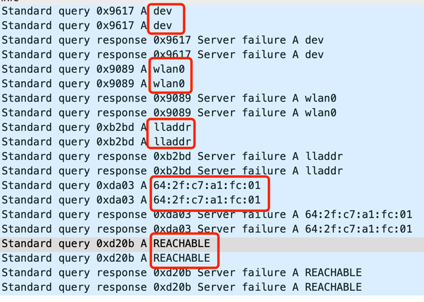
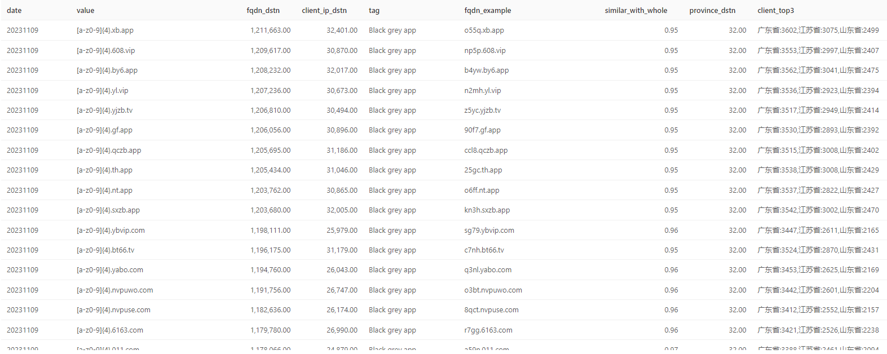

# 中国全网 DNS 错误数据分析

1.  [1.全球根服务器与中国递归解析服务器对比](#1%E5%85%A8%E7%90%83%E6%A0%B9%E6%9C%8D%E5%8A%A1%E5%99%A8%E4%B8%8E%E4%B8%AD%E5%9B%BD%E9%80%92%E5%BD%92%E8%A7%A3%E6%9E%90%E6%9C%8D%E5%8A%A1%E5%99%A8%E5%AF%B9%E6%AF%94)
    1.  [1.1 ICANN IHTI 根服务器数据](#11-icann-ihti%E6%A0%B9%E6%9C%8D%E5%8A%A1%E5%99%A8%E6%95%B0%E6%8D%AE)
    2.  [1.2 ​中国递归解析器数据](#12-%E2%80%8B%E4%B8%AD%E5%9B%BD%E9%80%92%E5%BD%92%E8%A7%A3%E6%9E%90%E5%99%A8%E6%95%B0%E6%8D%AE)
    3.  [1.3 非 ICANN 体系的应答](#13-%E9%9D%9Eicann%E4%BD%93%E7%B3%BB%E7%9A%84%E5%BA%94%E7%AD%94)
    4.  [（1）官方保留的特殊用途域名](#%EF%BC%881%EF%BC%89%E5%AE%98%E6%96%B9%E4%BF%9D%E7%95%99%E7%9A%84%E7%89%B9%E6%AE%8A%E7%94%A8%E9%80%94%E5%9F%9F%E5%90%8D)
    5.  [（2）局域网常用后缀](#%EF%BC%882%EF%BC%89%E5%B1%80%E5%9F%9F%E7%BD%91%E5%B8%B8%E7%94%A8%E5%90%8E%E7%BC%80)
    6.  [（3）云环境后缀](#%EF%BC%883%EF%BC%89%E4%BA%91%E7%8E%AF%E5%A2%83%E5%90%8E%E7%BC%80)
    7.  [（4）运营商后缀](#%EF%BC%884%EF%BC%89%E8%BF%90%E8%90%A5%E5%95%86%E5%90%8E%E7%BC%80)
    8.  [（5）配置错误](#%EF%BC%885%EF%BC%89%E9%85%8D%E7%BD%AE%E9%94%99%E8%AF%AF)
    9.  [（6）手机应用错误](#%EF%BC%886%EF%BC%89%E6%89%8B%E6%9C%BA%E5%BA%94%E7%94%A8%E9%94%99%E8%AF%AF)
    10.  [1.4 其他](#14-%E5%85%B6%E4%BB%96)
2.  [2.递归解析服务器 NXDOMAIN 中显著的域名模式](#2%E9%80%92%E5%BD%92%E8%A7%A3%E6%9E%90%E6%9C%8D%E5%8A%A1%E5%99%A8nxdomain%E4%B8%AD%E6%98%BE%E8%91%97%E7%9A%84%E5%9F%9F%E5%90%8D%E6%A8%A1%E5%BC%8F)
    1.  [2.1 一个案例](#21-%E4%B8%80%E4%B8%AA%E6%A1%88%E4%BE%8B)
    2.  [2.2 域名模式分析方法](#22-%E5%9F%9F%E5%90%8D%E6%A8%A1%E5%BC%8F%E5%88%86%E6%9E%90%E6%96%B9%E6%B3%95)
    3.  [2.3 显著域名模式的来源分析](#23-%E6%98%BE%E8%91%97%E5%9F%9F%E5%90%8D%E6%A8%A1%E5%BC%8F%E7%9A%84%E6%9D%A5%E6%BA%90%E5%88%86%E6%9E%90)
    4.  [（1）Chromoid](#%EF%BC%881%EF%BC%89chromoid)
    5.  [（2）Ads](#%EF%BC%882%EF%BC%89ads)
    6.  [（3）User tracing](#%EF%BC%883%EF%BC%89user-tracing)
    7.  [（4）Black grey app](#%EF%BC%884%EF%BC%89black-grey-app)
    8.  [（5）Blacklist service](#%EF%BC%885%EF%BC%89blacklist-service)
    9.  [（6）Device ID](#%EF%BC%886%EF%BC%89device-id)
    10.  [（7）Reverse DNS](#%EF%BC%887%EF%BC%89reverse-dns)
    11.  [（8）Reserved name: .local](#%EF%BC%888%EF%BC%89reserved-name-local)
    12.  [（9）FQDNs end with search suffix](#%EF%BC%889%EF%BC%89fqdns-end-with-search-suffix)
    13.  [（10）Others](#%EF%BC%8810%EF%BC%89others)
    14.  [2.4 自动化监控](#24-%E8%87%AA%E5%8A%A8%E5%8C%96%E7%9B%91%E6%8E%A7)
3.  [3.不同区域的 NXDOMAIN 差异](#3%E4%B8%8D%E5%90%8C%E5%8C%BA%E5%9F%9F%E7%9A%84nxdomain%E5%B7%AE%E5%BC%82)
    1.  [3.1 各省 NXDOMAIN 应答情况](#31-%E5%90%84%E7%9C%81nxdomain%E5%BA%94%E7%AD%94%E6%83%85%E5%86%B5)
    2.  [3.2 江西省 NXDOMAIN 分析](#32-%E6%B1%9F%E8%A5%BF%E7%9C%81nxdomain%E5%88%86%E6%9E%90)
4.  [结论](#%E7%BB%93%E8%AE%BA)

在电影《流浪地球 2》中，重启全球互联网的情节让观众印象深刻，影片中重启根服务器象征着全球 DNS（Domain Name System）解析服务的重新启动。在现实世界中，DNS 不仅承担着将域名转换为 IP 地址的常规解析任务，还经常接收到众多无效查询：不存在的域名，即 NXDOMAIN（Non-Existent Domain）。大量无效查询会影响用户上网体验，增加网络运营商负担，甚至某些情况下还会危及到各级 DNS 解析器的稳定性。

作为中国主要的 DNS 基础设施服务提供商之一，奇安信运营着国内规模最大的公共 DNS 解析系统和最大的公开的 PassiveDNS 系统。这赋予了我们广阔且清晰的视角，能够从全国范围内观测 DNS 运行状况，对 DNS 运作过程进行充分的分析和解读。本文依托奇安信公共 DNS 海量的递归解析数据，从 DNS 解析数据中一个关键指标——NXDOMAIN 数据入手，从中国视角出发对其进行全面分析。

文章共分为三个部分：第一部分比较了中国与全球 DNS 系统中错误域名查询的共性与差异，并探讨了这些差异的原因。第二部分从域名的视角出发，全面分析错误域名的产生原因及其影响。第三部分从地域的角度，对比中国不同省份在错误应答方面的差异及其成因。旨在更精准地理解并提升国内 DNS 系统的运行效率和安全性。

> NXDOMAIN（Non-Existent Domain，rcode=3）是一种特定的应答类型，表示查询的域名在 DNS 数据库中不存在。在诸多 DNS 错误应答类型中，NXDOMAIN 是最为常见的一种，其在所有 DNS 错误应答类型中占比超 90%。

## 1.全球根服务器与中国递归解析服务器对比

在开始分析之前，我们先看一下 DNS 查询层级中的顶级服务器——根服务器在 NXDOMAIN 应答方面的情况。我们以 L 根服务器为例进行说明。

### 1.1 ICANN IHTI 根服务器数据

国际互联网名称与数字地址分配机构 (ICANN) 对 L 根服务器的查询进行分析，生成了[标识符技术健康指标](https://ithi.research.icann.org/graph-m3.html?ref=blog.xlab.qianxin.com)（ITHI）报告。下图显示了该报告中 2018 年 1 月至 2023 年 12 月期间 L 根服务器的各项指标演变情况。图中深色部分表示 NXDOMAIN 应答的查询比例，这一比例的波动范围在 50%-80% 之间。Geoff Huston 于 2023 年 7 月在 [APNIC 博客](https://blog.apnic.net/2023/07/12/measuring-nxdomain-responses/?ref=blog.xlab.qianxin.com)上通过比较 Chromoid 域名的趋势，分析了根服务器 NXDOMAIN 比例的波动原因。截至 2023 年 12 月，NXDOMAIN 应答的查询比例记录为 55.27%。


Figure 1 — NXDOMAIN ratio from L-root service. [Source](https://ithi.research.icann.org/graph-m3.html?ref=blog.xlab.qianxin.com).

下表（[Source](https://ithi.research.icann.org/graph-m3.html?ref=blog.xlab.qianxin.com#MetricM33)）展示了 L 根 NXDOMAIN 查询中排名前 20 的顶级域名（TLD）。

| rank | tld | % of all queries |
| --- | --- | --- |
| 1   | local | 7.292% |
| 2   | test | 1.944% |
| 3   | home | 1.163% |
| 4   | dhcp | 1.074% |
| 5   | lan | 0.999% |
| 6   | internal | 0.956% |
| 7   | ctc | 0.778% |
| 8   | bbrouter | 0.699% |
| 9   | arpa | 0.692% |
| 10  | localhost | 0.538% |
| 11  | localdomain | 0.522% |
| 12  | wifi | 0.475% |
| 13  | invalid | 0.336% |
| 14  | corp | 0.336% |
| 15  | jpg | 0.268% |
| 16  | svc | 0.238% |
| 17  | k8s | 0.215% |
| 18  | getcacheddhcpresultsforcurrentconfig | 0.205% |
| 19  | m4a | 0.200% |
| 20  | openstacklocal | 0.193% |

### 1.2 ​中国递归解析器数据

下图展示了奇安信递归解析器在 2021 年 7 月至 2023 年 12 月期间，每天所有 DNS 查询中返回 NXDOMAIN 应答的比例变化情况。其中，2023 年全年数据显示比例波动不大，维持在 14% 水平。相比之下，奇安信递归解析器的 NXDOMAIN 比例仅为 L 根服务器的四分之一。这一差异主要源于它们在域名系统中的角色和位置的不同：递归解析器位于域名系统最底层，直接服务于普通用户，经常遇到重复查询。这些服务器处理各种域名级别的请求，并通过缓存结果来优化解析速度。而根服务器则位于最顶层，不面向普通用户，重复查询相对较少。他们主要负责顶级域名的查询，这些查询中经常出现当前无法解析的顶级域名，从而导致更高的 NXDOMAIN 比例。


Figure 2 — NXDOMAIN ratio from QAX recursive resolver service.

下表展示了奇安信递归解析器的 NXDOMAIN 应答中查询排名前 20 的顶级域，表现为显著的偏态分布，仅`.arpa`域的 NXDOMAIN 查询数量就占全部 NXDOMAIN 查询的 30%（大量内网 IP 的 PTR 反向查询，见 3.2）。另外，一些使用广泛的有效顶级域如`.com`和`.cn`也出现在前 20 名中，这是因为递归解析服务器的 NXDOMAIN 应答是针对域名不存在而不是顶级域不存在，且`.com`的注册规模庞大，`.cn`域名（中国的 ccTLD）和我们获取数据的位置有关。它们的 NXDOMAIN 查询数量也随之增加。

| Rank | TLD | TLD Type | % of all queries | % of NXDOMAIN queries | % of de-duplicated NXDOMAIN FQDNs |
| --- | --- | --- | --- | --- | --- |
| 1   | arpa | ICANN | 4.1667% | 30.3167% | 6.7615% |
| 2   | com | ICANN | 3.7407% | 27.2168% | 33.1975% |
| 3   | cn  | ICANN | 0.9854% | 7.1698% | 4.2206% |
| 4   | net | ICANN | 0.7240% | 5.2681% | 4.7647% |
| 5   | org | ICANN | 0.6386% | 4.6464% | 2.0354% |
| 6   | ctc |     | 0.4406% | 3.2057% | 4.4355% |
| 7   | lan |     | 0.2126% | 1.5470% | 7.8800% |
| 8   | ru  | ICANN | 0.1744% | 1.2691% | 0.1990% |
| 9   | wifi |     | 0.1185% | 0.8622% | 1.0409% |
| 10  | cnp |     | 0.1115% | 0.8114% | 0.0000% |
| 11  | localdomain |     | 0.0936% | 0.6811% | 0.1458% |
| 12  | cc  | ICANN | 0.0921% | 0.6701% | 0.1510% |
| 13  | local |     | 0.0820% | 0.5968% | 2.6110% |
| 14  | xyz | ICANN | 0.0754% | 0.5487% | 0.6047% |
| 15  | top | ICANN | 0.0599% | 0.4359% | 0.3884% |
| 16  | dhcp |     | 0.0561% | 0.4082% | 0.3262% |
| 17  | 3132372e302e302e31 |     | 0.0548% | 0.3984% | 0.0000% |
| 18  | novalocal |     | 0.0545% | 0.3962% | 0.4084% |
| 19  | rl=http |     | 0.0520% | 0.3783% | 0.0000% |
| 20  | eu  | ICANN | 0.0456% | 0.3317% | 0.0551% |

### 1.3 非 ICANN 体系的应答

为了便于分析，我们将查询域名的 TLD 是否属于 ICANN 体系分为两大类别。在所有 NXDOMAIN 应答数据中，非 ICANN 体系的（即非标准的域名查询）占比大约为 19%。它们的产生原因多种多样，包括系统或网络设备存在配置缺陷、应用程序的 Bug、测试和沙盒环境遗留数据、用户误操作与非法篡改输入、以及其他未知原因导致的无效访问等等。细读本文的读者会发现，这些顶级域涉及多个主要厂商。我们已通过多种渠道与部分涉及厂商取得联系，他们对此都作出了积极的响应和改进。具体厂商名称在本文中不予列出。


Figure 3 — NXDOMAIN Response categorization by Top-Level Domain.

下表为非 ICANN 管理体系的 TLD 列表。

| Rank | NON-ICANN TLD | % of non-ICANN NXDOMAIN queries | Daily Queries Quantity Scale | Daily FQDNs Quantity Scale |
| --- | --- | --- | --- | --- |
| 1   | ctc | 16.73% | 1B+ | 10M+ |
| 2   | lan | 8.07% | 1B+ | 10M+ |
| 3   | wifi | 4.50% | 100M+ | 1M+ |
| 4   | cnp | 4.23% | 100M+ | <1k |
| 5   | localdomain | 3.55% | 100M+ | 100k+ |
| 6   | local | 3.11% | 100M+ | 10M+ |
| 7   | dhcp | 2.13% | 100M+ | 1M+ |
| 8   | 3132372e302e302e31 | 2.08% | 100M+ | 1   |
| 9   | novalocal | 2.07% | 100M+ | 1M+ |
| 10  | rl=http | 1.97% | 100M+ | 1   |
| 11  | comp | 1.50% | 100M+ | <1k |
| 12  | openstacklocal | 1.46% | 100M+ | 1M+ |
| 13  | 0   | 1.38% | 100M+ | 10k+ |
| 14  | localhost | 1.33% | 100M+ | 100k+ |
| 15  | home | 1.13% | 100M+ | 1M+ |
| 16  | \*\*\*-wlan-controller | 1.00% | 100M+ | 1   |
| 17  | url | 0.74% | 100M+ | <1k |
| 18  | br-lan | 0.62% | 100M+ | 1   |
| 19  | bbrouter | 0.55% | 100M+ | 100k+ |
| 20  | null | 0.49% | 10M+ | 10k+ |

与根服务器的列表进行对比，我们发现许多 TLD 在递归解析服务器的 TOP 列表中也有出现，但是其排名有显著差异。我们抽取其中几个 TLD，分析了他们产生的可能原因。

### （1）官方保留的特殊用途域名

`.local` 和 `.localhost`是官方保留的[特殊用途域名](https://www.iana.org/assignments/special-use-domain-names/special-use-domain-names.xhtml?ref=blog.xlab.qianxin.com)。其中，[`.local`](https://en.wikipedia.org/wiki/.local?ref=blog.xlab.qianxin.com) 域名专门保留用于多播 DNS（mDNS）环境，它在局域网中用作主机名的独有域名，可通过 mDNS 名称解析协议进行解析。然而，配置错误等原因可能导致这些查询误发送到公共 DNS 服务器。 [`.localhost`](https://en.wikipedia.org/wiki/Localhost?ref=blog.xlab.qianxin.com) 域名则保留用于环回（loopback）功能，其中`.localhost`用于指代访问该域名的当前计算机。

### （2）局域网常用后缀

`.lan`、`.wifi`、`.localdomain`、`.dhcp`、`.home`、`.bbrouter`这些通常用于私有或内部网络的默认 DNS 后缀，它们的使用取决于特定的网络环境、设备类型或组织偏好。

### （3）云环境后缀

`.openstacklocal`、`.novalocal` 用作云计算环境特定后缀。`.openstacklocal`用于 OpenStack 云计算平台管理的私有云或内部网络中，标识虚拟机和服务。`.novalocal`特别与 OpenStack 的 Nova 计算组件相关，用于自动分配给在 OpenStack 上创建的虚拟机的域名。

### （4）运营商后缀

上述列表中，`.ctc`占比最多，占全部非 ICANN 请求的 16.7%。统计发现，访问`.ctc`域名的客户端 IP 地址有 92% 来自中国某运营商的网络。该运营商定制版路由器登录的默认登录地址也是以 ctc 结尾，可以判断`.ctc`这一顶级域名主要被该运营商设备相关的内部网络和服务使用。


Figure 4 — Proportion of .ctc requests from different client sources.

### （5）配置错误

`.cnp`，`.3132372e302e302e31`（解码后为 127.0.0.1，即本地回环地址）,`.***-wlan-controller`, 和 `.br-lan` 等都是由网络或应用程序配置错误导致的特定域名的大量 NXDOMAIN 应答查询。

-   **.cnp**

`.cnp`是某厂家的云服务的几个子域名错误配置导致在正确的子域名后添加了“p”，造成了大量 NXDOMAIN 应答。

| .cnp FQDN | % of .cnp QUERIES | Daily Queries Quantity |
| --- | --- | --- |
| n-relay-ipc-txc-nj-00.\*\*\*cloud.com.cnp | 62.58% | 100M+ |
| n-txc-relay-ipc-nj-01.\*\*\*cloud.com.cnp | 24.13% | 100M+ |
| n-txc-relay-ipc-nj-00.\*\*\*cloud.com.cnp | 12.23% | 10M+ |
| txc-transmit-ipc-nj.\*\*\*clouds.com.cnp | 0.63% | 1M+ |
| n-txc-relay-tumscloud.\*\*\*cloud.com.cnp | 0.40% | 1M+ |
| txc-relay-ipc.\*\*\*cloud.com.cnp | 0.01% | 10k+ |

> **最新更新**：该厂商已在其环境中复现了这一问题，并正在积极进行定位分析。

-   **\*\*\*-wlan-controller**

`***-wlan-controller`，即“某品牌无线局域网控制器”。从 DNS 数据中看到，这个字符串是作为完整域名被大量查询，而不是作为其他域名的顶级域。

在某品牌路由器配置中，`***-wlan-controller`通常用作域名前缀，帮助无线接入点（AP）通过 DNS 方式动态发现并连接到无线局域网控制器（AC）。举个例子，在该路由器网络环境中，如果 DHCP 服务器配置的 AC 域名是`ac.example.com`，AP 获取这个域名后会自动在前面加上`***-wlan-controller`字符串，变成`***-wlan-controller.ac.example.com`去请求 DNS 解析，从而知道 AC 的 IP 地址。但从我们的 DNS 数据中发现这个字符串被单独大量查询，引起大量的错误应答，这就暗示着可能有配置错误或其他问题。结果就是 AP 找不到正确的 AC，这可能会影响网络的连通性和稳定性。

### （6）手机应用错误

`.asia11`，`.com11`，`.cn11`，`.eu11`，`.asianull`， `.comnull`， `.cnnull`，`.eunull`主要是由于某品牌手机某应用错误产生的大量查询请求。具体分析如下，

我们监控发现，顶级域如 `.asia11`，`.com11`，`.asianull`和 `.comnull` 模式相似，它们都是由常见的顶级域 `asia`、`com` 与后缀 `11` 或 `null` 结合而成，且应答频率也非常接近，搭配 `11` 后缀的请求比例均为 0.35%，而搭配 `null` 后缀的均为 0.14%+。与他们相关的域名请求总数高达数亿次/天，涉及的客户端 IP 数量高达千万级别。

| Rank | NON-ICANN TLD | % Non-ICANN NXDOMAIN Queries | Daily Queries Quantity Scale | Daily FQDNs Quantity Scale |
| --- | --- | --- | --- | --- |
| 25  | asia11 | 0.35% | 10M+ | <1k |
| 26  | com11 | 0.35% | 10M+ | <1k |
| 27  | cn11 | 0.35% | 10M+ | <1k |
| 28  | eu11 | 0.35% | 10M+ | <1k |
| 57  | comnull | 0.15% | 10M+ | 1k+ |
| 58  | cnnull | 0.14% | 10M+ | <1k |
| 59  | eunull | 0.14% | 10M+ | <1k |
| 61  | asianull | 0.14% | 10M+ | <1k |

这种现象与某手机厂家有关。该公司全球路由服务域名如下：


Figure 5 — global router service domain.

在该厂家设备（手机）请求这些官方域名的过程中，由于一些未知原因，这些域名被错误地添加了“11”或“null”后缀，例如将原本的请求 `grs.***cloud.com` 变更为 `grs.***cloud.com11`。这导致了大量的 NXDOMAIN 应答，进而使得像 `.asia11`, `.com11`, `.asianull`, 和 `.comnull` 这样的顶级域出现了异常高的请求量。

下图所示，这种错误域名查询的请求最早从 2022 年 6 月开始出现的，相同错误后缀的域名请求频率一致，以“11”后缀结尾的域名（`grs.***cloud.asia11`, `grs.***cloud.cn11`, `grs.***cloud.com11`, `grs.***cloud.eu11`）在图表中以重合的紫色线条呈现，其请求量从 2022 年 7 月 22 号开始突增。以“null”后缀结尾的域名（`grs.***cloud.asianull`, `grs.***cloud.cnnull`, `grs.***cloud.comnull`, `grs.***cloud.eunull`）在图表中以彼此重合的蓝色线条展现，其请求量从 2022 年 11 月 17 号开始突增。


Figure 6 — Request counts from QAX recursive resolver service.


Figure 7 — Request counts from QAX recursive resolver service.

我们通过测试定位到了触发此类查询的方式：使用该手机从顶端下滑菜单，就会发出这种路由服务域名带“11”或“null”后缀的域名查询请求。不同后缀和其版本有关。


Figure 8 — Test results of \*\*\* smartphone.

此外我们还关注到`grs.***cloud.eu`域名本身已经处在 NXDOMAIN 状态，但是在其官方支持列表中仍然存在。无论是哪种情况，海量的设备（手机）带来了无效的 DNS 查询，建议该厂家升级其系统，将其修正。

```plain
; <<>> DiG 9.11.4-P2-RedHat-9.11.4-26.P2.el7_9.13 <<>> grs.***cloud.eu
;; global options: +cmd
;; Got answer:
;; ->>HEADER<<- opcode: QUERY, status: NXDOMAIN, id: 59655
;; flags: qr rd ra; QUERY: 1, ANSWER: 0, AUTHORITY: 1, ADDITIONAL: 1

;; OPT PSEUDOSECTION:
; EDNS: version: 0, flags:; udp: 512
;; QUESTION SECTION:
;grs.***cloud.eu.             IN      A

;; AUTHORITY SECTION:
***cloud.eu.          8       IN      SOA     monkey.dnspod.net. enterprise3dnsadmin.dnspod.com. 1700034101 3600 180 1209600 180

;; Query time: 21 msec
;; SERVER: 10.46.36.5#53(10.46.36.5)
;; WHEN: Wed Dec 13 17:55:59 CST 2023
;; MSG SIZE  rcvd: 129
```

> **最新更新：**针对这个现象，我们向该公司应急响应团队进行了反馈，得到了积极的响应，并将分析结论做了及时的沟通。根据最新反馈，团队定位到具体原因是应用配置问题所致。同时，`grs.***cloud.eu` 域名状态在反馈后不久也已经恢复正常。

### 1.4 其他

我们还发现了少量顶级域属于“Opennic”、“Tor”和“Namecoin”域名空间的查询。一般来说，这些顶级域不会泄漏到公共 DNS 解析体系中。它们的出现可能是因为错误的配置（比如一些测试沙箱）或者错误的使用（非 tor 浏览器尝试链接 tor 域名）导致的。

| Tag | TLD | % of Non-ICANN NXDOMAIN Queries | Daily Queries Quantity Scale | Daily FQDNs Quantity Scale |
| --- | --- | --- | --- | --- |
| OpenNIC | null | 0.4914% | 10M+ | 10k+ |
| Tor | onion | 0.0054% | 1M+ | 1k+ |
| OpenNIC | o   | 0.0014% | 100k+ | 1k+ |
| Namecoin | bit | 0.0002% | 10k+ | 10+ |
| OpenNIC | oss | 0.0002% | 10k+ | 10+ |
| OpenNIC | pirate | 0.0001% | 10k+ | <10 |
| OpenNIC | geek | 0.0001% | 10k+ | 10+ |
| OpenNIC | libre | 0.0001% | 10k+ | 10+ |
| OpenNIC | gopher | 0.0001% | 10k+ | <10 |
| OpenNIC | bbs | 0.0000% | 1k+ | 10+ |
| OpenNIC | parody | 0.0000% | 1k+ | <10 |
| OpenNIC | dyn | 0.0000% | 1k+ | 10+ |
| OpenNIC | indy | 0.0000% | 1k+ | <10 |
| OpenNIC | chan | 0.0000% | <1k | 100+ |
| OpenNIC | oz  | 0.0000% | <1k | 100+ |
| OpenNIC | cyb | 0.0000% | <1k | 10+ |
| OpenNIC | neo | 0.0000% | <1k | 10+ |

## **2.递归解析服务器 NXDOMAIN 中显著的域名模式**

前面已经提过，产生 NXDOMAIN 域名的原因多种多样。在本节分析之前，我们先看一个例子。

### **2.1 一个案例**

2022 年 9 月，我们收到互联网某根服务器运营团队提供的线索，他们发现全球部分根服务器上出现了海量的来自中国的以 MAC 地址形式的 DNS 查询。对比我们的监控数据核查，发现 DNS 日志中确实存在大量此类查询。自 8 月 19 日起，这种以 MAC 地址形式的查询不断涌入 DNS 系统，递归解析服务器上的日请求量一度飙升至近 20 亿次。深入分析后，我们发现这一异常是由某头部电商平台手机 APP 中的一个功能缺陷所引起，该缺陷使得使用该 APP 的用户在无意中将自己的 MAC 地址发起 DNS 查询。该 APP 庞大的用户基数导致递归解析服务器及根服务器出现海量此类异常查询。定位到原因后我们向相关部门报告了这一问题，在 9 月 18 日该 Bug 被修复后，此类查询便随之消失。


Figure 9 — MAC address request counts from QAX recursive resolver service.

#### 关联分析过程

通过数据关联分析发现，在发出 MAC 类 DNS 请求域名的同时，也会有`dev`，`wlan0`， `lladdr`，`reachable`的 DNS 请求出现，同时这些 DNS 请求也会关联到某头部电商平台的域名。



Figure 10 — Mac class domain DNS requests.

通过搜索这些关键词，找到了这些词是在查看[Wi-Fi 连接热点](https://www.codenong.com/cs105311206/?ref=blog.xlab.qianxin.com)状态时显示的内容。Android 系统可以通过 [ip neigh show](http://linux-ip.net/html/tools-ip-neighbor.html?ref=blog.xlab.qianxin.com) 查看链接 Wi-Fi 热点的实时状态。


Figure 11 — IP neigh show command details.

利用这些特殊的串分析发现，在这些域名的请求前后，几乎都有某电商平台的域名，如下图所示。经过测试验证，确认这些请求与该电商平台确实存在关联。应该是该电商平台应用程序在检查 Wi-Fi 热点链接情况时，对返回的结果进行处理的过程中存在程序缺陷。这导致了对所有返回结果（`dev`，`wlan0`，`lladdr`，`MAC地址`）执行 DNS 查询，进而使得根服务器收到大量以 MAC 地址格式的 DNS 查询请求。


Figure 12 — Dev, wlan0, lladdr request before and after details.

### 2.2 域名模式分析方法

在第一节的分析中，我们重点关注了 NXDOMAIN 应答比例和顶级域（TLD）的分布，提供了对 NXDOMAIN 数据的宏观视角。然而，这种分析局限于域名结构的最高级别，尚未触及更具体的域名层级。正如 2.1 案例所揭示的，MAC 地址格式的大量查询暴露了对于更细致域名层级分析的需求。这种分析对于识别和理解特定模式的域名所引发的异常网络行为至关重要。

事实上，DNS 递归解析器也会对 NXDOMAIN 应答的查询域名进行缓存 ([RFC 2308](https://datatracker.ietf.org/doc/html/rfc2308?ref=blog.xlab.qianxin.com))。当处理针对单一域名的大量查询时，服务器能够高效利用缓存机制。一旦域名解析结果被缓存，对该域名的后续查询就能快速响应，从而避免重复解析。然而，在面对众多不同域名的大量查询时，缓存效率显著降低，因为服务器需要为更广泛的域名进行频繁的缓存更新和维护。

鉴于此，本节将从域名的角度进行更深入的分析，专注于识别 NXDOMAIN 应答中显著的域名模式，来分类和识别网络中相似的域名形态。使我们能够更全面地理解网络中各种域名的特征及其产生的根本原因。这种细致的分析不仅有助于揭示和理解异常网络行为，还对优化 DNS 服务器的性能和维护整体网络安全具有重要意义。

一般来说，当大量 NXDOMAIN 异常应答发生时，对应的查询域名在其域名结构上通常有一定的模式。因此我们首先对 NXDOMAIN 应答中的 Rname(FQDN）进行泛化，识别出具有类似模式（pattern）的域名；然后，对这些模式进行进一步的归纳和总结，并深入探究了其产生的原因。

具体方法：

1.  **分解域名为 Grams**: 将所有 NXDOMAIN 域名基于特殊字符（如“.”、“\_”、“\*”、“&”、“-”等）拆分成片段，称为“grams”。例如，将`djhsa.example-inc.com`拆分为“djhsa”，“example”，“inc”，“com”。
2.  **统计和过滤关键 Grams**: 对所有 grams 的出现频次进行统计。然后根据预设的阈值筛选出关键 grams，即 NXDOMAIN 域名中的关键词。
3.  **泛化域名为 Pattern**: 对每个域名进行泛化处理，保留其中的关键词和特殊字符。其余部分根据字符类型和长度泛化为类似“\[a-z\]{n}”或“\[0-9\]{n}”的模式。例如，`djhsa.example-inc.com`泛化为`[a-z]{5}.example-inc.com`。
4.  **聚合、观察和分类 Pattern**: 将所有泛化后的模式进行聚合，然后对出现频繁的模式进行进一步观察和分析。最后，根据分析结果，基于这些模式的特征并提炼出规则。

### 2.3 显著域名模式的来源分析

我们对奇安信递归解析器所收集的国内的每日数亿个独特 NXDOMAIN 域名进行了为期近 5 个月的持续监控和分析。分析发现，产生大量 NXDOMAIN 域名的原因主要分为两大类：软件应用引起的以及系统配置引起的。应用问题引起的比如：Chromoid，Ads，User tracing，Black grey app，Blacklist service 等；配置问题引起的如：Device ID，Reverse DNS，FQDNs end with search suffix 等。每种类型的具体分布如下图所示：

> 监控期间，我们注意到域名的形态相对稳定。基于这一观察，我们选择了特定日期 2023 年 11 月 9 日的数据来进行详细分析和图示。为了提升 pattern 的可读性和视觉效果，我们将 pattern 中将常见的类型，如 IPv4 地址、IPv6 地址、通用唯一识别码和哈希值，替换为简化的标识符，如“IPV4”，“IPV6”，“UUID”，和“HASH”。


Figure 13 — Prominent domain patterns in NXDOMAIN (unique by FQDN).

图中第一层表示 QAX 递归解析器中所有唯一的 NXDOMAIN 域名（基于 FQDN 去重）。第二层展示了我们标记的各类别域名的比例。第三层则详细显示了不同类别的具体域名模式（pattern）及其占比。下面我们尝试对每种类型产生的原因和可能的影响进行分析和说明：

### （1）Chromoid

Chromoid 是 Google Chrome 浏览器为了测试当前网络环境是否存在 DNS 劫持等网络异常所发出的长度在 7-15 位随机字母字符串 DNS 查询。[Chrome 87 版本之后，修改了该检测方法](https://bugs.chromium.org/p/chromium/issues/detail?id=1090985&ref=blog.xlab.qianxin.com)，目前这种类型的请求占比已经较少，占总数量的 1.59%。关于 Chromoid 域名测量的详细信息，请参考 APNIC 的[这篇优秀的文章](https://blog.apnic.net/2020/08/21/chromiums-impact-on-root-dns-traffic/?ref=blog.xlab.qianxin.com)。

### （2）Ads

Ads 是与广告相关的子域名。主要的两组模式为： 
`UUID-xxxxxxxxxxxxxxxxxxxxxxxxxxxxxxxx.afdback.ptqy.gitv.tv   UUID-xxxxxxxxxxxxxxxxxxxxxxxxxxxxxxxx.afdback.ppsimg.com`

其中，“afdback”为广告回传的缩写（advertisement feedback），表明这些子域名与广告相关的数据回传有关。`gitv.tv`和`ppsimg.com`这两个域名都与网络电视业务相关。“ptqy”的出现指向智能网络电视上的某视频应用。经分析，这些特殊结构的域名是该电视应用为了获取用户当前所用 DNS 服务器的相关信息而产生的。

如下图所示，我们分析了其 apk 运行时的网络流量：


Figure 14 — Requests and responses for the afdback domain.

在第一次返回的 json 串中，“dns\_url”字段中包含了一种特殊格式的域名，即`UUID-xxxxxxxxxxxxxxxxxxxxxxxxxxxxxxxx.afdback.ppsimg.com`，这正是我们在 DNS 数据中所观察到的。每个请求都会生成一个不同的 UUID，绕过 DNS 缓存，从而使 ppsimg.com 的权威服务器能够接收到所有相应的 DNS 请求。因此，该服务器能够辨别出与每个 UUID 相关的 DNS 服务器详细信息，从而有效识别出每个 DNS 请求的来源。

接下来，客户端应用程序以相同的 UUID 发出 HTTP 请求（上图中的第二次 GET），web 服务器能够得到 UUID 对应用户的 IP 地址。通过 UUID 作为关联，可将用户的出口 IP 和其所用的 DNS IP 进行关联，如第二次响应中的信息。

```plain
{
  "version": "2020-08-19 v0.0.4",
  "ID": "15f765ac-ebdbd888433e-0abd1306-xxxxxxxxxxxxxxxxxxxxxxxxxxxxxxxx",
  "SN": "0abd1306",
  "USERIP": "35.221.56.251",
  "USER_AREA": "OVERSEA|US",
  "USERDNSIP": "74.125.18.2",
  "USERDNS_AREA": "GOOGLE |Public_DNS"
} 
```

通过以上分析不难看出，递归解析服务器上观察到的众多与该电视应用广告相关的一次性且不存在的域名，其目的并非真正的网络访问，相反，它们的目的在于通过 DNS 查询来收集用户当前环境所使用 DNS 服务器 IP，以便根据用户的位置优化访问其业务的网络性能。

### （3）User tracing

User tracing 是用户跟踪相关域名。pattern 主要为`UUID.clo.footprintdns.com`，`v17-[A-Z0-9]{8}.z.irs01.com`等。它们主要与用户访问足迹、网络追踪相关。通过这些跟踪相关的子域名查询，可以分析得到用户的浏览网页、停留频次、访问来源等数据，用于行为分析、广告定向等目的。

### （4）Black grey app

Black grey app 是与黑灰产相关的域名，这类模式中的域名数量、客户端来源等指标高度一致。



Figure 15 — Domain patterns and request details.

如果直接访问这些模式中的某些二级域名，如 `608.vip`,会自动跳转至赌博应用的下载页面。出现这么多模式相似的 NXDOMAIN 子域名，猜测可能是同行倾轧，利用随机子域名方式攻击对方的域名。


Figure 16 — The webpage of 608.vip.

### （5）Blacklist service

Blacklist service，黑名单服务相关子域名。从我们的 pattern 中发现了不同服务商多种维度过滤垃圾内容。这些服务包括：

-   [DNSBL](https://en.wikipedia.org/wiki/Domain_Name_System_blocklist?ref=blog.xlab.qianxin.com) (DNS-based Blackhole List) 服务，如`IPV4.bl.spamcop.net`和`IPV4.zen.spamhaus.org`，通过 DNS 查询机制来检查发件人的 IP 地址是否被列入垃圾邮件发送者的黑名单。
-   [URIBL](https://www.securitygateway.com.cn/zh/uri_blacklists_uribl.htm?ref=blog.xlab.qianxin.com) (Uniform Resource Identifier Blacklist) 服务，如`[a-z0-9]{8}.uribl.spameatingmonkey.net`，根据邮件内容（通常为域名或网站）阻止垃圾邮件。
-   [HASHBL](https://msbl.org/hashbls.html?ref=blog.xlab.qianxin.com) (Hash-based Blackhole List) 服务，如`[a-z0-9]{8}.ebl.msbl.org`，将阻止列表数据存储为单向加密哈希，来判断是否接受、过滤或拒绝入站电子邮件。
-   ......

这些 pattern 下的域名专门用于识别和阻止垃圾邮件、网络钓鱼和其他恶意网络活动。每个域名代表一个特定的服务或数据库，通过检查发件源 IP 地址、邮件服务器、网站 URI 等信息在这些黑名单或威胁情报源中是否被标记或有不良记录，来判断发件人、网站或链接的可信度和安全威胁级别，从而过滤垃圾内容、阻止攻击。

### （6）Device ID

Device ID 是与设备 id 相关的子域名，主要的 pattern 为`[0-9]{10}.HASH.device.hiwifi.com`，“HIWIFI”是一款无线路由，这类子域名可能被用于区分和管理连接到该型号无线路由器的下属设备，也可能用于设备身份验证或某些特定用途的通信。

### （7）Reverse DNS

Reverse DNS 是反向域名解析的子域名，pattern 为`IPV4.in-addr.arpa`和`IPV6.ip6.arpa`。反向域名解析是一种特殊的 DNS 服务，它使用 PTR 记录（Pointer Record）来将 IP 地址转换回相应的域名。简单来说，它做的事情正好与常见的 DNS 解析相反：通常 DNS 将域名解析为 IP 地址，而反向域名解析则是从 IP 地址找到对应的域名。

### （8）Reserved name: .local

Reserved name: .local 表示顶级域为`.local`的所有域名。域名`local`是专为 mDNS 环境预留的特殊域名，与公共 DNS（单播 DNS）的用途不同。在这里，我们将其单独分类，目的在于深入分析和关注其在公共 DNS 中的域名形态，并分析其泄漏到公共 DNS 的原因。

下图详细展示了递归解析器中所有以 local 为顶级域的域名分布情况。图中第一层为所有顶级域为 local 的域名，第二层显示了这些域名中不同模式（pattern）的占比，而第三层则展示了子模式（sub-pattern）的比例，以及各个子模式下具体域名的示例。


Figure 17 — .local domain patterns in NXDOMAIN (unique by FQDN).

从上图中可见，以`.local`为顶级域的所有域名中，`UUID.local`占 94%，这意味着大多数带有`local`后缀的域名都遵循`UUID.local`的格式出现。

下图展示了`UUID.local`模式域名的发展趋势，虽然我们无法确定其最初出现的时间点，但通过我们的公共 DNS 数据，可以观察到其数量的变化规模。


Figure 18 — Trend of UUID.local

图中红色条形图代表请求次数，其规模达到亿级/天，对应图表左侧的纵坐标；绿色条形图显示了该模式域名的数量，规模为千万级/天，同样对应左侧纵坐标；而蓝色曲线则表示发起请求的客户端数量，数量级在百万级别/天，对应右侧纵坐标。

通过深入分析发现，在一个[解决 WebRTC 泄漏隐私的方案](https://datatracker.ietf.org/doc/html/draft-ietf-mmusic-mdns-ice-candidates?ref=blog.xlab.qianxin.com)中，会产生`UUID.local`，而其大量的出现在互联网上可能与使用某个开源组件 Bug 或 WebRTC 版本兼容性问题有关。

#### **UUID.local 的产生**

WebRTC 允许网络浏览器和移动应用程序添加实时音频和视频点对点连接和通信功能，这项技术支持用户直接在浏览器和移动应用中访问，并利用其点对点连接功能进行直播连线等交互活动。但[WebRTC 存在泄露隐私的风险](https://bloggeek.me/psa-mdns-and-local-ice-candidates-are-coming/?ref=blog.xlab.qianxin.com)，他会暴露用户的真实 IP（公共 IP 和私有 IP）。

为解决私有 IP 被泄露的问题，有一个 [IETF 草案](https://datatracker.ietf.org/doc/html/draft-ietf-mmusic-mdns-ice-candidates?ref=blog.xlab.qianxin.com)。具体地，通过使用动态生成的 mDNS 名称隐藏 IP 地址来实现的。启用该方案后，当使用 WebRTC 进行实时音频和视频点对点连接和通信时，它会在本地网络广播其 mDNS 名称，即`UUID.local`，其中 UUID 代表一个随机生成的唯一标识符。


Figure 19 — Domain broadcasting of UUID.local mode in mDNS.

mDNS 的请求的目的地址是一个固定的多播地址 224.0.0.251，正常来说这种流量不会泄漏到公共 DNS 环境中。

#### UUID.local 泄漏的分析

为了能够进一步定位分析在公共递归网络中出现大量`UUID.local`的原因。我们在本地网络搭建了一个自己开发的 DNS 流量分析系统，它能够将手机，PC 等多种网络设备的 DNS 流量按照多维度的方式进行分析。

结合 WebRTC 的应用场景，我们猜测可能会跟视频网站或者目前比较火爆的直播有关。测试了 B 站，快手，抖音等几个热门的视频应用之后发现，其中某个应用的安卓版本的直播模块会触发`UUID.local`的 DNS 请求。

从下图中可以看到出现`UUID.local`的 DNS 请求发生之前的请求域名都是该视频应用相关的域名，尤其是 stun 相关的部分显示用于穿透 NAT 构建点对点通信的协议，是支持 WebRTC 协议的一个重要技术。


Figure 20 — Domain queries of UUID.local mode in DNS.

结合 DNS 流量分析以及对 APP 的分析，我们猜测可能的原因主要有三种：

1.  **配置错误**：该应用安卓版本的 APP 在直播模块使用 WebRTC 时，没有正确的构建 mDNS 请求地址（即 224.0.0.251），还是使用的普通 DNS 地址，导致其泄漏到了公网。
2.  **开源组件错误**：该应用安卓版本的 APP 在直播模块使用了某个开源的 WebRTC 实现，该实现可能有一定的漏洞，导致其会出现 mDNS 请求泄漏到公网的情况。
3.  **兼容性问题**：通信双方的 WebRTC 版本的差异可能会导致 mDNS 以单播的形式通告到大网。


Figure 21 — Details of the [IETF Draft](https://datatracker.ietf.org/doc/html/draft-ietf-mmusic-mdns-ice-candidates?ref=blog.xlab.qianxin.com#name-backward-compatibility)

具体的原因暂时无法进一步定位了，不过从`.local`的 pattern 分布来看，后两者的可能性更大一些，毕竟在公共 DNS 上看到的除了`UUID.local`格式以外，其他以`.local`为后缀的域名比较少见。另外从 L 根服务器公开的数据显示，`.local`是其错误应答中占比最大的；在[1.1.1.1 的错误请求](https://blog.apnic.net/2023/07/12/measuring-nxdomain-responses/?ref=blog.xlab.qianxin.com)中，`.local`的占比也是最大的，这可能暗示全球 WebRTC 使用中存在类似的问题。

> **最新更新**：我们与该视频应用安全团队取得联系。对于我们提出的问题，他们进行了深入的分析，在最新版本的 APP 中问题已经得到了解决。值得一提的是大网上观察到的 `UUID.local` 查询量并没有显著减少。这表明问题不仅限于单一公司，更可能是某个广泛使用的开源组件所引发的普遍问题。

### （9）FQDNs end with search suffix

FQDNs end with search suffix 是附加了搜索域后缀的域名。当用户查询的域名在 DNS 中不存在时，系统会自动尝试在域名后加上所配置的搜索域后缀，再次发起 DNS 请求。这些搜索后缀的设置通常与特定的网络环境、操作系统或设备类型相关联。

以下列表展示了在 pattern 中发现的一些常见搜索域后缀：

| No. | Suffix |
| --- | --- |
| 1   | smartont.net |
| 2   | ctc |
| 3   | wifi |
| 4   | lan |
| 5   | dhcp |
| 6   | local |
| 7   | home |
| 8   | huawei.com |
| 9   | router.ctc |
| 10  | airdream |
| 11  | bbrouter |
| 12  | tendawifi.com |
| 13  | realtek |
| 14  | openstacklocal |
| 15  | mshome.net |

我们选取前 5 个搜索域后缀做具体说明，下方的桑基图详细展示了这些搜索域的分布情况。图中第二层展示了每个搜索域的域名比例，第三层展示了每个域内的子分类（tag）以及第四层它们的具体域名模式（pattern）。


Figure 22 — FQDNs end with search suffix in NXDOMAIN.

我们可以观察到：

1.  图中主要展示了五个搜索域后缀详细分布，`lan`是局域网常用默认后缀，`smartont.net`和`ctc`与运营商有关，`wifi`常见于 WiFi 设备，`dhcp`常见于动态分配的网络环境。
2.  在不同搜索域中，许多域名模式展现出相似性。例如，`Chromoid(.suffix)`代表了带有特定搜索域后缀的 Chromoid 域名，同样的模式也出现在`Ads(.suffix)`和`UUID.local(.suffix)`等其他域名中。在这种模式下，相同来源的域名通过添加其各自特定的搜索域后缀，形成了独特的结构。这种现象说明，特定类型的域名模式在跨搜索域中普遍存在。
3.  也有一些域名模式仅出现在特定搜索域中，例如`Device ID(.suffix)`仅出现在 lan 搜索域。这可能反映了这些域名与特定搜索域的内在关联。具体而言，`Device ID(.suffix)`仅存在于`.lan`搜索域中，这暗示该路由（hiwifi.com）设备的默认搜索域后缀可能为`.lan`。

### （10）Others

我们已经完成了对前面 9 个类别模式的归因分析。下表中所展示的是除了这些类别之外的其他 pattern。这部分未识别的 pattern 是我们后续需要重点关注的部分。

| Pattern | Daily FQDNs Quantity Scale | FQDN Example |
| --- | --- | --- |
| \[a-z0-9\]{8} | 1M+ | e23c753e |
| \[a-z0-9\]{8}.test | 1M+ | 001eab65.test |
| \[a-zA-Z0-9\]{17}.mdbook.cn | 1M+ | 50d3d5c8fdb0d5a70f1c4c65d.mdbook.cn |
| \[a-z0-9\]{4}.kaiyun.com | 1M+ | 6u3b.kaiyun.com |
| &ver=\[0-9\]{1}&id=\[A-Z0-9\]{11} | 1M+ | &ver=1&id=1782071404875474966 |
| \[a-z0-9\]{24}.jpg | 100k+ | gkwrimaiw418aaaknwjr6oxv.jpg |
| \[a-z0-9\]{4}.baidu.com | 100k+ | rjd6.baidu.com |
| \[a-z0-9\]{4}.spd-inv.net | 100k+ | kd0i.spd-inv.net |
| \[a-zA-Z0-9\]{16}.mdbook.cn | 100k+ | a0ea7053ca2143937c3d4c65.mdbook.cn |
| \[a-z0-9\]{4}.baidu2.com | 100k+ | s4ef.baidu2.com |
| \[a-z0-9\]{4}.baidu3.com | 100k+ | f8lt.baidu3.com |
| \[a-z\]{4}.kaiyun.com | 100k+ | fnud.kaiyun.com |
| IPV4 | 100k+ | 192-168-201-167 |
| inst-\[a-z0-9\]{29}-\[a-z0-9\]{16} | 100k+ | inst-zef83nzhzf96vbz5eccmccnnapkvm-b6v3ytbfqjvq32td |
| \[a-z\]{4}.baidu.com | 100k+ | lfjr.baidu.com |
| \[a-z0-9\]{9}.dyn.telefonica.de | 100k+ | x4db29bb2.dyn.telefonica.de |
| \[a-z\]{4}.spd-inv.net | 100k+ | iltg.spd-inv.net |
| \[0-9\]{7}.b2b.jinanfa.cn | 100k+ | 2233615.b2b.jinanfa.cn |
| \[a-z\]{4}.baidu2.com | 100k+ | lxwi.baidu2.com |
| \[a-z0-9\]{11} | 100k+ | 47636zdl709 |

### 2.4 自动化监控

为了能够自动化的做到对 NXDOMAIN 应答数据的跟踪。我们通过对错误应答数据（是的，涵盖了主要的错误的 rcode 类型）进行监控，并通过 2.2 节介绍的方法实现了对各类错误和异常数据的监控。具体来说：

1.  将 NXDOMAIN 应答数据中对应的查询域名从其构成上分为已识别 pattern 和未识别 pattern 分别进行监控。其中，已识别 pattern 是指我们在历史数据中已经观察到并将其打上具体标签的域名模式；未识别 pattern 则是新出现的或者未关注到（一般来说量比较少的不会关注到）的模式。
2.  无论是已识别 pattern 还是未识别 pattern，只要起所代表的错误应答数据出现了较大的增长，都值得分析起产生的原因。尤其是对未识别 pattern，需要我们深入分析是否是新出现了某一类 pattern 的大量请求所导致的。进而可以对能够确定产生原因的情况进行告警和处置。

通过这种方式，我们可以做到对于 DNS 数据中类似电商平台发送用户 MAC 地址那种错误出现的时候的及时发现。

## **3.不同区域的 NXDOMAIN 差异**

### 3.1 各省 NXDOMAIN 应答情况

由于各省份收集的 DNS 查询请求数据量存在差异，直接比较 NXDOMAIN 查询绝对数量的占比无法反映真实情况。为了公平比较不同省份的 NXDOMAIN 查询比例，我们采用“各省 NXDOMAIN 查询数量占该省总查询数量的百分比”作为指标。通过计算每个省内的 NXDOMAIN 查询占比，可以排除不同省份 DNS 查询数据量级的影响，更准确地反映出各省 DNS 解析质量的实际情况。（由于中国港澳台地区的数据量较少，不具有代表性，故不包括在此分析中。）

下图显示了 2023 年 8 月 -12 月不同省份内 NXDOMAIN 查询占比的时间序列图。其中不同颜色曲线表示不同的省份。从图 1 可以看出，大多数省份的 NXDOMAIN 查询占比维持在 (14±5)%的波动范围内。然而值得注意的是，江西省的 NXDOMAIN 查询占比最高，约为 24%，这一水平与其他省份相比存在明显的差异。


Figure 23 — NXDOMAIN response rates within each province from QAX recursive resolver service.

上图中某天的详细占比如下。


Figure 24 — NXDOMAIN response rates within each province from QAX recursive resolver service.

### **3.2 江西省 NXDOMAIN 分析**

我们利用第二节中的域名分析方法，对来自江西省的 NXDOMAIN 查询域名进行分类，分析发现，类似`IPV4.in-addr.arpa`这种逆向查询的数量非常高，占江西省所有 NXDOMAIN 查询的 60% 以上。


Figure 25 — Proportion of reverse DNS in NXDOMAIN responses in Jiangxi Province.

**逆向查询域名**

将江西省所有 NXDOMAIN 数据中逆向查询域名的前缀进行反转，提取出对应的 IP 地址，记为查询 IP。对查询 IP 进行统计，发现主要为 192.168 等内网私有地址，占逆向查询总量的 93%，这说明这些逆向查询主要来自内部或局域网的请求。当我们用相同的方法对全国数据进行分析时，内网地址的逆向查询比例也达到了 56%，表明这种情况不仅限于江西省。


Figure 26 — Proportion of reverse DNS queries from Private IP as source IP in NXDOMAIN queries.

从发起这些查询请求的客户端来源看，92% 的请求来自某运营商的 IP，进一步分析发现，这部分 IP 大多属于该运营商的家庭宽带，数十万级别。


Figure 27 — Proportion of reverse DNS queries by different client sources in NXDOMAIN queries.

综上分析可知，江西省 NXDOMAIN 占比高的主要原因，是大量内网 IP 发起的逆向 DNS 查询造成的，而发起查询的客户端也以某运营商的家庭宽带 IP 为主。拉长时间线，来看看这个现象是从什么时间开始的？

下图展示了江西省在 2022 年和 2023 年这两年间，每月 1 号的 DNS 查询统计结果。


Figure 28 — NXDOMAIN response rate within Jiangxi Province.

图中呈现了两条时间序列曲线：蓝色曲线表示省内 NXDOMAIN 应答的 DNS 查询占省内所有 DNS 查询的百分比；红色曲线表示省内 NXDOMAIN 应答的逆向 DNS 查询占省内所有 DNS 查询百分比。观察红色曲线的变化可知，在 2022 年 6 月及以前，逆向 DNS 查询占比很低，均在 5% 以下，到了 2022 年 7 月急剧上升至 21%，之后略有下降但维持在 10% 左右 (2023 年 3 月 1 日)，从 2023 年 2 月至今，逆向查询占比稳定在 16% 左右。这表明 2022 年 7 月前后，逆向 DNS 查询发生显著变化，占比大幅提升并持续保持在较大比例。

从 NXDOMAIN 应答比例的时间变化以及之前曾经出现过的案例\[[2](https://github.com/AdguardTeam/AdGuardHome/issues/3157?ref=blog.xlab.qianxin.com)\]\[[3](https://discourse.pi-hole.net/t/analysing-excessive-dns-ptr-requests-from-router/50483/9?ref=blog.xlab.qianxin.com)\] 来推测，江西省 NXDOMAIN 应答请求占比较高的异常情况猜测是由于该地区运营商提供的某种网络设备（路由器或者无线设备）存在不当配置所导致。

> **最新更新**：监控发现，2023.12.27 之后，江西省的对应的 NXDOMAIN 应答比例已经降低到 14% 左右，恢复到了正常水平。 

## 结论

1.  我们的递归解析服务器上的 NXDOMAIN 应答比例在 14% 左右，其中 81% 的 NXDOMAIN 应答来自 ICANN 体系的域名查询，主要是 `.arpa` 和 `.com` 域，非 ICANN 体系的查询占 19%， `.ctc` 比例最高。
2.  对比递归解析器和根服务器上查询最多的非 ICANN 顶级域（无效 TLD），发现存在许多重叠，但这些 TLD 的查询量排名却有显著差异，主要原因是我们采集数据的地理区域比较集中。
3.  DNS 查询中产生的 NXDOMAIN 应答的域名来源主要可以划分为两大类：软件应用引起和系统配置引起。应用问题包括黑名单服务、黑灰产业、Chromoid、用户跟踪和广告追踪等；配置问题包括设备 ID 查询和内网 IP 反向查询等。
4.  在公共 DNS 中，保留域名 `.local` 主要以 `UUID.local` 的模式出现。分析发现，`UUID.local` 域名用于在使用 WebRTC 技术时隐藏内网 IP 地址，并且仅在 mDNS 环境中进行广播。它们泄露到公共 DNS 的现象可能与某个开源库中的 Bug 有关。
5.  从地理区域来看，江西省内 NXDOMAIN 应答比例为 23%，明显高于其他省份。分析发现超过 60% 的错误查询来自某运营商客户端对内网 IP 的 PTR 查询，可能因为当地网络设备的配置原因所致。
6.  我们构建了自动化监控系统，从应答比例、TLD 分布、模式分析、区域客户端等角度，可以及时发现错误应答异常。在覆盖用户如此广泛的数据集上做这种监控，可以帮助我们更好的看清 DNS 网络运行的状态，无论对个人，厂商，运营商还是政府监管部门都有着重要的意义。
