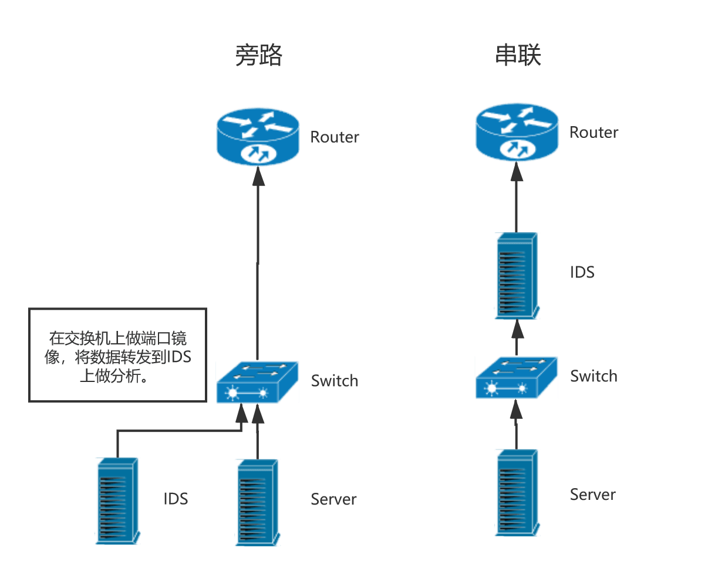
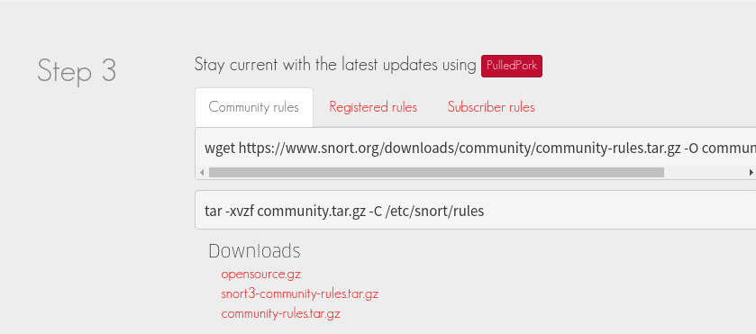
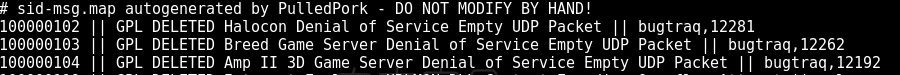
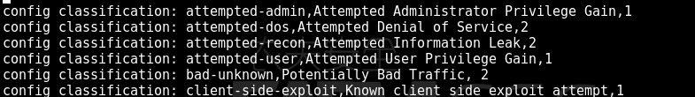
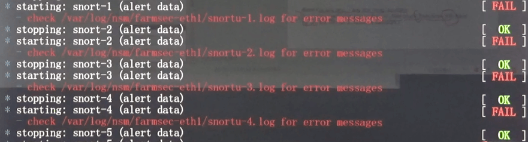

# [主机安全](https://www.raingray.com/archives/2725.html)

## 目录

-   [目录](#%E7%9B%AE%E5%BD%95)
-   [简介](#%E7%AE%80%E4%BB%8B)
-   [安全基线](#%E5%AE%89%E5%85%A8%E5%9F%BA%E7%BA%BF)
    -   [OpenSCAP](#OpenSCAP)
-   [开源入侵检测](#%E5%BC%80%E6%BA%90%E5%85%A5%E4%BE%B5%E6%A3%80%E6%B5%8B)
    -   [snort](#snort)
        -   [下载规则文件](#%E4%B8%8B%E8%BD%BD%E8%A7%84%E5%88%99%E6%96%87%E4%BB%B6)
        -   [设置开机自启](#%E8%AE%BE%E7%BD%AE%E5%BC%80%E6%9C%BA%E8%87%AA%E5%90%AF)
        -   [规则编写](#%E8%A7%84%E5%88%99%E7%BC%96%E5%86%99)
        -   [图形化日志分析](#%E5%9B%BE%E5%BD%A2%E5%8C%96%E6%97%A5%E5%BF%97%E5%88%86%E6%9E%90)
    -   [OSSEC](#OSSEC)
        -   [安装报错](#%E5%AE%89%E8%A3%85%E6%8A%A5%E9%94%99)
        -   [服务端设置](#%E6%9C%8D%E5%8A%A1%E7%AB%AF%E8%AE%BE%E7%BD%AE)
        -   [客户端设置](#%E5%AE%A2%E6%88%B7%E7%AB%AF%E8%AE%BE%E7%BD%AE)
        -   [启动服务](#%E5%90%AF%E5%8A%A8%E6%9C%8D%E5%8A%A1)
        -   [批量部署](#%E6%89%B9%E9%87%8F%E9%83%A8%E7%BD%B2)
    -   [Suricata](#Suricata)
    -   [Wazuh](#Wazuh)
-   [问题](#%E9%97%AE%E9%A2%98)
-   [办公终端](#%E5%8A%9E%E5%85%AC%E7%BB%88%E7%AB%AF)

## 简介

在我工作的环境中大部分生产服务器不再使用机房租赁而是直接上云，所以这里谈的主机安全是指云服务器。

在工作中有发现部分测试环境系统/应用配置没做好导致安全事件发生先，主机安全这块首先应该先做好系统配置再进行应用配置，系统配置这块可以做模板以后运维起机器直接使用，杜绝一些重复性劳动，也称作**安全基线**。

系统一般不是最大的问题，原因的根本是开发、运维人员安全意识不足导致的问题，很常见的一个场景是系统上线出现问题，相关人员去调试系统或应用配置这种情况下产生的安全风险。

## 安全基线

在做配置时可以参考以下工具完成工作，Windows 工具有空再补。

-   OpenSCAP  
    用来一套标准评估系统哪些没有达到安全要求。
    
-   [lynis](https://github.com/CISOfy/Lynis)  
    一款开源的 unix-based 平台的审计工具。协助合规性测试（HIPAA / ISO27001 / PCI DSS）和系统加固，下载即用。
    
-   aide  
    对系统所有文件算出单独算出值一个值，当你觉得异常时可以用原来的值比对现有文件的值，不一样内容就被更改过。类似功能的收费工具有 Tripwire。
    
-   [chkrootkit](http://www.chkrootkit.org/download)  
    一个 Linux 后门检测工具，类似工具还有 Rkhunter。
    

### OpenSCAP

OpenSCAP 有两个版本，[命令行版本](https://www.open-scap.org/tools/openscap-base)和 GUI。

安装程序和规则

```plaintext
yum install openscap-scanner scap-security-guide
```

规则目录

```plaintext
/usr/share/xml/scap/ssg/content/ 
```

查看规则使用那些配置文件检测，这里用 `ssg-centos7-ds.xml` 规则。

```bash
[root@localhost opt]# oscap info /usr/share/xml/scap/ssg/content/ssg-centos7-ds.xml 
Document type: Source Data Stream
Imported: 2019-04-24T21:44:22

Stream: scap_org.open-scap_datastream_from_xccdf_ssg-rhel7-xccdf-1.2.xml
Generated: (null)
Version: 1.2
Checklists:
    Ref-Id: scap_org.open-scap_cref_ssg-rhel7-xccdf-1.2.xml
        Status: draft
        Generated: 2019-04-24
        Resolved: true
        Profiles:
            Title: Health Insurance Portability and Accountability Act (HIPAA)
                Id: xccdf_org.ssgproject.content_profile_hipaa
            Title: DISA STIG for Red Hat Enterprise Linux 7
                Id: xccdf_org.ssgproject.content_profile_stig-rhel7-disa
            Title: OSPP - Protection Profile for General Purpose Operating Systems v. 4.2
                Id: xccdf_org.ssgproject.content_profile_ospp42
            Title: United States Government Configuration Baseline
                Id: xccdf_org.ssgproject.content_profile_ospp
            Title: Red Hat Corporate Profile for Certified Cloud Providers (RH CCP)
                Id: xccdf_org.ssgproject.content_profile_rht-ccp
            Title: Criminal Justice Information Services (CJIS) Security Policy
                Id: xccdf_org.ssgproject.content_profile_cjis
            Title: PCI-DSS v3 Control Baseline for Red Hat Enterprise Linux 7
                Id: xccdf_org.ssgproject.content_profile_pci-dss
            Title: Standard System Security Profile for Red Hat Enterprise Linux 7
                Id: xccdf_org.ssgproject.content_profile_standard
            Title: Unclassified Information in Non-federal Information Systems and Organizations (NIST 800-171)
                Id: xccdf_org.ssgproject.content_profile_nist-800-171-cui
            Title: C2S for Red Hat Enterprise Linux 7
                Id: xccdf_org.ssgproject.content_profile_C2S
        Referenced check files:
            ssg-rhel7-oval.xml
                system: http://oval.mitre.org/XMLSchema/oval-definitions-5
            ssg-rhel7-ocil.xml
                system: http://scap.nist.gov/schema/ocil/2
            https://www.redhat.com/security/data/oval/com.redhat.rhsa-RHEL7.xml.bz2
                system: http://oval.mitre.org/XMLSchema/oval-definitions-5
    Ref-Id: scap_org.open-scap_cref_ssg-rhel7-pcidss-xccdf-1.2.xml
        Status: draft
        Generated: 2019-04-24
        Resolved: true
        Profiles:
            Title: PCI-DSS v3 Control Baseline for Red Hat Enterprise Linux 7
                Id: xccdf_org.ssgproject.content_profile_pci-dss_centric
        Referenced check files:
            ssg-rhel7-oval.xml
                system: http://oval.mitre.org/XMLSchema/oval-definitions-5
            ssg-rhel7-ocil.xml
                system: http://scap.nist.gov/schema/ocil/2
            https://www.redhat.com/security/data/oval/com.redhat.rhsa-RHEL7.xml.bz2
                system: http://oval.mitre.org/XMLSchema/oval-definitions-5
Checks:
    Ref-Id: scap_org.open-scap_cref_ssg-rhel7-oval.xml
    Ref-Id: scap_org.open-scap_cref_ssg-rhel7-ocil.xml
    Ref-Id: scap_org.open-scap_cref_ssg-rhel7-cpe-oval.xml
    Ref-Id: scap_org.open-scap_cref_ssg-rhel7-oval.xml000
    Ref-Id: scap_org.open-scap_cref_ssg-rhel7-ocil.xml000
Dictionaries:
    Ref-Id: scap_org.open-scap_cref_ssg-rhel7-cpe-dictionary.xml
```

开始检测，`--remediate`检测完成就直接在线修复，`--profile` 是说启用规则中那个配置文件，`--results-arf` 将结果保存为 `arf.xml` 文件，`--report` 再生成一个 HTML 报告，最后 `/usr/share/xml/scap/ssg/content/ssg-centos7-ds.xml` 是规则

```plaintext
oscap xccdf eval --remediate \
 --profile xccdf_org.ssgproject.content_profile_ospp42\
 --results result.xml \
 --report report.html \
 /usr/share/xml/scap/ssg/content/ssg-centos7-ds.xml 
```

## 开源入侵检测

概念：IDS 入侵检测 / IPS 入侵防御  
应用场景：NIDS(N=Network) / HIDS(H=Host)

IDS 只是检测，IPS 会主动拦截操作。NIDS 可以在入侵之前从网络流量中检测到攻击行为，而 HIDS 在攻击者已经入侵到系统之前不会有任何报警行为。

入侵检测系统采用两种方式来发现异常。

1.  自身特征检测，类似杀软以上根据目标的特征来判断。
2.  行为异常检测，一个文档软件调用系统的重启功能和删除系统文件这种操作就可能不正常。

根据部署的位置有三种情况。

1.  基于主机  
    安装在主机上，主要检测日志，检测效率高能准确定位入侵并及时进行反应，但占用系统资源，不能检测网络中的数据包。
    
2.  基于网络  
    监听网络中的数据包，通过特征和异常的方式来判断是否有攻击行为，由于单独部署在网络上不占用其他主机系统资源。
    
3.  分布式  
    在关键主机上采用主机入侵检测，在网络关键节点上采用网络入侵检测，同时分析来自主机系统的审计日志和来自网络的数据流，判断被保护系统是否受到攻击。
    

部署方式有两种，一种是旁路，它仅仅在同一台交换机不干扰其他机器，另一种是部署在交换机前面，所有网络数据通过 IDS 筛一遍。



### snort

snort 是网络入侵检测防御系统（HNIDS），在 SecurityOnion 项目中有集成。

[官方文档](https://www.snort.org/)  
[安装教程 1](https://upcloud.com/community/tutorials/installing-snort-on-centos/)  
[安装教程 2](https://blog.rapid7.com/2017/01/11/how-to-install-snort-nids-on-ubuntu-linux/)

直接下载 rpm 包用 yum 进行安装，报错请参考以下解决方案。

1.解决依赖关系`yum -y intsall epel && yum -y install nghttp2`，其实安装 epel 源就行，yum 应该会自己去指定源搜寻依赖包，写这句话有点虚，还没测试过。

```plaintext
错误：软件包：1:snort-2.9.14.1-1.x86_64 (/snort-2.9.14.1-1.centos7.x86_64)
          需要：libsfbpf.so.0()(64bit)
错误：软件包：1:snort-2.9.14.1-1.x86_64 (/snort-2.9.14.1-1.centos7.x86_64)
          需要：libnghttp2.so.14()(64bit)
```

2.找不到共享库 `libdnet.1`

```bash
[root@localhost opt]# snort -V
snort: error while loading shared libraries: libdnet.1: cannot open shared object file: No such file or directory
```

用 find 发现搜不到，于是参考这篇回答[解决共享库问题](https://stackoverflow.com/questions/25236662/snort-installation-error-on-centos-6-5)。

```bash
[root@localhost opt]# find / -iname "libdnet*" #
```

顺手按上 `yum -y install libdnet`，再搜索有了，将它做个软连接就行。

```bash
[root@localhost opt]# find / -iname "libdnet.*"
/usr/lib64/libdnet.so.1
/usr/lib64/libdnet.so.1.0.1
[root@localhost opt]# ln -s /usr/lib64/libdnet.so.1 /usr/lib64/libdnet.1
[root@localhost lib64]# snort -V

   ,,_     -*> Snort! <*-
  o"  )~   Version 2.9.14.1 GRE (Build 15003) 
   ''''    By Martin Roesch & The Snort Team: http://www.snort.org/contact#team
           Copyright (C) 2014-2019 Cisco and/or its affiliates. All rights reserved.
           Copyright (C) 1998-2013 Sourcefire, Inc., et al.
           Using libpcap version 1.5.3
           Using PCRE version: 8.32 2012-11-30
           Using ZLIB version: 1.2.7
```

#### 下载规则文件

去官网下载规则文件



启动测试配置文件是否有误。

```plaintext
snort -T -i eth0 -c /etc/snort/snort.conf # -T 测试配置文件, -i 指定网卡, -c 指定配置文件.
```

> 尝试启动 snort –c /etc/snort/snort.conf，会报如下错误：  
> ERROR: snort.conf(253) Could not stat dynamic module path "/usr/local/lib/snort\_dynamicrules": No such file or directory. Fatal Error, Quitting.  
> 解决办法：
> 
> ```bash
>   mkdir -p /usr/local/lib/snort_dynamicrules
>   chown -R snort:snort /usr/local/lib/snort_dynamicrules
>   chmod -R o= /usr/local/lib/snort_dynamicrules # 相对于原文个人将权限修改了一下
> ```
> 
> 文章来源：[https://bbs.pediy.com/thread-212002-1.htm](https://bbs.pediy.com/thread-212002-1.htm)

错误接踵而至，用 find 根本找不到安装目录 (/手动狗头)，直接栽在这里。

```plaintext
ERROR: /etc/snort/snort.conf(246) Could not stat dynamic module path "/usr/local/lib/snort_dynamicengine/libsf_engine.so": No such file or directory.
```

> 一、执行# snort -c /usr/local/snort/etc/snort.conf的时候出现的三个问题：  
> 1、  
> ERROR: parser.c(5047) Could not stat dynamic module path "/usr/local/lib/snort\_dynamicengine/libsf\_engine.so": No such file or directory.
> 
> Fatal Error, Quitting..  
> 原因：没有找到/usr/local/lib/snort\_dynamicengine/libsf\_engine.so 文件所在的目录。  
> 解决：将 snort 安装目录下 lib 目录内的 snort\_dynamicpreprocessor 目录，创建软链接到/usr/local/lib 下面。  
> 如：ln -s /usr/local/snort/lib/snort\_dynamicpreprocessor /usr/local/lib/snort\_dynamicpreprocessor
> 
> [http://blog.chinaunix.net/uid-26347676-id-3138447.html](http://blog.chinaunix.net/uid-26347676-id-3138447.html)

#### 设置开机自启

`rules/snort.conf` 为 snort 主配置文件，里面儿定义的变量可以在规则编写中调用。

```bash
[root@localhost ~]# vim /etc/systemd/system/snort.service
```

#### 规则编写

`alert` 为动作触发这条规则是警告呢还是丢弃这个包呢，`tcp` 协议，`any` 为源 IP 地址，`any` 源端口，`->` 方向，`192.168.1.0/24` 目的 IP，`111` 目的地端口。

括号中的内容表示规则内容，怎么去匹配在这里写，其中 `content` 代表要匹配的字符，`msg` 是匹配后在日志中输出什么内容。

```plaintext
alert tcp any any -> 192.168.1.0/24 111 (content:"|00 01 86 a5|"; msg:"mountd access";)
```

动作分类

```plaintext
alert - 使用选择的报警方法生成一个警报，然后记录（log）这个包。
log - 记录这个包。
pass - 丢弃（忽略）这个包。
activate - 报警并且激活另一条dynamic规则。
dynamic - 保持空闲直到被一条activate规则激活，被激活后就作为一条log规则执行。
```

规则分类

```plaintext
msg - 在报警和包日志中打印一个消息。
content - 在包的payload中搜索指定的code
pcre 基于正则匹配内容
nocase - 对content字符串大小写不敏感。
reference - 外部攻击参考ids，这条规则可以的定义一条链接(指定参考资料)。
sid - snort规则id。必须唯一。
rev - 规则版本号，每次更新规则版本号必须加一。
classtype - 规则类别标识。
detection_filter 基于频率检测
```

规则套路

```plaintext
# 出现两个content是两个都出现时才触发这条规则(未测试)
alert tcp any any -> any any (content:"sqlmap"; content"union select"; msg:"sqli attack"; sid:100; classtype:"sqli-attack"; rev:1)

# 300秒内访问3次就触发警告
alert tcp any any -> any any (content:"login.php"; detection_filter:count 3 seconds 300; track by src; msg:"sqli attack"; sid:101; classtype:"webscan"; rev:2;)
```

上面配置中出现了 `sid`，这个是引用规则，在文件 `sid.map` 中配置。

```plaintext
id || 规则介绍 || 详细介绍 || url 参考
```



`classification.config` 是配置 classtype 的。

```undefined
固定内容: 类型名字, 类型详细说明, 严重级别(1=高,2=中,3=低)
```



`systemctl restart nsm` 重启一下判看看规则有没写错，错了重启服务会有提示。



snort 匹配到第一条规则后就不再匹配后面规则，所以在设置规则顺序上要把容易触发防护机制的规则放置在前头，比如访问频率呀后面接着各种漏洞 Payload。

还可以为关键页面定义规则，比如一个导出用户数据的界面，本来每周只要导一次，有个人每周导出了 3 次，那么可以在这个人导出一次就在日志中报次警，防止数据泄露，这是一个抓内鬼的思路。

#### 图形化日志分析

[https://github.com/Snorby/snorby](https://github.com/Snorby/snorby)

### OSSEC

一款 HIDS，在 client 触发规则后将内容记录到日志发送给 server，通过结合 ELK 可以分析安全状况，也可选择将攻击方拉黑。

[下载地址](http://www.ossec.net/downloads/)

安装依赖

```plaintext
yum -y install gcc openssl openssl-devel
```

#### 安装报错

安装报错[解决方案](https://github.com/ossec/ossec-hids/issues/1663)

```plaintext
make install-libLTLIBRARIES install-nodist_includeHEADERS
/bin/sh: 第 0 行:cd: external/pcre2-10.32/: 没有那个文件或目录
make: *** [external/pcre2-10.32//install/lib/libpcre2-8.a] 错误 1
```

安装 `zlib-devel` 包

```plaintext
os_zlib/os_zlib.c:13:18: 致命错误：zlib.h：没有那个文件或目录
```

安装后的操作

```plaintext
 - 已正确完成系统配置.

 - 要启动 OSSEC HIDS:
      /var/ossec/bin/ossec-control start

 - 要停止 OSSEC HIDS:
      /var/ossec/bin/ossec-control stop

 - 要查看或修改系统配置,请编辑  /var/ossec/etc/ossec.conf
```

#### 服务端设置

创建 agent

```bash
[root@ming bin]# /var/ossec/bin/manage_agents


****************************************
* OSSEC HIDS v3.3.0 Agent manager.     *
* The following options are available: *
****************************************
   (A)dd an agent (A).
   (E)xtract key for an agent (E).
   (L)ist already added agents (L).
   (R)emove an agent (R).
   (Q)uit.
Choose your action: A,E,L,R or Q: a

- Adding a new agent (use '\q' to return to the main menu).
  Please provide the following:
   * A name for the new agent: web 
   * The IP Address of the new agent: 192.168.2.206
   * An ID for the new agent[001]: 
Agent information:
   ID:001
   Name:web
   IP Address:192.168.2.206

Confirm adding it?(y/n): y
Agent added with ID 001.
```

提取 agent key

```bash
[root@ming bin]# /var/ossec/bin/manage_agents


****************************************
* OSSEC HIDS v3.3.0 Agent manager.     *
* The following options are available: *
****************************************
   (A)dd an agent (A).
   (E)xtract key for an agent (E).
   (L)ist already added agents (L).
   (R)emove an agent (R).
   (Q)uit.
Choose your action: A,E,L,R or Q: L 

Available agents: 
   ID: 001, Name: web, IP: 192.168.2.206

** Press ENTER to return to the main menu.


****************************************
* OSSEC HIDS v3.3.0 Agent manager.     *
* The following options are available: *
****************************************
   (A)dd an agent (A).
   (E)xtract key for an agent (E).
   (L)ist already added agents (L).
   (R)emove an agent (R).
   (Q)uit.
Choose your action: A,E,L,R or Q: E

Available agents: 
   ID: 001, Name: web, IP: 192.168.2.206
Provide the ID of the agent to extract the key (or '\q' to quit): 001

Agent key information for '001' is: 
MDAxIHdlYiAxOTIuMTY4LjIuMjA2IGU1NWQ4ZDEyNzg4OWZlZGMyNzcyMDdiM2MxMjcyOTQwM2Y5NTNjZmU5NjMzNmQ4Mzg3ZmY4NDM1OGViYTE2N2Y=
```

#### 客户端设置

在客户端输入服务端生成的 key

```bash
[root@ming bin]# ./manage_agents 


****************************************
* OSSEC HIDS v3.3.0 Agent manager.     *
* The following options are available: *
****************************************
   (I)mport key from the server (I).
   (Q)uit.
Choose your action: I or Q: I

* Provide the Key generated by the server.
* The best approach is to cut and paste it.
*** OBS: Do not include spaces or new lines.

Paste it here (or '\q' to quit): MDAxIHdlYiAxOTIuMTY4LjIuMjA2IGU1NWQ4ZDEyNzg4OWZlZGMyNzcyMDdiM2MxMjcyOTQwM2Y5NTNjZmU5NjMzNmQ4Mzg3ZmY4NDM1OGViYTE2N2Y=

Agent information:
   ID:001
   Name:web
   IP Address:192.168.2.206

Confirm adding it?(y/n): y
Added.
```

#### 启动服务

启动服务后在客户端查看日志 `tail -F /var/ossec/logs/ossec.log` 是否连接到服务器，没连上会有提示信息。

```plaintext
/var/ossec/bin/ossec-control start # 启动服务
systemctl stop firewalld && systemctl disable firewalld# 关闭防火墙
```

拉黑是写到`/etc/hosts.deny`文件中

#### 批量部署

现在觉得这款工具蛮好用怎么在全网部署？一台台手动不现实，这里官方已提供批量部署的方法。

参考文章：

-   [官方部署文档](https://www.ossec.net/docs/manual/installation/install-source-unattended.html)
-   [Ossec 企业入侵检测系统快速部署](https://www.cnblogs.com/liubaiedu/p/ossec.html)

(1) 服务端开启服务注册端口，这个前提是要在 `ossec/etc` 目录中添加 key。

```bash
[root@localhost etc]# openssl genrsa -out sslmanager.key 2048 149 
[root@localhost etc]# openssl req -new -x509 -key sslmanager.key -out sslmanager.cert -days 365
[root@localhost etc]# /var/ossec/bin/ossec-authd -p 1515 >/dev/null 2>&1 &
```

(2) 在客户端添加密码，这个密码在服务端开启自动注册 agent 后从日志中找到的，参考的这篇[文章](https://github.com/ossec/ossec-hids/issues/1472)。

```plaintext
echo "e96b88fa1a32fd81426654146a42fca2" > /var/ossec/etc/authd.pass
```

设置完成在客户端使用 `agent-auth` 程序向服务端[自动注册](https://www.ossec.net/docs/manual/agent/agent-auth.html)，-P 指定验证身份的密码，-p 注册端口，-m 注册服务器地址。

```plaintext
./agent-auth -m 172.16.138.210 -p 1515 -P /var/ossec/etc/authd.pass
```

### Suricata

有空再学...

### Wazuh

占位

## 问题

一个公司刚刚开始做安全肯定是先完善制度，后续跟进扫描、日志分析、HIDS 等内容。

在公司资产管理是让我很头疼的一件事，考虑自己造轮子顺便锻炼锻炼编码能力，不过有 SOC 和 SIEM 等开源管理平台可供使用。

了解 SOC 安全管理平台

了解 SIEM

## 办公终端

很多办公终端都安装了一套防护客户端，用来做网络准入、U 盘管控，甚至为了方便管理很多都有远程控制功能，用于推送补丁什么的。

关于 U 盘管控，软件层的限制可以通过 Windows 安全模式去绕过，在安全模式下防护软件不启动，可以读取或写入 U 盘。

最近更新：2023 年 11 月 17 日 10:21:56

发布时间：2020 年 03 月 07 日 20:22:00
